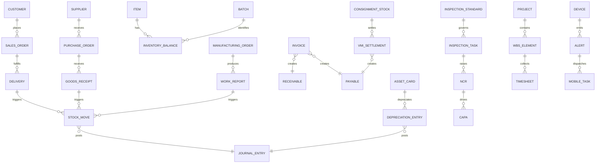

# 企业资源计划（ERP）系统需求规格说明书 v0.2.3

> 状态：设计修订稿，待评审
> 基线：`erp-epec-v0.1.md`
> 修订依据：KB-99 评论 `01a08143-a1ce-7824-b039-bfa61c770a77`《ERP 系统需求规格说明书 v0.1 - 评审报告》
> 变更核验：`erp-epec-v0.2-changelog.md`（2026-09-19 第二轮修订，处置 D-01 ~ D-09）


---

## 1. 引言

### 1.1 文档目的

本文档定义企业资源计划（Enterprise Resource Planning, ERP）系统的完整需求规格，作为需求分析、系统设计、开发与验收的依据。

### 1.2 读者对象

| 角色    | 关注内容         |
| ----- | ------------ |
| 项目经理  | 范围、进度、成本     |
| 业务负责人 | 业务流程、功能模块    |
| 架构师   | 技术架构、集成、扩展性  |
| 开发与测试 | 详细功能、接口、验收标准 |
| 运维与安全 | 性能、可靠性、合规    |

### 1.3 术语与缩写

#### 1.3.1 通用与治理

| 缩写 | 全称 | 中文 |
| --- | --- | --- |
| ERP | Enterprise Resource Planning | 企业资源计划 |
| MDM | Master Data Management | 主数据管理 |
| WBS | Work Breakdown Structure | 工作分解结构 |
| CCB | Change Control Board | 变更控制委员会 |
| PMO | Project Management Office | 项目管理办公室 |
| SLA | Service Level Agreement | 服务级别协议 |
| SOP | Standard Operating Procedure | 标准作业流程 |
| KPI | Key Performance Indicator | 关键绩效指标 |
| ROI | Return on Investment | 投资回报率 |
| TCO | Total Cost of Ownership | 总拥有成本 |
| RBAC | Role-Based Access Control | 基于角色的访问控制 |
| ABAC | Attribute-Based Access Control | 基于属性的访问控制 |
| CQRS | Command Query Responsibility Segregation | 命令查询职责分离 |
| Outbox | Transactional Outbox | 事务性发件箱模式 |

#### 1.3.2 采购、销售与供应链

| 缩写 | 全称 | 中文 |
| --- | --- | --- |
| PR / PO | Purchase Requisition / Purchase Order | 请购单 / 采购订单 |
| RFQ | Request for Quotation | 询价单 |
| MOQ | Minimum Order Quantity | 最小起订量 |
| ASN / DESADV | Advance Shipping Notice / Despatch Advice | 预先发货通知 / EDI 发货通知报文 |
| EDI | Electronic Data Interchange | 电子数据交换 |
| VMI | Vendor Managed Inventory | 供应商管理库存 |
| CPFR | Collaborative Planning, Forecasting and Replenishment | 协同规划、预测与补货 |
| ROP / EOQ | Reorder Point / Economic Order Quantity | 再订货点 / 经济订货批量 |
| SO | Sales Order | 销售订单 |
| ATP | Available to Promise | 可承诺量 |
| RMA | Return Merchandise Authorization | 退货授权 |
| OTD / DSO | On-Time Delivery / Days Sales Outstanding | 准时交付率 / 应收账款周转天数 |

#### 1.3.3 生产、库存与质量

| 缩写 | 全称 | 中文 |
| --- | --- | --- |
| MRP / MRPII | Material / Manufacturing Resource Planning | 物料 / 制造资源计划 |
| BOM | Bill of Materials | 物料清单 |
| MO | Manufacturing Order | 生产工单 |
| Routing | Manufacturing Routing | 工艺路线 |
| SKU / SPU | Stock Keeping Unit / Standard Product Unit | 库存单位 / 标准产品单元 |
| WMS | Warehouse Management System | 仓储管理系统 |
| FIFO / FEFO | First In First Out / First Expired First Out | 先进先出 / 先到期先出 |
| NPI | New Product Introduction | 新产品导入 |
| EVT / DVT / PVT | Engineering / Design / Production Verification Test | 工程 / 设计 / 生产验证测试 |
| SPC | Statistical Process Control | 统计过程控制 |
| OEE | Overall Equipment Effectiveness | 设备综合效率 |
| QMS | Quality Management System | 质量管理体系 |
| IQC / IPQC / OQC | Incoming / In-Process / Outgoing Quality Control | 来料 / 过程 / 出货检验 |
| AQL | Acceptable Quality Limit | 可接受质量限 |
| NCR | Non-Conformance Report | 不合格品报告 |
| CAPA | Corrective and Preventive Action | 纠正与预防措施 |
| SCAR | Supplier Corrective Action Request | 供应商纠正措施要求 |
| COPQ | Cost of Poor Quality | 质量损失成本 |
| CTQ | Critical to Quality | 关键质量特性 |
| FMEA | Failure Mode and Effects Analysis | 失效模式与影响分析 |
| CIP | Continuous Improvement Process | 持续改进流程 |
| 8D | Eight Disciplines | 八步法质量问题解决流程 |

#### 1.3.4 财务、资产、人力与技术

| 缩写 | 全称 | 中文 |
| --- | --- | --- |
| GL / AR / AP | General Ledger / Accounts Receivable / Accounts Payable | 总账 / 应收账款 / 应付账款 |
| COGS | Cost of Goods Sold | 销售成本 |
| NBV | Net Book Value | 账面净值 |
| EAM | Enterprise Asset Management | 企业资产管理 |
| IFRS / IAS | International Financial Reporting / Accounting Standards | 国际财务报告 / 会计准则 |
| VAT | Value Added Tax | 增值税 |
| HR | Human Resources | 人力资源 |
| UAR | User Access Review | 用户权限复核 |
| API / REST / JSON / XML | Application Programming Interface / Representational State Transfer / JavaScript Object Notation / Extensible Markup Language | 应用接口 / REST 架构风格 / JSON / XML 数据格式 |
| CSV / SFTP | Comma-Separated Values / SSH File Transfer Protocol | 逗号分隔值 / SSH 文件传输协议 |
| HMAC / AES / TLS | Hash-based Message Authentication Code / Advanced Encryption Standard / Transport Layer Security | 哈希消息认证码 / 高级加密标准 / 传输层安全协议 |
| SSO | Single Sign-On | 单点登录 |
| DBA / BI / CRM / PM | Database Administrator / Business Intelligence / Customer Relationship Management / Project Management | 数据库管理员 / 商业智能 / 客户关系管理 / 项目管理 |
| MTBF / MTTR | Mean Time Between Failures / Mean Time To Repair | 平均故障间隔时间 / 平均修复时间 |
| RTO / RPO | Recovery Time Objective / Recovery Point Objective | 恢复时间目标 / 恢复点目标 |
| RFID / PDA / AGV | Radio Frequency Identification / Personal Digital Assistant / Automated Guided Vehicle | 射频识别 / 手持终端 / 自动导引车 |

#### 1.3.5 编号前缀

| 前缀 | 含义 | 权威定义 |
| --- | --- | --- |
| FR | Functional Requirement，功能需求 | 4.0.4 |
| BR | Business Rule，业务规则 | 4.0.4 |
| C | Control，业务卡控（质量约束类需求） | 4.0.1、4.0.4 |
| DC | Data Constraint，数据一致性约束 | 6.1 |
| S | Scenario，业务场景 | 各业务域 |
| TC | Test Case，测试用例 | 8.3 |
| PARAM | Configuration Parameter，配置参数 | 4.0.3 |
| R | Risk，风险 | 第 10 章 |

### 1.4 文档版本与变更控制

| 版本 | 日期 | 修订人 | 修订说明 |
| --- | --- | --- | --- |
| v0.1 | 2026-09-08 | 产品设计团队 | 初始需求规格说明书，完成全文评审 |
| v0.2 | 2026-09-12 | 01-Designer | 按 KB-99 评审报告闭环 P1-P3、M1-M5、L1-L5；补齐参数治理、模块索引、数据需求、接口契约、验收追溯与风险控制 |
| v0.2.1 | 2026-09-19 | 需求恢复修订 | 恢复 v0.1 中被删除的 24 条需求（16 BR + 8 C）与 109 条行内 BR 编号，补全 10 条被截断的规则文字，复原被改写的交叉引用与例外条款，恢复参数 `OFFLINE_WARN_RATIO`，并在 4.0.4 补充 FR 颗粒度声明；同步更正首轮核验的计数错误与 P1 闭环口径 |
| v0.2.2 | 2026-09-20 | 需求恢复修订（v0.1 差集）| 按 v0.1 vs v0.2 差集补录：(a) 恢复 14 条被剥离的"本条的可测试细则见 X"交叉引用声明；(b) 解决 BR-4.12-55~58 编号复用冲突，为 v0.1 的 4M 变更管理启用新号 BR-4.12-64~67（不违反 §1.4 编号保留规则），同步 S-4.12-09 关联 BR 列表与 §4.0.4 编号总览（4.12 BR 01~63 → 01~67；全量 BR 689 → 693）；(c) 恢复 BR-4.11-01 被削弱的幂等合并语义约束（按幂等记录为单位、禁止覆盖式合并、先合并后容差判定）。BR-4.1-07（唯一性范围）与 BR-4.12-01/02（表格→bullet）等有争议的语义变化不在本次范围，详见 `v0.1-vs-v0.2-diff-report.md`。 |
| v0.2.3 | 2026-09-20 | 需求回退与补录（v0.1 差集·待决策批）| 按 `v0.1-vs-v0.2-diff-report.md` 决策批处理：(a) G1 4 条（BR-4.13-11、BR-4.10-30、C-0-06、BR-4.9-21）回退到 v0.1 完整语义；(b) G2 18 条（BR-4.11-24、BR-4.11-21、BR-4.2-11、BR-4.2-27、BR-4.2-32、BR-4.3-04、BR-4.3-09、BR-4.3-11、BR-4.3-17、BR-4.3-34、BR-4.9-15、BR-4.12-03、BR-4.12-10、BR-4.12-17、BR-4.12-25、BR-4.12-28、BR-4.13-34、BR-4.14-19）回退到 v0.1；BR-4.14-19 回退后 `INPUT_TAX_CERTIFY_WARNING_DAYS` 在 §4.14 参数表与 C-4.14-07 中仍保留，与 BR 层脱钩；(c) G3 以新号补录 v0.1 抽样强度模型 BR-4.2-53、BR-4.12-68（不与 v0.2 `INSPECTION_SAMPLE_RATE` 绝对百分比模型冲突，双模型并存，业务侧待决策）；(d) G4 5 条（BR-4.12-01/02/04/05/06）保留 v0.2 内容，将 §4.12 业务规则 6 条 bullet 恢复为 v0.1 六列表格结构。§4.0.4 编号总览：4.2 BR 01~52 → 01~53；4.12 BR 01~67 → 01~68；全量 BR 693 → 695。 |

**变更控制规则**

- 版本号采用 `v<主>.<次>`；范围或基线发生重大变化时递增主版本，评审修订与补充说明递增次版本。
- 已发布的 `FR / BR / C / DC / S / TC / R` 编号不得复用或重排；规则作废时保留编号并标注"已作废"，规则被合并时保留原编号并标注"已并入 X"（执行语义以并入目标为准，详见 4.0.4）。
- 所有需求、参数和接口契约变更须同步更新受影响章节、追溯矩阵和变更日志。
- 对外发布版本、OpenAPI/Schema、参数清单与评审记录须先归档；未归档不得发布（C-0-01）。

---

## 2. 项目背景与目标

### 2.1 背景

企业现有业务分散于多个独立系统（财务、进销存、生产、CRM），数据孤岛严重，缺乏统一主数据与全局视图。本项目旨在建设一体化 ERP 平台。

### 2.2 目标

- 统一主数据管理（MDM）
- 覆盖计划、采购、生产、销售、库存、质量、资产、财务、税务、HR 等核心域
- 提供实时决策支持与可扩展集成能力
- 满足多组织/多法人主体/多币种核算需求

### 2.3 范围与约束

- 支持多语言（中/英，预留日语等扩展，详见 5.7）、多币种、多税率
- 部署于私有云/混合云，数据主权与安全合规
- 关键业务流程可配置化（低代码流程引擎）
- 所有阈值类规则必须参数化，禁止硬编码（见 4.0.3）

---

## 3. 系统总体架构

### 3.1 逻辑分层

```
┌───────────────────────────────┐
│  决策支持 / BI / 报表        │
├───────────────────────────────┤
│  应用模块（业务域）          │
│  采购·销售·生产·库存·质量   │
│  资产·财务·税务·HR·项目     │
├───────────────────────────────┤
│  平台服务：主数据、工作流、 │
│  权限、审计、消息、集成     │
├───────────────────────────────┤
│  基础设施：计算、存储、    │
│  缓存、消息总线、日志      │
└───────────────────────────────┘
```

### 3.2 技术架构原则

- 微服务化 + 事件驱动（Event Sourcing / CQRS）
- 无状态扩展，水平分片
- 读写分离，最终一致性
- 全链路可观测（Trace/Metrics/Logs）

### 3.3 关键平台服务

第 4 章各业务域共同依赖以下平台服务，其需求集中定义于第 5 章（5.5–5.8），各业务域通过引用方式使用，不重复描述。

| 平台服务          | 服务对象        | 说明                                   | 详见      |
| ------------- | ----------- | ------------------------------------ | ------- |
| 主数据服务         | 全部业务域       | 唯一权威源 + 版本快照 + 缓存失效事件                | 4.1     |
| 工作流引擎         | 审批/申诉/仲裁/复核 | 双人复核、升级审批、变更窗口外审批                    | 5.6     |
| 权限与审计         | 全部业务域       | RBAC + ABAC，行级/列级权限，审计留痕             | 5.3、5.6 |
| 消息总线 / Outbox | 跨域事件        | 统一事件契约、幂等消费、至少一次投递                   | 7.2     |
| 集成网关          | 门户/EDI/API  | OAuth2.0、API Key + HMAC-SHA256、令牌桶限流 | 5.5     |
| 规则引擎          | 价格/税率/审批/阈值 | 配置化，参数集中管理（4.0.3）                    | 5.4     |

---

## 4. 业务域与功能需求

### 4.0 全局通用约定

#### 4.0.1 业务卡控级别定义

业务卡控级别统一为 5 级，各业务域与平台域卡控表均按下表标注：

| 级别     | 名称   | 语义                                          |
| ------ | ---- | ------------------------------------------- |
| **L1** | 硬阻断  | 不满足则禁止继续，无绕过路径（含"校验""必填校验""逻辑约束"中不通过即失败的情形） |
| **L2** | 强制审批 | 可继续，但须经审批或流程确认                              |
| **L3** | 系统自动 | 系统按规则自动判定、告警或升级，无需人工介入                      |
| **L4** | 系统提示 | 仅提示，不阻断、不审批                                 |
| **L5** | 审计留痕 | 动作可执行，但必须完整留痕、可追溯                           |

#### 4.0.2 全局卡控清单（C-0-xx）

以下卡控在多个业务域重复出现，统一定义为全局卡控。各业务域与平台域卡控表中以「（全局卡控 C-0-xx）」形式直接引用，确保逐域阅读时清单完整，又避免重复维护。

| 卡控编号       | 控制内容                                                                          | 级别      |
| ---------- | ----------------------------------------------------------------------------- | ------- |
| **C-0-01** | 对外发布物（SLA 报告、对外报表、接口报告）须先完成版本归档，未归档不得对外发布                                     | L1 硬阻断  |
| **C-0-02** | 数量/金额差异默认容差 ±0.5%（参数 `TOLERANCE_DEFAULT`），容差内自动核销，超出走差异单并留痕                   | L3 系统自动 |
| **C-0-03** | 关键变更须双人复核；复核人与发起人不得为同一人，且不得互为授权代理人                                            | L2 强制审批 |
| **C-0-04** | 关键操作须记录 User/Action/Object/BeforeValue/AfterValue/Timestamp，日志不可篡改，保留 ≥ 180 天 | L5 审计留痕 |
| **C-0-05** | 已被业务单据引用的对象禁止硬删，仅可停用或归档                                                       | L1 硬阻断  |
| **C-0-06** | 并发冲突判定：先比较版本号（按 `Major.Minor` **分段数值**比较，大者胜），版本号相同再比较时间戳（晚者胜）；跨域事件须携带幂等键，消费端按幂等键去重                  | L3 系统自动 |
| **C-0-07** | 所有查询与导出须执行行级权限（法人主体/组织/部门/角色）与列级权限（敏感字段脱敏）校验                                  | L1 硬阻断  |
| **C-0-08** | 所有交易单据须携带法人主体、组织单元、交易币种与记账币种；缺失则不允许过账                                         | L1 硬阻断  |

**全局卡控引用域清单**

各域继承全局卡控语义，并在本域卡控条目中补充触发条件和处置动作。全局卡控编号是唯一权威编号，域内重复引用不得改变其语义。

| 全局卡控 | 引用域 | 域内实现要求 |
| --- | --- | --- |
| C-0-01 | 4.9、4.10、4.11、5.5、5.6、5.7、5.8 | 接口契约、报表、语言包、SLA 报告等对外发布物须先归档，发布门禁校验归档版本与校验和 |
| C-0-02 | 4.2、4.3、4.4、4.6、4.7、4.9、4.10、4.11、5.5、5.8 | 数量/金额差异统一取 `TOLERANCE_DEFAULT`；域内专用比例参数不得替代该全局容差 |
| C-0-03 | 4.1、4.4、4.5、4.6、4.7、4.8、4.11、4.12、4.13、5.3、5.5、5.6、5.8 | 双人复核须校验职责分离；复核人、发起人和授权代理人不得形成同一自然人闭环 |
| C-0-04 | 全部业务域与平台域 | 审计字段统一为 User/Action/Object/BeforeValue/AfterValue/Timestamp，日志防篡改并按参数下限保留 |
| C-0-05 | 4.1、4.8、4.10、4.12、5.5、5.6、5.7、5.8 | 禁止物理删除；接口契约、报表、标准、账号、语言包等对象只能停用、退役或归档 |
| C-0-06 | 4.1、4.9、4.11、5.2、5.5、5.8 | 版本号按分段数值比较；同版本再比较时间戳；事件消费按幂等键去重 |
| C-0-07 | 4.2、4.9、4.10、4.11、5.3、5.5、5.6、5.8 | 查询、导出、接口返回和移动端访问均执行行列级权限与脱敏，规则异常按最小权限拒绝 |
| C-0-08 | 4.6、5.5、5.6、5.7、5.8 | 交易和过账上下文必须携带法人主体、组织单元、交易币种与记账币种，缺失即 L1 阻断 |

> **参数命名澄清**：`TOLERANCE_DEFAULT`（数量/金额差异容差）与 `COST_TOLERANCE`（项目成本偏差阈值）虽然默认值均为 0.5%，但语义不同，不得互换。`PRICE_TOLERANCE` 仅用于合同价上浮控制，也不得替代 C-0-02。

#### 4.0.3 全局配置参数表

所有阈值类规则统一由规则引擎参数化管理（第 5.4 节），禁止在代码中硬编码。下表是全文参数编码的唯一权威清单；每个参数均须登记业务 Owner、技术 Owner、审批角色和生效机制。跨域参数的 Owner 取"业务 Owner"列的第一责任域。

| 参数编码 | 参数名 | 默认值 | 业务 Owner | 技术 Owner | 审批角色 | 生效机制 |
| --- | --- | --- | --- | --- | --- | --- |
| `TOLERANCE_DEFAULT` | 数量/金额差异容差 | 0.5% | 财务负责人 | 规则引擎负责人 | CCB | 在线调整并立即生效；变更前后值全量留痕 |
| `PURCHASE_BUDGET_TRIGGER` | 采购预算升级阈值 | 110% | 采购负责人 | 规则引擎负责人 | CCB | 提交后规则版本化，下一业务事务生效 |
| `PRICE_TOLERANCE` | 合同价上浮容差 | 5% | 采购负责人 | 规则引擎负责人 | CCB | 在线调整；生效中的合同按快照口径不追溯 |
| `MIN_QUOTE_COUNT` | 询价最少供应商数 | 3 家 | 采购负责人 | 规则引擎负责人 | 采购总监 | 在线调整并立即生效 |
| `INSPECTION_SAMPLE_RATE` | 风险等级抽检比例 | A=100% / B=50% / C=20% | 质量负责人 | 质量平台负责人 | 质量总监 | 下次检验任务创建时生效 |
| `AQL_LEVEL` | 抽样方案与可接受质量限 | GB/T 2828.1 一般检验水平 II | 质量负责人 | 质量平台负责人 | 质量总监 | 新检验标准或新任务生效，历史记录保留原版本 |
| `CAPACITY_LOAD_TRIGGER` | 产能负荷预警阈值 | 110% | 生产计划负责人 | 计划引擎负责人 | 生产运营负责人 | 下一次 MRP 或派工计算生效 |
| `YIELD_TOLERANCE` | 良率偏差预警阈值 | 10% | 生产质量负责人 | 质量平台负责人 | 生产与质量负责人 | 下一次报工判定生效 |
| `WORKHOUR_DEVIATION_ALERT` | 报工工时偏差预警阈值 | 50% | 生产负责人 | MES 负责人 | 生产运营负责人 | 下一次报工判定生效 |
| `COST_TOLERANCE` | 项目成本偏差阈值 | 0.5% | 项目财务负责人 | 项目平台负责人 | PMO 与财务负责人 | 下一成本归集周期生效 |
| `HOURS_TOLERANCE` | 项目工时偏差阈值 | 10% | PMO 负责人 | 项目平台负责人 | PMO 负责人 | 下一工时审核周期生效 |
| `EXPIRY_LOCK_RATIO` | 效期锁定比例 | 有效期的 50% | 库存负责人 | WMS 负责人 | 供应链与质量负责人 | 下一次库存扫描生效 |
| `SAFETY_DAYS` | ATP 安全库存天数 | 30 天 | 销售运营负责人 | 计划引擎负责人 | 销售与供应链负责人 | 下一次 ATP 计算生效 |
| `MIN_REMAINING_SHELF_DAYS` | 出库效期冗余最低剩余天数 | 30 天 | 库存负责人 | WMS 负责人 | 供应链与质量负责人 | 下一次出库策略计算生效 |
| `SLA_SYNC_THRESHOLD` | 订单/库存/对账同步延迟阈值 | 5 分钟 | 集成负责人 | 平台运维负责人 | 运维与业务负责人 | 立即生效并触发规则版本更新 |
| `EDI_PROCESS_TIMEOUT_MIN` | EDI 报文处理时效上限 | 30 分钟 | 供应链协同负责人 | 集成平台负责人 | 供应链与集成负责人 | 下一次接入连接器生效 |
| `EXPORT_ROW_LIMIT` | 导出审批行数阈值 | 10,000 行 | 数据治理负责人 | BI 平台负责人 | 数据治理与安全负责人 | 下一次导出任务生效 |
| `OFFLINE_WARN_RATIO` | 离线缓存预警阈值比例（占最长时长） | 80% | 移动应用负责人 | 移动平台负责人 | 业务与安全负责人 | 终端下次同步配置时生效 |
| `OFFLINE_SYNC_MAX_HOURS` | 离线缓存最长时长 | 72 小时 | 移动应用负责人 | 移动平台负责人 | 业务与安全负责人 | 终端下次同步配置时生效 |
| `API_RETRY_MAX` | 接口失败最大重试次数 | 3 次 | 集成负责人 | 集成平台负责人 | 集成架构委员会 | 下一次消息投递生效 |
| `RATE_LIMIT_QPS` | 接口限流 | 战略 500 / 普通 100 / 新伙伴 30 次/分钟 | 集成负责人 | API 网关负责人 | 集成架构委员会与安全负责人 | 网关配置热更新后立即生效 |
| `ESCALATION_RESPONSE_MIN` | 各级升级响应时限 | 30 分钟 | 运维负责人 | 监控平台负责人 | 运维负责人 | 立即生效 |
| `AUDIT_RETENTION_DAYS` | 审计日志保留天数 | 180 天，最小可配置值 180 天 | 内审负责人 | 安全平台负责人 | 内审与 DPO | 只允许延长，不允许低于法定下限 |
| `NCR_CLOSE_DAYS` | 不合格品报告处置完成时限 | 30 天 | 质量负责人 | QMS 负责人 | 质量总监 | 新建 NCR 按最新值计时 |
| `DEPRECIATION_RESIDUAL_ALERT` | 残值异常预警阈值（占 NBV） | 10% | 财务会计负责人 | 财务平台负责人 | 财务负责人 | 下一折旧计算生效 |
| `ITEM_NAME_MAX_LEN` | 物料名称最大长度 | 60 字符 | 主数据负责人 | MDM 负责人 | 主数据治理委员会 | 下一次名称保存校验生效 |
| `CERT_EXPIRY_ALERT_DAYS` | 资质证照到期预警提前天数 | 30 天 | 主数据负责人 | MDM 负责人 | 主数据治理委员会 | 下一次到期巡检生效 |
| `VMI_AGING_LIMIT_DAYS` | 寄售库存账龄处置阈值 | 180 天 | 采购负责人 | 采购平台负责人 | 采购与供应链负责人 | 下一结算周期生效 |
| `EMERGENCY_FILL_DAYS` | 紧急采购比价资料补齐时限 | 5 个工作日 | 采购合规负责人 | 采购平台负责人 | 采购总监与合规负责人 | 新紧急采购单按最新值计时 |
| `MIN_MARGIN_RATE` | 最低毛利阈值（成本加成率） | 5% | 销售运营负责人 | S&D 负责人 | 销售与财务负责人 | 下一报价或订单校验生效 |
| `GROUP_CREDIT_LIMIT_RATIO` | 集团客户子公司可用额度折算比例 | 100% | 信用管理负责人 | 主数据与销售平台负责人 | 财务与销售负责人 | 下一次信用校验生效 |
| `SAMPLE_ORDER_RATIO` | 样品单数量上限（占标准 MOQ） | 20% | 销售运营负责人 | S&D 负责人 | 销售负责人 | 下一张样品单生效 |
| `SLOW_MOVING_AGE_DAYS` | 呆滞料库龄阈值 | 180 天 | 库存负责人 | WMS 负责人 | 供应链与财务负责人 | 下一次呆滞扫描生效 |
| `TRANSIT_ALERT_DAYS` | 跨法人调拨在途超期阈值 | 30 天 | 库存负责人 | WMS 负责人 | 供应链与财务负责人 | 下一批次在途监控生效 |
| `COMP_TIME_VALID_MONTHS` | 调休额度有效期 | 6 个月 | HR 负责人 | HR 平台负责人 | HR 总监 | 新生成额度按最新值计时 |
| `CPFR_DEVIATION_THRESHOLD` | CPFR 协同分歧阈值 | 10% | 供应链协同负责人 | SCM 平台负责人 | 供应链负责人 | 下一协同周期生效 |
| `ADHOC_DAILY_QUOTA` | 即席查询每日配额 | 50 次/日 | BI 数据治理负责人 | BI 平台负责人 | 数据治理负责人 | 次日 00:00 或手动刷新后生效 |
| `ADHOC_QUERY_TIMEOUT` | 即席查询执行超时 | 120 秒 | BI 平台负责人 | 数据平台负责人 | 数据治理负责人 | 下一次查询执行生效 |
| `CAPITALIZATION_GRACE_DAYS` | 转资超期预警宽限期 | 30 天 | 资产负责人 | EAM 负责人 | 财务与资产负责人 | 下一次转资巡检生效 |
| `API_KEY_ROTATE_DAYS` | API 凭证有效期（轮换周期） | 90 天 | 集成负责人 | API 网关负责人 | 安全与集成负责人 | 新签发凭证立即生效，存量按登记到期日 |
| `API_SUNSET_NOTICE_DAYS` | 接口版本废弃预告期 | 30 天 | 集成架构师 | API 网关负责人 | 集成架构委员会 | 下一版本废弃公告生效 |
| `API_CONCURRENCY_LIMIT` | 接口并发配额（按调用方分级） | 战略 50 / 普通 20 / 新伙伴 5 | 集成负责人 | API 网关负责人 | 集成架构委员会 | 网关热更新后立即生效 |
| `API_DAILY_QUOTA` | 接口日调用配额（按调用方分级） | 战略 50 万 / 普通 10 万 / 新伙伴 1 万次/日 | 集成负责人 | API 网关负责人 | 集成架构委员会 | 网关热更新后立即生效 |
| `CIRCUIT_BREAK_ERROR_RATE` | 接口熔断失败率阈值 | 50% | 集成负责人 | API 网关负责人 | 集成架构委员会 | 下一熔断统计窗口生效 |
| `CIRCUIT_BREAK_WINDOW_MIN` | 接口熔断滚动观察窗口 | 5 分钟 | 集成负责人 | API 网关负责人 | 集成架构委员会 | 下一熔断统计窗口生效 |
| `BREAK_GLASS_MAX_HOURS` | Break-Glass 紧急权限时长上限 | 2 小时 | 安全负责人 | IAM 平台负责人 | 安全负责人与内审 | 下一次 Break-Glass 申请生效 |
| `UAR_CYCLE_DAYS` | 用户权限复核周期 | 90 天 | 安全负责人 | IAM 平台负责人 | 安全负责人与内审 | 下一复核任务生成周期生效 |
| `AUTHZ_DENY_BURST_THRESHOLD` | 越权探测告警阈值 | 10 次/5 分钟 | 安全负责人 | IAM 平台负责人 | 安全负责人 | 下一告警统计窗口生效 |
| `ACCOUNT_RECLAIM_HOURS` | 离职账号回收时限 | 24 小时 | 安全负责人 | IAM 平台负责人 | 安全负责人与 HR | 下一次离职回收任务生效 |
| `TRANSLATION_COVERAGE_MIN` | 翻译总体覆盖率门槛 | 99% | 本地化负责人 | i18n 平台负责人 | 本地化负责人 | 下一次语言包发布预检生效 |
| `I18N_FALLBACK_LOCALE` | 缺失翻译回退语种 | `zh-CN` | 本地化负责人 | i18n 平台负责人 | 本地化负责人 | 下一语言包版本生效 |
| `I18N_CANARY_WINDOW_HOURS` | 语言包灰度观察窗口 | 24 小时 | 本地化负责人 | i18n 平台负责人 | 本地化负责人 | 下一次灰度发布生效 |
| `TAX_ROUNDING_SCOPE` | 多币种计税取整口径 | `LINE`（单行计税后汇总） | 税务负责人 | 税务平台负责人 | 税务与财务负责人 | 下一计税事务生效，历史凭证不追溯 |
| `INPUT_TAX_CERTIFY_DAYS` | 进项发票认证抵扣期限 | 360 天 | 税务负责人 | 税务平台负责人 | 税务负责人 | 下一认证任务生效 |
| `INPUT_TAX_CERTIFY_WARNING_DAYS` | 进项发票认证到期预警提前天数 | 30 天 | 税务负责人 | 税务平台负责人 | 税务负责人 | 下一认证监控周期生效 |
| `MAINT_BUDGET_DEVIATION` | 维修成本与维护预算偏差阈值 | 10% | 资产负责人 | EAM 负责人 | 资产与财务负责人 | 下一成本归集周期生效 |
| `ASSET_COUNT_SAMPLE_RATE` | 资产抽盘比例（按风险等级） | 高 50% / 中 30% / 低 10% | 资产负责人 | EAM 负责人 | 财务与资产负责人 | 下一盘点计划生效 |
| `P1_RESPONSE_MIN` | P1 故障响应时限 | 15 分钟 | 运维负责人 | 监控平台负责人 | 运维负责人 | 下一故障工单生效 |
| `ALERT_STORM_THRESHOLD` | 告警风暴判定阈值 | 200 条/分钟 | 运维负责人 | 监控平台负责人 | 运维负责人 | 下一告警统计窗口生效 |
| `CAPACITY_UTIL_THRESHOLD` | 容量利用率预警阈值 | 80% | 运维负责人 | 监控平台负责人 | 运维与架构负责人 | 下一采集周期生效 |
| `DR_DRILL_INTERVAL_MONTHS` | 灾备演练周期 | 6 个月 | 运维负责人 | 灾备平台负责人 | 运维与业务连续性负责人 | 下一演练排期生效 |
| `SLA_TARGET_AVAILABILITY` | 月度可用率目标 | 99.9% | 运维负责人 | 监控平台负责人 | 运维与业务负责人 | 下一统计月生效 |

**参数治理规则**

| 治理项 | 规则 |
| --- | --- |
| 唯一清单 | 4.0.3 是跨域参数的权威清单；正文不得引用未登记编码，同一语义不得重复定义 |
| Owner | 参数须同时登记业务 Owner 与技术 Owner；跨域参数由第一责任域主责，其他域协办，争议提交 CCB |
| 新增与审批 | 业务 Owner 提出并完成影响分析，技术 Owner 评估实现与兼容性，CCB 或表中指定审批角色审批后登记 |
| 生效机制 | 规则引擎集中管理，在线调整后按表中机制生效，记录变更前后值、操作人、时间、理由和适用版本 |
| 合规下限 | 法规或卡控承诺的最小值不得因调参降低，例如 `AUDIT_RETENTION_DAYS` 不得低于 180 天 |
| 一致性核验 | 参数发布前执行全文引用扫描，核验"定义、默认值、引用位置、Owner、审批角色、生效机制"六项齐全 |

> **阈值边界**：影响跨域口径或需业务方定期调整的阈值必须进入本表。域内作业时限（审批、排队、预警时序等）可在对应域以参数编码登记，但不得以裸数字直接写入业务规则，且仍受 5.4 规则引擎与审计要求约束。

#### 4.0.4 需求编号与追溯约定

- **功能需求（FR）**：流程步骤表内每一行即一个功能需求，编号规则为 `FR-<章节号>-<流程序号>-<步骤号>`。流程序号按域内主流程序号取值，步骤号取步骤表行序。例如 `FR-4.3-5-5` 表示 4.3 销售与分销流程五（折扣矩阵）第 5 行。
- **业务规则（BR）**：统一编号 `BR-<章节号>-<两位序号>`，从 `01` 起连续编排；同一规则在正文和场景中重复引用时使用原编号，不另占号。
- **质量约束（C）**：卡控编号 `C-<章节号>-<两位序号>`，与 FR 或 BR 形成一对一或一对多关联；全局卡控使用 `C-0-xx`。
- **数据约束（DC）**：第 6 章数据一致性约束使用 `DC-xx`，纳入同一追溯链。
- **测试用例（TC）**：`TC-<需求编号>-<序号>`，序号分段见 8.3.2。
- **编号保留**：`BR / C` 规则被合并至其他编号时，原编号不得删除或复用；须在域内规则表中原位保留该编号，并在控制内容中标注「已并入 X」，执行语义以并入目标编号为准。
- **追溯链**：`FR / BR / C / DC → 设计文档 → TC → 验收要点`，需求管理工具以编号为主键维护，禁止仅以章节或自然语言标题关联。
- **SOP 格式**：所有标准作业流程表统一为"步骤 / 操作内容 / 操作要点 / 异常处理 / 涉及表单或凭证"五列；v0.2 已全文校验，四列旧格式为 0 处。

**编号总览**

| 域 / 章节 | FR 前缀 | BR 编号范围 | C 编号范围 |
| --- | --- | --- | --- |
| 4.1 MDM | `FR-4.1-` | `BR-4.1-01 ~ 34` | `C-4.1-01 ~ 16` |
| 4.2 采购 | `FR-4.2-` | `BR-4.2-01 ~ 53` | `C-4.2-01 ~ 15` |
| 4.3 S&D | `FR-4.3-` | `BR-4.3-01 ~ 71` | `C-4.3-01 ~ 15` |
| 4.4 库存 | `FR-4.4-` | `BR-4.4-01 ~ 53` | `C-4.4-01 ~ 15` |
| 4.5 生产 | `FR-4.5-` | `BR-4.5-01 ~ 36` | `C-4.5-01 ~ 15` |
| 4.6 财务 | `FR-4.6-` | `BR-4.6-01 ~ 37` | `C-4.6-01 ~ 17` |
| 4.7 HR | `FR-4.7-` | `BR-4.7-01 ~ 21` | `C-4.7-01 ~ 15` |
| 4.8 CRM/PM | `FR-4.8-` | `BR-4.8-01 ~ 39` | `C-4.8-01 ~ 14` |
| 4.9 SCM | `FR-4.9-` | `BR-4.9-01 ~ 38` | `C-4.9-01 ~ 11` |
| 4.10 报表 | `FR-4.10-` | `BR-4.10-01 ~ 39` | `C-4.10-01 ~ 10` |
| 4.11 移动/IoT | `FR-4.11-` | `BR-4.11-01 ~ 55` | `C-4.11-01 ~ 18` |
| 4.12 质量 | `FR-4.12-` | `BR-4.12-01 ~ 68` | `C-4.12-01 ~ 21` |
| 4.13 资产 | `FR-4.13-` | `BR-4.13-01 ~ 44` | `C-4.13-01 ~ 13` |
| 4.14 税务 | `FR-4.14-` | `BR-4.14-01 ~ 45` | `C-4.14-01 ~ 14` |
| 5.5 集成 | `FR-5.5-` | `BR-5.5-01 ~ 16` | `C-5.5-01 ~ 11` |
| 5.6 系统管理 | `FR-5.6-` | `BR-5.6-01 ~ 16` | `C-5.6-01 ~ 12` |
| 5.7 i18n | `FR-5.7-` | `BR-5.7-01 ~ 14` | `C-5.7-01 ~ 10` |
| 5.8 运维 | `FR-5.8-` | `BR-5.8-01 ~ 16` | `C-5.8-01 ~ 10` |
| 全局 | - | - | `C-0-01 ~ 08` |

> v0.2 对全文 `BR` / `C` 编号区间做了连续性扫描：18 个编号域的 BR 与 C 编号均自 `01` 起连续编排，无缺号、无跳号；编号不表示规则优先级。
> v0.2.2 勘误：4.5 ~ 4.8 四域的 BR 区间因 v0.2.1 恢复行内编号后未同步本表而失实，已按全文重扫结果更正（36 / 37 / 21 / 39）；4.12 域因编号复用冲突（BR-4.12-55~58 被"标准版本治理"占用，v0.1 的"4M 变更管理"4 条规则失去载体），本次以 BR-4.12-64~67 新号回归。v0.2.3 追加：4.2 域以 BR-4.2-53、4.12 域以 BR-4.12-68 新号补录 v0.1 的"AQL × 系数"抽样强度模型（与 v0.2 `INSPECTION_SAMPLE_RATE` 绝对百分比模型并列，参数语义冲突待业务决策）。更正后全量 BR 共 695 条；18 域仍无缺号、无跳号。
> **FR 悬空前缀声明**：`FR-5.5-*` ~ `FR-5.8-*` 为平台域预留前缀，v0.2.2 起正文尚无实例（平台需求现以 BR/C 承载）。启用时须先在本表登记实际区间，禁止引用未登记的具体 FR 编号。

**FR 颗粒度声明**

各域对「流程步骤」的切分粒度不一致，属已知差异（非缺号）。按文档形态分两类：

| 切分形态 | 域 | 流程数 | FR 数 | 平均步骤数 / 流程 |
| --- | --- | ---: | ---: | ---: |
| 行内编号列表 | 4.1 MDM | 6 | 24 | 4.0 |
| 行内编号列表 | 4.2 采购 | 10 | 22 | 2.2 |
| SOP 五列表 | 4.3 S&D | 11 | 68 | 6.2 |
| SOP 五列表 | 4.4 ~ 4.14 | 7 ~ 10 | 37 ~ 62 | 5.2 ~ 7.8 |

后果与约束：

- `FR-4.2-1-1` 与 `FR-4.5-1-1` 所对应的需求颗粒度不可比：4.2 的单个 FR 所覆盖的信息量约相当于 4.5 的 2 ~ 3 个 FR。
- 跨域工时估算与测试用例规模推算**不得**直接以 FR 计数汇总，须按域系数修正或改用「流程数」口径。
- 是否统一为「一流程一步骤一 FR」口径，须在需求管理工具落地前决策；若统一，须走本节编号变更流程并同步 8.3.3 追溯矩阵，不得就地重排既有编号。

#### 4.0.5 模块编号速查索引

跨模块引用统一使用模块名与下表编号，不得使用旧编号、简称或根据章节顺序推断。平台域引用同样使用明确的 `5.x` 编号。

| 编号 | 模块 | 英文 / 简称 | 主要编号前缀 |
| --- | --- | --- | --- |
| 4.1 | 主数据管理 | MDM | `FR-4.1-*`、`BR-4.1-*`、`C-4.1-*` |
| 4.2 | 采购管理 | Procurement | `FR-4.2-*`、`BR-4.2-*`、`C-4.2-*` |
| 4.3 | 销售与分销 | S&D | `FR-4.3-*`、`BR-4.3-*`、`C-4.3-*` |
| 4.4 | 库存与仓储 | WMS | `FR-4.4-*`、`BR-4.4-*`、`C-4.4-*` |
| 4.5 | 生产与制造 | Mfg / MRP | `FR-4.5-*`、`BR-4.5-*`、`C-4.5-*` |
| 4.6 | 财务 | Finance | `FR-4.6-*`、`BR-4.6-*`、`C-4.6-*` |
| 4.7 | 人力资源 | HR | `FR-4.7-*`、`BR-4.7-*`、`C-4.7-*` |
| 4.8 | CRM / 项目与研发 | CRM / R&D / PM | `FR-4.8-*`、`BR-4.8-*`、`C-4.8-*` |
| 4.9 | 供应链协同 | SCM | `FR-4.9-*`、`BR-4.9-*`、`C-4.9-*` |
| 4.10 | 报表与 BI | Reporting / BI | `FR-4.10-*`、`BR-4.10-*`、`C-4.10-*` |
| 4.11 | 移动与物联网 | Mobile / IoT | `FR-4.11-*`、`BR-4.11-*`、`C-4.11-*` |
| 4.12 | 质量管理 | QMS | `FR-4.12-*`、`BR-4.12-*`、`C-4.12-*` |
| 4.13 | 资产管理 | EAM | `FR-4.13-*`、`BR-4.13-*`、`C-4.13-*` |
| 4.14 | 税务合规 | Tax Compliance | `FR-4.14-*`、`BR-4.14-*`、`C-4.14-*` |
| 5.5 | 集成与门户 | Portal / EDI | `FR-5.5-*`、`BR-5.5-*`、`C-5.5-*` |
| 5.6 | 系统管理与审计 | Admin / Audit | `FR-5.6-*`、`BR-5.6-*`、`C-5.6-*` |
| 5.7 | 国际化与本地化 | i18n / L10n | `FR-5.7-*`、`BR-5.7-*`、`C-5.7-*` |
| 5.8 | 运维与 SLA | Ops / SLA | `FR-5.8-*`、`BR-5.8-*`、`C-5.8-*` |

**常见误引对照**

| 错误写法 | 正确写法 | 说明 |
| --- | --- | --- |
| 销售与分销(4.1) | 销售与分销(4.3) | 4.1 是主数据管理 |
| 库存与仓储(4.3) | 库存与仓储(4.4) | 4.3 是销售与分销 |
| 质量(4.4) | 质量(4.12) | 4.4 是库存与仓储 |
| 采购(4.4) | 采购(4.2) | 4.4 是库存与仓储 |
| 资产(4.8) | 资产(4.13) | 4.8 是 CRM / 项目与研发 |
| 成本管理(4.9) | 财务(4.6) | 成本管理归财务域 |

> v0.2 已对全文模块编号引用执行扫描，修正生产、财务、质量、资产和移动域中混用的已知旧编号；新增引用须以本索引为唯一校验依据。

---


### 4.1 主数据管理（MDM）

**业务描述**

主数据管理（Master Data Management，MDM）模块是整个ERP系统的数据基石，负责集中维护和治理组织架构、物料主数据、客户/供应商主数据、汇率、税率等核心基础数据，为采购、销售、库存、生产、财务等所有业务域提供唯一权威数据源（Single Source of Truth）。

主数据的质量直接决定了下游业务流程的准确性和效率。物料编码不规范会导致采购错误、BOM拆解混乱；供应商信息不完整会影响采购审批和付款流程；汇率/税率维护不及时会造成财务核算偏差。因此，MDM模块采用"集中管控、分权维护、审批发布"的治理模式，确保所有主数据在创建、变更、停用的全生命周期内均可追溯、可审计、可回滚。

**用户角色 / 前置条件**

- 角色：主数据管理员、物料工程师、信用管理员、财务科目管理员
- 前置：已建立法人主体与成本中心；权限矩阵已发布

**业务范围**

MDM模块管理的核心主数据范围包括：

- **组织架构**：法人主体、成本中心、利润中心、工厂、仓库等组织单元的创建、变更与停用管理
- **物料主数据**：原材料、半成品、成品、辅料等各类物料的编码、名称、规格、计量单位、物料分类、采购类型、存储条件等属性管理
- **客户/供应商主数据**：客户与供应商的基本信息、资质信息、财务信息、信用额度、付款条件等全生命周期管理
- **汇率管理**：多币种汇率的录入、生效日期管理、历史汇率保留、批量更新与合规校验
- **税率管理**：税码的创建、变更、生效日期管理、批量更新与合规校验
- **主数据版本控制**：所有主数据变更自动生成版本快照，支持版本对比与历史回溯
- **主数据集成与同步**：通过事件驱动机制向下游业务域同步主数据变更，确保数据一致性

**业务流程与业务逻辑**

**业务流程**

**流程一：物料主数据新建**

1. **FR-4.1-1-1** **发起**：物料工程师在MDM工作台点击"新建物料"，填写物料申请表单。必填项包括：物料编码（或选择系统自动编码）、物料名称、物料分类（参照物料分类树）、基本计量单位、物料组、采购类型（外购/自制/委外）、存储条件等。选填项包括：替代物料编码、安全库存量、采购提前期、批次管理标识等。
   - **SOP操作要点**：
     - 物料编码规则：成品=FG+4位分类码+6位流水号；原材料=RM+4位分类码+6位流水号；半成品=WIP+4位分类码+6位流水号。
     - 物料名称须遵循"通用名+规格型号+材质"的命名规范，例如"不锈钢管 DN50 304L"。
     - 计量单位须从预设的单位字典中选择，支持主单位和辅助单位的换算关系配置。
     - 分类选择时系统自动加载对应属性集模板，确保不同类别物料的关键属性不遗漏。
   - **异常处理**：若必填项未完成，表单前端校验拦截并标红提示；若物料名称包含特殊字符（如 `< > &`），系统过滤并提示修改。
   - **涉及表单/凭证**：《物料主数据申请表》（系统表单，含审批流痕迹）
2. **FR-4.1-1-2** **校验**：系统在提交时自动执行以下校验：
   - **唯一性校验**：编码全局唯一性检查（卡控 C-4.1-01）；名称+规格型号组合查重，若存在相似项则展示最近3条记录供申请人确认是否重复（卡控 C-4.1-07）。
   - **参照完整性校验**：检查所选物料组是否存在、计量单位是否有效、替代物料编码是否已发布。
   - **业务规则校验**：自制件必须关联BOM版本号（可后续补充）；批次管理物料必须填写保质期。
   - **SOP操作要点**：
     - 校验不通过时，系统以弹窗+高亮方式逐项提示校验失败原因，并提供"一键定位"跳转至问题字段。
     - 名称相似度匹配采用模糊匹配算法（编辑距离 ≤ 3），避免因微小差异导致重复创建。
   - **异常处理**：校验失败后退回草稿状态，申请人可修改后重新提交；若确实为新物料但名称相似，申请人可勾选"确认非重复"并填写差异说明。
3. **FR-4.1-1-3** **审批**：进入双人复核工作流（卡控 C-4.1-02）：
   - **第一级 - 部门审核**：物料工程师的直属主管审核物料信息的合理性和必要性，重点审核物料分类是否正确、属性是否完整。
   - **第二级 - 主数据管理员终审**：主数据管理员从全局视角审核编码规范性、分类一致性、以及与已有物料的关系是否清晰。
   - **SOP操作要点**：
     - 审批人须在收到审批任务后 **2个工作日** 内完成审批，超时系统自动提醒并升级至上级。
     - 审批时系统展示"变更影响分析"：该物料若创建，将影响哪些BOM、哪些采购框架协议等。
     - 任一环节驳回须填写驳回原因（下拉选择 + 自由文本），申请退回到申请人草稿状态。
   - **异常处理**：审批人离职或长期未处理时，系统支持审批代理机制和催办功能；若审批流程卡在某环节超过3个工作日，自动升级至该审批人的上级。
4. **FR-4.1-1-4** **发布**：审批通过后系统自动执行：
   - 生成版本号 `V1`（后续变更版本号递增为 V2、V3...）。
   - 写入生效日期（默认为当天，可指定未来日期）。
   - 将物料状态设置为 `Active`。
   - 触发缓存失效事件（Event Bus: `MDM.ITEM.PUBLISHED`）。
   - **SOP操作要点**：
     - 发布操作不可撤回，如需修改须走变更流程生成新版本。
     - 批量发布时逐条生成版本快照，确保单条失败不影响其他记录。
     - 指定未来生效日期的物料，当前状态显示为 `Pending`，到期自动切换为 `Active`。
   - **异常处理**：发布时若检测到并发修改冲突（卡控 C-4.1-05），系统以"最后时间戳 + 版本号"判定优先级，后提交者须重新获取最新版本后再编辑。
5. **FR-4.1-1-5** **通知与同步**：发布完成后系统自动执行：
   - 下游订阅者（采购模块、销售模块、库存模块）收到 `MDM.ITEM.PUBLISHED` 事件，自动刷新本地缓存。
   - 若物料设置了价目表关联，触发价目表重算任务。
   - 校验规则引擎更新可选物料清单。
   - **SOP操作要点**：
     - 通知采用"发布-订阅"模式，确保至少投递一次（at-least-once）。
     - 下游模块收到事件后记录处理日志，若处理失败自动重试（最多3次，间隔指数退避）。
   - **异常处理**：若下游模块处理失败超过3次，系统生成异常工单通知运维人员；主数据本身已发布成功，不受下游处理失败影响。
6. **FR-4.1-1-6** **归档与停用**：
   - **停用**：将物料状态标记为 `Inactive`（软删除），禁止硬删（卡控 C-4.1-03）。停用后新业务不可引用该物料，但历史单据中的引用仍然有效并正常展示。
   - **归档**：对于已无任何活跃引用的停用物料，可执行归档操作，将其迁移至归档库，释放主库性能资源。
   - **SOP操作要点**：
     - 停用前系统执行"影响分析"：列出当前所有活跃引用（未关闭的PO、SO、BOM等），确认无误后方可停用。
     - 停用后系统自动生成《物料停用通知单》，推送至采购、销售、库存等相关部门。
     - 归档操作仅主数据管理员有权限执行，且须填写归档原因。
   - **异常处理**：若物料仍有未完成的业务单据引用，系统以L1硬阻断拦截停用操作，并展示所有待完成引用列表。

**流程二：物料主数据变更**

1. **FR-4.1-2-1** **发起变更请求**：由业务角色（如采购员发现规格描述有误、研发需要增加技术参数）发起变更申请，填写变更原因、变更内容（系统自动对比新旧值的差异）。
2. **FR-4.1-2-2** **变更分类**：系统根据变更字段自动判断变更类型：
   - **关键属性变更**（如计量单位、物料分类、采购类型）：须走双人复核审批流。
   - **一般属性变更**（如描述、备注、扩展属性）：单人审批即可。
   - **编码相关字段**：编码创建后不可修改（卡控 C-4.1-01），如确需变更须走"新建+停用旧编码"流程。
3. **FR-4.1-2-3** **审批与发布**：审批通过后生成新版本号（N+1），写入生效日期，保留完整的变更历史和版本快照（卡控 C-4.1-06）。
4. **FR-4.1-2-4** **下游同步**：触发 `MDM.ITEM.UPDATED` 事件，下游模块收到事件后执行差异同步（仅更新变更字段）。

**流程三：汇率/税率维护**

1. **FR-4.1-3-1** **汇率更新**：财务科目管理员按月/按需更新外币汇率。每条汇率记录须包含：币种对（如 USD/CNY）、汇率类型（中间价/买入价/卖出价）、生效日期、失效日期、来源文件编号（如央行公告编号）（卡控 C-4.1-04）。
2. **FR-4.1-3-2** **税率更新**：税务管理员根据最新税收政策更新税码。每条税码记录须包含：税码编号、税率值、生效日期、适用范围（国内/出口/免税）、政策文号。
3. **FR-4.1-3-3** **批量导入**：支持通过Excel模板批量导入汇率/税率更新，系统逐行校验后批量发布。
4. **FR-4.1-3-4** **历史保留**：所有汇率/税率变更均保留完整历史记录，已发生的业务按当时生效的汇率/税率核算，不受后续更新影响。


**业务逻辑**

1. **编码生成规则**：支持自动编码和手动编码两种模式。自动编码按物料分类前缀+流水号生成，流水号在各分类内递增且不回收；手动编码须符合命名规范，系统实时校验格式。
2. **版本管理**：每次发布生成版本快照，版本号递增。支持任意两个版本的差异对比（逐字段高亮变化），支持一键回滚至历史版本（回滚操作本身生成新版本）。
3. **参照完整性**：删除/停用主数据前检查所有下游引用。引用链包括：BOM→物料、PO→供应商/物料、SO→客户/物料、库存→物料等。
4. **缓存策略**：主数据发布后触发缓存刷新，下游模块采用"本地缓存 + 事件驱动更新"模式，保证读取性能的同时确保数据时效性。缓存TTL默认30分钟，事件触发即时失效。
5. **权限控制**：不同主数据类型（物料/客户/供应商/汇率等）由不同角色维护，权限矩阵遵循最小权限原则。创建、审批、发布三权分立。


**业务场景描述**

主数据管理涵盖以下典型业务场景：

1. **新物料创建场景**：研发部门完成新产品设计后，物料工程师根据BOM清单发起新物料编码申请，包括原材料、半成品、成品等多种物料类型。每种物料类型有特定的属性集（如原材料需填写保质期、存储条件；成品需填写包装规格、条码信息等）。
2. **供应商准入场景**：采购部门完成新供应商考察后，供应商管理员在系统中创建供应商主数据，包括基本信息（名称、地址、联系方式）、资质信息（营业执照、行业认证）、财务信息（开户行、税号、付款条件）、以及合规信息（黑名单筛查结果、ESG评估等级）。
3. **客户信用额度调整场景**：销售部门根据客户历史交易数据和市场情况，申请调整客户信用额度。信用管理员审核后，新额度即时生效并同步至销售订单审批流程。
4. **汇率批量更新场景**：财务部门每月初根据央行公布的中间价，批量更新外币汇率。更新需指定生效日期，系统自动保留历史汇率用于已发生业务的核算。
5. **组织架构调整场景**：因业务重组，需要新增/合并/撤销法人主体或成本中心。此类变更影响范围广泛，需经过多级审批并在特定时间窗口内切换。
6. **物料停用/替代场景**：因供应商停产或产品升级，某些物料需要停用并指定替代物料。停用后新业务不可引用该物料，但历史单据仍可正常查询和展示。
7. **税务编码合规更新场景**：因国家税收政策调整（如税率变更、新增税种），需批量更新税码信息，并确保新旧税率在切换日期的无缝衔接。


**输入 / 输出**

- **输入**：物料申请表单、供应商准入申请、客户信用调整申请、汇率/税率更新文件（Excel/手动录入）、组织架构变更申请
- **输出**：已发布的主数据记录（含版本号和生效日期）、版本快照、变更事件（Event Bus消息）、审计日志、停用/归档通知单


**业务卡控**

| 卡控编号     | 控制内容                              | 级别      |
| -------- | --------------------------------- | ------- |
| C-4.1-01 | 编码全局唯一，创建后不可修改                    | L1 硬阻断  |
| C-4.1-02 | 关键属性变更须双人复核（全局卡控 C-0-03）          | L2 强制审批 |
| C-4.1-03 | 已引用对象禁止硬删，仅可停用/归档（全局卡控 C-0-05）    | L1 硬阻断  |
| C-4.1-04 | 汇率/税率变更须附生效日期与来源文件编号              | L1 硬阻断  |
| C-4.1-05 | 并发写入以"最后时间戳 + 版本号"判定（全局卡控 C-0-06） | L3 系统自动 |
| C-4.1-06 | 每次发布须生成版本快照并可回溯                   | L5 审计留痕 |
| C-4.1-07 | 编码重复时阻断并提示最近 3 条相似项               | L3 系统自动 |


**异常与边界**

| 异常场景          | 处理方式                        | 卡控       |
| ------------- | --------------------------- | -------- |
| 编码重复提交        | 阻断并展示最近3条相似项，提示确认是否重复       | C-4.1-07 |
| 并发编辑同一主数据     | 乐观锁机制，后提交者须重新获取最新版本         | C-4.1-05 |
| 停用仍被引用的主数据    | 硬阻断，展示所有活跃引用列表              | C-4.1-03 |
| 汇率/税率更新缺少生效日期 | 硬阻断，表单校验拦截                  | C-4.1-04 |
| 下游事件处理失败      | 自动重试3次，仍失败则生成运维工单           | -        |
| 审批超时未处理       | 2个工作日提醒，3个工作日升级至上级          | -        |
| 版本回滚导致数据冲突    | 回滚生成新版本（V(N+2)），不影响历史版本完整性  | C-4.1-06 |
| 批量导入部分失败      | 逐行校验，失败行标红，成功行正常发布，生成导入结果报告 | -        |


**界面要素**：列表 + 详情抽屉 + 批量导入（Excel）+ 版本对比视图

**数据对象**：`OrgUnit`, `ItemMaster`, `Customer`, `Supplier`, `ExchangeRate`, `TaxCode`

**集成点**：主数据变更触发采购/销售/库存的价目表重算；税码同步税务合规域（4.14）

**验收要点**：并发写入一致性；审计日志完整；版本回溯可还原任意历史时点

#### 增补：典型场景、业务流程与业务规则

##### 新增典型业务场景

1. **物料分类树重构场景**：因产品线整合或统计口径调整，需对物料分类树进行层级重构（新增/合并/迁移分类节点）。重构会影响分类前缀编码规则、属性集模板绑定及下游报表口径，须先在影子分类树上试运行并批量迁移存量物料，正式切换后旧分类仅保留只读视图。
2. **供应商合并/主数据去重场景**：集团并购或供应商更名后，同一实体在系统中存在多条供应商主数据（不同编码、不同付款条件）。主数据管理员发起合并申请，系统将源供应商的未清 PO、应付余额、资质文件迁移至目标供应商后，源供应商置为 `Inactive` 并永久禁止新业务引用。
3. **客户主数据跨法人共享场景**：集团下属多法人主体均与同一集团客户交易，客户主数据由集团层统一维护基础信息（名称、税号、信用评级），各法人仅维护本法人范围内的扩展视图（收货地址、价格协议、信用额度），避免多法人重复建档导致信用额度被多头占用。
4. **主数据批量清洗与字段标准化场景**：历史系统迁移或长期维护松散导致物料名称、规格、单位等字段格式不一。数据治理团队按字段标准模板批量清洗：系统自动识别不合规值并生成清洗建议清单，人工确认后批量改写并生成新版本快照，清洗前后支持抽样比对验证。

##### 新增业务流程

**流程四：物料分类树重构**

1. **FR-4.1-4-1** **重构方案设计**：主数据管理员在"分类树工作台"创建重构方案，以影子分类树方式设计新层级，逐节点标注：新增/合并/拆分/迁移类型，以及存量物料的映射规则（旧分类 → 新分类）。
   - **SOP操作要点**：
     - 影子分类树与正式分类树隔离存储，设计期间不影响任何在途业务。
     - 映射规则支持批量导入（Excel 模板：旧分类码、新分类码、物料清单、迁移生效日期）。
     - 系统预检：校验目标分类属性集模板是否覆盖源分类的全部必填属性，缺失属性标红提示补录方案。
   - **异常处理**：预检发现属性缺口时，方案不可提交审批，须先补充属性迁移策略（默认值/人工补录清单）。
   - **涉及表单/凭证**：《分类树重构方案单》（系统表单）、《分类映射明细表》（Excel）
2. **FR-4.1-4-2** **影响分析与审批**：系统生成《重构影响分析报告》，列示受影响对象：存量物料数量、引用这些物料的未清 PO/SO、BOM 版本、价目表、下游报表口径，按全局卡控 C-0-03 走双人复核审批。
   - **SOP操作要点**：
     - 审批人须在 **3个工作日** 内完成审批，超时升级至数据治理委员会。
     - 切换窗口须避开月末结账与 MRP 运算时段，默认安排在周末凌晨执行。
   - **异常处理**：审批驳回须填写原因，方案退回草稿；影响分析发现未清单据 > 1000 张时，系统提示建议分批次迁移。
   - **涉及表单/凭证**：《重构影响分析报告》、审批流记录
3. **FR-4.1-4-3** **迁移执行与切换**：审批通过后系统按生效日期执行迁移：批量更新物料分类字段、生成新版本快照（版本号 N+1）、按新分类前缀校验新申请编码规则，旧分类节点置为 `Retired`（只读）。
   - **SOP操作要点**：
     - 迁移逐条生成版本快照，单条失败不影响其他记录，失败条目进入重试队列。
     - 迁移完成后触发 `MDM.CATEGORY.RESTRUCTURED` 事件，通知采购/销售/库存/财务域刷新分类缓存与报表口径。
   - **异常处理**：迁移失败率 > 5% 时系统自动中止并回滚未完成部分，生成运维工单；下游事件消费失败按重试机制处理（最多 3 次，间隔指数退避）。
   - **涉及表单/凭证**：物料版本快照、《分类迁移结果报告》

**流程四附：分类重构后的验证与切换确认**

1. **FR-4.1-4-4** **试运行验证**：正式切换前，系统在影子环境对新分类树执行完整性验证：随机抽样 100 条已迁移物料核对属性完整性、分类归属正确性，抽样准确率须达 100% 方可进入正式切换。
   - **SOP操作要点**：
     - 验证报告由数据治理团队与业务代表双签确认。
     - 试运行期间业务代表可在只读视图中核对本部门物料的迁移结果并提出异议，异议条目自动挂起不参与首批切换。
   - **异常处理**：抽样准确率 < 100% 时中止切换，修正映射规则后重新试运行；同一物料连续两次验证失败转入人工逐条核对。
   - **涉及表单/凭证**：《分类重构试运行验证报告》、异议条目清单

**流程五：供应商合并与主数据去重**

1. **FR-4.1-5-1** **合并申请与相似项识别**：主数据管理员（或采购员申请）发起供应商合并申请，指定目标供应商（保留方）与源供应商（合并注销方）。系统以税号、统一社会信用代码、名称模糊匹配（编辑距离 ≤ 3）自动列出全库疑似重复清单供确认（卡控 C-4.1-07 逻辑复用）。
   - **SOP操作要点**：
     - 合并方向规则：以交易活跃度高、资质齐全、状态为合格的一方为目标供应商。
     - 系统展示双方差异对比视图：付款条件、税号、开户行、资质有效期，供人工裁定采用值。
   - **异常处理**：双方法人主体不同（跨法人）时不允许直接合并，须先完成组织架构层面的供应商归属调整。
   - **涉及表单/凭证**：《供应商合并申请单》、《供应商差异对比报告》
2. **FR-4.1-5-2** **未清业务迁移**：系统将源供应商名下的未清 PO、在途收货、应付暂估、质量绩效记录整体迁移至目标供应商编码下，原单据保留历史供应商编码快照字段（`OriginalSupplierCode`）供追溯。
   - **SOP操作要点**：
     - 已关闭的历史单据不做迁移，仅保留只读引用。
     - 应付余额迁移须财务科目管理员确认，迁移后自动重跑三方匹配（PO-收货单-发票）。
   - **异常处理**：迁移中发现源供应商存在未结争议单据（差异单、RMA 在途），系统列出清单，须先行关闭后方可继续合并。
   - **涉及表单/凭证**：《供应商业务迁移清单》、财务确认记录
3. **FR-4.1-5-3** **审批与生效**：按卡控 C-4.1-08 走双人复核（采购经理 + 主数据管理员终审）。审批通过后：源供应商状态置为 `Inactive` 并写入"已合并至 XXX"标识，禁止硬删（全局卡控 C-0-05）；触发 `MDM.SUPPLIER.MERGED` 事件同步下游。
   - **SOP操作要点**：
     - 合并操作不可撤销，如需恢复须走"新建供应商 + 人工关联历史"流程。
     - 合并完成后系统生成《供应商合并通知单》，推送至采购、应付、质量域。
   - **异常处理**：若合并生效后 30 天内发现误合并，可在合并日志中申请"合并回退"，回退同样须双人复核并留痕。

**流程六：客户主数据跨法人共享维护**

1. **FR-4.1-6-1** **集团视图建档**：集团主数据管理员创建客户集团视图：客户编码、名称、税号、统一社会信用代码、集团信用评级、集团信用总额度。集团视图编码全局唯一，为各法人视图的唯一挂靠锚点。
   - **SOP操作要点**：
     - 创建时以税号 + 名称模糊匹配（编辑距离 ≤ 3）查重，疑似重复时展示最近 3 条记录（复用 C-4.1-07 逻辑）。
     - 集团信用评级引用外部征信数据 + 内部交易履约数据，每半年复评一次。
   - **异常处理**：税号已存在于其他客户集团视图时硬阻断，须先走客户合并流程。
   - **涉及表单/凭证**：《集团客户建档申请单》
2. **FR-4.1-6-2** **法人视图挂载**：各法人主数据管理员在集团视图下创建本法人扩展视图：收货地址、联系人、价格协议、本法人信用额度、付款条件。
   - **SOP操作要点**：
     - 法人视图保存时系统实时校验各法人信用额度之和 ≤ 集团信用总额度（BR-4.1-04）。
     - 法人视图变更仅影响本法人业务，集团视图字段变更须集团主数据管理员发起并双人复核。
   - **异常处理**：集团视图被冻结（信用恶化）时，所有挂载法人视图同步冻结，新 SO 不可引用该客户。
   - **涉及表单/凭证**：《法人视图维护单》、《集团额度分配表》
3. **FR-4.1-6-3** **额度调整与同步**：任一法人申请调整本法人额度时，系统自动重算集团额度占用率，超过 80% 时 L4 提示集团主数据管理员关注；调整后触发 `MDM.CUSTOMER.CREDIT_UPDATED` 事件同步销售域信用检查逻辑。
   - **SOP操作要点**：
     - 临时额度须填写有效期，到期自动失效并回滚至常规额度。
     - 额度调整记录永久保留，支持按客户 + 时间轴回溯。
   - **异常处理**：事件同步失败自动重试 3 次，仍失败生成运维工单；额度调整本身已生效，不受下游失败影响。
   - **涉及表单/凭证**：《信用额度调整单》、审计日志

##### 新增业务规则

1. **BR-4.1-01**：物料分类树重构执行期间（切换窗口内），新物料申请自动挂起至重构完成后受理；在途业务单据继续按原分类快照展示，不受切换影响。（本条的可测试细则见 BR-4.1-21 与 C-4.1-09，三者为同一控制的规则/卡控表述）
2. **BR-4.1-02**：分类节点仅当名下无任何 Active 物料且未被属性集模板引用时方可删除；否则仅可置为 `Retired` 只读状态。
3. **BR-4.1-03**：供应商合并后，源供应商编码永久保留于合并日志，禁止重新启用或复用该编码创建新供应商；所有迁移单据可通过 `OriginalSupplierCode` 反查合并前归属。
4. **BR-4.1-04**：客户主数据采用"集团视图 + 法人视图"两级结构：集团视图字段（名称、税号、信用评级）仅集团主数据管理员可维护；法人视图字段（收货地址、信用额度、价格协议）由各法人主数据管理员维护，法人视图信用额度之和不得超过集团信用评级对应的集团总额度（参数 `GROUP_CREDIT_LIMIT_RATIO`，默认值 100%）。
5. **BR-4.1-05**：主数据合并/重构类批量操作单批上限 5,000 条，超出须拆批执行；每批执行前后自动比对记录数与校验和，差异立即中止并告警。
6. **BR-4.1-06**：批量清洗类改写仅允许作用于描述性字段（名称、规格、备注等），禁止通过清洗流程修改编码、计量单位、物料分类等关键属性；关键属性修正须走标准变更流程（双人复核，全局卡控 C-0-03）。

##### 新增业务卡控

| 卡控编号     | 控制内容                                                                                                           | 级别      |
| -------- | -------------------------------------------------------------------------------------------------------------- | ------- |
| C-4.1-08 | 供应商合并/客户合并须双人复核（采购/销售经理 + 主数据管理员终审），复核人与发起人不得为同一人（全局卡控 C-0-03）                                                 | L2 强制审批 |
| C-4.1-09 | 分类树重构切换须在非结账、非 MRP 运算窗口执行；切换窗口内新物料申请自动挂起                                                                       | L3 系统自动 |
| C-4.1-10 | 源供应商/源客户合并后编码永久锁定，禁止重新启用或复用；被引用对象禁止硬删（全局卡控 C-0-05）                                                             | L1 硬阻断  |
| C-4.1-11 | 主数据合并/重构全量操作须记录 User/Action/Object/BeforeValue/AfterValue/Timestamp，日志保留 ≥ `AUDIT_RETENTION_DAYS`（全局卡控 C-0-04） | L5 审计留痕 |

##### 新增异常与边界

| 异常场景              | 处理方式                         | 卡控                   |
| ----------------- | ---------------------------- | -------------------- |
| 分类重构迁移失败率 > 5%    | 系统自动中止，回滚未完成部分，生成运维工单        | C-4.1-09             |
| 源供应商存在未结争议单据时发起合并 | 阻断合并，列出未结单据清单，须先关闭后重试        | C-4.1-08             |
| 各法人信用额度之和超集团总额度   | 阻断法人视图额度保存，提示调减或申请集团额度上调     | BR-4.1-04            |
| 误合并后发现            | 30 天内可申请合并回退，回退同样双人复核并全程留痕   | C-4.1-08 / C-4.1-11  |
| 批量清洗改写误伤关键属性      | 关键属性不在清洗白名单内，改写被阻断并提示走标准变更流程 | BR-4.1-06 / C-4.1-02 |

本节为 4.1 主数据管理域「业务场景描述」下的无编号场景统一赋予 `S-4.1-NN` 场景编号，便于需求—用例—测试用例的端到端追溯。编号自 01 起连续编排，不跳号；其中 S-4.1-01 ~ S-4.1-07 。

| 场景编号 | 场景名称（照抄原文） | 简述（一句话） | 关联流程/规则 |
| -------- | ---------- | ------------ | ----------- |
| S-4.1-01 | 新物料创建场景 | 研发完成新产品设计后，物料工程师依据 BOM 清单发起原材料、半成品、成品等各类物料的编码申请 | 流程一；BR-4.1-07 ~ BR-4.1-11；C-4.1-01 / C-4.1-07 |
| S-4.1-02 | 供应商准入场景 | 采购完成新供应商考察后，供应商管理员在系统中创建含基本信息、资质、财务与合规信息的供应商主数据 | 流程五（准入查重复用）；BR-4.1-25 ~ BR-4.1-27；C-4.1-07 / C-4.1-13 |
| S-4.1-03 | 客户信用额度调整场景 | 销售依据客户历史交易情况申请调整信用额度，信用管理员审核后新额度即时生效并同步至销售订单信用检查 | 流程六；BR-4.1-30 ~ BR-4.1-34；C-4.1-08 |
| S-4.1-04 | 汇率批量更新场景 | 财务每月初依据央行公布的中间价批量更新外币汇率，并指定生效日期、保留历史汇率供已发生业务核算 | 流程三；BR-4.1-16 ~ BR-4.1-19；C-4.1-04 / C-4.1-14 |
| S-4.1-05 | 组织架构调整场景 | 因业务重组需新增、合并或撤销法人主体与成本中心，须经多级审批并在特定时间窗口内切换生效 | 流程二 / 流程三（主数据发布与版本管理参照执行）；BR-4.1-14 / BR-4.1-19；C-4.1-03 / C-4.1-16 |
| S-4.1-06 | 物料停用/替代场景 | 因供应商停产或产品升级，将物料置为 `Inactive` 并指定替代物料，历史单据中的引用保持有效可查 | 流程二 / 流程四；BR-4.1-12 ~ BR-4.1-15；C-4.1-03 |
| S-4.1-07 | 税务编码合规更新场景 | 因国家税收政策调整而批量更新税码，并确保新旧税率在切换日期实现无缝衔接 | 流程三；BR-4.1-16 ~ BR-4.1-18；C-4.1-04 |
| S-4.1-08 | 多工厂物料视图扩展 | 同一物料需在新增工厂/组织单元下启用时，由各工厂在集团级物料下扩展本厂视图（MRP 参数、采购类型、存储地点），共用同一物料编码与集团级属性 | 流程二；BR-4.1-12 / BR-4.1-14 / BR-4.1-15；C-4.1-01 / C-4.1-06 |
| S-4.1-09 | 计量单位（UoM）换算链维护 | 维护主单位与辅助单位之间的换算关系（如 箱→支→千克），保证采购、库存、生产各域换算口径一致且换算链无断点 | 流程二；BR-4.1-12 / BR-4.1-14；C-4.1-12 |
| S-4.1-10 | 供应商资质证照到期治理 | 系统对营业执照、行业认证等资质证照开展到期巡检，临期预警、到期受限、更新后自动解除限制并全程留痕 | 流程五；BR-4.1-25 / BR-4.1-28；C-4.1-13 |

以下规则为 4.1 各主流程的可测试判定规则，编号自 BR-4.1-07 起连续编排（BR-4.1-01 ~ BR-4.1-06）。级别取值遵循 4.0.1 节的五级卡控语义（L1 硬阻断 / L2 强制审批 / L3 系统自动 / L4 系统提示 / L5 审计留痕）。

#### 流程一：物料主数据新建

| 规则编号 | 规则内容 | 适用环节 | 触发条件 | 系统动作 | 级别 |
| -------- | ---- | ---- | ---- | ---- | --- |
| **BR-4.1-07** | 物料编码须全局唯一且与所选分类的编码前缀规则一致 | 发起 / 校验 | 当提交的物料编码在任一法人主体下已存在，或其前缀与所选物料分类规定前缀（FG / RM / WIP + 4 位分类码 + 6 位流水号）不一致时 | 系统必须阻断提交并标红编码字段，同时展示最近 3 条相似编码记录供申请人确认 | L1 硬阻断 |
| **BR-4.1-08** | 批次管理物料必须填写有效保质期天数 | 校验 | 当物料勾选"批次管理"标识且保质期天数字段为空或 ≤ 0 时 | 系统必须阻断提交并高亮保质期字段，提示补录后重新提交 | L1 硬阻断 |
| **BR-4.1-09** | 自制件未关联 BOM 版本号时允许先发布、限期补录 | 校验 / 发布 | 当物料采购类型 = 自制且 BOM 版本号字段为空时 | 系统必须允许提交并在审批视图标注"BOM 待补录"，发布后 30 天内未补录则向物料工程师推送升级提醒 | L4 系统提示 |
| **BR-4.1-10** | 物料名称须符合命名规范且不含特殊字符 | 发起 | 当物料名称包含 `<`、`>`、`&` 等特殊字符，或长度超过 `ITEM_NAME_MAX_LEN`（参数，默认值 60）时 | 系统必须自动过滤非法字符并阻断保存，标红提示按"通用名 + 规格型号 + 材质"规范修改 | L1 硬阻断 |
| **BR-4.1-11** | 审批节点超时须自动提醒并升级 | 审批 | 当审批任务自创建起停留超过 2 个工作日仍未处理时 | 系统必须向审批人推送提醒；超过 3 个工作日仍未处理时必须自动改派至其上级并留痕 | L3 系统自动 |

#### 流程二：物料主数据变更

| 规则编号 | 规则内容 | 适用环节 | 触发条件 | 系统动作 | 级别 |
| -------- | ---- | ---- | ---- | ---- | --- |
| **BR-4.1-12** | 变更命中关键属性时强制双人复核 | 变更分类 | 当变更申请的差异字段集合命中关键属性清单（计量单位、物料分类、采购类型）时 | 系统必须将审批流路由为双人复核，并校验复核人与发起人不得为同一人（全局卡控 C-0-03） | L2 强制审批 |
| **BR-4.1-13** | 编码字段禁止变更，须走"新建 + 停用旧编码" | 变更分类 | 当变更申请的差异字段中包含物料编码时 | 系统必须阻断该变更提交，并跳转至新建物料向导、预填原物料的可继承属性 | L1 硬阻断 |
| **BR-4.1-14** | 变更发布须生成递增版本号且生效日期不得早于当前日期 | 审批与发布 | 当变更审批通过且执行发布时 | 系统必须生成版本号 N+1 与完整版本快照；若生效日期 < 当前日期则必须阻断发布 | L1 硬阻断 |
| **BR-4.1-15** | 变更发布后仅向下游推送差异字段 | 下游同步 | 当变更后的新版本发布成功时 | 系统必须组装仅含变更字段的消息并发布 `MDM.ITEM.UPDATED` 事件；投递失败按 `API_RETRY_MAX` 重试，仍失败则生成运维工单 | L3 系统自动 |

#### 流程三：汇率/税率维护

| 规则编号 | 规则内容 | 适用环节 | 触发条件 | 系统动作 | 级别 |
| -------- | ---- | ---- | ---- | ---- | --- |
| **BR-4.1-16** | 汇率/税率记录必填项缺失时阻断发布 | 汇率更新 / 税率更新 | 当保存或批量导入的记录缺少生效日期、失效日期或来源文件编号时 | 系统必须阻断保存；批量导入时该行标红并计入失败行，不参与发布 | L1 硬阻断 |
| **BR-4.1-17** | 生效日期区间不得重叠或断档 | 汇率更新 / 税率更新 | 当新记录的生效日期区间与同一币种对（或同一税码）已有区间相交，或新记录生效日 > 上一条记录失效日 + 1 天时 | 系统必须阻断发布并展示冲突区间清单，提示修正后重新提交 | L1 硬阻断 |
| **BR-4.1-18** | 历史业务按发生日生效汇率/税率核算，不得被后续更新重算 | 历史保留 | 当新的汇率/税率记录发布时，若存在生效日期早于该记录的业务凭证 | 系统必须保持历史凭证的金额与科目不变，新记录仅对生效日期之后发生的业务生效 | L5 审计留痕 |
| **BR-4.1-19** | 批量导入须逐行校验并生成导入结果报告 | 批量导入 | 当通过 Excel 模板执行汇率/税率批量导入时 | 系统必须逐行校验、按行提交，成功行正常发布、失败行标红，并生成含成功/失败行数与失败原因的《导入结果报告》 | L3 系统自动 |

#### 流程四：物料分类树重构（含"流程四附：分类重构后的验证与切换确认"）

| 规则编号 | 规则内容 | 适用环节 | 触发条件 | 系统动作 | 级别 |
| -------- | ---- | ---- | ---- | ---- | --- |
| **BR-4.1-20** | 目标分类属性集未覆盖源分类必填属性时禁止提交审批 | 重构方案设计 | 当系统预检发现目标分类的属性集模板缺失源分类的任一必填属性，且方案未配置默认值或人工补录策略时 | 系统必须阻断方案提交，并在《分类树重构方案单》中标红缺失属性清单 | L1 硬阻断 |
| **BR-4.1-21** | 切换窗口须避开月末结账与 MRP 运算时段 | 迁移执行与切换 | 当计划切换时间落入月末结账窗口或 MRP 运算窗口时 | 系统必须自动将切换任务顺延至下一个可用窗口，并在切换窗口内自动挂起新物料申请至切换完成 | L3 系统自动 |
| **BR-4.1-22** | 迁移失败率超阈值须中止并回滚 | 迁移执行与切换 | 当单批次迁移的失败记录数 ÷ 批次总记录数 > 5% 时 | 系统必须立即中止后续批次、回滚未完成部分至切换前分类快照，并生成运维工单 | L3 系统自动 |
| **BR-4.1-23** | 试运行抽样准确率未达 100% 不得进入正式切换 | 试运行验证 | 当随机抽样 100 条已迁移物料中存在任一条属性不完整或分类归属错误时 | 系统必须阻断切换确认，将异议条目自动挂起；同一物料连续两次验证失败须转入人工逐条核对 | L1 硬阻断 |
| **BR-4.1-24** | 未清单据规模超阈值须分批迁移 | 影响分析与审批 | 当《重构影响分析报告》列示的未清 PO/SO 数量 > 1,000 张时 | 系统必须在方案单生成分批迁移提示并要求填写分批计划，不阻断审批流执行 | L4 系统提示 |

#### 流程五：供应商合并与主数据去重

| 规则编号 | 规则内容 | 适用环节 | 触发条件 | 系统动作 | 级别 |
| -------- | ---- | ---- | ---- | ---- | --- |
| **BR-4.1-25** | 跨法人主体的供应商禁止直接合并 | 合并申请与相似项识别 | 当合并申请中源供应商与目标供应商的法人主体字段不一致时 | 系统必须阻断合并提交，并提示先完成组织架构层面的供应商归属调整 | L1 硬阻断 |
| **BR-4.1-26** | 源供应商存在未结争议单据时禁止合并 | 未清业务迁移 | 当迁移预检发现源供应商名下存在状态 ≠ 已关闭的差异单或在途 RMA 时 | 系统必须阻断合并并列出未结单据清单，须先行关闭后重试 | L1 硬阻断 |
| **BR-4.1-27** | 合并审批须双人复核且复核人不得为发起人 | 审批与生效 | 当合并申请提交审批时 | 系统必须按全局卡控 C-0-03 校验复核人身份（采购/销售经理 + 主数据管理员终审），复核人与发起人同一人时阻断审批路由 | L2 强制审批 |
| **BR-4.1-28** | 未清业务须整体迁移并保留原始供应商编码快照 | 未清业务迁移 | 当合并审批通过并执行迁移时 | 系统必须将源供应商名下未清 PO、在途收货、应付暂估、质量绩效记录逐条迁移至目标供应商，并在原单据写入 `OriginalSupplierCode`；已关闭历史单据不做迁移，仅保留只读引用 | L5 审计留痕 |
| **BR-4.1-29** | 应付余额迁移须财务确认后重跑三方匹配 | 未清业务迁移 | 当迁移批次中包含应付余额记录时 | 系统必须挂起该批次等待财务科目管理员确认，确认后自动重跑三方匹配（PO-收货单-发票）并生成匹配结果 | L2 强制审批 |

#### 流程六：客户主数据跨法人共享维护

| 规则编号 | 规则内容 | 适用环节 | 触发条件 | 系统动作 | 级别 |
| -------- | ---- | ---- | ---- | ---- | --- |
| **BR-4.1-30** | 集团视图税号重复时禁止建档 | 集团视图建档 | 当新建集团客户视图提交的税号在全库其他客户集团视图中已存在时 | 系统必须硬阻断建档并提示先走客户合并流程 | L1 硬阻断 |
| **BR-4.1-31** | 各法人信用额度之和不得超过集团信用总额度 | 法人视图挂载 | 当保存任一法人视图信用额度后，Σ 各法人视图信用额度 > 集团信用评级对应的集团总额度时 | 系统必须阻断额度保存，并提示调减本法人额度或申请集团额度上调 | L1 硬阻断 |
| **BR-4.1-32** | 集团额度占用率超阈值须提示集团主数据管理员 | 额度调整与同步 | 当 Σ 已分配法人额度 ÷ 集团总额度 > 80% 时 | 系统必须向集团主数据管理员工作台推送占用率关注提示，不阻断本次调整 | L4 系统提示 |
| **BR-4.1-33** | 临时信用额度到期自动失效并回滚 | 额度调整与同步 | 当临时额度记录的有效期截止日 ≤ 当前日期时 | 系统必须将该法人视图信用额度自动回滚为常规额度，并触发 `MDM.CUSTOMER.CREDIT_UPDATED` 事件同步销售域 | L3 系统自动 |
| **BR-4.1-34** | 集团视图冻结须级联冻结全部法人视图 | 法人视图挂载 | 当集团客户视图状态被置为冻结（信用恶化）时 | 系统必须级联冻结其下全部法人视图，并在销售订单创建时阻断该客户引用 | L1 硬阻断 |


编号自 C-4.1-12 起连续编排（C-4.1-01 ~ C-4.1-11），列结构与 4.1 现有卡控表保持一致。

| 卡控编号 | 控制内容 | 级别 |
| -------- | ---- | --- |
| C-4.1-12 | 计量单位（UoM）换算链存在断点或循环换算 → 禁止该物料发布，须先补全换算关系后重提 | L1 硬阻断 |
| C-4.1-13 | 供应商资质证照有效期早于拟下达 PO 的交期 → 阻断新业务引用该供应商，并推送证照更新提醒 | L1 硬阻断 |
| C-4.1-14 | 汇率/税率记录的生效日期区间存在重叠或断档 → 阻断发布，须修正区间后重新提交 | L1 硬阻断 |
| C-4.1-15 | 月结启动前当期汇率未覆盖全部已启用外币币种对 → 阻断月结过账，生成汇率补录待办 | L1 硬阻断 |
| C-4.1-16 | 组织架构（法人主体/成本中心）调整生效日期早于该组织单元已过账凭证日期 → 阻断生效，须调整至下一会计期间首日并经分管财务审批 | L2 强制审批 |

以下异常为 4.1「异常与边界」未覆盖的场景，处置流程须与关联卡控一一对应。

| 异常场景 | 触发条件 | 系统响应 | 人工处置 | 关联卡控 |
| -------- | ---- | ---- | ---- | ---- |
| 物料被 200+ 张 BOM 引用时发起分类调整 | 提交物料分类变更申请时，引用该物料且状态为生效的 BOM 版本数 > 200 | 阻断直接变更，转为"批量影响评估"模式异步生成 BOM 影响清单，并临时锁定该物料的分类与计量单位编辑权限 | 数据治理团队会同研发、工艺逐条确认同步变更或替代方案，分批执行并对抽样结果双人复核 | C-4.1-02 / C-4.1-09 |
| 汇率维护遗漏导致月结无法过账 | 月结启动时存在已启用外币币种对在当期无有效汇率记录 | 阻断月结过账，生成《汇率补录待办》并列出缺失币种对与影响凭证笔数 | 财务科目管理员按央行公告补录汇率并附来源文件编号，复核后重新触发月结 | C-4.1-04 / C-4.1-14 / C-4.1-15 |
| 下游模块事件消费失败导致主数据缓存不一致 | `MDM.ITEM.UPDATED` 事件重试达 `API_RETRY_MAX` 次仍失败 | 生成运维工单，将该物料在对应下游域标记为"同步异常"只读态，禁止该域基于旧缓存发起新业务 | 运维排查中间件并手工触发全量重同步，业务代表复核下游关键字段与源端一致后解除只读 | C-4.1-05 / C-4.1-06 |
| 撤销组织单元时成本中心仍有未结转余额 | 提交撤销法人主体/成本中心申请时，该组织单元下存在未结转的存货余额或在制金额 | 阻断撤销生效，列出未结转科目、金额与对应责任成本中心 | 财务先完成余额结转或转移至承接组织单元并过账，再重新提交撤销申请 | C-4.1-03 / C-4.1-16 |
| 供应商资质证照批量到期 | 系统巡检发现未来 30 天内（参数 `CERT_EXPIRY_ALERT_DAYS`，默认值 30 天）到期的供应商资质证照记录 ≥ 1 条 | 生成《证照到期预警清单》推送供应商管理员，到期当日将供应商置为"证照过期"受限状态并阻断新 PO 引用 | 采购员催缴更新证照并上传扫描件，供应商管理员核验通过后解除受限并留痕 | C-4.1-13 |
| 批量清洗任务跨批中断 | 分批清洗（单批上限 5,000 条）执行中，某批次执行后记录数或校验和与执行前不一致 | 中止后续批次，已执行批次保留版本快照并标记"部分完成"，生成数据治理工单 | 数据治理团队比对失败批次前后记录数与校验和，修正清洗规则后仅重跑失败批次 | BR-4.1-05 / C-4.1-06 / C-4.1-11 |

---

### 4.2 采购管理（Procurement）

**业务描述**

采购管理模块覆盖企业从需求产生到物料入库的完整采购全链路，核心流程为"请购 → 询价/比价 → 采购订单 → 到货收料 → 质检 → 入库过账"。该模块以"最优成本、最短周期、合规交付"为三大核心目标，通过系统化的流程管控和自动化校验机制，确保采购活动的透明性、合规性和成本可控性。

采购管理模块是连接需求端（生产/研发/行政等内部需求方）与供应端（外部供应商）的核心枢纽。需求端通过请购单（PR）提交物料需求，采购部门根据需求特征选择合适的采购策略（招标、竞价、询比价、框架协议下订单等），经过审批后形成正式的采购订单（PO）下达给供应商。供应商按约定交付后，系统驱动到货验收、质量检验、入库过账等后续环节，并自动触发财务应付流程。

本模块通过价控机制、差异核销、预算管控等手段，实现对采购成本的全面管控。同时与质量管理（4.12）、应付账款（4.6）、库存管理（4.4）等模块深度集成，确保业务流、物流、资金流三流合一。

**用户角色 / 前置条件**

- 角色：采购员、采购经理、供应商管理员、质检员、仓库主管
- 前置：物料主数据已发布；供应商状态 = 合格

**业务范围**

采购管理模块覆盖的核心业务范围包括：

- **需求管理**：MRP自动请购、手工请购、紧急采购等多种需求触发方式，请购审批与预算管控
- **寻源管理**：询价/比价、招标/竞价、框架协议管理，支持多维度供应商评估与选择
- **订单管理**：采购订单创建、审批、变更、版本管理，价控校验与预算管控
- **收货管理**：到货登记、暂存/待检区管理、入库过账，数量容差校验与差异处理
- **质量管理**：来料检验（IQC）、不合格品处理（NCR）、让步接收审批
- **财务集成**：应付暂估、三方匹配（PO-收货单-发票）、付款管理
- **退货管理**：质量退货、非质量退货、红字入库凭证生成
- **供应商协同**：VMI寄售采购、供应商门户、EDI/API集成
- **成本分析**：采购成本分析、供应商绩效评估、价格趋势监控

**业务流程与业务逻辑**

**业务流程**

**流程一：需求触发与请购**

1. **FR-4.2-1-1** **需求触发**：
   - **MRP自动触发**：MRP净算运算完成后，对净需求自动生成请购单（PR）。每条PR行关联MRP运算结果，包含：物料编码、需求数量、需求日期、建议供应商（如有）、需求来源工单/计划订单号。
   - **手工创建触发**：由业务部门申请人手工创建PR，须关联需求来源（项目编号、成本中心、或内部订单号），填写物料编码、数量、需求日期、需求理由说明。
   - **SOP操作要点**：
     - MRP生成的PR采购员须在 **1个工作日** 内确认，确认时可调整数量和需求日期（但不得低于MRP建议量的80%）。
     - 手工PR须附需求说明和预算来源，无预算来源的PR系统自动标记为"待预算确认"。
     - PR创建时系统自动检查物料状态（Active/Inactive），停用物料不允许创建PR。
     - PR支持分批交付：一个PR行可拆分为多个交付计划行，每行指定不同的交付日期和数量。
   - **异常处理**：若物料主数据未发布或已停用，系统以L1硬阻断拦截PR创建；若MRP运算结果异常（如需求日期为历史日期），系统标记异常并通知计划员核实。
   - **涉及表单/凭证**：《请购单》（PR，系统表单）、MRP运算结果报告
2. **FR-4.2-1-2** **请购审批**：
   - PR提交后进入审批流程，根据金额和物料类别分级审批：
     - 金额 ≤ 部门审批限额：部门经理审批。
     - 金额 > 部门审批限额但 ≤ 总监审批限额：部门经理 → 采购总监审批。
     - 金额 > 总监审批限额：升级至分管副总裁。
   - **SOP操作要点**：
     - 审批时系统自动展示该物料的历史采购价格、最低报价、以及当前库存可供量，辅助审批决策。
     - 审批人可在审批意见中附加采购建议（如推荐供应商、建议分批采购等）。
     - 审批时限：每个审批节点 **1个工作日**，超时自动提醒，3个工作日未处理自动升级。
   - **异常处理**：审批驳回须填写详细驳回原因，PR退回至申请人修改后可重新提交；审批通过后PR状态变更为"已批准"，进入采购执行阶段。

**流程二：询价与比价**

1. **FR-4.2-2-1** **询价发起**：
   - PR审批通过后，采购员创建询价单（RFQ），从合格供应商库中选择 ≥ `MIN_QUOTE_COUNT`（默认3家）供应商发起询价（卡控 C-4.2-01）。
   - 询价单包含：物料编码及规格、需求数量、交付日期要求、技术标准/图纸（如有）、报价截止日期。
   - **SOP操作要点**：
     - 系统自动推荐历史合作记录良好、评级较高的供应商，采购员可手动增减。
     - 报价截止日期默认设置为需求日期前的采购提前期 + 5个工作日缓冲。
     - 对于技术性较强的物料，采购员须将技术规格书作为询价附件一并发送。
     - 询价单支持在线发送（系统邮件/供应商门户）和线下发送（手工录入报价结果）两种模式。
   - **异常处理**：若合格供应商数量不足 `MIN_QUOTE_COUNT`，系统阻断并提示采购员扩充供应商库或发起新供应商准入流程。紧急采购场景经采购总监特批后可放宽至最低1家报价。
2. **FR-4.2-2-2** **报价收集与比价**：
   - 供应商在报价截止日前提交报价，报价内容包括：单价、交货期、最小起订量（MOQ）、付款条件、报价有效期。
   - 采购员在比价矩阵中对比各供应商报价，矩阵维度包括：
     - **价格维度**：单价对比、含税/不含税价格对比、阶梯价对比
     - **交付维度**：交货期对比、历史准时交付率
     - **质量维度**：历史来料合格率、质量等级
     - **综合维度**：供应商综合评分（加权计算）、战略合作关系
   - **SOP操作要点**：
     - 比价矩阵系统自动生成，采购员可调整各维度权重。
     - 若某供应商报价明显偏离均值（±20%以上），系统自动标记异常并提示采购员确认。
     - 比价结果须保存为正式文档，作为后续审计追溯的依据。
     - 价格谈判后的最终报价须更新至系统，系统保留原始报价和谈判后报价的对比记录。
   - **异常处理**：报价截止时若收到的报价数仍不足 `MIN_QUOTE_COUNT`，采购员可申请延期报价截止日期或增加供应商后重新发起询价。
   - **涉及表单/凭证**：《询价单》（RFQ）、《供应商报价单》、《比价分析表》

**流程三：采购订单生成与审批**

1. **FR-4.2-3-1** **PO生成**：
   - 采购员从比价矩阵中选择最优供应商后，系统自动生成采购订单（PO），PO行从PR行继承物料、数量、需求日期等信息，补充供应商、单价、交货条款等。
   - **价控校验**（卡控 C-4.2-06）：
     - 若PO单价 > 合同价 ×（1 + `PRICE_TOLERANCE`），系统触发升级审批。
     - 若无合同价参照，系统对比该物料的历史3次采购均价，超出 ±`TOLERANCE_DEFAULT`（默认0.5%）须说明原因。
     - 若PO总金额 > 年度采购预算 × `PURCHASE_BUDGET_TRIGGER`，升级至采购总监审批（卡控 C-4.2-03）。
   - **SOP操作要点**：
     - PO编号规则：PO + 4位年份 + 2位月份 + 6位流水号，如 PO202609-000001。
     - PO支持一PR对多PO（分批下达）和多PR对一PO（合并下单）两种模式。
     - PO创建时系统自动检查供应商状态，冻结供应商无法创建PO（卡控 C-4.2-02）。
     - PO行须指定税率和税码，系统自动计算含税金额。
     - 对于框架协议物料，PO单价自动从协议中带出，采购员不可修改（只可修改数量和交期）。
   - **异常处理**：价控校验不通过时，系统弹窗提示具体原因并提供"申请特批"入口，特批须填写原因并走升级审批流。
   - **涉及表单/凭证**：《采购订单》（PO）、《价控校验报告》
2. **FR-4.2-3-2** **PO审批**：
   - PO提交后根据金额和类型分级审批：
     - 常规PO（金额在额度内）：采购经理审批。
     - 超预算PO：采购经理 → 采购总监审批（卡控 C-4.2-03）。
     - 特殊PO（紧急采购、关联交易等）：采购总监 → 分管副总裁审批。
   - **SOP操作要点**：
     - 审批时系统展示：比价分析结果、价控校验结果、供应商历史绩效数据、该物料库存水位。
     - 审批人可选择：批准、驳回（须填写原因）、条件批准（附加条件说明）。
     - 审批通过后PO状态变更为"已批准"，系统自动将PO发送至供应商（邮件/EDI/供应商门户）。
   - **异常处理**：PO审批驳回后退回采购员修改，修改后可重新提交；若因价格原因驳回，采购员须重新与供应商谈判或更换供应商。

**流程四：到货与收货**

1. **FR-4.2-4-1** **到货登记**：
   - 供应商按PO约定将货物送达后，仓库收货员在系统中创建收货单（Goods Receipt），逐行录入实际到货信息。
   - **SOP操作要点**：
     - 收货时须核对：送货单与PO的一致性（物料编码、数量、交货地址）。
     - 实际到货数量与PO行数量的容差校验（卡控 C-4.2-04）：
       - 短交容差：允许少于PO数量的 `TOLERANCE_DEFAULT`（默认0.5%），容差内自动核销。
       - 超交容差：允许多于PO数量的 `TOLERANCE_DEFAULT`，超出部分系统自动生成差异单。
       - 若超出容差范围，系统以L3系统自动方式冻结超出数量，待采购员确认后方可入库。
     - 收货时系统自动记录：到货日期、到货批次号、运输信息（车牌号/快递单号）、外包装状况。
   - **异常处理**：到货数量与PO差异超出容差时自动生成差异单，差异单须关联原因说明（供应商多发/少发、PO调整等）并经采购员确认。
   - **涉及表单/凭证**：《到货登记单》、《收货差异单》（如有）
2. **FR-4.2-4-2** **暂存/待检区管理**：
   - 收货后物料暂存于待检区，状态为"待检"（QC Pending）。
   - **SOP操作要点**：
     - 待检物料在系统中锁定库存，不可被领用或调拨。
     - 系统自动根据物料的风险等级分配检验优先级：A类（高风险）→ 24小时内完成检验；B类（中风险）→ 48小时内完成；C类（低风险）→ 72小时内完成。

**流程五：质量检验**

1. **FR-4.2-5-1** **质检执行**：
   - 系统根据物料风险等级自动创建检验批（Inspection Lot），分配至质检员。
   - **SOP操作要点**：
     - **A类物料（高风险）**：100%全检，包括外观检查、尺寸测量、性能测试、材质证明核验。
     - **B类物料（中风险）**：按AQL（可接受质量水平）抽检，抽检方案按GB/T 2828.1标准执行。
     - **C类物料（低风险）**：仅做外观和数量核验。
     - 质检员在系统中录入检验结果：合格数量、不合格数量、不合格原因（外观缺陷/尺寸超差/性能不达标/材质不符等）。
     - 检验结果须附检验报告/检测数据作为附件上传。
   - **卡控说明**：质检不合格 → 自动冻结库存，禁止入库（卡控 C-4.2-05）。
   - **异常处理**：
     - 检验不合格的物料自动冻结在待检区，系统生成不合格品处理单。
     - 不合格品处置方式：退货（RMA，详见4.12）、让步接收（须质量经理特批）、挑选使用（须生产部门确认）。
     - 让步接收须在系统中记录让步原因、特批人、以及后续使用限制条件。

**流程六：入库过账与财务触发**

1. **FR-4.2-6-1** **入库过账**：
   - 质检合格后，仓库主管执行入库过账操作。
   - **SOP操作要点**：
     - 入库过账时系统自动执行：更新库存数量、生成入库凭证、更新PO行的已收货数量和状态。
     - 若PO行全部收货完成（含容差范围内），PO行状态自动更新为"已完成"；若为分批交付，更新已收货比例。
     - 入库后系统自动触发应付账款流程（详见4.6）：生成应付暂估凭证，等待供应商发票到达后进行三方匹配（PO-收货单-发票）。
     - 入库凭证包含：入库单号、物料编码及名称、数量、单价、金额、供应商、PO编号、批次号、入库仓库及库位。
   - **异常处理**：入库过账时若检测到PO已关闭或供应商已冻结，系统硬阻断并提示原因；若库存库位已满，系统提示切换至备用库位。
2. **FR-4.2-6-2** **财务过账与成本结转**：
   - 入库事件自动驱动财务成本结转：借记存货科目、贷记应付暂估科目。
   - 三方匹配成功后（PO-收货单-发票），系统自动冲回暂估并生成正式应付凭证。
   - **SOP操作要点**：
     - 价格差异处理：若发票价格与PO价格不一致，差异在 `TOLERANCE_DEFAULT` 范围内自动核销至采购价差科目，超出须采购员确认。
     - 汇率差异处理：外币采购按入库当日汇率折算本位币金额，发票到达时按发票日期汇率重新折算，差异计入汇兑损益。
   - **异常处理**：三方匹配失败时系统生成异常对账单，采购员和财务人员协同核对差异原因。

**流程七：采购退货（RMA）**

1. **FR-4.2-7-1** **退货发起**：质检不合格、供应商发错货、或到货后发现质量问题，由采购员发起退货申请。
   - **SOP操作要点**：
     - 退货须关联原PO和入库单，系统自动计算退货数量和金额。
     - 退货审批流程：采购员发起 → 采购经理审批 → 仓库执行退货出库。
     - 退货出库后系统自动生成红字入库凭证，冲减库存和应付。
     - 质量退货同步触发供应商绩效扣分（详见4.12质量管理体系）。
   - **异常处理**：退货后须跟踪供应商是否补发或退款，系统设置30天跟踪提醒。


**业务逻辑**

1. **采购策略选择逻辑**：
   - 物料分类 + 金额区间 → 自动推荐采购策略（招标/竞价/询比价/框架协议/直接采购）。
   - 年度累计采购额超过招标门槛的品类须走公开招标或邀请招标流程。
   - 框架协议物料优先从协议下单，协议外物料须走询比价流程。
2. **价控逻辑**：
   - **合同价校验**：PO单价不得超出合同价 ×（1 + `PRICE_TOLERANCE`），超出须升级审批。
   - **历史价校验**：无合同时，对比该物料历史3次采购均价，超出 ±`TOLERANCE_DEFAULT` 须说明原因。
   - **预算校验**：PO累计金额（含本次）不得超出年度采购预算的 `PURCHASE_BUDGET_TRIGGER` 阈值。
   - **三重校验优先级**：合同价 > 历史价 > 预算。
3. **差异核销逻辑**：
   - 到货数量差异在容差内（`TOLERANCE_DEFAULT`）自动核销，不生成差异单。
   - 价格差异（发票价 vs PO价）在容差内自动核销至采购价差科目。
   - 超出容差的差异须经采购员/财务人员确认后方可核销，核销记录须保留完整审计轨迹。
4. **PR-PO联动逻辑**：
   - 一个PR行可拆分为多个PO行（分批下达），每个PO行反写已下达数量至PR行。
   - PR行的已下达数量达到需求数量时，PR行自动关闭。
   - 支持PR行手工关闭（须说明原因）和超期自动关闭（超过需求日期90天未下达）。
5. **供应商选择逻辑**：
   - 系统自动计算供应商综合评分：价格权重（40%）+ 交付准时率（25%）+ 质量合格率（25%）+ 配合度（10%）。
   - 新供应商首次供货前6个月标记为"试用期"，试用期内采购额不得超过约定上限。
6. **采购提前期计算**：
   - 标准提前期 = 供应商报价交期 + 到货检验时间（按风险等级）+ 安全缓冲（默认2天）。
   - MRP运算时使用标准提前期计算建议下单日期。


**业务场景描述**

采购管理涵盖以下典型业务场景：

1. **MRP自动请购场景**：生产计划部门运行MRP后，系统根据BOM展开和库存净算自动生成请购单（PR），采购员只需确认并补充供应商信息即可流转至询价环节。适用于常规生产物料的周期性采购。
2. **手工请购场景**：研发部门因新产品试制需要采购特殊材料，或行政部门因办公需要采购低值易耗品，由申请人手工创建PR并关联需求来源（项目编号/成本中心）。适用于非计划性、小批量采购。
3. **框架协议采购场景**：企业与核心供应商签订年度框架协议，约定物料品类、单价区间、总量承诺等条款。后续采购时直接从框架协议生成PO，无需重复询比价，但每次下单须校验是否超出协议量和价格区间。
4. **紧急采购场景**：因生产线停线或客户紧急订单，需在最短时间内完成采购。紧急采购可简化询价流程（最低1家报价），但须走特殊审批通道并标记紧急标识，事后补齐完整比价资料。
5. **固定资产采购场景**：采购大型设备或固定资产时，除标准采购流程外还须关联资产卡片信息，到货后转入资产模块（4.13），触发资产入账和折旧计提流程。
6. **委外加工采购场景**：企业将半成品发给供应商进行加工（如电镀、热处理），采购订单中须关联委外BOM和物料发料单，到货时按加工后的成品收料。
7. **退货与反向采购场景**：质检不合格或供应商交付错误的物料，需要发起退货流程。退货分为：质量退货（关联Inspection Lot）、非质量退货（供应商发错货、多发货等），退货后自动生成红字入库凭证并冲减应付。
8. **跨组织采购场景**：集团内子公司之间的采购，需在采购订单中指定内部供应商，价格按内部转移定价规则确定，到货后触发内部结算流程。


**输入 / 输出**

- **输入**：MRP运算结果（PR）、手工请购申请、供应商报价、框架协议、采购预算
- **输出**：已审批的PR、RFQ、比价分析表、已审批的PO、收货单、入库凭证、应付暂估凭证、退货单、差异对账单


**业务卡控**

| 卡控编号     | 控制内容                                           | 级别      |
| -------- | ---------------------------------------------- | ------- |
| C-4.2-01 | 询价供应商数 < `MIN_QUOTE_COUNT` 不得创建 PO             | L1 硬阻断  |
| C-4.2-02 | 供应商状态 = 冻结 → PO 不可过账                           | L1 硬阻断  |
| C-4.2-03 | 采购额 > 年度采购预算 × `PURCHASE_BUDGET_TRIGGER` 须升级审批 | L2 强制审批 |
| C-4.2-04 | 到货数量差超容差须走差异单并留痕（全局卡控 C-0-02）                  | L3 系统自动 |
| C-4.2-05 | 质检不合格 → 自动冻结库存，禁止入库                            | L1 硬阻断  |
| C-4.2-06 | PO 单价 > 合同价 ×（1 + `PRICE_TOLERANCE`）→ 升级审批     | L2 强制审批 |


**异常与边界**

| 异常场景           | 处理方式                                             | 卡控       |
| -------------- | ------------------------------------------------ | -------- |
| 合格供应商不足3家      | 阻断PO创建，提示扩充供应商库或发起新供应商准入                         | C-4.2-01 |
| 供应商被冻结         | 阻断PO过账，提示更换供应商或联系供应商管理员解冻                        | C-4.2-02 |
| 采购金额超预算        | 升级至采购总监审批，附预算使用明细                                | C-4.2-03 |
| 到货数量超出容差       | 自动生成差异单，采购员确认后方可入库                               | C-4.2-04 |
| 质检不合格          | 自动冻结库存，生成不合格品处理单，走RMA流程                          | C-4.2-05 |
| PO单价超出合同价      | 升级审批，附价差分析说明                                     | C-4.2-06 |
| 紧急采购无足够比价      | 经采购总监特批后放宽至最低1家报价，事后补齐比价资料                       | -        |
| PO已关闭后收到迟到货物   | 创建新的收货单关联原PO，须采购员确认重新开启PO                        | -        |
| 三方匹配失败         | 生成异常对账单，采购员和财务协同处理，差异 ≤ `TOLERANCE_DEFAULT` 自动核销 | -        |
| 供应商未在约定交期交货    | 系统自动发送催货提醒，超过交期7天升级至采购经理，超过14天启动替代供应商方案          | -        |
| 框架协议到期但仍有未完成PO | 到期前30天提醒续签，到期后新PO不可引用该协议，已有PO正常执行                | -        |
| 同一物料多个PR需求合并   | 系统自动建议合并采购以获取更优价格，采购员可选择合并或分拆下单                  | -        |


**界面要素**：看板（待处理/逾期）、比价矩阵、差异对账台

**数据对象**：`Requisition`, `Quote`, `PurchaseOrder`, `GoodsReceipt`, `InspectionLot`

**集成点**：PO 过账触发应付（4.6）；质检不合格走 RMA 并入质量管理体系（4.12）；入库事件驱动财务成本结转与库存（4.4）

**验收要点**：价控逻辑覆盖 100% 场景；差异核销与 RMA 联动正确；超预算升级链路可达

#### 增补：典型场景业务流程与业务规则

##### 新增典型业务场景

1. **寄售采购（VMI）场景**：企业与战略供应商签订 VMI（Vendor Managed Inventory）协议，物料先行入库至企业 VMI 仓库但物权仍属供应商，企业按实际领用量定期与供应商结算。适用于高频领用、单价低、供应稳定的生产辅料。
2. **采购订单变更与版本管理场景**：PO 下达后，因需求波动需调整数量/交期/价格，或供应商主动申请延期。变更须生成 PO 新版本（V2、V3…），已收货行不可变更，变更前后版本可逐字段对比，全程留痕。
3. **年度招标/竞价采购场景**：对年度累计采购额超过招标门槛的品类，采购部组织公开招标或邀请招标，多轮报价、在线竞价（反向拍卖），评标委员会按评分卡定标，中标结果自动生成框架协议。
4. **跨组织集中采购场景**：集团采购中心汇总多子公司同类 PR 集中下单以获取批量折扣，到货后按子公司需求分拨，内部结算按转移定价规则执行。

##### 新增业务流程

**流程八：寄售采购（VMI）**

1. **FR-4.2-8-1** **VMI 协议建立**：采购员与供应商签订 VMI 协议并在系统中维护：寄售物料清单、最高/最低库存水位、结算周期（周/月）、价格条款、物权转移时点（领用时转移）。
   - **SOP操作要点**：
     - VMI 物料的采购类型标记为"寄售"，PR/PO 生成时订单类型自动为"寄售 PO"，不含应付暂估。
     - 最高/最低库存水位纳入库存监控，低于最低水位时系统自动向供应商推送补货通知。
   - **异常处理**：VMI 协议过期或供应商状态变更（冻结/停用）时，寄售 PO 不可下达（卡控 C-4.2-02 复用）。
   - **涉及表单/凭证**：《VMI 寄售协议》、寄售物料清单
2. **FR-4.2-8-2** **寄售到货与入库**：供应商按补货计划送货，仓库收货后入"寄售库存"（Consignment Stock），物权状态标记为"供应商所有"。
   - **SOP操作要点**：
     - 寄售库存单独库位管理，与自有库存物理隔离、系统分账。
     - 到货数量差异按全局卡控 C-0-02 容差（`TOLERANCE_DEFAULT`）核销，超出走差异单。
     - 质检按物料风险等级执行（`INSPECTION_SAMPLE_RATE`），不合格品退回供应商，不计入寄售库存。
   - **异常处理**：寄售库存超最高水位时系统告警并暂停收货，须采购员确认后方可继续。
   - **涉及表单/凭证**：《寄售收货单》、寄售库存台账
3. **FR-4.2-8-3** **领用与物权转移**：生产领料从寄售库存发出时，系统执行物权转移：生成"寄售转自有"凭证，按协议价计入存货并生成应付暂估。
   - **SOP操作要点**：
     - 领用按 FIFO 原则执行，逐笔记录领用工单号、数量、批次。
     - 物权转移单价 = 转移时点生效的协议价，非入库时点价。
   - **异常处理**：领用时协议价缺失（协议到期未续签）时阻断过账，提示先维护价格。
   - **涉及表单/凭证**：《寄售领用单》、《寄售转自有凭证》
4. **FR-4.2-8-4** **周期结算**：按结算周期系统汇总实际领用量，生成《VMI 结算单》推送供应商确认，确认后开具发票并走标准应付流程。
   - **SOP操作要点**：
     - 结算单 = Σ（各次领用量 × 各次领用时点协议价），价格差异超 `TOLERANCE_DEFAULT` 须人工确认。
     - 寄售库存账龄监控：库龄超 180 天未领用的物料，按协议约定转自有采购或退回供应商（参数 `VMI_AGING_LIMIT_DAYS`，默认值 180 天）。
   - **异常处理**：供应商对结算数量有异议时，系统提供领用明细对账视图，差异核实后生成调整单。
   - **涉及表单/凭证**：《VMI 结算单》、应付凭证

**流程九：采购订单变更与版本管理**

1. **FR-4.2-9-1** **变更发起**：采购员（或供应商经门户）发起 PO 变更申请，选择变更类型：数量调整 / 交期变更 / 价格调整 / 行取消 / 行新增。
   - **SOP操作要点**：
     - 系统自动展示变更影响：已收货数量、在途数量、关联 PR 的已下达比例。
     - 已收货数量 > 变更后数量的行不可变更，已完全收货的行不可变更（卡控 C-4.2-08）。
   - **异常处理**：供应商发起的交期变更超原交期 14 天，系统自动标记为"高风险延期"并通知计划员评估生产影响。
   - **涉及表单/凭证**：《PO 变更申请单》
2. **FR-4.2-9-2** **变更审批**：变更按类型分级审批：数量/交期变更采购经理审批；价格上调或总金额增加超原 PO 金额 × `PRICE_TOLERANCE` 时升级采购总监审批（卡控 C-4.2-07）；预算影响重新校验（卡控 C-4.2-03 复用）。
   - **SOP操作要点**：
     - 审批视图展示新旧值逐字段对比（加粗标红差异项）。
     - 审批通过后生成 PO 新版本号（N+1），旧版本只读保留，支持任意两版本差异对比。
   - **异常处理**：变更审批期间原 PO 行状态置为"变更中"，供应商门户显示原版本并标注"变更待确认"。
   - **涉及表单/凭证**：PO 版本快照、《变更审批单》
3. **FR-4.2-9-3** **变更生效与同步**：新版本经供应商确认后生效，系统重跑关联校验：价控（C-4.2-06）、预算（C-4.2-03）、PR 已下达数量反写更新。
   - **SOP操作要点**：
     - 供应商 5 个工作日内未确认变更，系统自动催办；逾期未确认变更自动作废，PO 维持原版本。
     - 数量调减的行，释放的 PR 需求量自动回补至未下达余量，供后续重新下单。
   - **异常处理**：变更与在途收货冲突（变更后数量 < 在途数量）时，系统提示采购员先行处理在途收货再提交变更。
   - **涉及表单/凭证**：PO 新版本、《供应商变更确认回执》

**流程十：年度招标/竞价采购**

1. **FR-4.2-10-1** **招标立项**：采购经理创建招标项目，明确招标品类、年度预估量、技术规格书、评标办法（综合评分法/最低价法）、投标资格门槛。
   - **SOP操作要点**：
     - 年度累计采购额超招标门槛的品类强制走招标流程，系统按品类自动汇总历史采购额并提示立项。
     - 投标供应商须满足资质门槛（营业执照、行业认证、样品检测合格），且数量 ≥ `MIN_QUOTE_COUNT`。
   - **异常处理**：报名截止时合格投标方不足 `MIN_QUOTE_COUNT` 家，系统提示延长报名期或改为邀请招标，改方式须采购总监审批。
   - **涉及表单/凭证**：《招标立项单》、招标文件包
2. **FR-4.2-10-2** **开标与评标**：投标截止后系统自动开标，多轮报价或在线竞价（反向拍卖）数据实时记录；评标委员会在线按评分卡打分，系统自动汇总加权得分。
   - **SOP操作要点**：
     - 竞价期间供应商仅可见自身报价排名，不可见对手报价明细。
     - 评分卡维度与权重沿用供应商综合评分逻辑（价格 40% + 交付 25% + 质量 25% + 配合度 10%），可按品类调整。
     - 评标过程全程线上留痕，评委评分提交后不可修改（卡控 C-4.2-10）。
   - **异常处理**：发现围标/串标迹象（多家报价呈规律性关联）时，系统标记异常并冻结评标，转合规部门调查。
   - **涉及表单/凭证**：《开标记录》、《评标评分表》、《竞价过程日志》
3. **FR-4.2-10-3** **定标与协议生成**：评标结果经采购总监审批后公示，公示期满无异议自动生成框架协议（含中标单价、份额分配、有效期），后续采购从协议下单（复用流程三）。
   - **SOP操作要点**：
     - 公示期默认 3 个工作日；落标供应商可通过门户查看自身得分与排名（不含他方明细）。
     - 中标价格与份额写入协议后锁定，执行期内修改须走协议变更审批。
   - **异常处理**：公示期内收到有效异议时暂停协议生成，复核评标过程后裁定维持或重新招标。
   - **涉及表单/凭证**：《定标审批单》、《中标通知书》、《框架协议》

##### 新增业务规则

1. **BR-4.2-01**：寄售库存不计入企业存货资产、不参与 ATP 自有量计算；物权转移（领用过账）时点方为采购成本确认时点。
2. **BR-4.2-02**：VMI 结算单价取各次领用时点生效的协议价，同一结算周期内多价格版本按领用批次分别计价，禁止按期末价统一计价。
3. **BR-4.2-03**：PO 变更仅允许针对"已批准"且未完全收货的 PO；每次变更生成递增版本号，旧版本永久只读，支持一键回滚（回滚生成新版本）。
4. **BR-4.2-04**：PO 变更导致金额增加时须重新执行预算校验（超 `PURCHASE_BUDGET_TRIGGER` 升级审批）与价控校验（超 `PRICE_TOLERANCE` 升级审批）；金额调减不设审批升级，但须留痕。
5. **BR-4.2-05**：年度招标定标后，中标单价与份额自动写入框架协议，协议有效期默认 12 个月；招标过程文件（标书、报价记录、评分表）归档保留 ≥ `AUDIT_RETENTION_DAYS`。
6. **BR-4.2-06**：在线竞价（反向拍卖）报价轮次不限，但每次报价不得高于该供应商上轮报价；竞价结束后 30 分钟内系统自动锁定最终报价，防止事后改价。

##### 新增业务卡控

| 卡控编号     | 控制内容                                                | 级别      |
| -------- | --------------------------------------------------- | ------- |
| C-4.2-07 | PO 变更导致单价上调或总金额增加超原值 × `PRICE_TOLERANCE` → 升级采购总监审批 | L2 强制审批 |
| C-4.2-08 | 已完全收货的 PO 行、已收货数量超过变更后数量的 PO 行禁止变更                  | L1 硬阻断  |
| C-4.2-09 | 寄售库存领用过账时协议价缺失或协议过期 → 阻断物权转移                        | L1 硬阻断  |
| C-4.2-10 | 招标/竞价全过程（报价、评分、定标）须完整留痕可追溯（全局卡控 C-0-04）             | L5 审计留痕 |

##### 新增异常与边界

| 异常场景           | 处理方式                       | 卡控        |
| -------------- | -------------------------- | --------- |
| 寄售库存超最高水位      | 暂停收货并告警，采购员确认后方可继续         | BR-4.2-01 |
| 变更后数量 < 在途数量   | 阻断变更提交，提示先处理在途收货           | C-4.2-08  |
| 供应商逾期未确认 PO 变更 | 5 个工作日催办，逾期变更自动作废，PO 维持原版本 | C-4.2-07  |
| 竞价结束后供应商申请改价   | 硬阻断，最终报价已锁定，仅可放弃中标资格       | C-4.2-10  |
| 公示期内收到有效异议     | 暂停协议生成，复核评标过程后裁定维持或重新招标    | C-4.2-10  |
| 寄售库龄超 180 天未领用 | 按协议约定转自有采购或退回供应商，系统生成处置建议单 | C-4.2-09  |


#### 增补：业务场景编号映射

本节为 4.2 采购管理域「业务场景描述」下的无编号场景统一赋予 `S-4.2-NN` 场景编号，便于需求—用例—测试用例的端到端追溯。编号自 01 起连续编排，不跳号；。

| 场景编号 | 场景名称（照抄原文） | 简述（一句话） | 关联流程/规则 |
| -------- | ---------- | ------------ | ----------- |
| S-4.2-01 | MRP自动请购场景 | 生产计划运行 MRP 后由系统按 BOM 展开与库存净算自动生成请购单，采购员确认后流转至询价环节 | 流程一；BR-4.2-07 / BR-4.2-08 / BR-4.2-10；C-4.2-11 |
| S-4.2-02 | 手工请购场景 | 研发试制或行政低值易耗等非计划性需求，由申请人手工创建 PR 并关联项目编号或成本中心 | 流程一；BR-4.2-09 / BR-4.2-10；C-4.2-11 |
| S-4.2-03 | 框架协议采购场景 | 与核心供应商签订年度框架协议后直接由协议生成 PO，每次下单须校验协议余量与价格区间 | 流程三 / 流程十；BR-4.2-15 / BR-4.2-17；C-4.2-06 |
| S-4.2-04 | 紧急采购场景 | 因停线或客户紧急订单需最短时间完成采购，可简化询价流程但须走特殊审批通道并事后补齐比价资料 | 流程二 / 流程三；BR-4.2-11 / BR-4.2-13；C-4.2-01 |
| S-4.2-05 | 固定资产采购场景 | 采购大型设备时须关联资产卡片信息，到货后转入固定资产模块并触发资产入账与折旧计提 | 流程四 / 流程六；BR-4.2-28 / BR-4.2-30；集成点 4.8 |
| S-4.2-06 | 委外加工采购场景 | 将半成品发外加工时 PO 须关联委外 BOM 与物料发料单，到货按加工后的成品收料并核销发出物料 | 流程三 / 流程四；BR-4.2-18 / BR-4.2-20 / BR-4.2-22 |
| S-4.2-07 | 退货与反向采购场景 | 质检不合格或供应商交付错误时发起质量退货/非质量退货，生成红字入库凭证并冲减应付 | 流程七；BR-4.2-32 ~ BR-4.2-34 |
| S-4.2-08 | 跨组织采购场景 | 集团内子公司之间的采购按内部转移定价规则确定价格，到货后触发内部结算流程 | 流程三 / 流程六；BR-4.2-18 / BR-4.2-30；C-4.2-14 |
| S-4.2-09 | 采购价格清单（Info Record）维护 | 维护"物料 + 供应商"维度的价格记录（含生效区间、阶梯价、币种与税码），作为无合同价时 PO 价控校验的参照基准 | 流程三；BR-4.2-15 / BR-4.2-16 / BR-4.2-19；C-4.2-06 |
| S-4.2-10 | 采购预付款申请与核销 | 供应商要求先款后货时由采购员发起预付款申请，按 PO 约定比例审批付款，到货入库后逐笔核销预付并冲抵应付 | 流程六；BR-4.2-52；C-4.2-13 |

#### 增补：主流程业务规则

以下规则为 4.2 各主流程的可测试判定规则，编号自 BR-4.2-07 起连续编排（BR-4.2-01 ~ BR-4.2-06）。级别取值遵循 4.0.1 节的五级卡控语义（L1 硬阻断 / L2 强制审批 / L3 系统自动 / L4 系统提示 / L5 审计留痕）。

#### 流程一：需求触发与请购

| 规则编号 | 规则内容 | 适用环节 | 触发条件 | 系统动作 | 级别 |
| -------- | ---- | ---- | ---- | ---- | --- |
| **BR-4.2-07** | 停用或未发布物料禁止创建 PR | 需求触发 | 当手工创建或 MRP 自动生成 PR 时，行物料的主数据状态 ≠ `Active`（含未发布、`Pending`、`Inactive`） | 系统必须硬阻断 PR 保存，并提示物料当前状态与生效日期 | L1 硬阻断 |
| **BR-4.2-08** | MRP 生成 PR 的确认数量不得低于建议量的 80% | 需求触发 | 当采购员确认 MRP 生成的 PR 行且调整后数量 < MRP 建议量 × 80% 时 | 系统必须阻断确认，除非采购员填写调减理由并经计划员复核通过 | L2 强制审批 |
| **BR-4.2-09** | 无预算来源的手工 PR 不得流转至询价 | 需求触发 | 当手工 PR 提交时预算科目/成本中心/内部订单号字段为空 | 系统必须将 PR 状态置为"待预算确认"并阻断生成 RFQ，待预算来源补录后解禁 | L1 硬阻断 |
| **BR-4.2-10** | PR 审批节点超时须提醒并升级 | 请购审批 | 当审批任务自创建起停留超过 1 个工作日仍未处理时 | 系统必须推送提醒；超过 3 个工作日仍未处理时必须自动改派至上一级审批人并留痕 | L3 系统自动 |

#### 流程二：询价与比价

| 规则编号 | 规则内容 | 适用环节 | 触发条件 | 系统动作 | 级别 |
| -------- | ---- | ---- | ---- | ---- | --- |
| **BR-4.2-11** | 询价供应商数不足 `MIN_QUOTE_COUNT` 不得转 PO（**紧急采购特批除外**） | 询价发起 | 当 RFQ 关联的合格供应商数 < `MIN_QUOTE_COUNT`，且该 PO 未取得采购总监紧急采购特批时 | 系统必须阻断由该询价结果生成 PO，并提示扩充供应商库或发起新供应商准入；紧急采购经采购总监特批（L2）可放宽至最低 1 家报价，PO 须标记"紧急采购"标识，并在 `EMERGENCY_FILL_DAYS`（5 个工作日）内补齐完整比价资料，逾期按 C-4.2-01 / C-4.2-10 处置 | L1 硬阻断（特批为例外） |
| **BR-4.2-12** | 报价偏离均值 ±20% 须标记异常 | 报价收集与比价 | 当单条报价单价与同 RFQ 全部有效报价均值之差的绝对值 ÷ 均值 > 20% 时 | 系统必须在比价矩阵中将该报价标记为"异常偏离"，并要求采购员确认或剔除后方可定标 | L4 系统提示 |
| **BR-4.2-13** | 报价截止时有效报价数不足须延期或追加供应商 | 报价收集与比价 | 当报价截止时间到达且有效报价数 < `MIN_QUOTE_COUNT` 时 | 系统必须阻断转 PO，并提供"延期报价截止日"与"追加供应商重新询价"两个入口 | L1 硬阻断 |
| **BR-4.2-14** | 谈判前后报价须双轨留存并归档 | 报价收集与比价 | 当采购员录入谈判后最终报价并提交比价结果时 | 系统必须同时保存原始报价与谈判后报价，生成《比价分析表》并留痕 ≥ `AUDIT_RETENTION_DAYS` | L5 审计留痕 |

#### 流程三：采购订单生成与审批

| 规则编号 | 规则内容 | 适用环节 | 触发条件 | 系统动作 | 级别 |
| -------- | ---- | ---- | ---- | ---- | --- |
| **BR-4.2-15** | PO 单价超合同价上浮容差须升级审批 | PO 生成（价控校验） | 当 PO 行单价 > 对应合同价 ×（1 + `PRICE_TOLERANCE`）时 | 系统必须将 PO 审批链升级至采购总监，并自动附加价差分析说明 | L2 强制审批 |
| **BR-4.2-16** | 无合同价参照且偏离历史均价须填写差异原因 | PO 生成（价控校验） | 当该物料无有效合同价且 ∣PO 单价 − 历史 3 次采购均价∣ ÷ 历史 3 次采购均价 > `TOLERANCE_DEFAULT` 时 | 系统必须弹出差异原因录入框并阻断提交，原因文本为空时不得提交 | L1 硬阻断 |
| **BR-4.2-17** | PO 累计金额超预算阈值须升级审批 | PO 生成（预算校验） | 当同一预算科目下本年累计 PO 金额 + 本次 PO 金额 > 年度采购预算 × `PURCHASE_BUDGET_TRIGGER` 时 | 系统必须将审批链升级至采购总监并附加预算使用明细 | L2 强制审批 |
| **BR-4.2-18** | 非合格状态供应商禁止创建或过账 PO | PO 生成 | 当 PO 保存或过账时供应商主数据状态 ≠ 合格（冻结/停用/证照过期） | 系统必须硬阻断并提示更换供应商或联系供应商管理员解冻 | L1 硬阻断 |
| **BR-4.2-19** | 价控三重校验按固定优先级执行 | PO 生成（价控校验） | 当 PO 提交并触发价控引擎时 | 系统必须按"合同价 > 历史价 > 预算"顺序执行校验，前一优先级命中升级后不再执行后续校验，并记录完整校验日志 | L3 系统自动 |

#### 流程四：到货与收货

| 规则编号 | 规则内容 | 适用环节 | 触发条件 | 系统动作 | 级别 |
| -------- | ---- | ---- | ---- | ---- | --- |
| **BR-4.2-20** | 容差内数量差异自动核销 | 到货登记（容差校验） | 当 ∣实收数量 − PO 行未清数量∣ ÷ PO 行未清数量 ≤ `TOLERANCE_DEFAULT` 时 | 系统必须按实收数量自动核销 PO 行并更新已收货数量，不生成差异单 | L3 系统自动 |
| **BR-4.2-21** | 超交超容差须冻结并生成差异单 | 到货登记（容差校验） | 当实收数量 > PO 行未清数量 ×（1 + `TOLERANCE_DEFAULT`）时 | 系统必须将超出数量冻结于待检区、生成《收货差异单》，并阻断该部分入库过账至采购员确认 | L3 系统自动 |
| **BR-4.2-22** | 短交超容差须生成短交差异单 | 到货登记（容差校验） | 当实收数量 < PO 行未清数量 ×（1 − `TOLERANCE_DEFAULT`）时 | 系统必须生成短交差异单、保持 PO 行未清状态，并向供应商绩效记一次短交 | L3 系统自动 |
| **BR-4.2-23** | 待检物料须按风险等级时限完成检验 | 暂存/待检区管理 | 当检验批创建后超过对应风险等级时限（A 类 24 小时 / B 类 48 小时 / C 类 72 小时）仍未录入检验结果时 | 系统必须将检验批标记为"超期"并推送质检主管，超期 24 小时后升级至质量经理 | L3 系统自动 |

#### 流程五：质量检验

| 规则编号 | 规则内容 | 适用环节 | 触发条件 | 系统动作 | 级别 |
| -------- | ---- | ---- | ---- | ---- | --- |
| **BR-4.2-24** | 抽样比例按风险等级取参数值 | 质检执行 | 当系统按物料风险等级自动创建检验批时 | 系统必须按 `INSPECTION_SAMPLE_RATE`（A=100% / B=50% / C=20%）计算应检样本量并生成检验批明细行 | L3 系统自动 |
| **BR-4.2-25** | 检验不合格须冻结库存并禁止入库 | 质检执行 | 当检验批录入的不合格数量 > 0 且未选择让步接收处置方式时 | 系统必须将该批库存状态置为冻结、阻断入库过账，并生成不合格品处理单 | L1 硬阻断 |
| **BR-4.2-26** | 让步接收须质量经理特批 | 质检执行 | 当对不合格检验批选择"让步接收"处置方式时 | 系统必须将审批路由至质量经理，未填写让步原因、特批人与后续使用限制条件时阻断提交 | L2 强制审批 |
| **BR-4.2-27** | 不合格品处理单须限期关闭 | 质检执行 | 当不合格品处理单创建后超过 `NCR_CLOSE_DAYS` 仍未**处置完成**时 | 系统必须标记超期并**升级至质量总监（与 4.12 C-4.12-04 一致），同时抄送采购经理并冻结关联供应商的本期绩效评价发布** | L3 系统自动 |

#### 流程六：入库过账与财务触发

| 规则编号 | 规则内容 | 适用环节 | 触发条件 | 系统动作 | 级别 |
| -------- | ---- | ---- | ---- | ---- | --- |
| **BR-4.2-28** | PO 已关闭或供应商已冻结时禁止入库过账（**迟到货物重开 PO 除外**） | 入库过账 | 当入库过账提交时 PO 状态 = 已关闭（且未按 BR-4.2-49 重开），或供应商状态 = 冻结/停用 | 系统必须硬阻断过账并提示具体原因；**迟到货物**可由采购员确认后按 BR-4.2-49 重新开启 PO（仅限数量增加）并生成新收货单关联原 PO，再执行过账 | L1 硬阻断（重开为例外） |
| **BR-4.2-29** | 收货达量后 PO 行自动完成并回写 PR | 入库过账 | 当 PO 行累计已收货数量 ≥ 订单数量 ×（1 − `TOLERANCE_DEFAULT`）时 | 系统必须将 PO 行状态自动更新为"已完成"，并将已下达数量反写至关联 PR 行 | L3 系统自动 |
| **BR-4.2-30** | 入库须自动生成应付暂估并在三方匹配后冲回 | 财务过账与成本结转 | 当入库凭证过账成功时 | 系统必须生成应付暂估凭证（借：存货 / 贷：应付暂估）；三方匹配（PO-收货单-发票）成功后自动冲回暂估并生成正式应付凭证 | L3 系统自动 |
| **BR-4.2-31** | 发票价与 PO 价差异超容差须人工确认 | 财务过账与成本结转 | 当三方匹配中 ∣发票单价 − PO 单价∣ ÷ PO 单价 > `TOLERANCE_DEFAULT` 时 | 系统必须冻结自动核销、生成异常对账单，经采购员确认后方可过账至采购价差科目 | L2 强制审批 |

#### 流程七：采购退货（RMA）

| 规则编号 | 规则内容 | 适用环节 | 触发条件 | 系统动作 | 级别 |
| -------- | ---- | ---- | ---- | ---- | --- |
| **BR-4.2-32** | 退货须关联原 PO 与原入库单（**未过账的质检不合格品除外**） | 退货发起 | 当创建退货单时原 PO 编号或原入库单号字段为空，且该物料**已入库过账**时 | 系统必须阻断保存并提示补充关联单据，退货数量与金额按原入库单价自动计算。**例外**：质检不合格且**从未入库过账**的物料，归口 4.12 NCR 流程处置（退货/退回供应商），退货单仅需关联 PO 与收货单，计价按 PO 单价 | L1 硬阻断（例外见 4.12） |
| **BR-4.2-33** | 退货须经采购经理审批方可出库 | 退货发起 | 当退货单状态为"待审批"时提交退货出库过账 | 系统必须校验审批状态，未取得采购经理审批通过时阻断出库过账 | L2 强制审批 |
| **BR-4.2-34** | 退货出库须生成红字凭证并设置跟踪提醒 | 退货发起 | 当退货出库过账成功时 | 系统必须生成红字入库凭证冲减库存与应付，设置 30 天补发/退款跟踪提醒；质量退货同步触发供应商绩效扣分 | L3 系统自动 |

#### 流程八：寄售采购（VMI）

| 规则编号 | 规则内容 | 适用环节 | 触发条件 | 系统动作 | 级别 |
| -------- | ---- | ---- | ---- | ---- | --- |
| **BR-4.2-35** | 协议过期或供应商状态异常禁止下达寄售 PO | VMI 协议建立 | 当下达寄售 PO 时，VMI 协议有效期早于 PO 交期，或供应商状态 ≠ 合格 | 系统必须阻断寄售 PO 下达并提示续签协议或更换供应商 | L1 硬阻断 |
| **BR-4.2-36** | 超最高库存水位须暂停收货 | 寄售到货与入库 | 当本次收货后寄售库存量 > 协议约定的最高库存水位时 | 系统必须阻断该次收货并向采购员推送告警，经采购员确认后方可继续收货 | L1 硬阻断 |
| **BR-4.2-37** | 寄售领用按 FIFO 逐笔匹配批次 | 领用与物权转移 | 当从寄售库存执行领用过账时 | 系统必须按 FIFO 匹配最早批次并生成《寄售领用单》明细行，逐笔记录领用工单号、数量与批次号 | L3 系统自动 |
| **BR-4.2-38** | 结算金额与期末价试算差异超容差须双确认 | 周期结算 | 当生成《VMI 结算单》时，逐笔计价汇总金额与按期末价试算金额的差额 ÷ 试算金额 > `TOLERANCE_DEFAULT` | 系统必须挂起结算单，经采购员与供应商双方确认后方可推送开票 | L2 强制审批 |
| **BR-4.2-39** | 寄售库龄超期须生成处置建议单 | 周期结算 | 当寄售批次库龄 > `VMI_AGING_LIMIT_DAYS`（参数，默认值 180 天）且该批次累计领用量为 0 时 | 系统必须生成处置建议单（转自有采购 / 退回供应商）并推送采购员，不阻断结算执行 | L4 系统提示 |

#### 流程九：采购订单变更与版本管理

| 规则编号 | 规则内容 | 适用环节 | 触发条件 | 系统动作 | 级别 |
| -------- | ---- | ---- | ---- | ---- | --- |
| **BR-4.2-40** | 非"已批准"或已完全收货的 PO 禁止变更（**数量增加方向的补收除外**） | 变更发起 | 当变更申请关联的 PO 状态 ≠ 已批准，或 PO 行已收货数量 ≥ 订单数量，且变更方向为**数量调减/价格变更**时 | 系统必须阻断变更申请提交，并提示当前 PO 状态与已收货数量；**数量增加方向的超交接收/迟交补收**走「收货调整单」专用流程（新增 BR-4.2-49），不受本规则阻断 | L1 硬阻断 |
| **BR-4.2-41** | 变更后数量低于已收货或在途数量禁止提交 | 变更发起 | 当变更行的变更后数量 < 该行已收货数量，或 < 在途未清数量时 | 系统必须阻断变更提交，并提示先行处理在途收货后再提交 | L1 硬阻断 |
| **BR-4.2-42** | 变更导致金额增加超容差须升级并重跑预算校验 | 变更审批 | 当变更行新单价 > 原单价 ×（1 + `PRICE_TOLERANCE`），或变更后 PO 总金额 > 原 PO 金额 ×（1 + `PRICE_TOLERANCE`）时 | 系统必须将审批链升级至采购总监，并重跑 `PURCHASE_BUDGET_TRIGGER` 预算校验 | L2 强制审批 |
| **BR-4.2-43** | 变更须生成递增版本号并限期由供应商确认 | 变更生效与同步 | 当变更审批通过并生成新版本推送供应商门户时 | 系统必须生成版本号 N+1 的快照、将旧版本置为永久只读；供应商 5 个工作日内未确认时自动催办，逾期变更自动作废、PO 维持原版本 | L3 系统自动 |

#### 流程十：年度招标/竞价采购

| 规则编号 | 规则内容 | 适用环节 | 触发条件 | 系统动作 | 级别 |
| -------- | ---- | ---- | ---- | ---- | --- |
| **BR-4.2-44** | 超招标门槛品类强制走招标流程 | 招标立项 | 当创建 RFQ/PO 时该品类本年累计采购额 > 招标门槛金额 | 系统必须阻断直接询比价下单，并提示创建招标项目 | L1 硬阻断 |
| **BR-4.2-45** | 合格投标方不足须延期或改邀请招标 | 招标立项 | 当报名截止时间到达且合格投标方数 < `MIN_QUOTE_COUNT` 时 | 系统必须阻断开标，提供"延长报名期"与"转邀请招标"入口，选择后者时须升级采购总监审批 | L2 强制审批 |
| **BR-4.2-46** | 竞价期间对手报价明细须脱敏 | 开标与评标 | 当供应商登录竞价门户查看竞价看板时 | 系统必须按行级权限仅返回该供应商自身报价与排名位次，对竞争对手报价明细执行脱敏（全局卡控 C-0-07） | L1 硬阻断 |
| **BR-4.2-47** | 评委评分提交后不可直接修改 | 开标与评标 | 当评委在评分卡提交后发起分数修改请求时 | 系统必须阻断直接修改并路由至合规审批，全过程留痕 ≥ `AUDIT_RETENTION_DAYS` | L5 审计留痕 |
| **BR-4.2-48** | 公示期内有效异议须暂停协议生成 | 定标与协议生成 | 当公示期（默认 3 个工作日）内提交经形式审查有效的异议时 | 系统必须暂停框架协议自动生成、冻结定标结果，并将任务转交评标委员会复核 | L1 硬阻断 |
| **BR-4.2-49** | 当发生收货超量（实收 > PO 未清数量且超 `TOLERANCE_DEFAULT`）或迟到货物（PO 已关闭后到货）时，则系统必须走「收货调整单」流程：由采购员确认后按数量增加方向重开/追加 PO 数量（不得调减、不得改价），生成关联原 PO 的新收货单，方可执行入库过账；调整动作须留痕并计入供应商交付绩效 | 到货与收货 / 采购退货 | 实收数量超 PO 未清数量容差，或 PO 已关闭后收到迟到货物 | 阻断直接过账，引导发起《收货调整单》；采购员确认 → 重开/追加 PO（仅数量增加）→ 生成新收货单 → 过账；未确认前货物暂存"待处理区"不计入可用库存 | L2 强制审批 |
| **BR-4.2-50** | 当 MRP 生成的 PR 超过 1 个工作日未被采购员确认时，则系统必须自动催办并在超 3 个工作日时升级至采购经理 | 需求触发 | PR 生成时间距今 > 1 个工作日且状态仍为"待确认" | 推送催办待办；超 3 个工作日升级采购经理并计入计划达成率统计 | L3 系统自动 |
| **BR-4.2-51** | 当 PR 行累计下达数量（Σ 各 PO 下单数量）超过该 PR 行需求数量时，则系统必须阻断超量下达 | 采购订单生成与审批 | Σ 已下达数量 + 本次下达数量 > PR 行需求数量，**且非 BR-4.2-49 收货调整单触发的追加** | 阻断 PO 下达并提示剩余可下达量；**例外**：超交接收/迟交补收经 BR-4.2-49 收货调整单确认的追加数量可放行，须标记"收货调整追加"并留痕；其余确需超量走 PR 变更审批 | L1 硬阻断（收货调整追加为例外） |
| **BR-4.2-52** | 当供应商要求先款后货时，则系统必须按 PO 约定比例校验预付款上限并走审批；到货入库后按"最早未核销顺序"逐笔核销预付并冲抵应付，预付余额与应付余额不得同时挂账 | 收付款 | 预付款申请提交 / 到货核销 | 超比例阻断并提示；核销时自动冲抵应付并生成核销记录，余额不符时转差异单 | L2 强制审批 |
| **BR-4.2-53** | 抽样强度按风险等级确定（AQL × 系数模型，与 §4.12 BR-4.12-68 同口径） | 质检执行 | 当系统按物料风险等级自动创建检验批时 | A 类全检；B 类按 AQL 标准样本量 × 1.5 抽样；C 类按 AQL 标准样本量抽样（风险等级决定检验强度，Ac/Re 仍按 AQL 查表，口径与 4.12 BR-4.12-68 一致） | L3 系统自动 |


编号自 C-4.2-11 起连续编排（C-4.2-01 ~ C-4.2-10），列结构与 4.2 现有卡控表保持一致。

| 卡控编号 | 控制内容 | 级别 |
| -------- | ---- | --- |
| C-4.2-11 | PR 行超过需求日期 90 天仍未下达 PO → 系统自动关闭该 PR 行并留痕（手工关闭须填写原因） | L3 系统自动 |
| C-4.2-12 | 试用期供应商（首次供货起 6 个月内）累计采购额超约定上限 → 阻断 PO 下达 | L1 硬阻断 |
| C-4.2-13 | 采购预付款申请金额 > PO 金额 × 约定预付比例，或累计预付金额 > PO 未清金额 → 阻断付款申请 | L1 硬阻断 |
| C-4.2-14 | 集中采购 PO 的分收货/分结算拆分数量之和 ≠ 原 PO 数量 → 阻断分拨过账 | L1 硬阻断 |
| C-4.2-15 | 供应商对账单金额与系统应付暂估差异 > `TOLERANCE_DEFAULT` → 冻结付款并生成差异对账单，须采购员与财务双签确认 | L2 强制审批 |


以下异常为 4.2「异常与边界」未覆盖的场景，处置流程须与关联卡控一一对应。

| 异常场景 | 触发条件 | 系统响应 | 人工处置 | 关联卡控 |
| -------- | ---- | ---- | ---- | ---- |
| 供应商突然被冻结但已有在途 PO | 供应商状态变更为"冻结"时，其名下存在状态为已批准且未完全收货的 PO | 冻结新 PO 创建与 PO 过账，将全部在途 PO 置为"暂停执行"并通知采购员与需求部门 | 采购经理判定继续履约（提交临时解冻申请）或转单/取消；取消须走 PO 变更作废流程并同步通知供应商 | C-4.2-02 / C-4.2-08 |
| 预付款已付但供应商破产或无法履约 | 供应商经营状态异常，或逾期未交付超 14 天且该供应商名下存在已支付未核销的预付款 | 冻结该供应商全部未清 PO 与付款申请，生成《预付款清理待办》与减值计提建议单 | 采购联合财务发起追偿或法律程序，核销时须附法律文件并经双人复核后过账 | C-4.2-13 / C-4.2-02 |
| 收货数量大于订单数量且超出容差 | 实收数量 > PO 行未清数量 ×（1 + `TOLERANCE_DEFAULT`） | 将超出数量冻结于待检区，自动生成《收货差异单》并阻断该部分入库过账 | 采购员判定追加 PO 数量或退回超交部分，确认后方可入库；超交记录计入供应商绩效 | C-4.2-04 / C-0-02 |
| 集中采购分收货/分结算拆分不平 | 各子公司分拨数量之和 ≠ 集中采购 PO 原订单数量 | 阻断分拨过账，在分拨明细中标红差异行并提示差额数量 | 采购中心核对各子公司 PR 需求量后修正拆分比例，重新提交分拨过账 | C-4.2-14 |
| 三方匹配中发票价与 PO 价差异且跨会计期间 | 发票单价与 PO 单价差异 > `TOLERANCE_DEFAULT`，且发票日期所属会计期间已月结关闭 | 冻结应付凭证生成，生成异常对账单并阻止自动核销至采购价差科目 | 采购员确认价差原因，财务按价差调整单在当期手工过账并在附注中说明 | C-4.2-06 / C-4.2-15 / C-0-02 |
| 紧急采购事后未按期补齐比价资料 | 紧急采购 PO 下达后超过 `EMERGENCY_FILL_DAYS`（参数，默认值 5 个工作日）仍未上传完整比价资料 | 阻断该采购员后续紧急采购通道的创建权限，并将逾期 PO 列入合规例外清单 | 采购员补齐比价资料并说明紧急事由，采购总监复核通过后恢复权限并关闭例外 | C-4.2-01 / C-4.2-10 |

---

### 4.3 销售与分销（S\&D）

#### 业务描述

销售与分销模块（S\&D）是企业面向客户的核心交易引擎，覆盖从商机发现到客户回款、售后退货的完整商业闭环。本模块以客户为中心，贯穿 **"商机 → 报价 → SO → 信用检查 → ATP → 发货 → 折扣/返利 → RMA"** 全链路，在客户体验与库存约束之间取得动态平衡，通过多层价格矩阵实现最优定价策略。

#### 业务范围

本模块的核心业务范围包括：

- **商机转化**：接收来自 CRM 域（4.8）转化的商机线索，将其转化为正式报价和销售订单，实现从线索到现金（Lead-to-Cash）的端到端管理。
- **报价管理**：基于客户需求生成多版本报价单，自动计算报价毛利，支持报价有效期管控和报价-订单自动转化。
- **信用管控**：在订单创建环节执行多维度信用检查（客户信用额度、账龄、逾期金额），对超信用订单实施冻结或转预收款策略，从源头控制应收账款风险。
- **可承诺量（ATP）管理**：实时计算库存可承诺量，综合考虑在手库存、在制工单、在途采购和已预留库存，为客户提供精准的交付承诺。
- **销售订单全生命周期管理**：从订单创建、审批、确认、变更到关闭的全流程管理，支持多种订单类型（标准订单、寄售订单、退货订单、样品订单等）。
- **价格与折扣管理**：基于渠道价、量价阶梯、时间价三层价格矩阵，叠加客户专属折扣、促销折扣、区域折扣等多维度折扣策略，自动取最优组合并全程留痕。
- **发货与物流**：按销售订单行执行拣货、复核、打包、出库全流程，支持部分发货、合并发货、分批发货等场景，触发库存扣减和应收确认事件。
- **发票与核销**：对接开票系统（4.14）生成增值税发票，支持客户确认后按"最近未核销顺序"自动核销，管理应收账款余额。
- **返利与结算**：按季度根据客户达成率自动计算返利金额，支持返利冲抵应付款或返利兑现，管理返利预算和审批。
- **退货授权（RMA）管理**：处理客户退货请求，执行退货原因分析、质检判定、退款/换货决策，将退货信息反馈至质量管理和库存管理模块。

#### 业务场景描述

**典型业务场景 1：标准销售流程（国内经销）**  
某区域经销商下达一笔标准销售订单，包含多个 SKU、数量和期望交期。系统自动执行信用检查、ATP 试算和价格计算，通过后生成正式 SO。仓库按 SO 行拣货出库，物流配送到客户签收后，财务开票并核销应收账款。

**典型业务场景 2：信用超限转预收款**  
某客户信用额度为 50 万元，当前应收账款余额 42 万元，新下单金额 15 万元，合计超出信用额度。系统自动冻结 SO 并触发预收款流程，客户预付 7 万元后信用检查通过，SO 解冻继续执行。

**典型业务场景 3：ATP 不足的分批交付**  
客户订购某热销 SKU 1000 件，当前 ATP 仅 600 件。系统提示可承诺量不足，销售员与客户协商后确认：首批 600 件按原交期发货，剩余 400 件按预计到货日期 15 天后发货。系统自动拆分为两行 SO 行，分别绑定不同交期。

**典型业务场景 4：多层折扣叠加取最优**  
某 VIP 客户购买 500 件产品，适用渠道折扣 10%、量价阶梯折扣 12%（500 件以上档）、客户专属折扣 8%。系统按三层折扣矩阵计算最终价格，取最优组合（而非简单叠加），并记录每层折扣的计算过程和最终生效价格。

**典型业务场景 5：季度返利结算**  
某经销商季度销售额 200 万元，达成率 120%，适用返利政策：达成率 100%-120% 返利 3%，超过 120% 部分返利 5%。系统自动计算返利金额 6 万元 +（200 万 × 20% × 5%）= 6 万 + 2 万 = 8 万元，生成返利结算单并走审批流程。

**典型业务场景 6：RMA 退货处理**  
客户反馈收到的某批次产品存在质量问题，发起退货申请。销售员创建 RMA 单，经质量部门判定确认后，安排客户退货入库、质检、入残次品仓，同时生成退款单或换货 SO，退货原因信息反馈至供应商质量评估。

---

#### 用户角色 / 前置条件

#### 角色职责

| 角色        | 职责描述                      | 操作权限                         |
| --------- | ------------------------- | ---------------------------- |
| **销售员**   | 商机跟进、报价制作、SO 录入、客户沟通、退货处理 | 创建/编辑报价单、创建 SO、发起 RMA、查看客户信用 |
| **销售主管**  | 报价审批、SO 审批、折扣审批、返利审批      | 审批报价单、审批 SO 变更、审批折扣申请、查看销售报表 |
| **信用管理员** | 信用额度维护、信用检查、超信用审批、账龄分析    | 维护客户信用额度、审批超信用订单、查看应收账款      |
| **仓库主管**  | 出库调度、拣货任务分配、发货确认、退货入库     | 分配拣货任务、确认发货、接收退货入库           |
| **财务人员**  | 开票管理、核销处理、返利结算、退款处理       | 开票、核销、返利结算审批、退款审批            |

#### 前置条件

- **客户主数据有效**：客户基本信息、联系方式、开票信息、收货地址等主数据已通过审核并发布（详见客户主数据管理章节）。
- **价格协议已发布**：渠道价、量价阶梯表、时间价协议、客户专属折扣等价格策略已维护并经审批发布。
- **信用额度已设置**：客户信用额度、信用账期、付款条件等信用参数已维护。
- **物料主数据有效**：销售物料的定价单位、计量单位、税率、包装规格等信息已维护。
- **仓库与仓位规划完成**：成品仓、发货区、退货区等仓位已规划并启用。
- **CRM 域商机数据同步**：CRM 域（4.8）的商机数据已可引用转化。

---

#### 业务流程

#### 1. 商机录入

**业务说明**：销售员基于 CRM 域（4.8）转化的商机线索，在 S\&D 模块创建报价单。商机主档归 4.8 统一管理，本域不重复建档，仅引用商机编号进行关联追踪。报价单记录客户信息、SKU、数量、期望交期，并自动计算报价毛利，为销售决策提供数据支持。

**标准作业流程（SOP）**：

| 步骤       | 操作内容                                        | 操作要点                                       | 异常处理                                           | 涉及表单/凭证       |
| -------- | ------------------------------------------- | ------------------------------------------ | ---------------------------------------------- | ------------- |
| **FR-4.3-1-1** 1.1 商机引用 | 销售员在系统中选择 CRM 域转化的商机，点击"创建报价"               | 确认商机状态为"已转化"，引用正确的商机编号                     | 商机状态不符 → 提示"该商机尚未达到报价阶段"；商机已关闭 → 不可引用          | 《商机转化单》       |
| **FR-4.3-1-2** 1.2 客户确认 | 系统自动带出商机关联的客户信息，销售员确认或选择收货地址、联系人            | 检查客户主数据是否有效（未冻结、未过期）；确认收货地址准确性             | 客户已冻结 → 阻断并提示联系信用管理员；地址不完整 → 提示补充              | 《客户信息确认单》     |
| **FR-4.3-1-3** 1.3 明细录入 | 逐行录入 SKU、数量、期望交期、特殊包装要求等                    | SKU 必须为有效在售物料；数量须大于最小起订量（MOQ）；交期须大于最早可交货日期 | SKU 不可售 → 阻断；数量 < MOQ → 提示调整；交期不合理 → 系统提示最早可交期 | 《报价明细表》       |
| **FR-4.3-1-4** 1.4 价格计算 | 系统自动引用价格协议（渠道价/量价/时间价），计算含税单价和报价金额          | 确认价格协议版本为最新发布版本；检查是否适用特殊价格申请               | 无价格协议 → 阻断并提示"请先维护价格协议"；价格异常（偏离均价 ±30%）→ 标记待审批 | 《价格计算明细》      |
| **FR-4.3-1-5** 1.5 毛利计算 | 系统自动计算报价毛利 =（报价金额 - 标准成本 × 数量）/ 报价金额 × 100% | 关注毛利率是否低于最低毛利率阈值（由业务参数控制）                  | 毛利率 < 最低阈值 → L4 系统提示销售员确认；毛利率 < 0 → L2 强制审批    | 《报价毛利分析表》     |
| **FR-4.3-1-6** 1.6 报价审批 | 根据报价金额和毛利情况走审批流程（小额高毛利可自动审批）                | 审批人关注价格合理性、交期可行性、客户信用状况                    | 审批驳回 → 返回修改；审批超时 → 系统自动提醒升级                    | 《报价审批单》       |
| **FR-4.3-1-7** 1.7 报价发布 | 审批通过后，系统生成正式报价单编号，可打印或发送电子报价给客户             | 确认报价有效期（默认 30 天，可调整）；记录报价版本号               | 客户要求修改 → 创建新版本报价单，保留历史版本                       | 《正式报价单》       |
| **FR-4.3-1-8** 1.8 报价转化 | 客户确认报价后，一键将报价单转化为销售订单                       | 检查报价是否在有效期内；确认客户未发生信用变化                    | 报价过期 → 提示更新报价；信用变化 → 重新执行信用检查                  | 《报价转化 SO 确认单》 |

---

#### 2. 信用检查

**业务说明**：在销售订单创建环节，系统自动执行多维度信用检查，评估客户当前信用风险。检查维度包括：信用额度使用率、应收账款账龄、逾期金额占比、历史付款记录等。当 `OrderAmount > CreditLimit` 时，系统冻结 SO 并转入预收款流程，确保企业在发货前控制应收账款风险。

**标准作业流程（SOP）**：

| 步骤         | 操作内容                                           | 操作要点                                  | 异常处理                     | 涉及表单/凭证          |
| ---------- | ---------------------------------------------- | ------------------------------------- | ------------------------ | ---------------- |
| **FR-4.3-2-1** 2.1 信用数据采集 | 系统自动汇总客户当前应收账款余额、未清 SO 金额、本次订单金额               | 数据实时采集，确保准确性；考虑已审批未发货的 SO 预占用额度       | 数据异常 → 系统记录日志并使用最近一次快照数据 | 《客户信用评估表》        |
| **FR-4.3-2-2** 2.2 额度对比   | 计算：可用信用额度 = 信用额度 - 应收账款余额 - 未清 SO 预占用 - 本次订单金额 | 考虑临时信用额度的有效期；区分集团信用和子公司信用             | 可用额度 < 0 → 触发冻结流程        | 《信用额度计算明细》       |
| **FR-4.3-2-3** 2.3 账龄分析   | 检查客户应收账款账龄分布，重点关注超期未付款金额                       | 超期 90 天以上的应收款占比 > 20% → 即使有剩余额度也需审批   | 存在超期大额应收 → L2 强制审批       | 《账龄分析报告》         |
| **FR-4.3-2-4** 2.4 付款记录评估 | 检查客户近 12 个月付款及时率                               | 付款及时率 < 80% → 信用评级下调                  | 连续 3 次逾期 → 信用额度临时下调 50%  | 《客户付款记录》         |
| **FR-4.3-2-5** 2.5 信用决策   | 综合评估后输出信用检查结果：通过 / 冻结 / 需审批                    | 通过 → SO 继续执行；冻结 → 转预收款流程；需审批 → 转信用管理员 | —                        | 《信用检查结果通知》       |
| **FR-4.3-2-6** 2.6 预收款流程  | 冻结 SO 后，系统自动通知销售员和客户，引导客户预付款                   | 预收款金额 = 订单金额 - 可用信用额度；预收款到账后自动解冻 SO   | 客户拒绝预付 → SO 可取消或调整金额     | 《预收款通知单》《预收款确认单》 |
| **FR-4.3-2-7** 2.7 SO 解冻  | 预收款到账确认后，系统自动校验信用条件是否满足，满足则解冻 SO               | 解冻后 SO 状态恢复为"已确认"，继续后续发货流程            | 预收款金额不足 → 保持冻结状态         | 《SO 解冻确认单》       |

**卡控说明**：

- **C-4.3-01（L1 硬阻断）**：信用额度不足时，SO 状态自动变更为"信用冻结"，不允许执行发货操作，必须完成预收款或获得信用管理员特批后方可解冻。
- 信用特批需由信用管理员在系统中录入特批理由和特批金额上限，审批记录永久保留。

---

#### 3. ATP 试算

**业务说明**：ATP（Available-to-Promise，可承诺量）试算是确保销售承诺可行性的重要环节。系统根据公式 `Available = OnHand + InProcess + Incoming - Reserved` 实时计算可承诺量，当 ATP 不足时，系统提示实际可承诺量，支持销售员与客户协商分批交付方案。

**标准作业流程（SOP）**：

| 步骤           | 操作内容                                       | 操作要点                                             | 异常处理                 | 涉及表单/凭证    |
| ------------ | ------------------------------------------ | ------------------------------------------------ | -------------------- | ---------- |
| **FR-4.3-3-1** 3.1 ATP 请求   | SO 创建时系统自动触发 ATP 检查，按 SKU + 仓库维度计算         | 考虑安全库存占用（SAFETY_DAYS=30 天的安全库存不计入可承诺量）           | 仓库数据异常 → 提示人工确认      | 《ATP 试算表》  |
| **FR-4.3-3-2** 3.2 在手库存查询   | 查询当前仓库实际在手库存（OnHand），排除冻结库存                | 冻结库存（质量冻结/财务冻结）不计入在手库存                           | 库存数据延迟 → 提示最近快照时间和差异 | 《库存查询结果》   |
| **FR-4.3-3-3** 3.3 在制/在途计算  | 汇总在制工单预计完工量（InProcess）和在途采购预计到货量（Incoming） | 在制和在途数据需考虑计划完工/到货日期是否满足客户期望交期                    | 计划延迟风险 → 标记"待确认"状态   | 《在制在途汇总表》  |
| **FR-4.3-3-4** 3.4 预留扣减     | 扣除已预留库存（Reserved），包括已确认 SO 预留和其他预留         | 按预留生效时间排序，先预留的优先扣减                               | 预留数据冲突 → 以系统实时数据为准   | 《预留库存明细》   |
| **FR-4.3-3-5** 3.5 ATP 结果输出 | 输出每个请求行的 ATP 数量和最早可承诺日期                    | ATP ≥ 需求量 → 绿色标记，可正常承诺；ATP < 需求量 → 黄色标记，提示实际可承诺量 | —                    | 《ATP 检查结果》 |
| **FR-4.3-3-6** 3.6 分批方案     | ATP 不足时，系统支持拆分 SO 行，生成分批交付方案               | 方案需考虑后续补货计划的确定性；不确定的补货不应纳入 ATP                   | 客户不接受分批 → 订单搁置或取消    | 《分批交付方案》   |

**卡控说明**：

- **C-4.3-02（L4 系统提示）**：ATP < 需求量时，系统弹出提示框，显示当前可承诺量和预计补货时间，由销售员决定是否接受部分交付或调整交期。

---

#### 4. SO 创建

**业务说明**：通过信用检查和 ATP 试算后，系统生成正式销售订单（SO），绑定适用的价格协议（渠道价/量价/时间价），确定交货计划和付款条件。SO 是后续发货、开票、核销的核心单据，贯穿销售全流程。

**标准作业流程（SOP）**：

| 步骤          | 操作内容                              | 操作要点                               | 异常处理                | 涉及表单/凭证     |
| ----------- | --------------------------------- | ---------------------------------- | ------------------- | ----------- |
| **FR-4.3-4-1** 4.1 订单头信息   | 录入/确认客户、订单类型（标准/寄售/样品等）、付款条件、贸易条款 | 订单类型决定后续流程走向；付款条件需与客户协议一致          | 付款条件与客户协议不一致 → 提示确认 | 《销售订单》（表头）  |
| **FR-4.3-4-2** 4.2 订单行明细   | 录入 SKU、数量、单价、交期、发货仓库、包装要求         | 单价由系统根据价格协议自动带出，不可手动修改（特殊价格需走审批）   | 手动修改价格 → L2 强制审批    | 《销售订单》（行项目） |
| **FR-4.3-4-3** 4.3 价格协议绑定  | 系统自动匹配并绑定适用的价格协议（渠道价/量价/时间价）      | 优先级：客户专属价 > 量价阶梯 > 渠道基准价；多协议并存时取最优 | 无匹配协议 → 阻断并提示维护价格   | 《价格协议匹配记录》  |
| **FR-4.3-4-4** 4.4 交货计划确认  | 确认每行 SKU 的计划发货日期和交货方式             | 计划发货日期须满足客户期望交期（或已协商确认的新交期）        | 交期不可行 → 系统提示调整      | 《交货计划表》     |
| **FR-4.3-4-5** 4.5 SO 审批   | 根据订单金额和毛利走审批流程                    | 大额订单（> 阈值）需销售总监审批；低毛利订单需财务审批       | 审批驳回 → 返回修改或取消      | 《SO 审批单》    |
| **FR-4.3-4-6** 4.6 SO 确认   | 审批通过后，SO 状态变更为"已确认"，触发库存预留        | 已确认 SO 的库存预留生效，ATP 相应扣减            | 确认后需变更 → 走 SO 变更流程  | 《SO 确认通知》   |
| **FR-4.3-4-7** 4.7 SO 变更管理 | 支持数量调整、交期变更、行取消等变更操作              | 变更需重新执行信用检查和 ATP 试算；已发货行不可变更       | 变更导致信用超限 → 重新冻结     | 《SO 变更申请单》  |

---

#### 5. 折扣矩阵

**业务说明**：本模块实施三层折扣叠加策略，系统自动计算最优折扣组合。三层折扣分别为：渠道折扣（基于客户渠道属性）、量价阶梯折扣（基于订单数量）、时间折扣（基于促销活动时间窗口）。系统按"最后生效价"留痕，确保价格决策的透明性和可追溯性。

**标准作业流程（SOP）**：

| 步骤          | 操作内容                           | 操作要点                               | 异常处理                   | 涉及表单/凭证  |
| ----------- | ------------------------------ | ---------------------------------- | ---------------------- | -------- |
| **FR-4.3-5-1** 5.1 渠道折扣匹配  | 根据客户渠道属性（直销/经销/电商/KA 等）匹配渠道折扣率 | 渠道属性取客户主数据中的最新值                    | 渠道属性未维护 → 默认无渠道折扣并提示补充 | 《渠道折扣表》  |
| **FR-4.3-5-2** 5.2 量价阶梯匹配  | 根据本次订单数量匹配量价阶梯折扣档位             | 以 SO 行级别数量为匹配基准，不合并不同 SKU          | 数量不满足最低阶梯 → 使用基准价      | 《量价阶梯表》  |
| **FR-4.3-5-3** 5.3 时间折扣匹配  | 检查当前日期是否在促销活动时间窗口内             | 促销活动须为"已发布"状态；过期活动不参与计算            | 多个促销活动重叠 → 取折扣力度最大的一个  | 《促销活动方案》 |
| **FR-4.3-5-4** 5.4 叠加计算    | 按系统参数配置的叠加规则计算最终折扣（非简单求和）      | 默认取三层折扣中最优的单层折扣；如配置为叠加，则按优先级逐层递减计算 | —                      | 《折扣计算明细》 |
| **FR-4.3-5-5** 5.5 最终生效价确定 | 系统输出最终生效单价，记录每层折扣的计算过程         | 最终单价不得低于成本价（成本加成率阈值由参数控制）          | 低于成本价 → L1 硬阻断         | 《价格确认单》  |
| **FR-4.3-5-6** 5.6 留痕审计    | 全部折扣计算过程和最终价格写入审计日志            | 记录原始基准价、每层折扣率、叠加规则、最终价格、操作人、时间     | —                      | 《价格审计日志》 |

**卡控说明**：

- **C-4.3-03（L1 硬阻断）**：折扣叠加必须取"最优"组合，系统内置计算引擎禁止简单求和叠加导致价格异常偏低的情况，一旦检测到异常价格立即阻断。
- **C-4.3-04（L5 审计留痕）**：价格冲突（如不同协议版本、不同折扣来源导致的价格差异）以"最后生效价"为准，系统自动记录冲突来源、处理方式和最终价格到审计日志。

---

#### 6. 发货

**业务说明**：按销售订单行执行拣货、复核、出库全流程，是实物交付的关键环节。系统支持部分发货、合并发货、分批发货等灵活场景，发货完成后自动触发库存扣减事件和应收确认。

**标准作业流程（SOP）**：

| 步骤         | 操作内容                         | 操作要点                           | 异常处理                     | 涉及表单/凭证      |
| ---------- | ---------------------------- | ------------------------------ | ------------------------ | ------------ |
| **FR-4.3-6-1** 6.1 发货计划生成 | 系统根据 SO 交货计划自动生成发货任务单，分配到仓库  | 发货任务按交期优先级排序；紧急订单标记红色          | 仓库无库存 → 提示采购补货或调拨        | 《发货任务单》      |
| **FR-4.3-6-2** 6.2 拣货任务下发 | 仓库主管将发货任务拆分为拣货任务，分配给拣货员      | 按仓位路径优化拣货顺序；合并同仓库同区域的拣货任务      | 拣货员不足 → 主管手动调配           | 《拣货任务单》      |
| **FR-4.3-6-3** 6.3 拣货执行   | 拣货员按拣货单到指定仓位拣货，扫描仓位码和物料条码确认  | 严格按照 FIFO + 效期优先原则取货；扫描校验确保准确性 | 实物与系统数量不符 → 立即报告并生成差异单   | 《拣货确认单》      |
| **FR-4.3-6-4** 6.4 复核打包   | 复核员对拣出的物料进行数量、品种、质量复核        | 使用 RF 扫描枪逐件校验；检查外包装完整性         | 数量差异 → 补拣或退回；包装破损 → 更换包装 | 《复核确认单》《装箱单》 |
| **FR-4.3-6-5** 6.5 出库过账   | 复核通过后，系统执行出库过账，扣减库存并生成出库凭证   | 出库过账后库存立即扣减；生成出库凭证和物流面单        | 库存不足 → 系统阻断出库过账          | 《出库凭证》《物流面单》 |
| **FR-4.3-6-6** 6.6 发货确认   | 仓库主管确认发货完成，系统更新 SO 行状态为"已发货" | 确认发货时间和物流单号；部分发货时更新剩余未发数量      | 物流异常 → 记录异常信息并通知销售员      | 《发货确认单》      |
| **FR-4.3-6-7** 6.7 客户签收   | 物流反馈签收信息，系统更新 SO 状态为"已签收"    | 签收信息自动同步；超时未签收 → 触发预警          | 客户拒收 → 触发退货流程（转 RMA）     | 《签收确认单》      |

---

#### 7. 发票与核销

**业务说明**：发货确认后，财务人员根据出库凭证和 SO 信息开具增值税发票。客户确认发票后，系统按"最近未核销顺序"自动核销应收账款，完成从发货到回款的闭环。

**标准作业流程（SOP）**：

| 步骤       | 操作内容                       | 操作要点                           | 异常处理                       | 涉及表单/凭证  |
| -------- | -------------------------- | ------------------------------ | -------------------------- | -------- |
| **FR-4.3-7-1** 7.1 开票申请 | 发货确认后系统自动生成开票申请单，汇总发货明细    | 开票金额与发货金额一致；税率取客户主数据和物料主数据中的税码 | 客户税务资质未通过校验 → C-4.3-06 硬阻断 | 《开票申请单》  |
| **FR-4.3-7-2** 7.2 开票审核 | 财务人员审核开票信息（客户名称、税号、金额、税率）  | 确认客户开票信息与合同一致；检查是否有红字发票需求      | 信息不一致 → 退回修改               | 《开票审核单》  |
| **FR-4.3-7-3** 7.3 发票开具 | 对接开票系统（4.14）开具增值税发票        | 支持电子发票和纸质发票；发票号码回写到 SO         | 开票系统异常 → 重试或手动开票           | 《增值税发票》  |
| **FR-4.3-7-4** 7.4 发票确认 | 客户确认收到发票并确认金额无误            | 记录客户确认时间和确认人                   | 客户提出异议 → 协商处理或开具红字发票       | 《发票确认回执》 |
| **FR-4.3-7-5** 7.5 应收核销 | 客户付款到账后，系统按"最近未核销顺序"自动匹配核销 | 优先核销最早的未核销应收；支持部分核销            | 多笔应收无法自动匹配 → 人工手动核销        | 《核销凭证》   |
| **FR-4.3-7-6** 7.6 对账确认 | 月度与客户进行应收账款对账              | 系统自动生成对账单，包含未核销明细              | 差异 → 逐笔排查原因                | 《月度对账单》  |

**卡控说明**：

- **C-4.3-06（L1 硬阻断）**：客户税务资质（纳税人识别号、一般纳税人资格等）未通过系统校验时，不允许开具增值税专用发票，系统阻断开票流程并提示补充客户税务信息。

---

#### 8. 返利结算

**业务说明**：按季度根据客户销售达成率自动计算返利金额，支持返利抵扣应付或现金兑现。返利结算涉及预算管控，超预算返利需升级审批。返利数据为后续价格策略调整和客户评级提供依据。

**标准作业流程（SOP）**：

| 步骤         | 操作内容                            | 操作要点                         | 异常处理                      | 涉及表单/凭证    |
| ---------- | ------------------------------- | ---------------------------- | ------------------------- | ---------- |
| **FR-4.3-8-1** 8.1 达成率计算  | 季度末系统自动汇总客户季度实际销售额，与销售目标对比计算达成率 | 销售额以开票确认金额为准（不含退货退款金额）       | 数据不完整 → 延期至数据补齐后计算        | 《季度达成率统计表》 |
| **FR-4.3-8-2** 8.2 返利金额计算 | 根据达成率和返利政策阶梯自动计算返利金额            | 返利政策按"超额累进"计算（非全额累进）         | 返利政策未维护 → 阻断并提示补充         | 《返利计算明细》   |
| **FR-4.3-8-3** 8.3 预算校验   | 将本次返利金额与季度返利预算对比                | 季度返利预算由年度预算按季度分解；累计返利不得超年度预算 | 返利超季度预算 → C-4.3-05 触发升级审批 | 《预算校验报告》   |
| **FR-4.3-8-4** 8.4 返利审批   | 返利结算单走审批流程（正常额度销售主管审批，超预算需总监审批） | 审批人关注达成率真实性、返利金额合理性          | 审批驳回 → 调整返利方案             | 《返利审批单》    |
| **FR-4.3-8-5** 8.5 返利执行   | 审批通过后，系统生成返利执行方案：应付冲抵 / 现金兑现    | 应付冲抵自动关联客户未清发票；现金兑现走付款流程     | 客户选择兑现方式 → 记录客户确认         | 《返利执行方案》   |
| **FR-4.3-8-6** 8.6 凭证生成   | 生成返利结算凭证，更新客户账户余额               | 会计分录：借-销售费用（返利），贷-应收账款/银行存款  | —                         | 《返利结算凭证》   |

**卡控说明**：

- **C-4.3-05（L2 强制审批）**：返利金额超过季度预算时，系统自动升级审批至销售总监，需附超预算原因说明和年度预算平衡方案。

---

#### 业务卡控

| 卡控编号     | 控制内容                  | 级别      | 触发条件                 | 处理方式                              |
| -------- | --------------------- | ------- | -------------------- | --------------------------------- |
| C-4.3-01 | 信用额度不足 → SO 冻结并转预收款流程 | L1 硬阻断  | 可用信用额度 < 0           | SO 状态变更为"信用冻结"，自动触发预收款流程通知，禁止发货操作 |
| C-4.3-02 | ATP < 需求量 → 仅可承诺可用量   | L4 系统提示 | ATP 计算结果 < SO 行需求量   | 弹出提示框显示可承诺量和预计补货日期，由销售员决定处理方式     |
| C-4.3-03 | 折扣叠加须取"最优"而非简单求和      | L1 硬阻断  | 折扣计算引擎检测到异常叠加        | 阻断订单提交，提示价格计算异常需人工确认              |
| C-4.3-04 | 价格冲突以"最后生效价"为准并留痕     | L5 审计留痕 | 同一 SKU 存在多条价格协议或折扣来源 | 系统按优先级取最后生效价，自动写入审计日志记录冲突来源       |
| C-4.3-05 | 返利超季度预算 → 升级审批        | L2 强制审批 | 返利金额 > 季度返利预算余额      | 自动升级审批至销售总监，需附超预算说明               |
| C-4.3-06 | 客户税务资质未通过校验 → 不可开票    | L1 硬阻断  | 客户税号校验失败或一般纳税人资格过期   | 阻断开票流程，提示补充或更新客户税务信息              |

---

#### 业务逻辑

1. **信用额度计算**：`可用信用额度 = 信用额度（含有效期内临时额度） - 应收账款余额 - 未清 SO 预占用金额 - 本次订单金额 - 寄售专项额度占用`。可用额度 < 0 触发 C-4.3-01 冻结；超期 90 天以上应收占比 > 20% 时即使有剩余额度也须 L2 审批。
2. **ATP 计算口径**：`Available = OnHand + InProcess + Incoming - Reserved - SafetyStock`。其中 SafetyStock 按 `SAFETY_DAYS`（默认 30 天）日均销量折算；冻结库存（质量/财务冻结）不计入 OnHand；寄售库存（购入方 VMI 与售出方代售）均不计入自有 ATP；在制/在途仅当计划完工/到货日期 ≤ 客户期望交期时计入。
3. **折扣优先级与叠加规则**：价格协议匹配优先级为 `客户专属价 > 量价阶梯价 > 时间促销价 > 渠道基准价`；多来源折扣默认取最优单层（禁止简单求和叠加），若参数配置为叠加模式则按上述优先级逐层递减计算；最终生效价不得低于成本价 ×（1 + 成本加成率阈值）（参数 `MIN_MARGIN_RATE`，默认值 5%），违者触发 C-4.3-03 硬阻断。
4. **发货-开票-核销联动**：出库过账即扣减库存并生成应收确认事件；开票金额须与发货金额一致（容差 `TOLERANCE_DEFAULT` 内自动核销，见全局卡控 C-0-02）；回款按"最近未核销顺序"自动匹配，部分核销优先冲减最早应收。
5. **返利计算规则**：返利按"超额累进"口径计算——各达成率阶梯仅对落入该阶梯的超额部分计返利；返利基数 = 季度开票确认金额 - 退货退款金额；累计返利不得超过年度返利预算，超季度预算触发 C-4.3-05 升级审批。
6. **SO 状态机**：`草稿 → 已确认（库存预留）→ 部分发货/已发货 → 已签收 → 已开票 → 已核销（关闭）`；信用冻结、变更中为挂起态，挂起态解除后回到前一稳定状态；已关闭 SO 仅可查询，不可重启（重启须新建 SO 并关联原单号）。

---

#### 输入 / 输出

- **输入**：
  - CRM 域（4.8）转化的商机线索（含商机编号、客户、需求明细）
  - 客户主数据（开票信息、收货地址、税务资质、信用额度与账期）
  - 价格协议与折扣策略（渠道价、量价阶梯、时间促销价、客户专属价）
  - 库存与 ATP 数据（在手库存、在制工单、在途采购、预留记录）
  - 销售订单变更请求（数量/交期/价格调整）
  - 客户回款流水（银行到账数据）、寄售售出上报数据、框架合同发货指令
- **输出**：
  - 报价单（多版本）、正式销售订单（SO）及版本快照
  - 信用检查结果/预收款通知单、ATP 试算与分批交付方案
  - 发货任务单/拣货单/出库凭证/物流面单、签收确认单
  - 增值税发票、核销凭证、月度对账单
  - 返利结算单与结算凭证、价格审计日志、SO 变更审计日志
  - 事件消息（SO 确认、发货完成、开票完成等，供库存 4.4、财务 4.6/4.7、开票 4.14 订阅）

---

#### 异常与边界

| 异常场景             | 处理方式                                                       | 卡控       |
| ---------------- | ---------------------------------------------------------- | -------- |
| 信用额度不足下单         | SO 自动冻结转预收款流程，预收到账自动解冻；或信用管理员特批（录入理由与额度上限）                 | C-4.3-01 |
| ATP 不足以满足整单      | 提示实际可承诺量与预计补货时间，支持拆分 SO 行分批交付                              | C-4.3-02 |
| 折扣叠加导致价格异常偏低     | 计算引擎阻断订单提交，提示人工确认价格                                        | C-4.3-03 |
| 同一 SKU 多价格协议冲突   | 以"最后生效价"为准，冲突来源与最终价写入审计日志                                  | C-4.3-04 |
| 返利金额超季度预算        | 自动升级至销售总监审批，须附超预算说明与年度平衡方案                                 | C-4.3-05 |
| 客户税务资质校验失败       | 阻断增值税专用发票开具，提示补充/更新客户税务信息                                  | C-4.3-06 |
| SO 变更对已发货/已开票行操作 | 硬阻断，变更仅作用于未执行部分                                            | C-4.3-08 |
| 回款无法自动匹配应收       | 进入人工核销队列，财务逐笔匹配；差异 ≤ `TOLERANCE_DEFAULT` 自动核销（全局卡控 C-0-02） | -        |

#### 增补：典型场景与业务流程

##### 新增典型业务场景

1. **寄售销售/代销场景**：企业将货物发往经销商代售点，物权仍属企业，经销商按实际售出量定期与企业结算。寄售库存单独核算，售出时执行物权转移并确认应收，未售出部分可按协议退回。
2. **销售订单变更（数量/交期/价格）场景**：SO 确认后，客户提出增减数量、提前/延后交期或重谈价格。变更须重新执行信用检查与 ATP 试算，已发货行不可变更，变更生成新版本并全程留痕。
3. **样品单/试销单场景**：向潜在客户提供免费或折扣样品用于试用评估，或向新渠道提供小批量试销货。样品单走独立审批通道、限量管控，不产生标准价格承诺，可关联后续正式 SO 进行转化追踪。
4. **大客户框架合同分批发货场景**：与 KA 客户签订年度框架合同（总量承诺 + 单价锁定），客户按月度要货计划分批下达发货指令，每次发货校验合同余量与锁定价格，超余量须走补充协议。

##### 新增业务流程

**流程九：寄售销售（Consignment Sales）**

**业务说明**：企业向经销商代售点发货但保留物权，寄售库存独立核算；经销商售出后按结算周期确认物权转移、生成应收；协议期满未售出货物可退回或折价买断。

| 步骤         | 操作内容                                              | 操作要点                                                 | 异常处理                                          | 涉及表单/凭证           |
| ---------- | ------------------------------------------------- | ---------------------------------------------------- | --------------------------------------------- | ----------------- |
| **FR-4.3-9-1** 9.1 寄售协议维护 | 销售员创建寄售 SO（订单类型 = 寄售），关联寄售协议：寄售期限、结算周期、退回条款、买断折价率 | 寄售 SO 仅执行 ATP 检查，不占用标准信用额度，改占用"寄售专项额度"（纳入客户信用总额统一管控） | 无有效寄售协议 → 阻断并提示先维护协议                          | 《寄售协议》《寄售 SO》     |
| **FR-4.3-9-2** 9.2 寄售发货   | 仓库按寄售 SO 发货，系统入"客户寄售库存"（物权 = 企业）                  | 寄售库存不参与自有 ATP；发货不确认应收，仅记录物权位置转移                      | 寄售库存与客户实际盘点不符 → 生成差异单，走对账流程                   | 《寄售发货单》、寄售库存台账    |
| **FR-4.3-9-3** 9.3 售出确认   | 经销商按结算周期上报售出清单，销售员录入或 EDI 导入售出数据                  | 系统执行物权转移：生成正式应收，价格取售出时点协议价                           | 售出量 > 寄售库存余额 → 阻断，提示核实盘点差异                    | 《寄售售出确认单》、应收凭证    |
| **FR-4.3-9-4** 9.4 周期结算   | 按结算周期汇总售出量生成结算单，客户确认后开票核销                         | 开票与核销复用流程 7 标准步骤；寄售售出同样参与季度返利达成率计算                   | 客户逾期未报售出 → 系统按 `SLA_SYNC_THRESHOLD` 预警并升级销售主管 | 《寄售结算单》《增值税发票》    |
| **FR-4.3-9-5** 9.5 退回/买断  | 协议期满未售出部分，客户选择退回或折价买断                             | 退回复用 RMA 流程（原因 = 寄售退回）；买断按协议折价率生成补充 SO               | 折价率低于成本加成阈值 → L2 强制审批                         | 《寄售退回单》/《买断补充 SO》 |

**流程十：销售订单变更（数量/交期/价格）**

**业务说明**：SO 已确认后受理客户变更请求，变更前系统校验订单执行状态，变更后重新执行信用检查、ATP 试算与价格审批，生成 SO 新版本，已发货行冻结不可变更。

| 步骤        | 操作内容                                                         | 操作要点                                      | 异常处理                                   | 涉及表单/凭证           |
| --------- | ------------------------------------------------------------ | ----------------------------------------- | -------------------------------------- | ----------------- |
| **FR-4.3-10-1** 10.1 变更申请 | 销售员创建 SO 变更单，选择变更类型：数量 / 交期 / 价格 / 行取消 / 行新增                 | 系统展示当前执行状态：已发货量、已开票量、库存预留量                | 已发货或已开票的 SO 行不可变更 → 硬阻断（C-4.3-08）      | 《SO 变更申请单》        |
| **FR-4.3-10-2** 10.2 影响重算 | 系统对变更后订单重新执行信用检查与 ATP 试算                                     | 数量调增 → 信用额度与 ATP 重新校验；数量调减 → 释放预留库存回补 ATP | 变更导致信用超限 → SO 重新冻结，转预收款流程（C-4.3-01 复用） | 《信用重检结果》《ATP 重算表》 |
| **FR-4.3-10-3** 10.3 变更审批 | 数量/交期变更销售主管审批；价格下调超原行单价 × 5% 或毛利转负 → 升级销售总监 + 财务审批（C-4.3-07） | 审批视图逐字段对比新旧值（差异标红）；价格变更须附原因码              | 审批驳回 → 变更单作废，SO 维持原版本                  | 《SO 变更审批单》        |
| **FR-4.3-10-4** 10.4 版本生效 | 审批通过生成 SO 新版本（N+1），旧版本只读，同步更新发货计划与库存预留                       | 变更后交期早于当前日期 + 拣货提前期 → 标记紧急并通知仓库主管         | 客户未确认变更 → 变更不生效，原版本继续执行                | SO 版本快照、《变更确认通知》  |
| **FR-4.3-10-5** 10.5 变更留痕 | 全部变更记录写入审计日志（全局卡控 C-0-04），支持任意两版本差异对比                        | 同一 SO 月累计变更次数 > 3 次 → 系统自动提示销售主管关注订单质量    | —                                      | 《变更审计日志》          |

**流程十一：大客户框架合同分批发货**

**业务说明**：KA 客户年度框架合同锁定总量与单价，客户按月/按周下达发货指令，系统逐次校验合同余量、锁定价格与 ATP，按指令执行标准发货流程，合同余量耗尽或到期后自动停止发货。

| 步骤              | 操作内容                                      | 操作要点                            | 异常处理                                        | 涉及表单/凭证           |
| --------------- | ----------------------------------------- | ------------------------------- | ------------------------------------------- | ----------------- |
| **FR-4.3-11-1** 11.1 框架合同建档     | 销售员创建框架合同：合同总量、锁定单价、有效期、分批发货规则、违约责任       | 合同须经销售总监审批并归档；锁定单价参与价格矩阵最高优先级匹配 | 合同毛利低于阈值 → L2 财务会签                          | 《框架销售合同》          |
| **FR-4.3-11-2** 11.2 发货指令接收     | 客户经门户/EDI 下达发货指令，系统自动生成合同项下 SO（类型 = 框架发货） | SO 单价自动带出合同锁定价，不可修改；数量校验合同余量    | 指令量 > 合同余量 → 阻断（C-4.3-10），提示走补充协议           | 《客户发货指令》、框架发货 SO  |
| **FR-4.3-11-3** 11.3 信用与 ATP 校验 | 框架发货 SO 同样执行信用检查与 ATP 试算（复用流程 2、3）        | 框架合同项下累计未清金额占用客户信用额度            | 信用超限 → 冻结（C-4.3-01）；ATP 不足 → 分批承诺（C-4.3-02） | 《信用检查结果》《ATP 试算表》 |
| **FR-4.3-11-4** 11.4 分批发货执行     | 按指令执行拣货、复核、出库（复用流程 6），发货量实时冲减合同余量         | 合同余量 ≤ 10% 时系统提醒销售员启动续签谈判       | 超合同有效期未发完的余量自动作废                            | 《出库凭证》、合同执行台账     |
| **FR-4.3-11-5** 11.5 结算与达成分析    | 每次发货按标准流程开票核销（复用流程 7）；合同执行率纳入客户达成与返利计算    | 月度输出合同执行报告：已发量、余量、执行率、预测缺口      | 执行率连续两月 < 计划 60% → 预警销售主管介入                 | 《合同执行月报》          |

##### 新增业务规则

1. **BR-4.3-01**：寄售库存在物权转移前不计入销售收入、不确认应收；售出确认单价 = 售出时点生效协议价，非发货时点价。
2. **BR-4.3-02**：寄售售出量参与客户季度返利达成率计算，口径与标准销售一致（以开票确认金额为准）；寄售退回量从达成率基数中扣除。
3. **BR-4.3-03**：SO 变更仅允许针对"已确认"且未完全发货的 SO；每次变更生成递增版本号，旧版本永久只读；变更后金额、数量、交期任一维度变化均须重跑信用检查与 ATP 试算。
4. **BR-4.3-04**：样品单数量不得超过同 SKU 标准 MOQ 的 20%（参数 `SAMPLE_ORDER_RATIO`，默认值 20%），且单价折扣率满足 `90% ≤ 折扣率 < 100%` 时方可免财务审批（折扣率 =（基准价 − 成交价）/ 基准价）；**折扣率 = 100%（免费样品）一律 L2 强制审批**并计入销售费用-样品费科目。
5. **BR-4.3-05**：框架合同分批发货时，每次发货校验：累计已发量 ≤ 合同总量；超出部分按"补充协议"流程处理，禁止直接超发；合同单价锁定，发货单价偏离合同价即阻断（复用 C-4.3-03 价格异常逻辑）。
6. **BR-4.3-06**：框架合同到期前 60 天系统自动提醒销售员续签；到期后余量自动作废，不可继续发货，已发未开票部分正常完成开票核销。

##### 新增业务卡控

| 卡控编号     | 控制内容                                      | 级别      |
| -------- | ----------------------------------------- | ------- |
| C-4.3-07 | SO 变更导致价格下调超原行单价 5% 或毛利转负 → 升级销售总监 + 财务审批 | L2 强制审批 |
| C-4.3-08 | 已发货或已开票的 SO 行禁止变更；变更仅作用于未执行部分             | L1 硬阻断  |
| C-4.3-09 | 寄售售出确认量 > 寄售库存余额 → 阻断物权转移，须先核实盘点差异        | L1 硬阻断  |
| C-4.3-10 | 框架合同累计发货量超合同总量 → 阻断超量发货，须走补充协议            | L1 硬阻断  |

##### 新增异常与边界

| 异常场景            | 处理方式                                                 | 卡控       |
| --------------- | ---------------------------------------------------- | -------- |
| 寄售库存盘点差异        | 生成差异单，客户与企业对账确认后调整；差异金额超 `TOLERANCE_DEFAULT` 须销售主管审批 | C-4.3-09 |
| SO 变更导致信用超限     | SO 重新冻结，转预收款流程或申请信用特批                                | C-4.3-01 |
| 客户逾期未上报寄售售出     | 按 `SLA_SYNC_THRESHOLD` 预警，逾期 7 天升级销售主管               | C-4.3-09 |
| 框架合同余量不足仍收到发货指令 | 阻断发货，提示走补充协议或释放其他合同额度                                | C-4.3-10 |

---


#### 增补：业务场景编号映射

为便于测试用例追溯，本节为 4.3 域「业务场景描述」下原有的无编号场景逐一赋予 `S-4.3-NN` 场景编号，全域场景总数达到 12 个。

| 场景编号 | 场景名称 | 简述（一句话） | 关联流程/规则 |
| -------- | ---- | ---- | ---- |
| S-4.3-01 | 标准销售流程（国内经销） | 经销商下达多 SKU 标准订单，系统完成信用检查、ATP 试算与价格计算后生成 SO，按 SO 行拣货出库、配送签收、开票核销 | 流程 二、流程 三、流程 四、流程 六、流程 七 |
| S-4.3-02 | 信用超限转预收款 | 新订单金额使可用信用额度为负，SO 自动冻结并转预收款流程，客户预付款到账后 SO 解冻继续执行 | 流程 二；BR-4.3-13、BR-4.3-17；C-4.3-01 |
| S-4.3-03 | ATP 不足的分批交付 | 可承诺量小于订单需求，系统提示实际可承诺量与预计补货日期，销售员与客户协商后拆分为多行绑定不同交期 | 流程 三；BR-4.3-22、BR-4.3-23；C-4.3-02 |
| S-4.3-04 | 多层折扣叠加取最优 | 渠道折扣、量价阶梯折扣、客户专属折扣同时命中，系统按三层折扣矩阵取最优组合并记录每层计算过程 | 流程 五；BR-4.3-31、BR-4.3-35、BR-4.3-36；C-4.3-03、C-4.3-04 |
| S-4.3-05 | 季度返利结算 | 季度末按客户达成率以超额累进口径计算返利金额，校验季度预算后走审批并生成结算凭证 | 流程 八；BR-4.3-48 至 BR-4.3-52；C-4.3-05 |
| S-4.3-06 | RMA 退货处理 | 客户因质量问题发起退货，销售员创建 RMA 单，质量判定后安排退货入库、入残次品仓并生成退款单或换货 SO | 流程 六（逆向）；BR-4.3-68 ~ BR-4.3-70；关联质量域 4.12（RMA 检验）与库存域 4.4（退货入库） |
| S-4.3-07 | 客户信用额度年度复审 | 信用管理员按年度周期对客户信用额度、账期与付款记录复审，复审超期未完成则系统临时压缩可用额度并限制新增 SO | 流程 二；BR-4.3-16；C-4.3-13 |
| S-4.3-08 | 销售折扣特殊审批 | 最终生效单价低于最低毛利阈值或高于价格协议授权范围时，系统阻断提交并强制走销售总监与财务会签的特殊价格审批 | 流程 五；BR-4.3-34；C-4.3-03 |
| S-4.3-09 | 跨境电商出口订单 | 面向境外客户的出口订单需额外校验 HS 编码、原产地、贸易条款与币种汇率，报关要素齐全方可进入发货流程 | 流程 四、流程 六；C-4.3-14 |
| S-4.3-10 | 经销商库存可视（DSI） | 经销商按周期上报渠道库存与售出数据，系统汇总形成渠道库存视图，作为补货预测与返利达成的参考依据 | 流程 九；BR-4.3-55、BR-4.3-57 |
| S-4.3-11 | 销售合同变更与终止 | 框架合同在执行期内发生总量调整、单价重谈或提前终止，系统按变更内容重算余量与已发量并冻结后续发货 | 流程 十一；BR-4.3-63、BR-4.3-66、BR-4.3-71；C-4.3-10 |
| S-4.3-12 | 价目表版本切换 | 新版本价目表生效时，在途已确认 SO 维持原价执行，新 SO 按新版本取价，价格差异写入审计日志留存 | 流程 四、流程 五；BR-4.3-27、BR-4.3-35；C-4.3-15 |

本节为 4.3 域全部主流程逐条补充可测试的业务规则，编号自 `BR-4.3-07` 起连续编排（BR-4.3-01 至 BR-4.3-06）。

#### 流程 一：商机录入

| 规则编号 | 规则内容 | 适用环节 | 触发条件 | 系统动作 | 级别 |
| -------- | ---- | ---- | ---- | ---- | --- |
| **BR-4.3-07** | 当引用的 CRM 商机状态不为"已转化"或商机已关闭时，则系统必须阻断"创建报价"操作并提示"该商机尚未达到报价阶段" | 1.1 商机引用 | 商机状态 ∈ 非"已转化"或已关闭 | 禁用创建报价按钮，回写不可引用原因至商机追踪记录 | L1 硬阻断 |
| **BR-4.3-08** | 当客户主数据状态为"冻结"或资质证照有效期已过期时，则系统必须阻断 1.2 客户确认步骤并提示联系信用管理员 | 1.2 客户确认 | 客户状态 = 冻结，或证照有效期 < 当前日期 | 置灰确认按钮，生成客户主数据异常通知推送信用管理员 | L1 硬阻断 |
| **BR-4.3-09** | 当报价明细行数量小于物料主数据最小起订量（MOQ）时，则系统必须提示当前 MOQ 并拒绝保存该行（**样品单豁免**，改按 BR-4.3-04 校验） | 1.3 明细录入 | 行数量 < 物料主数据 MOQ 且订单类型 ≠ 样品单 | 行级标红并展示 MOQ 与建议下单量，保存动作返回校验失败 | L4 系统提示 |
| **BR-4.3-10** | 当报价行不存在已发布价格协议且不存在有效特殊价格申请时，则系统必须阻断 1.4 价格计算步骤 | 1.4 价格计算 | 无已发布价格协议，且无有效特殊价格申请 | 阻断价格计算，提示"请先维护价格协议或提交特殊价格申请" | L1 硬阻断 |
| **BR-4.3-11** | 当报价毛利率大于等于 0 且小于 `MIN_MARGIN_RATE` 时，则系统必须弹出毛利偏低提示并要求销售员二次确认后方可提交审批（**该确认不构成价格授权**，转 SO 时仍须通过 BR-4.3-34 校验） | 1.5 毛利计算 | 0 ≤ 毛利率 < `MIN_MARGIN_RATE` | 弹出确认框，记录销售员确认结果与确认时间，附在审批单上；提示"低于最低毛利阈值，转化 SO 时须取得特殊价格审批" | L4 系统提示 |
| **BR-4.3-12** | 当报价毛利率小于 0 时，则系统必须将报价单锁定为"待审批"状态并强制提交销售主管与财务会签 | 1.5 毛利计算 | 毛利率 < 0 | 报价单置为待审批，按会签流程派发审批任务，释放前禁止转化 SO | L2 强制审批 |

#### 流程 二：信用检查

| 规则编号 | 规则内容 | 适用环节 | 触发条件 | 系统动作 | 级别 |
| -------- | ---- | ---- | ---- | ---- | --- |
| **BR-4.3-13** | 当按 `可用信用额度 = 信用额度（含有效期内临时额度）− 应收账款余额 − 未清 SO 预占用金额 − 本次订单金额 − 寄售专项额度占用` 计算的可用额度小于 0 时，则系统必须将 SO 状态变更为"信用冻结"并禁止任何发货操作 | 2.2 额度对比 / 2.5 信用决策 | 可用信用额度 < 0 | SO 置为"信用冻结"，自动生成《预收款通知单》并冻结发货任务生成（C-4.3-01） | L1 硬阻断 |
| **BR-4.3-14** | 当客户超期 90 天以上应收账款占应收账款余额的比例大于 20% 时，则即使可用信用额度大于等于 0，系统也必须将 SO 置为"需审批"并推送信用管理员 | 2.3 账龄分析 | 超期 90 天以上应收 / 应收余额 > 20% | SO 置为"需审批"，附账龄分析报告派发信用管理员审批任务 | L2 强制审批 |
| **BR-4.3-15** | 当客户近 12 个月付款及时率小于 80% 时，则系统必须将客户信用评级下调一级并记录评级变更日志 | 2.4 付款记录评估 | 近 12 个月付款及时率 < 80% | 自动下调信用评级一档，写入客户信用变更台账并通知信用管理员 | L3 系统自动 |
| **BR-4.3-16** | 当客户连续 3 次发生逾期付款时，则系统必须将客户信用额度临时下调 50%，集团客户项下子公司可用额度按 `GROUP_CREDIT_LIMIT_RATIO` 折算 | 2.4 付款记录评估 | 连续逾期次数 ≥ 3 | 临时额度下调 50%，记录临时额度有效期与恢复条件，通知信用管理员 | L3 系统自动 |
| **BR-4.3-17** | 当预收款到账金额大于等于该 SO 的信用额度缺口时，则系统必须自动解除 SO 冻结并将状态恢复为"已确认"；**信用额度缺口 = −可用信用额度（可用信用额度 < 0 时），其中可用信用额度按 BR-4.3-13 计算（已含本次订单金额）** | 2.7 SO 解冻 | 预收款到账金额 ≥ −可用信用额度（可用信用额度 < 0） | 自动解冻 SO，生成《SO 解冻确认单》，恢复发货任务生成权限 | L3 系统自动 |
| **BR-4.3-18** | 当信用管理员提交信用特批时，则系统必须校验特批金额不超过其被授予的特批金额上限且特批理由非空，否则拒绝特批 | 2.5 信用决策 | 提交信用特批申请 | 校验额度上限与理由必填，通过后解冻 SO 并永久保留审批记录 | L1 硬阻断 |

#### 流程 三：ATP 试算

| 规则编号 | 规则内容 | 适用环节 | 触发条件 | 系统动作 | 级别 |
| -------- | ---- | ---- | ---- | ---- | --- |
| **BR-4.3-19** | 当执行 ATP 试算时，则系统必须按 `Available = OnHand + InProcess + Incoming − Reserved − SafetyStock` 逐 SKU + 仓库维度计算，且质量冻结、财务冻结库存与寄售库存必须排除在 OnHand 之外 | 3.1 ATP 请求 / 3.2 在手库存查询 | 触发 ATP 试算 | 输出逐行 ATP 明细，冻结与寄售库存单独列示且不计入可承诺量 | L3 系统自动 |
| **BR-4.3-20** | 当在制工单预计完工日期或在途采购预计到货日期晚于客户期望交期时，则系统必须将该部分供给量从 InProcess 或 Incoming 中剔除 | 3.3 在制/在途计算 | 计划完工/到货日期 > 客户期望交期 | 剔除该供给量并标记"计划延迟，不计入 ATP" | L3 系统自动 |
| **BR-4.3-21** | 当按 `SAFETY_DAYS`（默认 30 天）与日均销量折算安全库存时，则系统必须将 SafetyStock 从可承诺量中扣除且不得对外承诺 | 3.1 ATP 请求 | 存在安全库存设置 | 计算并扣除 SafetyStock，在 ATP 结果中单独展示安全库存占用量 | L3 系统自动 |
| **BR-4.3-22** | 当某 SKU + 仓库的 ATP 小于 SO 行需求量时，则系统必须弹出提示框显示可承诺量与最早可承诺日期，且不得自动削减订单数量 | 3.5 ATP 结果输出 | ATP < SO 行需求量 | 行级标记黄色，弹出可承诺量与预计补货时间，保留原需求数量待人工决策（C-4.3-02） | L4 系统提示 |
| **BR-4.3-23** | 当销售员选择分批交付方案时，则系统必须将原 SO 行拆分为多行，每行独立绑定交期与库存预留，且拆分后各行数量之和必须等于原行数量 | 3.6 分批方案 | 确认分批交付方案 | 拆分 SO 行并逐行生成预留记录，校验拆分前后数量一致，不一致则回滚 | L3 系统自动 |
| **BR-4.3-24** | 当同一批次库存被多个 SO 同时请求预留时，则系统必须按预留申请时间戳先到先得分配，落败请求重新推荐批次 | 3.4 预留扣减 | 同一批次发生预留竞争 | 按时间戳排序分配预留，落败请求触发批次重新推荐并更新 ATP | L3 系统自动 |

#### 流程 四：SO 创建

| 规则编号 | 规则内容 | 适用环节 | 触发条件 | 系统动作 | 级别 |
| -------- | ---- | ---- | ---- | ---- | --- |
| **BR-4.3-25** | 当订单头录入的付款条件与客户主数据协议付款条件不一致时，则系统必须提示差异并要求销售主管确认后方可继续 | 4.1 订单头信息 | 付款条件 ≠ 客户主数据协议付款条件 | 展示双方付款条件对比，主管确认后记录确认人与原因 | L4 系统提示 |
| **BR-4.3-26** | 当销售员手动修改系统按价格协议自动带出的单价时，则系统必须将该 SO 行锁定并强制走价格变更审批通道 | 4.2 订单行明细 | 手动改价 | 行锁定并生成价格变更审批任务，审批通过前禁止 SO 确认 | L2 强制审批 |
| **BR-4.3-27** | 当同一 SKU 同时命中客户专属价、量价阶梯价、时间促销价、渠道基准价时，则系统必须按 `客户专属价 > 量价阶梯价 > 时间促销价 > 渠道基准价` 取优先级最高者作为最终取价来源 | 4.3 价格协议绑定 | 多协议并存 | 输出《价格协议匹配记录》，标明命中优先级与未命中协议清单 | L3 系统自动 |
| **BR-4.3-28** | 当 SO 行计划发货日期晚于客户期望交期且未取得客户确认时，则系统必须将该行标记为"交期待确认"并通知销售员 | 4.4 交货计划确认 | 计划发货日期 > 客户期望交期 | 行级标记"交期待确认"，推送交期协商提醒给销售员 | L4 系统提示 |
| **BR-4.3-29** | 当 SO 确认过账时，则系统必须按行生成库存预留记录并同步扣减对应 SKU + 仓库维度的 ATP | 4.6 SO 确认 | SO 审批通过并确认 | 同一事务内生成预留、扣减 ATP、发布"SO 确认"事件供库存域 4.4 订阅 | L3 系统自动 |
| **BR-4.3-30** | 当 SO 行状态为"已发货"或"已开票"时，则系统必须拒绝针对该行的数量、交期、价格变更请求 | 4.7 SO 变更管理 | 行状态 ∈ 已发货/已开票 | 阻断变更申请，提示"已执行行不可变更，变更仅作用于未执行部分"（C-4.3-08） | L1 硬阻断 |

#### 流程 五：折扣矩阵

| 规则编号 | 规则内容 | 适用环节 | 触发条件 | 系统动作 | 级别 |
| -------- | ---- | ---- | ---- | ---- | --- |
| **BR-4.3-31** | 当同一 SO 行同时命中多个来源折扣时，则系统必须取最优单层折扣，禁止简单求和叠加；仅当参数显式配置为叠加模式时，方可按 `渠道 > 量价 > 时间` 优先级逐层递减计算 | 5.4 叠加计算 | 多来源折扣同时命中 | 计算最优组合，检测到求和叠加导致异常低价时立即阻断订单提交（C-4.3-03） | L1 硬阻断 |
| **BR-4.3-32** | 当客户主数据渠道属性未维护时，则系统必须按无渠道折扣计算并提示销售员补充主数据 | 5.1 渠道折扣匹配 | 渠道属性为空 | 渠道折扣率置 0，弹出主数据补充提示并记录提示次数 | L4 系统提示 |
| **BR-4.3-33** | 当多个促销活动时间窗口重叠且均为"已发布"状态时，则系统必须取折扣力度最大的一个参与计算 | 5.3 时间折扣匹配 | 多个促销活动重叠 | 比较各活动折扣力度取最大者，输出活动编号与未采用活动清单 | L3 系统自动 |
| **BR-4.3-34** | 当最终生效单价低于成本价 ×（1 + `MIN_MARGIN_RATE`）且无覆盖本单的有效《特殊价格审批单》时，则系统必须阻断 SO 提交并提示"最终价低于最低毛利阈值" | 5.5 最终生效价确定 | 最终单价 < 成本价 ×（1 + `MIN_MARGIN_RATE`）且无有效特批单 | 阻断提交，展示成本价、阈值与差额，引导发起特殊价格审批；审批通过后放行并回写特批单号 | L1 硬阻断 |
| **BR-4.3-35** | 当同一 SKU 存在多条生效价格协议或折扣来源导致价格冲突时，则系统必须以"最后生效价"为准并将冲突来源、处理方式与最终价格写入价格审计日志 | 5.6 留痕审计 | 同一 SKU 多价格来源 | 取最后生效价，写入《价格审计日志》记录冲突明细（C-4.3-04） | L5 审计留痕 |
| **BR-4.3-36** | 当折扣计算完成时，则系统必须将原始基准价、每层折扣率、叠加规则、最终生效价、操作人、时间戳写入审计日志，保存期不低于 `AUDIT_RETENTION_DAYS` | 5.6 留痕审计 | 折扣计算完成 | 生成不可篡改的价格审计日志条目并关联 SO 行号 | L5 审计留痕 |

#### 流程 六：发货

| 规则编号 | 规则内容 | 适用环节 | 触发条件 | 系统动作 | 级别 |
| -------- | ---- | ---- | ---- | ---- | --- |
| **BR-4.3-37** | 当系统生成发货任务时，则必须按 SO 行计划发货日期升序排序，并将计划发货日期小于等于当前日期加拣货提前期的行标记为"紧急" | 6.1 发货计划生成 | 生成发货任务 | 排序生成《发货任务单》，紧急行标红并置顶推送仓库主管 | L3 系统自动 |
| **BR-4.3-38** | 当拣货员扫描的仓位码或物料条码与拣货单不一致时，则系统必须阻断该行拣货确认并自动生成差异单 | 6.3 拣货执行 | 扫码结果与拣货单不匹配 | 阻断确认，生成《盘点差异单》并通知仓库主管复核 | L1 硬阻断 |
| **BR-4.3-39** | 当实拣数量小于拣货单数量时，则系统必须记录实拣数量、生成差异单并释放未拣部分对应的库存预留 | 6.3 拣货执行 | 实拣数量 < 拣货单数量 | 回写实拣数量，生成差异单，释放差额预留并回补 ATP | L3 系统自动 |
| **BR-4.3-40** | 当执行出库过账时，则系统必须在同一事务内完成库存扣减、出库凭证生成与"发货完成"事件发布，任一环节失败必须整体回滚 | 6.5 出库过账 | 提交出库过账 | 事务化执行三步动作，失败即回滚并写入错误日志，禁止部分过账 | L1 硬阻断 |
| **BR-4.3-41** | 当 SO 行发生部分发货时，则系统必须将已发数量回写 SO 行，并保留剩余未发数量继续占用 ATP 预留 | 6.6 发货确认 | 已发数量 < 行需求量 | 更新已发数量与剩余未发数量，维持剩余部分预留不释放 | L3 系统自动 |
| **BR-4.3-42** | 当物流签收信息在合同约定签收时限内未回传时，则系统必须触发签收超时预警并通知销售员跟进 | 6.7 客户签收 | 当前日期 > 约定签收时限且无签收回传 | 生成超时预警任务，推送销售员并展示物流单号与超时天数 | L4 系统提示 |

#### 流程 七：发票与核销

| 规则编号 | 规则内容 | 适用环节 | 触发条件 | 系统动作 | 级别 |
| -------- | ---- | ---- | ---- | ---- | --- |
| **BR-4.3-43** | 当客户纳税人识别号校验失败或一般纳税人资格已过期时，则系统必须阻断开立增值税专用发票并提示更新税务信息 | 7.1 开票申请 | 税号校验失败或资格过期 | 阻断开票流程，生成客户税务信息补充任务（C-4.3-06） | L1 硬阻断 |
| **BR-4.3-44** | 当开票金额与发货金额的差异小于等于 `TOLERANCE_DEFAULT` 时，则系统必须自动通过金额校验并允许开票；差异大于 `TOLERANCE_DEFAULT` 时必须阻断并要求核对 | 7.2 开票审核 | 提交开票审核 | 自动比对开票金额与发货金额，容差内放行、超容差阻断并逐行展示差异 | L1 硬阻断 |
| **BR-4.3-45** | 当客户回款到账时，则系统必须按"最近未核销顺序"自动匹配未清应收并生成核销凭证，支持部分核销 | 7.5 应收核销 | 回款到账登记 | 依应收发生日期升序自动匹配，生成《核销凭证》并更新应收余额 | L3 系统自动 |
| **BR-4.3-46** | 当回款金额与任一未核销应收均无法在 `TOLERANCE_DEFAULT` 容差内匹配时，则系统必须将该笔回款转入人工核销队列并通知财务人员 | 7.5 应收核销 | 自动匹配失败 | 转入人工核销队列，推送财务人员并展示候选应收清单 | L4 系统提示 |
| **BR-4.3-47** | 当对已开票发票发起红冲申请时，则系统必须校验原发票未被核销或已全额冲回，否则阻断红冲申请 | 7.4 发票确认 | 提交红字发票申请 | 校验原发票核销状态，已部分核销则阻断并提示先行冲回核销 | L1 硬阻断 |

#### 流程 八：返利结算

| 规则编号 | 规则内容 | 适用环节 | 触发条件 | 系统动作 | 级别 |
| -------- | ---- | ---- | ---- | ---- | --- |
| **BR-4.3-48** | 当计算季度返利时，则系统必须以"超额累进"口径逐阶梯计算，且返利基数等于季度开票确认金额减去退货退款金额 | 8.2 返利金额计算 | 季度返利计算任务启动 | 逐阶梯仅对落入该阶梯的超额部分计返利，输出《返利计算明细》 | L3 系统自动 |
| **BR-4.3-49** | 当返利金额大于季度返利预算余额时，则系统必须将返利结算单升级至销售总监审批，并强制要求填写超预算原因说明与年度预算平衡方案 | 8.3 预算校验 / 8.4 返利审批 | 返利金额 > 季度返利预算余额 | 自动升级审批层级，原因说明与平衡方案设为必填项（C-4.3-05） | L2 强制审批 |
| **BR-4.3-50** | 当客户本年度累计返利金额大于年度返利预算时，则系统必须阻断返利执行并提示追加预算 | 8.3 预算校验 | 累计返利金额 > 年度返利预算 | 阻断《返利执行方案》生成，展示已用额度、预算总额与缺口 | L1 硬阻断 |
| **BR-4.3-51** | 当返利执行方式为应付冲抵时，则系统必须优先关联该客户最早的未清发票，并在冲抵后同步更新应收账款余额 | 8.5 返利执行 | 执行方式 = 应付冲抵 | 按发票日期升序关联未清发票并冲抵，实时更新客户应收余额 | L3 系统自动 |
| **BR-4.3-52** | 当生成返利结算凭证时，则系统必须按"借-销售费用（返利），贷-应收账款/银行存款"生成会计分录并回写客户账户余额 | 8.6 凭证生成 | 返利执行完成 | 生成《返利结算凭证》与会计分录，同步更新客户账户余额与返利台账 | L3 系统自动 |

#### 流程 九：寄售销售（Consignment Sales）

| 规则编号 | 规则内容 | 适用环节 | 触发条件 | 系统动作 | 级别 |
| -------- | ---- | ---- | ---- | ---- | --- |
| **BR-4.3-53** | 当创建寄售 SO（订单类型 = 寄售）时，则系统必须校验存在有效期覆盖当前日期的寄售协议，否则阻断 SO 保存 | 9.1 寄售协议维护 | 无有效寄售协议 | 阻断保存并提示"请先维护寄售协议"，展示协议缺失字段清单 | L1 硬阻断 |
| **BR-4.3-54** | 当寄售发货过账时，则系统必须将库存转入"客户寄售库存"（物权 = 企业），且不得确认销售收入与应收账款，同时占用寄售专项额度 | 9.2 寄售发货 | 寄售发货过账 | 物权位置转移记账，收入与应收确认置灰，寄售专项额度同步扣减 | L1 硬阻断 |
| **BR-4.3-55** | 当寄售售出确认量大于寄售库存余额时，则系统必须阻断物权转移并提示先核实盘点差异 | 9.3 售出确认 | 售出量 > 寄售库存余额 | 阻断售出确认，生成《盘点差异单》并推送双方对账（C-4.3-09） | L1 硬阻断 |
| **BR-4.3-56** | 当寄售售出确认通过时，则系统必须按售出时点生效的协议价生成应收账款，而非发货时点价格 | 9.3 售出确认 | 售出确认提交 | 取售出时点协议价计价，生成应收凭证并同步计入返利达成率基数 | L1 硬阻断 |
| **BR-4.3-57** | 当客户超过结算周期未上报售出数据时，则系统必须按 `SLA_SYNC_THRESHOLD` 触发同步延迟预警，并在逾期 7 天时升级至销售主管 | 9.4 周期结算 | 超结算周期未上报售出 | 生成同步延迟预警，逾期 7 天升级销售主管并冻结后续寄售发货 | L4 系统提示 |

#### 流程 十：销售订单变更（数量/交期/价格）

| 规则编号 | 规则内容 | 适用环节 | 触发条件 | 系统动作 | 级别 |
| -------- | ---- | ---- | ---- | ---- | --- |
| **BR-4.3-58** | 当发起 SO 变更申请时，则系统必须校验 SO 状态为"已确认"且至少存在一行未完全发货，否则阻断变更申请 | 10.1 变更申请 | SO 状态 ≠ 已确认，或全部行已发货 | 阻断变更单创建，展示当前执行状态与可变更行清单 | L1 硬阻断 |
| **BR-4.3-59** | 当 SO 变更导致变更后金额、数量、交期任一维度发生变化时，则系统必须重新执行信用检查与 ATP 试算后方可进入审批 | 10.2 影响重算 | 变更字段 ∈ 金额/数量/交期 | 自动生成《信用重检结果》与《ATP 重算表》，重检不通过则阻断变更 | L1 硬阻断 |
| **BR-4.3-60** | 当变更导致行单价下调幅度超过原行单价 × 5% 或行毛利转负时，则系统必须将变更单升级至销售总监与财务审批 | 10.3 变更审批 | 降价幅度 > 5%，或行毛利 < 0 | 升级审批层级，要求填写原因码并逐字段对比新旧值（C-4.3-07） | L2 强制审批 |
| **BR-4.3-61** | 当变更审批通过时，则系统必须生成 SO 新版本（N+1）、将旧版本置为只读，并同步更新发货计划与库存预留 | 10.4 版本生效 | 变更审批通过 | 生成版本快照，旧版本只读化，同步刷新预留与 ATP | L3 系统自动 |
| **BR-4.3-62** | 当同一 SO 在一个自然月内累计变更次数超过 3 次时，则系统必须向销售主管推送订单质量提示，并将全部变更记录写入审计日志 | 10.5 变更留痕 | 月累计变更次数 > 3 | 推送订单质量提示，按全局卡控 C-0-04 记录全部版本差异并支持任意两版本对比 | L5 审计留痕 |

#### 流程 十一：大客户框架合同分批发货

| 规则编号 | 规则内容 | 适用环节 | 触发条件 | 系统动作 | 级别 |
| -------- | ---- | ---- | ---- | ---- | --- |
| **BR-4.3-63** | 当接收客户发货指令时，则系统必须校验累计已发量与本次指令量之和不超过合同总量，超出部分必须阻断并提示走补充协议 | 11.2 发货指令接收 | 累计已发量 + 指令量 > 合同总量 | 阻断 SO 生成，展示合同余量与超量部分，提示发起补充协议（C-4.3-10） | L1 硬阻断 |
| **BR-4.3-64** | 当框架发货 SO 的发货单价偏离合同锁定单价时，则系统必须阻断该 SO 提交并提示"单价偏离合同锁定价" | 11.2 发货指令接收 | 发货单价 ≠ 合同锁定单价 | 阻断提交，展示合同锁定价与实际单价差异明细 | L1 硬阻断 |
| **BR-4.3-65** | 当合同剩余可发量小于等于合同总量 × 10% 时，则系统必须向销售员推送余量预警并提示启动续签谈判 | 11.4 分批发货执行 | 剩余可发量 ≤ 合同总量 × 10% | 生成余量预警任务，推送销售员并在合同执行台账标注 | L4 系统提示 |
| **BR-4.3-66** | 当框架合同到达有效期前 60 天时，则系统必须自动生成续签提醒任务；合同到期后余量必须自动作废且不得继续生成发货 SO | 11.5 结算与达成分析 | 当前日期 ≥ 合同到期日 − 60 天 | 生成续签提醒；到期后余量置零、发货指令接收功能关闭，已发未开票部分继续完成开票核销 | L3 系统自动 |
| **BR-4.3-67** | 当寄售售出确认（生成应收、物权转移）时，则系统必须按售出成本释放对应的寄售专项额度占用，并同额转计应收账款；寄售退回入库或客户买断时，按对应价值释放占用 | 9.3 售出确认 / 9.4 周期结算 / 9.5 退回买断 | 售出确认过账、退货入库或买断 | 释放寄售专项额度占用并同步调整可用信用额度，避免同一批货既占用寄售额度又计入应收导致双重占额；释放动作留痕 | L3 系统自动 |
| **BR-4.3-68** | 当创建 RMA 单时，则系统必须校验原销售订单/发票存在且可追溯，并记录退货原因分类（质量责任/客户责任/物流责任） | RMA 创建 | RMA 单提交 | 关联原 SO 与发票，未关联则阻断；退货原因分类为质量判定的前置输入 | L1 硬阻断 |
| **BR-4.3-69** | 当 RMA 退货入库时，则系统必须生成 RMA 检验任务（检验类型 = RMA）并将库存置为"待检"；判定为质量责任的转 NCR 与残次品仓，判定为客户责任的转入可再售仓或报废 | RMA 退货入库 | 退货收货过账 | 触发 4.12 RMA 检验任务；按判定结论分流库存状态，全程关联 RMA 单号留痕 | L2 强制审批 |
| **BR-4.3-70** | 当 RMA 退款或换货时，则系统必须校验 RMA 检验结论已出具且原发票核销状态已知；退款按原发票金额红字冲销，换货生成新 SO 并关联原 RMA 单 | RMA 结算 | 退款单/换货 SO 提交 | 未出检验结论则阻断；退款生成红字发票冲销应收，换货生成关联 SO，两者互斥不得并存 | L1 硬阻断 |
| **BR-4.3-71** | 当销售合同（含框架合同）发生总量调整、单价重谈、交付范围变更或提前终止时，则系统必须生成《合同变更单》，关联原合同编号并记录变更前后值；变更须经审批后方可生效，生效后按变更内容重算合同余量与已发量 | 11.3 合同变更与终止 | 合同变更/终止申请提交 | 生成《合同变更单》（含变更类型、变更前后值、审批链），审批通过后更新合同主数据与余量；变更期间冻结超出原余量的发货指令 | L2 强制审批 |

#### 增补：新增业务卡控

| 卡控编号 | 控制内容 | 级别 |
| -------- | ---- | --- |
| C-4.3-11 | 报价/SO 行数量低于物料主数据最小起订量（MOQ）或未按 MOQ 整数倍下单 → 阻断该行保存并展示 MOQ 与建议下单量 | L1 硬阻断 |
| C-4.3-12 | 客户主数据处于"冻结"状态或营业执照/资质证照已过期 → 阻断新建报价单与 SO，须信用管理员解冻或更新证照后方可下单 | L1 硬阻断 |
| C-4.3-13 | 客户信用额度超过 12 个月未完成年度复审 → 系统自动按 `GROUP_CREDIT_LIMIT_RATIO` 临时压缩可用额度并禁止新增 SO，完成复审后自动恢复 | L3 系统自动 |
| C-4.3-14 | 跨境出口订单缺少报关要素（HS 编码、原产地、贸易条款、结算币种四者任一为空）→ 阻断发货任务生成，须补齐报关要素后方可发运 | L1 硬阻断 |
| C-4.3-15 | 价目表新版本生效导致在途已确认 SO 单价与新版本不一致 → 在途 SO 维持原确认价执行，系统提示价格差异并将差异写入价格审计日志 | L4 系统提示 |

#### 增补：异常场景与处置

| 异常场景 | 触发条件 | 系统响应 | 人工处置 | 关联卡控 |
| -------- | ---- | ---- | ---- | ---- |
| 出库过账前客户可用信用额度被其他订单瞬时占满 | 发货任务执行出库过账时，可用信用额度因其他 SO 确认或回款冲销而小于 0 | 系统阻断本次出库过账，回写冻结原因并保留已拣货物料的预留 | 销售员联系客户追加预收款或申请信用特批；特批通过后重新触发过账 | C-4.3-01 |
| 发票已开具但客户拒收货物 | 客户签收环节标记为"拒收"，且该 SO 已完成开票 | 系统生成拒收记录，冻结该发票的自动核销并挂起应收，提示转 RMA 流程 | 销售员发起 RMA 退货；财务按退货结果开具红字发票并冲回应收 | C-4.3-06 |
| 返利跨季度追溯调整 | 返利结算完成后发生跨季度退货，导致已结算返利的达成率基数减少 | 系统按退货金额重算原季度返利，生成负数返利调整单并标记"跨期追溯" | 财务审核调整单，冲回多计返利或从下季度返利中扣回，调整凭证单独归集 | C-4.3-05 |
| ATP 试算通过但拣货时实物短少 | 拣货执行时实拣数量小于系统推荐批次可用量，且账面 ATP 显示充足 | 系统记录实拣数量，自动生成盘点差异单并冻结该仓位的后续拣货任务 | 仓库主管组织复盘；销售员与客户协商部分发货或改期，差异单闭环后重跑 ATP | C-4.3-02 |
| 价目表版本切换引发在途订单价格争议 | 新版本价目表生效日期早于在途 SO 的计划发货日期，新旧价差引发客户异议 | 系统在途 SO 维持原确认价执行，锁定价格字段禁止自动重取价，并提示销售员存在价差 | 销售员与客户确认按原价执行；确需调价的走 SO 变更审批并录入原因码 | C-4.3-15 |
| 跨境出口订单报关放行失败 | 海关退单或查验不通过，货物已在出库后、离境前被拦截 | 系统将 SO 行状态回退为"已拣货待发运"，货物转海关待查区并冻结再次发运 | 销售员补齐报关资料并重新申报；查验不合格的转 RMA 退货入库 | C-4.3-14 |

<!-- v0.2：本节引用参数均已在 4.0.3 登记。 -->

---

### 4.4 库存与仓储（WMS）

#### 业务描述

库存与仓储模块（WMS）是企业物流管理的核心支撑系统，负责管理多仓/多仓位的库存实物与系统账面的一致性。本模块以 **批次序列号全程追溯** 为基础，以 **FIFO + 效期优先** 为出库策略核心，通过 **冻结机制** 隔离质量风险和财务风险，在保证实物安全与账实相符的前提下，为销售、采购、生产等上下游业务提供准确的库存数据支撑。

#### 业务范围

本模块的核心业务范围包括：

- **多仓库/仓位管理**：支持多法人、多仓库、多仓位的层级结构管理，每个仓位定义仓位类型（存储区/拣货区/发货区/退货区/残次品区等）、容量限制、温湿度要求等属性。
- **批次与序列号管理**：对需要批次追溯的物料进行批次号管理，对需要单品追溯的物料（如高值设备）进行序列号管理，实现从入库到出库的全程可追溯。
- **库存三态管理**：维护"可用/冻结/在制"三态库存快照，确保库存数据实时准确。可用库存可供销售和生产使用；冻结库存因质量或财务原因被隔离；在制库存为正在加工中的物料。
- **FIFO + 效期优先出库**：按先进先出（FIFO）原则安排出库顺序，对有保质期的物料额外考虑效期优先，确保临期物料优先出库，减少过期损耗。
- **效期预警与锁定**：根据全局参数 `EXPIRY_LOCK_RATIO = 剩余有效天数 × 50%` 自动计算锁定阈值，临期物料达到锁定条件时系统自动锁定，禁止正常出库，需质量评估后方可处理。
- **入库管理**：处理采购收货入库、生产完工入库、退货入库、调拨入库等多种入库场景，自动分配仓位（按效期/批次/仓位类型）。
- **出库管理**：处理销售出库、生产领料出库、调拨出库、报废出库等多种出库场景，按 FIFO + 效期优先策略自动推荐拣货仓位和批次。
- **库存盘点**：支持周期盘点（循环盘点）和全盘，盘点差异生成差异凭证并留痕，负库存硬阻断。
- **冻结/解冻管理**：质量冻结（因质量问题隔离）和财务冻结（因财务审计隔离）分别标记，解冻须走对应审批流程。
- **库存查询与报表**：提供实时库存查询、库存周转分析、库龄分析、效期预警报表等，为管理决策提供数据支持。

#### 业务场景描述

**典型业务场景 1：采购收货入库**  
供应商到货后，仓库收货员核对送货单与采购订单，执行来料检验（质检域 4.12），检验合格后系统自动分配仓位（优先分配到对应物料的存储区域），按批次号和效期信息创建入库记录，更新库存快照。

**典型业务场景 2：FIFO 出库场景**  
销售订单需要出库某 SKU 100 件，系统中有 3 个批次：批次 A（入库 30 天前，50 件）、批次 B（入库 15 天前，80 件）、批次 C（入库 3 天前，200 件）。系统按 FIFO 原则自动推荐：先出批次 A 的 50 件，再出批次 B 的 50 件，合计 100 件。

**典型业务场景 3：效期预警与自动锁定**  
某食品物料保质期 180 天，当前剩余有效天数 80 天。`EXPIRY_LOCK_RATIO` = 80 × 50% = 40 天。系统判定剩余有效天数（80 天）> 锁定阈值（40 天），暂不锁定。当剩余有效天数降至 35 天时（< 40 天），系统自动锁定该批次，转质量评估处理。

**典型业务场景 4：质量冻结与隔离**  
质量部门在出库复核时发现某批次产品外观异常，发起质量冻结。系统将该批次全部库存状态从"可用"变更为"质量冻结"，已关联的销售订单自动释放该批次预留，重新从其他可用批次分配。质量问题确认后，根据判定结果：合格 → 解冻恢复可用；不合格 → 转报废或退货。

**典型业务场景 5：周期盘点与差异处理**  
系统按预设计划生成周期盘点任务，盘点员对指定仓位的物料进行实物盘点。盘点结果与系统账面比较：若差异在容差范围内（全局参数 TOLERANCE_DEFAULT=0.5%），系统自动调整并记录；若差异超出容差，生成差异单需主管审批，并追溯差异原因。

**典型业务场景 6：跨仓调拨**  
因区域销售需求，需从中央仓调拨 500 件某 SKU 到区域仓。系统生成调拨单，中央仓执行出库（扣减中央仓库存），区域仓执行入库（增加区域仓库存），在途库存独立管理，确保调拨过程库存数据准确。

---

#### 用户角色 / 前置条件

#### 角色职责

| 角色        | 职责描述                          | 操作权限                     |
| --------- | ----------------------------- | ------------------------ |
| **仓库主管**  | 出入库任务调度、仓位规划维护、盘点计划制定、冻结/解冻审批 | 创建/分配任务、维护仓位、审批盘点差异、审批解冻 |
| **拣货员**   | 按拣货单执行拣货、扫描确认、异常上报            | 执行拣货、扫描仓位码和物料码、上报差异      |
| **收货员**   | 采购到货接收、来料核对、入库操作              | 执行收货、核对送货单、执行入库过账        |
| **复核员**   | 出库前复核、入库后抽检                   | 执行复核确认、标记差异              |
| **盘点员**   | 执行盘点任务、录入盘点结果                 | 执行盘点、录入实盘数量、上报差异         |
| **质量管理员** | 发起质量冻结、执行质量评估、判定处置方案          | 发起冻结/解冻申请、录入质量判定结果       |

#### 前置条件

- **仓库主数据与仓位规划完成**：仓库编码、仓库名称、仓库类型、仓位编号、仓位属性（类型/容量/温控要求等）已维护并启用。
- **条码规则发布**：物料条码、仓位条码、批次号条码、序列号条码的编码规则已定义并发布。
- **批次/序列号管理策略已配置**：明确哪些物料需要批次管理、哪些需要序列号管理。
- **出库策略参数已设置**：FIFO 策略开关、效期优先策略开关、最低剩余效期 `MIN_REMAINING_SHELF_DAYS` 等参数已配置。
- **盘点计划已制定**：周期盘点的盘点周期、盘点范围、容差标准（TOLERANCE_DEFAULT=0.5%）已设定。
- **质检域集成就绪**：与质检域（4.12）的来料检验、在库检验接口已联调完成。

---

#### 业务流程

#### 1. 入库

**业务说明**：入库是库存管理的起始环节，涵盖采购收货入库、生产完工入库、退货入库、调拨入库等多种场景。系统根据入库类型自动触发相应的业务流程，入库时自动分配仓位（按效期/批次/仓位属性），并更新库存快照。

**标准作业流程（SOP）**：

| 步骤       | 操作内容                              | 操作要点                                      | 异常处理                                  | 涉及表单/凭证   |
| -------- | --------------------------------- | ----------------------------------------- | ------------------------------------- | --------- |
| **FR-4.4-1-1** 1.1 入库通知 | 上游业务（采购到货/生产完工/退货确认）触发入库通知单       | 通知单包含物料、数量、批次号、效期（如有）、来源单据编号              | 通知单信息不完整 → 退回上游补充                     | 《入库通知单》   |
| **FR-4.4-1-2** 1.2 到货验收 | 收货员核对实物与入库通知单（品名、规格、数量、批次号）       | 逐件清点或按包装单位抽检；检查外包装完整性                     | 数量差异 → 记录实收数量并注明差异原因；包装破损 → 拍照留证并通知质量 | 《到货验收单》   |
| **FR-4.4-1-3** 1.3 来料检验 | 需检验的物料转入质检域（4.12）执行来料检验           | 检验项目和标准按物料质检方案执行；检验结果回传 WMS               | 检验不合格 → 转入退货区或残次品区                    | 《来料检验报告》  |
| **FR-4.4-1-4** 1.4 仓位分配 | 系统根据分配策略自动推荐仓位                    | 策略优先级：同物料同仓位优先 > 效期相近同仓位 > 按区域就近；考虑仓位容量限制 | 推荐仓位已满 → 推荐备选仓位；无可用仓位 → 提示仓库主管手动分配    | 《仓位分配建议》  |
| **FR-4.4-1-5** 1.5 信息录入 | 录入/确认批次号、生产日期、有效期、序列号（如适用）、供应商批次号 | 批次号按编码规则自动生成或手动录入；效期必填（有保质期要求的物料）；序列号逐件录入 | 效期格式错误 → 校验不通过；序列号重复 → 阻断             | 《入库信息录入单》 |
| **FR-4.4-1-6** 1.6 入库过账 | 执行入库过账，系统更新库存数量和状态                | 过账后库存立即生效；自动更新"可用/冻结/在制"三态快照              | 过账失败 → 记录错误日志并重试；系统异常 → 手动登记并事后补录     | 《入库凭证》    |
| **FR-4.4-1-7** 1.7 入库确认 | 仓库主管确认入库完成，系统更新上游单据状态             | 确认入库时间和仓位信息；上游单据状态更新为"已入库"                | 事后发现入库错误 → 走入库冲销流程                    | 《入库确认单》   |

---

#### 2. 库存快照

**业务说明**：每次出入库操作完成后，系统自动更新"可用/冻结/在制"三态库存快照，确保库存数据实时准确。库存快照是 ATP 计算、盘点对账、管理决策的数据基础。

**标准作业流程（SOP）**：

| 步骤          | 操作内容                                    | 操作要点                     | 异常处理                  | 涉及表单/凭证     |
| ----------- | --------------------------------------- | ------------------------ | --------------------- | ----------- |
| **FR-4.4-2-1** 2.1 触发更新    | 每次入库过账、出库过账、冻结操作、解冻操作、盘点调整完成后自动触发       | 采用事件驱动机制，非定时批量更新         | 触发事件丢失 → 定时对账任务自动补全   | 《库存变动事件日志》  |
| **FR-4.4-2-2** 2.2 可用库存计算  | 可用库存 = 总在手库存 - 冻结库存 - 已预留未出库数量          | 每个 SKU + 仓库 + 批次维度独立计算   | 计算异常 → 标记该维度数据为"待核实"  | 《可用库存明细》    |
| **FR-4.4-2-3** 2.3 冻结库存更新  | 质量冻结和财务冻结分别维护冻结标识和冻结原因                  | 两种冻结类型独立管理，同一库存可同时存在两种冻结 | 冻结标识冲突 → 以最新操作为准并记录日志 | 《冻结库存明细》    |
| **FR-4.4-2-4** 2.4 在制库存更新  | 生产领料出库后，在制库存增加；生产完工入库后，在制库存减少           | 在制库存关联生产工单，工单关闭时在制库存应清零  | 工单异常关闭 → 在制库存需手动处理    | 《在制库存明细》    |
| **FR-4.4-2-5** 2.5 快照一致性校验 | 系统每日自动执行快照一致性校验：总在手 = 可用 + 冻结 + 预留 + 在制 | 校验粒度：SKU + 仓库 + 批次       | 不一致 → 生成差异报告并通知仓库主管   | 《库存一致性校验报告》 |
| **FR-4.4-2-6** 2.6 库存日结    | 每日固定时间执行库存日结，生成当日库存余额快照                 | 日结后当日库存余额不可修改（仅可通过盘点调整）  | 日结失败 → 重试并通知运维        | 《库存日结报表》    |

---

#### 3. 出库策略

**业务说明**：出库策略是确保物料按正确顺序出库的核心机制。系统默认采用 FIFO（先进先出）+ 效期优先的组合策略：先按入库时间排序（FIFO），在入库时间相近的批次中优先选择效期更近的批次。批次临近效期时提前预警并锁定，防止过期物料流入下游业务。

**标准作业流程（SOP）**：

| 步骤         | 操作内容                         | 操作要点                                                 | 异常处理                                     | 涉及表单/凭证   |
| ---------- | ---------------------------- | ---------------------------------------------------- | ---------------------------------------- | --------- |
| **FR-4.4-3-1** 3.1 出库请求   | 上游业务（SO 发货/生产领料/调拨出库）发出出库请求  | 请求包含物料、数量、期望出库日期、出库类型                                | 请求信息不完整 → 退回补充                           | 《出库请求单》   |
| **FR-4.4-3-2** 3.2 批次推荐   | 系统按 FIFO + 效期优先策略自动推荐出库批次和仓位 | 先按入库日期升序排列（最早入库优先）；同日入库的按效期升序排列（最早到期优先）；排除冻结批次       | 可用批次不足 → 提示实际可用量并建议分批方案                  | 《批次推荐表》   |
| **FR-4.4-3-3** 3.3 效期检查   | 对推荐批次执行效期检查：剩余有效天数是否满足安全出库要求 | 剩余有效天数 < `MIN_REMAINING_SHELF_DAYS` → 标记为"效期警告"但不阻断（除非已锁定）     | 剩余有效天数 < `EXPIRY_LOCK_RATIO` 阈值 → 已锁定，不可出库 | 《效期检查结果》  |
| **FR-4.4-3-4** 3.4 序列号校验  | 需序列号管理的物料，按序列号指定出库           | 序列号必须与系统记录一致；已出库的序列号不可重复出库                           | 序列号不匹配 → C-4.4-02 硬阻断                    | 《序列号出库清单》 |
| **FR-4.4-3-5** 3.5 预留确认   | 确认出库批次和数量后，系统更新预留库存          | 预留后该批次数量从可用库存中扣减                                     | 预留冲突（同一批次被其他出库请求预留）→ 重新推荐批次              | 《预留确认单》   |
| **FR-4.4-3-6** 3.6 效期预警报告 | 系统定期（每日）生成效期预警报告             | 预警分级：黄色预警（剩余 ≤ 90 天）、橙色预警（剩余 ≤ 60 天）、红色预警（剩余 ≤ 30 天） | —                                        | 《效期预警报告》  |

---

#### 4. 拣货复核

**业务说明**：拣货复核是出库执行的关键环节，确保出库实物与系统指令一致。拣货员按系统生成的拣货单到指定仓位取货，通过 RFID/条码扫描校验序列号和批次号，复核员对拣出物料进行二次确认。发现差异时立即上报，走盘点差异单处理。

**标准作业流程（SOP）**：

| 步骤         | 操作内容                                  | 操作要点                                    | 异常处理                          | 涉及表单/凭证  |
| ---------- | ------------------------------------- | --------------------------------------- | ----------------------------- | -------- |
| **FR-4.4-4-1** 4.1 拣货任务接收 | 拣货员通过 RF 终端接收拣货任务，查看拣货明细（仓位、物料、数量、批次） | 确认任务优先级（按交期排序）；检查设备电量和网络连接              | 设备故障 → 更换设备并重新登录              | 《拣货任务单》  |
| **FR-4.4-4-2** 4.2 到位确认   | 拣货员到达指定仓位后，扫描仓位码确认到位                  | 仓位码扫描不通过 → 不可执行拣货，系统提示正确仓位              | 仓位码损坏 → 手动输入仓位编号并记录异常         | 《到位确认记录》 |
| **FR-4.4-4-3** 4.3 物料拣取   | 按拣货单指定的批次和数量拣取物料                      | 严格按 FIFO + 效期优先原则；如实际批次与推荐批次不同 → 不可自行替换 | 实物数量不足 → 记录实拣数量并上报差异          | 《拣货执行记录》 |
| **FR-4.4-4-4** 4.4 扫码校验   | 扫描物料条码/RFID 标签，系统自动校验物料编码、批次号、序列号     | 扫码结果与拣货单逐项比对；全部匹配方可放行                   | 扫码不匹配 → C-4.4-02 阻断，不可出库      | 《扫码校验记录》 |
| **FR-4.4-4-5** 4.5 拣货确认   | 拣货员在 RF 终端确认拣货完成                      | 系统记录拣货完成时间和拣货员信息                        | —                             | 《拣货确认单》  |
| **FR-4.4-4-6** 4.6 复核交接   | 拣货员将物料送至复核区，复核员执行二次复核                 | 逐件核对数量、品种、批次号；检查外观质量                    | 数量差异 → 退回补拣或退回多余；外观问题 → 转质量评估 | 《复核交接单》  |
| **FR-4.4-4-7** 4.7 差异处理   | 拣货或复核发现的差异自动生成差异单                     | 差异类型：数量差异、批次差异、序列号差异、质量差异               | 差异单提交仓库主管审批；重大差异升级处理          | 《盘点差异单》  |

---

#### 5. 冻结/解冻

**业务说明**：冻结机制是隔离库存风险的核心手段。本模块区分两种冻结类型：**质量冻结**（因质量问题、客户投诉、质量检验不合格等原因隔离）和**财务冻结**（因财务审计、资产盘点差异、法律纠纷等原因隔离）。两种冻结类型独立管理、不可混用，解冻须分别走对应审批流程。

**标准作业流程（SOP）**：

| 步骤       | 操作内容                              | 操作要点                                           | 异常处理                 | 涉及表单/凭证  |
| -------- | --------------------------------- | ---------------------------------------------- | -------------------- | -------- |
| **FR-4.4-5-1** 5.1 冻结发起 | 质量管理员发起质量冻结，或财务人员发起财务冻结           | 冻结时必须选择冻结类型（质量/财务）；录入冻结原因和影响范围（全部库存/指定批次/指定仓位） | 冻结原因为空 → 不允许提交       | 《冻结申请单》  |
| **FR-4.4-5-2** 5.2 冻结审批 | 质量冻结由质量主管审批，财务冻结由财务主管审批           | 审批人评估冻结必要性和影响范围                                | 审批驳回 → 退回发起人         | 《冻结审批单》  |
| **FR-4.4-5-3** 5.3 冻结执行 | 审批通过后，系统将指定库存状态从"可用"变更为对应冻结状态     | 冻结立即生效；已预留的库存自动释放预留；关联的出库任务自动暂停                | 冻结范围过大 → 系统提示影响评估    | 《冻结执行记录》 |
| **FR-4.4-5-4** 5.4 影响通知 | 系统自动通知受影响的业务方（销售员/采购员/生产计划员）      | 通知包含冻结物料、数量、影响的 SO/PO/工单编号                     | —                    | 《冻结影响通知》 |
| **FR-4.4-5-5** 5.5 库存调整 | 受影响的 SO/PO/工单自动释放冻结批次的预留，重新分配可用批次 | ATP 实时更新，可能触发新的 ATP 不足提示                       | 无可用替代批次 → 通知销售员与客户协商 | 《库存调整记录》 |
| **FR-4.4-5-6** 5.6 解冻申请 | 问题解决后，由原冻结发起人发起解冻申请               | 解冻申请必须注明问题处理结果和解冻依据                            | 问题未解决 → 不可发起解冻       | 《解冻申请单》  |
| **FR-4.4-5-7** 5.7 解冻审批 | 质量冻结由质量主管审批，财务冻结由财务主管审批           | 解冻审批独立于冻结审批，不可简化                               | 审批驳回 → 继续冻结并注明原因     | 《解冻审批单》  |
| **FR-4.4-5-8** 5.8 解冻执行 | 审批通过后，系统将库存状态恢复为"可用"              | 解冻后库存重新纳入可用库存计算；如有需要可重新触发预留                    | —                    | 《解冻执行记录》 |

**卡控说明**：

- **C-4.4-05（L1 硬阻断）**：质量冻结与财务冻结标记不可混用，同一笔冻结操作只能选择一种冻结类型；解冻审批必须由对应类型的审批人执行，跨类型解冻系统拒绝操作。

---

#### 6. 盘点

**业务说明**：盘点是确保账实相符的核心控制手段。本模块支持周期盘点（循环盘点）和全盘两种模式。周期盘点按预设计划对部分仓位/物料进行盘点，差异在容差范围内（TOLERANCE_DEFAULT=0.5%）的系统自动调整并记录；超出容差的生成差异单需审批。任何盘点结果均不可导致负库存。

**标准作业流程（SOP）**：

| 步骤 | 操作内容 | 操作要点 | 异常处理 | 涉及表单/凭证 |
| ---------- | ------------------------------------- | --------------------------------------------- | ---------------------------- | -------------------------------- | - | ---------- |
| **FR-4.4-6-1** 6.1 盘点计划制定 | 仓库主管按周期盘点计划或临时盘点需求制定盘点任务 | 周期盘点按 ABC 分类：A 类物料月度盘点，B 类季度盘点，C 类半年度盘点 | 盘点范围过大 → 分批次执行 | 《盘点计划》 |
| **FR-4.4-6-2** 6.2 盘点任务生成 | 系统根据盘点计划自动生成盘点任务单，冻结被盘点仓位的出入库操作 | 盘点期间被盘点仓位冻结出入库（减少差异）；可选择"不停盘"模式（记录差异时点） | 盘点期间有紧急出库需求 → 主管审批后临时解冻 | 《盘点任务单》 |
| **FR-4.4-6-3** 6.3 实物盘点 | 盘点员到指定仓位逐件清点实物数量，扫描物料条码和批次号确认 | 两人一组交叉盘点；独立记录实盘数量，不可事先查看系统数量 | 发现实物异常（破损/过期/无标识）→ 单独标记并上报 | 《盘点记录表》 |
| **FR-4.4-6-4** 6.4 结果录入 | 盘点员将实盘数量录入系统（通过 RF 终端或纸质录入） | 录入后系统自动与账面数量对比，计算差异率 | 差异率 > 10% → 系统提示复盘 | 《盘点结果录入》 |
| **FR-4.4-6-5** 6.5 差异分析 | 系统自动计算差异金额和差异率，生成差异分析报告 | `差异率 = \|实盘数量 - 账面数量\| / 账面数量 × 100%`；`差异金额 = 差异数量 × 单位成本` | — | 《盘点差异分析报告》 |
| **FR-4.4-6-6** 6.6 差异审批 | 差异在容差内 → 系统自动调整；差异超出容差 → 生成差异单需仓库主管审批 | 容差标准 TOLERANCE_DEFAULT=0.5%（全局参数）；高值物料容差可设为更低 | 审批驳回 → 复盘确认；审批通过 → 执行差异调整 | 《盘点差异审批单》 |
| **FR-4.4-6-7** 6.7 库存调整 | 审批通过后系统执行库存调整，更新账面数量 | 调整后账面数量 = 实盘数量；调整记录永久保留并关联盘点任务编号 | 调整导致负库存 → C-4.4-01 硬阻断，不允许调整 | 《库存调整凭证》 |
| **FR-4.4-6-8** 6.8 盘点报告 | 盘点完成后生成盘点报告，包含盘点范围、差异情况、调整情况、原因分析 | 报告自动汇总差异金额、差异率、主要差异原因 | — | 《盘点总结报告》 |

**卡控说明**：

- **C-4.4-01（L1 硬阻断）**：任何场景下均禁止负库存，包括但不限于出库过账、盘点调整、手工录入等。系统在所有库存变动操作前执行库存校验，当前库存 < 操作数量时立即阻断。
- **C-4.4-04（L3 系统自动）**：盘点差异超出容差（TOLERANCE_DEFAULT=0.5%）时，系统自动生成差异单并关联盘点任务编号，触发审批流程，同时记录差异时间和操作人信息（关联全局卡控 C-0-02）。

---

#### 业务卡控

| 卡控编号     | 控制内容                                   | 级别      | 触发条件                                        | 处理方式                                  |
| -------- | -------------------------------------- | ------- | ------------------------------------------- | ------------------------------------- |
| C-4.4-01 | 负库存禁止（任何场景）                            | L1 硬阻断  | 任何库存变动操作（出库/调整/冲销）导致库存 < 0                  | 系统阻断操作，提示"库存不足，当前可用量为 X"，不允许继续        |
| C-4.4-02 | 序列号缺失 → 拒单                             | L1 硬阻断  | 需序列号管理的物料在入库/出库时未提供有效序列号                    | 系统阻断入库/出库操作，提示"请录入有效序列号"              |
| C-4.4-03 | 剩余效期 < 有效天数 × EXPIRY_LOCK_RATIO → 锁定出库 | L3 系统自动 | 物料剩余有效天数 < 有效天数 × 50%（EXPIRY_LOCK_RATIO 参数） | 系统自动将该批次库存标记为"效期锁定"，禁止正常出库，需质量评估后方可处置 |
| C-4.4-04 | 盘点差异超容差走差异单并留痕（全局卡控 C-0-02）            | L3 系统自动 | 盘点差异率 > TOLERANCE_DEFAULT（0.5%）             | 系统自动生成差异单，关联盘点任务编号，触发审批流程，记录差异时间和操作人  |
| C-4.4-05 | 质量冻结与财务冻结不可混用，解冻须分别审批                  | L1 硬阻断  | 冻结时选择的冻结类型与解冻审批人类型不匹配；或尝试同时执行两种冻结           | 系统拒绝操作，提示"冻结类型不匹配，请使用对应的解冻流程"         |

---

#### 业务逻辑

- **库存快照口径**：每次出入库过账、冻结/解冻、盘点调整后事件驱动刷新三态快照；`可用库存 = 总在手库存 − 冻结库存 − 已预留未出库数量`，校验恒等式 `总在手 = 可用 + 冻结 + 预留 + 在制`（粒度：SKU + 仓库 + 批次），每日自动校验，不一致生成差异报告。
- **FIFO/FEFO 拣选规则**：先按入库日期升序（FIFO），同日入库按效期升序（FEFO，最早到期优先）；冻结批次、效期锁定批次不参与推荐；推荐结果 = 按序累加批次可用量直至满足出库数量，末位批次按缺口取量。
- **效期计算**：`剩余有效天数 = 有效期至 − 当前日期`；锁定阈值按 `EXPIRY_LOCK_RATIO` 计算；出库效期冗余校验 `剩余有效天数 ≥ MIN_REMAINING_SHELF_DAYS`，不足则标记"效期警告"。
- **盘点差异率公式**：`差异率 = |实盘数量 − 账面数量| / 账面数量 × 100%`；`差异金额 = 差异数量 × 单位成本`；差异率 ≤ `TOLERANCE_DEFAULT`（0.5%）自动调整，超容差生成差异单审批（C-4.4-04）。
- **预留与释放**：出库确认批次后即时预留，预留量从可用库存扣减；订单取消、冻结释放、超期未发运自动释放预留；预留冲突时按申请时间先到先得并重新推荐批次。
- **负库存校验**：所有库存变动操作执行前预校验 `变动后余额 = 当前库存 − 变动数量 ≥ 0`，不满足即阻断（C-4.4-01），校验粒度到 SKU + 仓库 + 批次 + 仓位。

---

#### 输入 / 输出

**输入：**

- 入库通知单（采购到货/生产完工/退货确认/调拨在途，含物料、数量、批次、效期、来源单据号）
- 出库请求单（SO 发货/生产领料/调拨出库，含物料、数量、期望出库日期、出库类型）
- 物料主数据（批次/序列号管理策略、保质期、ABC 分类、单位成本）
- 仓库与仓位主数据（仓位类型、容量、温控要求、条码编码规则）
- 冻结/解冻申请单（冻结类型、原因、影响范围、审批结果）
- 盘点计划与实盘录入（ABC 分类盘点周期、RF 终端实盘数量）
- 全局参数（`TOLERANCE_DEFAULT`、`EXPIRY_LOCK_RATIO`、`MIN_REMAINING_SHELF_DAYS`）

**输出：**

- 库存快照（可用/冻结/在制三态，供 4.3 销售 ATP、4.5 生产领料使用）
- 入库/出库/调整凭证（含批次、序列号、仓位、数量、经手人）
- 拣货任务单与批次推荐表（FIFO + 效期优先推荐结果）
- 盘点差异单与库存调整凭证（超容差差异及审批记录）
- 效期预警报告（黄/橙/红三级预警清单）
- 冻结影响通知（受影响 SO/PO/工单清单）
- 库存日结报表、库龄/周转/效期分析报表

---

#### 异常与边界

| 异常场景              | 处理方式                  | 卡控       |
| ----------------- | --------------------- | -------- |
| 出库过账/盘点调整导致库存 < 0 | 系统阻断操作并提示当前可用量        | C-4.4-01 |
| 需序列号管理物料未提供有效序列号  | 阻断入库/出库，提示录入有效序列号     | C-4.4-02 |
| 批次剩余效期低于锁定阈值      | 系统自动效期锁定，转质量评估后方可处置   | C-4.4-03 |
| 盘点差异率超 0.5% 容差    | 自动生成差异单走审批，留痕差异时间与操作人 | C-4.4-04 |
| 冻结类型与解冻审批人类型不匹配   | 拒绝跨类型解冻，提示走对应解冻流程     | C-4.4-05 |
| 装车明细与分播复核结果不一致    | 该订单阻断发运，波次内其他订单正常执行   | C-4.4-06 |
| 召回未结案时发起缺陷批次解冻    | 拒绝解冻，须完成召回处置并结案       | C-4.4-07 |
| 跨法人调拨在途超期未收货      | 调拨单自动挂起，通知双方仓库主管与财务对账 | C-4.4-09 |


##### 新增典型业务场景

**典型业务场景 7：波次拣货与集货发运**  
销售发货高峰时段，多个 SO 同时到达仓库。系统将同一配送线路、同一承运商或同一客户的出库单合并为一个波次，按仓位路径优化生成拣货任务；拣货员一次走库完成多个订单的拣货，送至集货区按订单分播复核，最后按线路集货装车发运。

**典型业务场景 8：批次追溯与召回**  
质量部门收到客户投诉，确认某批次产品存在批量质量缺陷。系统按批次号反查该批次的全部流向：在库库存立即质量冻结；已出库但未签收的通知承运商拦截；已签收的形成召回清单（客户、数量、签收日期）。召回入库进入残次品区，处置完成后生成召回结案报告。

**典型业务场景 9：循环盘点（Cycle Count）与 ABC 分类盘点**  
系统按物料 ABC 分类自动滚动生成盘点任务：A 类（高值高频）月度盘点、B 类季度盘点、C 类半年度盘点，并按仓位分散到每日执行，避免集中盘点影响出入库作业。差异在容差内自动调整，超出容差生成差异单审批，连续两次差异超容差的仓位自动升级盘点频次。

**典型业务场景 10：跨法人调拨**  
因集团内产能布局调整，需将法人 A 仓库的 1,000 件半成品调拨至法人 B 仓库。系统生成跨法人调拨单，调出方按内部转移价生成内部销售凭证、调入方生成内部采购凭证，在途库存挂调拨在途科目；调入方收货后双方内部往来自动对账，差异按 TOLERANCE_DEFAULT 容差核销。

##### 新增业务流程

#### 流程 7：波次拣货与集货发运

**业务说明**：波次拣货是多订单集中出库场景下的效率优化机制。系统按波次规则（配送线路/承运商/客户/出库时点）将多张出库单合并为拣货波次，生成路径最优的合并拣货任务；拣货完成后在集货区按订单分播复核，复核通过的订单按线路集货、装车发运，全程条码扫描留痕。

**标准作业流程（SOP）**：

| 步骤          | 操作内容                               | 操作要点                                       | 异常处理                     | 涉及表单/凭证     |
| ----------- | ---------------------------------- | ------------------------------------------ | ------------------------ | ----------- |
| **FR-4.4-7-1** 7.1 波次生成    | 系统按波次规则自动将待出库订单合并为波次               | 规则优先级：配送线路 > 承运商 > 客户；同一波次出库单数量受单次拣货容量上限约束 | 无可合并订单 → 退化为单订单拣货        | 《拣货波次单》     |
| **FR-4.4-7-2** 7.2 批次与仓位分配 | 系统按 FIFO + 效期优先策略为波次内全部需求统一分配批次和仓位 | 波次级统一分配，避免波次内订单互相抢批；排除冻结批次                 | 可用批次不足 → 提示拆分波次或分批出库     | 《波次批次推荐表》   |
| **FR-4.4-7-3** 7.3 拣货任务下发  | 按仓位路径优化生成拣货任务并下发 RF 终端             | 路径按仓位编号排序，一次走库完成全波次拣取                      | 任务下发失败 → 重试并通知仓库主管       | 《拣货任务单》     |
| **FR-4.4-7-4** 7.4 拣货执行与扫码 | 拣货员按任务逐仓位拣取并扫描仓位码、物料码、批次码          | 实物批次与推荐批次不一致 → 不可自行替换，须上报                  | 实物数量不足 → 记录实拣数量并生成差异     | 《拣货执行记录》    |
| **FR-4.4-7-5** 7.5 分播复核    | 集货区按订单对拣出物料进行二次分播与复核               | 逐单核对品种、数量、批次；复核通过后订单状态更新为"待发运"             | 分播差异 → 退回拣货差异处理，走《盘点差异单》 | 《分播复核单》     |
| **FR-4.4-7-6** 7.6 集货装车    | 复核通过的订单按线路集货，扫描装车                  | 装车扫描确认件数与订单明细一致                            | 装车短少 → 阻断发运并追溯           | 《装车确认单》     |
| **FR-4.4-7-7** 7.7 发运确认    | 司机签收，系统执行出库过账并更新库存快照               | 过账后可用库存实时扣减，同步更新上游 SO 状态                   | 过账失败 → 记录错误日志并重试         | 《发运单》《出库凭证》 |

**卡控说明**：

- **C-4.4-06（L1 硬阻断）**：波次内任何订单的装车明细与复核结果不一致时，该订单不得发运，不影响波次内其他订单正常发运。

#### 流程 8：批次追溯与召回

**业务说明**：批次追溯与召回是批次序列号全程追溯能力的逆向应用。发现批次级质量缺陷时，系统以批次号为索引正向追溯来源（供应商批次/生产工单）与反向追溯流向（在库/在途/已签收客户），一键生成冻结与召回指令，召回处置全程留痕并输出结案报告。

**标准作业流程（SOP）**：

| 步骤          | 操作内容                | 操作要点                           | 异常处理                    | 涉及表单/凭证       |
| ----------- | ------------------- | ------------------------------ | ----------------------- | ------------- |
| **FR-4.4-8-1** 8.1 追溯发起    | 质量管理员录入缺陷批次号，发起批次追溯 | 支持批次号、序列号、供应商批次号三种索引           | 批次号不存在 → 提示核对批次信息       | 《批次追溯申请单》     |
| **FR-4.4-8-2** 8.2 流向分析    | 系统自动输出该批次的全部流向明细    | 分类汇总：在库可用、在库冻结、调拨在途、已出库未签收、已签收 | 流向数据缺口 → 标记"待人工核查"      | 《批次流向分析报告》    |
| **FR-4.4-8-3** 8.3 在库冻结    | 对在库库存批量发起质量冻结       | 冻结自动关联追溯单号；已预留批次自动释放预留         | 冻结影响评估过大 → 提示主管确认       | 《冻结执行记录》      |
| **FR-4.4-8-4** 8.4 在途拦截    | 对已出库未签收部分通知承运商拦截    | 拦截结果回传系统更新流向状态                 | 拦截失败 → 升级为已签收召回         | 《在途拦截通知》      |
| **FR-4.4-8-5** 8.5 召回执行    | 对已签收部分生成客户召回清单并跟踪退回 | 逐客户登记应召数量、实退数量、退回批次            | 客户拒退 → 记录原因并留痕，升级质量主管   | 《召回清单》《退货入库单》 |
| **FR-4.4-8-6** 8.6 召回入库与处置 | 召回物料入残次品区，按质量判定结果处置 | 处置方式：报废/返工/退货供应商；处置关联原追溯单号     | 处置超期 → 每日提醒直至关闭         | 《质量判定单》《处置凭证》 |
| **FR-4.4-8-7** 8.7 结案报告    | 流向全量闭环后生成召回结案报告     | 报告包含召回率 = 实退数量 / 应召数量 × 100%   | 召回率 < 100% → 报告中注明未召回原因 | 《召回结案报告》      |

##### 新增业务规则

- **BR-4.4-01**：波次拣货仅在出库策略为 FIFO + 效期优先且批次级分配的前提下启用；波次内批次分配结果对波次内所有订单可见，禁止订单间私自调剂。
- **BR-4.4-02**：批次追溯的正向/反向追溯均须以批次号（或序列号）为唯一索引，追溯结果保存期限不低于 `AUDIT_RETENTION_DAYS`（180 天）。
- **BR-4.4-03**：召回物料必须入残次品区或退货区，不得直接回入可用存储区；处置完成前该批次冻结状态不得解除（关联 C-4.4-05）。（本条的可测试细则见 BR-4.4-50，两者为同一规则）
- **BR-4.4-04**：循环盘点按 ABC 分类排程，同一仓位 12 个月内至少覆盖一次；连续两次盘点差异超容差的仓位，盘点频次自动上调一级。
- **BR-4.4-05**：跨法人调拨必须成对生成内部销售/内部采购凭证，调拨单价取内部转移价；在途超 30 天未收货的调拨单自动挂起并通知双方仓库主管（参数 `TRANSIT_ALERT_DAYS`，默认值 30 天）。
- **BR-4.4-06**：波次发运过账以订单为最小过账单位，单订单过账失败不影响波次内其他订单；失败订单记录错误日志并允许单独重试过账。（本条的可测试细则见 BR-4.4-46，两者为同一规则）

##### 新增业务卡控

| 卡控编号     | 控制内容                           | 级别      | 触发条件                                             | 处置方式                                                          |
| -------- | ------------------------------ | ------- | ------------------------------------------------ | ------------------------------------------------------------- |
| C-4.4-06 | 装车明细与分播复核结果不一致 → 该订单禁止发运       | L1 硬阻断  | 装车扫描件数/批次与复核单不一致                                 | 系统阻断该订单发运，提示差异明细，波次内其他订单不受影响                                  |
| C-4.4-07 | 批次召回未完成 → 缺陷批次冻结不可解除           | L1 硬阻断  | 追溯单未结案时发起该批次解冻                                   | 系统拒绝解冻，提示"召回未结案"，须按流程 8 完成处置                                  |
| C-4.4-08 | 波次批次分配与 FIFO + 效期优先策略偏离 → 强制审批 | L2 强制审批 | 人工调整波次推荐批次/仓位                                    | 提交仓库主管审批并记录调整原因，留痕可追溯（全局卡控 C-0-03）                            |
| C-4.4-09 | 跨法人调拨在途超期未收货 → 自动挂起并告警         | L3 系统自动 | 调拨出库后超过 `TRANSIT_ALERT_DAYS`（参数，默认值 30 天）未入库 | 调拨单自动挂起，通知双方仓库主管与财务对账人员                                       |
| C-4.4-10 | 追溯/召回操作全程留痕（全局卡控 C-0-04）       | L5 审计留痕 | 执行追溯发起、批量冻结、拦截、召回处置等操作                           | 记录 User/Action/Object/BeforeValue/AfterValue/Timestamp，日志不可篡改 |

##### 新增异常与边界

| 异常场景                       | 处理方式                                                | 卡控       |
| -------------------------- | --------------------------------------------------- | -------- |
| 波次内部分订单批次不足                | 该订单拆出波次单独分批出库，其余订单正常执行                              | C-4.4-06 |
| 召回拦截失败（货物已签收）              | 升级为已签收召回，生成客户召回清单跟踪退回                               | C-4.4-07 |
| 跨法人调拨在途差异（调出 1,000 实收 990） | 差异按 TOLERANCE_DEFAULT 容差核销，超容差走差异单双方对账（全局卡控 C-0-02） | C-4.4-09 |
| 循环盘点与紧急出库冲突                | 盘点仓位临时解冻须主管审批，盘点记录标注差异时点                            | C-4.4-04 |

为便于测试用例追溯，本节为 4.4 域「业务场景描述」及 v1.0 增补段中的无编号场景逐一赋予 `S-4.4-NN` 场景编号，全域场景总数达到 12 个。

| 场景编号 | 场景名称 | 简述（一句话） | 关联流程/规则 |
| -------- | ---- | ---- | ---- |
| S-4.4-01 | 采购收货入库 | 供应商到货后核对送货单与采购订单，来料检验合格后自动分配仓位并按批次号与效期创建入库记录，更新库存快照 | 流程 一；BR-4.4-07 至 BR-4.4-12 |
| S-4.4-02 | FIFO 出库场景 | 系统按入库日期升序依次推荐批次，先出最早入库批次再顺延至次早批次，直至满足出库数量 | 流程 三；BR-4.4-19；C-4.4-08 |
| S-4.4-03 | 效期预警与自动锁定 | 剩余有效天数低于 `EXPIRY_LOCK_RATIO` 锁定阈值时，系统自动将该批次标记为效期锁定并禁止正常出库 | 流程 三；BR-4.4-20、BR-4.4-21；C-4.4-03 |
| S-4.4-04 | 质量冻结与隔离 | 出库复核发现外观异常时发起质量冻结，批次库存从可用转为质量冻结并释放关联 SO 预留，判定后解冻或转报废退货 | 流程 五；BR-4.4-31、BR-4.4-32；C-4.4-05 |
| S-4.4-05 | 周期盘点与差异处理 | 按盘点计划对指定仓位实盘，差异在 `TOLERANCE_DEFAULT` 容差内自动调整，超容差生成差异单审批并追溯原因 | 流程 六；BR-4.4-37 至 BR-4.4-41；C-4.4-04 |
| S-4.4-06 | 跨仓调拨 | 自中央仓调拨至区域仓，调出方出库扣减、调入方入库增加，在途库存独立管理并在途超期自动挂起 | 流程 一、流程 三；C-4.4-09 |
| S-4.4-07 | 波次拣货与集货发运 | 按配送线路、承运商或客户合并多张出库单为拣货波次，路径优化拣货后按订单分播复核、集货装车发运 | 流程 七；BR-4.4-42 至 BR-4.4-47；C-4.4-06、C-4.4-08 |
| S-4.4-08 | 批次追溯与召回 | 以批次号为索引反查在库、在途与已签收流向，在库冻结、在途拦截、已签收召回，处置闭环后输出召回结案报告 | 流程 八；BR-4.4-48 至 BR-4.4-53；C-4.4-07、C-4.4-10 |
| S-4.4-09 | 循环盘点（Cycle Count）与 ABC 分类盘点 | 按 ABC 分类滚动生成盘点任务并分散到每日执行，连续差异超容差的仓位自动上调盘点频次 | 流程 六；BR-4.4-36、BR-4.4-41；C-4.4-04、C-4.4-13 |
| S-4.4-10 | 跨法人调拨 | 跨法人调拨成对生成内部销售与内部采购凭证，在途挂调拨在途科目，收货后双方内部往来自动对账 | 流程 一、流程 三；C-4.4-09 |
| S-4.4-11 | 呆滞料与超期库存处置 | 库龄超过呆滞阈值的物料进入呆滞清单并单独标识，经技术、质量、财务会签后按报废、折价变卖或返工处置 | 流程 六；C-4.4-14 |
| S-4.4-12 | VMI 寄售库存管理 | 供应商寄售库存存放于本企业仓库但物权属供应商，独立核算且不计入自有 ATP，领用或售出时点执行物权转移 | 流程 一、流程 三；BR-4.4-14；C-4.4-15 |

#### 增补：主流程业务规则

本节为 4.4 域全部主流程逐条补充可测试的业务规则，编号自 `BR-4.4-07` 起连续编排（BR-4.4-01 至 BR-4.4-06）。

#### 流程 一：入库

| 规则编号 | 规则内容 | 适用环节 | 触发条件 | 系统动作 | 级别 |
| -------- | ---- | ---- | ---- | ---- | --- |
| **BR-4.4-07** | 当入库通知单缺少物料编码、数量、来源单据编号任一必填项时，则系统必须拒绝生成入库任务并退回上游补充 | 1.1 入库通知 | 必填项缺失 | 拦截通知单入库，回写缺失字段清单至上游单据 | L1 硬阻断 |
| **BR-4.4-08** | 当实收数量与入库通知单数量的差异率大于 `TOLERANCE_DEFAULT` 时，则系统必须生成收货差异单并阻断入库过账直至差异确认 | 1.2 到货验收 | 差异率 > `TOLERANCE_DEFAULT` | 生成《到货验收单》差异记录，冻结该通知单的入库过账权限 | L1 硬阻断 |
| **BR-4.4-09** | 当物料主数据标记为需检验且来料检验结果为"不合格"时，则系统必须将收货库存置为质量冻结并禁止分配至可用存储区 | 1.3 来料检验 | 检验结果 = 不合格 | 库存状态置为"质量冻结"，仓位分配仅限退货区或残次品区 | L1 硬阻断 |
| **BR-4.4-10** | 当有保质期要求的物料未录入有效期，或有效期格式不符合编码规则时，则系统必须阻断入库信息录入 | 1.5 信息录入 | 效期为空或格式校验失败 | 阻断保存并高亮效期字段，展示编码规则示例 | L1 硬阻断 |
| **BR-4.4-11** | 当物料需序列号管理且入库序列号与在库已有序列号重复时，则系统必须阻断入库过账并提示重复序列号清单 | 1.5 信息录入 | 序列号在库重复 | 阻断过账，逐条列出重复序列号并定位其所在仓位与批次（C-4.4-02） | L1 硬阻断 |
| **BR-4.4-12** | 当推荐仓位剩余容量小于入库数量对应体积时，则系统必须依次推荐备选仓位；无可用仓位时必须挂起入库任务并通知仓库主管手动分配 | 1.4 仓位分配 | 推荐仓位容量不足 | 按容量排序推荐备选仓位；全部不可用时挂起任务并推送仓库主管（C-4.4-11） | L4 系统提示 |

#### 流程 二：库存快照

| 规则编号 | 规则内容 | 适用环节 | 触发条件 | 系统动作 | 级别 |
| -------- | ---- | ---- | ---- | ---- | --- |
| **BR-4.4-13** | 当发生入库过账、出库过账、冻结、解冻、盘点调整任一事件时，则系统必须在同一事务内刷新 SKU + 仓库 + 批次维度的三态库存快照 | 2.1 触发更新 | 库存变动事件到达 | 事件驱动刷新快照，写入《库存变动事件日志》，刷新失败则回滚业务操作 | L1 硬阻断 |
| **BR-4.4-14** | 当计算可用库存时，则系统必须按 `可用库存 = 总在手库存 − 冻结库存 − 已预留未出库数量` 逐维度计算，质量冻结与财务冻结须分别标识且可叠加 | 2.2 可用库存计算 / 2.3 冻结库存更新 | 快照刷新 | 分别维护两类冻结标识，可用库存按两类冻结合计扣减；VMI 寄售库存单独核算不计入自有可用库存 | L3 系统自动 |
| **BR-4.4-15** | 当每日一致性校验发现 `总在手 ≠ 可用 + 冻结 + 预留 + 在制` 时，则系统必须生成差异报告并通知仓库主管 | 2.5 快照一致性校验 | 恒等式校验不通过 | 生成《库存一致性校验报告》，标记异常维度为"待核实"并推送仓库主管 | L3 系统自动 |
| **BR-4.4-16** | 当生产工单状态变更为"已关闭"时，则系统必须校验该工单关联在制库存余额为 0，不为 0 时必须生成在制清理任务 | 2.4 在制库存更新 | 工单关闭且 在制库存余额 ≠ 0 | 生成在制清理任务并列出未清在制明细，阻断工单关闭直至清理完成 | L3 系统自动 |
| **BR-4.4-17** | 当库存日结执行成功后，则系统必须将当日库存余额快照置为只读，仅允许通过盘点调整凭证修改 | 2.6 库存日结 | 日结成功 | 快照只读化，非盘点类调整请求一律拒绝并提示走盘点调整 | L1 硬阻断 |
| **BR-4.4-18** | 当库存日结失败时，则系统必须自动重试至 `API_RETRY_MAX` 次并通知运维人员，且在日结成功前禁止执行跨日过账 | 2.6 库存日结 | 日结执行异常 | 按 `API_RETRY_MAX` 重试，仍失败则推送运维告警并锁定跨日过账 | L1 硬阻断 |

#### 流程 三：出库策略

| 规则编号 | 规则内容 | 适用环节 | 触发条件 | 系统动作 | 级别 |
| -------- | ---- | ---- | ---- | ---- | --- |
| **BR-4.4-19** | 当推荐出库批次时，则系统必须先按入库日期升序（FIFO）、同日入库按有效期升序（FEFO）排序，并排除冻结批次与效期锁定批次 | 3.2 批次推荐 | 生成出库批次推荐 | 输出《批次推荐表》，按序累加批次可用量直至满足数量，末位批次按缺口取量 | L1 硬阻断 |
| **BR-4.4-20** | 当批次剩余有效天数小于有效天数 × `EXPIRY_LOCK_RATIO` 时，则系统必须将该批次标记为"效期锁定"并禁止其参与正常出库推荐 | 3.3 效期检查 | 剩余有效天数 < 有效天数 × `EXPIRY_LOCK_RATIO` | 批次置为"效期锁定"，从推荐池中剔除并生成效期处置任务（C-4.4-03） | L3 系统自动 |
| **BR-4.4-21** | 当批次剩余有效天数小于 `MIN_REMAINING_SHELF_DAYS` 时，则系统必须将该批次标记为"效期警告"但仍允许出库，并在出库单上打印效期提示 | 3.3 效期检查 | 剩余有效天数 < `MIN_REMAINING_SHELF_DAYS` | 标记"效期警告"，在拣货单与出库单加注剩余效期提示 | L4 系统提示 |
| **BR-4.4-22** | 当物料需序列号管理且出库序列号不在在库可用序列号清单内时，则系统必须阻断该序列号的出库 | 3.4 序列号校验 | 序列号不在库或已出库 | 阻断出库并提示"序列号不可用"，展示该序列号的当前状态与位置（C-4.4-02） | L1 硬阻断 |
| **BR-4.4-23** | 当确认出库批次与数量后，则系统必须即时生成预留记录并将预留量从可用库存中扣减 | 3.5 预留确认 | 出库批次确认 | 生成《预留确认单》，实时扣减可用库存并刷新三态快照 | L3 系统自动 |
| **BR-4.4-24** | 当同一批次被多个出库请求同时预留时，则系统必须按申请时间先到先得分配，落败请求重新推荐批次 | 3.5 预留确认 | 批次预留冲突 | 按申请时间戳分配预留，落败请求触发批次重新推荐并回写冲突日志 | L3 系统自动 |

#### 流程 四：拣货复核

| 规则编号 | 规则内容 | 适用环节 | 触发条件 | 系统动作 | 级别 |
| -------- | ---- | ---- | ---- | ---- | --- |
| **BR-4.4-25** | 当拣货员扫描的仓位码与拣货任务指定仓位不一致时，则系统必须阻断到位确认并提示正确仓位 | 4.2 到位确认 | 仓位码不匹配 | 阻断到位确认，展示正确仓位编号与导航路径，允许手动输入并记录异常 | L1 硬阻断 |
| **BR-4.4-26** | 当拣货员实际拣取批次与系统推荐批次不一致时，则系统必须阻断拣货确认并要求上报仓库主管 | 4.3 物料拣取 | 实拣批次 ≠ 推荐批次 | 阻断拣货确认，生成批次差异记录并通知仓库主管（C-4.4-08） | L1 硬阻断 |
| **BR-4.4-27** | 当扫码校验发现物料编码、批次号、序列号任一与拣货单不匹配时，则系统必须阻断出库并记录校验失败明细 | 4.4 扫码校验 | 扫码结果与拣货单不匹配 | 阻断出库，写入《扫码校验记录》失败明细并生成差异单（C-4.4-02） | L1 硬阻断 |
| **BR-4.4-28** | 当实拣数量小于拣货单数量时，则系统必须记录实拣数量、自动生成盘点差异单并释放未拣部分对应的预留 | 4.3 物料拣取 | 实拣数量 < 拣货单数量 | 回写实拣数量，生成《盘点差异单》，释放差额预留并回补可用库存 | L3 系统自动 |
| **BR-4.4-29** | 当复核发现数量或品种差异时，则系统必须将任务退回补拣或退回多余，并在差异闭环前禁止该任务出库过账 | 4.6 复核交接 | 复核结果存在差异 | 任务置为"差异待处理"，锁定出库过账直至差异单闭环 | L1 硬阻断 |
| **BR-4.4-30** | 当复核发现外观质量问题时，则系统必须将对应库存置为质量冻结并转质量域（4.12）评估 | 4.6 复核交接 | 复核标记外观异常 | 库存置为"质量冻结"，生成质量评估申请并释放该批次预留 | L1 硬阻断 |

#### 流程 五：冻结/解冻

| 规则编号 | 规则内容 | 适用环节 | 触发条件 | 系统动作 | 级别 |
| -------- | ---- | ---- | ---- | ---- | --- |
| **BR-4.4-31** | 当提交冻结申请时，则系统必须校验冻结类型（质量/财务）与冻结原因均已填写，任一项为空则不允许提交 | 5.1 冻结发起 | 冻结类型或原因为空 | 禁用提交按钮，高亮必填项并提示补全 | L1 硬阻断 |
| **BR-4.4-32** | 当冻结执行时，则系统必须自动释放被冻结批次的全部预留、暂停关联出库任务，并触发 ATP 重算与影响通知 | 5.3 冻结执行 / 5.5 库存调整 | 冻结审批通过 | 释放预留、暂停出库任务、重算 ATP 并生成《冻结影响通知》至受影响的 SO/PO/工单责任人 | L3 系统自动 |
| **BR-4.4-33** | 当发起解冻申请时，则系统必须校验原冻结所关联的问题已闭环（退货、报废或质量判定已完成），未闭环则拒绝解冻 | 5.6 解冻申请 | 关联问题未闭环 | 拒绝解冻申请，展示未闭环事项清单与责任人 | L1 硬阻断 |
| **BR-4.4-34** | 当解冻审批人类型与冻结类型不匹配时，则系统必须拒绝解冻操作并提示使用对应解冻流程 | 5.7 解冻审批 | 审批人类型 ≠ 冻结类型 | 拒绝审批提交，提示"冻结类型不匹配，请使用对应的解冻流程"（C-4.4-05） | L1 硬阻断 |
| **BR-4.4-35** | 当执行冻结或解冻操作时，则系统必须记录冻结类型、影响范围（全部库存/指定批次/指定仓位）、操作人、审批人、时间戳并写入审计日志 | 5.3 冻结执行 / 5.8 解冻执行 | 冻结或解冻执行 | 生成不可篡改审计日志条目，保存期不低于 `AUDIT_RETENTION_DAYS` | L5 审计留痕 |

#### 流程 六：盘点

| 规则编号 | 规则内容 | 适用环节 | 触发条件 | 系统动作 | 级别 |
| -------- | ---- | ---- | ---- | ---- | --- |
| **BR-4.4-36** | 当生成盘点任务时，则系统必须冻结被盘点仓位的出入库操作；选择"不停盘"模式时必须逐笔记录差异时点 | 6.2 盘点任务生成 | 盘点任务生效 | 锁定被盘点仓位的出入库权限，不停盘模式下为每笔在途作业打时间戳 | L3 系统自动 |
| **BR-4.4-37** | 当盘点差异率小于等于 `TOLERANCE_DEFAULT`（0.5%）时，则系统必须自动执行库存调整并记录调整原因 | 6.6 差异审批 | 差异率 ≤ `TOLERANCE_DEFAULT` | 自动生成《库存调整凭证》，账面数量更新为实盘数量并留痕 | L3 系统自动 |
| **BR-4.4-38** | 当盘点差异率大于 `TOLERANCE_DEFAULT` 时，则系统必须自动生成差异单、关联盘点任务编号并推送仓库主管审批 | 6.6 差异审批 | 差异率 > `TOLERANCE_DEFAULT` | 生成《盘点差异审批单》，关联任务编号并记录差异时间与操作人（C-4.4-04） | L3 系统自动 |
| **BR-4.4-39** | 当录入的盘点结果差异率大于 10% 时，则系统必须将该仓位标记为"待复盘"并要求两人一组交叉重盘 | 6.4 结果录入 | 差异率 > 10% | 仓位标记"待复盘"，生成复盘任务并强制双人交叉盘点 | L1 硬阻断 |
| **BR-4.4-40** | 当库存调整导致变动后余额小于 0 时，则系统必须阻断调整并提示当前可用量 | 6.7 库存调整 | 变动后余额 < 0 | 阻断调整操作，提示"库存不足，当前可用量为 X"（C-4.4-01） | L1 硬阻断 |
| **BR-4.4-41** | 当同一仓位连续两次盘点差异率超过 `TOLERANCE_DEFAULT` 时，则系统必须将该仓位盘点频次上调一级并纳入重点监控清单 | 6.8 盘点报告 | 连续两次差异超容差 | 自动上调盘点频次一档，仓位加入重点监控清单并通知仓库主管（C-4.4-13） | L3 系统自动 |

#### 流程 七：波次拣货与集货发运

| 规则编号 | 规则内容 | 适用环节 | 触发条件 | 系统动作 | 级别 |
| -------- | ---- | ---- | ---- | ---- | --- |
| **BR-4.4-42** | 当生成拣货波次时，则系统必须按 `配送线路 > 承运商 > 客户` 优先级合并出库单，且单波次出库单数量不得超过单次拣货容量上限 | 7.1 波次生成 | 波次生成任务启动 | 按优先级聚类生成《拣货波次单》，超容量自动拆分为多个波次 | L3 系统自动 |
| **BR-4.4-43** | 当为波次分配批次时，则系统必须在波次级统一执行 FIFO + 效期优先分配，并禁止波次内订单之间私自调剂批次 | 7.2 批次与仓位分配 | 波次级批次分配 | 波次内统一分配并锁定批次归属，订单间调剂请求一律拒绝（BR-4.4-01） | L1 硬阻断 |
| **BR-4.4-44** | 当人工调整波次推荐批次或仓位时，则系统必须将该调整提交仓库主管审批并记录调整原因 | 7.2 批次与仓位分配 | 人工改动推荐结果 | 生成审批任务并冻结该行拣货，审批通过后解锁；全程留痕（C-4.4-08） | L2 强制审批 |
| **BR-4.4-45** | 当装车扫描的件数或批次与分播复核单不一致时，则系统必须阻断该订单发运，且不得影响波次内其他订单 | 7.6 集货装车 | 装车明细 ≠ 复核结果 | 阻断该订单发运并提示差异明细，波次内其他订单继续发运（C-4.4-06） | L1 硬阻断 |
| **BR-4.4-46** | 当执行发运过账时，则系统必须以订单为最小过账单位，单订单过账失败仅回滚该订单并记录错误日志 | 7.7 发运确认 | 提交波次发运过账 | 逐订单独立事务过账，失败订单写入错误日志并支持单独重试（BR-4.4-06） | L3 系统自动 |
| **BR-4.4-47** | 当波次内某订单可用批次不足时，则系统必须将该订单拆出波次转为分批出库，其余订单继续执行 | 7.2 批次与仓位分配 | 订单可用批次不足 | 订单移出波次并生成分批出库建议，其余订单保持波次执行 | L3 系统自动 |

#### 流程 八：批次追溯与召回

| 规则编号 | 规则内容 | 适用环节 | 触发条件 | 系统动作 | 级别 |
| -------- | ---- | ---- | ---- | ---- | --- |
| **BR-4.4-48** | 当发起批次追溯时，则系统必须以批次号、序列号或供应商批次号为唯一索引，输出在库可用、在库冻结、调拨在途、已出库未签收、已签收五类流向明细 | 8.1 追溯发起 / 8.2 流向分析 | 追溯申请提交 | 生成《批次流向分析报告》，数据缺口项标记"待人工核查" | L3 系统自动 |
| **BR-4.4-49** | 当追溯执行在库冻结时，则系统必须自动关联追溯单号、释放被冻结批次预留并触发 ATP 重算 | 8.3 在库冻结 | 批量冻结执行 | 冻结记录关联追溯单号，释放预留并刷新 ATP，影响面过大时提示主管确认 | L3 系统自动 |
| **BR-4.4-50** | 当召回物料入库时，则系统必须强制入残次品区或退货区，禁止直接回入可用存储区 | 8.6 召回入库与处置 | 召回物料入库 | 仓位分配仅限残次品区或退货区，入可用区请求一律拒绝（BR-4.4-03） | L1 硬阻断 |
| **BR-4.4-51** | 当追溯单未结案时，则系统必须拒绝针对该缺陷批次的任何解冻申请 | 8.6 召回入库与处置 | 追溯单未结案时发起解冻 | 拒绝解冻并提示"召回未结案"，展示未闭环召回清单（C-4.4-07） | L1 硬阻断 |
| **BR-4.4-52** | 当召回处置完成生成结案报告时，则系统必须按 `召回率 = 实退数量 / 应召数量 × 100%` 计算召回率，召回率小于 100% 时必须逐笔注明未召回原因 | 8.7 结案报告 | 召回处置全量闭环 | 生成《召回结案报告》，列出未召回客户、数量与原因 | L3 系统自动 |
| **BR-4.4-53** | 当执行追溯发起、批量冻结、在途拦截、召回处置任一操作时，则系统必须按 User/Action/Object/BeforeValue/AfterValue/Timestamp 记录不可篡改日志，保存期不低于 `AUDIT_RETENTION_DAYS`（180 天） | 8.1 至 8.7 全环节 | 追溯或召回操作执行 | 生成不可篡改审计日志条目并关联追溯单号（C-4.4-10） | L5 审计留痕 |

#### 增补：新增业务卡控

| 卡控编号 | 控制内容 | 级别 |
| -------- | ---- | --- |
| C-4.4-11 | 推荐仓位与全部备选仓位剩余容量均不足以容纳入库数量 → 挂起入库任务并通知仓库主管手动分配仓位，禁止超容量上架 | L4 系统提示 |
| C-4.4-12 | 需温控或危化品管理的物料被分配至不满足温湿度等级或隔离要求的仓位 → 阻断上架并提示合规仓位清单 | L1 硬阻断 |
| C-4.4-13 | 同一仓位连续两次盘点差异率超 `TOLERANCE_DEFAULT` → 系统自动将该仓位盘点频次上调一级并纳入重点监控清单 | L3 系统自动 |
| C-4.4-14 | 呆滞料（库龄超过 `SLOW_MOVING_AGE_DAYS`，参数，默认值 180 天）未完成技术、质量、财务三方会签 → 阻断报废出库过账 | L1 硬阻断 |
| C-4.4-15 | VMI 寄售库存被计入自有 ATP 或可用库存 → 系统自动剔除并提示"VMI 寄售库存物权属供应商，不参与自有可用库存计算" | L3 系统自动 |

#### 增补：异常场景与处置

| 异常场景 | 触发条件 | 系统响应 | 人工处置 | 关联卡控 |
| -------- | ---- | ---- | ---- | ---- |
| 盘点冻结期间发生紧急出入库 | 被盘点仓位处于冻结状态，但有紧急出库或收货需求提交 | 系统阻断该仓位的出入库过账，提示"仓位盘点冻结中"并支持提交临时解冻申请 | 仓库主管审批临时解冻，盘点记录标注差异时点；解冻期间作业单独登记供差异归因 | C-4.4-04 |
| FIFO 层被跨期冲销导致成本倒挂 | 已关闭会计期间的入库凭证被冲销重录，导致后续 FIFO 出库层单位成本为负或显著偏离 | 系统阻断跨期冲销，校验重录后 FIFO 层结存成本为正并生成成本差异报告 | 财务按跨期调整流程在当期冲销重录，仓库复核 FIFO 层序并确认成本重算结果 | C-4.4-01 |
| 效期批次在拣货途中到期 | 批次在拣货任务下发时剩余有效天数大于 0，拣货执行时剩余有效天数已降至 0 或以下 | 系统在拣货确认时拦截该批次，自动将其标记为"效期锁定"并冻结出库 | 仓库主管将该批次下架至待处置区；质量管理员执行效期评估，判定报废或让步放行 | C-4.4-03 |
| 循环盘点连续三次差异超阈值 | 同一仓位连续三次盘点差异率均超过 `TOLERANCE_DEFAULT`，且差异方向一致 | 系统将该仓位升级为"重点监控"，上调盘点频次两级并对该仓位全部作业强制双人复核 | 仓库主管组织专项复盘与原因分析；确属流程缺陷的提交整改，涉嫌异常的上报审计 | C-4.4-13 |
| 危化品/温控物料被误分配至普通仓位 | 需温控或危化品管理的物料被推荐、上架至不满足温湿度等级或隔离要求的普通仓位 | 系统阻断上架过账，提示合规仓位清单并记录违规分配尝试 | 仓库主管改派至合规仓位并复核同批次其他物料位置；对已上架的立即组织移库 | C-4.4-12 |
| VMI 寄售库存被误计入自有库存 | 供应商 VMI 寄售库存被纳入自有可用库存或 ATP 计算，导致超额承诺 | 系统在库存快照计算时自动剔除 VMI 部分并重算 ATP，对已超额承诺的 SO 行触发 ATP 不足提示 | 仓库主管核对寄售台账与物权标识；销售员与客户协商调整交期或分批交付 | C-4.4-15 |

<!-- v0.2：本节引用参数均已在 4.0.3 登记。 -->

---

### 4.5 生产与制造（Mfg / MRP）

**业务描述**

生产与制造模块是 ERP 系统的核心运营模块之一，负责管理从物料清单（BOM）维护、工艺路线（Routing）定义、物料需求计划（MRP）净算、生产工单（MO）创建与派工、车间报工到生产成本归集的全流程闭环管理。

该模块以需求驱动为核心，通过 MRP 净算引擎在需求与产能约束下自动计算净需求量，生成采购建议与生产建议，以最短提前期完成生产交付。系统严格管理 BOM 版本的生命周期（草稿→发布→变更→废止），确保生产使用的物料清单始终为受控版本。工艺路线定义了产品从原材料到成品的完整加工路径，包含每道工序的标准工时、准备工时、等待工时和移动工时，为产能规划与成本核算提供基础数据。

在车间执行层面，系统支持按优先级规则（交期紧迫度、客户优先级、订单金额等）进行智能派工，实时监控工作中心负荷率，当负荷超过阈值（`CAPACITY_LOAD_TRIGGER=110%`）时自动提示可外协资源。报工环节通过投料与产出记录实现良率的实时计算与监控，良率偏差超过 `YIELD_TOLERANCE=10%` 时触发预警并冻结后续派工，确保质量问题在第一时间被发现和处理。

成本归集环节将直接材料、直接人工、制造费用按工单维度进行归集，通过完工凭证自动触发财务过账，实现生产成本与财务系统的无缝衔接，确保成本可追溯、可分析、可考核。

**核心管理目标：**

- **需求响应**：通过 MRP 净算实现需求与供给的精准匹配，缩短订单交付周期
- **产能优化**：实时监控工作中心负荷，合理调配内外部产能资源
- **质量可控**：通过良率监控与偏差预警机制，确保产品质量符合标准
- **成本透明**：按工单归集料工费，实现单品成本的精确核算与追溯
- **流程受控**：通过多级卡控机制确保生产全流程的合规性与规范性

**用户角色 / 前置条件**

| 角色 | 职责描述 | 关键权限 |
| ---- | ---- | ---- |
| 计划员 | 负责 MRP 运行、生产计划编制与工单管理 | MRP运行、工单创建/变更/关闭、产能查询 |
| 车间主管 | 负责车间派工、报工审核与异常处理 | 派工管理、报工审核、异常处理、外协申请 |
| 工艺工程师 | 负责 BOM 与工艺路线的创建、变更与维护 | BOM维护、工艺路线维护、版本发布 |
| 质量工程师 | 负责良率标准制定与质量异常分析 | 良率标准维护、质量报告查询、异常分析 |
| 生产成本会计 | 负责生产成本归集、差异分析与成本报告 | 成本归集、差异分析、成本报告 |

**前置条件：**

- BOM 版本已发布且状态为"生效"
- 工作中心产能数据已维护（日产能、班次、设备可用率）
- 人员技能矩阵已录入系统
- 成本中心与科目映射关系已配置
- 产品标准成本已核定

**业务范围**

本模块的核心业务范围包括：

- **BOM管理**：物料清单的创建、变更、版本控制，支持单层BOM和多层嵌套BOM，自动校验循环引用
- **工艺路线管理**：工艺路线的定义、维护，包含工序、工作中心、标准工时等信息
- **MRP净算**：基于需求和供给的净需求计算，生成采购建议和生产建议
- **生产工单管理**：工单创建、审批、释放、变更、关闭的全生命周期管理
- **车间派工**：按优先级规则进行智能派工，实时监控工作中心负荷
- **报工管理**：投料记录、产出记录、工时记录、良率计算与监控
- **成本归集**：直接材料、直接人工、制造费用按工单维度归集，自动生成完工凭证
- **外协加工**：支持工序外协，管理外协订单与收货检验
- **齐套性检查**：工单释放前校验物料齐套性，缺料预警与处理

**业务流程与业务逻辑**

#### 业务流程

#### 1. BOM 发布

**业务描述：**  
BOM（Bill of Materials，物料清单）定义了产品由哪些原材料、半成品、辅料组成，以及各组件的用量比例。BOM 发布是生产准备阶段的核心环节，工艺工程师基于产品设计图纸和工艺规范创建或变更 BOM，经审核发布后供 MRP 运算和工单领料使用。

**标准作业流程（SOP）：**

| 步骤 | 操作内容      | 操作要点                                       | 异常处理                              | 涉及表单/凭证          |
| -- | --------- | ------------------------------------------ | --------------------------------- | ---------------- |
| **FR-4.5-1-1** 1  | 创建/复制 BOM | 基于产品设计图纸，选择父项物料，逐行添加子项物料及用量；可从已有 BOM 复制后修改 | 父项物料不存在或已废止 → 系统提示无法创建            | BOM 创建申请单        |
| **FR-4.5-1-2** 2  | 填写 BOM 明细 | 每行填写：子项物料编码、用量、损耗率、替代料（如有）、生效日期、失效日期       | 物料编码不存在 → 检查物料主数据；用量为零或负数 → 阻断保存  | BOM 明细表          |
| **FR-4.5-1-3** 3  | 设置替代料关系   | 为主料指定替代料及替代比例（如主料A可由替代料B按1:1.2替代）          | 替代料与主料单位不一致 → 需维护换算关系             | 替代料配置表           |
| **FR-4.5-1-4** 4  | 循环引用校验    | 系统自动执行 BOM 树遍历，检测是否存在循环引用（如 A→B→C→A）       | **检测到循环引用 → L1硬阻断**：阻断保存并高亮显示循环路径 | BOM 校验报告         |
| **FR-4.5-1-5** 5  | 版本管理      | 系统自动分配版本号（主版本.次版本），记录变更原因、变更内容             | 版本号冲突 → 系统自动递增；同一父项存在未审核版本 → 提示处理 | BOM 版本记录表        |
| **FR-4.5-1-6** 6  | 审核发布      | 工艺工程师提交 → 工艺主管审核 → 发布生效；发布的 BOM 状态变为"已发布"  | 审核不通过 → 退回修改并记录退回原因               | BOM 审核单、BOM 发布通知 |
| **FR-4.5-1-7** 7  | 通知关联方     | 系统自动通知计划员、采购员、仓库等相关方 BOM 已发布/变更            | 通知发送失败 → 记录日志并重试                  | 系统通知记录           |

**BOM 状态流转：**

```
草稿(Draft) → 待审核(Pending) → 已发布(Published) → 已变更(Revised) → 已废止(Obsolete)
                  ↓(退回)
              草稿(Draft)
```

**业务规则：**

- **BR-4.5-07**：BOM 支持单层 BOM 和多层 BOM（嵌套半成品 BOM），最大嵌套层数由系统参数控制
- **BR-4.5-08**：同一父项物料同一时间只能有一个"已发布"版本生效
- **BR-4.5-09**：BOM 变更时，已下达的生产工单不受影响（快照机制），新工单使用新版本
- **BR-4.5-10**：损耗率用于 MRP 计算时的用量放大：实际需求量 = 基础用量 ×（1 + 损耗率）

**典型业务场景示例：**

> **场景**：产品 P-001（笔记本电脑）的 BOM 创建。工艺工程师基于产品设计图纸，在系统中创建 BOM，添加子项：主板（1个）、内存（2条）、硬盘（1个）、屏幕（1个）、外壳（1套）、螺丝包（1包，损耗率5%）。系统校验无循环引用后，提交审核。工艺主管审核通过后发布，版本号 V1.0，计划员收到通知后可基于此 BOM 运行 MRP。

---

#### 2. MRP 净算

**业务描述：**  
MRP（Material Requirements Planning，物料需求计划）净算是生产计划的核心计算引擎。系统根据需求（销售订单、预测订单、安全库存补货需求）和供给（现有库存、在制工单、在途采购订单），按照 BOM 展开和提前期倒推，自动计算出每种物料的净需求量和建议下单时间，生成采购建议和生产建议。

**标准作业流程（SOP）：**

| 步骤 | 操作内容   | 操作要点                                                                                               | 异常处理                                          | 涉及表单/凭证     |
| -- | ------ | -------------------------------------------------------------------------------------------------- | --------------------------------------------- | ----------- |
| **FR-4.5-2-1** 1  | 需求汇总   | 系统自动汇总来自销售订单（确认量）、预测订单（按概率折算）、安全库存补货（低于再订货点的缺口）的需求                                                 | 需求数据来源缺失 → 记录日志；销售订单未确认 → 按概率纳入               | 需求汇总表       |
| **FR-4.5-2-2** 2  | 供给汇总   | 系统汇总现有库存（OnHand）、在制工单未完工量（InProcess）、在途采购未到货量（Incoming）                                            | 库存数据不准确 → 触发盘点建议；在制工单预计完工日期缺失 → 提示补录          | 供给汇总表       |
| **FR-4.5-2-3** 3  | 净需求计算  | **核心公式**：`NetReq = Demand - OnHand - InProcess - Incoming`；当 NetReq ≤ 0 时无需采购/生产                   | 计算结果为负数 → 表示供给过剩，系统标记为"过量供给"并提示计划员            | 净需求计算表      |
| **FR-4.5-2-4** 4  | BOM 展开 | 将成品级净需求按 BOM 逐层展开至原材料级，每层用量 = 上层净需求 × 单位用量 ×（1 + 损耗率）                                              | BOM 版本不存在或已废止 → 阻断运算并提示；替代料自动按优先级分配           | BOM 展开明细表   |
| **FR-4.5-2-5** 5  | 提前期倒排  | 根据工艺路线关键路径 LeadTime 倒推建议下单日期；**串行工序**：LeadTime = Σ各工序LeadTime；**并行分支**：LeadTime = MAX(各分支LeadTime) | 提前期数据缺失 → 使用物料主数据默认提前期；倒推日期早于当前日期 → 标记为"逾期需求" | 排产日历        |
| **FR-4.5-2-6** 6  | 生成建议   | 系统自动生成两类建议：采购建议（PR，针对采购件）和生产建议（计划工单，针对自制件）；含建议数量与建议日期                                              | 建议数量低于最小订购量 → 按最小订购量调整；超出最大库存 → 提示计划员确认       | 采购建议单、生产建议单 |
| **FR-4.5-2-7** 7  | 计划员审核  | 计划员逐条审核 MRP 建议，确认/修改/取消后转正式采购申请或生产工单                                                               | 建议被取消 → 记录取消原因；批量审核需二次确认                      | MRP 审核记录    |

**核心计算逻辑详解：**

```
净需求计算（按时间桶逐期滚动）：
For Each Period t:
    GrossDemand(t) = SalesOrderQty(t) + ForecastQty(t) × Probability + SafetyStockReplenish(t)
    ScheduledReceipt(t) = OnHand + InProcessDue(t) + IncomingDue(t)
    NetReq(t) = GrossDemand(t) - ScheduledReceipt(t) - CarriedOver(t-1)
    If NetReq(t) > 0:
        → Generate PlannedOrder(t - LeadTime)
    Else:
        CarriedOver(t) = |NetReq(t)|  // 多余供给结转至下期
```

**业务规则：**

- **BR-4.5-11**：MRP 运行范围支持：全量运行（所有物料）、选择性运行（按产品族/物料组/计划员）
- **BR-4.5-12**：需求时间栏（Demand Time Fence）内不允许系统自动调整计划订单
- **BR-4.5-13**：计划时间栏（Planning Time Fence）外的需求由预测驱动
- **BR-4.5-14**：安全库存补货策略：当可用库存低于再订货点（ROP）时自动触发补货需求

**典型业务场景示例：**

> **场景**：当前日期 9月3日。销售订单 SO-20260901 要求 9月30日交付产品 P-001 共 100 台。系统查询：现有库存 15 台，在制工单 MO-008 预计 9月15日完工 30 台，在途采购预计 9月10日到货 20 台。净需求 = 100 - 15 - 30 - 20 = 35 台。BOM 展开后，每台需主板 1 个，当前主板库存 5 个，无在途，净需求 = 35×1 - 5 = 30 个。主板采购提前期 10 天，建议下单日期 = 9月30日 - 生产周期7天 - 采购提前期10天 = 9月13日。

---

#### 3. 工单创建

**业务描述：**  
生产工单（Manufacturing Order, MO）是车间执行生产的指令性文件。MRP 建议经计划员确认后转为正式工单，工单明确了要生产什么、生产多少、何时完工、使用哪些物料、在哪些工作中心加工等关键信息。

**标准作业流程（SOP）：**

| 步骤 | 操作内容      | 操作要点                                     | 异常处理                                              | 涉及表单/凭证 |
| -- | --------- | ---------------------------------------- | ------------------------------------------------- | ------- |
| **FR-4.5-3-1** 1  | MRP 建议转工单 | 计划员从 MRP 建议列表中选择确认的生产建议，批量或逐条转为正式工单      | 建议已过期 → 需重新评估；产品 BOM 已变更 → 确认使用新版 BOM             | 生产工单    |
| **FR-4.5-3-2** 2  | 填写工单头信息   | 工单号（自动）、产品编码、计划数量、计划开工日期、计划完工日期、优先级      | 计划完工日期早于当前日期 → L1硬阻断；计划数量为零 → 阻断                  | 生产工单头   |
| **FR-4.5-3-3** 3  | 工单 BOM 快照 | 系统自动将当前已发布 BOM 快照至工单，生成工单物料清单（含替代料信息）    | BOM 未发布 → 阻断创建；物料主数据不完整 → 提示补录                    | 工单物料清单  |
| **FR-4.5-3-4** 4  | 分配工作中心    | 根据工艺路线将各工序分配至具体工作中心，系统自动带入标准工时           | 工作中心不存在或已停用 → 阻断分配；工作中心不支持该工序 → 提示更换              | 工单工序表   |
| **FR-4.5-3-5** 5  | 人员技能匹配    | 系统根据工序所需技能自动匹配具备资质的操作人员                  | 无匹配人员 → 提示车间主管安排培训或外协                             | 人员技能矩阵  |
| **FR-4.5-3-6** 6  | 库存预检      | 系统检查工单所需物料的可用库存，标记缺料项并生成缺料清单             | 存在缺料 → 系统标记缺料状态，可暂不释放工单；**无缺料记录时不允许过账报工 → L1硬阻断** | 缺料清单    |
| **FR-4.5-3-7** 7  | 工单释放      | 计划员确认无误后释放工单，状态变为"已释放(Released)"，车间可开始执行 | 释放后发现错误 → 可挂起(Hold)或取消(Cancel)，需记录原因              | 工单释放确认单 |

**工单状态流转：**

```
计划(Planned) → 已确认(Confirmed) → 已释放(Released) → 生产中(In Progress) → 已完工(Completed) → 已关闭(Closed)
        ↓(取消)                  ↓(挂起)                    ↓(取消/挂起)
    已取消(Cancelled)         挂起(Hold)                  挂起(Hold)/已取消
```

**业务规则：**

- **BR-4.5-15**：工单下达数量不得超过销售订单需求量（含合理超交比例，通常为5%）
- **BR-4.5-16**：工单 BOM 快照机制确保工单执行不受后续 BOM 变更影响
- **BR-4.5-17**：支持拆分工单（一个工单拆分为多个子工单）和合并工单（多个小工单合并）
- **BR-4.5-18**：工单物料按 FIFO（先进先出）原则分配库存批次

**典型业务场景示例：**

> **场景**：计划员将 MRP 生成的生产建议转为工单 MO-20260903-001，计划生产产品 P-001 共 35 台，使用 BOM V1.0 快照。系统自动分配工作中心 WC-01（组装线A）执行工序10（组装），WC-02（测试线B）执行工序20（功能测试）。库存预检发现主板缺料 5 个，计划员确认在途采购将于 9月5日 到货，决定释放工单但标记为"缺料待料"状态。

---

#### 4. 派工

**业务描述：**  
派工是将已释放的生产工单按照优先级和资源约束分配到具体的工作中心和时间段的过程。派工需要综合考虑工单交期紧迫度、工作中心产能负荷、操作人员技能资质、物料可用性等多重因素，实现产能的最优利用和交期的准时达成。

**标准作业流程（SOP）：**

| 步骤 | 操作内容      | 操作要点                                               | 异常处理                                                            | 涉及表单/凭证 |
| -- | --------- | -------------------------------------------------- | --------------------------------------------------------------- | ------- |
| **FR-4.5-4-1** 1  | 查看待派工工单列表 | 系统按优先级排序展示所有已释放待派工的工单/工序；优先级规则：交期紧迫度 > 客户等级 > 订单金额 | 工单优先级标记缺失 → 默认按计划开工日期排序                                         | 派工看板    |
| **FR-4.5-4-2** 2  | 产能负荷检查    | 系统实时计算各工作中心的负荷率：负荷率 = 已分配工时 / 可用工时 × 100%          | **负荷率 > `CAPACITY_LOAD_TRIGGER`(110%) → L4系统提示**：系统提示可外协资源及对应报价 | 产能负荷报表  |
| **FR-4.5-4-3** 3  | 排程计算      | 系统基于有限产能排程算法（前向排程/后向排程），计算每道工序的计划开始/结束时间           | 排程结果超出交期 → 标记为"交期风险"工单，提示计划员调整                                  | 排程甘特图   |
| **FR-4.5-4-4** 4  | 分配资源      | 将工序分配至具体工作中心、设备和操作人员；系统校验人员技能矩阵匹配度                 | **外协资源未维护 → L1硬阻断**：不可派工至未维护的外协工作中心                             | 派工指令单   |
| **FR-4.5-4-5** 5  | 物料预扣      | 系统根据工单 BOM 自动预扣（软预留）所需物料库存，确保派工期间物料不被其他工单占用        | 库存不足 → 生成补料申请或提示等待到货                                            | 物料预扣记录  |
| **FR-4.5-4-6** 6  | 派工确认      | 车间主管确认派工计划，系统生成派工单下发至车间终端/工位机                      | 确认后需调整 → 走派工变更流程，记录变更原因                                         | 派工确认单   |
| **FR-4.5-4-7** 7  | 冲突处理      | 当多个工单争用同一资源时，系统按优先级自动排序，低优先级工单自动后移                 | 资源冲突无法自动解决 → 升级至计划员人工协调                                         | 冲突处理记录  |

**派工规则优先级（从高到低）：**

1. 紧急订单（标记为"加急"的工单）
2. 交期最近的工单
3. 客户等级最高的工单
4. 订单金额最大的工单
5. 先到先得（FIFO）

**业务规则：**

- **BR-4.5-19**：派工粒度支持：工序级派工（推荐）和工单级派工
- **BR-4.5-20**：支持人工干预排程结果（拖拽甘特图调整）
- **BR-4.5-21**：外协工序派工需经过审批流程（L2强制审批）
- **BR-4.5-22**：派工单自动带入标准作业指导书（SOP文档）供操作人员参考

**典型业务场景示例：**

> **场景**：工单 MO-20260903-001 的工序10（组装）需分配至工作中心 WC-01。系统检查 WC-01 当日已有 3 个工单排程，负荷率达 95%。新工单需 8 小时，WC-01 当日剩余可用工时仅 4 小时。系统自动将工序10拆分为两天排程，或提示计划员可将部分产能分配至外协工作中心 WC-OEM-01（负荷率 60%）。

---

#### 5. 报工

**业务描述：**  
报工是车间操作人员在生产过程中实时记录投料、产出、工时、设备运行等生产数据的过程。报工数据是良率计算、成本归集、进度跟踪的基础，也是实现生产过程透明化的关键环节。

**标准作业流程（SOP）：**

| 步骤 | 操作内容 | 操作要点 | 异常处理 | 涉及表单/凭证 |
| ---- | -------- | -------- | -------- | ------------- |
| **FR-4.5-5-1** 1 | 开工报工 | 操作人员在工位机/PDA 上扫描派工单条码，确认开工；系统记录实际开工时间 | 派工单不存在或已过期 → 阻断报工；操作人员与派工单不匹配 → 提示确认 | 开工记录 |
| **FR-4.5-5-2** 2 | 投料记录 | 操作人员扫描物料条码，记录实际投入物料的批次、数量；系统自动扣减库存 | 物料批次不匹配工单 BOM → 提示确认；**投料缺记录 → L1硬阻断**：不允许后续过账 | 投料记录、领料单 |
| **FR-4.5-5-3** 3 | 过程检验 | 关键工序设置过程检验点，记录检验数据（尺寸、外观、功能等） | 检验不合格 → 触发质量异常流程，物料标记为"待处理" | 过程检验记录 |
| **FR-4.5-5-4** 4 | 产出记录 | 操作人员记录合格产出数量和不合格产出数量；系统自动计算良率 = 合格产出 / 总投入 × 100% | 产出数量超过投入数量 → 系统提示异常，需确认 | 产出记录 |
| **FR-4.5-5-5** 5 | 良率校验 | 系统自动计算良率并与标准良率对比：`良率偏差 = \|实际良率 - 标准良率\| / 标准良率 × 100%` | **良率偏差 > `YIELD_TOLERANCE`(10%) → L3系统自动**：触发预警并冻结后续派工 | 良率预警通知 |
| **FR-4.5-5-6** 6 | 工时记录 | 记录实际加工工时（含准备工时、加工工时）和设备运行时间 | 工时异常（远超/远低于标准工时） → 提示主管确认 | 工时记录表 |
| **FR-4.5-5-7** 7 | 完工确认 | 全部工序完成后，操作人员确认完工；系统自动将工单状态更新为"已完工" | 最后一道工序未完成 → 不允许确认完工 | 完工报告 |

**良率计算与预警机制：**

```
良率计算：
    良率 = 合格产出数量 / 总投入数量 × 100%
    良率偏差 = |实际良率 - 标准良率| / 标准良率 × 100%

预警触发条件：
    If 良率偏差 > YIELD_TOLERANCE(10%):
        → 触发 L3 系统自动卡控
        → 冻结该工作中心后续派工
        → 发送预警通知至车间主管、质量工程师
        → 生成质量异常工单（NCR）
```

**业务规则：**

- **BR-4.5-23**：报工支持实时报工（逐件报工）和批量报工（按批次报工）两种模式
- **BR-4.5-24**：支持倒冲（Backflush）报工：系统在完工确认时自动按 BOM 扣料
- **BR-4.5-25**：报工数据一旦确认不可直接删除，仅可通过冲销方式纠正
- **BR-4.5-26**：不合格品需明确处理方式：报废、返工、让步接收

**典型业务场景示例：**

> **场景**：操作人员张三执行工单 MO-20260903-001 工序10（组装），投入主板35个、内存70条。完工后产出合格品32个、不合格品3个。良率 = 32/35 = 91.4%。假设标准良率为98%，则良率偏差 = |91.4%-98%|/98% = 6.7%，未超过10%阈值，系统正常记录。若不合格品为6个，良率 = 29/35 = 82.9%，偏差 = |82.9%-98%|/98% = 15.4%，超过10%阈值，系统自动冻结 WC-01 后续派工，通知车间主管和质量工程师处理。

---

#### 6. 成本归集

**业务描述：**  
生产成本归集是将生产过程中发生的直接材料、直接人工和制造费用按工单维度进行汇总归集的过程。通过成本归集实现单品成本的精确核算，并通过完工凭证自动触发财务过账，实现生产与财务的数据贯通。

**标准作业流程（SOP）：**

| 步骤 | 操作内容   | 操作要点                                                         | 异常处理                                        | 涉及表单/凭证  |
| -- | ------ | ------------------------------------------------------------ | ------------------------------------------- | -------- |
| **FR-4.5-6-1** 1  | 直接材料归集 | 系统根据报工投料记录自动归集直接材料成本；材料成本 = 投料数量 × 材料单价（加权平均/标准成本）           | 材料单价缺失 → 使用最近一次采购价或标准成本；投料记录不完整 → 阻断归集      | 材料成本归集表  |
| **FR-4.5-6-2** 2  | 直接人工归集 | 系统根据报工工时记录自动归集直接人工成本；人工成本 = 工时 × 工时费率                        | 工时费率未维护 → 使用默认费率并提示补充；工时为零 → 不计入            | 人工成本归集表  |
| **FR-4.5-6-3** 3  | 制造费用归集 | 系统按预设分摊规则（工时比例/机器工时比例/产量比例）将制造费用分摊至各工单                       | 分摊规则未配置 → 使用默认工时比例分摊                        | 制造费用分摊表  |
| **FR-4.5-6-4** 4  | 成本汇总   | 系统汇总料工费三项成本：工单总成本 = 直接材料 + 直接人工 + 制造费用；单位成本 = 工单总成本 / 合格产出数量 | 成本要素缺失 → 标记并提示补充                            | 成本汇总表    |
| **FR-4.5-6-5** 5  | 差异分析   | 系统自动计算成本差异：总差异 = 实际成本 - 标准成本；分解为：价格差异、用量差异、效率差异、产能差异         | 差异率超过阈值 → 生成差异分析报告，提交主管审阅                   | 成本差异分析报告 |
| **FR-4.5-6-6** 6  | 生成完工凭证 | 系统自动生成会计凭证：借：产成品/半成品；贷：生产成本-直接材料/直接人工/制造费用                   | 凭证借贷不平衡 → **L1硬阻断**；缺少法人主体/记账币种 → **L1硬阻断** | 完工入库凭证   |
| **FR-4.5-6-7** 7  | 财务过账   | 完成凭证审核后自动过账至总账，产成品入库增加库存价值                                   | 过账期间已关闭 → 提示在下一个会计期间处理                      | 总账过账记录   |
| **FR-4.5-6-8** 8  | 工单关闭   | 成本归集完成后，计划员执行工单关闭操作，锁定工单成本数据                                 | 仍有未完成工序 → 阻断关闭；存在未处理差异 → 提示处理后再关闭           | 工单关闭确认单  |

**成本归集逻辑：**

```
工单成本 = 直接材料成本 + 直接人工成本 + 制造费用

直接材料成本 = Σ(实际投料数量 × 材料单价)
直接人工成本 = Σ(实际工时 × 工时费率)
制造费用     = 工单标准工时 / 总标准工时 × 当期制造费用总额

完工凭证（自动过账）：
    借：产成品/半成品（按标准成本或实际成本）
    贷：生产成本-直接材料
    贷：生产成本-直接人工
    贷：生产成本-制造费用

差异处理凭证：
    借/贷：成本差异-价格差异/用量差异/效率差异/产能差异
    贷/借：产成品/半成品
```

**业务规则：**

- **BR-4.5-27**：成本归集支持标准成本法和实际成本法，由企业会计政策决定
- **BR-4.5-28**：工单跨月时，当月归集已发生的成本，未完工部分结转至下月
- **BR-4.5-29**：成本差异按月集中处理，分配至销售成本或存货
- **BR-4.5-30**：完工凭证自动过账至总账，无需人工干预（系统自动卡控确保借贷平衡）

**典型业务场景示例：**

> **场景**：工单 MO-20260903-001 完工，合格产出 32 台。成本归集：直接材料成本 = 主板35个×800元 + 内存70条×200元 + 其他材料 = 42,000元；直接人工 = 48工时×50元/工时 = 2,400元；制造费用分摊 = 3,600元。工单总成本 = 48,000元，单位成本 = 1,500元/台。标准成本为1,450元/台，差异 = +50元/台（+3.4%）。系统自动生成完工凭证：借：产成品 48,000；贷：生产成本-直接材料 42,000、直接人工 2,400、制造费用 3,600。

---


#### 业务逻辑

#### 核心计算公式

**1. MRP 净需求计算：**

```
NetReq(t) = GrossDemand(t) - OnHand - ΣInProcess(t) - ΣIncoming(t)
GrossDemand(t) = SalesOrderQty(t) + ForecastQty(t) × Probability + SafetyStockGap(t)
```

**2. 提前期计算：**

```
串行工序：LeadTime = Σ(LT_工序1, LT_工序2, ..., LT_工序n) + 等待时间 + 移动时间
并行工序：LeadTime = MAX(LT_分支1, LT_分支2, ..., LT_分支n) + 等待时间 + 移动时间
总提前期 = 采购LT + 加工LT + 装配LT + 检验LT
```

**3. 良率计算：**

```
良率 = 合格产出数量 / 总投入数量 × 100%
良率偏差 = |实际良率 - 标准良率| / 标准良率 × 100%
触发条件：良率偏差 > YIELD_TOLERANCE(10%)
```

**4. 产能负荷计算：**

```
负荷率 = Σ(已分配工序标准工时) / Σ(可用工时) × 100%
可用工时 = 日历工时 × 设备可用率 × 人员出勤率
触发条件：负荷率 > CAPACITY_LOAD_TRIGGER(110%)
```

**5. 生产成本计算：**

```
工单总成本 = 直接材料 + 直接人工 + 制造费用
直接材料 = Σ(实际投料数量 × 材料单价)
直接人工 = Σ(实际工时 × 工时费率)
制造费用 = 分摊基数(工时/机时/产量) × 费率
单位成本 = 工单总成本 / 合格产出数量
成本差异 = 实际成本 - 标准成本
```


| 场景编号     | 场景名称      | 场景描述                             | 涉及流程                        |
| -------- | --------- | -------------------------------- | --------------------------- |
| S-4.5-01 | 标准生产排产    | 销售订单触发 MRP 净算，生成生产工单并排产至工作中心     | BOM发布→MRP净算→工单创建→派工→报工→成本归集 |
| S-4.5-02 | 紧急插单      | 客户紧急订单插入现有排产计划，系统自动调整优先级并重排产能    | MRP净算→工单创建→派工（优先级调整）        |
| S-4.5-03 | BOM 工程变更  | 设计变更导致 BOM 修订，系统管理版本切换与在制工单的影响评估 | BOM发布（变更）→影响分析→工单调整         |
| S-4.5-04 | 外协加工处理    | 内部产能不足时将工序外协，系统管理外协订单与收货检验       | 派工（外协）→外协订单→收货→报工           |
| S-4.5-05 | 良率异常处理    | 报工良率低于阈值，触发质量预警并启动异常处理流程         | 报工→良率预警→异常处理→补料/返工          |
| S-4.5-06 | 工单关闭与差异分析 | 工单完工后进行实际成本与标准成本的差异分析            | 成本归集→差异分析→工单关闭              |


##### 新增典型业务场景

| 场景编号     | 场景名称              | 场景描述                                                        | 涉及流程                         |
| -------- | ----------------- | ----------------------------------------------------------- | ---------------------------- |
| S-4.5-07 | 返工/返修工单           | 过程检验或客户退货判定为可返工品，开立返工工单，按返工工艺路线重新加工并单独归集返工成本                | 返工工单创建→派工→报工→返工成本归集          |
| S-4.5-08 | 试产（EVT/DVT/PVT）工单 | 新产品导入阶段按 EVT/DVT/PVT 阶段开立试产工单，小批量验证设计与工艺，试产物料与成本独立归集、不入标准成本 | 试产工单创建→试产报工→试产总结→BOM/工艺路线转量产 |
| S-4.5-09 | 齐套性检查与缺料预警        | 工单释放前按 BOM 快照逐行校验物料齐套性，缺料项自动生成缺料清单与预警，齐套后方可派工               | 工单创建（库存预检）→缺料预警→齐套确认→派工      |
| S-4.5-10 | 工单拆分与合并           | 产能瓶颈或交期变化时将大工单拆分为多个子工单分批执行，或将多个同产品小工单合并减少换线次数               | 工单创建→拆分/合并→派工→报工             |


#### 输入 / 输出

#### 输入数据

| 数据项    | 来源        | 说明               |
| ------ | --------- | ---------------- |
| 销售订单需求 | 销售模块(4.3) | 已确认的销售订单的交付需求    |
| 预测需求   | 销售模块(4.3) | 按概率折算的预测订单需求     |
| BOM 数据 | 本模块       | 已发布的物料清单版本       |
| 工艺路线   | 本模块       | 已维护的工序、工时、工作中心信息 |
| 库存数据   | 仓储模块(4.4) | 现有库存量、在途量、在制量    |
| 工作中心产能 | 本模块       | 日历工时、设备可用率、人员出勤率 |
| 人员技能矩阵 | 人力资源模块    | 操作人员的技能资质与等级     |
| 材料单价   | 财务模块(4.6) | 加权平均价或标准成本       |
| 工时费率   | 财务模块(4.6) | 各工作中心的工时费率       |
| 制造费用   | 财务模块(4.6) | 当期制造费用总额及分摊规则    |

#### 输出数据

| 数据项    | 去向        | 说明             |
| ------ | --------- | -------------- |
| 采购建议   | 采购模块(4.2) | MRP 生成的采购申请建议  |
| 生产工单   | 本模块       | 正式的生产工单        |
| 派工指令   | 本模块/车间终端  | 具体的派工任务指令      |
| 报工数据   | 本模块       | 投料、产出、工时记录     |
| 良率报告   | 质量模块(4.12) | 良率统计数据与预警信息   |
| 完工凭证   | 财务模块(4.6) | 生产成本归集的会计凭证    |
| 成本差异报告 | 财务模块(4.6) | 标准成本与实际成本的差异分析 |
| 工单进度   | 销售模块(4.3) | 生产进度信息，供客户交期回复 |


#### 业务卡控

| 卡控编号     | 控制内容                                           | 级别      | 触发条件                       | 处理方式                          |
| -------- | ---------------------------------------------- | ------- | -------------------------- | ----------------------------- |
| C-4.5-01 | BOM 循环引用 → 阻断发布并告警                             | L1 硬阻断  | BOM 保存/发布时检测到循环引用          | 阻断操作，高亮显示循环路径，通知工艺工程师修正       |
| C-4.5-02 | 产能负荷 > `CAPACITY_LOAD_TRIGGER`(110%) → 提示可外协资源 | L4 系统提示 | 派工时工作中心负荷率超过110%           | 显示可替代的外协工作中心及报价，由计划员决定是否外协    |
| C-4.5-03 | 良率偏差 > `YIELD_TOLERANCE`(10%) → 预警并冻结后续派工      | L3 系统自动 | 报工时良率偏差超过阈值                | 自动冻结该工作中心后续派工，发送预警通知，生成质量异常工单 |
| C-4.5-04 | 报工缺料记录 → 不允许过账                                 | L1 硬阻断  | 报工完成但投料记录不完整               | 阻断过账操作，提示补充投料记录后重试            |
| C-4.5-05 | 外协资源未维护 → 不可派工至该工作中心                           | L1 硬阻断  | 派工时选择的工作中心为外协类型但未维护外协供应商信息 | 阻断派工，提示先维护外协供应商信息             |
| C-4.5-06 | 工单计划完工日期早于当前日期 → 阻断创建                          | L1 硬阻断  | 创建工单时计划完工日期 < 当前日期         | 阻断创建，提示调整计划完工日期               |
| C-4.5-07 | 工单 BOM 版本与当前发布版本不一致 → 提示确认                     | L4 系统提示 | 创建工单时 BOM 已发生变更            | 显示 BOM 变更摘要，由计划员确认使用哪个版本      |
| C-4.5-08 | 工时记录异常（偏差 > `WORKHOUR_DEVIATION_ALERT`） → 提示主管确认 | L4 系统提示 | 报工工时与标准工时偏差超过 `WORKHOUR_DEVIATION_ALERT` | 提示车间主管确认工时记录的合理性 |
| C-4.5-09 | 工单关闭前成本未完全归集 → 阻断关闭                            | L1 硬阻断  | 关闭工单时仍有未归集的成本项             | 阻断关闭，提示完成成本归集后重试              |
| C-4.5-10 | 外协工序派工须审批                                      | L2 强制审批 | 派工涉及外协工作中心                 | 提交审批，审批通过后方可执行外协派工            |


#### 异常与边界

| 异常场景                 | 处理方式                           | 涉及卡控     |
| -------------------- | ------------------------------ | -------- |
| BOM 循环引用             | 阻断发布，高亮循环路径，通知工艺工程师修正          | C-4.5-01 |
| MRP 净算结果为负（供给过剩）     | 标记为过量供给，提示计划员评估是否取消/推迟在途订单     | —        |
| MRP 倒排日期早于当前日期（逾期需求） | 标记为逾期，提示计划员加急处理或协商交期           | —        |
| 工单释放后发现缺料            | 工单标记为"缺料待料"，生成补料采购申请           | —        |
| 产能负荷超过110%           | 提示可外协资源，由计划员决定是否外协             | C-4.5-02 |
| 良率偏差超过10%            | 冻结后续派工，生成质量异常工单，通知质量工程师        | C-4.5-03 |
| 报工投料记录不完整            | 阻断过账，提示补充投料记录                  | C-4.5-04 |
| 外协资源信息未维护            | 阻断派工至该外协工作中心                   | C-4.5-05 |
| 工单跨月未完工              | 当月归集已发生成本，未完工部分结转下月            | —        |
| 工单取消/挂起              | 记录取消/挂起原因，已领料退回仓库，已发生成本冲销      | —        |
| 批次追溯断链               | 阻断报工确认，提示补录批次信息                | —        |
| 多工单资源冲突              | 按优先级自动排序，低优先级工单后移，无法自动解决时升级计划员 | —        |


##### 新增业务流程

#### 流程 7：返工/返修工单处理

**业务描述：**  
返工/返修工单用于处理过程检验不合格品、成品检验不合格品及客户退货中判定为可返修的物料。返工工单区别于正常生产工单：以不合格品自身为投入物料，使用独立的返工工艺路线（通常为原工艺路线的子集），返工成本（追加的料工费）单独归集并计入质量成本，返工完成后重新执行检验，判定合格方可入可用库存。

**标准作业流程（SOP）：**

| 步骤 | 操作内容     | 操作要点                                                 | 异常处理                                               | 涉及表单/凭证       |
| -- | -------- | ---------------------------------------------------- | -------------------------------------------------- | ------------- |
| **FR-4.5-7-1** 1  | 返工判定     | 质量工程师在 NCR 或退货检验中判定处置方式为"返工"，明确返工方案                  | 判定为报废 → 转报废流程；判定为让步接收 → 走让步审批                      | NCR、返工判定单     |
| **FR-4.5-7-2** 2  | 返工工单创建   | 计划员基于判定单创建返工工单，投入物料为不合格品批次，数量不得超不合格品数量               | 投入批次非冻结/待处理状态 → 阻断创建；数量超判定数量 → 阻断                  | 返工工单          |
| **FR-4.5-7-3** 3  | 返工工艺路线指定 | 指定返工工艺路线（可为原路线子集或专用返工路线），明确返工工序与工时                   | 无适用返工路线 → 工艺工程师临时编制并审核后使用                          | 返工工艺路线        |
| **FR-4.5-7-4** 4  | 冻结库存转在制  | 系统将返工数量从"质量冻结"转入"在制"（关联返工工单），不解除冻结标记                 | 冻结类型为财务冻结 → 阻断，须财务解冻后方可返工                          | 库存状态变更记录      |
| **FR-4.5-7-5** 5  | 返工派工与报工  | 按返工路线派工，报工记录返工工时、追加物料与产出                             | 追加物料超返工 BOM 范围 → 提示确认；良率偏差超 `YIELD_TOLERANCE` → 预警 | 返工派工单、返工报工记录  |
| **FR-4.5-7-6** 6  | 返工后检验    | 返工产出重新执行检验（按原检验方案加严一档）                               | 检验仍不合格 → 二次返工须质量主管审批；累计两次不合格 → 强制报废                | 返工检验报告        |
| **FR-4.5-7-7** 7  | 返工成本归集   | 返工追加的料工费单独归集，标记为质量成本；返工后产品单位成本 = 原成本 + 返工追加成本 / 合格产出 | 返工成本超产品重置成本 → 提示质量主管评估经济性                          | 返工成本归集表       |
| **FR-4.5-7-8** 8  | 入库与解冻    | 检验合格后入可用库存，原质量冻结自动解除；返工工单关闭                          | 冻结未解除 → 阻断入库过账                                     | 完工入库凭证、解冻执行记录 |

**业务规则：**

- **BR-4.5-31**：返工工单类型独立编码（工单类型前缀 RW），不与正常工单混排优先级，默认按原销售订单交期继承优先级。
- **BR-4.5-32**：返工领用追加物料须维护返工 BOM 或在报工时逐笔确认，禁止倒冲方式追加投料。
- **BR-4.5-33**：返工成本归集到质量成本科目，参与月度质量成本分析，不摊入正常工单成本。

**典型业务场景示例：**

> **场景**：工单 MO-20260903-001 产出中 3 台不合格品经 NCR 判定可返工。计划员创建返工工单 RW-20260905-001，投入 3 台不合格品（质量冻结状态转在制），返工路线为"更换主板→功能复测"。追加主板 3 个，返工工时 6 小时。复测合格 3 台，返工追加成本 3,000 元计入质量成本，产品重新入库并解除冻结。

---

#### 流程 8：试产（EVT/DVT/PVT）工单管理

**业务描述：**  
新产品导入（NPI）阶段，产品在量产前须经过 EVT（工程验证）、DVT（设计验证）、PVT（生产验证）三个试产阶段。每个阶段开立独立试产工单，使用阶段专用 BOM（可为未发布的试产版 BOM，须经工艺主管特别审批），试产物料单独备料、试产成本独立归集，试产结果驱动 BOM 与工艺路线的修订与转量产发布。

**标准作业流程（SOP）：**

| 步骤 | 操作内容         | 操作要点                                         | 异常处理                             | 涉及表单/凭证         |
| -- | ------------ | -------------------------------------------- | -------------------------------- | --------------- |
| **FR-4.5-8-1** 1  | 试产申请         | 产品经理/工艺工程师发起试产申请，明确试产阶段（EVT/DVT/PVT）、数量、验证目标 | 试产阶段缺失或目标不明确 → 退回补充              | 试产申请单           |
| **FR-4.5-8-2** 2  | 试产 BOM 与路线准备 | 工艺工程师维护试产版 BOM 与工艺路线（状态"试产"），经工艺主管特别审批后生效    | 试产 BOM 循环引用 → 阻断（同 C-4.5-01）     | 试产 BOM、试产工艺路线   |
| **FR-4.5-8-3** 3  | 试产工单创建       | 创建试产工单，工单类型标记试产阶段；试产工单不参与 MRP 净算与正常排产        | 误选正式 BOM → 系统提示确认（C-4.5-07 同类提示） | 试产工单            |
| **FR-4.5-8-4** 4  | 试产备料         | 试产物料单独申请与领用，优先使用工程样品批次，批次标记"试产专用"            | 挪用量产物料 → 须计划员与工艺主管双人确认           | 试产领料单           |
| **FR-4.5-8-5** 5  | 试产执行与数据采集    | 按试产路线执行，逐工序记录试产数据（参数、不良模式、工时实测值）             | 试产数据缺记录 → 不允许试产结案                | 试产报工记录、试产数据采集表  |
| **FR-4.5-8-6** 6  | 试产总结与评审      | 输出试产总结报告：良率、工时达成率、问题清单；跨部门评审是否进入下一阶段         | PVT 良率未达标 → 不得转量产，回到设计/工艺修订      | 试产总结报告          |
| **FR-4.5-8-7** 7  | 转量产发布        | 评审通过后，试产版 BOM/路线修订为量产版并走正式发布流程（流程 1）         | 直接复制试产 BOM 未经评审 → 阻断发布           | BOM 发布通知        |
| **FR-4.5-8-8** 8  | 试产工单关闭       | 试产成本（料工费）独立归集并转入研发费用/项目成本，试产工单关闭             | 试产剩余物料未处理 → 提示退库或转样品库存           | 试产成本归集表、工单关闭确认单 |

**业务规则：**

- **BR-4.5-34**：试产工单不产生可销售库存，产出默认入样品仓/待处理仓，经检验与放行审批后方可转可用库存。**转库存计价**：试产产出转可用库存时，按可变现净值（或重置成本）从研发费用/项目成本**冲回**并转入存货成本（借：存货 / 贷：研发费用或项目成本），避免后续销售出现零成本、毛利虚增；冲回金额须经财务确认并留痕。
- **BR-4.5-35**：EVT/DVT 阶段允许使用未冻结的试产版 BOM；PVT 阶段 BOM 与工艺路线必须与拟发布的量产版一致（差异项逐项审批）。
- **BR-4.5-36**：试产成本不纳入标准成本卷积，全部转入研发费用或对应项目成本（关联 4.8 项目域）。

**典型业务场景示例：**

> **场景**：新产品 P-002 进入 DVT 阶段，计划试产 20 台验证散热设计。工艺工程师维护试产 BOM V0.8（散热片为临时料号），创建试产工单 MO-DVT-002。试产实测组装工时 1.2 小时/台（标准预估 1.0 小时），不良 2 台（散热不良）。总结报告建议散热片料号变更，评审通过后修订 BOM 进入 PVT 阶段。

##### 齐套性检查与缺料预警机制（补充说明）

```
齐套性检查（工单释放前/派工前执行）：
    For Each 工单 BOM 快照行 i:
        需求数量(i) = 工单剩余数量 × 单位用量(i) × (1 + 损耗率(i))
        可用数量(i) = 可用库存(i) + 在途预计到货(派工日前)(i)
        If 可用数量(i) < 需求数量(i):
            → 行 i 标记为缺料，缺料数量 = 需求数量(i) - 可用数量(i)
    齐套率 = 满足需求的 BOM 行数 / BOM 总行数 × 100%

缺料预警触发：
    If 齐套率 < 100%:
        → 工单标记"缺料待料"，生成缺料清单
        → 缺料清单自动关联 MRP 净算需求（下次运行纳入）
        → 通知计划员、采购员与车间主管
    If 在途到货后齐套率恢复 100%:
        → 自动解除"缺料待料"标记，通知可派工
```

##### 新增业务规则

- **BR-4.5-01**：返工工单投入物料必须为"质量冻结"或"待处理"状态批次，且投入数量不得超过 NCR/退货判定单批准数量；财务冻结物料禁止返工。
- **BR-4.5-02**：返工产出检验按原检验方案加严一档执行；同一批次累计两次返工检验不合格的，强制转报废，不得第三次返工。
- **BR-4.5-03**：试产工单不参与 MRP 净算、不占用正式排产优先级、不产生可销售库存；试产物料批次必须标记"试产专用"。
- **BR-4.5-04**：齐套性检查按工单 BOM 快照逐行校验：`齐套率 = 满足需求的 BOM 行数 / BOM 总行数 × 100%`；齐套率 = 100% 方可正常派工，不齐套工单须标记"缺料待料"并生成缺料清单。
- **BR-4.5-05**：工单拆分后各子工单数量之和须等于原工单剩余未完工数量；子工单继承原工单 BOM 快照与交期，成本按产出比例归集后合并分析。
- **BR-4.5-06**：工单合并仅允许同产品、同 BOM 版本、同工艺路线的已释放未开工工单；合并后原工单号保留为追溯索引，报工与成本归集统一记至合并工单。

##### 新增业务卡控

| 卡控编号     | 控制内容                              | 级别      | 触发条件                              | 处置方式                                |
| -------- | --------------------------------- | ------- | --------------------------------- | ----------------------------------- |
| C-4.5-11 | 齐套率 < 100% 的工单禁止正常派工              | L1 硬阻断  | 派工时工单存在缺料项且未标记"缺料待料"审批            | 阻断派工，输出缺料清单，提示待料或走缺料派工审批            |
| C-4.5-12 | 缺料待料派工须审批                         | L2 强制审批 | 齐套率 < 100% 但确需先行开工（如长周期工序先排产）     | 提交计划主管审批，缺料项生成补料跟踪记录（全局卡控 C-0-03）   |
| C-4.5-13 | 返工投入批次非质量冻结/待处理状态或超判定数量 → 阻断创建    | L1 硬阻断  | 创建返工工单时校验投入批次状态与数量                | 阻断创建，提示核对 NCR/判定单；财务冻结批次提示先解冻       |
| C-4.5-14 | 试产工单使用未审批试产 BOM 或试产产出直接入可用库存 → 阻断 | L1 硬阻断  | 试产工单 BOM 状态非"试产已审批"；或试产批次未放行即入可用仓 | 阻断工单创建/入库过账，提示完成试产 BOM 审批或放行检验      |
| C-4.5-15 | 工单拆分数量之和不等于原工单剩余数量 → 阻断拆分并留痕      | L1 硬阻断  | 拆分时子工单数量合计 ≠ 原工单剩余未完工数量           | 阻断拆分，提示调整拆分数量；拆分操作全程留痕（全局卡控 C-0-04） |

##### 新增异常与边界

| 异常场景           | 处理方式                        | 涉及卡控              |
| -------------- | --------------------------- | ----------------- |
| 派工时工单缺料        | 阻断正常派工；确需先开工的走缺料派工审批并跟踪补料   | C-4.5-11、C-4.5-12 |
| 返工二次检验仍不合格     | 强制转报废，生成报废凭证，成本计入质量损失       | C-4.5-13          |
| 试产 PVT 良率未达标   | 不得转量产发布，退回设计/工艺修订后重新试产      | C-4.5-14          |
| 工单拆分/合并后批次追溯断链 | 子工单/合并工单强制继承原批次快照，断链时阻断报工确认 | C-4.5-15          |

---


### 4.6 财务（Finance）

**业务描述**

财务模块是 ERP 系统的核心核算模块，负责管理企业的全部财务活动，涵盖总账管理、应收账款（AR）、应付账款（AP）、固定资产折旧、多币种核算与期末重估、银行对账等核心业务领域。

该模块以"借贷平衡"为硬约束原则，确保每一笔经济业务在入账时都满足会计等式（资产 = 负债 + 所有者权益）。所有业务单据（销售订单、采购订单、生产完工等）的过账都自动生成会计凭证（Journal Entry），实现业务与财务的一体化贯通。

在应收应付管理方面，系统按"最近未核销顺序"（FIFO）自动匹配应收/应付账款与收付款记录，确保核销的及时性和准确性。跨期调整须经过审批流程并完整留痕，满足审计合规要求。

多币种管理遵循 IAS 21（国际会计准则第21号）的要求，在期末按最新汇率对未核销的外币余额进行重估，汇兑差额计入当期汇兑损益。系统支持任意两种货币之间的汇率维护，汇率数据可手动录入或从外部数据源自动获取。

固定资产折旧采用直线法按月计提，残值率可配置。系统自动监控资产残值与账面净值（NBV）的关系，当残值超过 NBV × `DEPRECIATION_RESIDUAL_ALERT`(10%) 时触发异常预警。

银行对账模块实现企业银行账户流水与系统账务记录的自动比对，差异超过全局容差（`TOLERANCE_DEFAULT=0.5%`）时进入差异处理流程（参见全局卡控 C-0-02）。

**核心管理目标：**

- **核算合规**：严格遵循借贷平衡原则和会计准则，确保财务数据的准确性和合规性
- **业财一体**：通过自动生成凭证实现业务数据与财务数据的无缝贯通
- **资金安全**：通过收付款管理、银行对账确保资金流动的安全与透明
- **多准则支持**：支持多币种、多准则（中国会计准则/IFRS）的核算需求
- **审计追溯**：所有财务操作完整留痕，支持内部审计和外部审计

**用户角色 / 前置条件**

| 角色 | 职责描述 | 关键权限 |
| ---- | ---- | ---- |
| 会计 | 负责凭证录入/审核、科目管理、期末结账、报表编制 | 凭证录入/审核、科目管理、期末结账、财务报表 |
| 出纳 | 负责收付款执行、银行对账、现金日记账管理 | 收付款录入、银行对账、现金日记账 |
| 信用管理员 | 负责客户信用额度管理、超信用审批、账龄分析 | 信用额度维护、超信用审批、账龄报告 |
| 财务主管 | 负责凭证终审、科目审批、财务报表审阅、结账审批 | 凭证终审、结账审批、报表审阅、科目审批 |
| 税务会计 | 负责税务核算、发票管理、税务申报 | 税务科目管理、发票管理、税务报表 |
| 成本会计 | 负责成本核算、成本差异分析、成本报表编制 | 成本核算、差异分析、成本报表 |

**前置条件：**

- 科目表（Chart of Accounts）已发布且状态为"生效"
- 汇率主数据有效（手动录入或自动获取，含生效日期和失效日期）
- 法人主体与记账币种已配置（每个法人主体绑定一个记账本位币）
- 会计期间已打开（当前期间状态为"开放"）
- 银行账户主数据已维护（含开户行、账号、币种等信息）
- 固定资产主数据已录入（含原值、折旧方法、使用年限、残值率等）
- 成本中心与利润中心映射关系已配置

**业务范围**

财务模块管理的核心业务范围包括：

- **总账管理**：会计凭证的录入、审核、过账，科目余额管理，期末结账
- **应收账款管理**：客户应收账款的确认、核销、账龄分析、坏账计提
- **应付账款管理**：供应商应付账款的确认、核销、付款管理
- **固定资产折旧**：固定资产台账管理、折旧计提、资产变动处理
- **多币种核算**：多币种交易处理、汇率维护、期末汇兑重估
- **银行对账**：银行流水导入、自动比对、差异处理、余额调节表编制
- **费用报销与借款**：员工费用报销、借款管理、借款冲销
- **预提与待摊**：预提费用管理、待摊费用摊销
- **成本核算**：生产成本归集、成本差异分析、成本报表

**业务流程与业务逻辑**

#### 业务流程

#### 1. 凭证生成

**业务描述：**  
会计凭证（Journal Entry）是财务核算的基础载体。在 ERP 系统中，凭证的生成分为两大类：业务自动生成凭证和手工录入凭证。业务自动生成凭证是指销售订单过账、采购订单收货、生产完工入库、折旧计提等业务操作触发系统自动生成的会计凭证；手工录入凭证是指会计人员基于特殊业务需要（如调整分录、期末结转等）手动录入的凭证。所有凭证必须满足借贷平衡的硬约束。

**标准作业流程（SOP）：**

| 步骤 | 操作内容    | 操作要点                                                                          | 异常处理                                | 涉及表单/凭证         |
| -- | ------- | ----------------------------------------------------------------------------- | ----------------------------------- | --------------- |
| **FR-4.6-1-1** 1  | 凭证触发    | **自动生成**：业务单据过账时系统自动触发凭证生成（如销售过账、采购收货、完工入库、折旧计提）；**手工录入**：会计人员选择凭证类型，逐行录入借贷分录 | 业务单据过账失败 → 阻断凭证生成                   | 业务单据（SO/PO/MO等） |
| **FR-4.6-1-2** 2  | 凭证头信息   | 系统自动填写：凭证号（自动编号）、凭证日期、会计期间、法人主体、记账币种、制单人、摘要                                   | **缺少法人主体或记账币种 → L1硬阻断**：阻断凭证生成      | 会计凭证头           |
| **FR-4.6-1-3** 3  | 凭证明细录入  | 每行填写：科目编码、借贷方向、金额、成本中心/利润中心（如适用）、辅助核算项（客户/供应商/项目/员工等）                         | 科目编码不存在或已停用 → 阻断；金额为零 → 阻断          | 会计凭证行           |
| **FR-4.6-1-4** 4  | 借贷平衡校验  | 系统自动校验：SUM(借方金额) = SUM(贷方金额)；精确到分（两位小数）                                       | **借贷不平 → L1硬阻断**：阻断保存/过账，显示差额提示修正   | 校验结果            |
| **FR-4.6-1-5** 5  | 外币凭证处理  | 如涉及外币，需填写外币金额和汇率；系统自动折算为本位币金额：本位币金额 = 外币金额 × 汇率                               | 汇率缺失或过期 → 提示获取最新汇率；折算尾差 → 自动调整至尾差科目 | 外币凭证明细          |
| **FR-4.6-1-6** 6  | 凭证审核    | 会计提交 → 财务主管审核（制单人与审核人不能为同一人）；审核通过后凭证状态变为"已审核"                                 | 审核不通过 → 退回修改，记录退回原因                 | 凭证审核单           |
| **FR-4.6-1-7** 7  | 凭证过账    | 审核通过的凭证执行过账操作，过账后凭证数据写入总账，更新科目余额                                              | 过账期间已关闭 → 阻断；凭证状态非"已审核" → 阻断        | 总账过账记录          |
| **FR-4.6-1-8** 8  | 凭证打印/存档 | 凭证过账后自动生成PDF存档，支持按期间/科目/金额等条件查询和打印                                            | 打印失败 → 记录日志；存档失败 → 提示手动存档           | 会计凭证（PDF）       |

**凭证类型与自动生成规则：**

| 凭证类型   | 触发业务   | 借方科目          | 贷方科目                 |
| ------ | ------ | ------------- | -------------------- |
| 销售发票凭证 | 销售开票过账 | 应收账款          | 主营业务收入、应交税费-销项税      |
| 采购收货凭证 | 采购收货过账 | 原材料/库存商品      | 应付账款、应交税费-进项税        |
| 完工入库凭证 | 生产完工过账 | 产成品/半成品       | 生产成本（直接材料/直接人工/制造费用） |
| 折旧计提凭证 | 月度折旧执行 | 制造费用/管理费用-折旧  | 累计折旧                 |
| 收款凭证   | 收款录入   | 银行存款/现金       | 应收账款                 |
| 付款凭证   | 付款录入   | 应付账款          | 银行存款/现金              |
| 汇兑重估凭证 | 期末重估   | 应收账款/应付账款（调整） | 汇兑损益（或相反）            |

**业务规则：**

- **BR-4.6-07**：凭证编号全局唯一，自动生成，不可手工修改
- **BR-4.6-08**：制单人与审核人不能为同一人（职责分离原则）
- **BR-4.6-09**：已过账凭证不可直接修改或删除，仅可通过红字冲销或补充凭证方式纠正
- **BR-4.6-10**：凭证必须携带法人主体和记账币种（全局卡控 C-0-08）
- **BR-4.6-11**：支持凭证模板：对频繁发生的相同业务可预设凭证模板，一键调用

**典型业务场景示例：**

> **场景一（自动生成）**：销售订单 SO-20260901 发货过账，系统自动生成凭证：借：应收账款-客户A 113,000元；贷：主营业务收入 100,000元，应交税费-销项税 13,000元。凭证自动包含法人主体"XX有限公司"和记账币种"CNY"。
>
> **场景二（手工录入）**：月末结转损益，会计手工录入结转凭证：借：主营业务收入 500,000元；贷：本年利润 500,000元。同时：借：本年利润 420,000元；贷：主营业务成本 350,000元，管理费用 50,000元，销售费用 20,000元。

---

#### 2. 核销

**业务描述：**  
核销是将应收账款/应付账款与对应的收付款记录进行匹配冲销的过程。核销的目的是确认某笔应收/应付已收到/支付，将对应的债权/债务从账面清除。系统按"最近未核销顺序"（FIFO，先进先出）自动匹配，确保最早的应收/应付优先被核销，保证账龄分析的准确性。

**标准作业流程（SOP）：**

| 步骤 | 操作内容    | 操作要点                                                                       | 异常处理                                    | 涉及表单/凭证    |
| -- | ------- | -------------------------------------------------------------------------- | --------------------------------------- | ---------- |
| **FR-4.6-2-1** 1  | 获取未核销清单 | 系统按客户/供应商维度查询所有未核销的应收/应付明细，按单据日期升序排列（FIFO）                                 | 无未核销记录 → 提示"无待核销数据"                     | 未核销明细表     |
| **FR-4.6-2-2** 2  | 选择核销方式  | **自动核销**：系统按 FIFO 规则自动匹配收付款与未核销应收/应付；**手动核销**：核销人员手动选择要核销的应收/应付单据和对应的收付款记录 | 部分核销 → 系统支持部分金额核销，剩余金额保持未核销状态           | 核销选择界面     |
| **FR-4.6-2-3** 3  | 金额匹配    | 系统自动匹配金额：核销金额 = MIN(收付款金额, 未核销金额)；支持一对多、多对一、多对多核销                          | 金额不一致 → 允许差异核销，差额计入"应收/应付调整"科目          | 核销金额匹配表    |
| **FR-4.6-2-4** 4  | 币种校验    | 核销币种与原单据币种必须一致（同币种核销）；如需跨币种核销，需先进行汇兑重估                                     | 币种不一致 → 阻断核销，提示先重估或转换                   | 币种校验记录     |
| **FR-4.6-2-5** 5  | 跨期核销审批  | 如核销涉及跨期（收付款期间与应收/应付期间不同），系统自动标记为跨期核销，提交审批                                  | **跨期调整须审批并留痕 → L5审计留痕**：记录审批人、审批时间、审批意见 | 跨期核销审批单    |
| **FR-4.6-2-6** 6  | 核销确认    | 核销人员确认核销结果，系统生成核销凭证（如适用），更新应收/应付余额                                         | 确认后发现错误 → 可通过"反核销"操作撤销，但需记录原因           | 核销确认单、核销凭证 |
| **FR-4.6-2-7** 7  | 对账确认    | 核销完成后，系统自动更新客户/供应商对账单，反映最新余额                                               | 对账不一致 → 生成差异报告，提示核销人员核查                 | 客户/供应商对账单  |

**FIFO 核销规则详解：**

```
自动核销算法（按FIFO顺序）：
Input: 收付款记录 Payment (金额 P_Amount)
       未核销应收/应付列表 AR_List (按日期升序排序)

For Each AR_Item in AR_List:
    If P_Amount <= 0: Break
    核销金额 = MIN(P_Amount, AR_Item.未核销金额)
    AR_Item.已核销金额 += 核销金额
    AR_Item.未核销金额 -= 核销金额
    P_Amount -= 核销金额
    If AR_Item.未核销金额 == 0: AR_Item.状态 = "已核销"

输出: 核销明细表（每笔核销的源单据、目标单据、核销金额、核销日期）
```

**业务规则：**

- **BR-4.6-12**：默认按 FIFO 规则自动核销，支持手动调整核销顺序
- **BR-4.6-13**：部分核销后，未核销金额保持在原单据上，等待后续核销
- **BR-4.6-14**：核销生成的凭证自动过账，借贷方向：收款核销时借银行贷应收；付款核销时借贷应付贷银行
- **BR-4.6-15**：跨期核销必须经过审批流程，审批记录完整留痕
- **BR-4.6-16**：预收款/预付款在实际业务发生时自动核销

**典型业务场景示例：**

> **场景**：客户A有3笔未核销应收：AR-001（8月1日，50,000元）、AR-002（8月15日，30,000元）、AR-003（9月1日，20,000元）。9月3日收到客户A回款75,000元。系统按FIFO自动核销：先核销AR-001全部50,000元，再核销AR-002全部25,000元（部分核销，剩余5,000元未核销），AR-003不核销。核销凭证：借：银行存款 75,000；贷：应收账款-AR-001 50,000，应收账款-AR-002 25,000。

---

#### 3. 收付款

**业务描述：**  
收付款管理是企业资金流动的核心环节，涵盖客户收款和供应商付款两大业务。出纳根据审批通过的收付款计划执行实际的资金收付操作，并触发银行对账流程。系统通过收付款计划实现资金的有序管理，避免资金闲置或短缺。

**标准作业流程（SOP）——收款：**

| 步骤 | 操作内容   | 操作要点                                             | 异常处理                           | 涉及表单/凭证 |
| -- | ------ | ------------------------------------------------ | ------------------------------ | ------- |
| **FR-4.6-3-1** 1  | 收款通知   | 系统/业务员通知出纳有客户回款到账（银行到账通知/客户汇款单）                  | 到账通知延迟 → 手动录入到账信息              | 银行到账通知  |
| **FR-4.6-3-2** 2  | 录入收款单  | 出纳录入收款单：客户名称、收款金额、收款日期、收款方式（电汇/支票/现金/票据）、银行账户、备注 | 客户信息不匹配 → 提示确认；金额与到账金额不一致 → 阻断 | 收款单     |
| **FR-4.6-3-3** 3  | 匹配应收   | 系统自动匹配该客户的未核销应收，按 FIFO 规则显示匹配结果                  | 无未核销应收 → 提示确认是否为预收款            | 应收匹配清单  |
| **FR-4.6-3-4** 4  | 生成收款凭证 | 系统自动生成凭证：借：银行存款/现金；贷：应收账款（或预收账款）                 | 凭证借贷不平 → **L1硬阻断**             | 收款凭证    |
| **FR-4.6-3-5** 5  | 核销执行   | 系统自动执行核销，更新应收余额和客户账龄                             | 核销金额超过未核销金额 → 提示确认（可能为预收款）     | 核销记录    |
| **FR-4.6-3-6** 6  | 银行对账触发 | 收款过账后自动触发银行对账流程，比对银行流水与系统记录                      | 对账差异 → 进入差异处理流程                | 银行对账记录  |

**标准作业流程（SOP）——付款：**

| 步骤 | 操作内容   | 操作要点                                           | 异常处理                                 | 涉及表单/凭证 |
| -- | ------ | ---------------------------------------------- | ------------------------------------ | ------- |
| **FR-4.6-3-7** 1  | 付款申请   | 采购/业务部门提交付款申请，附供应商发票、合同等支持文档                   | 申请金额超过发票金额 → 阻断；缺少支持文档 → 退回补充        | 付款申请单   |
| **FR-4.6-3-8** 2  | 付款审批   | 按权限矩阵逐级审批：金额≤5万→部门主管；5万<金额≤50万→财务主管；金额>50万→总经理 | 审批超时 → 系统自动催办；审批不通过 → 退回并记录原因        | 付款审批单   |
| **FR-4.6-3-9** 3  | 付款排期   | 审批通过后纳入付款排期，出纳根据资金状况安排付款时间                     | 资金不足 → 标记为"待付款"，提示资金计划调整             | 付款排期表   |
| **FR-4.6-3-10** 4  | 执行付款   | 出纳执行付款操作：录入付款单（供应商、金额、方式、银行账户）；银行转账/支票/汇票      | 付款金额超过审批金额 → **L1硬阻断**；银行账户余额不足 → 阻断 | 付款单     |
| **FR-4.6-3-11** 5  | 生成付款凭证 | 系统自动生成凭证：借：应付账款（或预付账款）；贷：银行存款/现金               | 凭证借贷不平 → **L1硬阻断**                   | 付款凭证    |
| **FR-4.6-3-12** 6  | 核销执行   | 系统按 FIFO 规则自动核销该供应商的未核销应付                      | 核销后仍有未核销余额 → 保持未核销状态等待下次付款           | 核销记录    |
| **FR-4.6-3-13** 7  | 银行对账触发 | 付款过账后自动触发银行对账流程                                | 对账差异 → 进入差异处理流程                      | 银行对账记录  |

**业务规则：**

- **BR-4.6-17**：收付款必须关联具体的客户/供应商信息
- **BR-4.6-18**：付款必须经过审批流程，大额付款需多级审批
- **BR-4.6-19**：收付款凭证自动生成，凭证日期默认为收付款日期
- **BR-4.6-20**：收付款支持多种支付方式：电汇、支票、商业汇票、银行承兑汇票、现金等
- **BR-4.6-21**：银行账户余额实时更新，付款时自动校验余额充足性

**典型业务场景示例：**

> **场景**：采购部提交付款申请 PA-20260903-001，支付供应商B货款 85,000元（含税），附供应商发票 INV-B-001。部门主管审批通过（金额<50万，仅需部门主管审批）。出纳于9月3日执行付款，录入付款单：供应商B，85,000元，电汇，工商银行账户。系统自动生成凭证：借：应付账款-供应商B 85,000；贷：银行存款-工商银行 85,000。系统按FIFO自动核销供应商B最早的未核销应付 PO-20260801 85,000元。

---

#### 4. 多币种重估

**业务描述：**  
多币种重估是企业在会计期末（月末/季末/年末）对以外币计价的未核销应收/应付余额，按期末最新汇率重新折算为本位币的过程。根据 IAS 21（国际会计准则第21号——汇率变动的影响）的要求，外币货币性项目的汇兑差额应计入当期损益。多币种重估确保财务报表反映的外币资产/负债金额基于最新汇率，真实反映企业的财务状况。

**标准作业流程（SOP）：**

| 步骤 | 操作内容    | 操作要点                                         | 异常处理                                 | 涉及表单/凭证 |
| -- | ------- | -------------------------------------------- | ------------------------------------ | ------- |
| **FR-4.6-4-1** 1  | 汇率数据准备  | 确认期末汇率已录入系统（央行/银行公布的期末中间价）；涵盖所有涉及的外币币种       | **汇率主数据缺失或过期 → L1硬阻断**：重估失败，提示补充最新汇率 | 汇率表     |
| **FR-4.6-4-2** 2  | 筛选重估范围  | 系统自动筛选所有以外币计价的未核销应收/应付余额（货币性项目）              | 非货币性项目（如存货、固定资产）不纳入重估范围              | 重估范围清单  |
| **FR-4.6-4-3** 3  | 计算汇兑差额  | 对每笔外币余额：汇兑差额 = 外币金额 × (期末汇率 - 原记账汇率)；汇总各币种差额 | 汇率精度 → 保留6位小数；金额精度 → 保留2位小数（四舍五入）    | 汇兑差额计算表 |
| **FR-4.6-4-4** 4  | 生成重估凭证  | 系统自动生成汇兑重估凭证：汇兑收益时借应收贷汇兑收益；汇兑损失时借汇兑损失贷应收     | 凭证借贷不平 → **L1硬阻断**                   | 汇兑重估凭证  |
| **FR-4.6-4-5** 5  | 凭证审核与过账 | 重估凭证经财务主管审核后过账至总账                            | 审核不通过 → 退回检查汇率数据和计算逻辑                | 凭证审核记录  |
| **FR-4.6-4-6** 6  | 下期冲回    | 下个会计期初，系统自动生成冲回凭证（将上期重估冲回），避免重复计入            | 冲回凭证未生成 → 阻断下期重估                     | 冲回凭证    |

**IAS 21 重估逻辑详解：**

```
重估计算（按币种+客户/供应商维度）：
For Each 外币应收/应付 AR_AP:
    原记账汇率 = AR_AP.原始交易时的汇率
    期末汇率   = 当期期末最新中间价
    外币金额   = AR_AP.外币余额
    原本位币余额 = 外币金额 × 原记账汇率
    重估后本位币余额 = 外币金额 × 期末汇率
    汇兑差额 = 重估后本位币余额 - 原本位币余额

    If 汇兑差额 > 0 (应收增加/应付减少):
        借：应收账款/应付账款（差额）
        贷：汇兑损益-收益
    Else (应收减少/应付增加):
        借：汇兑损益-损失
        贷：应收账款/应付账款（差额）
```

**业务规则：**

- **BR-4.6-22**：重估频率：默认月末执行，支持季末/年末调整
- **BR-4.6-23**：重估范围：仅针对外币货币性项目（应收、应付、银行存款-外币、借款-外币等）
- **BR-4.6-24**：汇率来源：优先使用央行公布的期末中间价，系统支持自动获取或手动录入
- **BR-4.6-25**：下期冲回：上期重估凭证在下期初自动冲回，下期末重新按新汇率重估
- **BR-4.6-26**：汇兑损益计入当期利润表"汇兑损益"科目

**典型业务场景示例：**

> **场景**：9月末，企业有一笔美元应收 AR-USD-001，外币余额 USD 100,000，原记账汇率 6.80（8月记账时），原本位币余额 680,000元。9月30日央行中间价 USD/CNY = 7.10。重估后本位币余额 = 100,000 × 7.10 = 710,000元，汇兑收益 = 710,000 - 680,000 = 30,000元。重估凭证：借：应收账款-AR-USD-001 30,000；贷：汇兑损益-收益 30,000。10月1日自动冲回：借：汇兑损益-收益 30,000；贷：应收账款-AR-USD-001 30,000。

---

#### 5. 折旧

**业务描述：**  
固定资产折旧是将固定资产的成本在其使用寿命内系统地分摊至各会计期间的过程。系统采用直线法（Straight-Line Method）按月计提折旧，残值率可按资产类别或单个资产配置。折旧计提后自动生成会计凭证，计入相关成本费用科目。系统同时监控资产残值与账面净值（NBV）的关系，在异常情况下触发预警。

**标准作业流程（SOP）：**

| 步骤 | 操作内容    | 操作要点                                                  | 异常处理                                  | 涉及表单/凭证 |
| -- | ------- | ----------------------------------------------------- | ------------------------------------- | ------- |
| **FR-4.6-5-1** 1  | 折旧参数确认  | 确认当期需计提折旧的固定资产清单及其折旧参数（原值、残值率、使用年限、已提折旧月数）            | 参数缺失 → 阻断折旧，提示补录资产主数据                 | 固定资产清单  |
| **FR-4.6-5-2** 2  | 折旧计算    | 系统按直线法计算：月折旧额 = (原值 - 残值) / (使用年限 × 12)；残值 = 原值 × 残值率 | 资产已提足折旧（累计折旧 ≥ 原值-残值） → 停止计提          | 折旧计算表   |
| **FR-4.6-5-3** 3  | 残值预警检查  | 系统检查：残值 > NBV × `DEPRECIATION_RESIDUAL_ALERT`(10%)？   | **残值异常 → L4系统提示**：残值占NBV比例过高，提示检查资产估值 | 残值预警报告  |
| **FR-4.6-5-4** 4  | 成本分摊    | 按资产所属成本中心将折旧费用分摊至对应科目（制造费用/管理费用/销售费用等）                | 成本中心未维护 → 使用默认成本中心并提示补录               | 折旧分摊表   |
| **FR-4.6-5-5** 5  | 生成折旧凭证  | 系统自动生成凭证：借：制造费用/管理费用-折旧；贷：累计折旧                        | 凭证借贷不平 → **L1硬阻断**                    | 折旧凭证    |
| **FR-4.6-5-6** 6  | 凭证审核与过账 | 折旧凭证经会计审核后过账至总账                                       | 审核不通过 → 退回检查资产数据                      | 凭证审核记录  |
| **FR-4.6-5-7** 7  | 更新资产台账  | 过账后自动更新固定资产台账：累计折旧金额、账面净值（NBV）、剩余折旧月数                 | 更新失败 → 提示手动更新                         | 固定资产台账  |

**折旧计算逻辑详解：**

```
直线法折旧计算：
    残值 = 原值 × 残值率
    月折旧额 = (原值 - 残值) / (使用年限 × 12)
    累计折旧 = 月折旧额 × 已提折旧月数
    账面净值（NBV） = 原值 - 累计折旧

残值预警检查：
    If 残值 > NBV × DEPRECIATION_RESIDUAL_ALERT(10%):
        → L4系统提示：残值占NBV比例异常，请检查

折旧停止条件（满足任一即停止）：
    1. 累计折旧 ≥ 原值 - 残值（已提足）
    2. 资产状态为"已处置"/"已报废"
    3. 资产已被卖出或转让
```

**业务规则：**

- **BR-4.6-27**：折旧方法：默认直线法，支持双倍余额递减法、年数总和法等（可按资产类别配置）
- **BR-4.6-28**：折旧频率：按月计提，每月末执行
- **BR-4.6-29**：折旧起止：资产入账次月开始计提，处置/报废当月仍计提（次月停止）
- **BR-4.6-30**：残值率：默认5%，可按资产类别或单个资产调整
- **BR-4.6-31**：NBV = 原值 - 累计折旧 - 减值准备；计提减值后，后续月折旧额须按 `（减值后 NBV − 残值）/ 剩余折旧月数` 重算，确保提足时 NBV = 残值
- **BR-4.6-32**：折旧凭证自动过账，无需人工干预

**典型业务场景示例：**

> **场景**：生产设备 EQ-001，原值 1,200,000元，残值率5%，使用年限10年。月折旧额 = (1,200,000 - 1,200,000×5%) / (10×12) = 9,500元/月。已计提60个月（5年），累计折旧 = 570,000元，NBV = 630,000元。残值 = 60,000元。残值/NBV = 60,000/630,000 = 9.5%，未超过10%阈值，正常。若NBV降至500,000元时，残值/NBV = 60,000/500,000 = 12%，超过10%阈值，触发预警。折旧凭证：借：制造费用-折旧 9,500；贷：累计折旧 9,500。

---

#### 6. 银行对账

**业务描述：**  
银行对账是将企业银行存款日记账记录与银行对账单进行逐笔比对，找出未达账项和差异的过程。通过银行对账确保企业账面银行存款余额与实际银行余额一致，及时发现差错和异常。

**标准作业流程（SOP）：**

| 步骤 | 操作内容 | 操作要点 | 异常处理 | 涉及表单/凭证 |
| ---- | -------- | -------- | -------- | ------------- |
| **FR-4.6-6-1** 1 | 导入银行对账单 | 从银行系统导入/手动录入当期银行对账单（含交易日期、金额、对方户名、摘要等） | 导入格式不匹配 → 提示转换格式；金额格式异常 → 提示修正 | 银行对账单 |
| **FR-4.6-6-2** 2 | 自动比对 | 系统按金额+日期+摘要关键字自动匹配银行流水与系统凭证记录 | 匹配失败 → 标记为"待人工比对" | 自动比对结果 |
| **FR-4.6-6-3** 3 | 差异识别 | 系统识别四类未达账项：①企业已收银行未收；②企业已付银行未付；③银行已收企业未收；④银行已付企业未付 | — | 未达账项清单 |
| **FR-4.6-6-4** 4 | 差异计算 | `对账差异 = \|银行余额 - 企业账面余额\|`；`差异率 = 对账差异 / 银行余额 × 100%` | **差异率 > `TOLERANCE_DEFAULT`(0.5%) → L3系统自动**：进入差异处理流程（参见全局卡控 C-0-02） | 对账差异报告 |
| **FR-4.6-6-5** 5 | 差异处理 | 未达账项：等待后续月份自动清理；错误项：发起凭证调整；异常项：升级至财务主管调查 | 长期未清理的未达账项（超过3个月） → 预警提示 | 差异处理记录 |
| **FR-4.6-6-6** 6 | 编制余额调节表 | 系统自动生成银行存款余额调节表：调节后余额 = 企业账面余额 + 银行已收企业未收 - 银行已付企业未付 = 银行余额 + 企业已收银行未收 - 企业已付银行未付 | 调节后余额不等 → 提示继续排查差异 | 银行存款余额调节表 |
| **FR-4.6-6-7** 7 | 对账确认 | 出纳确认对账结果，系统记录对账完成时间和操作人 | 确认后发现新差异 → 可撤销确认重新对账 | 对账确认记录 |

**业务规则：**

- **BR-4.6-33**：银行对账频率：建议每日对账，最低要求每月对账
- **BR-4.6-34**：对账币种：按银行账户币种分别对账
- **BR-4.6-35**：未达账项清理期限：超过3个月的未达账项需升级至财务主管处理
- **BR-4.6-36**：银行存款余额调节表需经财务主管审核确认
- **BR-4.6-37**：对账结果纳入月度结账检查清单

**典型业务场景示例：**

> **场景**：9月30日工商银行对账，企业账面余额 2,350,000元，银行对账单余额 2,380,000元，差异 30,000元，差异率 = 30,000/2,380,000 = 1.26%，超过0.5%容差。经排查：企业已付银行未付（支票未兑现）25,000元；银行已收企业未收（客户直接汇款）55,000元。调节后余额 = 2,350,000 + 55,000 = 2,405,000 = 2,380,000 + 0 - (-25,000) = 2,405,000，调节平衡。

---


#### 业务逻辑

#### 核心计算公式

**1. 凭证借贷平衡校验：**

```
借方合计 = Σ(JournalEntry.DebitAmount)
贷方合计 = Σ(JournalEntry.CreditAmount)
校验条件：借方合计 = 贷方合计（精确到分）
容差：0.00（零容差，不接受任何差异）
```

**2. FIFO 核销计算：**

```
For Each AR/AP_Item (按日期升序):
    核销金额 = MIN(收付款金额, 未核销金额)
    剩余未核销 = 未核销金额 - 核销金额
    剩余收付款 = 收付款金额 - 核销金额
    循环直到剩余收付款 = 0 或无更多未核销项
```

**3. 多币种重估计算：**

```
汇兑差额 = 外币余额 × (期末汇率 - 原记账汇率)
    汇兑差额 > 0 且为应收：汇兑收益（贷：汇兑损益）
    汇兑差额 > 0 且为应付：汇兑损失（借：汇兑损益）
    汇兑差额 < 0 且为应收：汇兑损失（借：汇兑损益）
    汇兑差额 < 0 且为应付：汇兑收益（贷：汇兑损益）
```

**4. 直线法折旧计算：**

```
月折旧额 = (原值 - 残值) / (使用年限 × 12)
残值 = 原值 × 残值率
NBV = 原值 - 累计折旧 - 减值准备
残值预警：残值 > NBV × DEPRECIATION_RESIDUAL_ALERT(10%)
```

**5. 银行对账差异计算：**

```
对账差异 = |银行对账单余额 - 企业账面银行余额|
差异率 = 对账差异 / 银行对账单余额 × 100%
触发条件：差异率 > TOLERANCE_DEFAULT(0.5%)

余额调节表：
    调节后余额(企业) = 企业账面余额 + 银行已收企业未收 - 银行已付企业未付
    调节后余额(银行) = 银行余额 + 企业已收银行未收 - 企业已付银行未付
    校验：调节后余额(企业) = 调节后余额(银行)
```


- **多准则支持**：支持多币种、多准则（中国会计准则/IFRS）的核算需求
- **审计追溯**：所有财务操作完整留痕，支持内部审计和外部审计

**典型业务场景：**

| 场景编号     | 场景名称      | 场景描述                           | 涉及流程        |
| -------- | --------- | ------------------------------ | ----------- |
| S-4.6-01 | 销售开票与应收确认 | 销售发货后自动生成应收账款凭证，确认收入与应收        | 凭证生成→核销     |
| S-4.6-02 | 采购收货与应付确认 | 采购收货后自动生成应付账款凭证，确认存货与应付        | 凭证生成→核销     |
| S-4.6-03 | 客户回款与核销   | 客户回款到账后，出纳录入收银行水，系统自动按FIFO核销应收 | 收付款→核销→银行对账 |
| S-4.6-04 | 供应商付款与核销  | 付款审批通过后，出纳执行付款，系统自动核销应付        | 收付款→核销→银行对账 |
| S-4.6-05 | 期末汇兑重估    | 月末按最新汇率重估外币应收/应付余额，差额计入汇兑损益    | 多币种重估→凭证生成  |
| S-4.6-06 | 月度折旧计提    | 按直线法对固定资产按月计提折旧，自动生成折旧凭证       | 折旧→凭证生成     |
| S-4.6-07 | 生产完工入库    | 生产完工后自动生成完工入库凭证（借：产成品，贷：生产成本）  | 凭证生成        |
| S-4.6-08 | 月末结账与关账   | 完成所有过账、对账、重估后执行月末结账，关闭当期       | 结账流程        |
| S-4.6-09 | 银行对账差异处理  | 银行流水与系统记录存在差异，进入差异调查与处理流程      | 银行对账→差异处理   |
| S-4.6-10 | 跨期凭证调整    | 发现上期凭证有误，发起跨期调整申请，经审批后冲销重录     | 凭证生成→审批→核销  |


#### 输入 / 输出

#### 输入数据

| 数据项    | 来源         | 说明                  |
| ------ | ---------- | ------------------- |
| 销售发票数据 | 销售模块(4.3)  | 已确认的销售开票信息，触发应收账款凭证 |
| 采购发票数据 | 采购模块(4.2)  | 已确认的采购发票信息，触发应付账款凭证 |
| 生产完工数据 | 生产模块(4.5)  | 工单完工入库信息，触发产成品入库凭证  |
| 折旧资产数据 | 资产模块(4.13) | 固定资产原值、残值率、使用年限等主数据 |
| 银行对账单  | 银行系统       | 银行交易流水记录（导入或接口获取）   |
| 汇率数据   | 外部数据源/手动录入 | 各币种的记账汇率和期末重估汇率     |
| 收付款信息  | 本模块        | 客户回款/供应商付款的实际收付记录   |
| 费用报销数据 | 内部管理       | 员工费用报销信息，触发费用凭证     |
| 成本分摊规则 | 成本管理       | 制造费用/管理费用的分摊比例和规则   |

#### 输出数据

| 数据项       | 去向         | 说明                  |
| --------- | ---------- | ------------------- |
| 会计凭证      | 本模块/总账     | 所有已过账的会计凭证记录        |
| 科目余额表     | 本模块/报表     | 各科目的本期借方/贷方发生额及期末余额 |
| 应收账龄报告    | 销售模块(4.3)  | 按客户/账龄段的应收账款分布报告    |
| 应付账龄报告    | 采购模块(4.2)  | 按供应商/账龄段的应付账款分布报告   |
| 固定资产台账    | 资产模块(4.13) | 各资产的原值、累计折旧、NBV信息   |
| 银行存款余额调节表 | 本模块        | 银行对账的调节结果           |
| 汇兑损益明细    | 本模块/报表     | 各外币项目的重估汇兑差额明细      |
| 财务报表      | 管理层/外部     | 资产负债表、利润表、现金流量表     |
| 完工入库凭证    | 生产模块(4.5)  | 生产完工的成本归集过账确认       |
| 税务数据      | 税务模块       | 销项税/进项税等税务核算数据      |


#### 业务卡控

| 卡控编号     | 控制内容                                                        | 级别      | 触发条件                                | 处理方式                                 |
| -------- | ----------------------------------------------------------- | ------- | ----------------------------------- | ------------------------------------ |
| C-4.6-01 | 借贷不平 → 阻断过账                                                 | L1 硬阻断  | 凭证保存/过账时借贷金额不相等                     | 阻断操作，显示借方合计、贷方合计及差额，提示修正至平衡后重试       |
| C-4.6-02 | 跨期调整须审批并留痕                                                  | L5 审计留痕 | 核销/凭证调整涉及不同会计期间                     | 提交审批流程，记录审批人、审批时间、审批意见、调整原因，审计日志完整保存 |
| C-4.6-03 | 汇率主数据缺失或过期 → 重估失败                                           | L1 硬阻断  | 期末重估时对应币种的汇率未录入或已超过有效期              | 阻断重估执行，提示补充最新汇率数据后重试                 |
| C-4.6-04 | 资产残值 > 账面净值（NBV）× `DEPRECIATION_RESIDUAL_ALERT`(10%) → 异常预警 | L4 系统提示 | 月度折旧计提时检测到资产残值占NBV比例异常              | 显示预警信息，提示检查资产估值或残值率设置是否合理            |
| C-4.6-05 | 银行对账差异超容差走差异处理（全局卡控 C-0-02）                                 | L3 系统自动 | 银行对账差异率 > `TOLERANCE_DEFAULT`(0.5%) | 自动转入差异处理流程，生成差异报告，通知财务主管             |
| C-4.6-06 | 凭证须携带法人主体与记账币种（全局卡控 C-0-08）                                 | L1 硬阻断  | 凭证保存时缺少法人主体或记账币种字段                  | 阻断凭证保存，提示补录法人主体和记账币种                 |
| C-4.6-07 | 制单人与审核人不能为同一人                                               | L1 硬阻断  | 凭证审核时审核人与制单人为同一人                    | 阻断审核，提示更换审核人（职责分离原则）                 |
| C-4.6-08 | 已过账凭证不可直接修改                                                 | L1 硬阻断  | 尝试修改已过账状态的凭证                        | 阻断修改，提示通过红字冲销或补充凭证方式纠正               |
| C-4.6-09 | 付款金额超过审批金额 → 阻断                                             | L1 硬阻断  | 出纳付款时实际金额超过审批金额                     | 阻断付款，提示调整金额或重新审批                     |
| C-4.6-10 | 付款金额超过银行账户余额 → 阻断                                           | L1 硬阻断  | 付款执行时银行账户可用余额不足                     | 阻断付款，提示更换银行账户或调整付款金额                 |
| C-4.6-11 | 核销币种与原单据币种不一致 → 阻断                                          | L1 硬阻断  | 核销时收付款币种与应收/应付币种不同                  | 阻断核销，提示先进行汇兑重估或使用同币种操作               |
| C-4.6-12 | 长期未清理未达账项预警                                                 | L4 系统提示 | 未达账项存在超过3个月                         | 预警通知财务主管，提示调查并处理                     |


#### 异常与边界

| 异常场景          | 处理方式                         | 涉及卡控     |
| ------------- | ---------------------------- | -------- |
| 凭证借贷不平衡       | 阻断保存/过账，显示差额提示修正             | C-4.6-01 |
| 跨期核销/调整未审批    | 阻断操作，提交审批流程，审批通过后方可执行        | C-4.6-02 |
| 期末汇率缺失或过期     | 阻断重估执行，提示补充最新汇率              | C-4.6-03 |
| 资产残值占NBV比例异常  | 预警提示，检查资产估值或残值率设置            | C-4.6-04 |
| 银行对账差异超过0.5%  | 自动转入差异处理流程，生成差异报告            | C-4.6-05 |
| 凭证缺少法人主体/记账币种 | 阻断凭证保存，提示补录                  | C-4.6-06 |
| 制单人=审核人       | 阻断审核，提示更换审核人                 | C-4.6-07 |
| 尝试修改已过账凭证     | 阻断修改，提示通过冲销方式纠正              | C-4.6-08 |
| 付款金额超过审批金额    | 阻断付款，提示调整金额或重新审批             | C-4.6-09 |
| 付款时银行余额不足     | 阻断付款，提示更换账户或调整金额             | C-4.6-10 |
| 核销币种不一致       | 阻断核销，提示先进行汇兑重估               | C-4.6-11 |
| 未达账项超过3个月未清理  | 预警通知财务主管调查处理                 | C-4.6-12 |
| 凭证过账时会计期间已关闭  | 阻断过账，提示在下一个开放期间处理            | —        |
| 外币折算尾差        | 系统自动将尾差调整至"汇兑尾差"科目           | —        |
| 折旧已提足但资产仍在使用  | 停止计提折旧，资产NBV = 残值，系统标记为"已提足" | —        |
| 月末结账前存在未过账凭证  | 阻断结账，提示先完成所有凭证过账             | —        |
| 汇兑重估下期未冲回     | 阻断下期重估，提示先完成上期冲回             | —        |


#### 增补：典型业务场景

| 场景编号     | 场景名称        | 场景描述                                                      | 涉及流程               |
| -------- | ----------- | --------------------------------------------------------- | ------------------ |
| S-4.6-11 | 费用报销与借款冲销   | 员工出差/垫资后提交报销单，系统按费用政策校验并自动生成费用凭证；存在未核销借款时优先冲销借款，差额多退少补    | 报销审批→凭证生成→借款核销→收付款 |
| S-4.6-12 | 内部往来对账与合并抵销 | 集团内多法人主体间的内部交易（内部购销、资金拆借、代垫费用）按月对账，合并报表层面自动生成抵销凭证         | 内部对账→差异处理→抵销凭证生成   |
| S-4.6-13 | 预提与待摊费用摊销   | 期末对已发生未开票的费用（水电、利息、奖金）计提入账；对已支付未受益的费用（房租、保险）按期摊销，自动生成摊销凭证 | 预提/摊销计划→凭证生成→冲销/结转 |

#### 7. 费用报销与借款冲销

**业务描述：**  
费用报销是员工因公垫资后向企业申请补偿的业务。系统在报销审批通过后自动生成费用凭证（借：管理费用/销售费用/制造费用；贷：其他应付款-员工/银行存款）。员工事前申领的备用金/出差借款挂账"其他应收款-员工借款"，报销时优先冲销借款，报销金额超过借款部分由出纳补付，不足部分由员工退回或挂账待抵。该流程实现"前款不清、后款不借"的资金管控闭环。

**标准作业流程（SOP）：**

| 步骤 | 操作内容     | 操作要点                                                            | 异常处理                                               | 涉及表单/凭证    |
| -- | -------- | --------------------------------------------------------------- | -------------------------------------------------- | ---------- |
| **FR-4.6-7-1** 1  | 借款申请（可选） | 员工提交借款申请单：借款事由、金额、预计核销日期；按权限矩阵审批后出纳放款                           | 存在超期未核销借款 → **L2 强制审批**：须部门主管+财务主管双签方可新增借款         | 借款申请单、付款凭证 |
| **FR-4.6-7-2** 2  | 借款挂账     | 系统自动生成借款凭证：借：其他应收款-员工借款；贷：银行存款                                  | 凭证借贷不平 → **L1 硬阻断**                                | 借款凭证       |
| **FR-4.6-7-3** 3  | 报销单提交    | 员工填报报销单：费用类型、金额、发生日期、成本中心、发票影像；系统自动进行发票查验（真伪/重复报销）              | 发票查验不通过或该发票已报销 → **L1 硬阻断**；超费用标准 → L4 系统提示，须超标准审批 | 费用报销单、发票影像 |
| **FR-4.6-7-4** 4  | 报销审批     | 按权限矩阵逐级审批：部门主管 → 财务审核（票据合规性）                                    | 审批驳回 → 退回员工修改；审批超时 → 自动催办                          | 报销审批单      |
| **FR-4.6-7-5** 5  | 生成报销凭证   | 审批通过后系统自动生成凭证：借：费用科目（按费用类型映射）；贷：其他应付款-员工报销                      | 费用科目映射缺失 → 阻断并提示补录映射                               | 报销凭证       |
| **FR-4.6-7-6** 6  | 借款冲销     | 系统检查该员工是否存在未核销借款：有则自动按 FIFO 冲销，生成冲销凭证：借：其他应付款-员工报销；贷：其他应收款-员工借款 | 报销金额 < 借款余额 → 剩余借款保持挂账并提醒归还                        | 借款冲销凭证     |
| **FR-4.6-7-7** 7  | 差额结算     | 冲销后差额处理：报销额 > 借款额 → 出纳补付差额（借：其他应付款；贷：银行存款）；报销额 < 借款额 → 员工退款或挂账  | 补付金额超过银行账户余额 → 阻断（同 C-4.6-10）                      | 收付款凭证      |
| **FR-4.6-7-8** 8  | 账龄监控     | 系统每日扫描借款账龄，超期未核销自动升级提醒                                          | 借款超 90 天未核销 → L3 系统自动升级财务主管                        | 借款账龄报告     |

**借款冲销计算逻辑详解：**

```
报销结算算法（按员工维度）：
Input: 报销单金额 Expense_Amount
       员工未核销借款列表 Loan_List (按借款日期升序，FIFO)

冲销金额 = MIN(Expense_Amount, Σ Loan_List.未核销余额)
For Each Loan in Loan_List:
    If 冲销金额 <= 0: Break
    本次冲销 = MIN(冲销金额, Loan.未核销余额)
    Loan.未核销余额 -= 本次冲销
    冲销金额 -= 本次冲销

差额 = Expense_Amount - 实际冲销合计
    差额 > 0 → 出纳补付：借：其他应付款；贷：银行存款
    差额 < 0 → 员工退回剩余借款：借：银行存款；贷：其他应收款-员工借款
    差额 = 0 → 无需资金结算，直接闭环
```

**典型业务场景示例：**

> **场景**：员工张三 8 月申领出差借款 10,000 元（凭证：借：其他应收款-张三 10,000；贷：银行存款 10,000）。9 月提交差旅报销 12,400 元（含发票查验通过）。审批通过后生成报销凭证：借：管理费用-差旅费 12,400；贷：其他应付款-张三 12,400。系统自动冲销借款：借：其他应付款-张三 10,000；贷：其他应收款-张三 10,000。出纳补付差额 2,400 元：借：其他应付款-张三 2,400；贷：银行存款 2,400。张三借款余额清零，报销闭环完成。
>
> **反例**：若张三另有 6 月借款 5,000 元（账龄 95 天）未核销，则其 9 月新增借款申请被自动冻结，须部门主管+财务主管双签审批解冻（C-4.6-14），审批记录完整留痕。

---

#### 8. 预提与待摊费用

**业务描述：**  
预提费用（应计费用）是指本期已受益但尚未支付/未取得发票的费用，期末须按权责发生制计提入账（借：费用科目；贷：预提费用/其他应付款），实际支付或收票时冲销。待摊费用是指本期已支付但应由以后各期受益负担的费用（如预付房租、年度保险费），支付时挂账（借：待摊费用；贷：银行存款），系统按摊销计划逐月自动生成摊销凭证（借：费用科目；贷：待摊费用）。两者均保证各期损益的准确配比。

**标准作业流程（SOP）：**

| 步骤 | 操作内容    | 操作要点                                                | 异常处理                                                                     | 涉及表单/凭证     |
| -- | ------- | --------------------------------------------------- | ------------------------------------------------------------------------ | ----------- |
| **FR-4.6-8-1** 1  | 预提/待摊登记 | 会计登记预提单（费用类型、归属期、预估金额）或待摊单（支付凭证号、总金额、摊销月数、起始期间）     | 摊销月数 > 12 个月 → L4 系统提示转长期待摊费用核算                                          | 预提单、待摊费用登记单 |
| **FR-4.6-8-2** 2  | 计划生成    | 系统按直线法生成摊销/计提计划：月摊销额 = 总金额 / 摊销月数，尾差并入最后一期          | 计划金额与登记总金额不平 → **L1 硬阻断**                                                | 摊销计划表       |
| **FR-4.6-8-3** 3  | 期末计提/摊销 | 月末结账前系统自动生成凭证：预提 → 借：费用科目；贷：预提费用；摊销 → 借：费用科目；贷：待摊费用 | 凭证借贷不平 → **L1 硬阻断**；会计期间已关闭 → 阻断过账                                       | 预提凭证、摊销凭证   |
| **FR-4.6-8-4** 4  | 凭证审核过账  | 预提/摊销凭证经会计审核后过账（制单人与审核人不得为同一人）                      | 审核不通过 → 退回检查登记单与计划                                                       | 凭证审核记录      |
| **FR-4.6-8-5** 5  | 实际发生冲销  | 预提费用实际支付/收票时，系统自动冲销预提余额：借：预提费用；贷：银行存款/应付账款；差额调整当期费用 | 实际金额与预提金额差异率 > `TOLERANCE_DEFAULT`(0.5%) → L3 系统自动生成差异调整单（参见全局卡控 C-0-02） | 冲销凭证、差异调整单  |
| **FR-4.6-8-6** 6  | 余额检查    | 年末系统检查预提/待摊科目余额：预提费用年末余额须清零或转入应付款项；待摊费用余额须与未摊销计划一致  | 余额异常 → L4 系统提示，列入年结检查清单                                                  | 预提/待摊余额核对表  |

**摊销计划计算逻辑详解：**

```
直线法摊销计划生成：
    月摊销额 = FLOOR(总金额 / 摊销月数, 2)   // 精确到分
    前 N-1 期每期摊销 = 月摊销额
    最后一期摊销 = 总金额 - 月摊销额 × (摊销月数 - 1)   // 尾差并入末期

预提冲销差异校验：
    差异率 = |实际金额 - 预提金额| / 预提金额 × 100%
    If 差异率 > TOLERANCE_DEFAULT(0.5%):
        → L3 系统自动生成差异调整单（参见全局卡控 C-0-02）
        → 差额计入当期对应费用科目，留痕可追溯

年末余额检查：
    预提费用科目年末余额必须 = 0（或已转入其他应付款/应付账款）
    待摊费用科目余额必须 = Σ 未摊销计划剩余金额
```

**典型业务场景示例：**

> **场景**：公司 9 月 1 日预付一年期办公房租 240,000 元（借：待摊费用-房租 240,000；贷：银行存款 240,000）。系统生成 12 期摊销计划，9–12 月每月末自动生成摊销凭证：借：管理费用-房租 20,000；贷：待摊费用-房租 20,000。另 9 月末预提季度借款利息 15,000 元（借：财务费用-利息 15,000；贷：预提费用-利息 15,000），10 月实际付息 15,300 元，差异率 2% 超容差，系统自动生成差异调整单：借：财务费用-利息 300；贷：预提费用-利息 300，并留痕。

---

**新增业务规则：**

- **BR-4.6-01**：报销单金额 ≤ 员工未核销借款余额时，必须全额冲销借款，不得直接支付现金；冲销顺序按借款日期 FIFO。
- **BR-4.6-02**：借款账龄超过 90 天未核销的，系统自动冻结该员工新增借款申请，须财务主管审批解冻并留痕。
- **BR-4.6-03**：集团内部往来按月对账，双方记录金额必须相等、方向相反；对账差异须在次月结账前清理完毕。
- **BR-4.6-04**：合并抵销凭证仅生成于合并账套，不回写各法人主体的法定账簿，各主体法定凭证保持独立完整。
- **BR-4.6-05**：待摊费用摊销期限超过 12 个月的，须转入"长期待摊费用"科目核算，不得挂账待摊费用。
- **BR-4.6-06**：预提费用在年末结账前须清零或转入"其他应付款/应付账款"，预提余额不得跨年度挂账。

**新增业务卡控：**

| 卡控编号     | 控制内容                             | 级别      | 触发条件                                          | 处置方式                             |
| -------- | -------------------------------- | ------- | --------------------------------------------- | -------------------------------- |
| C-4.6-13 | 报销发票查验不通过或重复报销 → 阻断              | L1 硬阻断  | 报销提交时发票查验失败，或发票号码已存在于历史报销记录                   | 阻断报销单提交，提示更换发票或说明情况              |
| C-4.6-14 | 存在超期未核销借款时新增借款 → 强制审批（前款不清、后款不借） | L2 强制审批 | 员工存在账龄 > 90 天未核销借款，再次提交借款申请                   | 提交部门主管+财务主管双签审批，审批记录留痕           |
| C-4.6-15 | 合并抵销凭证须经财务主管终审并双人复核（全局卡控 C-0-03） | L2 强制审批 | 合并账套生成抵销凭证后过账前                                | 财务主管终审 + 另一名会计独立复核，复核人与制单人不得为同一人 |
| C-4.6-16 | 预提与实际发生金额差异超容差走差异调整（全局卡控 C-0-02） | L3 系统自动 | 预提冲销时实际金额与预提金额差异率 > `TOLERANCE_DEFAULT`(0.5%) | 自动生成差异调整单，计入当期费用并留痕              |
| C-4.6-17 | 内部往来对账差异超期未清理 → 预警               | L4 系统提示 | 内部往来对账差异超过 1 个月未清理                            | 预警通知双方主体财务与财务主管，列入月结检查清单         |

**新增异常与边界：**

| 异常场景                 | 处理方式                   | 卡控        |
| -------------------- | ---------------------- | --------- |
| 员工报销时发票已用于历史报销       | 阻断提交，提示发票号码重复并展示原报销单号  | C-4.6-13  |
| 借款超 90 天未核销仍申请新借款    | 冻结新增借款，须双签审批解冻         | C-4.6-14  |
| 预提冲销时实际金额与预提差异超 0.5% | 自动生成差异调整单计入当期费用，留痕可追溯  | C-4.6-16  |
| 年末预提费用仍有余额未清零        | 列入年结检查清单，阻断年结前提示转入应付款项 | BR-4.6-06 |

---


### 4.7 人力资源（HR）

**业务描述**

人力资源模块是 ERP 系统中支撑企业"选、育、用、留"全生命周期管理的核心子系统。该模块以 **员工主档** 为数据枢纽，横向贯通组织架构、考勤排班、薪酬核算、社保公积金、入转调离、培训发展六大业务域，纵向对接财务应付（工资计提与发放）、成本中心（人力成本分摊）、以及合规审计（劳动法/属地社保政策）等外部约束。

**核心管理目标：**

1. **员工主数据单一真实来源（Single Source of Truth）**：员工从入职到离职的全部人事信息均以员工主档为唯一权威数据源，杜绝多系统手工同步导致的数据不一致。
2. **属地合规自动适配**：社保公积金基数、比例、封顶/保底规则随属地政策变化自动更新，系统按属地政策自动扣缴（C-4.7-02），减少人工干预带来的合规风险。
3. **关键人事变更双人复核**：调岗、薪酬基数变更等关键操作必须经过双人复核（C-4.7-03、C-4.7-06），确保变更的准确性与合规性，同时保留完整的审计轨迹。
4. **考勤-薪酬闭环**：考勤数据作为薪酬核算的关键输入，缺卡、迟到、加班等异常必须在薪酬核算周期截止前完成申诉与确认（C-4.7-01），否则触发强制审批流程。
5. **发放与对账自动化**：薪酬发放通过银行代发接口自动完成，系统自动执行银行回单与代发明细的逐笔对账，差异超过容差（`COST_TOLERANCE=0.5%`）自动走差异处理流程（C-4.7-05）。

**用户角色 / 前置条件**

- **角色：**
  - **HR 专员**：负责员工档案维护、入转调离手续办理、考勤异常初审、社保公积金增减员操作。
  - **薪酬核算员**：负责薪酬方案配置、月度 PayrollRun 执行、薪酬明细复核、代发文件生成。
  - **HR 经理**：负责关键人事变更审批（调岗、薪酬基数变更）、薪酬核算终审、年度调薪方案审批。
  - **部门主管**：负责下属员工考勤确认、试用期评价、调岗建议、离职交接监督。
  - **出纳**：负责薪酬银行代发执行、银行回单获取与对账。
  - **员工（自助）**：负责个人信息维护、考勤打卡、考勤异常申诉、工资条查看。
- **前置条件：**
  - 组织架构已发布并生效（部门、岗位、汇报线完整）；
  - 薪酬方案模板已配置完成（基本工资结构、绩效系数映射、补贴/扣款项目定义）；
  - 社保公积金属地规则已配置（缴纳基数上下限、企业/个人比例、封顶规则）；
  - 银行代发接口已对接并测试通过；
  - 电子签章服务可用（用于电子劳动合同签署）。

**业务范围**

人力资源模块的核心业务范围包括：

- **员工主档管理**：员工从入职到离职的全生命周期信息维护，包括基本信息、合同信息、岗位信息、薪酬信息、社保信息、考勤信息
- **组织架构管理**：部门、岗位、汇报线、职级体系的维护与调整
- **考勤管理**：排班管理、考勤采集、异常识别、员工申诉、主管确认、HR终审
- **薪酬核算**：社保公积金扣缴、个税计算、薪酬计算、PayrollRun生成与审批
- **入转调离**：入职建档、试用期转正、跨部门调岗、离职交接与结算
- **薪酬发放与对账**：银行代发文件生成、付款执行、银行回单获取、自动对账
- **加班与调休**：加班申请与审批、调休额度管理、加班工资计算
- **培训与资格认证**：年度培训计划执行、关键岗位资格认证管理、到期预警

**业务流程与业务逻辑**

#### 业务流程

#### 流程一：员工建档

**业务场景：** 新员工入职时，HR 专员在系统中完成员工基本信息登记、证件核验、合同签订，生成员工主档，作为后续所有人事、薪酬、考勤业务的数据基础。

**标准作业流程（SOP）：**

| 步骤        | 操作内容                                                             | 操作要点                                                  | 异常处理                                          | 涉及表单/凭证     |
| --------- | ---------------------------------------------------------------- | ----------------------------------------------------- | --------------------------------------------- | ----------- |
| **FR-4.7-1-1** 1. 接收入职通知 | HR 专员接收招聘模块推送的《录用审批单》（含候选人基本信息、拟入职日期、拟任岗位、拟定薪酬）                  | 确认录用审批单状态为"已审批通过"；核对候选人姓名、身份证号与招聘登记信息一致               | 录用审批单未审批通过 → 不可发起建档；信息不一致 → 退回招聘模块修正          | 《录用审批单》     |
| **FR-4.7-1-2** 2. 入职信息登记 | 在 HR 系统中录入员工基本信息：姓名、性别、出生日期、身份证号、户籍地址、联系方式、紧急联系人、银行卡号、学历学位、工作经历等 | 身份证号须通过公安部实名认证接口校验；银行卡号须通过银行四要素验证（姓名、身份证号、银行卡号、预留手机号） | 身份证校验不通过 → 暂停建档，要求员工提供有效证件；银行卡验证失败 → 提示员工核实卡号 | 《员工入职登记表》   |
| **FR-4.7-1-3** 3. 证件核验   | 上传并核验员工证件原件扫描件：身份证正反面、学历学位证书、离职证明、体检报告等                          | 系统自动 OCR 识别证件信息并与登记信息比对；离职证明为必备项（特殊豁免须 HR 经理审批）       | 证件信息与登记不一致 → 退回要求重新提交；离职证明缺失 → L1 硬阻断，不可继续建档  | 证件扫描件（电子存档） |
| **FR-4.7-1-4** 4. 合同签订   | 生成电子劳动合同（基于合同模板自动填充岗位、薪酬、合同期限等信息），推送至员工端签署                       | 合同模板须为最新生效版本；试用期约定须符合劳动法规定（合同期限 ≥ 3 年 → 试用期 ≤ 6 个月）   | 员工拒签 → 终止建档流程；合同模板版本异常 → 系统 L4 提示             | 《电子劳动合同》    |
| **FR-4.7-1-5** 5. 生成员工主档 | 合同签订完成后系统自动生成员工主档，分配唯一工号，创建系统账号，同步至组织架构                          | 工号按编码规则自动生成（不可手工修改）；系统账号自动关联权限角色（基于岗位模板）              | 工号重复 → 系统自动重试分配；账号创建失败 → 报 IT 运维处理            | 《员工主档》、系统账号 |
| **FR-4.7-1-6** 6. 社保增员   | HR 专员在社保公积金模块发起增员操作，系统按员工缴纳地自动匹配属地政策                             | 增员须在入职当月完成（逾期须补缴，补缴审批走 L2）；首次参保员工须确认参保类型（五险一金/五险二金）   | 增员接口调用失败 → 自动重试 3 次后告警，HR 手动处理                | 《社保增员申报表》   |

**关键业务规则：**

- **BR-4.7-07**：员工主档一旦生成，身份证号、工号不可修改（如确需修改须走特殊审批流程 L2）；
- **BR-4.7-08**：试用期员工在主档中标记"试用期"状态，系统自动在试用期到期前 15 天推送转正提醒至部门主管；
- **BR-4.7-09**：同一身份证号不可重复建档（L1 硬阻断），如为二次入职员工须走"重新入职"专用流程。

---

#### 流程二：考勤管理

**业务场景：** 系统通过考勤设备（打卡机/移动端定位打卡/人脸识别）采集员工出勤数据，按排班计划进行考勤比对，识别异常（缺卡、迟到、早退、旷工），员工可对异常记录发起申诉，经主管确认、HR 终审后形成最终考勤结果，作为薪酬核算输入。

**标准作业流程（SOP）：**

| 步骤          | 操作内容                                                              | 操作要点                                                     | 异常处理                                           | 涉及表单/凭证   |
| ----------- | ----------------------------------------------------------------- | -------------------------------------------------------- | ---------------------------------------------- | --------- |
| **FR-4.7-2-1** 1. 排班管理     | HR 专员按月度/周度制定排班计划（标准工时制/综合计算工时制/不定时工时制），系统自动下发排班表至员工端             | 排班须考虑法定节假日（系统内置国家法定假日日历）；加班须提前审批                         | 排班冲突（同一员工同一时段重复排班）→ 系统 L4 提示；未配置排班 → 系统默认标准工时制 | 《月度排班表》   |
| **FR-4.7-2-2** 2. 考勤采集     | 系统实时采集考勤数据：上班打卡、下班打卡、外勤打卡；数据按员工工号关联                               | 打卡数据须包含时间戳、地点（GPS/WiFi/蓝牙）、设备标识；异常设备（如定位偏移 > 500 米）标记为可疑 | 打卡设备离线 → 系统 L4 提示，启用备用打卡通道；数据丢失 → IT 运维介入恢复    | 考勤原始记录    |
| **FR-4.7-2-3** 3. 异常识别     | 系统每日自动比对打卡记录与排班计划，识别异常类型：缺卡（未打卡）、迟到（超规定时间）、早退（提前离岗）、旷工（全天无记录且无请假） | 异常识别规则可按部门/岗位自定义（如研发部门弹性工作制迟到阈值更高）；系统自动生成《考勤异常日报》        | 大面积异常（同一设备 > 50 人异常）→ 系统告警，考虑设备故障可能            | 《考勤异常日报》  |
| **FR-4.7-2-4** 4. 员工申诉     | 员工在自助端查看个人考勤异常记录，可对每条异常发起申诉，填写申诉原因并上传佐证材料（如外勤审批单、出差单、客户拜访记录）      | 申诉须在异常发生后 5 个工作日内提交（逾期视为默认接受）；佐证材料须为系统内有效单据（如已审批的出差单）    | 逾期未申诉 → 系统自动将异常结果计入考勤；佐证材料无效 → 退回补充            | 《考勤异常申诉单》 |
| **FR-4.7-2-5** 5. 主管确认     | 部门主管审核本部门员工的考勤异常申诉，逐条确认：通过/驳回/补充说明                                | 主管须在每月薪酬核算截止日前 3 个工作日完成确认；批量确认须逐条签字确认                    | 主管未在截止日前确认 → 系统自动提醒 HR 专员介入催办                  | 主管审批记录    |
| **FR-4.7-2-6** 6. HR 终审与确认 | HR 专员对全公司考勤异常进行终审，处理跨部门争议、特殊考勤（如出差期间考勤认定），生成《月度考勤汇总表》             | 终审结果不可再由员工或主管修改（须走特殊更正流程）；汇总数据自动推送至薪酬核算模块                | 终审后发现错误 → 发起《考勤更正申请》（须 HR 经理审批 L2）             | 《月度考勤汇总表》 |

**关键业务规则：**

- **BR-4.7-10**：考勤**缺卡未补卡**且未在规定期限内申诉 → 自动触发 C-4.7-01（L2 强制审批），由 HR 经理裁决；一般考勤异常（非缺卡）逾期未申诉 → 系统自动计入考勤结果（L3）。流程二须支持「补卡申请」动作（员工提交 → 主管确认 → HR 审核）；
- **BR-4.7-11**：加班时长须通过加班审批单确认方可纳入薪酬核算，仅打卡记录不足以认定加班；
- **BR-4.7-12**：外勤/出差期间的考勤按对应审批单自动认定为正常出勤。

---

#### 流程三：薪酬核算

**业务场景：** 每月薪酬核算周期内，薪酬核算员汇总考勤结果、绩效评分、各类补扣项，结合员工薪酬基数与属地社保公积金政策，计算每位员工的应发工资、代扣款项与实发工资，生成 PayrollRun 并提交审批。

**标准作业流程（SOP）：**

| 步骤                  | 操作内容                                                                               | 操作要点                                                             | 异常处理                                                  | 涉及表单/凭证          |
| ------------------- | ---------------------------------------------------------------------------------- | ---------------------------------------------------------------- | ----------------------------------------------------- | ---------------- |
| **FR-4.7-3-1** 1. 数据准备             | 系统自动汇总当月输入数据：考勤汇总（来自流程二）、绩效评分（来自绩效模块）、补扣项明细（来自各部门申报）                               | 所有输入数据须在核算截止日前完成审批；系统自动校验数据完整性（如某员工无考勤数据 → 告警）                   | 输入数据缺失 → 系统 L4 提示，暂停该员工核算；数据冲突 → 退回数据来源部门修正           | 《薪酬核算数据汇总表》      |
| **FR-4.7-3-2** 2. 社保公积金扣缴          | 系统按员工社保缴纳地自动匹配属地政策（基数、比例、封顶/保底），计算企业部分与个人部分                                        | 社保基数每年 7 月统一调整（系统自动提醒）；新入职员工首月基数按起薪月工资核定                         | 属地政策未配置 → L1 硬阻断，不可核算；政策变更未同步 → 系统 L4 提示确认            | 《社保公积金扣缴明细表》     |
| **FR-4.7-3-3** 3. 个税计算             | 系统按累计预扣法计算个人所得税（含专项附加扣除信息），自动扣除                                                    | 专项附加扣除信息由员工在自助端维护，系统实时同步税务系统；年终奖可选择单独计税或并入综合所得                   | 税务接口异常 → 系统 L4 提示，暂按上月税额预估，次月补差                       | 《个人所得税计算表》       |
| **FR-4.7-3-4** 4. 薪酬计算             | 系统自动计算：应发工资 = 基本工资 + 绩效工资 + 各类补贴 + 加班工资；实发工资 = 应发工资 - 社保个人部分 - 公积金个人部分 - 个税 - 其他扣款 | 绩效工资 = 绩效基数 × 绩效系数（系统自动映射）；加班工资按劳动法标准计算（平日 1.5 倍、周末 2 倍、法定假 3 倍） | 计算结果为负数 → 系统 L1 硬阻断，标记异常；金额异常波动（环比变化 > 20%）→ 系统 L4 提示 | 《薪酬核算明细表》        |
| **FR-4.7-3-5** 5. PayrollRun 生成与审批 | 薪酬核算员复核核算结果，确认无误后生成 PayrollRun，提交 HR 经理审批                                          | PayrollRun 一旦生成不可修改明细（须作废重建）；审批须在发放日前 2 个工作日完成                   | 审批驳回 → 薪酬核算员修正后重新提交；超时未审批 → 系统自动提醒                    | 《PayrollRun 审批单》 |
| **FR-4.7-3-6** 6. 工资条发放            | 审批通过后系统自动生成电子工资条，推送至员工自助端，员工可查看明细并确认                                               | 工资条内容包含：应发项、扣款项、实发金额、社保公积金明细、个税明细；员工确认为非强制（留痕即可）                 | 员工对工资条有异议 → 发起工资条复核申请（薪酬核算员 3 个工作日内回复）                | 《电子工资条》          |

**关键业务规则：**

- **BR-4.7-13**：PayrollRun 审批通过后锁定，任何修改须走《薪酬更正申请》（L2 强制审批）并留痕（C-4.7-06）；
- **BR-4.7-14**：社保公积金属地政策自动扣缴（C-4.7-02），核算员不可手工修改社保扣缴结果（如有特殊情况须 HR 经理审批）；
- **BR-4.7-15**：薪酬数据为高度敏感数据，所有查看、导出操作均记录审计日志（C-4.7-07 补充：L5 审计留痕）。

---

#### 流程四：入转调离

**业务场景：** 员工从入职到离职的全生命周期人事变动，均通过标准化审批工作流管理。其中调岗涉及岗位、汇报线、薪酬、成本中心等多重变更，须双人复核确保准确性。

**标准作业流程（SOP）—— 入职（已在流程一详述，此处省略）：**

**试用期转正 SOP：**

| 步骤       | 操作内容                                                              | 操作要点                                           | 异常处理                           | 涉及表单/凭证       |
| -------- | ----------------------------------------------------------------- | ---------------------------------------------- | ------------------------------ | ------------- |
| **FR-4.7-4-1** 1. 转正提醒  | 系统在试用期到期前 15 天自动推送提醒至部门主管与 HR 专员                                  | 提醒包含：员工姓名、入职日期、试用期截止日期、岗位信息                    | 主管未响应 → 到期前 7 天二次提醒，抄送 HR 经理   | 系统提醒记录        |
| **FR-4.7-4-2** 2. 主管评价  | 部门主管填写《试用期评价表》，包含：工作能力评分（1-5 分）、工作态度评分、出勤情况、综合评价、转正建议（按期转正/延期/终止） | 评价须有事实依据（如项目产出、KPI 完成情况）；评分低于 3 分系统建议"延期"或"终止" | 主管未在试用期到期前完成评价 → 系统自动按"按期转正"处理 | 《试用期评价表》      |
| **FR-4.7-4-3** 3. HR 审核 | HR 专员审核评价内容与建议，确认合规性（如延期是否符合劳动法试用期上限）                             | 试用期延期须在法定上限内；终止须有充分理由并留存证据                     | 不合规 → 退回主管重新评价；终止 → 法务审核风险     | HR 审核记录       |
| **FR-4.7-4-4** 4. 审批与执行 | 按转正/延期/终止分别走不同审批流，审批通过后系统自动更新员工主档状态                               | 转正 → 更新为正式员工，触发薪酬调整（如有）；终止 → 触发离职流程            | 审批驳回 → 根据驳回意见重新处理              | 《转正/延期/终止审批单》 |

**调岗 SOP（C-4.7-03 双人复核）：**

| 步骤          | 操作内容                                                     | 操作要点                                         | 异常处理                                | 涉及表单/凭证        |
| ----------- | -------------------------------------------------------- | -------------------------------------------- | ----------------------------------- | -------------- |
| **FR-4.7-4-5** 1. 调岗发起     | 调出部门主管或 HR 专员发起调岗申请，填写：调出部门/岗位、调入部门/岗位、调岗原因、拟生效日期、薪酬调整建议 | 调岗须关联《岗位说明书》（调入岗位）；薪酬调整须符合调入岗位薪酬带宽           | 调入岗位已满编 → L1 硬阻断；薪酬超出带宽 → L2 审批     | 《调岗申请单》        |
| **FR-4.7-4-6** 2. 调出部门确认   | 调出部门主管确认调岗安排，评估工作交接计划                                    | 须明确交接人与交接完成日期                                | 调出部门不同意 → 流程终止或升级至分管领导裁决            | 部门确认记录         |
| **FR-4.7-4-7** 3. 调入部门确认   | 调入部门主管确认接收安排，评估岗位匹配度                                     | 确认调入岗位的职责、汇报关系、考核标准                          | 调入部门不同意 → 流程终止或升级至分管领导裁决            | 部门确认记录         |
| **FR-4.7-4-8** 4. HR 审核    | HR 专员审核调岗合规性：编制、薪酬、社保缴纳地变更等                              | 跨城市调岗须同步处理社保转移                               | 合规问题 → 退回修正                         | HR 审核记录        |
| **FR-4.7-4-9** 5. **双人复核** | HR 经理 + 另一名 HR 专员分别独立复核调岗信息：岗位变更、薪酬变更、汇报线变更、成本中心变更、生效日期  | **两人独立确认，系统比对两份复核结果**；不一致 → 标记差异，须进一步核实后方可继续 | 复核不一致 → 暂停流程，HR 经理裁决（C-4.7-03 强制执行） | 《双人复核确认单》      |
| **FR-4.7-4-10** 6. 审批与执行    | 审批通过后系统自动更新：员工主档岗位信息、汇报线、薪酬信息、成本中心归属，同步至财务模块             | 生效日期前完成所有更新；历史岗位信息归档保留                       | 系统更新失败 → 告警 IT 运维，手动处理              | 《调岗审批单》、系统更新日志 |

**离职 SOP：**

| 步骤        | 操作内容                                           | 操作要点                                   | 异常处理                                  | 涉及表单/凭证   |
| --------- | ---------------------------------------------- | -------------------------------------- | ------------------------------------- | --------- |
| **FR-4.7-4-11** 1. 离职申请   | 员工在自助端提交离职申请，填写拟离职日期、离职原因                      | 系统自动计算是否满足提前通知期（正式员工 30 天、试用期 3 天）     | 未满足通知期 → 系统 L4 提示（不阻断，但记录）            | 《离职申请单》   |
| **FR-4.7-4-12** 2. 审批流    | 主管 → 部门负责人 → HR 专员依次审批                         | 审批人可标注挽留意见（非阻断）                        | 审批驳回 → 员工可修改后重新提交或走仲裁                 | 审批记录      |
| **FR-4.7-4-13** 3. 工作交接   | 员工在系统中完成交接：资产归还（电脑、工牌、门禁卡等）、权限移交、知识文档交接、在办工作交接 | 交接清单由系统自动生成（基于员工资产台账与在办工单）；每项交接须有接收人确认 | **交接未完成 → L1 硬阻断，不可生成离场凭证（C-4.7-04）** | 《工作交接清单》  |
| **FR-4.7-4-14** 4. 薪酬结算   | 系统自动计算离职结算：当月工资、未休年假折算、经济补偿金（如有）、竞业限制补偿（如有）    | 结算须在离职日后 15 个工作日内完成                    | 结算金额争议 → 升级至 HR 经理 + 法务处理             | 《离职薪酬结算单》 |
| **FR-4.7-4-15** 5. 社保减员   | HR 专员在社保模块发起减员操作                               | 减员须在离职当月完成（逾期多缴由企业承担）                  | 减员失败 → 手动处理并记录                        | 《社保减员申报表》 |
| **FR-4.7-4-16** 6. 生成离场凭证 | 交接完成 + 薪酬结算完成 → 系统自动生成离场凭证，更新员工主档状态为"已离职"      | 离场凭证包含：离职日期、交接确认、薪酬结算确认、社保减员确认         | 任一前置条件未满足 → L1 硬阻断（C-4.7-04）          | 《离场凭证》    |

---

#### 流程五：薪酬发放与对账

**业务场景：** PayrollRun 审批通过后，系统生成银行代发文件，出纳执行银行代发付款，银行回单返回后系统自动与代发明细逐笔对账，差异超过容差的走差异处理流程。

**标准作业流程（SOP）：**

| 步骤        | 操作内容                                                    | 操作要点                                                 | 异常处理                                                       | 涉及表单/凭证                        |
| --------- | ------------------------------------------------------- | ---------------------------------------------------- | ---------------------------------------------------------- | ------------------------------ |
| **FR-4.7-5-1** 1. 生成代发文件 | 系统根据已审批的 PayrollRun 自动生成银行代发文件（含员工姓名、银行卡号、实发金额），推送至网银系统 | 代发文件格式按银行接口规范生成；金额精度到分（四舍五入）                         | 文件生成失败 → 系统自动重试，失败 3 次后告警 IT                               | 《银行代发文件》                       |
| **FR-4.7-5-2** 2. 出纳付款   | 出纳在网银系统确认代发文件并执行付款                                      | 付款金额须与 PayrollRun 审批金额一致（逐笔核对）；单笔金额 > 5 万元系统 L4 提示复核 | 付款失败（余额不足/银行系统异常）→ 告警出纳，暂停发放                               | 《付款确认单》                        |
| **FR-4.7-5-3** 3. 银行回单获取 | 系统自动从银行接口获取代发回单（含每笔的处理状态：成功/失败/退汇）                      | 回单获取时间为付款后 T+1；退汇须逐笔标记原因（卡号错误/账户冻结/销户等）              | 接口异常 → 系统 L4 提示，出纳手动下载回单导入                                 | 《银行代发回单》                       |
| **FR-4.7-5-4** 4. 自动对账   | 系统将银行回单与代发明细逐笔比对：金额、姓名、卡号、处理状态                          | 对账维度：总金额比对 + 逐笔明细比对；差异类型：金额不一致、退汇、缺失                 | **总金额差异 > `COST_TOLERANCE`（0.5%）→ 系统自动触发差异处理流程（C-4.7-05）** | 《薪酬发放对账表》                      |
| **FR-4.7-5-5** 5. 差异处理   | 对账差异（退汇、金额不一致等）由薪酬核算员核实原因，制定处理方案（如：退汇重发、下月补差、手工发放）      | 差异处理须在 5 个工作日内完成；退汇重发须员工确认银行卡信息更新                    | 处理方案涉及金额调整 → 须 HR 经理审批（L2）                                 | 《薪酬发放差异处理单》                    |
| **FR-4.7-5-6** 6. 归档     | 对账完成且差异处理完毕后，系统自动归档当月薪酬发放全套凭证                           | 归档后不可修改；如需调整须走薪酬更正流程                                 | 归档异常 → 系统 L4 提示                                            | 归档凭证包（代发文件 + 回单 + 对账表 + 差异处理单） |

---


#### 业务逻辑

1. **员工主档关联关系：** 员工主档为核心实体，关联组织架构（部门-岗位-职级）、合同信息、薪酬方案、社保方案、考勤方案、培训记录、绩效记录。主档任何字段变更均记录变更日志（变更前值、变更后值、变更人、变更时间、变更原因）。
2. **考勤-薪酬联动规则：** 考勤汇总数据作为薪酬核算的自动输入，数据流不可人工干预。考勤异常未完成处理 → 对应员工薪酬核算挂起。
3. **属地政策匹配逻辑：** 系统根据员工社保缴纳地（以劳动合同约定工作地点为准）自动匹配属地社保公积金政策。跨城市调岗时，系统自动触发社保转移提醒。
4. **PayrollRun 锁定机制：** PayrollRun 一旦审批通过即锁定，任何修改须走《薪酬更正申请》流程，审批通过后生成更正 PayrollRun（正向/负向调整），与原 PayrollRun 关联。
5. **银行对账容差规则：** 逐笔比对金额完全一致方为"匹配"；总金额差异 ≤ `COST_TOLERANCE`（0.5%）视为"容差范围内"，记录差异但不阻断；总金额差异 > 0.5% 触发差异处理流程。

---


| S-4.7-04 | 月度薪酬核算   | 每月汇总考勤、绩效、补扣项，按属地政策自动扣缴社保公积金，生成 PayrollRun | 薪酬核算员         |
| S-4.7-05 | 银行代发对账   | 薪酬发放后银行回单与系统代发明细逐笔对账，差异走差异处理               | 出纳、薪酬核算员      |
| S-4.7-06 | 员工离职交接   | 员工提出离职 → 审批 → 交接（资产/权限/知识文档）→ 生成离场凭证       | 员工、部门主管、HR 专员 |
| S-4.7-07 | 考勤异常月度处理 | 月末汇总考勤异常，员工申诉 → 主管确认 → HR 终审 → 纳入薪酬        | 员工、部门主管、HR 专员 |
| S-4.7-08 | 年度调薪     | 基于绩效评级与市场薪酬分位值，批量调整薪酬基数，须逐人审批              | HR 经理、部门主管    |

**典型业务场景示例 — S-4.7-04 月度薪酬核算：**

> 某制造企业每月 25 日为薪酬核算截止日。薪酬核算员在系统中启动当月 PayrollRun：系统自动汇总当月考勤数据（出勤天数、加班时长、缺勤扣款），关联绩效评分（A/B/C/D 四档绩效系数），叠加补扣项（餐补、交通补贴、迟到罚款等），按员工社保缴纳地自动匹配属地社保公积金政策进行扣缴。核算完成后系统生成《薪酬核算明细表》，薪酬核算员复核无误后提交 HR 经理审批。审批通过后生成银行代发文件，出纳执行付款，系统自动对账。

---


#### 输入 / 输出

**输入：**

| 输入项       | 来源        | 频率          | 格式              |
| --------- | --------- | ----------- | --------------- |
| 录用审批单     | 招聘模块      | 实时          | 结构化数据           |
| 考勤原始记录    | 考勤设备/移动端  | 实时          | 结构化数据（JSON/CSV） |
| 绩效评分      | 绩效模块      | 月度          | 结构化数据           |
| 补扣项明细     | 各部门申报     | 月度          | 结构化数据           |
| 社保公积金属地政策 | 人工维护/政策接口 | 年度更新        | 配置参数            |
| 银行回单      | 银行接口      | 月度（发放后 T+1） | 银行标准格式          |

**输出：**

| 输出项        | 接收方      | 频率 | 格式         |
| ---------- | -------- | -- | ---------- |
| 员工主档       | 全系统      | 实时 | 结构化数据      |
| 月度考勤汇总表    | 薪酬核算模块   | 月度 | 报表         |
| PayrollRun | 财务模块（应付） | 月度 | 结构化数据 + 凭证 |
| 银行代发文件     | 网银系统     | 月度 | 银行标准格式     |
| 电子工资条      | 员工自助端    | 月度 | PDF/HTML   |
| 离场凭证       | 各相关部门    | 实时 | 结构化数据      |
| 审计日志       | 审计模块     | 实时 | 日志流        |

---


#### 业务卡控

| 卡控编号     | 控制内容                                                             | 级别      |
| -------- | ---------------------------------------------------------------- | ------- |
| C-4.7-01 | 考勤缺卡未补且未在规定期限内申诉 → 自动触发强制审批流程，由 HR 经理裁决考勤结果                      | L2 强制审批 |
| C-4.7-02 | 社保公积金按属地政策自动扣缴，核算员不可手工修改扣缴结果（特殊情况须 HR 经理审批）                      | L3 系统自动 |
| C-4.7-03 | 调岗须双人复核（HR 经理 + 另一名 HR 专员独立确认），系统比对复核结果，不一致则暂停流程（全局卡控 C-0-03）    | L2 强制审批 |
| C-4.7-04 | 离职交接未全部完成（资产归还、权限移交、知识文档交接、在办工作交接）→ 系统硬阻断，不可生成离场凭证               | L1 硬阻断  |
| C-4.7-05 | 银行代发对账总金额差异超容差（`COST_TOLERANCE=0.5%`）→ 系统自动触发差异处理流程（全局卡控 C-0-02） | L3 系统自动 |
| C-4.7-06 | 薪酬基数变更须走审批流程（L2），审批通过后方可生效，变更前后数据完整留痕                            | L2 强制审批 |
| C-4.7-07 | 薪酬数据（含明细、汇总、工资条）的所有查看、导出、打印操作均记录完整审计日志                           | L5 审计留痕 |

---


#### 异常与边界

| 异常场景                | 处理方式                               | 卡控关联     |
| ------------------- | ---------------------------------- | -------- |
| 社保公积金属地政策缺失         | L1 硬阻断，不可核算该员工薪酬，HR 须先补充属地政策配置     | C-4.7-02 |
| 考勤设备大面积故障（> 50 人异常） | 系统告警，启用备用打卡通道，受影响员工考勤标记为"待确认"      | —        |
| PayrollRun 计算结果为负数  | L1 硬阻断，标记异常，薪酬核算员逐人核实              | —        |
| 薪酬环比波动 > 20%        | L4 系统提示，薪酬核算员确认后方可继续               | C-4.7-06 |
| 银行代发退汇              | 系统标记退汇原因，薪酬核算员 5 个工作日内处理，处理方案须员工确认 | C-4.7-05 |
| 离职交接未完成即尝试生成离场凭证    | L1 硬阻断，系统拒绝生成                      | C-4.7-04 |
| 调岗双人复核不一致           | 暂停流程，HR 经理裁决后方可继续                  | C-4.7-03 |
| 试用期超法定上限            | L1 硬阻断，系统拒绝设置                      | —        |
| 薪酬数据导出未授权           | L5 审计留痕，系统记录并告警安全管理员               | C-4.7-07 |
| 同一身份证号重复建档          | L1 硬阻断，引导走"重新入职"专用流程               | —        |

---

---


#### 增补：典型业务场景

**新增典型业务场景：**

| 场景编号     | 场景名称        | 简要描述                                                  | 涉及角色               |
| -------- | ----------- | ----------------------------------------------------- | ------------------ |
| S-4.7-09 | 加班申请与调休管理   | 员工事前提交加班申请，审批通过后打卡记录方可认定为有效加班；周末加班可选择调休，调休额度自动生成并设有效期 | 员工、部门主管、HR 专员      |
| S-4.7-10 | 外派/借调人员管理   | 员工跨法人主体外派或借调，涉及薪酬发放主体、社保缴纳地、成本中心归属的分离管理，关键信息变更须双人复核   | HR 专员、HR 经理、双方部门主管 |
| S-4.7-11 | 年度培训与资格认证管理 | 年度培训计划执行与关键岗位资格认证（特种作业证、执业资格证）到期预警，认证失效人员自动限制排班上岗     | HR 专员、部门主管         |

**新增业务流程：**

#### 流程六：加班申请与调休管理

**业务场景：** 加班须事前申请、事后确认，杜绝"先加班后补单"导致的成本失控。审批通过的加班申请与实际打卡记录比对后认定为有效加班时长，按加班类型（平日/周末/法定节假日）分别进入加班工资计算或调休额度池。调休额度设有效期，到期未用自动清零或按规定处理，全程纳入考勤-薪酬闭环。

**标准作业流程（SOP）：**

| 步骤         | 操作内容                                                                                      | 操作要点                                                                | 异常处理                                        | 涉及表单/凭证     |
| ---------- | ----------------------------------------------------------------------------------------- | ------------------------------------------------------------------- | ------------------------------------------- | ----------- |
| **FR-4.7-6-1** 1. 加班申请    | 员工在自助端提交加班申请：加班日期、时段、预计时长、事由、关联项目/工单                                                      | 加班须事前申请（紧急加班允许事后 1 个工作日内补单，补单须主管书面说明）；月度累计加班申请 + 已发生加班 > 36 小时时系统拦截 | **月度加班超 36 小时（劳动法上限）→ L1 硬阻断**；未关联事由 → 退回补充 | 《加班申请单》     |
| **FR-4.7-6-2** 2. 主管审批    | 部门主管审批加班申请，确认加班必要性与预算归属                                                                   | 主管审批时可见该员工当月累计加班时长与部门加班预算占用率                                        | 审批驳回 → 员工可修改后重新提交；超时未审批 → 自动催办              | 审批记录        |
| **FR-4.7-6-3** 3. 加班确认    | 加班完成后，系统将审批通过的申请与实际打卡记录自动比对，认定有效加班时长：有效时长 = MIN(申请时长, 打卡时长)                               | 仅打卡记录而无审批申请 → 不认定为加班（不纳入薪酬）；打卡时长远超申请时长 → 标记异常待主管确认                  | 打卡缺失 → 走考勤异常申诉流程（同流程二）                      | 《加班确认单》     |
| **FR-4.7-6-4** 4. 加班分流    | 系统按加班类型分流：平日加班（1.5 倍工资）、法定节假日加班（3 倍工资）→ 计入薪酬核算；周末加班 → 员工选择"2 倍工资"或"调休"（默认调休）              | 法定节假日加班不得选择调休，必须支付 3 倍工资；选择一经薪酬核算过账不可更改                             | 选择冲突 → 退回员工重新确认                             | 加班分流记录      |
| **FR-4.7-6-5** 5. 调休额度生成  | 选择调休的周末加班按 1:1 生成调休额度，写入员工休假余额，标注有效期（自生成日起 6 个月，参数 `COMP_TIME_VALID_MONTHS`，默认值 6 个月） | 调休额度使用按"先到期先用"（FEFO）顺序自动扣减                                          | 额度生成异常 → 告警 HR 专员手工核对                       | 调休额度台账      |
| **FR-4.7-6-6** 6. 调休使用与清零 | 员工请调休假时系统自动扣减调休额度；到期前 15 天推送到期提醒；到期未用额度自动清零并留痕                                            | 离职结算时未用调休额度按 2 倍工资标准折算计入离职薪酬结算（同流程四）                                | 额度不足仍提交调休申请 → L1 硬阻断                        | 调休使用记录、清零记录 |
| **FR-4.7-6-7** 7. 薪酬联动    | 计入薪酬的加班时长随当月 PayrollRun 自动计算加班工资（基数 = 月基本工资 / 21.75 / 8 × 倍数 × 时长）                        | 加班工资计算结果随薪酬核算审批锁定（同 C-4.7-14）                                       | 计算异常 → 纳入薪酬核算异常处理（同流程三）                     | 《薪酬核算明细表》   |

**加班与调休计算逻辑详解：**

```
有效加班时长认定：
    有效时长 = MIN(已审批申请时长, 实际打卡时长)
    无审批申请 → 有效时长 = 0（不认定加班）

加班工资计算（随 PayrollRun 自动计算）：
    小时基数 = 月基本工资 / 21.75 / 8
    平日加班工资   = 小时基数 × 1.5 × 平日有效时长
    周末加班工资   = 小时基数 × 2.0 × 周末有效时长（选择工资的部分）
    法定假加班工资 = 小时基数 × 3.0 × 法定假有效时长

调休额度扣减（FEFO，先到期先用）：
    请调休时长 Leave_Hours
    For Each 调休额度批次数 in 余额池 (按到期日升序):
        If Leave_Hours <= 0: Break
        扣减 = MIN(Leave_Hours, 批次剩余额度)
        批次剩余额度 -= 扣减
        Leave_Hours -= 扣减
    If Leave_Hours > 0 → L1 硬阻断（额度不足）

离职折算：
    离职折算金额 = 小时基数 × 2.0 × 未用调休余额（随离职薪酬结算发放）
```

**关键业务规则：**

- **BR-4.7-16**：未经事前审批（或规定时限内补单）的打卡超时一律不认定为加班，不产生加班工资与调休额度；
- **BR-4.7-17**：调休额度仅限本人使用，不可转让、不可折现（离职结算折算除外）；
- **BR-4.7-18**：月度加班确认数据自动汇入《月度考勤汇总表》，作为薪酬核算输入，不可人工修改。

**典型业务场景示例：**

> **场景**：员工李四 9 月有两次周末加班：9 月 6 日 4 小时、9 月 20 日 8 小时，均已事前审批且打卡匹配。李四选择 9 月 6 日的 4 小时计 2 倍工资（加班工资 = 月基本工资/21.75/8 × 2 × 4），9 月 20 日的 8 小时转调休，系统生成调休额度 8 小时（有效期至次年 3 月 20 日）。11 月李四请调休 3 小时，系统按 FEFO 从该批次扣减，剩余 5 小时；次年 3 月 5 日系统推送到期提醒，3 月 20 日仍未使用则自动清零并留痕。

---

#### 流程七：外派/借调人员管理

**业务场景：** 集团内员工跨法人主体外派（劳动关系转移）或借调（劳动关系不变、用工主体临时变更）时，须明确薪酬发放主体、社保缴纳地、成本中心归属三要素，避免因主体不清导致的薪酬错发、社保漏缴与人力成本归集错误。借调期间的考勤与绩效由用工主体负责，薪酬可由劳动关系主体发放、用工主体分摊成本。

**标准作业流程（SOP）：**

| 步骤          | 操作内容                                                                  | 操作要点                                            | 异常处理                                     | 涉及表单/凭证       |
| ----------- | --------------------------------------------------------------------- | ----------------------------------------------- | ---------------------------------------- | ------------- |
| **FR-4.7-7-1** 1. 外派/借调发起  | 用工部门主管或 HR 专员发起申请：人员、类型（外派/借调）、起止日期、薪酬发放主体、社保缴纳地、成本中心、补贴方案            | 外派须变更劳动合同主体（走合同变更流程）；借调须签订三方借调协议                | 借调期限 > 12 个月 → L4 系统提示（长期借调存在法律风险，建议转外派） | 《外派/借调申请单》    |
| **FR-4.7-7-2** 2. 双方确认     | 调出主体与调入主体的部门主管、HR 分别确认安排，明确考核权归属与费用分摊比例                               | 费用分摊比例须双方书面确认（如：用工主体承担 100% 人力成本）               | 任一方不同意 → 升级至分管领导裁决                       | 双方确认记录        |
| **FR-4.7-7-3** 3. HR 合规审核  | HR 专员审核：跨城市外派的社保缴纳地变更、补贴标准是否符属地政策、签证/居留手续（涉外）                         | 社保缴纳地变更须同步发起属地政策匹配（同 C-4.7-02）；外派补贴按属地和职级标准自动带出 | 属地政策未配置 → L1 硬阻断                         | HR 审核记录       |
| **FR-4.7-7-4** 4. **双人复核** | HR 经理 + 另一名 HR 专员独立复核：主体信息、薪酬方案、社保方案、成本中心、生效日期                        | 系统比对两份复核结果，不一致则暂停流程（全局卡控 C-0-03）                | 复核不一致 → HR 经理裁决后方可继续                     | 《双人复核确认单》     |
| **FR-4.7-7-5** 5. 生效执行     | 审批通过后系统按类型更新主档：外派 → 变更法人主体、合同主体、社保方案；借调 → 保留原主体，新增"借调中"状态与用工主体、成本分摊规则 | 生效日期前完成所有更新；借调期间薪酬可由原主体发放，系统按分摊规则自动生成内部往来账单推送财务 | 系统更新失败 → 告警 IT 运维手工处理                    | 系统更新日志、内部往来账单 |
| **FR-4.7-7-6** 6. 到期返岗     | 借调到期前 15 天系统自动提醒双方主管与 HR；到期确认返岗后自动恢复原成本中心归属，关闭借调状态                    | 逾期返岗须走延期审批（L2）；返岗后未关闭借调状态 → 薪酬分摊继续执行，系统 L4 提示核查 | 延期未审批 → L1 硬阻断继续分摊                       | 《借调返岗确认单》     |

**关键业务规则：**

- **BR-4.7-19**：借调人员薪酬发放主体与社保缴纳主体分离的，须在申请单中明确备案并留存三方协议；
- **BR-4.7-20**：借调期间人力成本按确认的分摊比例计入用工主体成本中心，财务按月生成内部往来账单对账（衔接 4.6 内部往来对账流程）；
- **BR-4.7-21**：外派人员自生效日起按新主体属地政策扣缴社保公积金，原主体同步办理减员/停缴。

**典型业务场景示例：**

> **场景**：集团 A 公司（劳动关系主体）工程师王五借调至 B 公司（用工主体）支持重点项目，借调期 6 个月（10 月 1 日至次年 3 月 31 日），三方协议约定 B 公司承担 100% 人力成本。王五薪酬仍由 A 公司发放（保持社保连续性，缴纳地不变），系统每月按分摊规则生成内部往来账单推送财务：A 公司挂"其他应收款-B 公司"，B 公司挂"其他应付款-A 公司"，月度对账衔接 4.6 内部往来流程。次年 3 月 16 日系统推送返岗提醒，3 月 31 日双方确认返岗后自动恢复王五原成本中心归属并关闭借调状态。

---

**新增业务规则：**

- **BR-4.7-01**：加班工资倍数固定为平日 1.5 倍、周末 2 倍、法定节假日 3 倍，计算基数 = 月基本工资 / 21.75 / 8，任何部门不可自定义倍数。
- **BR-4.7-02**：仅周末加班可选择调休（按 1:1 生成调休额度）；法定节假日加班必须支付 3 倍工资，不得以调休替代。
- **BR-4.7-03**：调休额度有效期为自生成日起 6 个月（参数 `COMP_TIME_VALID_MONTHS`，默认值 6 个月），按"先到期先用"（FEFO）扣减，到期未用自动清零并留痕。
- **BR-4.7-04**：月度加班总时长（申请 + 已确认）不得超过 36 小时，超出部分系统硬阻断，仅可由总经理特批通道处理（仍须留痕）。
- **BR-4.7-05**：借调期限不得超过 12 个月；确需延长的，累计借调期限不超过 24 个月，超出须转为正式外派（变更劳动合同主体）。
- **BR-4.7-06**：关键岗位资格认证（特种作业证等）到期前 60 天系统推送复审提醒；认证失效人员自动限制排班上岗，恢复须重新认证。

**新增业务卡控：**

| 卡控编号     | 控制内容                                                   | 级别      |
| -------- | ------------------------------------------------------ | ------- |
| C-4.7-08 | 加班须事前审批（或规定时限内补单），未经审批的打卡超时不认定为加班，不纳入薪酬核算              | L2 强制审批 |
| C-4.7-09 | 月度加班总时长 > 36 小时（劳动法上限）→ 系统硬阻断，仅总经理特批通道可放行且完整留痕         | L1 硬阻断  |
| C-4.7-10 | 调休额度到期自动清零：到期前 15 天系统提醒，到期未用自动清零并记录审计日志（全局卡控 C-0-04）   | L3 系统自动 |
| C-4.7-11 | 外派/借调关键信息（主体、薪酬、社保、成本中心）变更须双人复核，复核不一致暂停流程（全局卡控 C-0-03） | L2 强制审批 |
| C-4.7-12 | 借调人员社保缴纳地与用工主体属地政策不一致 → 系统提示核查属地合规性                    | L4 系统提示 |
| C-4.7-13 | **【已并入 BR-4.7-05】** 借调期限与累计时长约束已由 BR-4.7-05 承载，本编号保留以维持追溯链 | L1 硬阻断（执行以 BR-4.7-05 为准） |
| C-4.7-14 | PayrollRun 审批通过后锁定，任何修改须走《薪酬更正申请》 | L2 强制审批 |
| C-4.7-15 | **【已并入 BR-4.7-05】** 借调延期审批要求已由 BR-4.7-05 承载，本编号保留以维持追溯链 | L2 强制审批（执行以 BR-4.7-05 为准） |

**新增异常与边界：**

| 异常场景               | 处理方式                               | 卡控        |
| ------------------ | ---------------------------------- | --------- |
| 员工打卡超时但无已审批加班申请    | 不认定加班，不计入薪酬；员工可在 1 个工作日内补单走紧急审批    | C-4.7-08  |
| 当月加班累计超 36 小时仍提交申请 | 硬阻断提交，提示劳动法上限，仅总经理特批可放行            | C-4.7-09  |
| 调休额度到期未使用          | 到期前 15 天提醒，到期自动清零留痕；离职时按 2 倍工资折算结算 | C-4.7-10  |
| 借调到期未返岗且未办延期       | 阻断继续成本分摊，告警双方 HR 与主管，限期处理          | C-4.7-13 |

---


### 4.8 CRM / 项目与研发（R&D / PM）

**业务描述**

CRM / 项目与研发模块是 ERP 系统中覆盖企业"市场开拓 → 销售转化 → 项目交付 → 成果沉淀"全价值链的核心子系统。该模块由三个紧密耦合的子域组成：

1. **CRM（客户关系管理）**：管理从线索获取、商机培育、合同签订到客户维护的完整销售漏斗。通过行为加权评分模型量化线索质量，实现销售资源的精准投放；商机转化后自动关联客户主数据与项目预算，形成"销售-交付"的数据闭环。
2. **项目管理（PM）**：以 WBS（工作分解结构）为核心框架，将项目逐层分解为工作包与任务，设定预算基线，通过里程碑管理把控项目节奏。工时与成本按 WBS 元素实时归集，系统自动监控偏差，超阈值即预警或冻结支出，确保项目在预算约束内高质量交付。
3. **研发管理（R&D）**：在项目管理框架下，针对研发活动的特殊性增加知识产权（IP）归属管理、研发物料管控、技术评审等专项能力。成果产出时按 IP 归属协议自动判定权属，纠纷走仲裁流程，结项后自动归档，确保研发成果可追溯、可复用。

**核心管理目标：**

1. **销售漏斗可视化与线索转化率提升**：通过行为加权评分模型量化每条线索的转化概率，指导销售团队优先跟进高质量线索。
2. **项目预算刚性约束**：所有项目立项必须有经审批的预算基线，无预算拒绝立项。项目执行过程中，成本归集实时对标预算基线，偏差超阈值自动预警并冻结后续支出。
3. **工时精细化管理**：工时按 WBS 元素逐条录入与归集，系统自动监控工时偏差，超偏差触发预警。
4. **知识产权可追溯**：研发成果产出时，系统根据 IP 归属协议自动判定权属，生成 IP 归属确认单。
5. **结项标准化与资源释放**：WBS 全部完成后，系统自动生成结项检查单，逐项检查交付物、文档、知识产权、成本结算等是否完备。

**用户角色 / 前置条件**

- **角色：**
  - **销售（Sales）**：负责线索获取与跟进、商机培育与推进、合同谈判与签订、客户关系维护。
  - **销售经理**：负责销售团队管理、商机审批、销售预测、回款跟踪。
  - **项目经理（PM）**：负责项目执行管理、WBS 维护、里程碑跟踪、工时与成本归集管理、结项管理。
  - **PMO（项目管理办公室）**：负责项目立项审批、预算基线审批、里程碑评审、结项审批、项目组合分析。
  - **研发负责人**：负责研发团队管理、技术评审、知识产权管理、研发物料管控。
  - **研发人员**：负责按 WBS 任务执行研发工作、录入工时、提交研发成果与交付物。
  - **财务**：负责项目成本核算、预算执行监控、合同收款/付款管理。
  - **法务**：负责 IP 归属协议审核、合同法律条款审核、知识产权纠纷仲裁。
- **前置条件：**
  - 客户主数据有效且完整；
  - 项目立项审批通过，项目编号已生成；
  - 预算基线已设定并经 PMO 审批生效；
  - WBS 模板库已维护（按项目类型分类）；
  - IP 归属协议模板已配置（按合作模式分类）；
  - 工时类型与费率配置完成（按岗位/职级设定标准费率）。

**业务范围**

CRM/项目与研发模块的核心业务范围包括：

- **线索与商机管理**：线索录入、评分、分配、跟进、转化，商机阶段推进与合同签订
- **报价管理**：基于客户需求生成多版本报价单，自动计算报价毛利，支持报价有效期管控
- **项目立项与WBS分解**：项目创建、WBS逐层分解、预算编制与基线审批
- **里程碑管理**：里程碑定义、交付物提交、评审与审批、进度更新
- **工时归集**：工时录入、主管审核、自动归集至WBS元素、偏差分析
- **成本归集与预算控制**：材料/外协/差旅/人工/间接成本归集、偏差监控、超预算处理
- **知识产权管理**：成果登记、IP归属判定、权属冲突仲裁、IP资产建档
- **结项与归档**：结项检查、成本结算、文档归档、资源释放
- **合同管理**：合同签订、交付跟踪、收款计划、合同变更与关闭

**业务流程与业务逻辑**

#### 业务流程

#### 流程一：线索 / 商机管理

**业务场景：** 市场活动（展会、网络推广、渠道推荐等）获取的潜在客户信息录入系统为线索，通过行为加权评分模型评估线索质量，高分线索转化为商机，关联客户主数据与项目预算，进入销售跟进流程。

**标准作业流程（SOP）：**

| 步骤      | 操作内容                                                                                                                       | 操作要点                                                                              | 异常处理                                              | 涉及表单/凭证  |
| ------- | -------------------------------------------------------------------------------------------------------------------------- | --------------------------------------------------------------------------------- | ------------------------------------------------- | -------- |
| **FR-4.8-1-1** 1. 线索录入 | 销售人员将线索信息录入 CRM 系统：来源渠道、客户名称、联系人、联系方式、需求描述、预期金额、预期成交日期                                                                     | 线索来源须选择系统预设渠道（展会/网络/渠道/转介绍/主动开拓等）；系统自动查重（公司名称+联系人），重复线索标记关联                       | 查重发现重复 → 系统 L4 提示，可关联至已有线索或标记为新线索；必填字段缺失 → L1 硬阻断 | 《线索登记表》  |
| **FR-4.8-1-2** 2. 线索评分 | 系统按行为加权评分模型自动计算线索得分：**线索评分 = Σ（行为得分 × 权重系数）**。评分维度包括：需求明确度（权重 30%）、预算确认度（权重 25%）、决策链清晰度（权重 20%）、时间紧迫度（权重 15%）、竞争态势（权重 10%） | 每个维度按 1-5 分评分；评分模型参数可在系统后台配置调整；评分结果分为 A（≥ 80 分）、B（60-79 分）、C（40-59 分）、D（< 40 分）四级 | 评分数据缺失（如未填写预算信息）→ 该维度默认 0 分，系统 L4 提示补充            | 《线索评分报告》 |
| **FR-4.8-1-3** 3. 线索分配 | 系统按线索等级自动分配：A 线索优先分配给资深销售，B/C 线索按区域/行业轮询分配，D 线索进入线索池暂存                                                                     | 分配规则可在后台配置；销售经理可手动调整分配                                                            | 分配后销售 3 个工作日内未跟进 → 系统自动提醒销售经理                     | 《线索分配记录》 |
| **FR-4.8-1-4** 4. 线索跟进 | 销售人员按跟进计划联系客户，记录每次跟进内容（电话/拜访/演示/方案发送等），更新线索评分                                                                              | 系统支持自动生成跟进计划（A 线索每 3 天跟进一次，B 线索每 7 天，C 线索每 14 天）；跟进记录不可删除（仅可追加）                   | 超过 30 天未跟进 → 线索自动回收至线索池，重新分配                      | 《线索跟进记录》 |
| **FR-4.8-1-5** 5. 转化商机 | 线索评分提升至 B 级以上且客户确认需求后，销售人员可将线索转化为商机，关联客户主数据与预期项目预算                                                                         | 转化须填写：商机名称、预期金额、预计成交日期、竞争分析、客户需求摘要；系统自动创建商机编号                                     | 客户主数据不存在 → 系统引导先创建客户主数据；预期金额 > 100 万元 → 自动通知销售经理  | 《商机登记表》  |
| **FR-4.8-1-6** 6. 商机推进 | 商机按销售阶段推进：需求确认 → 方案演示 → 商务谈判 → 报价 → 合同签订；每个阶段转换须审批                                                                         | 阶段转换须更新：阶段概率（系统预设或手动调整）、下一步行动、预计完成日期；商机停留同一阶段超 30 天 → 系统 L4 提示                    | 商机丢失 → 记录丢失原因（价格/功能/竞品/需求变更等），归档用于销售分析            | 《商机阶段记录》 |
| **FR-4.8-1-7** 7. 合同签订 | 商机阶段推进至"合同签订"后，系统自动生成合同草稿（基于合同模板），关联项目预算信息                                                                                 | 合同金额须与商机预期金额一致（差异 > 10% → L2 审批）；合同条款须法务审核                                        | 法务审核驳回 → 退回修改；合同金额与商机差异大 → 须销售经理审批                | 《销售合同》   |

**关键业务规则：**

- **BR-4.8-07**：线索评分模型参数可按行业/产品线差异化配置；
- **BR-4.8-08**：同一线索不可同时被两名销售人员跟进（系统锁定机制）；
- **BR-4.8-09**：商机转化率、销售周期、赢率等指标自动统计，用于销售预测分析。

---

#### 流程二：项目立项与 WBS 分解

**业务场景：** 商机转化为合同后，PMO 根据合同范围与交付要求创建项目，分解 WBS（工作分解结构），设定预算基线，经审批后项目正式启动。无预算或预算未审批的项目一律拒绝立项。

**标准作业流程（SOP）：**

| 步骤        | 操作内容                                                                             | 操作要点                                                                           | 异常处理                                                           | 涉及表单/凭证   |
| --------- | -------------------------------------------------------------------------------- | ------------------------------------------------------------------------------ | -------------------------------------------------------------- | --------- |
| **FR-4.8-2-1** 1. 项目创建   | PMO 在项目管理模块创建项目，填写：项目名称、项目类型（研发/实施/运维）、关联合同编号、项目经理、项目起止日期、项目目标与范围                | 项目须关联已签订的合同（或内部立项审批单）；项目经理须为系统内已授权人员                                           | 合同不存在或未生效 → L1 硬阻断；项目经理未授权 → 系统 L4 提示                          | 《项目创建申请单》 |
| **FR-4.8-2-2** 2. WBS 分解 | 项目经理按项目范围逐层分解 WBS：**项目 → 阶段 → 工作包 → 任务**。每个 WBS 元素须定义：名称、负责人、计划开始/结束日期、预估工时、预估成本 | **WBS 最低层级为任务级**（不可再分解为更细颗粒度的工作项）；工作包须有明确的交付物定义；工时预估须基于历史数据或三点估算法（乐观+悲观+最可能）/3 | **WBS 未分解至任务级 → L1 硬阻断，不可立项（C-4.8-01）**；WBS 颗粒度过粗 → PMO 退回要求细化 | 《WBS 分解表》 |
| **FR-4.8-2-3** 3. 预算编制   | 基于 WBS 分解结果，按工作包/任务编制预算：人工成本（工时 × 费率）、材料成本、外协成本、差旅成本、其他直接成本、间接成本分摊               | 人工成本按岗位/职级标准费率自动计算；外协成本须关联采购合同或框架协议；间接成本按企业统一比例分摊                              | 预算合计为 0 → L1 硬阻断；预算明细与 WBS 不匹配 → PMO 退回修正                      | 《项目预算表》   |
| **FR-4.8-2-4** 4. 预算基线审批 | PMO 审核项目预算：合理性（与同类项目对标）、完整性（是否覆盖全部 WBS 元素）、合规性（是否符合企业财务制度）                       | PMO 可要求项目经理提供预算编制依据（如历史项目数据、市场报价等）；预算审批后锁定为基线，后续调整须走变更流程                       | **无预算 → 拒绝立项（C-4.8-06）**；PMO 驳回 → 项目经理修正后重新提交                  | 《预算基线审批单》 |
| **FR-4.8-2-5** 5. 资源分配   | 项目经理按 WBS 任务分配团队成员（人力资源）与物料/设备资源                                                 | 资源分配须考虑资源可用性（系统自动检查资源冲突）；跨项目资源借用须双方项目经理确认                                      | 资源冲突 → 系统 L4 提示，项目经理协调或升级至 PMO                                 | 《资源分配表》   |
| **FR-4.8-2-6** 6. 项目启动   | 审批通过后，项目状态更新为"启动"，系统自动：生成项目编号、创建项目空间（文档库/工时入口/成本归集入口）、通知项目团队成员                   | 项目启动后预算基线锁定；项目编号按编码规则自动生成                                                      | 启动异常 → 系统 L4 提示 IT 运维处理                                        | 《项目启动通知》  |

**关键业务规则：**

- **BR-4.8-10**：WBS 未分解至任务级 → L1 硬阻断，不可立项（C-4.8-01）；
- **BR-4.8-11**：无预算或预算未审批 → 拒绝立项（C-4.8-06）；
- **BR-4.8-12**：预算基线一旦审批通过即锁定，后续调整须走《预算变更申请》流程（PMO + 财务双审批）；
- **BR-4.8-13**：项目类型不同，WBS 模板不同（系统内置研发项目、实施项目、运维项目等模板，可自定义）。

---

#### 流程三：里程碑管理

**业务场景：** 项目按 WBS 阶段划分里程碑，每个里程碑设定明确的交付物、评审标准与完成日期。里程碑达成须经过正式评审与审批，确保项目按质量标准推进。

**标准作业流程（SOP）：**

| 步骤       | 操作内容                                                  | 操作要点                                                        | 异常处理                                         | 涉及表单/凭证    |
| -------- | ----------------------------------------------------- | ----------------------------------------------------------- | -------------------------------------------- | ---------- |
| **FR-4.8-3-1** 1. 里程碑定义 | 在 WBS 阶段节点设定里程碑：里程碑名称、计划完成日期、交付物清单、评审标准、审批人           | 里程碑数量按项目规模设定（一般 3-8 个）；评审标准须量化（如：代码覆盖率 ≥ 80%、UAT 通过率 ≥ 95%） | 里程碑未关联交付物 → PMO 退回补充                         | 《里程碑计划》    |
| **FR-4.8-3-2** 2. 交付物提交 | 里程碑到期前，项目经理在系统中提交交付物（文档/代码/样品/测试报告等），关联至对应 WBS 元素     | 交付物须按模板格式提交（系统校验必填项）；交付物版本管理（每次提交生成新版本）                     | 交付物缺失 → 系统 L4 提示，不可发起里程碑评审                   | 《里程碑交付物清单》 |
| **FR-4.8-3-3** 3. 里程碑评审 | PMO 组织评审会议（或异步评审），对照评审标准逐项检查交付物质量，评审结果分为：通过/有条件通过/不通过 | "有条件通过"须明确整改项与整改期限；"不通过"须说明原因并要求项目经理制定返工计划                  | 评审不通过 → 项目经理制定返工计划，重新提交评审；返工超过 2 次 → 升级至分管领导 | 《里程碑评审报告》  |
| **FR-4.8-3-4** 4. 审批    | 评审通过后，PMO 审批里程碑完成，系统自动更新 WBS 阶段状态为"已完成"               | 里程碑审批须在评审通过后 3 个工作日内完成；审批记录永久保留                             | 审批超时 → 系统自动提醒 PMO 负责人                        | 《里程碑审批单》   |
| **FR-4.8-3-5** 5. 进度更新  | 里程碑完成后，系统自动更新项目整体进度（基于已完成里程碑数/总里程碑数），并计算进度偏差          | 进度偏差 = 实际完成日期 - 计划完成日期；偏差 > 5 个工作日 → 系统 L4 预警               | 进度严重滞后（偏差 > 15 个工作日）→ 升级至 PMO 负责人            | 《项目进度报告》   |

**关键业务规则：**

- **BR-4.8-14**：里程碑达成须经正式审批（L2），不可跳过；
- **BR-4.8-15**：评审标准必须量化，不可使用主观描述（如"质量良好"）；
- **BR-4.8-16**：里程碑之间的依赖关系须在 WBS 中明确定义，前序里程碑未完成 → 后序里程碑不可启动（L1 硬阻断）。

---

#### 流程四：工时归集

**业务场景：** 研发人员每日/每周在系统中录入工时，按 WBS 元素（工作包/任务）进行分配，系统自动归集至对应项目与任务，定期计算工时偏差，超 `HOURS_TOLERANCE`（10%）触发预警。

**标准作业流程（SOP）：**

| 步骤      | 操作内容                                                        | 操作要点                                                           | 异常处理                                                         | 涉及表单/凭证    |
| ------- | ----------------------------------------------------------- | -------------------------------------------------------------- | ------------------------------------------------------------ | ---------- |
| **FR-4.8-4-1** 1. 工时录入 | 研发人员在工时模块录入每日/每周工时：选择项目 → 选择 WBS 任务 → 输入工时数 → 填写工作内容摘要      | 工时按 0.5 小时为最小单位；同一员工同一天工时合计 ≤ 24 小时（系统 L1 硬阻断）；跨项目工时须逐条分配至不同项目 | 工时 > 24 小时/天 → L1 硬阻断；未录入工时 → 系统每日 18:00 自动提醒                | 《工时单》      |
| **FR-4.8-4-2** 2. 主管审核 | 部门主管/项目经理审核本团队工时单：合理性（工时数与工作内容匹配）、合规性（是否在项目范围内）             | 主管可逐条审批或批量审批；驳回须注明原因（如"工时过高，与任务复杂度不符"）                         | 驳回 → 员工修改后重新提交；连续 3 天未提交工时 → 系统自动提醒项目经理                      | 《工时审批记录》   |
| **FR-4.8-4-3** 3. 自动归集 | 审批通过的工时自动归集至对应 WBS 元素，系统按岗位/职级标准费率计算人工成本                    | 归集逻辑：工时 × 标准费率 = 人工成本；标准费率按生效日期自动匹配（费率为期间型数据）                  | 费率未配置 → 系统 L4 提示，暂按默认费率计算，HR 须补充配置                           | 《工时归集明细》   |
| **FR-4.8-4-4** 4. 偏差分析 | 系统每周/每月自动计算工时偏差：**工时偏差率 =（实际累计工时 - 计划累计工时）/ 计划累计工时 × 100%** | 偏差按 WBS 元素逐级汇总（任务 → 工作包 → 阶段 → 项目）；计划工时来自 WBS 预估               | **偏差率 > `HOURS_TOLERANCE`（10%）→ 触发预警（C-4.8-03），通知项目经理与 PMO** | 《工时偏差分析报告》 |
| **FR-4.8-4-5** 5. 偏差处理 | 项目经理收到工时偏差预警后，分析原因（估算不准/需求变更/资源不足/技术难点等），制定纠偏措施             | 纠偏措施包括：调整后续任务估算、增加资源、压缩范围、申请预算变更等；纠偏方案须记录在系统中                  | 纠偏措施未在 5 个工作日内制定 → 系统自动升级至 PMO                               | 《工时偏差纠偏方案》 |

**关键业务规则：**

- **BR-4.8-17**：工时不可跨周补录（超过 2 周的工时须走特殊补录流程，L2 强制审批）；
- **BR-4.8-18**：未关联 WBS 任务的工时不可提交（L1 硬阻断）；
- **BR-4.8-19**：工时偏差率 > 10% 为黄色预警，> 20% 为红色预警（升级至 PMO 负责人）。

---

#### 流程五：成本归集与预算控制

**业务场景：** 项目执行过程中，所有直接成本（材料、外协、差旅）和间接成本（分摊）按 WBS 元素自动归集至项目成本。系统实时监控成本偏差，超 `COST_TOLERANCE`（0.5%）触发预警并冻结后续支出，超预算支出须升级审批。

**标准作业流程（SOP）：**

| 步骤        | 操作内容                                                                          | 操作要点                                                  | 异常处理                                                    | 涉及表单/凭证           |
| --------- | ----------------------------------------------------------------------------- | ----------------------------------------------------- | ------------------------------------------------------- | ----------------- |
| **FR-4.8-5-1** 1. 材料成本归集 | 项目领料时，系统自动按 WBS 任务关联归集材料成本（来自采购/库存模块的领料单）                                     | 领料须指定 WBS 任务编号；材料单价按移动加权平均法计算                         | 未指定 WBS 任务 → L1 硬阻断，不可领料；库存不足 → 走采购流程                   | 《领料单》→ 项目成本凭证     |
| **FR-4.8-5-2** 2. 外协成本归集 | 外协合同付款时，系统按合同关联的 WBS 任务自动归集外协成本                                               | 外协合同须在立项时纳入预算；付款金额须在合同约定范围内                           | 外协付款超出合同金额 → L2 审批；外协合同未关联 WBS → 系统 L4 提示               | 《外协付款单》→ 项目成本凭证   |
| **FR-4.8-5-3** 3. 差旅成本归集 | 员工差旅报销时，系统按出差关联的 WBS 任务自动归集差旅成本                                               | 差旅申请单须指定项目与 WBS 任务；报销金额须在差旅标准内                        | 超标准报销 → L2 审批；未关联项目 → 差旅成本归入部门管理费用                      | 《差旅报销单》→ 项目成本凭证   |
| **FR-4.8-5-4** 4. 人工成本归集 | 系统按工时归集结果自动计算人工成本：工时 × 标准费率                                                   | 人工成本归集频率与工时审批周期一致（周/月）                                | 费率变动 → 系统自动按期间费率分段计算                                    | 《人工成本归集表》→ 项目成本凭证 |
| **FR-4.8-5-5** 5. 间接成本分摊 | 系统按预设分摊规则（如：按工时占比、按预算占比等）将间接成本（管理费、办公费、IT 费用等）分摊至项目                           | 分摊规则可在系统后台配置；分摊频率为月度                                  | 分摊规则未配置 → 系统 L4 提示，暂不归集间接成本                             | 《间接成本分摊表》→ 项目成本凭证 |
| **FR-4.8-5-6** 6. 偏差监控   | 系统实时（日频）计算成本偏差：**成本偏差率 =（实际累计成本 - 计划值 PV）/ 计划值 PV × 100%**，其中计划值 PV 按时间进度线性计算 | 偏差分析维度：总成本偏差 + 分类偏差（人工/材料/外协/差旅/间接）；PV = 预算基线 × 时间进度% | **偏差率 > `COST_TOLERANCE`（0.5%）→ 触发预警并冻结后续支出（C-4.8-02）** | 《成本偏差分析报告》        |
| **FR-4.8-5-7** 7. 超预算处理  | 成本偏差触发冻结后，项目经理分析超支原因，提交《超预算审批申请》：超支原因、已采取节约措施、追加预算需求金额与依据                     | 超预算审批流：项目经理 → PMO → 财务 → 分管领导（按金额分级审批）；追加预算须更新预算基线    | 审批通过 → 解冻支出，更新预算基线；审批驳回 → 项目经理制定节约方案                    | 《超预算审批申请单》        |

**关键业务规则：**

- **BR-4.8-20**：所有成本必须关联 WBS 任务方可归集至项目（不可归集至"未分配"）；
- **BR-4.8-21**：成本偏差率超 `COST_TOLERANCE`（0.5%）触发**预警**（不冻结）；**实际累计成本超预算基线**时自动**冻结后续支出**（冻结范围：新增采购申请、领料、外协付款、工时录入），解冻须提交《超预算审批申请》并按 BR-4.8-22 分级审批；
- **BR-4.8-22**：超预算支出的审批层级：超出预算 5% 以内 → PMO 审批；超出 5%-10% → 财务审批；超出 10% 以上 → 分管领导审批；
- **BR-4.8-23**：成本归集数据与财务应付/资产模块实时同步，确保数据一致性。

---

#### 流程六：知识产权管理

**业务场景：** 研发活动产出的技术成果（专利、软件著作权、技术秘密、技术文档等）在产出时，系统根据预先签订的 IP 归属协议自动判定权属（公司/合作方/个人），生成 IP 归属确认单。如存在权属冲突（多方主张权属），强制走仲裁流程。

**标准作业流程（SOP）：**

| 步骤         | 操作内容                                                                          | 操作要点                                         | 异常处理                                  | 涉及表单/凭证         |
| ---------- | ----------------------------------------------------------------------------- | -------------------------------------------- | ------------------------------------- | --------------- |
| **FR-4.8-6-1** 1. 成果登记    | 研发人员在系统中登记研发成果：成果名称、类型（专利/软著/技术秘密/技术文档）、成果描述、关联 WBS 任务、参与人员、完成日期              | 成果须关联至具体 WBS 任务（追溯研发活动来源）；参与人员自动从工时归集中提取     | 成果信息不完整 → 系统 L4 提示补充；未关联 WBS → L1 硬阻断 | 《研发成果登记表》       |
| **FR-4.8-6-2** 2. IP 归属判定 | 系统根据项目关联的 IP 归属协议自动判定权属：**独立研发 → 公司所有；合作研发 → 按协议约定比例共有；委托研发 → 按合同约定（通常归委托方）** | IP 归属协议在项目立项时签订并关联至项目；系统自动匹配协议条款进行判定         | IP 归属协议缺失 → L1 硬阻断，暂停成果登记，要求法务补充协议    | 《IP 归属确认单》      |
| **FR-4.8-6-3** 3. 权属确认    | 研发负责人审核 IP 归属判定结果，确认无异议后签字确认                                                  | 审核要点：参与人员是否有外部人员、是否使用了外部知识产权、是否有职务发明争议       | 研发负责人有异议 → 升级至法务审核                    | 《IP 归属确认单》（签字版） |
| **FR-4.8-6-4** 4. 权属冲突处理  | **如存在多方权属主张（如合作方与公司对成果权属有争议），系统强制走仲裁流程（C-4.8-04）**                            | 仲裁流程：争议双方提交权属主张依据 → 法务组织仲裁会议 → 出具仲裁意见 → 双方确认 | 仲裁意见不被接受 → 升级至企业高层裁决或外部法律途径           | 《IP 权属仲裁记录》     |
| **FR-4.8-6-5** 5. IP 资产建档 | 权属确认后，系统自动生成 IP 资产档案：成果信息、权属信息、关联项目、关联人员、保护期限等                                | IP 资产档案与知识产权管理系统（如有）同步；专利/软著进入申请/登记流程        | 建档失败 → 系统 L4 提示                       | 《IP 资产档案》       |

**关键业务规则：**

- **BR-4.8-24**：IP 归属协议在项目立项时必须签订（无协议 → 项目不可启动，L1 硬阻断）；
- **BR-4.8-25**：合作研发项目的 IP 权属比例须在协议中明确约定（不可模糊表述）；
- **BR-4.8-26**：所有 IP 归属确认记录永久保留，不可删除。

---

#### 流程七：结项与归档

**业务场景：** 项目 WBS 全部完成后，项目经理发起结项流程。系统自动生成结项检查单，逐项检查交付物完成情况、文档归档情况、知识产权确认情况、成本结算情况等。全部检查项通过后，项目归档并释放资源。

**标准作业流程（SOP）：**

| 步骤          | 操作内容                                                                                                    | 操作要点                                                                | 异常处理                          | 涉及表单/凭证    |
| ----------- | ------------------------------------------------------------------------------------------------------- | ------------------------------------------------------------------- | ----------------------------- | ---------- |
| **FR-4.8-7-1** 1. WBS 完成确认 | 项目经理确认 WBS 全部任务状态为"已完成"，所有里程碑已通过评审                                                                      | 系统自动校验 WBS 完成度（100% 方可发起结项）；未完成任务标红                                 | WBS 未 100% 完成 → L1 硬阻断，不可发起结项 | WBS 完成度报告  |
| **FR-4.8-7-2** 2. 结项检查单生成  | 系统自动生成结项检查单，检查项包括：交付物验收（客户签字确认）、文档归档（技术文档/用户手册/测试报告等）、知识产权确认（IP 归属确认单完整）、成本结算（项目成本已全部归集且偏差在容差内）、客户满意度评价 | 检查单按项目类型差异化配置（研发项目增加 IP 检查项、实施项目增加客户验收签字等）                          | 检查项缺失数据 → 系统标红提示，要求补充         | 《结项检查单》    |
| **FR-4.8-7-3** 3. 交付物验收    | 项目经理提交全部交付物，由客户（外部项目）或需求方（内部项目）验收签字                                                                     | 验收须逐项对照合同/需求规格进行；有条件验收须明确整改项与期限                                     | 验收不通过 → 制定整改计划，完成整改后重新验收      | 《交付物验收报告》  |
| **FR-4.8-7-4** 4. 成本结算     | 财务确认项目成本已全部归集，无未处理的成本偏差，预算执行率统计完成                                                                       | 预算执行率 = 实际成本 / 预算基线 × 100%；节余或超支均须说明原因                              | 未归集成本 → L1 硬阻断，要求财务补充归集       | 《项目成本结算报告》 |
| **FR-4.8-7-5** 5. 结项审批     | PMO 审核结项检查单全部检查项，确认通过后审批结项                                                                              | **结项检查单未全部通过 → L1 硬阻断，不可归档（C-4.8-05）**；PMO 可标注"有条件结项"（遗留问题明确责任人与期限） | 审批驳回 → 项目经理补充完善后重新提交          | 《结项审批单》    |
| **FR-4.8-7-6** 6. 归档与资源释放  | 结项审批通过后，系统自动：归档项目全套资料（WBS、预算、成本、工时、交付物、评审记录、IP 记录）、释放项目占用的人员与设备资源、关闭项目工时入口与成本归集入口                       | 归档后项目数据只读，不可修改；资源释放后自动更新资源可用性                                       | 归档异常 → 系统 L4 提示 IT 运维处理       | 《项目归档证书》   |

**关键业务规则：**

- **BR-4.8-27**：结项检查单**强制检查项**未全部通过 → L1 硬阻断，不可归档（C-4.8-05）；非强制项遗留走"有条件结项"（BR-4.8-28）；
- **BR-4.8-28**："有条件结项"仅适用于**非强制检查项**存在遗留的情形；遗留问题须在系统中建立跟踪工单，90 天内关闭，否则自动升级至 PMO 负责人；强制检查项（WBS 完成度、交付物验收、成本结算、IP 归属确认、文档归档）未通过时一律 L1 硬阻断，不得走"有条件结项"；
- **BR-4.8-29**：归档后项目数据保留期限按企业数据保留政策执行（通常 ≥ 10 年）；
- **BR-4.8-30**：项目结项后，项目经理须提交《项目总结报告》（含经验教训、改进建议），作为组织过程资产留存。

---


#### 业务逻辑

1. **线索评分模型：** 线索评分 = Σ（行为得分ᵢ × 权重系数ᵢ），其中 i ∈ {需求明确度, 预算确认度, 决策链清晰度, 时间紧迫度, 竞争态势}。默认权重：30%、25%、20%、15%、10%。评分等级：A（≥ 80）、B（60-79）、C（40-59）、D（< 40）。评分模型参数可在系统后台按行业/产品线差异化配置。
2. **WBS-预算-成本关联关系：** 预算按 WBS 元素逐层编制，成本按 WBS 元素逐层归集。系统支持按任意 WBS 层级（项目/阶段/工作包/任务）汇总预算与实际成本，计算偏差率。
3. **成本偏差计算：** 成本偏差率 =（实际累计成本 - 计划值 PV）/ 计划值 PV × 100%，其中 PV = 预算基线 ×（当前日期 - 项目开始日期）/（项目结束日期 - 项目开始日期）。偏差超 `COST_TOLERANCE`（0.5%）触发 C-4.8-02。
4. **工时偏差计算：** 工时偏差率 =（实际累计工时 - 计划累计工时）/ 计划累计工时 × 100%。偏差超 `HOURS_TOLERANCE`（10%）触发 C-4.8-03。
5. **IP 归属判定逻辑：** 系统根据项目关联的 IP 归属协议中的合作模式字段自动判定：独立研发 → 公司所有（100%）；合作研发 → 按协议约定比例共有；委托研发 → 按合同约定。如协议中无明确条款或存在冲突 → 触发 C-4.8-04 仲裁流程。
6. **结项检查逻辑：** 系统自动检查以下条件是否全部满足：① WBS 完成度 = 100%；② 全部里程碑已审批通过；③ 交付物验收报告已签字；④ 项目成本已全部归集且偏差在容差内；⑤ IP 归属确认单已完整；⑥ 项目文档已归档。任一条件不满足 → C-4.8-05 硬阻断。
7. **项目资源释放逻辑：** 结项审批通过后，系统自动释放项目占用的人员资源（更新资源可用性日历）与设备资源（更新设备台账状态），释放后的资源可被新项目分配使用。

---


| -------- | ------------ | ----------------------------------------- | ------------- |
| S-4.8-01 | 线索培育与转化      | 市场活动获取线索 → 行为评分 → 高分线索转商机 → 关联客户与预算       | 销售            |
| S-4.8-02 | 项目立项与预算设定    | PMO 创建项目 → WBS 分解 → 预算基线审批 → 项目启动         | PMO、项目经理      |
| S-4.8-03 | 里程碑评审        | 里程碑节点 → 提交付物 → 技术/质量评审 → 审批通过/驳回          | 项目经理、PMO、技术专家 |
| S-4.8-04 | 月度工时归集与偏差分析  | 员工录入工时 → 按 WBS 归集 → 系统计算偏差 → 超阈值预警        | 研发人员、项目经理     |
| S-4.8-05 | 项目成本归集与超预算处理 | 材料/外协/分摊成本归集 → 对标预算 → 偏差预警 → 冻结支出 → 升级审批  | 项目经理、PMO、财务   |
| S-4.8-06 | 知识产权归属判定     | 研发成果产出 → IP 归属协议判定 → 公司/合作方/个人 → 冲突走仲裁    | 研发负责人、法务      |
| S-4.8-07 | 项目结项与归档      | WBS 完成 → 结项检查单 → 交付物验收 → 成本结算 → 归档 → 资源释放 | 项目经理、PMO      |
| S-4.8-08 | 合同管理（CRM 后续） | 合同签订 → 交付跟踪 → 收款计划 → 合同变更 → 合同关闭          | 销售、项目经理、财务    |

**典型业务场景示例 — S-4.8-05 项目成本归集与超预算处理：**

> 某研发项目预算基线为 500 万元，项目执行至第 4 个月时，系统自动汇总已归集成本（材料费 180 万元、外协费 120 万元、人工成本分摊 150 万元、其他分摊 30 万元），合计 480 万元，已达预算的 96%。系统计算成本偏差为（480-500×80%）/（500×80%）= 20%（按时间进度 80% 计算），远超 `COST_TOLERANCE`（0.5%），系统自动触发 C-4.8-02 预警并冻结后续支出。项目经理收到预警后，分析成本超支原因（外协费超预期），提交《超预算审批申请》，说明超支原因、已采取的节约措施及追加预算需求。PMO 审核后升级至分管领导审批。

---


#### 输入 / 输出

**输入：**

| 输入项     | 来源           | 频率    | 格式         |
| ------- | ------------ | ----- | ---------- |
| 线索信息    | 市场活动/渠道/手动录入 | 实时    | 结构化数据      |
| 客户主数据   | CRM 客户管理     | 实时    | 结构化数据      |
| 合同信息    | 销售合同管理       | 实时    | 结构化数据      |
| 工时单     | 研发人员录入       | 周/日   | 结构化数据      |
| 领料单     | 采购/库存模块      | 实时    | 结构化数据      |
| 外协付款单   | 采购/应付模块      | 实时    | 结构化数据      |
| 差旅报销单   | 费用报销模块       | 实时    | 结构化数据      |
| 研发成果信息  | 研发人员登记       | 实时    | 结构化数据 + 文档 |
| IP 归属协议 | 法务模块         | 项目立项时 | 文档 + 结构化数据 |

**输出：**

| 输出项      | 接收方         | 频率    | 格式         |
| -------- | ----------- | ----- | ---------- |
| 线索评分报告   | 销售人员/销售经理   | 实时    | 结构化数据      |
| 商机阶段报告   | 销售经理        | 实时/周报 | 报表         |
| 项目进度报告   | PMO/项目经理    | 周/月   | 报表         |
| 工时偏差分析报告 | 项目经理/PMO    | 周/月   | 报表         |
| 成本偏差分析报告 | 项目经理/PMO/财务 | 日/周/月 | 报表         |
| 项目成本凭证   | 财务模块        | 实时    | 会计凭证       |
| IP 归属确认单 | 法务/IP 管理系统  | 实时    | 结构化数据 + 文档 |
| 项目归档证书   | 全相关方        | 结项时   | 文档         |
| 项目总结报告   | PMO/组织过程资产库 | 结项时   | 文档         |

---


#### 业务卡控

| 卡控编号     | 控制内容                                                                  | 级别      |
| -------- | --------------------------------------------------------------------- | ------- |
| C-4.8-01 | WBS 未分解至任务级 → 系统硬阻断，不可立项                                              | L1 硬阻断  |
| C-4.8-02 | 项目成本偏差率 > `COST_TOLERANCE`（0.5%）→ 系统自动预警并冻结后续支出，解冻须走审批流程              | L3 系统自动 |
| C-4.8-03 | 项目工时偏差率 > `HOURS_TOLERANCE`（10%）→ 系统自动触发预警，通知项目经理与 PMO                | L3 系统自动 |
| C-4.8-04 | IP 归属存在权属冲突（多方主张权属）→ 强制走仲裁流程，由法务组织仲裁                                  | L2 强制审批 |
| C-4.8-05 | 结项检查单未全部通过 → 系统硬阻断，不可归档                                               | L1 硬阻断  |
| C-4.8-06 | 无预算或预算未审批 → 拒绝立项；超预算支出须按超出比例分级升级审批（5%以内 PMO / 5%-10% 财务 / 10%以上 分管领导） | L2 强制审批 |
| C-4.8-07 | 研发成果未关联 WBS 任务 → 系统硬阻断，不可登记知识产权                                       | L1 硬阻断  |
| C-4.8-08 | IP 归属协议缺失 → 系统硬阻断，项目不可启动                                              | L1 硬阻断  |

---


#### 异常与边界

| 异常场景                | 处理方式                         | 卡控关联     |
| ------------------- | ---------------------------- | -------- |
| WBS 未分解至任务级即尝试立项    | L1 硬阻断，系统拒绝立项，要求细化 WBS       | C-4.8-01 |
| 无预算或预算未审批即尝试立项      | 系统拒绝立项，要求先完成预算编制与审批          | C-4.8-06 |
| 项目成本偏差 > 0.5%       | 系统自动预警并冻结后续支出，项目经理须提交超预算审批申请 | C-4.8-02 |
| 项目工时偏差 > 10%        | 系统自动预警，项目经理须在 5 个工作日内制定纠偏方案  | C-4.8-03 |
| IP 归属协议缺失           | L1 硬阻断，项目不可启动，要求法务补充协议       | C-4.8-08 |
| IP 归属存在权属冲突         | 强制走仲裁流程，法务组织仲裁，出具仲裁意见        | C-4.8-04 |
| 结项检查单未全部通过          | L1 硬阻断，不可归档，项目经理须逐项补充完善      | C-4.8-05 |
| 研发成果未关联 WBS 任务      | L1 硬阻断，不可登记知识产权              | C-4.8-07 |
| 工时超过 24 小时/天        | L1 硬阻断，系统拒绝提交                | —        |
| 工时超过 2 周未补录         | 须走特殊补录流程（L2 审批）              | —        |
| 商机金额与合同金额差异 > 10%   | L2 审批，须销售经理确认                | —        |
| 超预算支出审批层级不匹配        | 系统自动路由至正确审批层级                | C-4.8-06 |
| 有条件结项的遗留问题超 90 天未关闭 | 系统自动升级至 PMO 负责人              | —        |
| 外协合同未关联 WBS         | 系统 L4 提示，外协成本无法归集至项目         | —        |
| 项目进度偏差 > 15 个工作日    | 升级至 PMO 负责人，制定项目挽救计划         | —        |
| 里程碑间依赖关系未满足         | L1 硬阻断，后序里程碑不可启动             | —        |


| 场景编号     | 场景名称               | 简要描述                                                                            | 涉及角色               |
| -------- | ------------------ | ------------------------------------------------------------------------------- | ------------------ |
| S-4.8-09 | 项目变更管理（范围/进度/预算变更） | 项目执行中因需求调整、技术风险或外部环境变化发起变更申请 → 影响分析（范围/进度/预算/资源四维度）→ 分级审批 → 更新 WBS 与预算基线 → 版本留痕 | 项目经理、PMO、财务、客户/需求方 |
| S-4.8-10 | 客户投诉与服务工单闭环        | 客户投诉经门户/热线登记为服务工单 → 定级派单 → 处理与根因分析 → 客户确认关闭 → 满意度回访，超 SLA 自动升级                  | 客服、服务工程师、销售经理、客户   |
| S-4.8-11 | 研发物料领用与试制成本归集      | 研发试制阶段的样件/物料领用单独标识为"试制领料"，成本按 WBS 试制任务归集并纳入项目预算控制，试制结余物料退库冲减成本                  | 研发人员、研发负责人、仓库、财务   |

> 典型业务场景示例 — S-4.8-09 项目变更管理：
>
> 某实施类项目进行至第 3 个月时，客户提出新增"多语言支持"需求。项目经理在系统中发起《项目变更申请单》，选择变更类型为"范围变更"，关联受影响的工作包。系统按四维度自动生成影响分析：范围（新增 2 个工作包）、进度（关键路径延长 10 个工作日）、预算（人工成本追加 28 万元，占预算基线 5.6%）、资源（需增派 1 名前端工程师 2 个月）。因预算影响超过 5%，系统自动路由至"PMO + 财务"双审批路径（C-4.8-06 分级规则延伸适用）。审批通过后，系统自动生成预算基线 V1.1，原基线 V1.0 归档为历史版本，所有后续成本偏差均按新基线计算；变更全过程按全局卡控 C-0-04 完整留痕。

---


#### 流程八：项目变更管理

**业务场景：** 项目执行过程中出现范围、进度、预算或资源调整需求时，由项目经理（或客户/需求方经项目经理代为）发起变更申请，系统按"影响分析 → 分级审批 → 基线更新"的闭环管理变更，确保变更受控、可追溯，杜绝"先干后批"。

**标准作业流程（SOP）：**

| 步骤           | 操作内容                                                                                                                  | 操作要点                                                                        | 异常处理                                                 | 涉及表单/凭证           |
| ------------ | --------------------------------------------------------------------------------------------------------------------- | --------------------------------------------------------------------------- | ---------------------------------------------------- | ----------------- |
| **FR-4.8-8-1** 1. 变更申请发起    | 项目经理填写变更申请：变更类型（范围/进度/预算/资源/组合）、变更描述、变更原因（客户需求/技术风险/外部环境/内部优化）、期望生效日期                                                 | 变更须关联受影响的 WBS 元素；同一变更不可拆分多次提交以规避审批层级；客户在制项目的外部变更须附客户书面确认                    | 未关联 WBS 元素 → L1 硬阻断；变更描述 < 20 字 → L4 提示补充            | 《项目变更申请单》         |
| **FR-4.8-8-2** 2. 影响分析      | 系统辅助生成四维度影响分析：范围（WBS 增删改清单）、进度（关键路径重算）、预算（追加/削减金额及占比）、资源（人力/设备需求变化）                                                   | 进度影响基于 WBS 依赖关系自动重排关键路径；预算影响占比 = 变更金额 / 当前预算基线 × 100%；项目经理可修正系统预估值并注明依据     | 关键路径重算失败（如 WBS 存在循环依赖）→ L4 提示先修复 WBS；影响分析缺失 → 不可提交审批 | 《变更影响分析报告》        |
| **FR-4.8-8-3** 3. 分级审批      | 系统按影响程度自动路由：进度偏差 ≤ 5 个工作日且预算影响 ≤ 5% → PMO 审批；进度 > 5 个工作日或预算影响 5%-10% → PMO + 财务双审批；预算影响 > 10% 或涉及合同范围 → 升级至分管领导并须客户确认 | 审批人须双人复核（全局卡控 C-0-03）；审批时限 5 个工作日；审批意见必填                                    | 审批超时 → 自动催办，超 10 个工作日升级至 PMO 负责人；审批驳回 → 退回修改并注明原因    | 《变更审批记录》          |
| **FR-4.8-8-4** 4. 基线更新与版本管理 | 审批通过后，系统更新 WBS、里程碑计划与预算基线，生成新版本号（V主版本.次版本），原版本归档只读                                                                    | 版本号规则：范围/预算类变更新增次版本，合同级变更新增主版本；基线更新后，成本/工时偏差计算基准自动切换至新版本；变更通知自动推送项目团队与相关干系人 | 基线更新失败 → 事务回滚并告警，不得出现 WBS 与预算基线版本不一致                 | 《预算基线版本记录》《变更通知单》 |
| **FR-4.8-8-5** 5. 变更执行跟踪    | 变更纳入项目执行，系统按新基线监控执行偏差；变更申请单状态流转为"执行中 → 已完成 → 已验证"                                                                     | 变更完成后由 PMO 验证实际影响与预估影响的偏差，偏差原因纳入项目经验库；变更台账支持按类型/原因/影响维度统计                   | 变更完成但实际偏差 > 预估 50% → L4 提示项目经理复盘并升级 PMO              | 《变更执行台账》          |

**关键业务规则：**

- **BR-4.8-31**：预算基线一经变更即生成新版本，历史版本永久保留、只读可查（全局卡控 C-0-04、C-0-05）；
- **BR-4.8-32**：任何变更须"先审批、后执行"，倒签变更（生效日期早于审批通过日期）一律拒绝；
- **BR-4.8-33**：涉及合同金额或交付范围的变更，须同步触发**销售域（4.3）合同管理**的《合同变更单》（见 S-4.3-11 / BR-4.3-63、BR-4.3-66；C-4.3-10 为框架合同超量阻断），两者关联一致方可生效。**职责边界**：4.8 仅承载「项目」相关变更（WBS/预算/进度），合同本身的签订、交付跟踪、收款计划、变更与关闭由 4.3 销售与分销域承载；4.8 通过合同编号引用 4.3 的合同主数据。

---

#### 流程九：客户投诉与服务工单闭环

**业务场景：** 客户通过门户、热线或销售人员反馈的产品/服务质量问题统一登记为服务工单，系统按投诉定级自动派单、限时处理，处理完成经客户确认后关闭并回访满意度，形成"登记 → 派单 → 处理 → 确认 → 回访"的完整闭环。

**标准作业流程（SOP）：**

| 步骤         | 操作内容                                                                                                                          | 操作要点                                                              | 异常处理                                   | 涉及表单/凭证           |
| ---------- | ----------------------------------------------------------------------------------------------------------------------------- | ----------------------------------------------------------------- | -------------------------------------- | ----------------- |
| **FR-4.8-9-1** 1. 投诉登记    | 客服在系统中登记投诉：客户、关联合同/项目、投诉类型（产品质量/交付延迟/服务态度/功能缺陷等）、投诉描述、期望解决时限                                                                  | 系统自动关联客户主数据与历史工单，重复投诉自动合并标注；投诉描述支持附件（照片/视频/日志）                    | 客户主数据不存在 → 引导先建立客户档案；必填项缺失 → L1 硬阻断    | 《客户投诉登记表》         |
| **FR-4.8-9-2** 2. 定级与派单   | 系统按投诉类型与影响程度自动定级：一级（重大，影响生产/安全）、二级（严重，核心功能不可用）、三级（一般）；一级 2 小时响应/24 小时解决，二级 4 小时响应/72 小时解决，三级 8 小时响应/7 个工作日解决；按技能与负载自动派单至服务工程师 | 定级规则可在后台配置；客服可人工调整定级但须注明理由（L5 审计留痕）；一级投诉自动同步通知销售经理与客户成功经理         | 无可派人员 → 升级至服务主管人工指派；定级争议 → 服务主管裁定      | 《服务工单》            |
| **FR-4.8-9-3** 3. 处理与根因分析 | 服务工程师处理工单：现场/远程处置、记录处理过程、填写根因分类（设计缺陷/制造缺陷/操作不当/外部原因）、涉及产品质量问题的关联触发 4.12 质量域 NCR                                               | 处理过程每次更新均留痕；需更换物料的，关联售后领料单并计入服务成本；根因为"设计缺陷"的自动抄送研发负责人             | 需跨部门协同时超时未响应 → 自动升级一级；根因未填写 → 不可提交关闭申请 | 《服务工单处理记录》《售后领料单》 |
| **FR-4.8-9-4** 4. 客户确认与关闭 | 处理完成后提交客户确认：客户在门户确认解决或驳回；确认后工单关闭                                                                                              | 客户 5 个工作日未确认 → 系统自动发送 2 次提醒后默认确认关闭（标注"默认关闭"）；客户驳回 → 工单退回处理环节并重新计时 | 同一工单被驳回 ≥ 2 次 → 自动升级至服务主管介入            | 《客户确认记录》          |
| **FR-4.8-9-5** 5. 满意度回访   | 工单关闭后 3 个工作日内客服回访：满意度评分（1-5 分）、改进建议；结果纳入服务团队 KPI 与客户健康度画像                                                                     | 满意度 ≤ 2 分的工单自动生成改进任务并跟踪至关闭；回访数据按客户/产品线/工程师多维度统计                   | 回访无法联系客户（3 次尝试失败）→ 标注"未回访"归档           | 《满意度回访记录》         |

**关键业务规则：**

- **BR-4.8-34**：一级投诉未在响应时限内响应 → 系统自动升级至服务主管并短信通知（L3 系统自动）；
- **BR-4.8-35**：服务工单处理全过程不可删除、仅可追加（全局卡控 C-0-04）；
- **BR-4.8-36**：涉及产品质量的投诉须与 4.12 质量域 NCR/8D 报告关联，未关联的不可标记"已根治"。

---

---

#### 流程十：研发物料领用与试制成本归集

**业务场景：** 研发试制阶段需要领用原材料/样件进行样品制作与验证。试制领用与量产领用严格区分，成本单独归集至试制类 WBS 任务并纳入项目预算控制；试制结束后结余物料退库冲减成本，确保试制成本真实、完整、可追溯。

**标准作业流程（SOP）：**

| 步骤           | 操作内容                                              | 操作要点                                                                   | 异常处理                                                   | 涉及表单/凭证         |
| ------------ | ------------------------------------------------- | ---------------------------------------------------------------------- | ------------------------------------------------------ | --------------- |
| **FR-4.8-10-1** 1. 试制领料申请    | 研发人员发起领料申请，勾选"研发试制"标识，关联试制类 WBS 任务，填写领用物料、数量、用途说明 | 试制任务须在 WBS 中预先定义（类型=试制）；领用数量须与试制方案（BOM/配方）匹配，超方案数量须研发负责人审批             | 未关联试制任务 → L1 硬阻断（C-4.8-12）；试制任务预算不足 → 触发 C-4.8-02 冻结检查 | 《试制领料申请单》       |
| **FR-4.8-10-2** 2. 审批与发料     | 研发负责人审批 → 仓库按单发料，系统按移动加权平均单价归集成本至对应 WBS 任务        | 审批时限 2 个工作日；发料须扫码确认批次，批次信息留痕（追溯试制样品用料来源）                               | 库存不足 → 转采购流程，领料单挂起；批次信息缺失 → L4 提示补录                    | 《试制领料单》→ 项目成本凭证 |
| **FR-4.8-10-3** 3. 试制消耗确认    | 试制完成后，研发人员确认实际消耗数量与产出（样品/样件数量），未消耗部分办理退库          | 消耗确认须与试制报告关联；产出样品登记台账（去向：测试/送客户/留样/报废）                                 | 消耗数量与领用差异 > 10% 且无说明 → L4 提示研发负责人核实                    | 《试制消耗确认单》《样品台账》 |
| **FR-4.8-10-4** 4. 结余退库与成本冲减 | 结余物料按原领用单价退库，系统自动冲减项目试制成本                         | 退库物料须质检确认可再用状态；已开封/受污染物料不可退库，按报废处理并计入试制成本                              | 退库质检不合格 → 转报废流程，成本保留在项目中；跨项目挪用 → L1 硬阻断（BR-4.8-04）     | 《试制退料单》→ 成本冲减凭证 |
| **FR-4.8-10-5** 5. 试制成本汇总分析  | 系统按试制任务汇总试制成本（材料+工时+外协），与试制预算比对，纳入项目整体成本偏差监控      | 试制成本偏差纳入 `COST_TOLERANCE`（0.5%）统一监控；试制成本数据支持按项目/产品线/物料维度分析，为后续量产报价提供依据 | 偏差超阈值 → 联动 C-4.8-02 预警与冻结                              | 《试制成本分析表》       |

**关键业务规则：**

- **BR-4.8-37**：试制领用与量产领用分账归集，禁止混用同一 WBS 任务；
- **BR-4.8-38**：试制成本全部纳入项目预算控制，不单独设"预算外试制费"科目；
- **BR-4.8-39**：样品台账与试制领料单批次关联，确保样品用料可追溯（满足研发合规审计要求）。

---

**新增业务规则：**

- **BR-4.8-01** 项目变更的预算影响占比 ≤ 5% 且进度影响 ≤ 5 个工作日时由 PMO 单级审批；超出任一条件即触发 PMO + 财务双审批，预算影响 > 10% 升级至分管领导（与 C-4.8-06 分级规则一致）。
- **BR-4.8-02** 倒签变更（申请生效日期早于审批通过日期）一律 L1 硬阻断；历史已执行未审批的事实变更须补录并标注"补录"，计入项目经理绩效异常记录。
- **BR-4.8-03** 服务工单响应/解决时限按投诉等级计时，计时起点为登记时间（非派单时间）；超时即自动升级，升级链路：服务工程师 → 服务主管 → 销售经理。
- **BR-4.8-04** 试制领料须在领料单上勾选"研发试制"标识并关联试制类 WBS 任务；试制结余物料退库时按原领用单价冲减项目成本，不可跨项目挪用。
- **BR-4.8-05** 变更审批通过后，成本偏差与工时偏差的计算基准自动切换至最新基线版本，历史偏差报告仍按原版本口径展示并在报表中标注基线版本号。
- **BR-4.8-06** 客户投诉满意度 ≤ 2 分的工单须在 10 个工作日内完成改进任务闭环，逾期自动升级至销售经理。

**新增业务卡控：**

| 卡控编号     | 控制内容                                                                                                             | 级别      |
| -------- | ---------------------------------------------------------------------------------------------------------------- | ------- |
| C-4.8-09 | 项目变更未审批通过即执行（倒签或先干后批）→ 系统硬阻断相关支出归集与基线修改                                                                          | L1 硬阻断  |
| C-4.8-10 | 变更影响预算占比 > 10% 或涉及合同范围 → 强制升级至分管领导审批并须客户书面确认（双人复核，全局卡控 C-0-03）                                                   | L2 强制审批 |
| C-4.8-11 | 一级投诉超响应时限未响应 → 系统自动升级至服务主管并通知销售经理                                                                                | L3 系统自动 |
| C-4.8-12 | 试制领料未关联试制类 WBS 任务 → 硬阻断发料；试制结余未退库即结项 → 结项检查单不通过（联动 C-4.8-05）                                                     | L1 硬阻断  |
| C-4.8-13 | 变更、工单处理全过程记录 User/Action/Object/BeforeValue/AfterValue/Timestamp（全局卡控 C-0-04），保留 ≥ `AUDIT_RETENTION_DAYS`（180 天） | L5 审计留痕 |
| C-4.8-14 | **【已并入 C-4.8-06】** 超预算支出分级升级审批已并入 C-4.8-06，本编号保留以维持追溯链 | L2 强制审批（执行以 C-4.8-06 为准） |

**新增异常与边界：**

| 异常场景            | 处理方式                                                       | 卡控                |
| --------------- | ---------------------------------------------------------- | ----------------- |
| 变更申请提交后项目已被发起结项 | 系统硬阻断变更受理，提示"结项流程中的项目不可发起变更"，须先撤回结项申请                      | C-4.8-09、C-4.8-05 |
| 变更审批通过但基线更新失败   | 事务整体回滚，变更状态回退为"审批通过待生效"，告警 IT 运维；禁止 WBS 与预算基线版本不一致         | C-4.8-09          |
| 一级投诉客户信息缺失无法联系  | 工单挂起并标记"待客户信息"，关联销售人员补充；挂起期间 SLA 计时暂停并留痕                   | C-4.8-11          |
| 试制物料已领用但研发任务被取消 | 结余物料强制退库冲减成本，已消耗部分经研发负责人确认后计入项目成本，偏差纳入 `COST_TOLERANCE` 监控 | C-4.8-12、C-4.8-02 |

---


### 4.9 供应链协同（SCM）

**业务描述**

供应链协同模块是企业与外部合作伙伴（供应商、经销商、物流商、客户）进行业务数据交互的核心枢纽。该模块通过标准化的接口协议（API/EDI）和事件驱动机制，实现订单、库存、对账等业务数据的实时同步，确保企业与合作伙伴之间的业务协同高效、准确、可追溯。

**用户角色 / 前置条件**

- **角色**：供应链协同管理员、供应商/客户门户用户、接口运维工程师
- **前置**：合作方资质审核通过；事件契约与 API 权限已配置；数据安全等级评估完成

#### 角色职责矩阵（RACI）

| 业务活动 | 供应链协同管理员 | 供应商/客户门户用户 | 接口运维工程师 | 采购/销售业务员 |
| ---- | ---- | ---- | ---- | ---- |
| 门户注册审核 | A（审批） | R（发起） | C | I |
| API/EDI通道开通 | A | I | R（执行） | I |
| 事件订阅配置 | C | I | R/A | I |
| 订单协同处理 | I | R（确认） | C | A（跟进） |
| 对账协同 | A（审核） | R（核对） | C | R（协调） |
| SLA监控处理 | A | I | R（运维） | I |
| 异常工单处理 | A（分配） | C | R（排查） | R（业务确认） |

> R=执行(Responsible)、A=审批(Accountable)、C=咨询(Consulted)、I=知会(Informed)

**业务范围**

供应链协同模块的核心业务范围包括：

- **门户开放**：供应商/客户注册、资质审核、API/EDI通道开通、事件订阅初始化
- **事件订阅管理**：业务事件定义、发布、消费、监控与告警
- **API调用管理**：认证鉴权、请求构造、令牌桶限流、调用审计
- **EDI报文处理**：报文接收、解析、格式校验、业务数据映射与入库
- **SLA监控**：SLA指标定义、实时数据采集、告警触发与升级处理
- **订单协同**：采购订单自动下达、交期确认、VMI协同
- **对账协同**：月度对账数据匹配、差异处理
- **异常处理**：EDI报文异常、SLA超时告警的处理与升级

**业务流程与业务逻辑**

#### 业务流程

#### 流程一：门户开放

供应商/客户注册 → 资质审核 → 开通 API/EDI 通道。

**标准作业流程（SOP）**

| 步骤             | 操作内容                                                                      | 操作要点                                                                    | 异常处理                                                        | 涉及表单/凭证                 |
| -------------- | ------------------------------------------------------------------------- | ----------------------------------------------------------------------- | ----------------------------------------------------------- | ----------------------- |
| **FR-4.9-1-1** 1. 供应商引入申请     | 采购/销售人员在ERP中发起供应商/客户引入申请，填写企业基本信息（名称、统一社会信用代码、联系人、联系方式、主营品类、银行账户）         | ①统一社会信用代码须为18位，系统自动校验格式；②联系人手机号需通过短信验证码验证；③主营品类须与物料/产品分类匹配              | ①信用代码重复→L1阻断，提示"该企业已存在"；②格式错误→L4提示纠正；③必填项缺失→L4提示补全          | 《供应商/客户引入申请表》、《资质文件清单》  |
| **FR-4.9-1-2** 2. 资质文件上传      | 上传营业执照、税务登记证、质量管理体系认证、环保资质、行业特殊许可证等扫描件                                    | ①文件格式限PDF/JPG/PNG，单文件≤20MB；②营业执照有效期须在有效期内；③系统OCR自动提取关键信息与填报信息比对         | ①文件格式不符→L4提示重新上传；②OCR比对不一致→L4提示人工核对；③资质文件过期→L1阻断            | 《营业执照》《质量认证证书》《环保资质》等   |
| **FR-4.9-1-3** 3. 多级资质审核      | 采购经理初审→质量部门复审→合规部门终审（根据供应商风险等级可简化为两级）                                     | ①审核须在5个工作日内完成；②每个审核节点须填写审核意见；③高风险供应商（金额>100万/年或关键物料）须三级审核               | ①审核超时→系统自动催办，超过3个工作日升级至上级；②任一节点驳回→退回上一步骤并注明原因；③驳回≥3次→自动关闭申请 | 《供应商资质审核表》、《审核意见记录》     |
| **FR-4.9-1-4** 4. 门户账号开通      | 审核通过后，系统自动创建门户账号，生成一次性注册链接，发送至供应商/客户联系人邮箱                                 | ①注册链接有效期7天；②首次登录强制修改密码；③密码复杂度须满足≥8位、含大小写字母+数字+特殊字符                      | ①链接过期→供应商点击后提示"链接已过期，请联系管理员"→管理员重新发送；②邮箱地址无效→系统通知采购员更新联系方式  | 《门户账号开通通知》              |
| **FR-4.9-1-5** 5. API/EDI通道配置 | 接口运维工程师为合作伙伴配置API/EDI通道：生成API Key+Secret、配置EDI通信协议（AS2/OFTP2/SFTP）、设置限流参数 | ①API Key采用SHA-256加密存储；②令牌桶限流默认值：100次/分钟；③EDI通道须配置SSL/TLS加密；④测试环境与生产环境分离 | ①通道测试失败→运维工程师排查网络/配置问题；②限流参数需调整→提交变更申请由架构师审批                | 《API/EDI通道配置表》、《通道测试报告》 |
| **FR-4.9-1-6** 6. 事件订阅初始化     | 为合作伙伴配置需要订阅的业务事件（如PO下达、ASN发货、发票提交等），设定回调URL和重试策略                          | ①回调URL须为HTTPS；②系统自动验证URL可达性；③重试策略：指数退避，最大重试API_RETRY_MAX次               | ①URL不可达→L4提示检查；②重试耗尽→转人工工单（C-4.9-02）                        | 《事件订阅配置表》               |
| **FR-4.9-1-7** 7. 初始化引导与培训    | 门户首页展示"入门引导"流程：维护产品目录→配置仓库地址→录入银行账户→测试API调用                               | ①引导流程须在首次登录后7天内完成；②每步完成后系统自动打勾；③提供在线帮助文档和视频教程                           | ①7天未完成→系统发送提醒邮件；②14天未完成→通知采购员跟进；③30天未完成→自动冻结账号              | 《门户初始化完成确认单》            |

---

#### 流程二：事件订阅

SO/PO 状态变更 → 发布 Event（含版本号 + 幂等键）→ 订阅者消费。

**标准作业流程（SOP）**

| 步骤         | 操作内容                                                                                               | 操作要点                                                                                             | 异常处理                                                                                 | 涉及表单/凭证                    |
| ---------- | -------------------------------------------------------------------------------------------------- | ------------------------------------------------------------------------------------------------ | ------------------------------------------------------------------------------------ | -------------------------- |
| **FR-4.9-2-1** 1. 事件定义与注册 | 系统管理员在事件总线（Event Bus）中定义业务事件类型（如PO_CREATED、PO_UPDATED、PO_CANCELLED、ASN_SHIPPED、INVOICE_SUBMITTED等） | ①事件类型命名规范：{业务对象}_{动作}；②每个事件须定义Schema（JSON Schema）；③事件须携带版本号（Major.Minor）和幂等键（UUID）               | ①事件Schema不合规→开发阶段L1阻断；②幂等键缺失→L3系统自动生成并记录审计日志                                         | 《事件注册表》、《事件Schema定义文档》     |
| **FR-4.9-2-2** 2. 事件发布    | 当业务状态发生变更（如PO审批通过），业务系统生成事件消息，发布至事件总线                                                              | ①事件消息包含：事件ID（UUID）、事件类型、版本号、时间戳（UTC+8）、业务数据载荷（Payload）、幂等键；②发布前校验载荷完整性；③消息持久化存储≥180天             | ①载荷校验失败→L3拒绝发布并记录错误日志；②事件总线不可用→本地暂存队列（最大10000条），恢复后按时间顺序补发；③版本号冲突→以最后时间戳为准（C-4.9-04） | 《事件发布日志》                   |
| **FR-4.9-2-3** 3. 事件订阅消费  | 订阅者（供应商/客户系统或内部系统）根据订阅配置消费事件                                                                       | ①消费前校验幂等键，已消费的事件自动跳过（去重）；②消费失败按指数退避策略重试：1s→2s→4s→8s→16s→32s，最大API_RETRY_MAX次；③消费确认（ACK）后事件标记为已处理 | ①重试耗尽→事件转入死信队列（DLQ），生成人工处理工单；②消费超时（>30s）→视为失败；③幂等键重复→L3跳过并记录日志（C-4.9-04）             | 《事件消费日志》、《死信队列记录》、《异常处理工单》 |
| **FR-4.9-2-4** 4. 事件监控与告警 | SLA监控服务实时监控事件发布-消费全链路延迟                                                                            | ①端到端延迟阈值：SLA_SYNC_THRESHOLD=5分钟；②消费积压阈值：>100条未消费事件；③监控数据实时推送至运维看板                                | ①延迟>阈值→自动告警（邮件+企业微信/钉钉）；②连续3次超时→升级至接口运维主管；③积压>1000条→触发紧急处理流程                         | 《SLA监控报告》、《告警记录》           |

---

#### 流程三：API 调用

按 RESTful 规范调用；令牌桶限流保护后端。

**标准作业流程（SOP）**

| 步骤         | 操作内容                                                                                             | 操作要点                                                                                            | 异常处理                                                                            | 涉及表单/凭证          |
| ---------- | ------------------------------------------------------------------------------------------------ | ----------------------------------------------------------------------------------------------- | ------------------------------------------------------------------------------- | ---------------- |
| **FR-4.9-3-1** 1. 认证与鉴权   | 调用方使用API Key+Secret获取JWT Token，Token有效期2小时                                                       | ①API Key+Secret通过HTTPS Basic Auth传递；②JWT Token包含：调用方ID、权限范围（Scope）、过期时间；③Token刷新窗口：过期前15分钟      | ①Key/Secret错误→返回401 Unauthorized；②Token过期→返回401，调用方自动刷新；③权限不足→返回403 Forbidden   | 《API认证日志》        |
| **FR-4.9-3-2** 2. 请求构造    | 按RESTful规范构造HTTP请求（GET/POST/PUT/DELETE），请求头包含Content-Type、Authorization、X-Request-Id、X-Timestamp | ①Content-Type统一为application/json；②X-Request-Id为UUID格式，用于全链路追踪；③X-Timestamp为UTC毫秒级时间戳，与服务器时差≤5分钟 | ①时差>5分钟→返回400，拒绝请求；②X-Request-Id缺失→L3自动生成                                       | 《API调用规范文档》      |
| **FR-4.9-3-3** 3. 令牌桶限流   | 系统对每个调用方实施令牌桶限流：默认100次/分钟，可按合作伙伴等级调整                                                             | ①限流参数按合作伙伴分级：战略伙伴500次/分钟、普通伙伴100次/分钟、新伙伴30次/分钟；②突发流量允许短暂超过限流值（桶容量=限流值×1.5）                      | ①超限→返回429 Too Many Requests，响应头包含Retry-After秒数（C-4.9-01）；②连续超限→自动降级为最低限流级别并通知运维 | 《限流配置表》、《限流触发日志》 |
| **FR-4.9-3-4** 4. 请求处理与响应 | 后端服务处理请求，返回标准JSON响应（code/message/data/pagination）                                                | ①响应时间SLA：P95≤500ms，P99≤2000ms；②分页查询默认page_size=50，最大200；③响应数据量>1MB时强制分页                         | ①响应超时（>30s）→返回504，调用方可重试；②服务端异常→返回500，含traceId供排查；③数据量过大→返回413，建议缩小查询范围         | 《API响应规范文档》      |
| **FR-4.9-3-5** 5. 调用审计与日志 | 所有API调用记录完整审计日志：调用方、接口路径、请求参数摘要、响应码、耗时                                                           | ①审计日志保留≥365天；②敏感字段（如身份证号、银行卡号）在日志中脱敏；③日志支持按调用方/接口/时间范围查询                                        | ①日志写入失败→本地缓存队列，定时补写；②日志存储空间告警→自动归档历史日志                                          | 《API审计日志》        |

---

#### 流程四：EDI 报文

ISO 标准报文格式校验；失败重试 ≤ `API_RETRY_MAX` 后转人工。

**标准作业流程（SOP）**

| 步骤           | 操作内容                                                         | 操作要点                                                                                | 异常处理                                                                                           | 涉及表单/凭证                |
| ------------ | ------------------------------------------------------------ | ----------------------------------------------------------------------------------- | ---------------------------------------------------------------------------------------------- | ---------------------- |
| **FR-4.9-4-1** 1. 报文接收      | 通过AS2/OFTP2/SFTP通道接收EDI报文（支持EDIFACT/X12/自定义XML格式）            | ①接收前校验发送方数字证书有效性；②报文须通过传输层签名校验（MD5/SHA-256）；③接收后立即持久化存储并返回MDN（回执）                   | ①证书过期→拒绝接收并通知对方更新证书；②签名校验失败→拒绝接收并记录安全事件；③通道超时→重试连接3次后告警                                        | 《EDI接收日志》、《传输回执（MDN）》  |
| **FR-4.9-4-2** 2. 报文解析与格式校验 | 按ISO标准解析报文：EDIFACT D.96A/D.01B、X12 4010/5010等                | ①校验报文头（UNB/ISA）信息完整性；②校验段（Segment）顺序和必填字段；③校验数据类型和长度约束；④支持自定义Schema扩展校验             | ①格式错误→标记错误位置（行号+字段号），重试≤API_RETRY_MAX次（重新请求对方发送）；②重试耗尽→转人工处理工单（C-4.9-02）；③部分段可修复→系统自动修复并记录修改日志 | 《报文格式校验报告》、《EDI错误日志》   |
| **FR-4.9-4-3** 3. 业务数据映射    | 将EDI报文中的业务数据映射为ERP内部数据结构（如ORDERS→采购订单、DESADV→发货通知、INVOIC→发票） | ①映射规则可配置化，支持按合作伙伴/报文类型差异化映射；②字段转换规则（如日期格式YYYYMMDD→YYYY-MM-DD、计量单位转换）；③映射过程中保留原始报文数据 | ①映射规则缺失→L1阻断，提示"未找到映射规则，请联系管理员配置"；②字段值域不匹配→L4提示，允许人工修正                                         | 《EDI-ERP字段映射表》         |
| **FR-4.9-4-4** 4. 业务数据入库    | 映射后的数据校验通过后写入ERP业务表（如创建采购订单、更新库存、录入发票等）                      | ①入库前校验业务规则（如物料编码是否存在、数量是否为正数、价格是否在合理范围）；②幂等处理：同一报文重复发送不产生重复数据；③入库事务须保证原子性           | ①业务规则校验失败→拒绝入库，记录错误原因，通知业务人员；②幂等键重复→跳过入库，返回成功响应；③数据库异常→事务回滚，记录错误日志                             | 《EDI入库处理日志》、《业务数据校验报告》 |
| **FR-4.9-4-5** 5. 处理结果回执    | 向发送方返回处理结果回执（成功/失败/部分成功）                                     | ①回执包含：原始报文编号、处理状态、错误详情（如有）、处理时间；②回执通过原通道返回；③回执超时未送达→重试3次                            | ①回执发送失败→记录并告警，不影响已入库数据；②对方未收到回执→对方可通过查询接口主动查询                                                  | 《EDI处理回执》              |

---

#### 流程五：SLA 监控

订单/库存/对账同步延迟超阈值 → 告警并升级处理（5.8）。

**标准作业流程（SOP）**

| 步骤            | 操作内容                                                     | 操作要点                                                                                                     | 异常处理                                                            | 涉及表单/凭证               |
| ------------- | -------------------------------------------------------- | -------------------------------------------------------------------------------------------------------- | --------------------------------------------------------------- | --------------------- |
| **FR-4.9-5-1** 1. SLA指标定义    | 定义供应链协同各业务场景的SLA指标：订单同步延迟、库存同步延迟、对账数据延迟、EDI报文处理时效、API可用率 | ①订单同步延迟阈值：`SLA_SYNC_THRESHOLD`；②EDI报文处理时效：≤ `EDI_PROCESS_TIMEOUT_MIN`；③API月度可用率目标：≥ `SLA_TARGET_AVAILABILITY`；⑤指标可按合作伙伴/业务类型差异化配置     | ①指标定义冲突→以更高标准为准；②阈值调整须经供应链协同管理员审批                               | 《SLA指标定义表》            |
| **FR-4.9-5-2** 2. 实时数据采集     | SLA监控服务实时采集各业务节点的时间戳数据，计算端到端延迟                           | ①采集频率：每分钟一次；②数据源：事件总线消费日志、API调用日志、EDI处理日志；③采集数据持久化存储≥180天                                                | ①数据源不可达→标记该指标为"数据缺失"状态并告警；②采集延迟→使用最近可用数据                        | 《SLA数据采集日志》           |
| **FR-4.9-5-3** 3. 告警触发与通知    | 当SLA指标超过阈值时，自动触发告警                                       | ①告警级别：Warning（>阈值80%）、Critical（>阈值）、Emergency（>阈值2倍）；②通知方式：邮件+企业微信/钉钉+短信（仅Emergency）；③告警聚合：同一指标5分钟内不重复告警 | ①告警通知发送失败→降级通知方式（邮件→短信→电话）；②告警风暴（>50条/分钟）→自动聚合并通知运维主管           | 《SLA告警记录》             |
| **FR-4.9-5-4** 4. 升级处理       | 告警触发后按升级策略逐级处理                                           | ①L1：接口运维工程师30分钟内响应；②L2：运维主管1小时内介入（升级条件：30分钟未响应或问题未解决）；③L3：供应链协同管理员4小时内决策（升级条件：2小时未解决或影响业务连续性）            | ①升级通知未响应→逐级电话通知；②重大事件→启动应急预案（如切换备用通道、回退数据）                      | 《SLA升级处理记录》、《应急预案》    |
| **FR-4.9-5-5** 5. SLA报告生成与归档 | 月度生成SLA报告，包含各指标达成率、趋势分析、问题清单、改进措施                        | ①报告自动生成（每月1日02:00）；②报告须经供应链协同管理员审核；③审核通过后归档（C-4.9-05）；④归档后方可对外发布                                         | ①报告生成失败→告警并由运维工程师手动触发；②审核超时（>3个工作日）→自动升级；③未归档发布→L1硬阻断（C-4.9-05） | 《月度SLA报告》、《SLA报告审核记录》 |

---


#### 业务逻辑

1. **事件订阅投递规则（至少一次 + 幂等）：** 事件总线采用"至少一次（at-least-once）"投递语义：发布方将事件持久化后投递，消费方确认（ACK）前事件保持"待确认"状态，未 ACK 事件按指数退避（1s→2s→4s→8s→16s→32s）重投，最大重试 `API_RETRY_MAX`（3 次）后转入死信队列（DLQ）并生成人工工单（C-4.9-02）。消费端必须按事件携带的幂等键（UUID）去重：已消费幂等键直接 ACK 并跳过重放（全局卡控 C-0-06 / C-4.9-04）。同一业务对象的并发事件冲突以字典序判定：先比较版本号（大者胜），版本号相同再比较时间戳（晚者胜）。
2. **EDI 报文校验与重试：** EDI 报文处理分四级校验：①传输层（数字证书有效性、MD5/SHA-256 签名）；②语法层（EDIFACT D.96A/D.01B、X12 4010/5010 段顺序、必填字段、数据类型与长度）；③映射层（EDI-ERP 字段映射规则存在性与值域匹配）；④业务层（物料编码存在、数量为正、价格合理区间）。任一级别校验失败：可自动重试的（如传输失败、格式错误请求重发）按 ≤ `API_RETRY_MAX` 次重试；重试耗尽转人工处理工单（C-4.9-02）。同一报文重复发送按幂等键跳过入库，不产生重复业务数据，且入库事务保证原子性。
3. **SLA 监控口径：** SLA 指标端到端延迟定义为"业务事件发生时间戳 → 消费方 ACK 时间戳"之差。默认口径：订单同步延迟阈值 = `SLA_SYNC_THRESHOLD`、EDI 报文处理时效 ≤ `EDI_PROCESS_TIMEOUT_MIN`、API 月度可用率 ≥ `SLA_TARGET_AVAILABILITY`（可用率 = 可用时长/总时长 × 100%）。告警分级：Warning（> 阈值 80%）、Critical（> 阈值）、Emergency（> 阈值 2 倍），连续 3 次 Critical 自动升级（C-4.9-03），升级响应时限遵循 `ESCALATION_RESPONSE_MIN`（30 分钟）。监控采集频率每分钟一次，同一指标 5 分钟内不重复告警（告警聚合），监控数据保留 ≥ `AUDIT_RETENTION_DAYS`（180 天）。
4. **限流与配额逻辑：** 每个调用方按令牌桶限流（`RATE_LIMIT_QPS`，按合作方分级配置：战略伙伴 500 次/分钟、普通伙伴 100 次/分钟、新伙伴 30 次/分钟），桶容量 = 限流值 × 1.5 允许突发；超限返回 429 并携带 Retry-After（C-4.9-01），连续超限自动降级至最低档并通知运维。
5. **门户权限执行逻辑：** 门户所有查询、订阅与数据共享在数据服务层强制执行行级权限（合作伙伴仅可见自身数据）与列级权限（敏感字段脱敏），权限校验失败默认拒绝（最小权限原则），对应 C-4.9-06 / C-4.9-10（全局卡控 C-0-07）。


#### 业务场景概述

供应链协同模块覆盖企业与外部合作伙伴（供应商、经销商、物流商、客户）之间的端到端业务数据交互，是 ERP 系统连接外部生态的核心枢纽。典型业务场景包括：

| 场景编号     | 业务场景      | 触发条件                    | 预期结果                                |
| -------- | --------- | ----------------------- | ----------------------------------- |
| S-4.9-01 | 新供应商入驻门户  | 采购部发起供应商引入流程            | 供应商完成注册→资质审核→开通EDI/API通道→可接收采购订单    |
| S-4.9-02 | 采购订单自动下达  | SRP/MRP运算生成PO或手工PO审批通过  | PO通过EDI/API实时推送至供应商门户，供应商确认交期       |
| S-4.9-03 | 供应商交货进度跟踪 | 供应商在门户更新发货信息/物流单号       | 采购员实时查看交货进度，系统自动比对承诺交期              |
| S-4.9-04 | 库存VMI协同   | 供应商管理库存模式下库存水位触发补货点     | 系统自动生成补货建议→供应商确认→ASN发货              |
| S-4.9-05 | 客户订单协同    | 客户通过EDI/API下达销售订单       | 订单自动解析→校验→进入ERP销售订单流程               |
| S-4.9-06 | 对账协同      | 月度结账周期触发                | 系统自动匹配ERP入库/出库数据与供应商/客户出库/入库数据，差异标红 |
| S-4.9-07 | EDI报文异常处理 | EDI报文格式错误或解析失败          | 重试≤API_RETRY_MAX次→失败转人工处理工单         |
| S-4.9-08 | SLA超时告警   | 同步延迟>SLA_SYNC_THRESHOLD | 触发告警通知→自动升级→进入异常处理流程                |


#### 典型业务场景详述

**场景一：新供应商入驻全流程**

某制造企业需要引入新的原材料供应商"XX钢铁有限公司"。采购部在ERP中发起供应商引入申请，填写基础信息（公司名称、统一社会信用代码、联系人、主营品类等），并上传资质文件（营业执照、质量管理体系认证、环保资质等）。系统自动校验统一社会信用代码唯一性及格式合法性。采购经理审批通过后，系统自动向供应商联系人发送门户注册邀请邮件，包含一次性注册链接（有效期7天）。供应商在门户完成注册后，系统自动开通API/EDI通道，分配API Key与Secret，生成事件订阅配置。供应商门户首页展示"入门引导"，引导供应商完成产品目录维护、仓库地址配置、银行账户信息录入等初始化操作。

**场景二：采购订单自动下达与交期确认**

每月25日，MRP运算完成后自动生成下月采购计划，审批通过后转化为采购订单（PO）。系统根据供应商配置的通信方式（EDI/API）自动推送PO数据。供应商在门户收到PO后，需在48小时内确认交期。若供应商修改了交期或数量，系统自动生成"交期变更通知"推送给采购员。采购员评估变更影响后确认接受或发起协商。若超过48小时未响应，系统自动发送催办通知；超过72小时升级至采购经理。

**场景三：VMI（供应商管理库存）协同**

对于高频低值物料，企业与供应商签订VMI协议。ERP系统定期（每4小时）将仓库库存数据通过API同步至供应商门户。当库存水位低于安全库存（ROP补货点）时，系统自动生成"补货建议单"推送至供应商。供应商确认后生成ASN（发货通知），物流到货后仓库扫码入库，系统自动核销补货建议单。月度按实际消耗结算。

---


#### 输入 / 输出

**输入：**

- 供应商/客户引入申请与资质文件（营业执照、质量认证等），来源于采购/销售业务人员发起，实时提交；
- PO/SO 状态变更事件（含版本号、幂等键、业务载荷），来源于内部业务系统事件总线，实时；
- EDI 报文（ORDERS/DESADV/INVOIC 等，EDIFACT/X12/自定义 XML），来源于合作伙伴 AS2/OFTP2/SFTP 通道，实时；
- 供应商门户操作数据（PO 交期确认、ASN 创建、CPFR 供给反馈、整改计划提交），来源于门户用户，实时；
- 库存水位与需求预测数据，来源于库存/计划域，按协同周期（VMI 每 4 小时、CPFR 周/月）；
- 对账基准数据（ERP 入库/出库明细），来源于库存与应付/应收域，月度结账周期触发。

**输出：**

- 推送至合作伙伴的业务事件与 API 响应（PO 下达、订单状态、预测数据包），实时，HTTPS/JSON；
- EDI 处理回执（MDN 传输回执与业务处理回执），实时，经原通道返回；
- SLA 监控报告与告警通知（邮件/企业微信/短信），实时告警 + 月度报告；
- 异常处理工单（EDI 失败转人工、死信队列事件、SLA 超时升级），实时，推送至运维工作台；
- 对账协同结果（匹配结果、差异标红清单），月度，门户展示 + 报表；
- 供应商绩效记分卡与整改通知，月度，门户公示。


#### 业务卡控

| 卡控编号     | 控制内容                                    | 级别      |
| -------- | --------------------------------------- | ------- |
| C-4.9-01 | API 限流（令牌桶）超限 → 拒绝请求                    | L3 系统自动 |
| C-4.9-02 | EDI 报文格式错误 → 重试 ≤ `API_RETRY_MAX` 次后转人工 | L2 强制审批 |
| C-4.9-03 | SLA 延迟 > 阈值 → 告警并升级                     | L3 系统自动 |
| C-4.9-04 | 事件版本号冲突以最后时间戳为准 + 幂等键去重（全局卡控 C-0-06）    | L3 系统自动 |
| C-4.9-05 | SLA 报告未归档不得对外发布（全局卡控 C-0-01）            | L1 硬阻断  |
| C-4.9-06 | 门户数据须过行级/列级权限与脱敏（全局卡控 C-0-07）           | L1 硬阻断  |

---


#### 异常与边界

| 异常场景              | 处理方式                                                                     | 卡控                |
| ----------------- | ------------------------------------------------------------------------ | ----------------- |
| EDI 报文格式错误，重试后仍失败 | 重试 ≤ `API_RETRY_MAX`（3 次）后转人工处理工单，标记错误位置（行号+字段号），可修复段自动修复并记录修改日志         | C-4.9-02          |
| 事件消费重试耗尽进入死信队列    | 生成人工处理工单，运维排查后手动重放或标记放弃；重放须保留原幂等键防重复入库                                   | C-4.9-02、C-4.9-04 |
| 事件总线不可用           | 发布方本地暂存队列（最大 10000 条），恢复后按时间顺序补发；暂存溢出告警并升级                               | C-4.9-03          |
| API 调用超出限流阈值      | 返回 429 Too Many Requests 并携带 Retry-After 秒数；连续超限自动降级为最低限流级别并通知运维         | C-4.9-01          |
| 同步延迟超过 SLA 阈值     | 自动告警（Warning/Critical/Emergency 分级），连续 3 次 Critical 升级至接口运维主管，重大事件启动应急预案 | C-4.9-03          |
| 合作伙伴证书过期或签名校验失败   | 拒绝接收报文并通知对方更新证书，记录安全事件；恢复后报文按序补传                                         | C-4.9-02          |
| SLA 报告未归档即对外发布    | 系统硬阻断发布动作，提示先完成审核归档流程                                                    | C-4.9-05          |
| 门户用户越权访问其他合作伙伴数据  | 行级/列级权限校验默认拒绝，记录安全审计日志并告警                                                | C-4.9-06、C-4.9-10 |


| 场景编号     | 业务场景                        | 触发条件                    | 预期结果                                                                   |
| -------- | --------------------------- | ----------------------- | ---------------------------------------------------------------------- |
| S-4.9-09 | 供应商 ASN 提前发货通知（非 VMI 常规 PO） | 供应商对已确认 PO 发货时在门户创建 ASN | ASN 通过 EDI/API 实时推送至 ERP → 预生成收货预约与月台计划 → 到货扫码快速收货 → ASN 与实际收货差异自动比对   |
| S-4.9-10 | 协同预测与补货（CPFR）               | 协同计划周期（周/月）到达           | 企业向供应商共享销售预测与库存数据 → 供应商反馈供给能力 → 双方在线协同确认联合补货计划 → 例外项（预测分歧超阈值）升级处理      |
| S-4.9-11 | 供应商绩效记分卡                    | 月度评分周期触发                | 系统按质量/交付/成本/响应四维自动计算供应商得分 → 分级（A/B/C/D）→ 低分供应商触发整改或淘汰流程 → 记分卡经门户向供应商公示 |

> 典型业务场景详述 — S-4.9-09 供应商 ASN 提前发货通知（非 VMI 常规 PO）：
>
> 某电子制造企业向其结构件供应商下达 PO 后，供应商完成备货并在货物发出前 2 小时于门户创建 ASN：填写发货数量、批次号、箱单明细、物流单号、预计到货时间。ASN 经 API 实时推送至 ERP，系统自动完成三项动作：①校验 ASN 数量与 PO 未清数量的一致性，超发部分超出 `TOLERANCE_DEFAULT`（0.5%）容差的自动生成超收审批单（C-4.9-07）；②预生成收货预约，按预计到货时间排定月台与卸货资源；③向仓库推送"在途预告"。货物到达后仓管扫码收货，实际收货数量与 ASN 自动比对，差异在容差内核销（全局卡控 C-0-02），超出走差异单。ASN 承诺到货时间与实际到货时间偏差纳入供应商交付绩效（联动流程七记分卡），实现"发货即可视、到货即收货、差异即闭环"。

> 典型业务场景详述 — S-4.9-10 协同预测与补货（CPFR）：
>
> 某消费品企业与其包材战略供应商建立 CPFR 协同。每周一 09:00，系统自动将未来 13 周的销售预测（按 SKU 汇总至包材用量）、当前库存与在途订单数据经 API 推送至供应商门户。供应商在 48 小时内反馈各周期可供数量；当供应商反馈量与企业需求量分歧超过 ±10%（参数 `CPFR_DEVIATION_THRESHOLD`，默认值 ±10%）时，该周期自动标记为"例外项"，系统生成协同协商工单推送双方计划员。双方在线调整后确认《联合补货计划》，系统据此生成预测订单（Forecast Order），并按协议约定的冻结期（近 2 周为冻结不可调、第 3-6 周 ±20% 弹性、第 7 周起自由调整）执行刚性控制。全部协商与确认记录留痕，作为供应商绩效"协同响应"维度的评分依据。

> 典型业务场景详述 — S-4.9-11 供应商绩效记分卡：
>
> 每月 1 日 02:00，系统自动采集上一自然月数据为 87 家活跃供应商计算记分卡：质量维度（来料批次合格率 98.2%）、交付维度（准时交付率 94.5%、ASN 准确率 97.1%）、成本维度（价格竞争力指数）、响应维度（PO 48 小时确认率、CPFR 反馈及时率）。某钣金供应商因连续两批复检不合格，质量维度得分骤降，总分 58 分落入 D 级，系统自动将其列入整改名单并冻结新增配额（BR-4.9-05）。记分卡经供应链协同管理员审核后于门户公示，该供应商在线查看自身得分与行业分位后发起申诉，主张其中一批不合格系运输破损所致；数据治理专员复核来料检验记录后确认申诉部分成立，修正数据重新计算为 63 分（C 级），记分卡标注"修正版"并留痕。整改通知同步发出，限期 60 天逐条关闭整改项。

---


#### 流程六：协同预测与补货（CPFR）

**业务场景：** 企业与战略供应商建立协同计划机制，定期共享需求预测与库存数据，供应商反馈供给能力，双方协同确认联合补货计划，分歧超阈值的例外项升级协商，提升供应链响应速度与计划准确性。

**标准作业流程（SOP）：**

| 步骤              | 操作内容                                                            | 操作要点                                                                                                              | 异常处理                                                               | 涉及表单/凭证              |
| --------------- | --------------------------------------------------------------- | ----------------------------------------------------------------------------------------------------------------- | ------------------------------------------------------------------ | -------------------- |
| **FR-4.9-6-1** 1. 协同协议与参数配置    | 与供应商签订 CPFR 协议，在系统中配置协同参数：协同周期（周/月）、预测展望期（如 13 周）、冻结期与弹性区间、分歧阈值 | ①仅战略/核心供应商纳入 CPFR（须经供应链协同管理员审批）；②冻结期内数量不可调整、弹性区间内调整幅度受限；③分歧阈值默认值 ±10%（参数 `CPFR_DEVIATION_THRESHOLD`，默认值 ±10%） | ①参数未配置完整 → 不可启用协同；②协议到期 → 系统自动暂停协同数据推送并提示续签                        | 《CPFR 协同协议》《协同参数配置表》 |
| **FR-4.9-6-2** 2. 需求预测共享       | 系统按协同周期自动生成需求预测数据包（SKU 维度预测量、当前库存、在途订单、安全库存），经事件订阅/API 推送至供应商门户 | ①数据按合作伙伴隔离，仅可查看自身相关物料（C-4.9-06）；②推送采用事件驱动，携带版本号与幂等键；③预测数据标注"仅供参考，非采购承诺"水印                                         | ①推送失败 → 按 `API_RETRY_MAX`（3 次）重试后转人工工单；②数据泄露风险字段（如终端客户信息）→ 推送前自动剔除 | 《需求预测共享记录》           |
| **FR-4.9-6-3** 3. 供给能力反馈       | 供应商在门户按周期反馈可供数量、产能约束与风险提示                                       | ①反馈时限 48 小时；②超时未反馈 → 系统自动催办，超 72 小时升级至采购经理并记入绩效"协同响应"维度；③反馈量低于冻结期承诺量 → 须填写原因                                      | ①反馈数据格式错误 → L4 提示修正后重报；②供应商反馈量骤变（环比 > 50%）→ L4 提示计划员人工核实           | 《供给能力反馈单》            |
| **FR-4.9-6-4** 4. 分歧识别与例外协商    | 系统自动比对需求量与供给反馈量，分歧超阈值（±10%）的周期/SKU 标记为例外项，生成协同协商工单              | ①例外项按金额与影响周期排序优先处理；②协商支持在线多轮调整，每轮调整均留版本记录；③协商时限 3 个工作日                                                            | ①协商未达成一致 → 升级至双方供应链负责人；②例外项超 5 个工作日未关闭 → 升级采购经理                    | 《协同协商工单》《协商版本记录》     |
| **FR-4.9-6-5** 5. 联合补货计划确认     | 双方确认《联合补货计划》，系统生成预测订单并按冻结期/弹性区间执行刚性控制                           | ①确认须双方电子签章或账号确认（留痕）；②确认后的冻结期数量自动转化为供应商承诺，纳入交付绩效考核；③弹性区间内的调整免审批，超区间须走变更审批                                          | ①一方确认后另一方 48 小时未确认 → 自动催办并标注"单方确认"；②冻结期内供应商申请调整 → L2 强制审批          | 《联合补货计划》《预测订单》       |
| **FR-4.9-6-6** 6. 执行跟踪与预测准确率评估 | 系统跟踪预测订单的转化与交付执行情况，月度计算预测准确率（1 - \|实际-预测\|/预测）                    | ①预测准确率纳入供应商与企业内部计划员双向评估；②连续 3 个月准确率 < 70% → 触发协同参数复盘                                                              | ①预测订单逾期未转化为正式 PO → L4 提示计划员处理                                      | 《预测准确率月报》            |

---

#### 流程七：供应商绩效记分卡

**业务场景：** 系统按月自动采集质量、交付、成本、响应四维数据计算供应商绩效得分，生成记分卡并向供应商公示，低分供应商触发整改、约谈或淘汰流程，绩效结果联动采购配额与供应商分级。

**标准作业流程（SOP）：**

| 步骤         | 操作内容                                                                                                 | 操作要点                                                                   | 异常处理                                                  | 涉及表单/凭证          |
| ---------- | ---------------------------------------------------------------------------------------------------- | ---------------------------------------------------------------------- | ----------------------------------------------------- | ---------------- |
| **FR-4.9-7-1** 1. 评分模型配置  | 供应链协同管理员配置记分卡模型：维度与权重（质量 30%、交付 30%、成本 20%、响应 20%）、各维度指标口径、分级阈值（A ≥ 90、B 75-89、C 60-74、D < 60）       | ①指标口径须与 4.10 报表域指标口径字典一致；②模型可按物料品类差异化配置；③模型变更须经审批并留版本                  | ①权重合计 ≠ 100% → L1 硬阻断不可保存；②口径字典无对应指标 → 提示先注册口径        | 《记分卡模型配置表》       |
| **FR-4.9-7-2** 2. 数据自动采集  | 每月 1 日自动采集评分周期数据：质量（来料批次合格率、PPM）、交付（准时交付率、ASN 准确率）、成本（价格竞争力指数、降本贡献）、响应（PO 确认及时率、CPFR 反馈及时率、异常工单响应时长） | ①数据来源：质量域、采购域、协同门户日志，自动抽取不可手工修改；②采集失败的指标标注"数据缺失"并告警；③数据窗口为自然月          | ①某维度数据整体缺失 → 该供应商当月记分卡标记"数据不完整"，暂缓发布；②数据异常波动 → 抽样人工复核 | 《绩效数据采集日志》       |
| **FR-4.9-7-3** 3. 得分计算与分级 | 系统按模型自动计算各维度得分与总分，确定 A/B/C/D 等级                                                                      | ①计算过程可穿透查看明细数据；②得分与环比/同比趋势一并生成；③D 级与连续 2 个月 C 级自动进入整改名单                | ①计算异常（如除以零）→ 标记异常并转人工处理；②供应商对得分有异议 → 发起申诉，数据治理复核      | 《供应商绩效记分卡》       |
| **FR-4.9-7-4** 4. 结果审核与公示 | 供应链协同管理员审核记分卡 → 经门户向供应商公示，供应商可在线查看自身得分与行业对标分位                                                        | ①公示前须完成审核，未审核不得对外发布（全局卡控 C-0-01）；②供应商仅可见自身数据（C-4.9-06）；③公示后 7 个工作日为申诉期 | ①申诉成立 → 修正数据重新计算并标注"修正版"；②审核超时（> 3 个工作日）→ 自动升级        | 《记分卡审核记录》《公示记录》  |
| **FR-4.9-7-5** 5. 低分处置与联动 | C 级 → 发送《绩效整改通知》，限期 60 天整改；D 级或整改未达标 → 触发约谈/降配额/暂停新品定点，连续 2 个季度 D 级 → 启动淘汰流程                         | ①整改计划须供应商在线提交并逐条关闭；②降配额/淘汰决策联动 4.2 采购域供应商分级与配额参数；③处置记录纳入供应商主数据档案       | ①整改逾期未关闭 → 自动升级采购经理；②淘汰流程中的供应商存在未清 PO → 须先完成切换方可生效    | 《绩效整改通知》《处置决策记录》 |

**关键业务规则：**

- 记分卡指标口径必须与 4.10 指标口径字典一致，禁止另行定义（联动 C-4.10-01）；
- 评分数据全部系统采集、人工不可修改，修正须走申诉流程并留痕（全局卡控 C-0-04）；
- D 级供应商的新增 PO 须经采购经理审批方可下达（L2 强制审批）。

---

**新增业务规则：**

- **BR-4.9-01** ASN 须在货物实际发出前创建并推送；ASN 承诺到货时间与实际到货时间偏差 > 24 小时计入交付绩效扣分项。
- **BR-4.9-02** ASN 数量与 PO 未清数量不一致时，超发部分须走超收审批（容差内按全局卡控 C-0-02 的 `TOLERANCE_DEFAULT` 处理），短交部分自动转为 PO 未清余量并跟踪。
- **BR-4.9-03** CPFR 冻结期内任何数量调整须 L2 强制审批；弹性区间内调整幅度超过约定比例（如 ±20%）同样升级为 L2 审批。
- **BR-4.9-04** 供应商 48 小时未反馈 CPFR 供给能力，系统自动按上轮反馈量滚动默认并标注"默认采纳"，同时计入"协同响应"绩效扣分。（本条的可测试细则见 BR-4.9-33，两者为同一规则）
- **BR-4.9-05** 记分卡 D 级供应商禁止参与新品定点；已有配额自动冻结，解冻须经采购经理审批。
- **BR-4.9-06** 面向合作伙伴的所有数据共享（预测/库存/记分卡）按合作伙伴隔离，跨伙伴数据可见性一律拒绝（全局卡控 C-0-07）。
- **BR-4.9-07** 记分卡公示申诉期为 7 个工作日，申诉期内记分卡标注"公示中"；申诉成立的修正版本须重新公示并保留原版本备查。

**新增业务卡控：**

| 卡控编号     | 控制内容                                                                        | 级别      |
| -------- | --------------------------------------------------------------------------- | ------- |
| C-4.9-07 | ASN 数量超 PO 未清数量且超出 `TOLERANCE_DEFAULT`（0.5%）容差 → 超收部分强制审批后方可收货（全局卡控 C-0-02） | L2 强制审批 |
| C-4.9-08 | CPFR 冻结期内数量调整 → 强制审批并留痕；弹性区间调整超约定比例 → 同样升级审批                                | L2 强制审批 |
| C-4.9-09 | 供应商绩效记分卡未审核 → 不得对外公示（全局卡控 C-0-01）                                           | L1 硬阻断  |
| C-4.9-10 | 面向合作伙伴的数据共享未通过行级/列级权限与脱敏校验 → 拒绝推送（全局卡控 C-0-07，联动 C-4.9-06）                  | L1 硬阻断  |
| C-4.9-11 | 协同预测共享、CPFR 确认、记分卡公示与申诉处理全程留痕 ≥ `AUDIT_RETENTION_DAYS`（180 天，全局卡控 C-0-04）   | L5 审计留痕 |

**新增异常与边界：**

| 异常场景                 | 处理方式                                                   | 卡控              |
| -------------------- | ------------------------------------------------------ | --------------- |
| ASN 已创建但供应商取消发货      | ASN 状态置为"已取消"，关联月台预约自动释放，24 小时内未取消且未到货的 ASN 自动作废并通知采购员 | C-4.9-07        |
| ASN 到货扫码数量与 ASN 数量不符 | 差异在 `TOLERANCE_DEFAULT` 内容差自动核销，超出走差异单并联动对账协同时标红       | C-4.9-07、C-0-02 |
| CPFR 协商期内供应商门户不可用    | 协同周期顺延一个工作日并记录 SLA 事件；连续 2 个周期不可用 → 升级接口运维并切换备用通道      | C-4.9-03        |
| 记分卡某供应商当月无任何交易数据     | 记分卡标记"无数据"，不参与当月排名与分级，不进入整改名单                          | C-4.9-09        |

---


#### 增补：主流程业务规则

> 本小节为 4.9 全部主流程补齐可逐条测试的业务规则，编号自 BR-4.9-08 起连续编排，与既有 BR-4.9-01 ~ BR-4.9-07 不重叠。级别取值：L1 硬阻断 / L2 强制审批 / L3 系统自动 / L4 系统提示 / L5 审计留痕。

#### 流程一：门户开放

| 规则编号 | 规则内容 | 适用环节 | 触发条件 | 系统动作 | 级别 |
| -------- | ---- | ---- | ---- | ---- | --- |
| **BR-4.9-08** | 当供应商/客户引入申请中的统一社会信用代码非 18 位，或与既有档案记录重复，则系统必须硬阻断保存动作并提示"信用代码格式错误/该企业已存在" | 1. 供应商引入申请 | 信用代码长度 ≠ 18 位，或信用代码命中已存在档案 | 拒绝保存申请单，字段级标红并锁定提交按钮 | L1 硬阻断 |
| **BR-4.9-09** | 当上传的资质文件（营业执照、质量体系认证、环保资质、行业特殊许可证）中任一文件有效期早于当前日期，则系统必须阻断该申请进入下一审核节点 | 2. 资质文件上传 | 资质文件有效期 < 当前日期 | 阻断流程流转，提示"资质已过期，请更新后重新提交"，已过审节点标记为"待重审" | L1 硬阻断 |
| **BR-4.9-10** | 当供应商年度采购金额 > 100 万元或供应物料被标记为关键物料时，则系统必须强制走采购经理初审→质量部门复审→合规部门终审三级审核，且三级全部通过方可创建门户账号 | 3. 多级资质审核 | 年度采购金额 > 100 万，或物料主数据标记为关键物料 | 强制展开三级审核节点，任一节点未通过则不允许进入"门户账号开通"步骤 | L2 强制审批 |
| **BR-4.9-11** | 当一次性注册链接发出后满 7 天未被激活，则系统必须将该链接置为失效状态，并在管理端开放"重新发送"入口 | 4. 门户账号开通 | 链接生成时间距今 > 7 天且账号状态仍为"未激活" | 链接状态置为"已失效"，供应商点击时提示"链接已过期，请联系管理员"，管理员可重新生成 | L3 系统自动 |

#### 流程二：事件订阅

| 规则编号 | 规则内容 | 适用环节 | 触发条件 | 系统动作 | 级别 |
| -------- | ---- | ---- | ---- | ---- | --- |
| **BR-4.9-12** | 当业务系统发布的事件消息未携带幂等键（UUID）时，则系统必须自动生成幂等键后再投递，并记录一条"幂等键补全"审计日志，不得拒绝发布 | 2. 事件发布 | 事件载荷中幂等键字段为空或缺失 | 自动生成 UUID 幂等键填充至事件头，写审计日志后正常发布 | L3 系统自动 |
| **BR-4.9-13** | 当同一业务对象产生并发事件且版本号或时间戳存在冲突时，则系统必须先比较版本号（大者胜），版本号相同时再比较时间戳（晚者胜），落败事件必须丢弃并留痕 | 2. 事件发布 / 3. 事件订阅消费 | 同一业务对象 ID 在 1 个采集周期内出现 ≥ 2 条事件且版本号或时间戳不一致 | 按"版本号大者胜 → 版本相同时间戳晚者胜"判定胜出事件，落败事件标记"冲突丢弃"并写入事件日志 | L3 系统自动 |
| **BR-4.9-14** | 当订阅方在 30 秒内未返回消费确认（ACK），则系统必须判定本次投递失败并按指数退避序列（1s→2s→4s→8s→16s→32s）重新投递 | 3. 事件订阅消费 | 事件投递后 30 秒未收到 ACK | 判定投递失败，按退避序列安排下一次重投，重投次数累加 | L3 系统自动 |
| **BR-4.9-15** | 当同一事件累计重投次数大于 `API_RETRY_MAX`（3 次）仍未收到 ACK，则系统必须将其转入死信队列（DLQ）并自动生成人工处理工单 | 3. 事件订阅消费 | 累计重投次数 > `API_RETRY_MAX` 且状态仍为"未确认" | 事件状态置为"死信"，生成《异常处理工单》分派接口运维工程师，工单须保留原幂等键（与 BR-4.9-24 EDI 重试耗尽同为 L2，重放前需人工确认） | L2 强制审批 |
| **BR-4.9-16** | 当事件总线不可用时，则发布方必须将事件写入本地暂存队列并在总线恢复后按时间顺序补发；当暂存队列条数达到 10000 条上限时，系统必须告警并升级接口运维主管 | 2. 事件发布 | 事件总线心跳探测连续 3 次失败 | 启用本地暂存队列（上限 10000 条）并按时间顺序补发；达到上限后触发告警并升级 | L3 系统自动 |

#### 流程三：API 调用

| 规则编号 | 规则内容 | 适用环节 | 触发条件 | 系统动作 | 级别 |
| -------- | ---- | ---- | ---- | ---- | --- |
| **BR-4.9-17** | 当请求头 `X-Timestamp` 与服务器时间的偏差大于 5 分钟时，则系统必须返回 400 并拒绝执行该请求 | 2. 请求构造 | X-Timestamp 与服务器时间的偏差（绝对值）> 5 分钟 | 返回 HTTP 400，响应体注明"请求时间戳超出允许偏差"，拒绝进入业务处理 | L1 硬阻断 |
| **BR-4.9-18** | 当同一调用方在 1 个统计周期内请求次数超过其等级限流值（战略伙伴 500 次/分钟、普通伙伴 100 次/分钟、新伙伴 30 次/分钟），则系统必须对超出部分返回 429 并在响应头携带 `Retry-After` 秒数 | 3. 令牌桶限流 | 单周期请求次数 > 该调用方 `RATE_LIMIT_QPS` 档位限流值，且令牌桶（容量 = 限流值 × 1.5）已空 | 返回 HTTP 429 Too Many Requests，响应头携带 `Retry-After` 秒数，记入《限流触发日志》 | L3 系统自动 |
| **BR-4.9-19** | 当同一调用方连续 3 个统计周期均触发 429 限流，则系统必须自动将其限流档位降级至最低档（30 次/分钟）并通知接口运维工程师 | 3. 令牌桶限流 | 连续 3 个统计周期内均出现 ≥ 1 次 429 响应 | 自动将该调用方限流档位调整为 30 次/分钟，生成通知推送接口运维工程师，降级记录留痕 | L3 系统自动 |
| **BR-4.9-20** | 当 JWT Token 已过有效期（2 小时）或其权限范围（Scope）不包含所请求接口时，则系统必须分别返回 401 与 403，不得以任何方式降级放行 | 1. 认证与鉴权 | Token 当前时间 > 过期时间，或请求接口不在 Token 的 Scope 列表内 | 分别返回 HTTP 401 Unauthorized / 403 Forbidden，记录《API 认证日志》并终止调用 | L1 硬阻断 |
| **BR-4.9-21** | 所有 API 调用必须记录调用方、接口路径、请求参数摘要、响应码与耗时，且敏感字段必须脱敏，**本域 API 审计日志保留期 ≥ 365 天**（不低于 `AUDIT_RETENTION_DAYS`） | 5. 调用审计与日志 | 任一 API 调用完成时 | 完整写入审计日志（敏感字段脱敏），保留 ≥ `AUDIT_RETENTION_DAYS`；日志写入失败时按 fail-closed 策略阻断本次调用并告警（与 C-5.5-03 / C-5.6-04 一致，不得缓存补写） | L5 审计留痕 |

#### 流程四：EDI 报文

| 规则编号 | 规则内容 | 适用环节 | 触发条件 | 系统动作 | 级别 |
| -------- | ---- | ---- | ---- | ---- | --- |
| **BR-4.9-22** | 当发送方数字证书已过期，或报文传输层签名（MD5/SHA-256）校验失败，则系统必须拒绝接收该报文、记录安全事件并通知对方更新证书 | 1. 报文接收 | 证书有效期 < 当前日期，或签名比对不一致 | 拒绝接收，不落库，写安全事件日志并向对方联系人推送证书更新通知 | L1 硬阻断 |
| **BR-4.9-23** | 当报文语法层校验失败（段顺序错误、必填字段缺失、数据类型或长度不符）时，则系统必须标记错误位置（行号 + 字段号）并向对方发起重发请求，重发请求次数不得超过 `API_RETRY_MAX` | 2. 报文解析与格式校验 | EDIFACT/X12 语法校验返回 ≥ 1 项错误 | 记录"行号 + 段号 + 字段号"定位信息，自动发起重发请求，重发计数累加 | L3 系统自动 |
| **BR-4.9-24** | 当同一报文重发次数达到 `API_RETRY_MAX`（3 次）仍解析失败，则系统必须终止自动重试并生成人工处理工单 | 2. 报文解析与格式校验 | 重发次数 = `API_RETRY_MAX` 且解析结果仍为失败 | 终止自动重试，报文状态置为"待人工"，生成人工处理工单并附上错误位置清单 | L2 强制审批 |
| **BR-4.9-25** | 当报文业务数据在 EDI-ERP 字段映射表中未匹配到映射规则时，则系统必须硬阻断该报文（或该明细段）入库并提示"未找到映射规则，请联系管理员配置" | 3. 业务数据映射 | 按合作伙伴 + 报文类型查询映射规则返回空 | 阻断入库，保留原始报文，生成配置缺失告警推送接口运维工程师 | L1 硬阻断 |
| **BR-4.9-26** | 当待入库报文的幂等键在入库前已被处理过，则系统必须跳过入库动作并返回业务成功响应，不得产生重复业务数据 | 4. 业务数据入库 | 幂等键在已处理记录表中命中 | 跳过入库，返回"成功（重复跳过）"响应，记录一次幂等命中日志，入库事务保持原子性 | L3 系统自动 |

#### 流程五：SLA 监控

| 规则编号 | 规则内容 | 适用环节 | 触发条件 | 系统动作 | 级别 |
| -------- | ---- | ---- | ---- | ---- | --- |
| **BR-4.9-27** | 当端到端延迟超过 `SLA_SYNC_THRESHOLD`（5 分钟）时，则系统必须按 Warning（> 阈值 80%）/ Critical（> 阈值）/ Emergency（> 阈值 2 倍）分级告警，且同一指标在 5 分钟聚合窗口内不得重复告警 | 3. 告警触发与通知 | 端到端延迟 > `SLA_SYNC_THRESHOLD` | 按三级阈值判定告警级别，经邮件 + 企业微信/钉钉推送（Emergency 追加短信），同一指标 5 分钟内抑制重复推送 | L3 系统自动 |
| **BR-4.9-28** | 当同一指标连续 3 次触发 Critical 级告警，则系统必须自动升级至接口运维主管，并自升级时刻起按 `ESCALATION_RESPONSE_MIN`（30 分钟）计时，超时未响应须逐级电话通知 | 4. 升级处理 | 同一指标连续 3 次 Critical 告警 | 自动升级至接口运维主管，启动 `ESCALATION_RESPONSE_MIN` 计时，超时未响应则电话通知供应链协同管理员 | L3 系统自动 |
| **BR-4.9-29** | 当月度 SLA 报告状态非"已归档"时，则系统必须硬阻断对外发布动作并提示"报告未归档，不可发布" | 5. SLA 报告生成与归档 | SLA 报告状态 ≠ "已归档" 且用户触发对外发布 | 阻断发布动作，提示先完成审核与归档流程，记录一次违规尝试 | L1 硬阻断 |
| **BR-4.9-30** | 当监控数据源不可达导致某指标无法计算时，则系统必须将该指标标记为"数据缺失"并告警，禁止以零值或上期值填充 | 2. 实时数据采集 | 采集周期内心跳探测失败或数据源返回不可用 | 指标状态置为"数据缺失"，推送告警通知接口运维工程师，该指标不参与当月达成率计算并在报告中单独标注 | L3 系统自动 |

#### 流程六：协同预测与补货（CPFR）

| 规则编号 | 规则内容 | 适用环节 | 触发条件 | 系统动作 | 级别 |
| -------- | ---- | ---- | ---- | ---- | --- |
| **BR-4.9-31** | 当某供应商的 CPFR 协同参数（协同周期、预测展望期、冻结期、弹性区间、分歧阈值）中任一项未配置完整，则系统必须禁止启用该供应商的 CPFR 协同，协议状态保持"未启用" | 1. 协同协议与参数配置 | 必备参数项中 ≥ 1 项为空或未生效 | 禁用"启用协同"按钮，提示缺失参数清单，协议状态锁定为"未启用" | L1 硬阻断 |
| **BR-4.9-32** | 当供应商反馈可供量与企业需求量的分歧绝对值超过 `CPFR_DEVIATION_THRESHOLD`（±10%）时，则系统必须将该周期与 SKU 组合标记为例外项并生成协同协商工单 | 4. 分歧识别与例外协商 | 供应商反馈可供量与企业需求量的分歧率（绝对值）> `CPFR_DEVIATION_THRESHOLD` | 标记例外项，按金额与影响周期排序，生成《协同协商工单》推送双方计划员 | L3 系统自动 |
| **BR-4.9-33** | 当供应商在协同周期开始后超过 48 小时未反馈供给能力，则系统必须自动催办；超过 72 小时须升级至采购经理，并按上一轮反馈量滚动默认采纳、标注"默认采纳"且计入"协同响应"维度绩效扣分 | 3. 供给能力反馈 | 反馈时间 > 48 小时（催办）/ > 72 小时（升级并默认采纳） | 48 小时推送催办通知；72 小时升级采购经理，按上轮量生成"默认采纳"记录并在记分卡响应维度扣分 | L3 系统自动 |
| **BR-4.9-34** | 当 CPFR 协议到期日早于或等于当前日期，则系统必须自动暂停该供应商的协同数据推送并提示双方续签 | 1. 协同协议与参数配置 | 协议到期日 ≤ 当前日期 | 暂停预测数据推送与反馈采集，向双方推送续签提醒，恢复推送须在新协议生效后自动触发 | L3 系统自动 |

#### 流程七：供应商绩效记分卡

| 规则编号 | 规则内容 | 适用环节 | 触发条件 | 系统动作 | 级别 |
| -------- | ---- | ---- | ---- | ---- | --- |
| **BR-4.9-35** | 当记分卡模型中各维度权重合计不等于 100%，则系统必须硬阻断模型保存并提示"权重合计须为 100%" | 1. 评分模型配置 | 质量 + 交付 + 成本 + 响应 权重合计 ≠ 100% | 阻断保存，权重字段标红并显示当前合计值 | L1 硬阻断 |
| **BR-4.9-36** | 当某供应商在评分周期内无任何交易数据（无来料批次、无 PO 确认、无协同交互），则系统必须将其记分卡标记为"无数据"，且不参与当月排名与分级、不进入整改名单 | 2. 数据自动采集 / 3. 得分计算与分级 | 评分周期内该供应商全部指标数据条目数 = 0 | 记分卡状态置为"无数据"，从排名与分级计算中剔除，不生成整改任务 | L3 系统自动 |
| **BR-4.9-37** | 当供应商绩效记分卡状态非"已审核"时，则系统必须禁止向供应商门户公示该记分卡 | 4. 结果审核与公示 | 记分卡状态 ≠ "已审核" 且触发公示动作 | 阻断公示，提示"记分卡未审核，不可公示"，记录一次违规尝试 | L1 硬阻断 |
| **BR-4.9-38** | 当供应商在公示后 7 个工作日内发起申诉且数据治理专员复核判定申诉成立，则系统必须修正源数据后重新计算得分、将记分卡标注为"修正版"并保留原版本备查 | 4. 结果审核与公示 | 申诉提交时间在公示后 7 个工作日内，且复核结论为"申诉成立" | 修正源数据（留痕）并触发重新计算，生成"修正版"记分卡，原版本归档只读，重新公示 | L5 审计留痕 |

#### 增补：典型业务场景

#### 流程一：门户开放

**场景：** 2026 年 3 月 12 日，采购部为新建的华南基地引入结构件供应商"东莞 XX 精密制造有限公司"，在 ERP 提交《供应商引入申请表》（SUP-2026-0312-0031），填写统一社会信用代码并完成联系人短信验证。系统校验发现该信用代码与档案中已存在的 SUP-0231 重复，立即硬阻断保存并提示"该企业已存在"。采购员核实为同一集团下不同法人主体后补充主体说明重新提交，系统放行。资质环节 OCR 比对发现营业执照有效期为 2026-05-31、距当前不足 3 个月，系统提示"资质即将到期，须同步提交续期材料"。因年采购额预计 480 万元且属关键物料，系统强制展开三级审核，采购经理、质量部、合规部分别于 3 月 13—17 日通过。3 月 18 日系统向联系人邮箱发送一次性注册链接（7 天有效），供应商 3 月 20 日完成注册并强制改密；接口运维工程师当日开通 API 通道（新伙伴档 30 次/分钟），回调 URL 可达性验证通过，事件订阅配置完成。

#### 流程二：事件订阅

**场景：** 2026 年 4 月 8 日 09:12:33，华东工厂 PO-2026-00412 审批通过，业务系统向事件总线发布 `PO_CREATED` 事件（版本号 1.2、幂等键 7f3a2b91-...-c19d、时间戳 UTC+8）。供应商 SUP-0088 门户系统于 4.2 秒后消费成功并返回 ACK。09:14:07 采购员修改交期触发 `PO_UPDATED`，因网络抖动首次投递 30 秒未收到 ACK，系统判定失败并按 1s→2s→4s 退避重投；第二次投递时消费端按幂等键命中已消费记录，直接 ACK 并重放跳过。同期该 PO 因双实例并发产生两条版本号相同的事件，系统按"版本相同则时间戳晚者胜"判定，落败事件标记"冲突丢弃"并留痕。当日该供应商另有 3 条事件重投耗尽 `API_RETRY_MAX`（3 次），系统自动转入死信队列并生成《异常处理工单》分派接口运维工程师，工单保留原幂等键以防重放重复入库。

#### 流程三：API 调用

**场景：** 战略供应商 SUP-0088 的排产系统每日 02:00 批量拉取次日待确认 PO，常态 QPS 峰值 480 次/分钟，接近其战略伙伴 500 次/分钟档位。4 月 20 日因其内部排产模块故障进入循环重试，1 分钟内发起 812 次请求，令牌桶（容量 = 500 × 1.5 = 750）在第 751 次耗尽，系统对后续 62 次请求返回 429 并携带 `Retry-After: 12`。连续 3 个统计周期触发 429 后，系统自动将其限流档位降级至 30 次/分钟并通知接口运维工程师。同日另有一次调用因客户端时钟漂移导致 `X-Timestamp` 与服务器相差 7 分钟，系统返回 400 拒绝；该调用方在 Token 过期前 15 分钟刷新窗口内自动续期后恢复。全部 429/400/401 响应连同调用方、接口路径、耗时记入《API 调用审计日志》，敏感字段脱敏后保留 ≥ `AUDIT_RETENTION_DAYS`（180 天）。

#### 流程四：EDI 报文

**场景：** 2026 年 5 月 6 日 14:23，某家电客户经 AS2 通道推送 X12 850（ORDERS）报文，含 3 个订单、47 个明细行。系统四级校验依次执行：①传输层——客户数字证书有效期至 2026-05-10，剩余 4 天，放行并提示运维跟进续证；②语法层——第 3 个明细行 PO1 段数量字段为空，系统标记"行 3 / 段 PO1 / 字段 02"并自动发起重发请求；③第三次重发（达 `API_RETRY_MAX`）成功解析；④映射层——客户物料编码 CUST-A-0917 未匹配到映射规则，系统硬阻断该明细行入库并提示"未找到映射规则，请联系管理员配置"，其余 46 行正常入库；⑤回执——经原通道返回 CONTRL 997，状态"部分成功"并列明 1 行拒绝原因。运维工程师补录映射规则后手工重放该报文，因幂等键相同，前 46 行跳过、第 3 行补入，未产生重复订单。

#### 流程五：SLA 监控

**场景：** 2026 年 6 月 18 日 20:41，某三方物流承运商库存同步接口因机房网络割接中断，事件积压在 12 分钟内由 0 条升至 1,240 条。SLA 监控服务采集到订单同步端到端延迟 6 分 42 秒，超过 `SLA_SYNC_THRESHOLD`（5 分钟），触发 Critical 告警并经邮件 + 企业微信推送接口运维工程师张某，系统按 5 分钟聚合窗口抑制重复推送。20:58 与 21:03 连续两次再超阈值，累计 3 次 Critical，系统自动升级至接口运维主管并启动 `ESCALATION_RESPONSE_MIN`（30 分钟）计时；21:34 计时超时仍未响应，自动电话通知供应链协同管理员。21:47 通道恢复，系统按时间顺序补发暂存事件，积压在 9 分钟内消化至 0。该事件计入 6 月《月度 SLA 报告》，当月 API 可用率 99.87%（目标 ≥ 99.9% 未达标），报告经供应链协同管理员审核归档后方可对外发布。

#### 增补：补充业务场景

**场景 S-4.9-12：多级供应商穿透协同（Tier-N 可视化）**

某整机厂对 Tier-1 供应商 SUP-0088 的关键芯片实施穿透管理。SUP-0088 在门户登记其 Tier-2 晶圆供应商 SUP-2041 与 Tier-3 封装测试供应商 SUP-3097，并签署三级数据共享授权（仅授权本企业可见，Tier-2/Tier-3 之间互不可见，C-4.9-06）。2026 年 7 月 9 日 SUP-3097 所在园区因限电停产 5 天，其通过门户上报"产能中断"事件，系统沿穿透链路在 8 分钟内完成影响推演：SUP-0088 在途芯片 12.4 万颗将延迟 11 天，导致本企业工单 WO-2026-1147 等 8 张工单齐套率由 100% 降至 41%，涉及终端订单金额 2,860 万元。系统自动生成《供应链中断影响评估单》推送计划与采购，并同步推荐 2 家已认证替代料源（SUP-0231、SUP-0455）及其可用产能与切换认证周期。全程数据按合作伙伴隔离，Tier-2/Tier-3 仅可见自身上报内容与反馈要求。

**场景 S-4.9-13：承运商运费对账与结算**

某制造企业与 3 家承运商按"线路 + 重量段 + 燃油附加系数"协议计费。每月 1 日 03:00，系统自动抽取上月全部 ASN 与签收记录（共 4,372 单），按协议价目表重算运费，并与承运商在门户提交的《运费对账单》逐单匹配。匹配结果：3,986 单一致（91.2%），386 单存在差异，其中 341 单差异在 `TOLERANCE_DEFAULT`（0.5%）容差内自动核销，45 单超出容差生成差异单标红。差异主因定位为 28 单重量录入偏差（地磅与承运商磅差）、17 单燃油附加系数适用月份错误。承运商在线确认差异后，系统于 1 月 5 日生成应付暂估并推送财务，最终结算金额 1,842.6 万元，较承运商申报价核减 37.4 万元。对账过程全程留痕，差异关闭情况纳入承运商 SLA 月度评价。

**场景 S-4.9-14：供应商产能预约与锁定**

某消费电子企业针对旺季关键物料实施产能预约。2026 年 8 月 15 日，计划部在门户向 5 家结构件供应商发起 Q4（10—12 月）产能预约，申报需求量合计 1,200 万件。SUP-0088 在 48 小时内反馈可供产能 420 万件（其中 10 月 120 万、11 月 160 万、12 月 140 万），系统按"先确认先锁定"原则即时锁定并生成《产能预约确认单》，该锁定量在冻结期内不可单方撤销。截至 8 月 22 日 5 家累计锁定 1,050 万件，缺口 150 万件，系统自动标记 Q4 产能风险并升级至供应链协同管理员，建议启动替代 sourcing。9 月 10 日 SUP-0088 申请将 11 月产能由 160 万调减至 130 万，因处于冻结期，系统强制走 L2 审批并同步评估下游工单影响，审批通过后释放的 30 万件产能进入共享池供其他供应商竞价认领。

**场景 S-4.9-15：寄售 VMI 消耗结算对账**

某汽车零部件企业与 12 家紧固件供应商采用寄售 VMI 模式。系统每 4 小时同步仓库库存水位至供应商门户；当某物料水位低于 ROP 补货点，自动生成补货建议单。2026 年 9 月 30 日月结时，系统按"实际领用消耗量 × 领用时点协议价"汇总生成结算单：SUP-0157 当月消耗 84.6 万件、结算金额 63.2 万元，与供应商门户提交的消耗明细逐笔匹配，差异 0.18% 在容差内核销。同时系统执行库龄体检，发现 SUP-0157 有 3 个批次自寄售入库起停留超过 `VMI_AGING_LIMIT_DAYS`（建议 180 天）未被消耗，涉及金额 21.7 万元，自动生成《呆滞寄售预警单》并按协议条款触发"超期未消耗转买断"或"退供应商"二选一协商流程。供应商在门户在线确认结算单后，系统推送应付并归档对账记录。


| 卡控编号 | 控制内容 | 级别 | 触发条件 | 处置方式 |
| -------- | ---- | --- | ---- | ---- |
| C-4.9-01 | API 限流（令牌桶）超限 → 拒绝请求 | L3 系统自动 | 同一调用方在单个统计周期内请求次数 > 其等级限流值（战略伙伴 500 次/分钟、普通伙伴 100 次/分钟、新伙伴 30 次/分钟），且令牌桶容量（限流值 × 1.5）已耗尽 | 对超出部分返回 HTTP 429 Too Many Requests，响应头携带 `Retry-After` 秒数；记入《限流触发日志》；连续 3 个统计周期超限则自动降级至最低档 30 次/分钟并通知接口运维工程师 |
| C-4.9-02 | EDI 报文格式错误 → 重试 ≤ `API_RETRY_MAX` 次后转人工 | L2 强制审批 | EDI 报文传输层（数字证书、MD5/SHA-256 签名）或语法层（EDIFACT D.96A/D.01B、X12 4010/5010 段顺序、必填字段、数据类型与长度）校验失败，且自动重发请求次数已达 `API_RETRY_MAX`（3 次） | 终止自动重试，报文状态置为"待人工"，生成人工处理工单并附错误位置清单（行号 + 段号 + 字段号）；可修复段系统自动修复并记录修改日志；人工确认后重放，重放须保留原幂等键防重复入库 |
| C-4.9-03 | SLA 延迟 > 阈值 → 告警并升级 | L3 系统自动 | 端到端延迟（业务事件发生时间戳 → 消费方 ACK 时间戳）> `SLA_SYNC_THRESHOLD`（5 分钟），或消费积压 > 100 条未消费事件 | 按 Warning（> 阈值 80%）/ Critical（> 阈值）/ Emergency（> 阈值 2 倍）分级告警，经邮件 + 企业微信/钉钉推送（Emergency 追加短信）；同一指标 5 分钟内抑制重复告警；连续 3 次 Critical 自动升级至接口运维主管，按 `ESCALATION_RESPONSE_MIN`（30 分钟）计时，超时逐级电话通知；积压 > 1000 条触发紧急处理流程 |
| C-4.9-04 | 事件版本号冲突以最后时间戳为准 + 幂等键去重（全局卡控 C-0-06） | L3 系统自动 | 同一业务对象出现并发事件且版本号或时间戳冲突；或待处理事件的幂等键在已消费记录表中命中 | 版本号不同取大者、版本号相同取时间戳晚者，落败事件标记"冲突丢弃"并留痕；幂等键命中者直接 ACK 并跳过重放，记录一次幂等命中日志，不产生重复业务数据 |
| C-4.9-05 | SLA 报告未归档不得对外发布（全局卡控 C-0-01） | L1 硬阻断 | SLA 报告状态 ≠ "已归档" 且用户触发对外发布动作 | 硬阻断发布动作，提示"报告未归档，不可发布"；记录一次违规尝试并通知供应链协同管理员；报告须经审核并在版本锁定后归档方可发布 |
| C-4.9-06 | 门户数据须过行级/列级权限与脱敏（全局卡控 C-0-07） | L1 硬阻断 | 门户用户发起任一查询、订阅或数据共享请求，且数据服务层行级/列级权限或脱敏校验未通过 | 默认拒绝（最小权限原则），返回空结果集或脱敏值；记录安全审计日志并告警；跨合作伙伴数据可见性一律拒绝 |
| C-4.9-07 | ASN 数量超 PO 未清数量且超出 `TOLERANCE_DEFAULT`（0.5%）容差 → 超收部分强制审批后方可收货（全局卡控 C-0-02） | L2 强制审批 | ASN 发货数量 − PO 未清数量 > PO 未清数量 × `TOLERANCE_DEFAULT`（0.5%） | 自动生成超收审批单，超收部分在审批通过前不可收货；容差内按 C-0-02 自动核销；短交部分自动转为 PO 未清余量并跟踪 |
| C-4.9-08 | CPFR 冻结期内数量调整 → 强制审批并留痕；弹性区间调整超约定比例 → 同样升级审批 | L2 强制审批 | 在 CPFR 冻结期内对联合补货计划数量发起调整；或在弹性区间内调整幅度超过约定比例（如 ±20%） | 强制走 L2 审批流程，审批通过前原数量保持锁定；调整申请、审批意见与调整后版本全程留痕；弹性区间内未超比例的调整免审批但须留版本记录 |
| C-4.9-09 | 供应商绩效记分卡未审核 → 不得对外公示（全局卡控 C-0-01） | L1 硬阻断 | 记分卡状态 ≠ "已审核" 且触发门户公示动作 | 阻断公示，提示"记分卡未审核，不可公示"；记录一次违规尝试；审核超时（> 3 个工作日）自动升级至供应链协同管理员上级 |
| C-4.9-10 | 面向合作伙伴的数据共享未通过行级/列级权限与脱敏校验 → 拒绝推送（全局卡控 C-0-07，联动 C-4.9-06） | L1 硬阻断 | 向合作伙伴推送协同预测、库存、记分卡等数据前，行级/列级权限或脱敏校验未通过 | 拒绝推送该批次数据，保留待推送状态并生成安全告警；终端客户信息等敏感字段在推送前自动剔除；校验通过后按原定通道与周期重推 |
| C-4.9-11 | 协同预测共享、CPFR 确认、记分卡公示与申诉处理全程留痕 ≥ `AUDIT_RETENTION_DAYS`（180 天，全局卡控 C-0-04） | L5 审计留痕 | 任一协同预测共享、CPFR 计划确认、记分卡公示或申诉处理动作发生 | 完整记录操作人、合作伙伴、动作类型、变更前/后值、时间戳与版本信息；日志不可篡改、不可物理删除，保留 ≥ `AUDIT_RETENTION_DAYS`（180 天）；支持按合作伙伴 + 时间 + 动作类型检索回溯 |

#### 增补：异常场景与处置

| 异常场景 | 触发条件 | 系统响应 | 人工处置 | 关联卡控 |
| -------- | ---- | ---- | ---- | ---- |
| 门户供应商连续 3 次未确认 PO 交期 | 同一供应商连续 3 张 PO 在 48 小时确认时限内未响应 | 系统自第 2 张起自动发送催办通知，第 3 张超时后锁定该供应商"新 PO 待确认"入口并生成《协同异常工单》推送采购员，同时在记分卡"响应"维度自动扣分 | 采购员电话核实供应商产能或系统故障原因；确认可继续合作的由采购经理在工单中解锁并注明原因；确认无法履约的转替代 sourcing 或启动淘汰流程 | C-4.9-03、C-4.9-11 |
| EDI 报文版本不兼容导致解析失败 | 对方发送的报文版本（如 X12 6020）不在已支持的 EDIFACT D.96A/D.01B、X12 4010/5010 版本清单内 | 系统不做重发重试（判定为结构性不兼容），直接将报文置为"版本不兼容"并阻断解析，同时生成配置类告警推送接口运维工程师，向对方返回含版本说明的失败回执 | 接口运维工程师评估是新增版本支持（开发映射规则 + 测试）还是要求对方降级至已支持版本；协商期间双方按手工单据或备用通道临时传递业务数据 | C-4.9-02、C-4.9-06 |
| SLA 连续两月不达标触发供应商降级 | 同一合作伙伴连续两个自然月的 SLA 达成率均低于约定目标（如 API 可用率连续两月 < 99.9%） | 系统在第 2 个月 SLA 报告归档后自动生成《合作伙伴 SLA 降级建议单》，建议将其限流档位下调一级、暂停新增协同数据订阅，并联动记分卡扣除交付维度分值 | 供应链协同管理员复核 SLA 数据与根因，确认降级后执行限流档位调整与订阅暂停；要求供应商提交整改计划，连续三月达标后方可申请恢复原档位 | C-4.9-03、C-4.9-01 |
| API 密钥疑似泄露 | 同一 API Key 在 10 分钟内出现来自 ≥ 3 个不同 IP 段或 ≥ 2 个地理区域的调用，或出现超出该 Key 权限范围的探测性请求 | 系统自动将该 Key 状态置为"可疑"并临时降频至最低档，触发安全告警推送接口运维工程师与信息安全专员，完整保留该时段调用审计日志 | 信息安全专员核查调用来源判定是否真实泄露；确认泄露的立即吊销旧 Key、重新签发并线下安全交付给合作伙伴；排查该 Key 在可疑期内的越权数据访问并评估是否需要上报 | C-4.9-01、C-4.9-06、C-4.9-11 |
| CPFR 预测与实际偏差超阈值 | 连续 3 个协同周期的预测准确率 < 70%（预测准确率 = 1 − 实际与预测偏差的绝对值 / 预测值），或单周期分歧例外项占比 > 30% | 系统自动触发协同参数复盘任务，将 CPFR 协议状态置为"待复盘"，暂停自动生成预测订单（转为人工确认模式），并向双方计划员推送《预测准确率异常报告》 | 双方计划员共同复盘预测展望期、冻结期、弹性区间与分歧阈值配置，形成参数调整方案并经供应链协同管理员审批；复盘结论与参数变更全程留痕 | C-4.9-08、C-4.9-11 |
| 合作伙伴主数据被冻结但协同事件仍持续推送 | 合作伙伴档案状态变更为"冻结/停用"后，事件总线仍存在该伙伴的未完成事件或已配置的订阅 | 系统在状态变更生效时自动停用其事件订阅、停止新事件投递，将未 ACK 事件转入死信队列，并撤销其门户登录会话与未使用的注册链接 | 接口运维工程师核对死信队列事件清单，按业务判定重放（切换接收方/新伙伴）或标记放弃；业务侧同步清理该伙伴的未清 PO、ASN 与在途协同单据 | C-4.9-06、C-4.9-04 |

---

> v0.2 核验：本节引用的 `CPFR_DEVIATION_THRESHOLD`、`VMI_AGING_LIMIT_DAYS` 均已纳入 4.0.3。

---

### 4.10 报表与 BI（Reporting / BI）

**业务描述**

报表与BI模块是企业经营决策的数据支撑平台，覆盖从底层数据抽取、指标计算、报表展示到数据导出的全链路管理。该模块在数据权限约束下以统一口径生成报表，并通过脱敏规则保证敏感数据安全。

**用户角色 / 前置条件**

- **角色**：BI 设计师、业务分析师、经营层
- **前置**：数据目录与指标口径字典已发布；权限矩阵生效

#### 角色职责矩阵（RACI）

| 业务活动 | BI设计师 | 业务分析师 | 经营层 | IT运维 | 数据治理专员 |
| ---- | ---- | ---- | ---- | ---- | ---- |
| 报表模板设计/变更 | R/A | C | I | C | C |
| 指标口径定义/变更 | R | C | A | I | A（审核一致性） |
| 数据抽取配置 | R | I | I | C | I |
| 脱敏规则配置 | R | I | I | C | A（审核合规性） |
| 权限矩阵维护 | C | I | A | R（技术配置） | R（业务规则） |
| 报表使用/查询 | C | R | R | I | I |
| 数据导出 | C | R（发起） | R（使用） | C | I |
| SLA报告管理 | R | I | I | C | A |

> R=执行(Responsible)、A=审批(Accountable)、C=咨询(Consulted)、I=知会(Informed)

**业务范围**

报表与BI模块的核心业务范围包括：

- **报表模板管理**：报表模板的设计、开发、测试、发布与版本控制
- **数据抽取与集成**：按模板定义从多数据源抽取数据，执行脱敏规则与质量校验
- **权限控制**：行级权限（法人主体/部门/角色）+ 列级权限（敏感字段掩码）
- **数据导出**：Excel/PDF导出，水印+时间戳，超量审批
- **SLA报告**：月度生成报表SLA报告，归档并对外发布
- **指标口径管理**：指标口径字典的定义、变更与一致性校验
- **自助查询分析**：业务人员通过自助查询工具拖拽维度/指标生成临时分析报表
- **经营驾驶舱**：管理层KPI达成率、趋势、异常预警的可视化展示

**业务流程与业务逻辑**

#### 业务流程

#### 流程一：模板维护

BI 设计师创建/变更报表模板 → 校验口径（字段映射、计算逻辑）。

**标准作业流程（SOP）**

| 步骤         | 操作内容                                          | 操作要点                                                                                     | 异常处理                                                                   | 涉及表单/凭证            |
| ---------- | --------------------------------------------- | ---------------------------------------------------------------------------------------- | ---------------------------------------------------------------------- | ------------------ |
| **FR-4.10-1-1** 1. 报表需求收集  | BI设计师与业务方沟通，明确报表目标、展示维度、指标、筛选条件、刷新频率          | ①需求须以标准化模板提交（含业务背景、使用场景、预期效果）；②需求评审须包含数据治理专员，确认指标口径一致性；③需求优先级按业务价值和紧急程度评估                | ①需求描述不清→退回补充；②指标口径未定义→先完成口径字典录入再启动模板开发；③需求冲突（如不同部门对同一指标理解不同）→由数据治理专员仲裁 | 《报表需求申请表》          |
| **FR-4.10-1-2** 2. 模板设计与开发 | BI设计师使用BI工具设计报表模板：定义数据源、字段映射、计算逻辑、展示布局、交互规则   | ①字段映射须与数据目录一致；②计算逻辑须与指标口径字典中的公式完全匹配（C-4.10-01）；③展示布局遵循UI设计规范（字体、颜色、对齐方式）；④支持多端适配（PC/移动端） | ①字段映射缺失→L4提示补充映射关系；②计算逻辑与口径不一致→L1硬阻断（C-4.10-01），不允许保存；③数据源不可用→提示配置数据连接 | 《报表模板设计文档》、《字段映射表》 |
| **FR-4.10-1-3** 3. 口径一致性校验 | 系统自动校验模板中使用的指标口径与口径字典的一致性                     | ①校验内容：指标名称、计算公式、数据精度、时间维度、过滤条件；②校验范围：新增模板全量校验，变更模板增量校验；③校验结果实时反馈                         | ①不一致→L1硬阻断，生成差异报告（C-4.10-01）；②口径字典未收录的指标→提示先在口径字典中注册；③校验超时→人工介入比对      | 《口径校验报告》           |
| **FR-4.10-1-4** 4. 测试验证    | BI设计师在测试环境验证报表数据准确性、性能、权限                     | ①数据准确性：与源系统手工核对≥3组样本数据；②性能测试：查询响应时间≤10秒（标准报表）、≤30秒（复杂分析报表）；③权限测试：验证不同角色看到的数据范围和脱敏效果      | ①数据不一致→排查字段映射和计算逻辑→修正后重新测试；②性能不达标→优化查询SQL或增加缓存；③权限异常→检查权限矩阵配置          | 《报表测试报告》           |
| **FR-4.10-1-5** 5. 审批发布    | 测试通过后提交审批：数据治理专员审核口径一致性→业务负责人审核业务准确性→IT审核性能影响 | ①审批须在3个工作日内完成；②审批意见须具体明确（通过/有条件通过/驳回）；③有条件通过须列出修改项及完成时间                                  | ①审批超时→自动催办→超过5个工作日升级；②驳回→退回步骤2修改；③发布前系统再次执行口径校验（二次校验）                  | 《报表发布审批单》          |
| **FR-4.10-1-6** 6. 上线与通知   | 审批通过后发布至生产环境，通知授权用户                           | ①发布时间窗口：非业务高峰时段（建议凌晨2:00-5:00）；②发布后自动通知所有授权用户；③首次发布须在公告中说明报表用途和使用说明                      | ①发布失败→自动回滚至前一版本并告警；②用户反馈数据异常→紧急回滚并排查                                   | 《报表发布通知》、《版本变更记录》  |

---

#### 流程二：数据抽取

按模板定义抽取数据 → 执行脱敏规则（手机号/身份证/薪酬等）。

**标准作业流程（SOP）**

| 步骤         | 操作内容                                                                                       | 操作要点                                                                              | 异常处理                                                                        | 涉及表单/凭证            |
| ---------- | ------------------------------------------------------------------------------------------ | --------------------------------------------------------------------------------- | --------------------------------------------------------------------------- | ------------------ |
| **FR-4.10-2-1** 1. 数据源连接配置 | 配置报表模板与数据源的连接信息（数据库连接串、API端点、文件路径等）                                                        | ①数据源连接信息加密存储；②支持多数据源联合查询（跨库JOIN）；③连接池配置：最大连接数、超时时间、空闲回收策略                         | ①连接失败→重试3次后告警；②连接池耗尽→排队等待或拒绝请求；③数据源schema变更→自动检测并通知BI设计师                    | 《数据源配置表》           |
| **FR-4.10-2-2** 2. 数据抽取执行  | 按模板定义的查询逻辑从数据源抽取数据                                                                         | ①抽取策略：全量抽取（首次/月度）或增量抽取（日/实时）；②抽取时间窗口避开业务高峰（建议01:00-05:00）；③抽取过程记录数据量、耗时、异常信息      | ①抽取超时→终止任务，记录最后处理位置，支持断点续抽；②数据量异常（如>昨日10倍）→告警并暂停，人工确认后继续；③源数据缺失→使用默认值或跳过并记录 | 《数据抽取日志》           |
| **FR-4.10-2-3** 3. 脱敏规则执行  | 对抽取的数据执行脱敏规则：手机号（138\*\*\*\*1234）、身份证号（110\*\*\*\*\*\*\*\*\*\*\*1234）、薪酬（固定掩码）、银行账户（保留后4位） | ①脱敏规则可按角色/场景差异化配置（如HR总监可看完整薪酬，部门经理只能看本部门掩码后薪酬）；②脱敏不可逆（单向哈希或掩码）；③脱敏规则变更须经数据治理专员审批  | ①脱敏规则未覆盖的敏感字段→L4提示数据治理专员补充规则；②脱敏执行异常→拒绝输出数据并告警；③新增敏感字段→自动扫描识别并标记            | 《脱敏规则配置表》、《脱敏执行日志》 |
| **FR-4.10-2-4** 4. 数据质量校验  | 对抽取的数据执行质量检查：完整性、一致性、准确性、及时性                                                               | ①完整性：必填字段非空率≥99.9%；②一致性：跨表数据勾稽关系校验（如借方合计=贷方合计）；③准确性：数值范围合理性检查；④及时性：数据时效满足报表刷新频率要求 | ①质量校验不通过→生成质量报告，按严重程度决定：严重问题→阻断报表生成，一般问题→生成警告但允许继续                          | 《数据质量校验报告》         |
| **FR-4.10-2-5** 5. 数据缓存与刷新 | 处理后的数据写入报表缓存（如Redis/ClickHouse），供前端查询                                                      | ①缓存策略：热数据预加载、冷数据按需查询；②缓存TTL按报表刷新频率设置；③缓存击穿保护：空值缓存+布隆过滤器                           | ①缓存写入失败→降级为直连数据源查询（性能可能下降）；②缓存数据不一致→触发强制刷新                                  | 《缓存配置与监控日志》        |

---

#### 流程三：权限校验

行级权限（法人主体/部门/角色）+ 列级权限（敏感字段掩码）。

**标准作业流程（SOP）**

| 步骤          | 操作内容                               | 操作要点                                                                                                                                         | 异常处理                                                                    | 涉及表单/凭证              |
| ----------- | ---------------------------------- | -------------------------------------------------------------------------------------------------------------------------------------------- | ----------------------------------------------------------------------- | -------------------- |
| **FR-4.10-3-1** 1. 权限矩阵定义   | 数据治理专员定义权限矩阵：角色×数据范围×字段可见性         | ①行级权限维度：法人主体、组织部门、数据分类（如密级）；②列级权限：敏感字段标记（手机号、身份证、薪酬、银行账户、商业机密等）；③权限继承：子组织默认继承父组织权限，可单独授权或收窄                                                  | ①权限定义冲突（如同一角色在不同报表有不同权限）→以更严格权限为准；②权限变更须经审批流程                           | 《数据权限矩阵表》            |
| **FR-4.10-3-2** 2. 用户身份识别   | 用户访问报表时，系统识别用户身份（账号+角色+所属组织）       | ①身份信息来源于统一身份认证平台（SSO）；②支持多角色用户的权限叠加（取并集）；③身份信息实时同步，角色变更即时生效                                                                                  | ①身份识别失败→拒绝访问并记录安全事件；②SSO服务不可用→降级为本地认证（缓存凭证，有效期1小时）                      | 《用户身份认证日志》           |
| **FR-4.10-3-3** 3. 行级权限过滤   | 根据权限矩阵过滤数据行：用户只能看到其有权访问的法人主体/部门的数据 | ①权限过滤在数据查询层执行（SQL WHERE条件注入），非应用层过滤（防止数据泄露）；②权限规则支持动态表达式（如"本部门+下级部门"）；③权限过滤日志记录实际生效的过滤条件                                                     | ①权限规则执行异常→默认拒绝（最小权限原则）；②规则表达式语法错误→使用上一版本规则并告警；③性能影响>50%→优化规则或建议重新设计权限模型 | 《行级权限过滤日志》           |
| **FR-4.10-3-4** 4. 列级权限掩码   | 对敏感字段执行列级权限控制：无权限字段显示掩码值           | ①掩码规则：手机号"138\*\*\*\*1234"、身份证"110\*\*\*\*\*\*\*\****1234"、薪酬"***"、银行账户"\*\*\*\*1234"；②掩码在数据查询层执行，原始数据不出库；③支持"申请查看"流程（填写用途→审批→临时授权，有效期≤24小时） | ①掩码规则未命中→默认掩码（L1硬阻断，C-4.10-02）；②临时授权过期→自动收回；③申请被驳回→记录并通知申请人             | 《列级权限配置表》、《临时授权申请记录》 |
| **FR-4.10-3-5** 5. 权限校验结果记录 | 记录每次权限校验的结果（通过/拒绝/掩码）              | ①审计日志保留≥365天；②日志包含：用户、时间、报表、过滤条件、掩码字段、结果；③敏感日志本身也需脱敏存储                                                                                       | ①日志写入失败→本地缓存队列，定时补写                                                     | 《权限校验审计日志》           |

---

#### 流程四：导出

Excel/PDF 导出 → 水印 + 时间戳；超 `EXPORT_ROW_LIMIT` 须审批。

**标准作业流程（SOP）**

| 步骤          | 操作内容                                       | 操作要点                                                                                                            | 异常处理                                                                            | 涉及表单/凭证    |
| ----------- | ------------------------------------------ | --------------------------------------------------------------------------------------------------------------- | ------------------------------------------------------------------------------- | ---------- |
| **FR-4.10-4-1** 1. 导出请求发起   | 用户在报表页面点击"导出"按钮，选择导出格式（Excel/PDF/CSV）和导出范围 | ①导出前系统自动计算导出行数；②用户可选择导出当前页或全部数据；③导出前再次执行权限校验（防止权限变更后导出越权数据）                                                     | ①权限校验不通过→拒绝导出（C-4.10-02）；②导出范围为空→提示"无数据可导出"                                     | 《导出请求日志》   |
| **FR-4.10-4-2** 2. 超量审批     | 导出行数>EXPORT_ROW_LIMIT（10000行）时，系统自动拦截并要求审批 | ①用户须填写导出用途说明（≥10字）；②审批人：部门经理（≤50000行）或部门总监（>50000行）；③审批SLA：24小时内完成                                              | ①审批超时→自动催办→48小时未审批自动驳回；②用途说明不充分→审批人可要求补充；③频繁超量导出（同一用户月度≥5次）→通知信息安全专员（C-4.10-03） | 《超量导出审批单》  |
| **FR-4.10-4-3** 3. 后台任务创建   | 审批通过后（或导出量≤EXPORT_ROW_LIMIT时），系统创建后台导出任务   | ①任务优先级按数据量分级：小任务（≤1000行）即时处理，中任务（1001-10000行）正常队列，大任务（>10000行）低优先级队列；②用户可在"我的任务"中查看任务状态和进度；③并发限制：同一用户最多3个并行导出任务 | ①任务队列满→提示用户稍后重试；②任务执行超时（>30分钟）→自动终止并通知用户                                        | 《导出任务记录》   |
| **FR-4.10-4-4** 4. 水印与脱敏处理  | 导出文件自动添加水印并执行脱敏                            | ①水印内容：{用户名}+{时间戳}+{唯一流水号}；②Excel水印：页眉页脚+背景半透明水印；③PDF水印：每页右下角+背景斜置水印；④导出文件中的敏感字段按列级权限执行脱敏                        | ①水印添加失败→拒绝导出并告警；②脱敏规则执行异常→拒绝导出（C-4.10-02）                                       | 《导出文件水印记录》 |
| **FR-4.10-4-5** 5. 文件生成与通知  | 生成导出文件，通知用户下载                              | ①文件格式规范：Excel(.xlsx)、PDF(.pdf)、CSV(.csv with BOM)；②文件命名：{报表名称}*{日期}*{流水号}.{格式}；③文件加密存储（AES-256），下载链接有效期7天       | ①文件生成失败→重试1次后告警；②下载链接过期→提示用户重新导出；③文件大小>100MB→提供分卷压缩下载                           | 《导出文件管理记录》 |
| **FR-4.10-4-6** 6. 文件生命周期管理 | 导出文件保留7天后自动删除                              | ①删除前24小时发送提醒通知；②删除操作不可恢复；③删除日志保留≥180天                                                                           | ①删除失败→重试→人工清理                                                                   | 《文件清理日志》   |

---

#### 流程五：SLA 报告

月度生成报表 SLA 报告 → 归档并对外发布。

**标准作业流程（SOP）**

| 步骤         | 操作内容                                                  | 操作要点                                                                                                         | 异常处理                                                  | 涉及表单/凭证             |
| ---------- | ----------------------------------------------------- | ------------------------------------------------------------------------------------------------------------ | ----------------------------------------------------- | ------------------- |
| **FR-4.10-5-1** 1. SLA指标采集 | 采集月度报表服务SLA数据：报表可用率、查询响应时间（P50/P95/P99）、数据刷新及时率、导出成功率 | ①采集周期：自然月（1日00:00至月末23:59:59）；②数据源：系统监控平台、应用日志、用户反馈系统；③采集数据须经过完整性校验                                          | ①数据源缺失→使用可获取数据并标注"部分数据"；②数据异常（如某日无数据）→人工核实补充          | 《SLA原始数据采集记录》       |
| **FR-4.10-5-2** 2. 指标计算与分析 | 按SLA定义计算各项指标达成率，分析未达标指标的根因                            | ①报表可用率=可用时长/总时长×100%，目标≥99.5%；②查询响应P95目标≤10秒；③数据刷新及时率=按时刷新次数/应刷新次数×100%，目标≥99%；④导出成功率=成功次数/总请求次数×100%，目标≥99% | ①计算公式变更→须经审批并注明变更影响；②根因分析不充分→要求补充分析                   | 《SLA指标计算表》          |
| **FR-4.10-5-3** 3. 报告编制    | 编制月度SLA报告：指标概览、趋势图、未达标分析、改进措施、下月计划                    | ①报告模板标准化（含封面、目录、概览、详情、附录）；②趋势图至少展示近6个月数据；③改进措施须明确责任人和完成时间                                                    | ①报告内容不完整→退回补充；②数据矛盾→核实后修正                             | 《月度报表SLA报告》         |
| **FR-4.10-5-4** 4. 审核与归档   | BI设计师提交→数据治理专员审核→IT负责人审批→归档                           | ①审核关注：数据准确性、分析深度、改进措施可行性；②审核SLA：3个工作日；③归档后不可修改（版本锁定）；④归档SLA报告未完成不得对外发布（C-4.10-04）                            | ①审核驳回→退回修改→重新提交；②归档失败→重试→人工归档；③未归档发布→L1硬阻断（C-4.10-04） | 《SLA报告审核记录》、《归档确认单》 |
| **FR-4.10-5-5** 5. 对外发布与分发 | 归档后的SLA报告对外发布：推送至管理层、相关业务部门、合作伙伴（可选）                  | ①发布渠道：邮件+企业内部门户+合作伙伴门户（如有需要）；②发布前确认所有敏感数据已脱敏；③发布记录留痕                                                         | ①发布渠道不可用→降级通知方式；②反馈收集→纳入下月改进计划                        | 《SLA报告发布记录》         |

---


#### 业务逻辑

1. **指标口径字典一致性校验：** 口径字典是全部报表指标的唯一权威定义，包含指标名称、业务定义、计算公式、数据精度、时间维度、过滤条件与来源字段映射。校验规则：①模板保存与发布前自动比对模板计算逻辑与口径字典公式（字段级 diff），不一致 → L1 硬阻断（C-4.10-01）并生成差异报告；②新增模板全量校验、变更模板增量校验；③发布前二次校验（防止审批期间口径字典被修改）；④口径字典变更触发反向校验：自动扫描全部引用报表并标记"待更新"。字典本身版本化管理，任何修改保留历史版本可回溯。
2. **数据抽取调度：** 抽取调度采用"依赖驱动 + 时间窗口"双约束：①调度窗口默认 01:00-05:00（避开业务高峰），实时/准实时报表走增量 CDC 通道；②任务间依赖以 DAG 维护，上游批次未完成则下游任务挂起等待；③抽取策略分全量（首次/月度重算）与增量（日/实时），增量按数据截止时间戳水位线推进；④失败重试 ≤ 3 次（参照 `API_RETRY_MAX`），支持断点续抽（记录最后处理位置）；⑤数据量异常波动（如 > 前日 10 倍）自动暂停并告警，人工确认后继续；⑥抽取完成后置"数据就绪"标志，作为报表刷新与日报推送的前置条件。
3. **行/列级权限与脱敏在报表层的执行：** 权限校验在数据查询层强制执行而非应用层：①用户访问报表时经 SSO 识别身份（账号+角色+组织），多角色权限取并集；②行级权限以 SQL WHERE 条件注入方式过滤（法人主体/部门/数据密级），支持动态表达式（如"本部门+下级部门"），规则执行异常默认拒绝（最小权限原则）；③列级权限对敏感字段（手机号、身份证、薪酬、银行账户）在查询层执行掩码，原始数据不出库，掩码规则未命中的敏感字段默认掩码（C-4.10-02，全局卡控 C-0-07）；④临时授权（申请查看明文）有效期 ≤ 24 小时，到期自动收回；⑤权限过滤条件、掩码字段与校验结果逐次记录审计日志，保留 ≥ 365 天。
4. **大查询转后台逻辑：** 查询响应预估 > 30 秒或扫描行数 > `EXPORT_ROW_LIMIT`（10000 行）时自动转后台异步任务（C-4.10-05），完成后站内通知；后台任务按数据量分级排队（小任务即时、中任务正常队列、大任务低优先级队列），同一用户最多 3 个并行任务。
5. **缓存与一致性逻辑：** 报表缓存 TTL 按刷新频率设置，权限规则变更或口径版本切换时强制失效相关缓存；缓存数据与源数据一致性校验失败 → 强制刷新并告警。


#### 业务场景概述

报表与BI模块是企业经营决策的数据支撑平台，覆盖从底层数据抽取、指标计算、报表展示到数据导出的全链路管理。典型业务场景包括：

| 场景编号      | 业务场景     | 触发条件    | 预期结果                                  |
| --------- | -------- | ------- | ------------------------------------- |
| S-4.10-01 | 财务月度结账报表 | 月度结账完成后 | 自动生成资产负债表、利润表、现金流量表等标准财务报表            |
| S-4.10-02 | 销售业绩看板   | 实时/每日更新 | 销售额、回款率、客户分布、产品排名等指标实时展示              |
| S-4.10-03 | 采购成本分析   | 按需/月度   | 物料价格趋势、供应商比价、采购成本构成等分析报表              |
| S-4.10-04 | 库存周转分析   | 每周/月度   | 库存周转天数、呆滞库存占比、库龄分布等指标                 |
| S-4.10-05 | 经营驾驶舱    | 每日更新    | 管理层通过驾驶舱查看KPI达成率、趋势、异常预警              |
| S-4.10-06 | 自助查询分析   | 用户按需    | 业务人员通过自助查询工具拖拽维度/指标生成临时分析报表           |
| S-4.10-07 | 大批量数据导出  | 用户按需    | 超过EXPORT_ROW_LIMIT行的数据导出须审批，系统转后台任务处理 |
| S-4.10-08 | 指标口径变更   | 业务需求驱动  | BI设计师变更指标口径→审批→口径字典更新→关联报表同步更新        |


#### 典型业务场景详述

**场景一：财务月度结账报表自动生成**

每月月末，财务结账流程完成后，系统自动触发报表生成任务。BI引擎按照预定义的报表模板，从数据仓库中抽取当月财务数据，执行指标计算（如毛利率=（销售收入-销售成本）/销售收入×100%），生成标准财务三表（资产负债表、利润表、现金流量表）及管理报表（部门费用明细表、项目利润分析表等）。生成过程中自动执行脱敏规则：薪酬相关字段（如高管薪酬明细）按列级权限掩码，非授权用户看到的是"\*\*\*"。报表生成完成后，自动推送给各授权用户（邮件+系统消息），并记录生成时间和数据截止时间。

**场景二：经营驾驶舱日常运营**

公司总经理每天早上8:30打开经营驾驶舱，查看昨日经营数据概览：全国销售额、各区域达成率、TOP10客户贡献、库存健康度、应收账款账龄等。系统通过颜色标识KPI状态：绿色（达标）、黄色（预警，达成率80%-100%）、红色（未达标，<80%）。点击任一KPI可下钻至明细数据。当发现某区域销售额连续3天低于目标值时，系统自动弹出预警提示，并提供"查看原因分析"链接，展示该区域的客户拜访量、订单转化率、竞品活动等关联数据。

**场景三：大批量数据导出审批流程**

某业务分析师需要导出全年度销售明细数据用于外部分析，数据量约15万行，超过EXPORT_ROW_LIMIT（10000行）限制。系统自动拦截并提示"导出行数超过限制，需提交审批"。分析师填写导出用途说明，提交至部门经理审批。部门经理审批通过后，系统生成后台导出任务，导出文件自动添加水印（用户名+时间戳+唯一流水号），完成后通过系统消息通知分析师下载。文件保留7天后自动删除。

**场景四：指标口径变更管理**

由于业务调整，"销售收入"指标口径需要从"含税金额"变更为"不含税金额"。BI设计师在指标口径字典中发起变更申请，填写变更原因、影响范围（涉及23张报表）、变更前后对比说明。财务总监审批通过后，系统自动执行：①更新指标口径字典；②标记所有引用该指标的报表为"待更新"状态；③BI设计师逐一更新关联报表的计算逻辑；④更新完成后重新计算历史数据（可选）；⑤发布变更通知给所有报表使用者。整个过程全程留痕，支持版本回溯。

---


#### 输入 / 输出

**输入：**

- 各业务域业务数据（销售、采购、库存、财务、项目等），来源于数据仓库/业务库，按抽取调度（实时 CDC / 日批 / 月批）；
- 指标口径字典与数据目录（指标定义、计算公式、字段映射），来源于数据治理专员发布，版本化更新；
- 权限矩阵与脱敏规则配置，来源于数据治理专员维护，变更即生效；
- 报表模板与订阅配置（日报订阅、推送通道、推送时间），来源于 BI 设计师与用户订阅，实时；
- 用户查询与导出请求（即席查询条件、导出范围与格式），来源于报表门户，实时；
- 系统监控数据（查询耗时、任务成败、推送状态），来源于监控平台与应用日志，实时。

**输出：**

- 在线报表与经营驾驶舱（PC/移动端），面向授权用户，实时/按刷新频率；
- 经营日报与管理报表（PDF/链接，含水印），面向订阅人，按订阅周期自动推送；
- 导出文件（Excel/PDF/CSV，含水印与脱敏），面向审批通过的用户，按需生成，保留 7 天；
- 口径校验报告与数据质量报告，面向 BI 设计师与数据治理专员，随校验触发；
- 月度报表 SLA 报告（可用率、响应时间、刷新及时率、导出成功率、日报触达率），面向管理层与相关部门，月度；
- 审计与用量数据（权限校验日志、导出记录、即席查询用量），面向安全与数据治理审计，实时留痕。


#### 业务卡控

| 卡控编号      | 控制内容                              | 级别      |
| --------- | --------------------------------- | ------- |
| C-4.10-01 | 指标口径与口径字典不一致 → 阻断模板发布             | L1 硬阻断  |
| C-4.10-02 | 行级/列级权限与脱敏未通过 → 拒绝导出（全局卡控 C-0-07） | L1 硬阻断  |
| C-4.10-03 | 超量导出（> `EXPORT_ROW_LIMIT` 行）须审批   | L2 强制审批 |
| C-4.10-04 | 报表 SLA 报告未归档不得对外发布（全局卡控 C-0-01）   | L1 硬阻断  |
| C-4.10-05 | 大查询超时 → 自动转后台任务                   | L3 系统自动 |

---


#### 异常与边界

| 异常场景                               | 处理方式                                                                        | 卡控                  |
| ---------------------------------- | --------------------------------------------------------------------------- | ------------------- |
| 模板计算逻辑与指标口径字典不一致                   | 保存/发布时 L1 硬阻断，生成字段级差异报告，须修正一致后方可继续                                          | C-4.10-01           |
| 用户访问无权限数据或敏感字段未命中掩码规则              | 查询层默认拒绝/默认掩码，记录安全审计日志；临时授权到期自动收回                                            | C-4.10-02           |
| 导出行数超过 `EXPORT_ROW_LIMIT`（10000 行） | 自动拦截并要求填写用途说明，按行数分级审批（≤50000 行部门经理 / >50000 行部门总监）；同一用户月度超量导出 ≥ 5 次通知信息安全专员 | C-4.10-03           |
| 报表 SLA 报告未归档即对外发布                  | 系统硬阻断发布动作，须先完成审核与归档（版本锁定）                                                   | C-4.10-04           |
| 大查询超时或扫描行数超限                       | 自动终止前台等待并转后台任务执行，完成后站内通知；执行超时（>30 分钟）自动终止                                   | C-4.10-05           |
| 数据抽取批次失败或数据量异常波动（> 前日 10 倍）        | 重试 ≤ 3 次并支持断点续抽；异常波动自动暂停并告警，人工确认后继续；下游依赖任务挂起等待                              | C-4.10-05、C-4.10-09 |
| 即席查询/日报推送未通过权限与脱敏校验                | 拒绝执行并留痕；日报"一份多投"批量转发触发权限违规审计                                                | C-4.10-06           |

**新增典型业务场景：**

| 场景编号      | 业务场景        | 触发条件                | 预期结果                                                             |
| --------- | ----------- | ------------------- | ---------------------------------------------------------------- |
| S-4.10-09 | 自助取数与即席查询治理 | 业务分析师在自助查询工具发起即席查询  | 查询在受控数据沙箱执行 → 实时行/列级权限过滤与脱敏 → 大查询自动转后台 → 查询结果可"另存为临时报表"并受生命周期管理  |
| S-4.10-10 | 经营日报自动推送    | 每日数据刷新完成后（默认 07:30） | 系统按订阅配置自动生成经营日报（PDF/链接）→ 推送至订阅人（邮件/企业微信）→ 推送失败自动重试与降级通知 → 阅读情况统计 |
| S-4.10-11 | 报表口径变更与版本管理 | 指标口径字典变更审批通过后       | 关联报表自动标记"待更新" → 灰度切换（新旧口径并行出数一个周期）→ 版本归档与回溯 → 变更影响通知所有报表使用者      |

> 典型业务场景详述 — S-4.10-09 自助取数与即席查询治理：
>
> 某销售运营分析师需临时分析"华东区近 90 天新品动销率"。她在自助查询工具中选择已发布的"销售订单明细"数据集，拖拽区域、产品线、动销状态三个维度与订单金额、SKU 数两个指标。系统预检发现其未设时间过滤条件、预估扫描 320 万行，按 C-4.10-07 硬阻断并提示补充过滤条件。分析师补充时间范围后重试，预估耗时 45 秒仍超 30 秒阈值，查询自动转入后台任务（C-4.10-05）。执行过程中系统在 SQL 层自动注入行级权限条件（仅华东区，分析师所属组织）并对客户联系方式列执行掩码（C-4.10-06）。8 分钟后站内信通知完成，分析师将结果另存为临时报表"华东新品动销分析"并共享给区域经理——区域经理打开时按其自身权限再次过滤。30 天后该临时报表自动归档删除，期间因分析价值较高，已被一键转为正式报表并通过口径一致性校验（C-4.10-01）纳入定期刷新。

> 典型业务场景详述 — S-4.10-11 报表口径变更与版本管理：
>
> 承接 S-4.10-08 的指标口径变更流程，本场景聚焦变更通过后的版本落地。某集团"毛利率"口径由"含返利"调整为"剔除返利"，涉及 23 张报表。审批通过后系统自动执行：①口径字典生成新版本 V2.1，旧版本 V2.0 归档只读；②23 张关联报表批量标记"待更新"并按使用频度排序生成更新任务清单；③BI 设计师逐张更新后进入灰度期——新旧口径并行出数一个完整刷新周期，系统自动比对两版结果，差异超 `TOLERANCE_DEFAULT`（0.5%）容差的报表暂停切换并生成差异分析（C-4.10-08）；④灰度通过后统一切换至新口径，每张报表的版本记录中关联口径版本号，历史报表仍按原口径版本可回溯查看；⑤系统向全部报表使用者推送《口径变更通知》，注明变更内容、生效日期与影响报表清单。全程留痕（全局卡控 C-0-04），支持按"报表版本 + 口径版本"双维度回溯任一历史时点的数据口径。

> 典型业务场景详述 — S-4.10-10 经营日报自动推送：
>
> 每日 06:00 数据仓库完成 T+1 刷新后，系统于 07:30 自动执行经营日报生成任务：按订阅配置汇总昨日销售额、回款、库存健康度、重点预警等 12 项指标，按接收人权限矩阵分别生成差异化版本（总经理版含全法人数据、区域经理版仅含本区域数据，薪酬类敏感指标按列级权限掩码）。生成完成后经邮件与企业微信双通道推送；任一通道失败自动按 `API_RETRY_MAX`（3 次）重试，仍失败则降级为系统站内信并告警运维。系统记录每份日报的推送时间、送达状态与阅读回执，月度汇总"日报触达率"纳入报表 SLA 报告。若当日数据刷新延迟导致 07:30 数据未就绪，系统延迟推送并在日报头部标注数据截止时间，杜绝"数据未刷新先推送"。

---


#### 流程六：自助取数与即席查询治理

**业务场景：** 业务分析师通过自助查询工具拖拽维度与指标进行即席分析。查询在受控数据沙箱中执行，全程受行级/列级权限与脱敏约束，大查询自动转后台任务，有价值的查询结果可另存为"临时报表"并纳入生命周期管理，兼顾灵活性与安全性。

**标准作业流程（SOP）：**

| 步骤           | 操作内容                                      | 操作要点                                                                                                                                                 | 异常处理                                                      | 涉及表单/凭证    |
| ------------ | ----------------------------------------- | ---------------------------------------------------------------------------------------------------------------------------------------------------- | --------------------------------------------------------- | ---------- |
| **FR-4.10-6-1** 1. 取数申请与范围选择 | 分析师在自助查询工具选择数据集（已发布的数据目录）、拖拽维度与指标、设定筛选条件  | ①仅可选用数据目录中已发布且本人有权限的数据集；②可保存常用查询为"我的查询"复用；③跨数据集关联仅允许数据目录中已定义的关联关系                                                                                    | ①选用无权限数据集 → 列表中不展示（不可见即不可选）；②未注册口径的自由计算字段 → L4 提示先在口径字典注册 | 《自助取数申请记录》 |
| **FR-4.10-6-2** 2. 查询预检与成本预估 | 系统在执行前预估查询成本（扫描行数、预计耗时），超限自动转后台或要求收窄范围    | ①预估扫描行数 > `EXPORT_ROW_LIMIT`（10000 行）或预计耗时 > 30 秒 → 自动转后台任务（C-4.10-05）；②禁止全表扫描类查询（无时间/组织过滤条件）；③单次查询最大返回行数受 `EXPORT_ROW_LIMIT` 约束，超出须走导出审批（C-4.10-03） | ①成本预估失败 → 按保守策略转后台执行；②禁止类查询 → L1 阻断并提示补充过滤条件              | 《查询预检日志》   |
| **FR-4.10-6-3** 3. 沙箱执行与权限过滤 | 查询在数据沙箱（独立计算资源池）执行，SQL 层自动注入行级权限过滤条件与列级掩码 | ①权限过滤在查询层执行（C-4.10-02，全局卡控 C-0-07）；②沙箱资源与生产报表资源隔离，即席查询不影响在线报表性能；③执行超时（参数 `ADHOC_QUERY_TIMEOUT`，默认值 120 秒）自动终止                                    | ①超时终止 → 提示收窄范围或转后台；②沙箱资源不足 → 排队并提示预计等待时长                  | 《沙箱执行日志》   |
| **FR-4.10-6-4** 4. 结果展示与另存   | 结果在线展示（分页），支持另存为"临时报表"：命名、添加说明、设定共享范围     | ①临时报表默认仅本人可见，共享须选择授权用户/角色；②临时报表保留 30 天，到期自动归档删除；③需长期使用的临时报表可一键转为正式报表（进入模板维护流程）                                                                       | ①共享范围超出接收人权限 → 接收人打开时仍按自身权限过滤；②临时报表到期前 3 天提醒              | 《临时报表管理记录》 |
| **FR-4.10-6-5** 5. 用量监控与配额   | 系统按用户/部门统计即席查询用量（次数、扫描量、转后台次数），超配额限流      | ①配额建议：普通分析师每日 50 次（参数 `ADHOC_DAILY_QUOTA`，默认值 50 次/日）；②频繁触发大查询的用户 → L4 提示优化查询或申请正式报表；③用量数据纳入报表 SLA 报告                                            | ①超配额 → 当日后续查询仅可转后台执行；②恶意高频查询 → 触发安全审计                     | 《即席查询用量月报》 |

---

#### 流程七：经营日报订阅与自动推送

**业务场景：** 管理层与业务负责人按角色订阅经营日报，系统在每日数据刷新完成后按订阅配置自动生成差异化日报并多通道推送，推送全程留痕、失败自动重试与降级，确保经营信息按时、按权限触达。

**标准作业流程（SOP）：**

| 步骤          | 操作内容                                                           | 操作要点                                                                                                   | 异常处理                                                             | 涉及表单/凭证         |
| ----------- | -------------------------------------------------------------- | ------------------------------------------------------------------------------------------------------ | ---------------------------------------------------------------- | --------------- |
| **FR-4.10-7-1** 1. 订阅配置     | 用户（或管理员代为）配置订阅：日报模板、指标子集、接收通道（邮件/企业微信/站内信）、推送时间                | ①订阅的指标范围不可超出本人数据权限（订阅即校验）；②推送时间须在数据刷新完成时间之后（系统校验依赖）；③订阅变更即时生效                                          | ①订阅指标含无权限字段 → 自动剔除并 L4 提示；②推送时间早于数据就绪时间 → 系统强制修正为"数据就绪后推送"       | 《日报订阅配置表》       |
| **FR-4.10-7-2** 2. 数据就绪检查   | 推送任务执行前检查当日数据刷新状态：数据仓库 T+1 批次完成标志、关键指标数据质量校验结果                 | ①数据未就绪 → 延迟推送，最多等待 2 小时；②质量校验未通过（如完整性 < 99.9%）→ 推送但标注"数据质量异常"警示；③依赖的数据抽取任务失败 → 告警运维并按降级口径（前日数据）生成，显著标注 | ①延迟超 2 小时仍不就绪 → 推送失败通知订阅人并升级 IT；②连续 2 日延迟 → 纳入 SLA 未达标分析         | 《数据就绪检查日志》      |
| **FR-4.10-7-3** 3. 差异化生成    | 按接收人生成差异化日报：行级权限过滤数据范围、列级权限掩码敏感指标、PDF 添加水印（用户名+时间戳+流水号）        | ①一人一份生成，禁止"一份多投"；②水印与导出规范一致；③生成失败自动重试 1 次                                                              | ①生成失败 → 重试后仍失败则跳过该接收人并告警，不影响其他接收人；②水印添加失败 → 拒绝推送该份（C-4.10-02 延伸） | 《日报生成日志》        |
| **FR-4.10-7-4** 4. 多通道推送与降级 | 按订阅通道推送；失败按 `API_RETRY_MAX`（3 次）重试，仍失败降级为站内信并告警                | ①推送状态（成功/失败/降级）逐人记录；②邮件通道与企业微信通道独立重试互不影响；③推送 SLA：数据就绪后 30 分钟内送达率 ≥ 99%                                 | ①双通道均失败 → 站内信兜底 + 运维工单；②外部邮件网关故障 → 批量降级并通知                       | 《日报推送日志》        |
| **FR-4.10-7-5** 5. 触达统计与归档  | 统计送达率、阅读回执（打开时间）、退订情况；日报文件归档保留 ≥ `AUDIT_RETENTION_DAYS`（180 天） | ①月度"日报触达率"纳入报表 SLA 报告；②连续 30 天未阅读的订阅 → L4 提示订阅人确认是否继续；③归档版本含数据截止时间戳，支持历史回溯                             | ①触达率 < 95% → 纳入 SLA 改进项；②归档失败 → 重试后人工归档                          | 《日报触达率月报》《归档记录》 |

**关键业务规则：**

- 日报按接收人逐个生成，任何情况下禁止将含超权限数据的版本推送给无权用户（全局卡控 C-0-07）；
- 数据未就绪不推送，延迟推送须显著标注数据截止时间；
- 推送、阅读、退订全程留痕，保留 ≥ `AUDIT_RETENTION_DAYS`（180 天）（全局卡控 C-0-04）。

---

**新增业务规则：**

- **BR-4.10-01** 即席查询仅可使用数据目录中已发布的数据集与口径字典中已注册的指标；自由计算字段未注册口径前不可用于共享报表。
- **BR-4.10-02** 即席查询预估扫描行数 > `EXPORT_ROW_LIMIT`（10000 行）或预计耗时 > 30 秒时，一律自动转后台任务执行（C-4.10-05），禁止前台同步等待。（本条的可测试细则见 BR-4.10-31，两者为同一规则）
- **BR-4.10-03** 临时报表有效期 30 天，到期自动归档删除；转为正式报表必须走模板维护流程的口径一致性校验（C-4.10-01）。（本条的可测试细则见 BR-4.10-34，两者为同一规则）
- **BR-4.10-04** 口径变更发布后，关联报表须经过一个并行周期的灰度验证（新旧口径并行出数比对）方可切换至新口径，切换与回退均留版本。
- **BR-4.10-05** 经营日报数据未就绪时禁止推送；延迟推送的日报须在头部显著标注实际数据截止时间。（本条的可测试细则见 BR-4.10-36，两者为同一规则）
- **BR-4.10-06** 日报按接收人差异化生成，敏感指标按列级权限掩码；任何"一份多投"的批量转发均视为权限违规并触发审计。（本条的可测试细则见 BR-4.10-39，两者为同一规则）
- **BR-4.10-07** 报表历史版本与所引用口径版本号绑定存档，支持按"报表版本 + 口径版本"双维度回溯，归档版本只读不可修改（全局卡控 C-0-05）。

**新增业务卡控：**

| 卡控编号      | 控制内容                                                                    | 级别      |
| --------- | ----------------------------------------------------------------------- | ------- |
| C-4.10-06 | 即席查询/日报推送未通过行级/列级权限与脱敏校验 → 拒绝执行（全局卡控 C-0-07，联动 C-4.10-02）               | L1 硬阻断  |
| C-4.10-07 | 无时间/组织过滤条件的全表扫描类即席查询 → 硬阻断并提示补充过滤条件                                     | L1 硬阻断  |
| C-4.10-08 | 口径变更后关联报表未完成灰度验证即切换新口径 → 强制审批（数据治理专员 + 业务负责人双审批）                        | L2 强制审批 |
| C-4.10-09 | 日报推送失败按 `API_RETRY_MAX`（3 次）重试后自动降级为站内信并告警，延迟推送自动标注数据截止时间               | L3 系统自动 |
| C-4.10-10 | 即席查询用量、日报推送与阅读回执、临时报表共享全程留痕 ≥ `AUDIT_RETENTION_DAYS`（180 天，全局卡控 C-0-04） | L5 审计留痕 |

**新增异常与边界：**

| 异常场景                                       | 处理方式                                                           | 卡控               |
| ------------------------------------------ | -------------------------------------------------------------- | ---------------- |
| 即席查询执行超时（> `ADHOC_QUERY_TIMEOUT`，建议 120 秒） | 自动终止并提示收窄范围或转后台任务；沙箱资源隔离，不影响在线报表                               | C-4.10-05        |
| 日报推送当日数据未就绪                                | 延迟推送（最多等待 2 小时）并标注数据截止时间；超时仍不就绪 → 通知订阅人并升级 IT，纳入 SLA 未达标分析     | C-4.10-09        |
| 临时报表被共享给无数据权限的用户                           | 接收人打开时按自身权限过滤与掩码，禁止"借共享越权"；共享动作留痕                              | C-4.10-06        |
| 口径变更灰度期间新旧口径数据不一致超容差                       | 暂停切换，回退至旧口径并生成差异分析，数据治理专员介入核对（差异容差引用 `TOLERANCE_DEFAULT`，0.5%） | C-4.10-08、C-0-02 |

---


#### 增补：主流程业务规则

> 本小节为 4.10 全部主流程补齐可逐条测试的业务规则，编号自 BR-4.10-08 起连续编排，与既有 BR-4.10-01 ~ BR-4.10-07 不重叠。级别取值：L1 硬阻断 / L2 强制审批 / L3 系统自动 / L4 系统提示 / L5 审计留痕。

#### 流程一：模板维护

| 规则编号 | 规则内容 | 适用环节 | 触发条件 | 系统动作 | 级别 |
| -------- | ---- | ---- | ---- | ---- | --- |
| **BR-4.10-08** | 当报表模板中指标的计算公式与指标口径字典的字段级 diff 结果不一致时，则系统必须在保存与发布时硬阻断并生成字段级差异报告 | 3. 口径一致性校验 | 模板计算公式与口径字典公式的字段级比对存在 ≥ 1 处差异 | 阻断保存/发布动作，生成《口径校验报告》列明差异字段，须修正至一致后方可继续 | L1 硬阻断 |
| **BR-4.10-09** | 当模板引用了指标口径字典未收录的指标时，则系统必须提示先完成口径注册，且在注册完成前禁止提交发布审批 | 2. 模板设计与开发 | 模板引用指标在口径字典中查询无匹配记录 | 阻断提交审批，提示"指标未注册口径，请先完成口径字典录入"，并给出口径字典录入入口 | L1 硬阻断 |
| **BR-4.10-10** | 当报表发布审批在 3 个工作日内未完成，则系统必须自动催办；超过 5 个工作日须升级至审批人的上级 | 5. 审批发布 | 审批任务创建后 > 3 个工作日（催办）/ > 5 个工作日（升级）状态仍为"待审批" | 第 4 个工作日推送催办通知，第 6 个工作日自动升级至上级并标注"审批超时升级" | L3 系统自动 |
| **BR-4.10-11** | 当报表发布前的二次口径校验不通过时，则系统必须中止本次发布并自动回滚至前一已发布版本 | 6. 上线与通知 | 审批通过后、发布执行前二次校验发现口径不一致（审批期间口径字典被变更） | 中止发布，自动回滚至前一版本，生成告警推送 BI 设计师与数据治理专员，报表状态保持"已发布（旧版）" | L1 硬阻断 |

#### 流程二：数据抽取

| 规则编号 | 规则内容 | 适用环节 | 触发条件 | 系统动作 | 级别 |
| -------- | ---- | ---- | ---- | ---- | --- |
| **BR-4.10-12** | 当本次抽取数据量大于前一同期同口径数据量的 10 倍时，则系统必须暂停抽取任务、告警并等待人工确认后方可继续 | 2. 数据抽取执行 | 本次抽取行数 > 前一同期同口径抽取行数 × 10 | 任务置为"暂停待确认"，推送告警至数据治理专员；人工确认后从当前位置续抽，确认放弃则终止并记录 | L3 系统自动 |
| **BR-4.10-13** | 当抽取任务执行失败时，则系统必须以最后处理位置为断点续抽，且重试次数不得超过 `API_RETRY_MAX`（3 次） | 2. 数据抽取执行 | 抽取任务返回失败状态或超出抽取时间窗口 | 记录最后处理位置（水位线），按断点续抽；累计重试次数 > `API_RETRY_MAX` 则终止并生成运维工单 | L3 系统自动 |
| **BR-4.10-14** | 当抽取结果必填字段非空率低于 99.9%，或跨表勾稽校验不通过（如借方合计 ≠ 贷方合计）时，则系统必须阻断该批次报表生成并生成数据质量报告 | 4. 数据质量校验 | 必填字段非空率 < 99.9%，或跨表勾稽关系校验失败 | 阻断该批次报表生成，生成《数据质量校验报告》标明严重程度；严重问题阻断、一般问题告警但允许继续 | L1 硬阻断 |
| **BR-4.10-15** | 当抽取数据源 schema 发生变更时，则系统必须自动检测并通知 BI 设计师，且在字段映射关系更新前禁止该报表自动刷新 | 1. 数据源连接配置 | 数据源表结构（字段名/类型/数量）与已登记结构快照不一致 | 自动检测并推送变更通知至 BI 设计师，将该报表刷新策略置为"暂停"，映射更新并校验通过后方可恢复 | L3 系统自动 |

#### 流程三：权限校验

| 规则编号 | 规则内容 | 适用环节 | 触发条件 | 系统动作 | 级别 |
| -------- | ---- | ---- | ---- | ---- | --- |
| **BR-4.10-16** | 当用户同时拥有多个角色时，则系统必须按并集计算其数据权限；当同一数据对象存在冲突规则时，必须取更严格者 | 1. 权限矩阵定义 / 2. 用户身份识别 | 用户角色数 ≥ 2，且不同角色对同一数据对象的权限规则不一致 | 按并集叠加行级数据范围；冲突规则取更严格者执行，记录生效规则来源供审计追溯 | L3 系统自动 |
| **BR-4.10-17** | 当行级权限过滤规则表达式存在语法错误或执行异常时，则系统必须按最小权限原则默认拒绝，并回退使用上一版本规则同时告警 | 3. 行级权限过滤 | 规则表达式解析失败，或执行过程中抛出异常 | 默认拒绝数据返回（返回空结果集），回退加载上一版本有效规则，推送告警至数据治理专员并记录安全日志 | L1 硬阻断 |
| **BR-4.10-18** | 当敏感字段未命中任何已配置的脱敏规则时，则系统必须按默认掩码输出（如薪酬显示"***"），不得输出明文 | 4. 列级权限掩码 | 字段被标记为敏感但脱敏规则表查询无匹配项 | 在数据查询层按默认掩码输出，原始数据不出库；生成规则缺失提示推送数据治理专员补充规则 | L1 硬阻断 |
| **BR-4.10-19** | 当用户申请临时查看明文敏感字段时，则系统必须在审批通过后授予不超过 24 小时的有效期，到期自动收回且不得自动续期 | 4. 列级权限掩码 | 用户提交"申请查看"并经审批通过 | 授予临时明文权限，有效期 ≤ 24 小时；到期自动收回，收回动作留痕；续期须重新提交申请与审批 | L2 强制审批 |
| **BR-4.10-20** | 每次权限校验必须记录用户、时间、报表、生效过滤条件、掩码字段与校验结果，日志保留期不得短于 365 天且日志自身必须脱敏存储 | 5. 权限校验结果记录 | 任一用户访问报表触发权限校验 | 完整写入《权限校验审计日志》（含生效过滤条件与掩码字段清单），保留 ≥ 365 天；日志中敏感内容二次脱敏；写入失败时进入本地缓存队列定时补写 | L5 审计留痕 |

#### 流程四：导出

| 规则编号 | 规则内容 | 适用环节 | 触发条件 | 系统动作 | 级别 |
| -------- | ---- | ---- | ---- | ---- | --- |
| **BR-4.10-21** | 当导出行数大于 `EXPORT_ROW_LIMIT`（10000 行）时，则系统必须拦截前台导出并要求填写不少于 10 字的用途说明后提交审批 | 2. 超量审批 | 预计算导出行数 > `EXPORT_ROW_LIMIT` | 拦截前台同步导出，弹出《超量导出审批单》要求填写用途说明（≥ 10 字），未提交前不生成导出任务 | L2 强制审批 |
| **BR-4.10-22** | 当导出行数不超过 50000 行时审批人必须为部门经理，超过 50000 行时必须为部门总监；当审批在 24 小时内未完成则系统必须催办，48 小时未审批必须自动驳回 | 2. 超量审批 | 导出行数 ≤ 50000 行 / > 50000 行；审批任务创建后 > 24 小时（催办）/ > 48 小时（驳回） | 按行数自动路由审批人；24 小时推送催办，48 小时自动驳回并通知申请人，驳回记录留痕 | L2 强制审批 |
| **BR-4.10-23** | 当同一用户在自然月度内超量导出次数达到 5 次时，则系统必须通知信息安全专员并将该用户纳入当月导出审计清单 | 2. 超量审批 | 同一用户当月超量导出成功次数 ≥ 5 次 | 推送通知至信息安全专员，在《导出请求日志》中标记该用户为"高频导出"，纳入月度导出审计清单 | L4 系统提示 |
| **BR-4.10-24** | 当导出文件水印（用户名 + 时间戳 + 唯一流水号）添加失败，或脱敏规则执行异常时，则系统必须拒绝导出并告警 | 4. 水印与脱敏处理 | 水印组件返回失败，或列级脱敏执行抛出未处理异常 | 终止导出任务，删除已生成的中间文件，拒绝输出并推送告警至 BI 设计师与信息安全专员 | L1 硬阻断 |
| **BR-4.10-25** | 当导出文件自生成之日起满 7 天，则系统必须自动删除；且必须在删除前 24 小时发送提醒，删除日志保留期不得短于 `AUDIT_RETENTION_DAYS`（180 天） | 6. 文件生命周期管理 | 文件生成时间距今 ≥ 7 天 | 到期自动删除（不可恢复），删除前 24 小时推送提醒；删除操作写入《文件清理日志》，保留 ≥ `AUDIT_RETENTION_DAYS` | L3 系统自动 |

#### 流程五：SLA 报告

| 规则编号 | 规则内容 | 适用环节 | 触发条件 | 系统动作 | 级别 |
| -------- | ---- | ---- | ---- | ---- | --- |
| **BR-4.10-26** | 当月度报表 SLA 报告状态非"已归档"时，则系统必须硬阻断对外发布动作并提示"报告未归档，不可发布" | 4. 审核与归档 / 5. 对外发布与分发 | SLA 报告状态 ≠ "已归档" 且用户触发对外发布 | 阻断发布动作，提示先完成审核与归档（版本锁定）；记录一次违规尝试并通知数据治理专员 | L1 硬阻断 |
| **BR-4.10-27** | 当 SLA 指标中任一项目标未达成（可用率 < 99.5%、查询 P95 > 10 秒、刷新及时率 < 99%、导出成功率 < 99%）时，则报告必须包含根因分析、责任人与完成时间，缺失任一项不得提交审核 | 2. 指标计算与分析 / 3. 报告编制 | ≥ 1 项 SLA 指标未达目标值，且未达标项的根因分析、责任人、完成时间任一为空 | 阻断提交审核，在未达标项旁标红并提示补全三项要素；全部补齐后方可提交 | L2 强制审批 |
| **BR-4.10-28** | 当 SLA 报告审核在 3 个工作日内未完成，则系统必须自动升级；报告归档后必须版本锁定，任何修改必须以新增版本方式执行 | 4. 审核与归档 | 审核任务创建后 > 3 个工作日状态仍为"待审核"；或归档后的报告被发起修改 | 超时自动升级至审批人上级；归档版本置为只读，任何修改生成新版本并保留原版本，版本变更记录留痕 | L3 系统自动 |
| **BR-4.10-29** | 当 SLA 原始数据采集不完整（某日数据缺失）时，则系统必须以可获取数据计算并在报告中标注"部分数据"，不得以估算值或插值填充 | 1. SLA 指标采集 | 采集周期内 ≥ 1 日的数据源记录缺失或完整性校验不通过 | 按可获取数据计算指标，在报告对应位置标注"部分数据"并列出缺失日期；缺失明细纳入下月改进计划 | L3 系统自动 |

#### 流程六：自助取数与即席查询治理

| 规则编号 | 规则内容 | 适用环节 | 触发条件 | 系统动作 | 级别 |
| -------- | ---- | ---- | ---- | ---- | --- |
| **BR-4.10-30** | 当即席查询未设置时间过滤条件或未设置组织过滤条件（全表扫描类）时，则系统必须硬阻断并提示补充过滤条件 | 2. 查询预检与成本预估 | 查询条件中**时间过滤或组织过滤任一为空**（用户显式输入的过滤条件；行级权限自动注入的组织条件不计入判定） | 阻断查询执行，提示"请补充时间或组织过滤条件"，不进入沙箱执行队列 | L1 硬阻断 |
| **BR-4.10-31** | 当即席查询预估扫描行数大于 `EXPORT_ROW_LIMIT`（10000 行）或预计耗时超过 30 秒时，则系统必须自动转为后台任务执行，禁止前台同步等待 | 2. 查询预检与成本预估 | 预估扫描行数 > `EXPORT_ROW_LIMIT`，或预估耗时 > 30 秒 | 终止前台同步等待，创建后台异步任务并按数据量分级排队，完成后站内通知用户 | L3 系统自动 |
| **BR-4.10-32** | 当即席查询在数据沙箱中的实际执行时间超过 `ADHOC_QUERY_TIMEOUT`（120 秒）时，则系统必须自动终止该查询并提示收窄范围或转后台任务 | 3. 沙箱执行与权限过滤 | 沙箱执行耗时 > `ADHOC_QUERY_TIMEOUT` | 强制终止查询，释放沙箱资源，提示"查询超时，请收窄范围或转后台执行"；沙箱资源与在线报表资源隔离，不影响生产报表 | L3 系统自动 |
| **BR-4.10-33** | 当同一用户当日即席查询次数超过 `ADHOC_DAILY_QUOTA`（50 次/日）时，则系统必须将当日后续查询强制转为后台队列执行 | 5. 用量监控与配额 | 该用户当日累计即席查询次数 > `ADHOC_DAILY_QUOTA` | 当日后续查询仅可提交后台任务，提示"今日配额已用尽，后续查询将转后台执行"；频繁触发大查询的用户追加优化建议提示 | L3 系统自动 |
| **BR-4.10-34** | 当临时报表自创建之日起满 30 天，则系统必须自动归档删除；且必须在到期前 3 天提醒创建人，转为正式报表必须通过口径一致性校验 | 4. 结果展示与另存 | 临时报表创建时间距今 ≥ 30 天；或用户发起"转为正式报表" | 到期自动归档删除，到期前 3 天推送提醒；转正式报表时强制执行口径一致性校验（C-4.10-01），校验不通过则不可转正 | L3 系统自动 |

#### 流程七：经营日报订阅与自动推送

| 规则编号 | 规则内容 | 适用环节 | 触发条件 | 系统动作 | 级别 |
| -------- | ---- | ---- | ---- | ---- | --- |
| **BR-4.10-35** | 当用户订阅的指标范围包含其无数据权限的字段时，则系统必须自动剔除该字段并提示订阅人，不得因字段越权导致整单订阅失败 | 1. 订阅配置 | 订阅指标清单中存在超出订阅人权限的字段 | 自动剔除越权字段，生成提示告知订阅人被剔除字段清单，其余指标正常订阅生效 | L4 系统提示 |
| **BR-4.10-36** | 当推送任务执行时当日 T+1 数据未就绪，则系统必须延迟推送（最长等待 2 小时）并在日报头部标注实际数据截止时间；等待超时仍不就绪必须通知订阅人并升级 IT | 2. 数据就绪检查 | 数据仓库 T+1 批次完成标志未置位，或关键指标质量校验未通过 | 进入延迟等待（上限 2 小时），就绪后立即推送并在头部标注数据截止时间；超时仍不就绪则推送失败通知订阅人、升级 IT 并纳入 SLA 未达标分析 | L3 系统自动 |
| **BR-4.10-37** | 当日报生成过程中水印添加失败或列级脱敏校验未通过时，则系统必须拒绝推送该份日报并记录安全事件，且不得影响其他接收人 | 3. 差异化生成 | 水印组件返回失败，或脱敏校验判定存在未掩码敏感字段 | 跳过该接收人并拒绝推送该份日报（重试 1 次后仍失败则告警），记录安全事件；其余接收人继续正常生成与推送 | L1 硬阻断 |
| **BR-4.10-38** | 当日报经邮件与企业微信双通道推送均失败时，则系统必须在重试 `API_RETRY_MAX`（3 次）后降级为站内信并生成运维工单 | 4. 多通道推送与降级 | 两个订阅通道在 `API_RETRY_MAX` 次重试后均返回失败 | 降级为站内信兜底推送，生成运维工单；推送状态（成功/失败/降级）逐人记录，月度汇总触达率纳入报表 SLA 报告 | L3 系统自动 |
| **BR-4.10-39** | 系统必须按接收人逐个生成日报，禁止"一份多投"；当检测到批量转发含超权限数据的日报版本时，必须判定为权限违规并触发审计 | 3. 差异化生成 / 5. 触达统计与归档 | 检测到同一日报版本被批量分发给 ≥ 2 名接收人，或接收人权限范围小于该版本数据范围 | 阻断该次分发，判定为权限违规并写入安全审计日志；强制按接收人重新差异化生成；推送、阅读、退订记录保留 ≥ `AUDIT_RETENTION_DAYS` | L1 硬阻断 |

#### 增补：典型业务场景

#### 流程一：模板维护

**场景：** 2026 年 2 月，集团财务共享中心提出《法人主体毛利率分析表》需求（RPT-REQ-2026-0217）。BI 设计师在模板中将"毛利率"定义为"（销售收入 − 销售成本）/ 销售收入 × 100%"，而口径字典 V2.1 中该指标已调整为"（销售收入 − 销售成本 − 返利）/ 销售收入 × 100%"。系统执行字段级 diff 后判定不一致，硬阻断保存并生成《口径校验报告》，列明差异字段"返利"。BI 设计师修正公式后校验通过，在测试环境抽取 2025 年 12 月数据核对 3 组样本（差异 0.03%，在 `TOLERANCE_DEFAULT` 容差内），查询响应 P95 为 6.8 秒（标准报表 ≤ 10 秒达标）。提交审批后数据治理专员 1 个工作日审核口径、业务负责人 2 个工作日审核业务准确性、IT 审核性能影响，第 4 个工作日触发自动催办，第 5 个工作日全部审批完成。发布前系统二次校验通过，于凌晨 02:30 发布至生产并自动通知 46 名授权用户。

#### 流程二：数据抽取

**场景：** 某零售企业《全渠道销售日报》依赖 6 个数据源（ERP 销售库、OMS 订单库、会员库、财务库、仓储库、外部电商 API）。2026 年 7 月 1 日 01:00 抽取任务启动，DAG 调度显示上游"财务库汇率表"批次未完成，下游 5 个任务挂起等待 47 分钟。01:52 上游完成，抽取继续；执行至会员库时抽取行数 1,842 万，为前日 168 万行的 11 倍，触发异常波动规则，系统暂停任务并告警数据治理专员，人工确认系历史存量会员补录后放行。脱敏环节对会员手机号按"138\*\*\*\*1234"、身份证按"110\*\*\*\*\*\*\*\*\*\*\*1234"掩码，共处理 3 个敏感字段。质量校验环节发现"实收金额"必填字段非空率 99.87%（低于 99.9%），系统判定为一般问题，生成警告但允许继续；跨表勾稽"各渠道销售额合计 = 总销售额"偏差 0.02%，在容差内核销。03:41 数据写入 ClickHouse 缓存并置"数据就绪"标志，触发后续日报生成。

#### 流程三：权限校验

**场景：** 集团财务总监李某同时拥有"集团财务总监"与"华东区财务经理"两个角色。2026 年 8 月 11 日 09:05 其打开《应收账款账龄分析表》，SSO 识别身份后系统按并集计算权限：行级覆盖全部 5 个法人主体，但"高管薪酬明细"字段因列级权限显示"\*\*\*"。李某点击该字段发起"申请查看"并填写用途"配合年报审计"，数据治理专员 09:38 审批通过，系统授予 24 小时临时授权（至 8 月 12 日 09:38 自动收回）。当日下午 14:20 系统检测到审计日志写入队列积压 12,000 条，启用本地缓存队列定时补写，未丢失记录。同日某区域分析师王某尝试构造 URL 直取华北区数据，行级权限以 SQL WHERE 条件注入方式在查询层过滤，返回 0 行并记入安全审计日志，日志保留 ≥ 365 天。

#### 流程四：导出

**场景：** 2026 年 9 月 2 日 10:15，销售运营分析师陈某在《客户回款明细表》点击"导出全部"，系统预计算导出行数 152,340 行，超出 `EXPORT_ROW_LIMIT`（10000 行），自动拦截并弹出《超量导出审批单》要求填写 ≥ 10 字用途说明。陈某填写"用于 2026 年 Q3 渠道返利核算，需全量明细"后提交，因行数 > 50000 行，审批自动路由至销售总监，总监于 15:42 审批通过（在 24 小时审批 SLA 内）。系统创建后台导出任务，按数据量归入低优先级队列（同一用户并行任务上限 3 个）。导出文件添加页眉页脚水印"陈某 / 2026-09-02 15:47:11 / EXP-20260902-004417"，对客户手机号与银行账户（保留后 4 位）执行列级脱敏。文件 86MB，系统提供分卷压缩下载，AES-256 加密存储，下载链接 7 天有效。因陈某本月已第 5 次超量导出，系统同步通知信息安全专员并纳入当月导出审计清单。

#### 流程五：SLA 报告

**场景：** 2026 年 10 月 1 日，BI 设计师汇总 9 月报表服务 SLA 数据：报表可用率 99.72%（目标 ≥ 99.5%，达标）、查询响应 P95 为 12.4 秒（目标 ≤ 10 秒，未达标）、数据刷新及时率 98.6%（目标 ≥ 99%，未达标）、导出成功率 99.4%（达标）。系统判定存在未达标项，强制要求补全根因分析、责任人与完成时间：查询 P95 超标根因定位为《全渠道销售日报》缺少分区索引，责任人数据仓库工程师周某，完成时间 10 月 20 日；刷新及时率不足源于财务库上游批次 3 次延迟。三项要素补齐后报告提交审核，数据治理专员与 IT 负责人各用 1 个工作日完成审批，10 月 3 日归档并版本锁定。10 月 4 日某业务方试图转发归档前的初稿版本，系统硬阻断并提示"报告未归档，不可发布"。归档后系统按订阅名单向管理层与 12 个业务部门推送，发布记录留痕。

**场景 S-4.10-12：业财一体化对账看板**

某集团每月结账后需核对业务系统与财务系统口径一致性。2026 年 6 月 3 日，《业财一体化对账看板》自动抽取销售出库 42,186 笔、采购入库 18,733 笔、应收核销 6,204 笔，与总账凭证按"单据号 + 法人主体 + 期间 + 金额"四要素逐笔勾对。看板以三色呈现：绿色一致 65,982 笔（98.1%）、黄色容差内 1,041 笔、红色异常 100 笔（0.15%）。下钻红色清单发现 87 笔为跨月暂估未冲回、13 笔为出库过账成功但收入凭证生成失败。系统自动生成《业财差异处理单》分派至对应会计，看板右上角同步展示"业财一致率 98.1%"与"差异关闭率 62%"，并支持按法人主体、业务域、差异类型三维下钻。连续 3 个月一致率低于 99% 的法人主体自动进入财务共享中心重点核查名单。

**场景 S-4.10-13：管理口径与法定口径双轨报表**

某集团对外披露采用法定口径（含税、按会计准则确认收入），内部考核采用管理口径（不含税、按回款确认、剔除内部交易）。系统在同一报表模板中维护两套口径版本，通过"口径视图切换器"一键切换，两套数据并行出数、独立存档。2026 年 Q2，法定口径下集团营业收入 8.62 亿元、净利润 6,140 万元；管理口径下营业收入 7.94 亿元（剔除内部交易 6,800 万元）、剔除税额后差异 1,700 万元、经营性利润 5,320 万元。看板底部固定展示"口径差异桥接表"（法定 → 剔除内部交易 → 剔除税差 → 回款确认调整 → 管理），每项调节项均可下钻至明细凭证。数据治理专员在口径字典中为两套口径分别注册独立指标编码，避免同一指标名在不同口径下混用（C-4.10-01）。

**场景 S-4.10-14：预算执行进度分析**

某制造企业 2026 年度预算总额 3.2 亿元，按部门（18 个）+ 费用科目（7 类）+ 季度四维度分解。8 月 1 日《预算执行进度看板》刷新显示：时间进度 58.3%，整体执行率 61.7%，超时间进度 3.4 个百分点。研发部执行率 78.2%（超进度 19.9 个百分点），系统标红并下钻发现主因是"委外开发费"科目已支出 1,240 万元、占年度预算 89%，其中单笔 480 万元的芯片设计外包合同 7 月一次性确认。系统按 `PURCHASE_BUDGET_TRIGGER` 逻辑类比预警：当某科目累计执行率 > 110% 时自动推送预算超支预警至部门负责人与财务 BP。看板同时提供"全年预计执行率"线性外推（研发部 134%）与滚动预测两种口径，并支持一键生成《预算执行分析报告》推送经营层。

**场景 S-4.10-15：指标血缘与影响分析**

数据治理专员拟将"客户贡献毛利"指标口径由"含物流费"调整为"剔除物流费"。变更前在血缘分析器中发起影响分析：该指标被 23 张报表引用，其中 6 张为经营层驾驶舱核心卡片、2 张为对外披露报表；上游依赖 4 张数据表（销售订单明细、物流费用明细、客户主数据、成本分摊表），下游衍生指标 5 个（客户贡献度排名、客户分层、销售提成基数、区域盈利分析、客户流失预警）。系统自动生成《口径变更影响报告》，标注高风险引用 8 张并建议灰度周期。变更发布后系统按血缘链路逐张标记"待更新"，BI 设计师按影响程度排序处理；灰度期内新旧口径并行出数，差异超 `TOLERANCE_DEFAULT`（0.5%）容差的报表暂停切换。血缘图谱保留全部历史版本，支持按"报表版本 + 口径版本"双维度回溯任一历史时点

> 下表完整复述 4.10 既有卡控（C-4.10-01 ~ C-4.10-10），卡控编号、控制内容与级别均照原文不变，仅补齐「触发条件」「处置方式」两列，供测试人员据以设计用例。

| 卡控编号 | 控制内容 | 级别 | 触发条件 | 处置方式 |
| -------- | ---- | --- | ---- | ---- |
| C-4.10-01 | 指标口径与口径字典不一致 → 阻断模板发布 | L1 硬阻断 | 报表模板保存、提交审批或发布时，模板中指标的计算公式、数据精度、时间维度、过滤条件与口径字典的字段级比对存在 ≥ 1 处差异；新增模板全量校验、变更模板增量校验、发布前二次校验任一不通过 | 阻断保存/发布动作，生成《口径校验报告》列明差异字段与预期值/实际值；须修正至完全一致后方可继续；口径字典变更时反向扫描全部引用报表并标记"待更新" |
| C-4.10-02 | 行级/列级权限与脱敏未通过 → 拒绝导出（全局卡控 C-0-07） | L1 硬阻断 | 用户发起导出请求时，导出前二次权限校验发现请求数据范围超出用户行级权限，或导出内容中存在未通过列级脱敏校验的敏感字段 | 拒绝导出并提示越权原因；同时适用于在线查询场景——查询层强制注入行级过滤条件、敏感字段按掩码规则输出；未命中脱敏规则的敏感字段按默认掩码输出；记录安全审计日志 |
| C-4.10-03 | 超量导出（> `EXPORT_ROW_LIMIT` 行）须审批 | L2 强制审批 | 预计算导出行数 > `EXPORT_ROW_LIMIT`（10000 行） | 拦截前台同步导出，弹出《超量导出审批单》要求填写 ≥ 10 字用途说明；按行数分级路由审批人（≤ 50000 行部门经理、> 50000 行部门总监）；24 小时未审批自动催办、48 小时自动驳回；审批通过后转后台任务；同一用户月度超量导出 ≥ 5 次通知信息安全专员 |
| C-4.10-04 | 报表 SLA 报告未归档不得对外发布（全局卡控 C-0-01） | L1 硬阻断 | 月度报表 SLA 报告状态 ≠ "已归档" 且用户触发对外发布/转发动作 | 硬阻断发布动作，提示"报告未归档，不可发布"；须依次完成 BI 设计师提交 → 数据治理专员审核 → IT 负责人审批 → 归档（版本锁定）后方可发布；记录一次违规尝试 |
| C-4.10-05 | 大查询超时 → 自动转后台任务 | L3 系统自动 | 查询响应预估 > 30 秒，或预估扫描行数 > `EXPORT_ROW_LIMIT`（10000 行） | 终止前台同步等待，自动转为后台异步任务并按数据量分级排队（小任务即时、中任务正常队列、大任务低优先级队列，同一用户最多 3 个并行任务）；完成后站内通知用户；执行超时 > 30 分钟自动终止并通知 |
| C-4.10-06 | 即席查询/日报推送未通过行级/列级权限与脱敏校验 → 拒绝执行（全局卡控 C-0-07，联动 C-4.10-02） | L1 硬阻断 | 即席查询在沙箱执行前权限预检不通过，或日报生成时接收人权限不足以覆盖所选指标/数据范围 | 拒绝执行该查询/拒绝推送该份日报，提示越权原因；日报须按接收人逐个差异化生成，禁止"一份多投"；临时报表被共享给越权用户时，接收人打开仍按自身权限过滤与掩码；全程留痕 |
| C-4.10-07 | 无时间/组织过滤条件的全表扫描类即席查询 → 硬阻断并提示补充过滤条件 | L1 硬阻断 | 即席查询的筛选条件中时间过滤与组织过滤均为空，判定为全表扫描类查询 | 阻断查询执行，不进入沙箱队列，提示"请补充时间或组织过滤条件"；成本预估失败时按保守策略转后台执行 |
| C-4.10-08 | 口径变更后关联报表未完成灰度验证即切换新口径 → 强制审批（数据治理专员 + 业务负责人双审批） | L2 强制审批 | 指标口径字典生成新版本后，关联报表在灰度期（新旧口径并行出数一个完整刷新周期）结束前被发起切换至新口径；或灰度期内新旧口径比对差异超 `TOLERANCE_DEFAULT`（0.5%）容差 | 强制走数据治理专员 + 业务负责人双审批，缺一不可；差异超容差时暂停切换、回退至旧口径并生成差异分析交数据治理专员核对；切换与回退均留版本；历史报表仍按原口径版本可回溯 |
| C-4.10-09 | 日报推送失败按 `API_RETRY_MAX`（3 次）重试后自动降级为站内信并告警，延迟推送自动标注数据截止时间 | L3 系统自动 | 日报经邮件与企业微信双通道推送均失败，且重试次数已达 `API_RETRY_MAX`（3 次）；或推送任务执行时当日 T+1 数据未就绪 | 自动降级为站内信兜底推送并生成运维工单，双通道独立重试互不影响；数据未就绪时延迟推送（最长等待 2 小时）并在日报头部显著标注实际数据截止时间，超时仍不就绪则通知订阅人并升级 IT，纳入 SLA 未达标分析 |
| C-4.10-10 | 即席查询用量、日报推送与阅读回执、临时报表共享全程留痕 ≥ `AUDIT_RETENTION_DAYS`（180 天，全局卡控 C-0-04） | L5 审计留痕 | 任一即席查询执行、日报推送/阅读/退订、临时报表共享动作发生 | 完整记录操作人、对象、动作类型、生效权限条件、时间戳与结果；日志不可篡改、不可物理删除，保留 ≥ `AUDIT_RETENTION_DAYS`（180 天）；用量数据（次数、扫描量、转后台次数）纳入《即席查询用量月报》与报表 SLA 报告 |

---

#### 增补：异常场景与处置

| 异常场景 | 触发条件 | 系统响应 | 人工处置 | 关联卡控 |
| -------- | ---- | ---- | ---- | ---- |
| 指标口径变更导致历史报表不可比 | 指标口径字典生成新版本后，用户打开按旧版本口径计算的历史归档报表，或在报表中跨口径变更时点做同比/环比分析 | 系统在报表头部与图表的口径变更时点处自动插入"口径断点"标记，跨断点的趋势线以虚线呈现并弹出提示"该区间跨越口径版本，数据不可直接比较"；同时提供"按当前口径重算历史"的入口（默认关闭） | 数据治理专员确认是否需要重算历史数据；需要重算的提交审批后按新口径批量重算生成新版本（保留原版本）；不需要则在报表说明中固化口径断点提示，避免经营层误读趋势 | C-4.10-01、C-4.10-08 |
| 大批量导出中途失败与断点续传 | 超量导出后台任务执行至中途因数据源抖动、磁盘写满或任务超时（> 30 分钟）中断 | 系统保留已完成分片与最后处理位置，任务状态置为"中断可续传"，向用户推送"导出中断，可续传"通知并保留已完成分片 24 小时；不清除已有水印与脱敏中间产物 | 用户可在"我的任务"中一键续传，系统从断点位置继续生成合并文件；若连续 2 次续传失败，BI 设计师介入排查（清理存储/拆分导出范围），改为按期间分段导出后合并 | C-4.10-03、C-4.10-05 |
| 自助查询笛卡尔积导致资源耗尽 | 即席查询因缺失或未生效的关联条件产生笛卡尔积，预估扫描行数超过沙箱单次上限（如 > 10 亿行）或内存占用超阈值 | 系统在预检阶段依据关联基数估算识别笛卡尔积风险，直接阻断执行并提示"检测到未生效的关联条件，请检查表间关联关系"；已进入执行的由沙箱资源管理器在超限时强制终止并回收资源 | BI 设计师核查数据集中已注册的关联关系定义，补充或修正关联条件；分析师改用已发布的宽表数据集或拆分多次查询；对反复触发的资源占用用户纳入沙箱配额限制 | C-4.10-07、C-4.10-05 |
| 报表数据源延迟到达 | 上游抽取任务未在调度窗口内完成，或外部数据源（如电商 API）延迟，导致报表刷新时点数据不完整 | 系统不置"数据就绪"标志，报表保持上一版本数据并在页面顶部显示"数据截止 YYYY-MM-DD HH:mm（延迟）"；依赖该数据源的下游任务按 DAG 挂起等待；依赖日报推送的任务进入延迟等待队列 | 数据治理专员确认延迟原因（上游批次延迟/外部接口故障）；可等待的在恢复后自动续跑并刷新报表；无法等待的按降级口径（前一日数据）出数并显著标注，同时纳入 SLA 未达标分析 | C-4.10-05、C-4.10-09 |
| 报表模板发布后数据异常需紧急回滚 | 新版本报表发布后，用户反馈指标数值明显异常（如金额量级错误、维度缺失），或监控发现查询错误率突增 | 系统提供一键紧急回滚入口，回滚后自动恢复前一已发布版本并置新版本为"已回滚"；回滚期间冻结该报表的编辑与再发布，同时推送告警至 BI 设计师与数据治理专员 | BI 设计师在测试环境复现并定位原因（字段映射错误/口径公式错误/数据源变更）；修正后重新执行口径一致性校验与测试验证，走加急审批流程重新发布；回滚与重发全程留痕 | C-4.10-01、C-4.10-08 |
| 临时报表共享对象权限已变更或已离职 | 临时报表在 30 天有效期内被共享给其他用户，而接收人此后发生转岗、降权或离职，或共享链接被转发至未授权人员 | 系统在接收人每次打开临时报表时重新执行行级/列级权限校验，权限不足的按当前权限过滤或掩码，权限已回收（离职/停用）的直接拒绝访问并提示"无访问权限"；共享与访问动作全部留痕 | 数据治理专员定期清理离职人员的数据资产授权；临时报表创建人收到"共享对象权限变更"提醒后评估是否收回共享；发现异常转发的由信息安全专员介入追溯访问链路 | C-4.10-06、C-4.10-10 |

---

> v0.2 核验：本节引用的 `ADHOC_DAILY_QUOTA`、`ADHOC_QUERY_TIMEOUT` 均已纳入 4.0.3。

---

### 4.11 移动与物联网（Mobile / IoT）

**业务描述**

移动与物联网模块是 ERP 系统面向车间现场、仓库物流及设备运维等一线作业场景的延伸层，通过移动终端（PDA、工业平板、防爆手持机）和物联网感知设备（RFID 读写器、传感器网关、PLC 边缘网关）实现工单报工、物料出入库、设备巡检、异常上报等业务的实时化、无纸化和精准化管理。

#### 4.11.1 业务背景与价值

在传统 ERP 模式下，现场操作依赖纸质工单、人工抄录和事后补录，存在数据滞后（通常 T+1 甚至更长）、差错率高（手工录入差错率约 2%~5%）、异常响应迟缓等痛点。移动与物联网模块的建设目标是：

1. **实时数据采集**：通过扫码/RFID/传感器自动采集，将数据采集时点从"事后录入"前移到"业务发生即采集"，实现数据零延迟。
2. **离线可用性**：针对车间信号盲区、仓库地下室等弱网/断网场景，提供完整的离线作业能力，保障产线不停线、物流不中断。
3. **异常即时响应**：设备故障、质量异常、安全事件等通过移动端即时上报并自动触发下游流程（质量冻结、紧急停机、工单暂停），缩短异常响应时间从小时级至分钟级。
4. **数据一致性保障**：通过"本地缓存 + 冲突解决"机制，在离线/在线混合场景下保证移动端与主系统数据的最终一致性。
5. **物联网设备统一接入**：提供标准化设备接入协议（MQTT/OPC-UA/Modbus），实现传感器数据、PLC 数据、RFID 数据的统一采集与分发。

**用户角色 / 前置条件**

#### 用户角色

| 角色 | 职责 | 移动端权限 |
| ---- | ---- | ---- |
| 现场操作工 | 工单接收、扫码报工、异常上报 | 报工、领料、异常上报、查看本人工单 |
| 仓管员 | 收货/上架/拣货/发货/盘点的扫码操作 | 扫码出入库、盘点、库内移动、差异标记 |
| 设备安全员 | 设备巡检、点检记录、安全事件上报 | 巡检执行、异常上报、设备状态查看 |
| 仓库主管 | 出入库差异审核、盘点差异审批 | 移动审批、库存查询、盘点报表 |
| 车间主任 | 报工审核、异常处置确认 | 移动审批、工单看板、异常处置 |
| 设备维护员 | 接收设备异常工单、维修记录 | 维修工单接收、维修记录、备件领用 |
| 系统管理员 | 移动端设备注册、权限分配、参数配置 | 设备管理、用户管理、参数配置 |

#### 前置条件

1. **移动端注册绑定**：所有移动终端（PDA/工业平板/手机）须在系统中注册，绑定设备唯一标识（IMEI/MAC），并与操作人员账号关联。未注册设备无法访问系统（C-4.11-18）。
2. **条码/RFID 规则发布**：物料编码规则、条码格式（Code128/QR Code）、RFID 标签编码规则已定义并发布至各终端。
3. **网络环境评估**：已完成各作业区域的网络信号评估，标记弱网/无网区域并配置离线策略。
4. **离线数据策略配置**：已配置 `OFFLINE_SYNC_MAX_HOURS`、离线缓存容量上限、冲突解决策略等参数。
5. **IoT 设备接入**：传感器、RFID 读写器、PLC 网关等物联网设备已完成接入配置并测试通过。
6. **操作培训完成**：所有移动端操作人员已完成操作培训并通过考核。

**业务范围**

移动与物联网模块的核心业务范围包括：

| 功能域 | 说明 | 典型终端 |
| ---- | ---- | ---- |
| 移动报工 | 工单接收、工序报工（投料/产出/工时）、质检确认 | 工业平板、PDA |
| 扫码出入库 | 收货扫码、上架扫码、拣货扫码、发货扫码、盘点扫码 | PDA、手持扫码枪 |
| 设备巡检 | 巡检任务执行、点检记录、异常标记、拍照留证 | 防爆手持机、工业平板 |
| 异常上报 | 质量异常、设备故障、安全事件即时上报，含照片/视频附件 | 手机APP、工业平板 |
| IoT 监控 | 传感器实时数据看板、阈值告警、设备状态监控 | 大屏看板、平板 |
| 移动审批 | 出入库审批、异常处置审批、让步接收移动签审 | 手机APP |

**业务流程与业务逻辑**

#### 业务流程

#### 流程一：移动工单报工

#### 业务描述

移动工单报工是将 ERP 系统中已排产的生产工单推送至移动终端，操作工在现场通过扫码确认物料、工序和产出数量，实时回传报工数据至主系统的过程。该流程覆盖从工单推送到报工过账的完整闭环。

#### 详细流程步骤

**FR-4.11-1-1** **步骤 1：工单推送至移动端**

| 项目      | 内容                                                                                                        |
| ------- | --------------------------------------------------------------------------------------------------------- |
| 触发条件    | 生产计划下达工单（状态变更为"已释放"）或工单工序排程更新                                                                             |
| 操作说明    | ERP 系统根据工单排程自动将工单信息推送至对应工位/操作工的移动终端。推送内容包括：工单号、产品编码、产品名称、计划数量、计划开工/完工时间、工序信息、BOM 物料清单、工艺参数、质量检验要求（CTQ 项）。 |
| 操作要点    | ① 工单推送采用"按工位/人员"的精准推送策略，避免信息过载；② 推送时同步附带该工单所需的 SOP（标准作业指导书）电子文档及工艺图纸；③ 若终端处于离线状态，工单在下次联网时自动同步。            |
| 异常处理    | ① 工单 BOM 中物料编码与条码规则不匹配 → 系统提示"物料条码规则异常"并通知主数据管理员；② 工单推送失败（终端离线超 72 小时）→ 自动升级至车间主任处理。                      |
| 涉及表单/凭证 | 生产工单、工单排程表、电子 SOP、BOM 清单                                                                                  |

**FR-4.11-1-2** **步骤 2：现场扫码领料**

| 项目      | 内容                                                                                                                                                       |
| ------- | -------------------------------------------------------------------------------------------------------------------------------------------------------- |
| 触发条件    | 操作工在移动端点击"开始生产"并选择对应工单                                                                                                                                   |
| 操作说明    | 操作工使用移动终端依次扫描每种物料的条码/RFID 标签，系统自动比对工单 BOM：① 验证物料编码是否匹配；② 验证物料批次是否在有效期内；③ 验证领料数量是否在 BOM 允许的损耗范围内（`TOLERANCE_DEFAULT=0.5%`）。全部验证通过后确认领料。                   |
| 操作要点    | ① 扫码顺序建议按 BOM 物料顺序执行，便于追溯；② 对于一物多码的情况，系统应支持主条码/辅条码映射；③ 领料数量可手动调整但不得超过工单需求量 + 容差；④ 危化品领料需额外扫码确认危化品领用审批单号。                                                 |
| 异常处理    | ① 物料编码不匹配 → **L1 硬阻断**，终端显示红色警告"物料不匹配"并拒绝领料确认；② 物料批次过期 → **L1 硬阻断**，拒绝领料并提示"物料已过期"；③ 领料数量超容差 → **L4 系统提示**，需操作工确认并填写超量原因；④ 物料库存不足 → 系统提示并自动触发缺料预警至采购/仓库。 |
| 涉及表单/凭证 | 领料单、BOM 用量表、物料批次追溯卡                                                                                                                                      |

**FR-4.11-1-3** **步骤 3：工序报工（首件检验 + 批量报工）**

| 项目      | 内容                                                                                                                                                                    |
| ------- | --------------------------------------------------------------------------------------------------------------------------------------------------------------------- |
| 触发条件    | 操作工完成领料确认后进入报工界面                                                                                                                                                      |
| 操作说明    | **首件报工**：操作工完成首件产品后，在移动端录入首件检验数据（关键尺寸、外观、性能参数），拍照上传首件照片。系统自动将首件数据推送至 IPQC 质检员进行首件确认。首件确认通过后方可进入批量生产。**批量报工**：操作工每完成一定数量（可配置批次大小），扫描产品/托盘条码确认产出。系统自动累加产出数量、记录工时、计算良品率。 |
| 操作要点    | ① 首件检验是强制步骤，未完成首件确认不可进入批量报工（L1 硬阻断）；**离线例外**：终端离线无法取得 IPQC 在线确认时，可按 BR-4.11-10 以「首件待确认」状态条件放行，联网后须先完成首件复核（BR-4.11-54），复核不合格的该批报工整体转差异单（不采用 4.12 的"工单置暂停"处置）；② 报工数量不得超过工单计划数量的 105%（含合理超产），超出须车间主任确认后方可过账（BR-4.11-11）；③ 异常停机时间需在报工时记录，区分有效工时与停机工时；④ 报工支持扫码连续模式（扫一次码自动累加一件）和手动输入模式。                                        |
| 异常处理    | ① 首件检验不合格 → 工单状态变更为"暂停"，通知质量工程师和工艺工程师；② 报工数量异常（超出计划 105%）→ **L4 系统提示**，需车间主任确认；③ 连续不良率超过阈值（如连续 5 件不合格）→ 自动触发质量告警并冻结后续产出；④ 终端故障无法报工 → 启用备用终端或纸质记录事后补录（需车间主任审批）。        |
| 涉及表单/凭证 | 首件检验报告、工序报工单、工时记录卡、不良品记录单                                                                                                                                             |

**FR-4.11-1-4** **步骤 4：报工数据同步回主系统**

| 项目      | 内容                                                                                                           |
| ------- | ------------------------------------------------------------------------------------------------------------ |
| 触发条件    | 移动端联网状态下的报工数据实时同步；离线状态下的报工数据在网络恢复后自动批量同步                                                                     |
| 操作说明    | 报工数据通过安全通道（HTTPS/TLS 1.2+）同步至 ERP 主系统，包括：产出数量、工时记录、物料消耗、质量数据、异常记录。主系统接收后执行数据校验、库存过账（完工入库）、成本归集。              |
| 操作要点    | ① 同步过程中需通过行级权限校验和数据脱敏（C-4.11-06）；② 每条报工记录携带唯一幂等键（工单号 + 工序号 + 时间戳 + 设备 ID），防止重复过账；③ 同步完成后终端显示确认信息，操作工可查看同步结果。 |
| 异常处理    | ① 同步失败（网络中断）→ 数据保留在本地队列，等待重试；② 幂等键冲突（重复提交）→ 系统自动去重，不重复过账；③ 数据校验不通过 → 返回错误信息至终端，提示操作工修正。                      |
| 涉及表单/凭证 | 报工确认单、完工入库单、工时汇总表                                                                                            |

#### SOP：移动工单报工标准作业流程

1. **FR-4.11-1-5** **班前准备**（每日开工前 10 分钟）
   - 检查移动终端电量（≥50%）和网络连接状态
   - 登录系统，同步最新工单和物料信息
   - 确认终端已绑定本人工号（如未绑定，联系系统管理员）
   - 检查扫码头/摄像头是否清洁可用
2. **FR-4.11-1-6** **接收工单**
   - 在终端"我的工单"列表中查看当日待执行工单
   - 确认工单信息：产品、数量、交期、工序、特殊工艺要求
   - 如有疑问，在终端上点击"工单咨询"发送消息至车间主任
3. **FR-4.11-1-7** **执行领料**
   - 点击"开始领料"，按 BOM 物料顺序逐项扫码
   - 确认每项物料的编码、批次、数量
   - 全部物料扫码完成后点击"领料确认"
   - 打印/查看领料确认单（电子凭证）
4. **FR-4.11-1-8** **首件生产与检验**
   - 完成首件产品后点击"首件报工"
   - 录入首件检验数据（按 CTQ 项逐项填写）
   - 拍照上传首件照片（正面 + 关键部位）
   - 等待 IPQC 质检员确认（终端显示"待确认"状态）
   - 收到"首件通过"通知后进入批量生产
5. **FR-4.11-1-9** **批量生产与报工**
   - 按配置的报工批次大小进行扫码报工
   - 每批次完成后确认产出数量和不良数量
   - 记录异常停机时间（如有）
   - 如遇质量异常立即停止生产并上报
6. **FR-4.11-1-10** **班后收尾**
   - 确认当日所有报工数据已同步（检查"同步状态"列）
   - 如有未同步数据，手动触发"立即同步"
   - 如仍无法同步，在终端记录"待同步"标记，次日优先处理
   - 退出登录，充电存放终端

---

#### 流程二：扫码出入库

#### 业务描述

扫码出入库是通过条码/RFID 技术实现出入库作业的自动化数据采集，覆盖收货入库、上架、拣货、发货、库内移位、盘点等全场景。通过扫码替代手工录入，将出入库差错率从 2%~5% 降低至 0.1% 以下，同时实现实物与账面的实时同步。

#### 详细流程步骤

**FR-4.11-2-1** **步骤 1：收货扫码入库**

| 项目      | 内容                                                                                                                                                                         |
| ------- | -------------------------------------------------------------------------------------------------------------------------------------------------------------------------- |
| 触发条件    | 供应商送货到达，仓库收到送货单/ASN（提前发货通知）                                                                                                                                                |
| 操作说明    | 仓管员在移动端选择对应采购订单/ASN → 逐件/逐托扫码（扫描物料条码或 RFID 标签）→ 系统自动匹配采购订单行，显示：物料编码、物料名称、采购数量、已收数量、本次收货数量。确认收货数量后提交。系统自动生成来料检验任务（IQC）推送至质检部门。                                              |
| 操作要点    | ① 收货数量不得超过采购订单剩余未收数量 + 容差（`TOLERANCE_DEFAULT=0.5%`）；② 扫码时系统自动校验物料批次/序列号的唯一性，防止重复扫码；③ 对于 RFID 批量收货，支持"批量读取 + 数量确认"模式；④ 收货后物料状态默认为"待检"，不可领用。                                 |
| 异常处理    | ① 扫码物料与采购订单不匹配 → **L1 硬阻断**，拒绝收货并提示"物料不匹配"；② RFID 序列号缺失或损坏 → **L1 硬阻断**（C-4.11-02），拒绝收货，要求供应商更换标签或手工录入审批；③ 收货数量超容差 → **L4 系统提示**，需仓库主管确认；④ 供应商送货无对应采购订单 → **L1 硬阻断**，拒绝收货。 |
| 涉及表单/凭证 | 收货单、采购订单、ASN、来料检验通知单、RFID 标签登记表                                                                                                                                            |

**FR-4.11-2-2** **步骤 2：上架扫码**

| 项目      | 内容                                                                                                |
| ------- | ------------------------------------------------------------------------------------------------- |
| 触发条件    | IQC 检验合格，物料状态由"待检"变更为"合格"，系统生成上架任务                                                                |
| 操作说明    | 仓管员在移动端接收上架任务（含推荐货位） → 扫描物料条码/RFID → 扫描目标货位条码 → 系统校验货位容量、物料存储条件（温湿度、危化品等级）→ 确认上架。                 |
| 操作要点    | ① 系统根据物料属性自动推荐最优货位（考虑ABC分类、存储条件、拣货路径优化）；② 仓管员可选择不使用推荐货位，但需选择同类型货位（如冷物料必须入冷库货位）；③ 上架后系统自动更新库存货位信息。 |
| 异常处理    | ① 目标货位已满 → 系统自动推荐备选货位；② 物料存储条件与货位不匹配 → **L1 硬阻断**，拒绝上架；③ 扫码货位不存在 → 提示"货位无效"并要求重新扫描。               |
| 涉及表单/凭证 | 上架任务单、货位分配单、库存台账                                                                                  |

**FR-4.11-2-3** **步骤 3：拣货扫码出库**

| 项目      | 内容                                                                                                                  |
| ------- | ------------------------------------------------------------------------------------------------------------------- |
| 触发条件    | 生产领料单/销售出库单已审批通过，系统生成拣货任务                                                                                           |
| 操作说明    | 仓管员在移动端接收拣货任务（含拣货路径优化） → 按路径指引到达货位 → 扫描货位条码确认位置 → 扫描物料条码/RFID 确认物料 → 输入/确认拣货数量 → 系统自动扣减库存。                          |
| 操作要点    | ① 拣货遵循"先进先出（FIFO）"原则，系统自动推荐最早批次；② 扫码时系统校验：物料匹配性、批次有效期、拣货数量 ≤ 可用库存；③ 支持"边拣边分"模式（适合多订单合并拣货后分拣）；④ 危化品拣货需额外扫码确认防护措施已就位。 |
| 异常处理    | ① 实物库存不足 → 系统提示"库存不足"并自动触发缺料预警；② 实物批次与系统批次不一致 → **L1 硬阻断**，冻结该货位库存并通知仓库主管核查；③ 拣货数量与任务不一致 → **L4 系统提示**，需确认差异原因。     |
| 涉及表单/凭证 | 拣货任务单、出库单、领料单、发货单                                                                                                   |

**FR-4.11-2-4** **步骤 4：发货扫码**

| 项目      | 内容                                                                           |
| ------- | ---------------------------------------------------------------------------- |
| 触发条件    | 拣货完成，进入发货复核环节                                                                |
| 操作说明    | 复核员在移动端逐件/逐箱扫码复核 → 系统自动比对发货清单 → 确认无误后生成发货单并打印物流标签 → 扫描物流标签确认装车。              |
| 操作要点    | ① 发货复核为强制步骤，不可跳过；② 复核时自动校验：物料编码、数量、批次、客户特殊要求（如特定批次要求）；③ 装车扫码确认后系统自动触发物流跟踪信息。 |
| 异常处理    | ① 复核数量与发货清单不一致 → **L1 硬阻断**，停止发货并重新拣货；② 物料外观异常（包装破损等）→ 拍照留证并通知质量部门。          |
| 涉及表单/凭证 | 发货复核单、物流标签、发货确认单、装车清单                                                        |

**FR-4.11-2-5** **步骤 5：盘点扫码**

| 项目      | 内容                                                                                                      |
| ------- | ------------------------------------------------------------------------------------------------------- |
| 触发条件    | 定期盘点计划下达（月度/季度/年度）或临时盘点触发                                                                               |
| 操作说明    | 仓管员在移动端接收盘点任务 → 到达指定货位 → 扫描货位条码确认 → 使用 RFID 批量读取或逐件扫码 → 系统自动比对账面数量与实盘数量 → 标记差异 → 提交盘点结果。                |
| 操作要点    | ① RFID 批量盘点时单次读取范围需控制在当前货位，避免串读；② 盘点期间该货位应冻结出入库操作（或记录期间变动量用于调整）；③ 差异超过阈值（如 ±5%）的货位需安排复盘。                |
| 异常处理    | ① RFID 标签无法读取 → 退回逐件条码盘点模式；② 盘盈物料无系统记录 → 标记为"待查"并通知质量部门追溯来源；③ 大额盘亏（超过物料价值阈值）→ **L2 强制审批**，需仓库经理审批后方可过账。 |
| 涉及表单/凭证 | 盘点任务单、盘点表、盘盈盘亏单、差异分析报告                                                                                  |

#### SOP：扫码出入库标准作业流程（以收货入库为例）

1. **FR-4.11-2-6** **到货准备**
   - 收到供应商 ASN 或到货通知
   - 预留收货月台和暂存区域
   - 准备移动终端并确认网络/电量
2. **FR-4.11-2-7** **卸货与初检**
   - 核对送货单与采购订单（供应商、物料、数量）
   - 检查外包装完整性（破损、受潮、变形需拍照记录）
   - 清点总件数与送货单一致性
3. **FR-4.11-2-8** **扫码收货**
   - 登录移动端，进入"收货入库"功能
   - 选择对应采购订单或扫描送货单条码自动匹配
   - 逐件/逐托扫描物料条码或 RFID 标签
   - 系统自动显示：物料信息、订单数量、已收数量
   - 确认收货数量，如有多码（主码/辅码）确认使用主码
   - 点击"确认收货"
4. **FR-4.11-2-9** **生成检验任务**
   - 系统自动根据物料检验策略生成 IQC 检验任务
   - 检验任务推送至质检部门待检队列
   - 物料状态标记为"待检"，放置于待检区域
5. **FR-4.11-2-10** **检验合格后上架**
   - 收到 IQC 检验合格通知
   - 移动端显示上架任务和推荐货位
   - 扫描物料条码 → 扫描目标货位条码
   - 确认上架，系统更新库存信息
6. **FR-4.11-2-11** **异常处理闭环**
   - 如 IQC 检验不合格，物料转入不合格品区域
   - 扫码确认物料移至不合格品区货位
   - 等待 NCR 处置结果

---

#### 流程三：异常上报

#### 业务描述

异常上报是指在移动作业过程中，操作人员发现设备故障、质量异常、安全事件等问题时，通过移动端即时上报至 ERP 系统，系统自动触发相关流程（质量冻结、紧急停机、工单暂停、维修工单生成等），实现异常的快速响应和闭环管理。

#### 详细流程步骤

**FR-4.11-3-1** **步骤 1：异常发现与即时上报**

| 项目      | 内容                                                                                                                                                                                                   |
| ------- | ---------------------------------------------------------------------------------------------------------------------------------------------------------------------------------------------------- |
| 触发条件    | 操作工在作业过程中发现异常（设备异响、产品外观不良、安全隐患等）或 IoT 传感器自动检测到异常（温度超限、振动异常、压力异常等）                                                                                                                                    |
| 操作说明    | **人工上报**：操作工在移动端点击"异常上报" → 选择异常类型（设备故障/质量异常/安全事件/物料异常/工艺异常）→ 填写异常描述 → 选择严重程度（一般/严重/紧急）→ 拍照/录像上传 → 选择关联信息（工单号/设备号/物料号/工位号）→ 提交上报。**IoT 自动上报**：传感器检测到异常 → IoT 网关自动生成异常事件 → 推送至相关操作工的移动终端 → 操作工确认并补充信息。 |
| 操作要点    | ① 异常上报支持"一键上报"快捷模式（预设常用异常类型），减少填报时间至 30 秒以内；② 严重程度为"紧急"的异常自动触发即时通知至车间主任和设备/质量/安全部门负责人；③ 异常上报支持语音输入转文字，便于操作工在无法腾出手时快速上报；④ IoT 自动上报的异常须经现场人员确认，防止误报导致不必要的停机。                                           |
| 异常处理    | ① 终端处于离线状态 → 异常信息保存在本地队列，网络恢复后自动同步（离线期间不阻断生产，但操作工需电话通知相关人员）；② 异常上报信息不完整（缺少关键字段）→ **L4 系统提示**，要求补充但不阻断提交；③ 同一设备短时间内多次上报相同异常 → 系统自动合并并升级严重程度。                                                          |
| 涉及表单/凭证 | 异常上报单、设备故障报告、质量异常通知、安全事件报告                                                                                                                                                                           |

**FR-4.11-3-2** **步骤 2：异常确认与响应**

| 项目      | 内容                                                                                                                                                                                 |
| ------- | ---------------------------------------------------------------------------------------------------------------------------------------------------------------------------------- |
| 触发条件    | 异常上报提交成功                                                                                                                                                                           |
| 操作说明    | 系统根据异常类型和严重程度自动执行以下动作：① **设备故障**：生成设备维修工单 → 推送至设备维护员 → 设备状态标记为"故障" → 关联在制品标记为"待判定"。② **质量异常**：触发质量冻结（冻结当前批次/在制品库存）→ 通知质量工程师 → 生成质量异常处理单。③ **安全事件**：触发紧急停机指令 → 通知安全管理部门 → 生成安全事件报告。 |
| 操作要点    | ① 质量冻结为即时生效，冻结范围可精确到批次/序列号/工位/设备；② 紧急停机指令通过 IoT 网关直接下发至设备 PLC，响应时间 < 1 秒；③ 所有自动触发的动作均记录完整审计日志。                                                                                     |
| 异常处理    | ① 质量冻结后相关库存不可出库/领用，直到冻结解除（C-4.11-03）；② 设备维修工单超时未响应（如 30 分钟内未确认）→ 自动升级至设备主管；③ 安全事件未在规定时间内完成处置 → 自动升级至安全总监。                                                                          |
| 涉及表单/凭证 | 设备维修工单、质量冻结通知单、安全事件报告、紧急停机记录                                                                                                                                                       |

**FR-4.11-3-3** **步骤 3：异常处置与闭环**

| 项目      | 内容                                                                                                                                 |
| ------- | ---------------------------------------------------------------------------------------------------------------------------------- |
| 触发条件    | 相关责任人员完成异常处置                                                                                                                       |
| 操作说明    | 处置人员在移动端或 PC 端完成处置记录：① 填写处置措施（维修/更换/调整/返工等）；② 记录处置结果（恢复/部分恢复/需进一步处理）；③ 上传处置后照片/检验数据；④ 提交处置完成确认。系统根据处置结果执行后续动作：解除质量冻结、恢复设备运行、关闭异常单。 |
| 操作要点    | ① 质量冻结的解除须经质量工程师确认处置结果合格后方可操作（C-4.11-03）；② 设备恢复运行前须完成设备点检确认；③ 异常处置全过程留痕（C-4.11-07 相关审计要求）。                                         |
| 异常处理    | ① 处置结果不合格 → 重新进入处置流程或升级至更高级别处理；② 异常超期未关闭 → 按卡控规则自动升级。                                                                              |
| 涉及表单/凭证 | 异常处置记录、质量解冻申请单、设备恢复确认单、异常关闭报告                                                                                                      |

#### SOP：异常上报标准作业流程

1. **FR-4.11-3-4** **发现异常**
   - 立即停止存在安全隐患的操作（安全第一原则）
   - 保护现场（质量问题需保留实物证据）
2. **FR-4.11-3-5** **移动端上报**
   - 打开移动终端 → 点击"异常上报"
   - 选择异常类型和严重程度
   - 填写/语音输入异常描述（包含：现象、时间、地点、影响范围）
   - 拍照/录像上传（至少 1 张全景 + 1 张特写）
   - 关联工单/设备/物料信息
   - 点击"提交"
3. **FR-4.11-3-6** **等待响应**
   - 查看异常单状态（"待确认"→"处理中"→"已关闭"）
   - 紧急异常 30 分钟内未收到响应 → 电话联系相关负责人
4. **FR-4.11-3-7** **配合处置**
   - 按处置人员要求配合操作（如停机、隔离产品、提供信息）
   - 处置完成后在终端上确认处置结果
5. **FR-4.11-3-8** **异常关闭**
   - 确认异常已彻底解决
   - 在终端上确认"异常已关闭"
   - 如异常反复发生，建议触发 CAPA 流程

---

#### 流程四：离线同步与冲突解决

#### 业务描述

离线同步机制保障移动终端在断网环境下仍可正常作业，数据在网络恢复后自动同步至 ERP 主系统。通过"本地缓存 + 冲突解决"机制保证数据最终一致性。

#### 详细流程步骤

**FR-4.11-4-1** **步骤 1：离线检测与本地缓存**

| 项目   | 内容                                                                                                                          |
| ---- | --------------------------------------------------------------------------------------------------------------------------- |
| 触发条件 | 移动终端检测到网络连接中断（心跳检测超时 > 10 秒）                                                                                                |
| 操作说明 | 终端自动切换至离线模式：① 界面显示"离线模式"标识；② 业务数据写入本地持久化存储（SQLite/IndexedDB）；③ 离线期间所有业务操作正常执行，数据存储在本地队列中；④ 每条记录附加：操作时间戳、操作人 ID、设备 ID、业务幂等键。 |
| 操作要点 | ① 离线缓存采用加密存储（AES-256），防止数据泄露；② 本地缓存容量上限可配置（默认 50MB），接近上限时提示操作工尽快联网同步；③ 离线期间只允许执行已预加载的工单/任务相关操作，不支持新增主数据查询。                  |
| 异常处理 | ① 本地缓存空间不足 → 提示操作工清理历史数据或联网同步；② **预警**：最早未同步记录时间戳距今超过 `OFFLINE_SYNC_MAX_HOURS` × `OFFLINE_WARN_RATIO` → 终端显示"数据即将过期"警告并持续提醒；③ **锁定**：最早未同步记录时间戳距今超过 `OFFLINE_SYNC_MAX_HOURS` → 终端自动锁定，仅保留同步与查看历史。                  |

**FR-4.11-4-2** **步骤 2：网络恢复与批量同步**

| 项目   | 内容                                                                                                           |
| ---- | ------------------------------------------------------------------------------------------------------------ |
| 触发条件 | 移动终端检测到网络连接恢复（心跳检测成功）或操作工手动触发同步                                                                              |
| 操作说明 | 终端自动进入同步流程：① 将本地队列中的待同步记录按时间顺序批量上传至服务端；② 服务端逐条校验数据完整性、权限和业务规则；③ 校验通过的数据执行过账/更新操作；④ 同步结果逐条反馈至终端（成功/失败/冲突）。    |
| 操作要点 | ① 同步采用"批量上传 + 逐条确认"模式，每批次最多 100 条记录；② 同步过程中终端可继续执行新的业务操作（异步同步）；③ 同步全程加密传输（TLS 1.2+），并通过行级权限和脱敏校验（C-4.11-06）。 |
| 异常处理 | ① 同步过程中网络再次中断 → 已成功的记录保留状态，未成功的记录保留在队列中等待下次重试；② 服务端校验不通过 → 返回错误码和错误信息至终端，标记该记录为"同步失败"，需人工处理。                 |

**FR-4.11-4-3** **步骤 3：冲突检测与解决**

| 项目      | 内容                                                                                                                                                                                                                            |
| ------- | ----------------------------------------------------------------------------------------------------------------------------------------------------------------------------------------------------------------------------- |
| 触发条件    | 同步过程中检测到同一数据记录在离线期间被其他终端或 PC 端修改                                                                                                                                                                                              |
| 操作说明    | 系统采用"时间戳 + 版本号 + 幂等键"三重机制进行冲突检测：① **时间戳比较**：以最新操作时间戳为准；② **版本号比较**：每条记录携带版本号，同步时校验版本号是否一致；③ **幂等键校验**：通过业务幂等键（如工单号+工序号+时间戳+设备ID）判断是否为重复提交。冲突解决策略：**自动合并**（可合并的字段如数量累加）、**最新优先**（不可合并的字段以最新时间戳为准）、**差异处理**（超出容差的冲突标记为"差异待处理"）。 |
| 操作要点    | ① 数量类字段（如报工数量、收货数量）支持自动合并累加；② 状态类字段（如工单状态）以最新操作为准，但需校验状态流转合法性；③ 冲突差异超容差（`TOLERANCE_DEFAULT=0.5%`）→ **L3 系统自动**走差异处理流程（C-4.11-01）；④ 所有冲突解决过程记录完整日志，包含冲突前后的数据快照。                                                                |
| 异常处理    | ① 自动合并失败 → 标记为"冲突待人工处理"，推送至相关业务负责人；② 冲突涉及财务数据 → **L2 强制审批**，需财务主管确认。                                                                                                                                                          |
| 涉及表单/凭证 | 同步日志、冲突处理记录、差异处理单                                                                                                                                                                                                             |

**FR-4.11-4-4** **步骤 4：超期强制同步**

| 项目      | 内容                                                                                                      |
| ------- | ------------------------------------------------------------------------------------------------------- |
| 触发条件    | 本地缓存数据存在时间超过参数 `OFFLINE_SYNC_MAX_HOURS` 的取值                                                              |
| 操作说明    | 系统执行强制同步策略：① 终端持续显示"数据即将过期"红色警告；② 若仍无法联网，到期后终端自动锁定，仅保留"同步数据"和"查看历史"功能，禁止新增操作；③ 操作工须在联网环境下完成强制同步后方可继续作业。 |
| 操作要点    | ① 强制同步前自动备份本地数据至加密文件；② 强制同步完成后自动清理已同步的本地缓存数据；③ 同步锁定期间如遇紧急情况，可通过管理员密码临时解锁（需记录解锁日志）。                      |
| 异常处理    | ① 强制同步后部分数据仍无法同步 → 生成"待处理数据清单"推送至系统管理员；② 本地数据损坏（极少数情况）→ 从备份恢复或手工补录。                                     |
| 涉及表单/凭证 | 同步锁定通知、强制同步日志、待处理数据清单                                                                                   |

---

#### 流程五：IoT 设备接入与监控

#### 业务描述

物联网设备接入与监控模块提供标准化的设备接入能力，将车间传感器（温度、压力、振动、流量等）、RFID 读写器、PLC 控制器等 IoT 设备统一接入 ERP 系统，实现设备数据实时采集、阈值告警、设备状态监控和远程控制。

#### 详细流程步骤

**FR-4.11-5-1** **步骤 1：设备接入注册**

| 项目      | 内容                                                                                                                                                                |
| ------- | ----------------------------------------------------------------------------------------------------------------------------------------------------------------- |
| 触发条件    | 新 IoT 设备部署上线或现有设备更换                                                                                                                                               |
| 操作说明    | 系统管理员在 ERP 系统中注册 IoT 设备：① 录入设备信息（设备编号、类型、型号、所在工位/区域）；② 配置接入协议（MQTT/OPC-UA/Modbus TCP/RTU）；③ 配置数据采集参数（采集频率、数据格式、数据点映射）；④ 配置告警规则（阈值条件、告警级别、通知对象）；⑤ 执行连接测试并确认数据正常采集。 |
| 操作要点    | ① 每台 IoT 设备须有唯一设备编号，与物理资产台账关联；② 接入协议优先级：OPC-UA > MQTT > Modbus TCP > Modbus RTU；③ 数据采集频率根据业务需要配置（关键设备 1 秒/次，一般设备 60 秒/次）；④ 所有设备接入须通过安全认证（设备证书/Token）。             |
| 异常处理    | ① 设备连接测试失败 → 检查网络/协议/配置，记录排查日志；② 设备证书无效 → **L1 硬阻断**，拒绝接入。                                                                                                        |
| 涉及表单/凭证 | IoT 设备注册表、接入配置表、连接测试报告                                                                                                                                            |

**FR-4.11-5-2** **步骤 2：实时数据采集与监控**

| 项目   | 内容                                                                                                                             |
| ---- | ------------------------------------------------------------------------------------------------------------------------------ |
| 触发条件 | IoT 设备正常在线运行                                                                                                                   |
| 操作说明 | 系统持续采集设备数据：① 传感器数据实时写入时序数据库；② 设备状态（运行/停机/故障/维护）实时更新；③ 关键指标在监控大屏实时展示（设备 OEE、能耗、产量等）；④ 数据支持实时推送至相关业务模块（如温度数据推送至质量管理模块用于 SPC 分析）。 |
| 操作要点 | ① 数据采集采用"边缘计算 + 云端"架构，边缘网关完成数据预处理（滤波、去噪、聚合），减少传输数据量；② 关键设备支持毫秒级数据采集；③ 数据保留策略：原始数据保留 90 天，聚合数据保留 3 年。                           |
| 异常处理 | ① 设备离线（心跳丢失 > 5 分钟）→ 自动通知设备维护员；② 数据异常（超出物理合理范围）→ 自动标记为"可疑数据"并过滤。                                                               |

**FR-4.11-5-3** **步骤 3：阈值告警与联动**

| 项目      | 内容                                                                                                                      |
| ------- | ----------------------------------------------------------------------------------------------------------------------- |
| 触发条件    | 采集数据触发预设告警规则                                                                                                            |
| 操作说明    | 系统自动生成告警事件：① 告警信息推送至相关操作工/维护员的移动终端；② 根据告警级别自动触发联动动作（如 L1 级告警触发设备紧急停机、L2 级告警触发质量冻结、L3 级告警仅记录日志）；③ 告警信息在监控大屏以红色/黄色标识闪烁显示。 |
| 操作要点    | ① 告警规则支持多级阈值（预警/警告/严重）和趋势告警（如温度持续上升速率超限）；② 告警支持"确认-处理-关闭"闭环管理；③ 同一条件的重复告警支持自动合并（如 5 分钟内相同告警只发一次通知）。                     |
| 异常处理    | ① 告警通知发送失败（终端离线）→ 自动通过短信/电话升级通知；② 告警超过规定时间未确认 → 自动升级至上级管理人员。                                                            |
| 涉及表单/凭证 | IoT 告警事件记录、设备停机记录、告警处置记录                                                                                                |

---

#### 流程六：SLA 报告

#### 业务描述

月度生成移动与物联网系统的服务级别协议（SLA）报告，涵盖系统可用性、同步成功率、响应时间等关键指标，作为系统运维和服务质量的量化评估依据。

#### 详细流程步骤

| 步骤       | 操作说明                                                                                         | 操作要点                            | 异常处理                      | 涉及表单/凭证         |
| -------- | -------------------------------------------------------------------------------------------- | ------------------------------- | ------------------------- | --------------- |
| **FR-4.11-6-1** 1. 数据采集  | 系统自动采集月度运行数据：系统可用率、接口响应时间、同步成功率、离线作业占比、告警响应时间等                                               | 数据采集范围为自然月，精确到分钟                | 数据采集异常 → 标记缺失时段并说明原因      | SLA 原始数据表       |
| **FR-4.11-6-2** 2. 指标计算  | 按 SLA 定义计算各项指标：可用率 = 正常运行时间 / 总时间 × 100%；同步成功率 = 成功同步次数 / 总同步次数 × 100%；平均响应时间 = Σ响应时间 / 请求次数 | 指标计算公式须与 SLA 合同一致               | 计算结果异常（如可用率突降）→ 需附原因分析说明  | SLA 指标计算表       |
| **FR-4.11-6-3** 3. 报告生成  | 系统自动生成 SLA 报告（含图表、趋势分析、异常事件摘要）                                                               | 报告模板标准化，支持 PDF/Excel 导出         | 报告自动生成失败 → 人工手动触发重新生成     | 移动/IoT SLA 月度报告 |
| **FR-4.11-6-4** 4. 审核与归档 | IT 运维负责人审核报告内容 → 确认无误后归档                                                                     | 报告须在次月 5 个工作日内完成审核归档（C-4.11-05） | 审核不通过 → 退回修改并重新提交         | SLA 报告审核单       |
| **FR-4.11-6-5** 5. 对外发布  | 归档后的报告方可对外发布（如向管理层汇报、向服务商通报）                                                                 | 未归档不得发布（C-4.11-05，**L1 硬阻断**）   | 发布后发现数据错误 → 发布更正公告并更新归档版本 | SLA 报告发布记录      |

---


#### 业务卡控

| 卡控编号      | 控制内容                                     | 级别      | 触发条件                                 | 处置方式                                                                 |
| --------- | ---------------------------------------- | ------- | ------------------------------------ | -------------------------------------------------------------------- |
| C-4.11-01 | 离线同步冲突差异超容差走差异处理（全局卡控 C-0-02）            | L3 系统自动 | 同步冲突中数量差异 > `TOLERANCE_DEFAULT=0.5%` | 系统自动标记为"差异待处理"，推送至业务负责人处理                                            |
| C-4.11-02 | RFID 序列号缺失 → 拒单                          | L1 硬阻断  | 收货/入库扫码时 RFID 标签无法读取或序列号为空           | 终端显示红色警告，拒绝收货操作，要求供应商更换标签或走手工录入审批流程                                  |
| C-4.11-03 | 异常上报未确认 → 不可解除冻结                         | L2 强制审批 | 质量冻结关联的异常上报单状态为"未确认"或"处理中"           | 尝试解冻时系统提示"关联异常未关闭"并阻断操作，须异常处置完成并经质量工程师确认后方可解除冻结                      |
| C-4.11-04 | 本地缓存超期（> `OFFLINE_SYNC_MAX_HOURS`）→ 强制同步 | L3 系统自动 | 本地缓存中最早未同步记录的时间戳距当前时间 > 72 小时        | 终端锁定新增操作，仅允许"同步数据"和"查看历史"，直至完成强制同步                                   |
| C-4.11-05 | 移动/IoT SLA 报告未归档不得对外发布（全局卡控 C-0-01）      | L1 硬阻断  | SLA 报告状态非"已归档"时尝试对外发布                | 系统阻断发布操作，提示"报告未归档，不可发布"                                              |
| C-4.11-06 | 移动端数据同步须过行级权限与脱敏（全局卡控 C-0-07）            | L1 硬阻断  | 移动端发起数据同步请求                          | 服务端逐条校验行级权限（操作人是否有权访问该数据行）和脱敏规则（敏感字段如价格、成本等是否需要脱敏），校验不通过则拒绝同步并记录违规日志 |


#### 4.11.3 典型业务场景

**场景一：车间离线报工**  
某汽车零部件冲压车间位于地下一层，WiFi 信号不稳定。操作工张师傅使用工业平板接收当日冲压工单（共 500 件法兰盘），平板在有网时已同步工单及物料 BOM。张师傅在离线状态下依次完成：扫码领料（扫描物料条码确认领料数量）→ 首件报工（扫描首件条码，录入关键尺寸）→ 批量报工（每完成 50 件扫码一次，系统自动累加）。期间平板本地缓存所有报工记录。下午车间恢复网络后，平板自动触发同步，将 10 条报工记录批量推送至 ERP 主系统。其中有一条记录与主系统中该工单的已报工数量存在冲突（其他工位的报工已先同步），系统通过"时间戳 + 版本号 + 幂等键"机制自动解决：以最新时间戳为准，合并产出数量，保证总量正确。

**场景二：仓库 RFID 盘点**  
季度大盘点，仓管员李姐使用 RFID 手持终端对立体货架进行批量扫描。RFID 读写器一次性读取货架上所有托盘标签（单次可读取 200+ 标签），系统自动比对实物与账面库存。差异清单实时显示在终端上：A-03-02 货位账面 100 件，实扫 98 件，差异 -2 件。李姐在终端上标记差异原因（待查），并拍照留证。盘点结束后差异清单自动推送至仓库主管审核，审核通过后生成盘盈盘亏单据过账至财务。

**场景三：设备异常即时响应**  
注塑车间 3 号注塑机温度传感器检测到模具温度异常升高（超出设定阈值 5°C），IoT 网关将告警推送至现场操作工王师傅的手持终端。终端弹出红色告警卡片，显示"3 号机模具温度异常：当前 185°C / 阈值 180°C"。王师傅点击"确认并上报"，选择异常类型为"设备温控异常"，附拍现场照片，提交上报。系统自动触发以下动作：①冻结该设备当前在制品质量状态（标记为"待判定"）；②通知设备维护员紧急巡检；③在生产看板上标记该设备为"异常"状态；④记录异常时间戳与处置全流程日志。

---


---

#### 业务逻辑

| 逻辑编号       | 规则/公式                                                                                                     | 说明                                                                                      |
| ---------- | --------------------------------------------------------------------------------------------------------- | --------------------------------------------------------------------------------------- |
| BL-4.11-01 | `IF Version_A > Version_B THEN A 胜; ELSE IF Version_A = Version_B AND Timestamp_A > Timestamp_B THEN A 胜` | 离线缓存冲突解决字典序规则（全局卡控 C-0-06）：先比较版本号（大者胜），版本号相同再比较时间戳（晚者胜）；数量类字段支持合并累加，状态类字段以胜者为准且须校验流转合法性 |
| BL-4.11-02 | `SyncKey = 工单号 + 工序号 + 时间戳 + 设备ID`                                                                        | 业务幂等键生成规则，服务端按幂等键去重，跨域事件消费端同一幂等键仅处理一次                                                   |
| BL-4.11-03 | `IF 批次号/序列号 IN 当前单据已扫列表 THEN 阻断并提示"重复扫码"`                                                                 | 扫码防重规则：单据内即时阻断，跨单据由服务端幂等校验兜底                                                            |
| BL-4.11-04 | `IF NOW() - 最早未同步记录时间戳 > OFFLINE_SYNC_MAX_HOURS(72h) THEN 锁定终端新增操作`                                       | 离线缓存超期判定（C-4.11-04），仅保留"同步数据"与"查看历史"功能                                                  |
| BL-4.11-05 | `IF SampleValue > Threshold_hard THEN 严重告警; ELSE IF Slope(滑动窗口7日) > Threshold_slope THEN 趋势预警`            | IoT 数据采样与告警阈值规则：硬阈值与趋势斜率双轨判定，边缘网关初判、平台复核                                                |
| BL-4.11-06 | 采样频率：关键设备 ≤ 1s/次，一般设备 ≤ 60s/次；原始数据保留 90 天，聚合数据保留 3 年                                                      | IoT 数据采样与保留策略，超物理合理范围的数据标记为"可疑数据"并过滤                                                    |

#### 输入 / 输出

#### 输入

- 生产工单与排程信息（来源：生产模块）——含工单号、产品、BOM、工序、CTQ 检验要求
- 采购订单 / ASN 提前发货通知（来源：采购模块）——用于收货扫码匹配
- 物料主数据与条码/RFID 编码规则（来源：基础主数据）——含主条码/辅条码映射、批次/序列号规则

- 巡检/盘点任务计划（来源：EAM/库存模块）——含任务清单、检查项、盘点基准日
- IoT 设备接入配置与告警规则（来源：系统配置）——协议、采样频率、阈值规则、通知对象
- 审批待办事件（来源：各业务域工作流引擎）——单据摘要、审批级别、加急标识

#### 输出

- 报工记录与完工入库单（消费方：生产/库存/成本模块）
- 出入库扫码流水与库存台账更新（消费方：库存模块、总账）
- 盘点差异清单与盘盈盘亏单（消费方：库存模块、财务）
- 异常上报单与联动工单（质量冻结单/设备维修工单/安全事件报告）
- IoT 时序数据与告警事件（消费方：质量 SPC、EAM 预测性维护、监控大屏）
- 移动/IoT SLA 月度报告与同步/冲突审计日志（消费方：运维、审计）

#### 异常与边界

| 异常场景            | 处理方式                                | 卡控                |
| --------------- | ----------------------------------- | ----------------- |
| 离线缓存超 72 小时未同步  | 终端锁定新增操作，仅保留同步与查看历史功能，完成强制同步后方可恢复作业 | C-4.11-04         |
| RFID 标签损坏/序列号缺失 | 拒绝收货入库，要求供应商更换标签或走手工录入审批流程          | C-4.11-02         |
| 同步冲突且数量差异超容差    | 自动合并失败时标记"差异待处理"，走差异单流程并推送业务负责人     | C-4.11-01（C-0-02） |

| 质量冻结物料尝试出库/领用   | 阻断操作，须关联异常单处置完成并经质量工程师确认后方可解冻       | C-4.11-03         |
| 未注册终端尝试接入系统     | 拒绝访问，提示联系系统管理员完成设备注册与账号绑定           | C-4.11-18         |
| 同步过程中敏感字段越权访问   | 服务端行级权限+脱敏校验不通过则拒绝同步并记录违规日志         | C-4.11-06（C-0-07） |
| SLA 报告未归档尝试对外发布 | 阻断发布，提示"报告未归档，不可发布"，须先完成审核归档        | C-4.11-05（C-0-01） |


##### 新增典型业务场景

**场景四：移动审批与消息待办**

销售出库超信用额度需财务经理审批，但财务经理正在外出差。系统在超额度出库单提交时自动生成移动待办推送至其手机 APP，展示单据摘要（客户、金额、超出额度、历史回款情况）。财务经理在 APP 上查看单据详情与附件后点击"同意并签署意见"，审批结果实时回写主系统，出库流程自动继续。全程从提交到审批完成仅 8 分钟，未因人员不在岗造成发货延误。系统同时记录审批人、审批时间、审批终端 IP/设备标识，满足 L5 审计留痕要求。

**场景五：设备预测性维护（IoT 告警联动工单）**

空压站的 2 号空压机振动传感器连续 3 天采集数据呈缓慢上升趋势（从 2.1mm/s 升至 3.8mm/s），虽未触发硬阈值告警（4.5mm/s），但 IoT 平台的趋势分析规则识别到"斜率超限"预警。系统自动生成预警事件并联动 4.13 资产管理模块创建预防性维护工单，推送至设备维护员移动终端，工单中附带近 7 日振动趋势曲线与历史维修记录。维护员按工单现场检查后发现轴承磨损，提前更换备件，避免了一次预计停机 8 小时的突发故障。整个处置过程（预警→工单→维修→验收→关闭）均在系统中留痕。

**场景六：现场安全巡检移动化**

安全员按月度巡检计划对危化品仓库执行安全巡检，防爆手持机自动接收当日巡检任务与检查项清单（消防设施、通风、泄漏、标识等 12 项）。安全员到达检查点后扫描定位二维码签到（防止未到岗代检），逐项勾选检查结果，对"灭火器压力不足"项拍照标记为不合格并即时上报。系统自动生成隐患整改单并推送至责任部门，整改闭环前该隐患在看板上保持红色标识。

##### 新增业务流程

#### 流程七：移动审批与消息待办

#### 业务描述

将 ERP 各业务域的审批待办（出入库审批、让步接收、超额度放行、调拨审批等）统一汇聚至移动端待办中心，支持消息推送、单据摘要展示、移动签审与审批意见留痕，实现审批链路不因人员离岗而中断。

#### 详细流程步骤

**FR-4.11-7-1** **步骤 1：待办生成与推送**

| 项目      | 内容                                                                                                                                     |
| ------- | -------------------------------------------------------------------------------------------------------------------------------------- |
| 触发条件    | 任一业务域单据进入审批节点，且审批人配置了移动审批权限                                                                                                            |
| 操作说明    | 系统生成审批待办并推送至审批人移动终端（APP 推送 + 企业微信/短信兜底）。待办卡片展示：单据类型、单号、关键金额/数量、申请人、加急标识、摘要附件。                                                          |
| 操作要点    | ① 推送策略按审批级别分级：L2 强制审批类即时推送，L4 提示类批量汇总推送；② 超 `ESCALATION_RESPONSE_MIN=30分钟` 未读未审的紧急待办自动升级推送至上级审批人；③ 敏感字段（价格、成本）按列级权限脱敏后展示（全局卡控 C-0-07）。 |
| 异常处理    | ① 审批人终端离线 → 待办保留在队列，联网后补推，超过时限自动升级；② 审批人离职/调岗 → 按授权代理规则自动转派，转派须留痕（全局卡控 C-0-03）。                                                        |
| 涉及表单/凭证 | 移动待办单、审批推送日志、授权代理表                                                                                                                     |

**FR-4.11-7-2** **步骤 2：移动签审与回写**

| 项目      | 内容                                                                                                                                                      |
| ------- | ------------------------------------------------------------------------------------------------------------------------------------------------------- |
| 触发条件    | 审批人在移动端打开待办单据                                                                                                                                           |
| 操作说明    | 审批人查看单据详情、关联凭证与历史审批意见后执行"同意/驳回/转审"，须填写审批意见（驳回为必填）。审批结果实时回写主系统，触发单据状态流转与后续业务动作（如出库放行）。                                                                   |
| 操作要点    | ① 关键变更类审批须双人复核，复核人与发起人不得为同一人（全局卡控 C-0-03）；② 移动签审须完成身份校验（密码/指纹/人脸），同一设备代签视为无效；③ 审批动作记录 User/Action/Object/BeforeValue/AfterValue/Timestamp（全局卡控 C-0-04）。 |
| 异常处理    | ① 回写时主系统单据状态已变更（被 PC 端抢先处理）→ 按全局卡控 C-0-06 字典序规则判定，提示"单据已被处理"并作废本次签审；② 审批意见为空尝试提交驳回 → **L4 系统提示**，要求补充意见。                                                |
| 涉及表单/凭证 | 审批记录、审批意见单、状态流转日志                                                                                                                                       |

#### SOP：移动审批标准作业要点

1. 审批人每日班前检查移动待办队列，清空隔夜待办；
2. 紧急待办（红色标识）须在 `ESCALATION_RESPONSE_MIN` 时限内响应；
3. 驳回单据必须填写具体驳回原因，不得仅写"不同意"；
4. 请假/出差前须在系统中设置授权代理人，避免审批中断；
5. 审批完成后可在"已办"列表中追溯本人全部审批记录。

---

#### 流程八：IoT 告警联动维修工单（预测性维护）

#### 业务描述

基于 IoT 采集的设备运行数据（振动、温度、电流等），通过阈值规则与趋势规则识别设备劣化征兆，自动生成预警事件并联动 4.13 资产管理模块创建维护/维修工单，实现从"故障后维修"向"预测性维护"转变。

#### 详细流程步骤

**FR-4.11-8-1** **步骤 1：预警规则判定与事件生成**

| 项目      | 内容                                                                                                             |
| ------- | -------------------------------------------------------------------------------------------------------------- |
| 触发条件    | 采集数据命中告警规则（硬阈值超限 / 趋势斜率超限 / 多参数关联异常）                                                                           |
| 操作说明    | IoT 平台按规则引擎判定：预警（黄色）→ 记录并通知巡检；告警（橙色）→ 生成预警事件并联动创建维护工单；严重告警（红色）→ 即时推送 + 联动紧急停机建议。预警事件携带设备编号、触发参数、当前值/阈值、趋势曲线快照。 |
| 操作要点    | ① 告警阈值规则统一参数化配置，禁止硬编码；② 趋势规则采用滑动窗口（默认 7 日）计算斜率，窗口长度可按设备类型配置；③ 重复告警 5 分钟内自动合并，防止告警风暴。                           |
| 异常处理    | ① 传感器数据超出物理合理范围 → 标记"可疑数据"并过滤，不触发联动；② 设备心跳丢失 > 5 分钟 → 生成设备离线事件而非告警事件。                                          |
| 涉及表单/凭证 | IoT 预警事件记录、告警规则配置表                                                                                             |

**FR-4.11-8-2** **步骤 2：工单联动与处置闭环**

| 项目      | 内容                                                                                                       |
| ------- | -------------------------------------------------------------------------------------------------------- |
| 触发条件    | 预警事件状态为"告警"及以上级别                                                                                         |
| 操作说明    | 系统通过集成接口在 4.13 EAM 模块自动创建预防性维护工单（关联资产卡片与预警事件），推送至设备维护员移动终端。维护员接单、现场检查、执行维护、记录备件消耗，完成后关闭工单，预警事件同步关闭。      |
| 操作要点    | ① 工单携带幂等键（设备编号+预警事件号），防止重复建单（全局卡控 C-0-06）；② 工单超时未响应按 `ESCALATION_RESPONSE_MIN` 逐级升级；③ 维护成本自动归集至资产卡片维修履历。 |
| 异常处理    | ① 检查确认为误报 → 关闭工单并标记"误报"，误报率高的规则触发规则优化评审；② 检查发现重大隐患 → 升级为故障维修工单并建议停机。                                     |
| 涉及表单/凭证 | 预防性维护工单、维护执行记录、预警关闭确认单                                                                                   |

##### 新增业务规则

- **BR-4.11-01**：离线数据同步冲突解决严格执行全局卡控 C-0-06 字典序规则：先比较版本号（大者胜），版本号相同再比较时间戳（晚者胜）；数量类字段按「幂等记录为单位的增量合并」累加（禁止覆盖式合并），状态类字段以胜者为准且须校验状态流转合法性；合并与容差判定的顺序为**先合并、后容差判定**。
- **BR-4.11-02**：扫码防重规则：同一批次号/序列号在同一业务单据中重复扫码时，系统即时阻断并提示"该条码已扫描"；跨单据重复扫码（如重复入库）由服务端幂等键校验兜底拦截。
- **BR-4.11-03**：IoT 数据采样规则：关键设备采样频率 ≤ 1 秒/次，一般设备 ≤ 60 秒/次；原始数据保留 90 天、聚合数据保留 3 年；告警判定须在边缘网关完成初判，减少误报上送。
- **BR-4.11-04**：移动待办推送分级规则：L2 强制审批类待办即时推送，L4 提示类按小时汇总推送；紧急待办超 `ESCALATION_RESPONSE_MIN=30分钟` 未响应自动升级一级。（本条的可测试细则见 BR-4.11-43，两者为同一规则）
- **BR-4.11-05**：移动签审身份绑定规则：审批操作须与登录账号 + 注册设备双因子绑定，检测到手势/指纹非本人或设备未注册（C-4.11-18 关联）则签审无效。
- **BR-4.11-06**：IoT 告警联动工单幂等规则：同一设备同一预警事件仅可生成一张有效工单，重复触发按幂等键去重并更新原工单优先级。

##### 新增业务卡控

| 卡控编号      | 控制内容                                         | 级别      | 触发条件                  | 处置方式                                                                                                   |
| --------- | -------------------------------------------- | ------- | --------------------- | ------------------------------------------------------------------------------------------------------ |
| C-4.11-07 | 移动审批与异常处置全过程审计留痕（全局卡控 C-0-04）                | L5 审计留痕 | 任何移动签审、异常上报、处置关闭操作    | 完整记录 User/Action/Object/BeforeValue/AfterValue/Timestamp 及终端标识，日志不可篡改，保留 ≥ `AUDIT_RETENTION_DAYS=180天` |
| C-4.11-08 | 同一批次/序列号重复扫码 → 阻断（扫码防重）                      | L1 硬阻断  | 同一业务单据中扫描到已存在的批次号/序列号 | 终端红色告警"重复扫码"，阻断确认动作，须核查实物后方可继续                                                                         |
| C-4.11-09 | 紧急移动待办超 `ESCALATION_RESPONSE_MIN` 未响应 → 自动升级 | L3 系统自动 | 紧急待办推送后 30 分钟内未读未审    | 系统自动升级推送至上级审批人并记录升级日志，原审批人待办保留但标注"已升级"                                                                 |
| C-4.11-10 | IoT 告警联动工单重复创建 → 幂等拦截（全局卡控 C-0-06）           | L3 系统自动 | 同一设备同一预警事件重复触发建单请求    | 消费端按幂等键去重，仅更新原工单优先级与关联数据，不生成新工单                                                                        |
| C-4.11-11 | 移动审批代理越权 → 签审无效（全局卡控 C-0-03）                 | L2 强制审批 | 审批人与单据发起人为同一人或互为授权代理人 | 系统判定签审无效，单据退回待办队列并转派至合规审批人，记录越权尝试日志                                                                    |

##### 新增异常与边界

| 异常场景                | 处理方式                                           | 卡控                    |
| ------------------- | ---------------------------------------------- | --------------------- |
| 移动审批时单据已被 PC 端处理    | 按版本号+时间戳字典序判定胜负，后提交方提示"单据已被处理"，签审作废并留痕         | C-0-06 / C-4.11-07    |
| IoT 传感器故障产生连续误报     | 误报数据标记为"可疑数据"过滤；同规则误报率连续 7 日超阈值时触发告警规则评审与传感器检修 | C-4.11-10             |
| 紧急待办审批人全部不可用（离职/休假） | 按授权代理链逐级转派，代理链断裂时升级至部门负责人兜底，全程留痕               | C-4.11-09 / C-4.11-11 |
| 离线期间发生紧急安全事件        | 本地缓存上报记录并提示操作工电话先行通知，联网后补传同步，不阻断现场应急处置         | C-4.11-04 / C-4.11-07 |

为便于测试用例挂接与需求追溯，将 4.11 原有「场景一~场景六」赋予正式场景编号 `S-4.11-NN`。

| 场景编号 | 场景名称（照抄原文） | 简述（一句话） | 关联流程 |
| ---- | ---- | ---- | ---- |
| S-4.11-01 | 车间离线报工 | 冲压车间弱网环境下操作工离线完成领料、首件与批量报工，恢复网络后批量同步并按版本号+时间戳+幂等键自动解决冲突 | 流程一、流程四 |
| S-4.11-02 | 仓库 RFID 盘点 | 仓管员使用 RFID 手持终端批量读取货架标签，实时比对实物与账面库存并标记差异、拍照留证后推送主管审核过账 | 流程二 |
| S-4.11-03 | 设备异常即时响应 | 注塑机温度超阈值由 IoT 网关推送告警至手持终端，操作工确认上报后系统联动冻结在制品、派发维修工单并标记设备异常 | 流程三、流程五 |
| S-4.11-04 | 移动审批与消息待办 | 超信用额度出库单自动生成移动待办推送至外出差的财务经理，APP 上完成签审并实时回写主系统，全程审计留痕 | 流程七 |
| S-4.11-05 | 设备预测性维护（IoT 告警联动工单） | 空压机振动趋势斜率超限触发预警，系统联动 4.13 创建预防性维护工单，维护员提前更换轴承避免突发停机 | 流程八、流程五 |
| S-4.11-06 | 现场安全巡检移动化 | 安全员使用防爆手持机按巡检计划扫码签到、逐项勾选并拍照上报隐患，系统生成整改单并在闭环前保持看板红色标识 | 流程三、流程七 |
| S-4.11-07 | 移动端电子签核与留痕 | 异常处置结论、让步接收与解冻申请在移动端完成电子签核，签核人身份与注册终端双因子绑定，签署意见、时间戳与前后值快照一并留痕 | 流程三、流程七 |
| S-4.11-08 | AGV/立库设备联动 | ERP 下发搬运任务至 AGV/堆垛机并与上架、拣货单据绑定，设备回传实搬数量与货位确认，回传数量与单据数量差异超 `TOLERANCE_DEFAULT` 时自动转差异处理 | 流程二、流程五 |
| S-4.11-09 | 能耗采集与碳排核算 | 电表、气表、水表经边缘网关按 60 秒/次采集并聚合至工序与产线维度，系统按排放因子折算碳排放量并输出能耗成本与碳排报表 | 流程五、流程六 |
| S-4.11-10 | 移动端多工厂切换与权限隔离 | 集团用户在同一终端切换工厂组织时，系统按工厂维度重建行级权限与数据可见范围，跨工厂查询请求一律阻断并留痕 | 流程一、流程七 |

---

#### 增补：主流程业务规则

以下规则按流程组织，编号自 `BR-4.11-07` 起连续编排，与文末 `BR-4.11-01~06` 不重复、不跳号。级别取值：L1 硬阻断 / L2 强制审批 / L3 系统自动 / L4 系统提示 / L5 审计留痕。

#### 流程一：移动工单报工

| 规则编号 | 规则内容 | 适用环节 | 触发条件 | 系统动作 | 级别 |
| -------- | ---- | ---- | ---- | ---- | --- |
| **BR-4.11-07** | 当工单状态非"已释放"（如"草稿""已关闭""已完工"）且系统尝试推送该工单至移动终端时，则系统必须拒绝推送并提示"工单状态不可报工" | 步骤 1 工单推送 | 工单状态 ∉ {已释放} | 拦截推送请求，在同步日志中记录工单号、当前状态与拦截原因，并通知计划员 | L1 硬阻断 |
| **BR-4.11-08** | 当扫码领料的物料编码不在工单 BOM 清单内，或物料批次的失效日期早于当前日期时，则系统必须阻断领料确认 | 步骤 2 现场扫码领料 | 物料编码 ∉ 工单 BOM 或 批次已过期 | 终端红色告警（"物料不匹配"/"物料已过期"），拒绝生成领料单并写入违规日志 | L1 硬阻断 |
| **BR-4.11-09** | 当领料数量 > 工单需求量 × (1 + `TOLERANCE_DEFAULT`) 时，则系统必须提示超量并强制填写超量原因后方可提交 | 步骤 2 现场扫码领料 | 领料数量 > 需求量 × 1.005 | 弹出"超量领料"提示并要求选择超量原因代码，原因未填则不可提交领料确认 | L4 系统提示 |
| **BR-4.11-10** | 当工单的首件检验任务未完成或首件结论非"合格"时，则系统必须阻断该工单的批量报工提交。**离线例外**：终端离线无法取得 IPQC 在线确认时，允许以「首件待确认」状态条件放行批量报工，但须满足：① 首件实测值已录入离线队列；② 记录标记"离线首件待确认"；③ 联网同步后须先完成首件复核，复核不合格的该批报工整体转差异单人工处理（BR-4.11-54） | 步骤 3 工序报工 | 在线：首件检验任务状态 ≠ 已完成 或 结论 ≠ 合格；离线：允许条件放行并标记待确认 | 在线隐藏/置灰"批量报工"按钮并推送 IPQC；离线允许报工但标记待确认，同步后强制复核 | L1 硬阻断（离线为条件放行） |
| **BR-4.11-11** | 当工单累计报工产出数量 > 工单计划数量 × 105% 时，则系统必须拦截本次报工提交并转车间主任确认 | 步骤 3 工序报工 | 累计产出 > 计划数量 × 1.05 | 弹出超产提示并生成待办推送至车间主任，主任确认后方可过账，确认记录留痕 | L4 系统提示 |
| **BR-4.11-12** | 当同一工单同一工序连续出现 ≥ 5 件不合格时，则系统必须冻结该工序后续报工并触发质量告警 | 步骤 3 工序报工 | 同工单同工序连续不良数 ≥ 5 | 自动置工单状态为"暂停"，生成质量异常通知推送质量工程师，冻结后续报工提交 | L3 系统自动 |

#### 流程二：扫码出入库

| 规则编号 | 规则内容 | 适用环节 | 触发条件 | 系统动作 | 级别 |
| -------- | ---- | ---- | ---- | ---- | --- |
| **BR-4.11-13** | 当扫码物料编码与所选采购订单/ASN 行不匹配，或系统中不存在对应采购订单时，则系统必须拒绝收货 | 步骤 1 收货扫码入库 | 物料 ∉ PO/ASN 行 或 无匹配 PO | 终端提示"物料不匹配"或"无对应采购订单"，阻断收货确认并记录供应商与批次信息 | L1 硬阻断 |
| **BR-4.11-14** | 当本次收货数量 > 采购订单剩余未收数量 × (1 + `TOLERANCE_DEFAULT`) 时，则系统必须提示超容差并转仓库主管确认 | 步骤 1 收货扫码入库 | 收货数量 > 剩余未收量 × 1.005 | 标记"超容差收货"，生成待办推送仓库主管，主管确认并留存超收原因后方可生成收货单 | L4 系统提示 |
| **BR-4.11-15** | 当待入库的批次号/序列号已存在于本物料的库存台账或历史出入库流水（串码/重复码）时，则系统必须阻断入库 | 步骤 1 收货扫码入库 | 序列号 ∈ 库存台账 或 ∈ 历史流水 | 终端红色告警"序列号重复"，生成"串码待查"记录并推送仓库主管与质量工程师核查 | L1 硬阻断 |
| **BR-4.11-16** | 当上架目标货位的存储条件（温湿度等级/危化品等级/洁净等级）与物料属性不匹配，或货位已达容量上限时，则系统必须拒绝上架并推荐备选货位 | 步骤 2 上架扫码 | 货位属性 ≠ 物料属性 或 剩余容量 < 上架量 | 属性不匹配时阻断上架（"存储条件不匹配"）；货位已满时自动推荐同类型备选货位并更新上架任务 | L1 硬阻断 |
| **BR-4.11-17** | 当拣货扫码的实物批次/序列号与拣货任务指定批次不一致（且未获授权替换）时，则系统必须阻断拣货并冻结该货位库存 | 步骤 3 拣货扫码出库 | 实扫批次 ≠ 任务批次 且 无替换授权 | 阻断拣货确认，冻结货位禁止再动，生成差异核查单推送仓库主管 | L1 硬阻断 |
| **BR-4.11-18** | 当发货复核扫码的累计数量与发货清单数量不一致，或复核发现物料编码/批次不符时，则系统必须停止发货 | 步骤 4 发货扫码 | 复核数量 ≠ 清单数量 或 编码/批次不符 | 阻断生成发货单与物流标签，提示差异明细并生成重新拣货任务 | L1 硬阻断 |

#### 流程三：异常上报

| 规则编号 | 规则内容 | 适用环节 | 触发条件 | 系统动作 | 级别 |
| -------- | ---- | ---- | ---- | ---- | --- |
| **BR-4.11-19** | 当异常上报单缺少异常类型、严重程度、关联对象（工单号/设备号/物料号/工位号）任一必填项时，则系统必须提示补全 | 步骤 1 异常发现与即时上报 | 必填字段存在空值 | 高亮缺失字段并提示"请补充关键信息"，允许先提交但标记"信息待补全"并推送补充提醒 | L4 系统提示 |
| **BR-4.11-20** | 当异常严重程度为"紧急"时，则系统必须在提交成功后立即推送至车间主任及设备/质量/安全部门负责人并启动响应计时 | 步骤 1 异常发现与即时上报 | 严重程度 = 紧急 | 即时推送（APP + 短信兜底），创建 `ESCALATION_RESPONSE_MIN` 计时任务，超时未读自动升级一级 | L3 系统自动 |
| **BR-4.11-21** | 当异常类型为"安全事件"且严重程度为"紧急"时，则系统必须在线时经 IoT 网关向设备 PLC 下发停机指令；**离线时由 PLC/边缘网关本地联锁直接执行急停**（不依赖终端联网），响应计时以本地事件发生时间为基准（见 4.11 离线紧急事件处置）并冻结关联在制品 | 步骤 2 异常确认与响应 | 类型 = 安全事件 且 严重程度 = 紧急 | 1 秒内下发停机指令，关联在制品标记"待判定"，生成安全事件报告并推送安全管理部门 | L3 系统自动 |
| **BR-4.11-22** | 当同一设备在同一班次内上报相同异常类型 ≥ 3 次时，则系统必须合并为一张异常单并将严重程度上调一级 | 步骤 2 异常确认与响应 | 同设备同类型同班次上报次数 ≥ 3 | 自动合并关联单号，严重程度按 一般→严重→紧急 上调，通知车间主任与责任工程师 | L3 系统自动 |
| **BR-4.11-23** | 当安全事件类异常在 `ESCALATION_RESPONSE_MIN` 内未被确认，或设备维修工单在 30 分钟内未被接单时，则系统必须自动升级至上一级责任人 | 步骤 2 异常确认与响应 | 超 `ESCALATION_RESPONSE_MIN` 未确认/未接单 | 逐级升级推送（设备主管/安全总监），记录升级日志并纳入 SLA 未达标统计 | L3 系统自动 |
| **BR-4.11-24** | 当异常单处置完成后超过 `ESCALATION_RESPONSE_MIN`（一般/严重异常 30 分钟，紧急异常 24 小时；异常严重程度档位见流程二）仍未关闭时，则系统必须自动升级至车间主任（紧急异常升级质量总监）并在解除质量冻结前校验处置结论 | 步骤 3 异常处置与闭环 | 处置完成但超 `ESCALATION_RESPONSE_MIN`（紧急异常 24 小时）未关闭 或 尝试解冻 | 超期自动升级至车间主任/质量总监；解冻时校验关联异常单状态与处置结论，结论非"合格"则阻断解冻 | L3 系统自动 |

#### 流程四：离线同步与冲突解决

| 规则编号 | 规则内容 | 适用环节 | 触发条件 | 系统动作 | 级别 |
| -------- | ---- | ---- | ---- | ---- | --- |
| **BR-4.11-25** | 当终端心跳检测超时 > 10 秒时，则系统必须切换至离线模式并将业务数据写入本地加密存储 | 步骤 1 离线检测与本地缓存 | 心跳超时 > 10 秒 | 界面常驻"离线模式"标识，切换至 SQLite/IndexedDB 加密存储，每条记录附加时间戳、操作人、设备 ID 与幂等键 | L3 系统自动 |
| **BR-4.11-26** | 当本地缓存中最早未同步记录的时间戳距今 > `OFFLINE_SYNC_MAX_HOURS` 时，则系统必须锁定终端新增操作 | 步骤 4 超期强制同步 | NOW() − 最早未同步时间戳 > 72 小时 | 终端仅保留"同步数据"与"查看历史"，禁止新增业务操作，强制同步完成后自动解锁并清理已同步缓存 | L3 系统自动 |
| **BR-4.11-27** | 当待同步记录数 > 100 条时，则系统必须按批次（每批 ≤ 100 条）分批上传并按批返回逐条结果 | 步骤 2 网络恢复与批量同步 | 待同步记录数 > 100 | 自动分批上传，逐条返回成功/失败/冲突状态，失败记录保留本地队列等待重试 | L3 系统自动 |
| **BR-4.11-28** | 当同步记录的本地版本号/时间戳与服务端不一致时，则系统必须按 C-0-06 字典序判定胜负后再执行写入 | 步骤 3 冲突检测与解决 | 版本号不一致 或 时间戳不一致 | 先比版本号（大者胜）、版本号相同比时间戳（晚者胜）；数量类字段合并累加，状态类字段以胜者为准并校验流转合法性；保存冲突前后快照 | L3 系统自动 |
| **BR-4.11-29** | 当冲突记录的数量差异 > `TOLERANCE_DEFAULT` 时，则系统必须标记"差异待处理"且不得自动过账 | 步骤 3 冲突检测与解决 | \|本地数量 − 服务端数量\| / 服务端数量 > 0.5% | 标记"差异待处理"并推送业务负责人，生成差异处理单，在人工处理前不执行过账 | L3 系统自动 |
| **BR-4.11-30** | 当冲突记录涉及金额或成本字段时，则系统必须转财务主管确认后方可写入 | 步骤 3 冲突检测与解决 | 冲突字段 ∈ {金额, 单价, 成本} | 挂起该记录并生成审批待办推送财务主管，确认后按确认值过账并留痕 | L2 强制审批 |

#### 流程五：IoT 设备接入与监控

| 规则编号 | 规则内容 | 适用环节 | 触发条件 | 系统动作 | 级别 |
| -------- | ---- | ---- | ---- | ---- | --- |
| **BR-4.11-31** | 当注册 IoT 设备时设备编号在资产台账中不存在，或设备证书/Token 校验失败时，则系统必须拒绝接入 | 步骤 1 设备接入注册 | 设备编号 ∉ 资产台账 或 证书无效 | 阻断接入并提示原因，记录排查日志并通知系统管理员与资产管理员 | L1 硬阻断 |
| **BR-4.11-32** | 当设备采集频率配置为关键设备 > 1 秒/次或一般设备 > 60 秒/次时，则系统必须拒绝保存该采集配置 | 步骤 1 设备接入注册 | 采样频率超出 ≤1s/≤60s 约束 | 阻断配置保存并提示允许范围，保留原有效配置 | L1 硬阻断 |
| **BR-4.11-33** | 当设备心跳丢失 > 5 分钟时，则系统必须生成"设备离线事件"而非告警事件 | 步骤 2 实时数据采集与监控 | 心跳丢失时长 > 5 分钟 | 设备状态置"离线"，生成离线事件并通知设备维护员，该设备离线期间的采集数据不得作为报工过账依据 | L3 系统自动 |
| **BR-4.11-34** | 当采集值超出该测点的物理合理量程时，则系统必须标记为"可疑数据"并过滤 | 步骤 2 实时数据采集与监控 | 采集值 ∉ [量程下限, 量程上限] | 标记"可疑数据"并排除出告警判定、SPC 分析与 OEE 计算，同时累计该测点可疑数据次数 | L3 系统自动 |
| **BR-4.11-35** | 当同一设备同一告警规则在 5 分钟内重复触发时，则系统必须合并为一条告警通知 | 步骤 3 阈值告警与联动 | 同设备同规则 5 分钟内重复命中 | 合并通知并累计触发次数，仅推送首条；告警升级判断按累计次数而非通知条数 | L3 系统自动 |
| **BR-4.11-36** | 当设备采集点映射、阈值规则或告警通知对象发生变更时，则系统必须保留变更前版本并记录变更人与变更原因 | 步骤 1 设备接入注册 | 接入配置发生变更 | 生成配置版本快照（旧版本只读留存），记录 User/Action/BeforeValue/AfterValue/Timestamp，保留 ≥ `AUDIT_RETENTION_DAYS` | L5 审计留痕 |

#### 流程六：SLA 报告

| 规则编号 | 规则内容 | 适用环节 | 触发条件 | 系统动作 | 级别 |
| -------- | ---- | ---- | ---- | ---- | --- |
| **BR-4.11-37** | 当自然月内 SLA 原始数据采集存在缺失时段时，则系统必须在报告中标注缺失时段与原因，不得静默跳过 | 步骤 1 数据采集 | 采集区间存在空档或采集中断 | 在报告中生成"数据缺失说明"段落（起止时间、影响指标、原因），并推送 IT 运维负责人 | L3 系统自动 |
| **BR-4.11-38** | 当 SLA 报告状态非"已归档"且用户尝试对外发布时，则系统必须阻断发布 | 步骤 5 对外发布 | 报告状态 ≠ 已归档 | 阻断发布操作并提示"报告未归档，不可发布"，记录发布尝试日志 | L1 硬阻断 |
| **BR-4.11-39** | 当 SLA 报告在次月第 5 个工作日仍未完成审核归档时，则系统必须升级至 IT 运维负责人上级 | 步骤 4 审核与归档 | 次月第 5 个工作日 且 状态 ≠ 已归档 | 生成超期未归档告警并升级推送，纳入当月 SLA 未达标项统计 | L3 系统自动 |
| **BR-4.11-40** | 当可用率、同步成功率或平均响应时间低于 SLA 合同约定值时，则系统必须在报告中生成未达标项清单并触发根因分析待办 | 步骤 2 指标计算 | 实际指标 < SLA 约定值 | 自动标注未达标指标（红标）、生成未达标项清单，并创建根因分析待办推送 IT 运维负责人 | L3 系统自动 |
| **BR-4.11-41** | 当已发布报告发现数据错误时，则系统必须发布更正版本并保留原归档版本只读 | 步骤 5 对外发布 | 已发布报告被标识为"数据错误" | 生成报告更正公告与新版本归档记录，原版本置只读且不可覆盖，全部动作留痕 | L5 审计留痕 |

#### 流程七：移动审批与消息待办

| 规则编号 | 规则内容 | 适用环节 | 触发条件 | 系统动作 | 级别 |
| -------- | ---- | ---- | ---- | ---- | --- |
| **BR-4.11-42** | 当待办的审批级别为 L2 强制审批类时系统必须即时推送，为 L4 提示类时必须按小时汇总推送 | 步骤 1 待办生成与推送 | 待办生成且审批人具备移动审批权限 | 按级别选择推送策略（即时/按小时汇总），推送失败时转企业微信或短信兜底并记录送达状态 | L3 系统自动 |
| **BR-4.11-43** | 当紧急待办推送后超过 `ESCALATION_RESPONSE_MIN` 未读未审时，则系统必须自动升级推送至上级审批人 | 步骤 1 待办生成与推送 | 紧急待办 且 未读未审时长 > 30 分钟 | 推送至上级审批人并记录升级日志，原审批人待办保留并标注"已升级" | L3 系统自动 |
| **BR-4.11-44** | 当审批人与单据发起人为同一人，或双方互为授权代理人时，则系统必须判定本次签审无效 | 步骤 2 移动签审与回写 | 审批人 = 发起人 或 互为代理人 | 判定签审无效，单据退回待办队列并转派合规审批人，记录越权尝试日志 | L2 强制审批 |
| **BR-4.11-45** | 当移动签审未完成身份校验（密码/指纹/人脸）或所用终端未在系统中注册绑定时，则系统必须拒绝签审 | 步骤 2 移动签审与回写 | 身份校验未通过 或 终端未注册 | 拒绝提交签审结果并提示原因，记录终端标识、账号与失败原因（关联 C-4.11-18） | L1 硬阻断 |
| **BR-4.11-46** | 当审批动作为"驳回"且审批意见为空时，则系统必须阻断提交并要求补充意见 | 步骤 2 移动签审与回写 | 动作 = 驳回 且 意见为空 | 提示"驳回须填写具体原因"，阻断提交；同一审批人 3 次留空后推送其上级 | L4 系统提示 |
| **BR-4.11-47** | 当移动签审回写时主系统单据版本号已变更（被 PC 端抢先处理）时，则系统必须按 C-0-06 字典序判定并作废本次签审 | 步骤 2 移动签审与回写 | 回写时版本号或时间戳与本地不一致 | 提示"单据已被处理"，作废本次签审并记录完整审计日志（含前后值与终端标识） | L3 系统自动 |

#### 流程八：IoT 告警联动维修工单（预测性维护）

| 规则编号 | 规则内容 | 适用环节 | 触发条件 | 系统动作 | 级别 |
| -------- | ---- | ---- | ---- | ---- | --- |
| **BR-4.11-48** | 当采集数据命中硬阈值，或 7 日滑动窗口趋势斜率超限时，则系统必须生成对应级别预警事件 | 步骤 1 预警规则判定与事件生成 | 硬阈值超限 或 趋势斜率超限 | 按 预警（黄）/告警（橙）/严重（红） 生成预警事件，携带设备编号、触发参数、当前值/阈值与趋势曲线快照 | L3 系统自动 |
| **BR-4.11-49** | 当预警事件级别为"告警"及以上时，则系统必须以幂等键在 4.13 EAM 创建维护工单 | 步骤 2 工单联动与处置闭环 | 预警级别 ≥ 告警 | 以"设备编号 + 预警事件号"为幂等键调用 EAM 建单，重复触发仅更新原工单优先级与关联数据，不生成新工单 | L3 系统自动 |
| **BR-4.11-50** | 当预警事件级别为"严重"时，则系统必须在推送同时下发紧急停机建议并升级至设备主管 | 步骤 1 预警规则判定与事件生成 | 预警级别 = 严重 | 即时推送设备主管与设备维护员，附紧急停机建议与最近 7 日趋势曲线，并启动 `ESCALATION_RESPONSE_MIN` 计时 | L3 系统自动 |
| **BR-4.11-51** | 当联动工单创建后超过 `ESCALATION_RESPONSE_MIN` 未被接单时，则系统必须逐级升级推送 | 步骤 2 工单联动与处置闭环 | 工单创建后 > 30 分钟未接单 | 按授权代理链逐级升级推送至设备主管与部门负责人，记录响应超时并纳入 SLA 统计 | L3 系统自动 |
| **BR-4.11-52** | 当工单关闭结论为"误报"时，则系统必须回写预警事件并累计该规则误报次数 | 步骤 2 工单联动与处置闭环 | 工单结论 = 误报 | 预警事件置"误报"并累计次数；同一规则误报率连续 7 日超阈值时生成告警规则评审与传感器检修工单 | L3 系统自动 |
| **BR-4.11-53** | 当维护工单产生备件消耗与工时记录时，则系统必须将其归集至对应资产卡片的维修履历 | 步骤 2 工单联动与处置闭环 | 工单关闭且存在备件/工时记录 | 按工单维度汇总成本并回写 4.13 资产卡片维修履历与维修成本，更新 MTTR 统计基础数据 | L3 系统自动 |
| **BR-4.11-54** | 当离线补传的报工记录过账前，则系统必须在服务端重校验在线业务规则：首件结论（BR-4.11-10）、累计产出上限（BR-4.11-11，≤105%）、库存充足性、批次状态合法性；任一项不通过则整批转差异单并推送车间主任人工处理，不得自动过账 | 步骤 4 离线同步与冲突解决 | 离线队列记录过账前 | 逐条重校验并标记失败项，失败记录不自动过账，生成差异单并告警 | L3 系统自动 |
| **BR-4.11-55** | 当上架目标货位剩余容量不足时，则系统必须自动改派至同类型可用货位并更新上架任务 | 步骤 2 上架扫码 | 货位剩余容量 < 上架量 | 自动推荐并改派同类型备选货位，更新上架任务；无可选货位时提示人工介入 | L3 系统自动 |

编号自 `C-4.11-12` 起续接，不与 `C-4.11-01~11` 重复。

| 卡控编号 | 控制内容 | 级别 | 触发条件 | 处置方式 |
| ---- | ---- | ---- | ---- | ---- |
| C-4.11-12 | 离线报工记录同步时目标工单已关闭/已完工 → 阻断自动过账 | L1 硬阻断 | 同步的报工记录所关联工单在服务端状态为"已关闭"或"已完工" | 系统拒绝该条记录的自动过账，生成"工单已关闭差异单"推送车间主任，经确认后按调整单或手工补录处理，记录留痕 |
| C-4.11-13 | 移动端跨工厂查询/操作 → 拒绝并留痕 | L1 硬阻断 | 移动端请求的数据行所属工厂不在当前登录账号的工厂权限范围内 | 服务端拒绝返回数据并提示"无权访问该工厂数据"，记录账号、终端标识、请求工厂与时间戳，累计 3 次后冻结该终端会话并通知系统管理员 |
| C-4.11-14 | IoT 设备心跳超期未上报 → 生成离线事件并升级 | L3 系统自动 | 设备心跳丢失 > 5 分钟且在 `ESCALATION_RESPONSE_MIN` 内未恢复 | 设备状态置"离线"并生成设备离线事件，升级推送至设备主管；离线期间该设备的自动采集数据不得作为报工过账与 SPC 分析依据 |
| C-4.11-15 | 批次号/序列号串码或重复 → 阻断收货入库 | L1 硬阻断 | 待入库序列号已存在于本物料库存台账，或同一 RFID 标签在同一单据内被重复读取 | 终端红色告警"序列号重复/串码"，阻断收货确认，生成"串码待查"记录推送仓库主管与质量工程师，核查通过后方可放行 |
| C-4.11-16 | 离线缓存被清空导致未同步记录丢失 → 冻结自动过账并强制补录 | L2 强制审批 | 终端上报"本地缓存异常清空"事件，或同步时队列记录数少于本地操作日志条数 | 冻结该终端的自动过账权限，生成数据补录任务并附本地操作日志，由车间主任核对并确认补录结果后方可恢复自动过账 |
| C-4.11-17 | AGV/立库回传数量与 ERP 单据数量不一致超容差 → 暂停联动 | L3 系统自动 | 设备回传实搬数量与单据数量的差异 > `TOLERANCE_DEFAULT` | 标记该联动任务为"数量差异待处理"并暂停后续任务下发，生成差异单推送仓库主管，核对一致或按差异单调整后方可恢复联动 |
| C-4.11-18 | 未注册/未绑定终端接入或签审 → 拒绝并告警 | L1 硬阻断 | 未注册设备尝试接入系统，或签审所用终端未与操作人账号绑定；**账号停用或离职远程下线的终端视为未绑定** | 拒绝访问/签审，提示联系系统管理员完成设备注册与账号绑定；记录设备标识、账号、时间与来源 IP，连续 3 次尝试告警安全管理员 |

---

#### 增补：异常场景与处置

| 异常场景 | 触发条件 | 系统响应 | 人工处置 | 关联卡控 |
| ---- | ---- | ---- | ---- | ---- |
| 离线报工数据在同步时主系统工单已关闭 | 终端批量同步报工记录，服务端校验发现关联工单状态为"已关闭"或"已完工"，或工单已结算 | 拒绝该条记录自动过账，生成"工单已关闭差异单"，保留原始报工数据不丢弃 | 车间主任核实现场实际作业，选择调整工单数量、重开工单或作废报工，确认后手工补录并说明原因 | C-4.11-12 |
| RFID 标签重复或串码 | 同一序列号在库存台账中已存在，或一次批量读取中出现重复 EPC、标签与实物不符 | 阻断收货/入库确认并红色告警，生成"串码待查"记录，冻结该批次入库动作 | 仓库主管与质量工程师核查实物与标签，要求供应商更换标签或重贴后重新扫码，核查记录归档 | C-4.11-15 |
| 设备离线超期未上报心跳 | 设备心跳丢失 > 5 分钟且在 `ESCALATION_RESPONSE_MIN` 内未恢复，期间存在排产或报工依赖该设备数据 | 设备置"离线"并生成离线事件，升级至设备主管，暂停以其采集数据为依据的自动过账 | 设备维护员现场排查网络/网关/供电，恢复后补传离线区间数据并确认数据完整性，方可恢复自动过账 | C-4.11-14 |
| 移动端越权访问其他工厂数据 | 集团用户在终端切换工厂后发起跨工厂查询，或构造请求访问非授权工厂的单据/库存 | 服务端按工厂维度行级权限校验后拒绝返回，记录越权日志；累计 3 次冻结终端会话 | 系统管理员核实权限配置与账号归属，确认是否为误操作；涉及数据外泄风险的启动安全事件上报 | C-4.11-13（C-0-07） |
| 离线缓存被清空导致数据丢失 | 终端本地数据库被清理/损坏，或恢复出厂设置后重新登录，本地操作日志条数多于待同步队列记录数 | 冻结该终端自动过账权限，比对本地操作日志生成数据补录任务，标记受影响业务单据 | 车间主任依据纸质记录与本地日志核对补录，确认无误后提交恢复自动过账申请，系统管理员审批执行 | C-4.11-16 |
| AGV/立库联动任务与 ERP 单据状态不一致 | 设备回传实搬数量与单据数量差异 > `TOLERANCE_DEFAULT`，或任务已执行完成而单据仍未过账 | 标记"数量差异待处理"并暂停后续联动任务下发，生成差异单，冻结相关货位自动出入库 | 仓库主管核对实物与设备日志，按差异单调整单据数量或重新下发任务，核对一致后恢复联动 | C-4.11-17 / C-4.11-01 |

---

### 4.12 质量管理（QMS）

**业务描述**

质量管理模块（QMS）是 ERP 系统中负责全生命周期质量管理的核心模块，统一管理来料检验（IQC）、过程检验（IPQC）、出货检验（OQC）、不合格品控制（NCR）、纠正与预防措施（CAPA）及质量成本（COPQ）。该模块的建设目标是将分散在采购、生产、库存各域的质检动作统一纳入标准化管理框架，保证判定标准一致、处置链路闭环、质量数据可追溯。

#### 4.12.1 业务背景与价值

在制造业中，质量问题的早期发现与快速响应直接影响企业的客户满意度、运营成本和合规能力。传统模式下质量管理存在以下痛点：

1. **判定标准不一致**：同一物料在不同工厂/产线/质检员的检验标准和判定尺度存在差异，导致质量水平波动。
2. **处置链路断裂**：不合格品处置（退货/挑选/返工/让步接收）缺乏系统化跟踪，容易出现"检了不管""管了不闭"的情况。
3. **质量数据孤岛**：IQC/IPQC/OQC 数据分散在不同系统或纸质记录中，无法进行跨域的质量分析和趋势预警。
4. **CAPA 执行力不足**：纠正与预防措施的制定、执行、验证缺乏系统化跟踪，导致同类问题反复发生。
5. **质量成本不可见**：质量损失成本（COPQ）缺乏系统化归集，管理层无法量化质量改善的 ROI。

QMS 模块的建设目标是：

1. **统一标准**：建立统一的检验标准库（含 CTQ 关键质量特性定义），确保同一物料/工序的检验标准全局一致。
2. **闭环管控**：从检验任务生成 → 抽样检验 → 判定处置 → NCR → CAPA → 有效性验证 → 关闭的完整闭环。
3. **数据驱动**：建立质量数据仓库，支持 SPC 统计过程控制、质量趋势分析、供应商质量评分等分析场景。
4. **成本可见**：将质量成本归集至产品/供应商/工序维度，实现 COPQ 的可视化分析。

#### 4.12.2 质量管理域划分

| 管理域 | 英文缩写 | 说明 | 触发时点 |
| ---- | ---- | ---- | ---- |
| 来料检验 | IQC | 对供应商来料进行入库前检验，拦截不合格来料 | 收货入库前 |
| 过程检验 | IPQC | 对生产过程中的在制品进行检验，及时发现过程异常 | 关键工序完工时、首件确认时、巡检时 |
| 出货检验 | OQC | 对成品进行出货前检验，确保发出产品满足客户要求 | 成品入库前、发货前 |
| 不合格品控制 | NCR | 对检验不合格的物料/产品进行标识、隔离、记录和处置跟踪 | IQC/IPQC/OQC 判定不合格时 |
| 纠正与预防措施 | CAPA | 对质量问题进行根因分析，制定并执行纠正和预防措施 | 重大质量事件、重复性质量问题、客户投诉 |
| 质量成本 | COPQ | 归集预防成本、鉴定成本、内部失败成本、外部失败成本 | 持续归集 |
| 统计过程控制 | SPC | 对关键质量特性进行统计监控，及时发现过程偏移 | 持续监控 |

#### 4.12.2.1 检验标准库数据结构与版本管理

检验标准库是 IQC、IPQC、OQC 任务生成和判定的唯一标准来源。检验任务创建时加载标准快照，检验过程中不得直接读取最新版本，以保证历史任务可复现。

**核心数据结构**

| 对象 | 关键字段 | 约束 |
| --- | --- | --- |
| `InspectionStandard` | `standard_code`、`name`、`scope_type`、`scope_id`、`risk_level`、`status`、`current_version`、`owner_id` | 编码唯一；仅"已发布"状态可被任务引用；停用不得物理删除 |
| `InspectionStandardVersion` | `standard_id`、`version_no`、`effective_from`、`effective_to`、`sampling_plan_id`、`aql_level`、`approval_id`、`change_reason` | 版本号连续；生效区间不得重叠；发布后只读 |
| `InspectionCharacteristic` | `version_id`、`sequence_no`、`characteristic_name`、`ctq_flag`、`spec_type`、`lower_limit`、`upper_limit`、`target_value`、`unit`、`method_id`、`instrument_type` | CTQ 项不得为空；上下限必须与规格类型匹配；检验方法必须已发布 |
| `SamplingPlan` | `plan_code`、`inspection_level`、`aql_level`、`sample_size_rule`、`accept_rule`、`reject_rule` | 引用 `AQL_LEVEL` 和 `INSPECTION_SAMPLE_RATE`；规则变更须新版本 |
| `StandardApplicability` | `version_id`、`material_id`、`process_id`、`supplier_id`、`customer_id`、`priority` | 多个版本命中时按优先级和生效日期唯一确定；冲突时禁止发布 |

**维护流程**

1. **申请**：质量工程师选择标准范围，填写变更原因、适用物料或工序、风险等级、抽样方案和检验特性清单。
2. **校验**：系统校验编码唯一、上下限、单位、检验方法、器具类型、CTQ 完整性以及与现行版本的生效区间冲突。
3. **审批**：质量经理审批技术内容；涉及客户要求、法规或关键 CTQ 时，须由技术负责人和客户质量代表会签。
4. **发布**：审批通过后生成不可变版本，写入生效日期并发布 `QMS.INSPECTION_STANDARD.PUBLISHED` 事件。
5. **任务快照**：检验任务生成时固化 `standard_id`、`version_no`、检验特性快照和抽样方案快照；任务执行期间标准升级不改变在途任务。
6. **退役**：标准停用仅阻止新任务引用；历史任务、检验记录和 NCR 追溯关系保持不变。

**变更与追溯规则**

- 已发布版本不得原地修改；任何检验项、抽样方案或判定规则调整均须生成新版本。
- 标准变更影响未开始任务时，系统提示切换至新版本；已开始任务默认按原快照完成，确需切换时须由质量经理审批并记录原因。
- 客户或法规标准引用外部文件时，须登记文件编号、版本、发布日期、有效期和引用链接。
- 任意检验记录必须可回溯至标准版本、检验特性、器具编号和检验时间戳。

**新增业务规则**

| 规则编号 | 规则内容 | 适用环节 | 触发条件 | 系统动作 | 级别 |
| --- | --- | --- | --- | --- | --- |
| BR-4.12-55 | 检验标准发布前必须完整登记适用范围、抽样方案、检验特性、判定上下限和审批记录 | 标准发布 | 提交发布且任一必填结构字段为空，或适用范围存在重叠 | 阻断发布并列出缺失或冲突项 | L1 硬阻断 |
| BR-4.12-56 | 检验任务必须固化检验标准版本与抽样方案快照，在途任务不得被标准升级静默改写 | 任务生成与执行 | 标准在任务创建后发生版本升级 | 在途任务继续使用原快照；新任务加载最新已生效版本 | L1 硬阻断 |
| BR-4.12-57 | 已发布标准版本的检验特性、上下限、抽样方案和判定规则不得原地修改 | 标准变更 | 用户尝试编辑已发布版本 | 阻断修改，要求创建新版本并填写变更原因 | L1 硬阻断 |
| BR-4.12-58 | 已停用标准版本不得用于生成新检验任务，但历史记录必须保持可追溯 | 标准退役 | 新任务引用标准状态为 `Retired` 或版本已失效 | 阻断任务生成并推荐当前有效版本，不改写历史任务 | L1 硬阻断 |

**新增卡控**

| 卡控编号 | 控制内容 | 级别 | 触发条件 | 处置方式 |
| --- | --- | --- | --- | --- |
| C-4.12-18 | 检验标准必填结构或适用范围冲突时不得发布 | L1 硬阻断 | 标准发布校验失败 | 阻断发布并返回字段级错误清单 |
| C-4.12-19 | 在途检验任务与标准版本必须一一快照绑定 | L1 硬阻断 | 任务缺少标准版本快照或执行中被静默替换 | 阻断任务提交；按原版本继续或经质量经理审批后新开任务 |
| C-4.12-20 | 停用或失效标准不得用于新任务 | L1 硬阻断 | 新任务引用非有效标准版本 | 阻断任务生成并推荐最新有效版本 |

**用户角色 / 前置条件**

#### 用户角色

| 角色 | 职责 | 系统权限 |
| ---- | ---- | ---- |
| 质量工程师 | 制定检验标准、分析质量数据、主导 CAPA、编制 8D 报告 | 检验标准维护、质量分析、CAPA 管理、NCR 处置建议 |
| 质检员 | 执行 IQC/IPQC/OQC 检验操作、录入检验数据、判定合格/不合格 | 检验任务执行、检验数据录入、NCR 发起 |
| 质量经理 | 审批让步接收、审批 NCR 处置方案、审核 CAPA、签发质量报告 | 让步接收审批、NCR 审批、CAPA 审核、质量报告签发 |
| 技术负责人 | 参与让步接收双签审批、提供技术评估意见 | 让步接收技术审批、技术评估意见录入 |
| 质量总监 | 处理超期 NCR 升级事项、审批重大 CAPA 方案、审阅质量月报 | 超期 NCR 处理、重大 CAPA 审批、质量月报审阅 |
| 供应商质量工程师（SQE） | 管理供应商质量绩效、跟踪供应商纠正措施、参与供应商审核 | 供应商质量评分、供应商 CAPA 跟踪 |
| 车间工艺工程师 | 参与过程质量问题分析、提供工艺参数支持 | IPQC 数据查看、工艺参数调整建议 |
| 财务人员 | 归集和核算质量成本（COPQ） | COPQ 数据查询、成本归集确认 |

#### 前置条件

1. **检验标准与抽样方案已维护**：各物料/工序的检验标准已在系统中维护完成。抽样方案按 `AQL_LEVEL=GB/T 2828.1 一般检验水平 II` 配置。
2. **物料风险等级已定义**：所有物料根据其对产品质量的影响程度划分为 A/B/C 三类风险等级。
3. **CTQ 关键质量特性已配置**：各产品的关键质量特性项已在系统中标记为 CTQ。
4. **NCR 处置流程已配置**：不合格品处置路径（退货/挑选/返工/让步接收）及审批流程已配置完成。
5. **CAPA 流程模板已配置**：8D/CAPA 流程模板、各步骤的时限要求和审批规则已配置。
6. **COPQ 科目体系已建立**：预防成本、鉴定成本、内部失败成本、外部失败成本的会计科目映射关系已建立。
7. **检验设备校准有效**：所有用于检验的量具、仪器设备均在校准有效期内。

**业务范围**

质量管理模块的核心业务范围包括：

- **来料检验（IQC）**：供应商来料的入库前检验，按 AQL 抽样方案执行，拦截不合格来料
- **过程检验（IPQC）**：生产过程中的在制品检验，包括首件检验、工序检验、巡检、SPC 采样
- **出货检验（OQC）**：成品出货前的最终检验，确保发出产品满足客户要求
- **不合格品控制（NCR）**：不合格品的标识、隔离、记录、处置跟踪与关闭管理
- **纠正与预防措施（CAPA）**：质量问题的根因分析、纠正措施制定、预防措施执行与有效性验证
- **质量成本（COPQ）**：预防成本、鉴定成本、内部失败成本、外部失败成本的归集与分析
- **统计过程控制（SPC）**：关键质量特性的统计监控与过程偏移预警
- **供应商质量管理**：供应商质量绩效评分、供应商 CAPA 跟踪、供应商审核管理

**业务流程与业务逻辑**

#### 业务流程

#### 流程一：检验任务生成

#### 业务描述

检验任务是质量管理的起点。系统根据业务事件（来料收货、工序完工、出货计划）自动生成检验任务，指定检验类型（IQC/IPQC/OQC）、检验标准、抽样方案和执行人，确保每一个需要检验的业务节点都有对应的检验任务闭环跟踪。

#### 详细流程步骤

**FR-4.12-1-1** **步骤 1：IQC 检验任务生成**

| 项目      | 内容                                                                                                                                                                                                     |
| ------- | ------------------------------------------------------------------------------------------------------------------------------------------------------------------------------------------------------ |
| 触发条件    | 仓库完成收货扫码，物料状态变更为"待检"                                                                                                                                                                                   |
| 操作说明    | 系统自动创建 IQC 检验任务：① 根据物料编码查询检验标准库，加载该物料的检验项清单（含 CTQ 项）；② 根据物料风险等级和收货数量，按 `INSPECTION_SAMPLE_RATE` 计算抽样数量（A 类=100% 全检、B 类=50% 抽检、C 类=20% 抽检）；③ 同时参照 `AQL_LEVEL` 进行修正（取两者中更严格的方案）；④ 将检验任务推送至 IQC 质检员的待办队列。 |
| 操作要点    | ① 物料风险等级为 A 类时执行全检（100%），不可切换为抽检；② CTQ 项无论风险等级均为必检项；③ 紧急物料（有紧急标识）的检验任务优先级提升至最高，系统自动插入队列首位；④ 同一供应商连续 5 批合格且风险等级为 C 类的物料可配置为"免检"（需质量经理审批后生效）。                                                            |
| 异常处理    | ① 物料无检验标准 → **L1 硬阻断**，不可生成检验任务，提示"请先维护检验标准"；② 检验设备未校准或已过期 → **L1 硬阻断**，阻断检验任务执行并提示"检验设备校准过期"；③ 质检员排班冲突（任务量超出能力上限）→ 系统自动重新分配至其他质检员或通知质量经理协调。                                                           |
| 涉及表单/凭证 | IQC 检验任务单、来料检验标准、抽样方案表、物料风险等级表                                                                                                                                                                         |

**FR-4.12-1-2** **步骤 2：IPQC 检验任务生成**

| 项目      | 内容                                                                                                                                                                                                |
| ------- | ------------------------------------------------------------------------------------------------------------------------------------------------------------------------------------------------- |
| 触发条件    | ① 首件生产完成（首件检验）；② 关键工序报工完成（工序检验）；③ 定时巡检计划触发（巡检）；④ SPC 采样计划触发（定时抽样）                                                                                                                                 |
| 操作说明    | **首件检验任务**：工单首件报工时自动生成首件检验任务，检验项包含该工序所有 CTQ 项及关键工艺参数。**工序检验任务**：关键工序报工完成后自动生成工序检验任务，检验项按工序检验标准执行。**巡检任务**：按预设巡检计划（如每 2 小时一次）自动生成巡检任务，检验项为该工位的关键控制项。**SPC 采样任务**：按 SPC 采样计划（如每 2 小时采 5 件）自动生成采样任务。 |
| 操作要点    | ① 首件检验任务为强制任务，未完成首件检验不可进入批量生产（与 4.11 移动报工联动）；② 巡检任务按时间窗口自动生成，超时未执行则标记为"超时"并通知车间主任；③ SPC 采样任务与生产节拍联动，在制品流转至采样工位时自动提示。                                                                              |
| 异常处理    | ① 首件检验不合格 → **L1 硬阻断**，工单状态变更为"暂停"，通知质量工程师和工艺工程师联合排查；② 巡检任务超时未执行 → **L3 系统自动**升级通知；③ SPC 采样数据异常（超出控制限）→ 自动触发 SPC 告警并通知 IPQC 质检员。                                                                  |
| 涉及表单/凭证 | IPQC 检验任务单、首件检验报告、巡检记录表、SPC 采样记录表                                                                                                                                                                 |

**FR-4.12-1-3** **步骤 3：OQC 检验任务生成**

| 项目      | 内容                                                                                                                                |
| ------- | --------------------------------------------------------------------------------------------------------------------------------- |
| 触发条件    | ① 成品入库前（入库检验）；② 发货前（出货检验）；③ 客户特殊要求的检验时点                                                                                           |
| 操作说明    | 系统自动创建 OQC 检验任务：① 根据产品编码加载成品检验标准（含外观、功能、包装、标签等检验项）；② 根据客户质量协议加载客户特殊检验要求（如特定 CTQ 项加严检验）；③ 按 `AQL_LEVEL` 计算抽样数量；④ 将检验任务推送至 OQC 质检员。 |
| 操作要点    | ① 客户有特殊检验要求时，以客户要求为准（取更严格标准）；② 同一客户连续出现质量投诉的，该客户的出货检验自动升级为全检；③ OQC 检验合格后自动生成检验合格证/报告，随货发出。                                        |
| 异常处理    | ① OQC 检验不合格 → 生成 NCR，该批次库存冻结不可发货；② 客户要求的检验项无对应检验设备 → **L1 硬阻断**，通知质量经理协调外委检验。                                                     |
| 涉及表单/凭证 | OQC 检验任务单、成品检验标准、客户质量协议、检验合格证                                                                                                     |

---

#### 流程二：抽样与检验

#### 业务描述

抽样与检验是质量管理的核心执行环节。质检员按照检验任务和抽样方案执行检验操作，记录检验数据，对照标准进行判定。该流程要求检验过程标准化、数据记录完整化、判定依据明确化。

#### 详细流程步骤

**FR-4.12-2-1** **步骤 1：抽样执行**

| 项目      | 内容                                                                                                                                                |
| ------- | ------------------------------------------------------------------------------------------------------------------------------------------------- |
| 触发条件    | 质检员接收到检验任务并开始执行                                                                                                                                   |
| 操作说明    | 质检员根据检验任务中的抽样方案执行抽样：① 按 GB/T 2828.1 标准确定样本量字码和抽样数量；② 采用随机抽样方法从批次中抽取样品（系统可提供随机数生成辅助）；③ 对于 A 类风险物料（100% 全检），无需抽样，逐件检验；④ 记录抽样信息（抽样数量、抽样方法、抽样人、抽样时间）。 |
| 操作要点    | ① 抽样必须具有代表性，不可集中在同一包装/同一位置抽取；② 散料抽样按"上中下三层 × 前中后三段"的九点取样法执行；③ 抽样过程发现明显异常（如整箱物料外观明显不良）→ 可加大抽样数量或转为全检；④ 抽样完成后样品须妥善保存，保留至检验结论确定且无争议后方可处理。            |
| 异常处理    | ① 批次数量不足（不足以按方案抽样）→ 转为全检或与质量工程师协商调整方案；② 样品在检验过程中损坏 → 从备样中补充，无备样则重新抽样。                                                                             |
| 涉及表单/凭证 | 抽样记录表、抽样方案确认单                                                                                                                                     |

**FR-4.12-2-2** **步骤 2：检验执行**

| 项目      | 内容                                                                                                                                                                                                                                                 |
| ------- | -------------------------------------------------------------------------------------------------------------------------------------------------------------------------------------------------------------------------------------------------- |
| 触发条件    | 抽样完成，进入检验执行阶段                                                                                                                                                                                                                                      |
| 操作说明    | 质检员按检验标准逐项检验：① **外观检验**：目视检查表面缺陷（划伤、气泡、色差、毛刺等），按缺陷等级分类记录（致命/严重/轻微）；② **尺寸检验**：使用量具/三坐标测量关键尺寸，记录实测值；③ **功能/性能检验**：使用测试设备进行功能测试和性能测试，记录测试数据；④ **可靠性检验**（如有要求）：进行寿命测试、环境测试等（通常为型式试验，非每批执行）。每个检验项的检验结果在系统中记录为：合格/不合格/数值（实测值）。CTQ 项必须记录实测值，不可仅记录合格/不合格。 |
| 操作要点    | ① CTQ 项为必检项，不可跳过（C-4.12-03）；② 检验数据必须实时录入系统（或移动端），不可事后补录；③ 使用自动检测设备时，检测数据可通过接口自动采集至系统；④ 检验过程中发现检验设备异常（如读数不稳定）→ 立即停止检验，更换设备后重新检验。                                                                                                                    |
| 异常处理    | ① CTQ 项漏检（尝试跳过）→ **L1 硬阻断**，系统阻断放行操作；② 检验设备故障 → 停止检验，启用备用设备或通知设备维护；③ 检验标准与实际不符（如规格值明显有误）→ 暂停检验，通知质量工程师确认标准。                                                                                                                                        |
| 涉及表单/凭证 | 检验记录表、量具使用记录、测试报告                                                                                                                                                                                                                                  |

**FR-4.12-2-3** **步骤 3：检验判定**

| 项目      | 内容                                                                                                                                                                                             |
| ------- | ---------------------------------------------------------------------------------------------------------------------------------------------------------------------------------------------- |
| 触发条件    | 所有检验项检验完成                                                                                                                                                                                      |
| 操作说明    | 系统根据检验数据和判定规则自动判定：① **计量型判定**：实测值在规格范围内为合格，超出为不合格；② **计数型判定**：按 AQL 抽样方案的 Ac/Re 值判定（不合格品数 ≤ Ac 为合格，≥ Re 为不合格）；③ **综合判定**：所有检验项均合格 → 整批判定合格；任一 CTQ 项不合格 → 整批判定不合格；非 CTQ 项不合格数超过 Ac 值 → 整批判定不合格。 |
| 操作要点    | ① 系统自动判定为"合格"时，质检员需确认后方可放行（防止系统误判）；② 系统自动判定为"不合格"时，自动生成 NCR（不合格品报告）；③ 处于判定边界的案例（如不合格品数恰好等于 Ac 值）→ 系统标记为"边界判定"，建议由质量工程师复核。                                                                      |
| 异常处理    | ① 检验数据录入明显异常（如尺寸值偏离标准 10 倍以上）→ 系统提示"数据异常请核实"（L4 系统提示），质检员确认后保留原值或修正；② 判定标准有争议（如外观缺陷等级分类有歧义）→ 升级至质量工程师判定。                                                                                       |
| 涉及表单/凭证 | 检验报告、检验判定结论单                                                                                                                                                                                   |

#### SOP：来料检验（IQC）标准作业流程

1. **FR-4.12-2-4** **接收检验任务**
   - 在系统/移动端查看待办检验任务列表
   - 确认任务信息：物料编码、物料名称、供应商、批次号、数量、检验标准
   - 准备检验设备和工具（确认设备校准状态）
2. **FR-4.12-2-5** **到达检验现场**
   - 前往待检区域，核对待检物料与检验任务的一致性
   - 检查物料包装完整性（如有异常先记录）
3. **FR-4.12-2-6** **执行抽样**
   - 根据抽样方案确定抽样数量
   - 采用随机抽样方法从不同包装/位置抽取样品
   - 记录抽样信息
4. **FR-4.12-2-7** **执行检验**
   - 按检验标准逐项检验（优先检验 CTQ 项）
   - 实时录入检验数据（实测值/合格判定）
   - 如使用自动检测设备，确认数据已自动采集
5. **FR-4.12-2-8** **判定与处置**
   - 系统自动判定 → 质检员确认
   - 合格：点击"确认合格"→ 系统自动解除"待检"状态
   - 不合格：系统自动生成 NCR → 标识隔离不合格品 → 等待 NCR 处置
6. **FR-4.12-2-9** **记录与归档**
   - 确认检验记录完整（所有检验项已填写）
   - 提交检验报告
   - 保留检验样品至规定期限

---

#### 流程三：判定放行

#### 业务描述

判定放行是检验流程的关键决策节点。合格的物料/产品放行进入下一流程（入库/投产/发货），不合格的物料/产品进入 NCR 处置流程。放行操作必须满足所有前置条件（检验完成、CTQ 项全部检验、检验记录完整）。

#### 详细流程步骤

**FR-4.12-3-1** **步骤 1：合格放行**

| 项目      | 内容                                                                                                                                           |
| ------- | -------------------------------------------------------------------------------------------------------------------------------------------- |
| 触发条件    | 检验判定结论为"合格"且质检员已确认                                                                                                                           |
| 操作说明    | **IQC 放行**：系统自动解除物料"待检"状态 → 允许入库 → 通知仓库执行上架。**IPQC 放行**：系统自动标记该工序/批次为"检验合格" → 允许流转至下道工序。**OQC 放行**：系统自动解除成品"待出货检验"状态 → 允许发货 → 自动生成检验合格证随货发出。 |
| 操作要点    | ① 放行前系统自动校验：检验记录完整性（C-4.12-06）、CTQ 项是否全部检验（C-4.12-03）、检验设备校准状态；② 放行操作不可撤回（如需撤回须通过"召回"流程）；③ OQC 放行后系统自动向客户发送发货通知（如客户要求）。                      |
| 异常处理    | ① 检验记录缺失 → **L1 硬阻断**（C-4.12-06），不可放行，提示"请补全检验记录"；② CTQ 项漏检 → **L1 硬阻断**（C-4.12-03），不可放行。                                                    |
| 涉及表单/凭证 | 放行通知单、检验合格证、入库通知单                                                                                                                            |

**FR-4.12-3-2** **步骤 2：不合格判定与冻结**

| 项目      | 内容                                                                                                                                |
| ------- | --------------------------------------------------------------------------------------------------------------------------------- |
| 触发条件    | 检验判定结论为"不合格"                                                                                                                      |
| 操作说明    | 系统自动执行：① 生成 NCR（不合格品报告），记录不合格项、不合格数量、不合格描述、检验数据；② 冻结相关库存（IQC 冻结来料库存、IPQC 冻结在制品、OQC 冻结成品库存）；③ 物料状态变更为"不合格-待处置"；④ 通知质量工程师进行 NCR 处置。 |
| 操作要点    | ① 库存冻结即时生效，冻结范围精确到批次/序列号；② 冻结后物料不可出库、不可领用、不可发货（C-4.12-02）；③ NCR 信息自动关联至供应商绩效评估（IQC 不合格）或工序绩效评估（IPQC 不合格）。                         |
| 异常处理    | ① 冻结物料已有下游领用需求 → 自动通知下游计划人员调整计划；② NCR 生成失败（系统异常）→ 手动创建 NCR 并标记物料状态为"不合格"。                                                         |
| 涉及表单/凭证 | NCR 不合格品报告、库存冻结通知单、不合格品标识卡                                                                                                        |

---

#### 流程四：不合格品处置

#### 业务描述

不合格品处置（NCR 处置）是对检验不合格的物料/产品进行评审、决策和执行处置的完整流程。处置方式包括退货、挑选、返工和让步接收四种。每种处置方式都有明确的操作流程和审批要求，确保不合格品不会误流入合格品区域。

#### 详细流程步骤

**FR-4.12-4-1** **步骤 1：NCR 评审**

| 项目      | 内容                                                                                                                                                                                        |
| ------- | ----------------------------------------------------------------------------------------------------------------------------------------------------------------------------------------- |
| 触发条件    | NCR 生成后自动进入评审队列                                                                                                                                                                           |
| 操作说明    | 质量工程师收到 NCR 通知 → 查看不合格详情 → 组织评审（必要时邀请技术、生产、采购参与）→ 确定处置方式：① **退货**：来料不合格且无法使用，退回供应商；② **挑选**：不合格品中部分可使用，进行分选后合格品放行、不合格品退回/报废；③ **返工**：通过返工可修复为合格品，制定返工方案并执行；④ **让步接收**：不合格但经评估可接受使用，需双签审批。 |
| 操作要点    | ① 评审须在 NCR 生成后 48 小时内完成（常规）或 4 小时内完成（紧急物料）；② 评审结论必须明确处置方式，不可留"待定"状态；③ 涉及安全/法规的不合格项，处置方式只能为"退货"或"返工"（不可让步接收）；④ CTQ 项不合格的处置须由质量经理以上级别审批。                                                    |
| 异常处理    | ① 评审超时未完成 → 系统自动升级至质量经理（48 小时后）或质量总监（72 小时后）；② 评审意见分歧 → 质量经理最终裁决。                                                                                                                         |
| 涉及表单/凭证 | NCR 评审记录、处置方案单                                                                                                                                                                            |

**步骤 2a：退货处置**

| 项目      | 内容                                                                                   |
| ------- | ------------------------------------------------------------------------------------ |
| 触发条件    | NCR 评审结论为"退货"                                                                        |
| 操作说明    | 系统自动生成退货通知单 → 通知采购部门协调供应商退货 → 仓库执行退货出库（扫码确认退货物料）→ 系统扣减库存并生成应收账款冲减或应付账款扣减 → 供应商绩效扣分。  |
| 操作要点    | ① 退货出库必须在系统中走完退货流程，不可实物退走而系统不操作；② 退货记录自动关联至供应商质量评分（按不合格严重程度加权扣分）；③ 退货涉及的检验费用可向供应商索赔。 |
| 异常处理    | ① 供应商拒收退货 → 升级至采购经理协调；② 退货物料已混入合格品 → 启动批次追溯和隔离流程。                                    |
| 涉及表单/凭证 | 退货通知单、退货出库单、供应商扣款通知                                                                  |

**步骤 2b：挑选处置**

| 项目      | 内容                                                                                                |
| ------- | ------------------------------------------------------------------------------------------------- |
| 触发条件    | NCR 评审结论为"挑选"                                                                                     |
| 操作说明    | 制定挑选标准 → 安排挑选作业（可由质检员或仓库执行）→ 逐件检验分选 → 合格品扫码确认放行 → 不合格品按"退货"或"报废"处理 → 记录挑选结果（总数量、合格数量、不合格数量、挑选工时）。 |
| 操作要点    | ① 挑选标准须由质量工程师书面确认，不可口头传达；② 挑选后的合格品须重新走检验流程确认（但可简化为关键项检验）；③ 挑选产生的人工成本归集至 COPQ 内部失败成本。              |
| 异常处理    | ① 挑选后合格率低于 50% → 建议转为"退货"处置；② 挑选过程中发现新的不合格模式 → 更新 NCR 记录并通知质量工程师。                                 |
| 涉及表单/凭证 | 挑选作业指导书、挑选结果记录、报废单                                                                                |

**步骤 2c：返工处置**

| 项目      | 内容                                                                                                                                                              |
| ------- | --------------------------------------------------------------------------------------------------------------------------------------------------------------- |
| 触发条件    | NCR 评审结论为"返工"                                                                                                                                                   |
| 操作说明    | 质量工程师制定返工方案（返工工序、工艺参数、检验要求）→ 工艺工程师审核返工方案 → 返工方案下达至生产部门 → 执行返工 → 返工完成后重新检验（全检）→ 合格放行或再次进入 NCR 流程。                                                                |
| 操作要点    | ① 返工方案必须包含：返工工序步骤、关键工艺参数、返工后检验标准（至少包含原检验标准的所有 CTQ 项）；② 返工批次须在系统中标记为"返工批次"，与正常批次区分管理；③ 返工产生的工时和材料成本归集至 COPQ 内部失败成本；④ 同一物料/供应商的返工频率超过阈值（如 3 个月内 3 次）→ 触发供应商 CAPA。 |
| 异常处理    | ① 返工后检验仍不合格 → 进入再次评审（可选择报废或退货）；② 返工方案执行中发现不可行 → 暂停返工，重新评审处置方式。                                                                                                  |
| 涉及表单/凭证 | 返工方案、返工工单、返工检验报告、返工成本记录                                                                                                                                         |

**步骤 2d：让步接收**

| 项目      | 内容                                                                                                                                                                                                    |
| ------- | ----------------------------------------------------------------------------------------------------------------------------------------------------------------------------------------------------- |
| 触发条件    | NCR 评审结论为"让步接收"                                                                                                                                                                                       |
| 操作说明    | 质量工程师填写让步接收申请：① 不合格项描述及检验数据；② 技术评估结论（不合格对产品性能/安全/法规的影响）；③ 风险评估（使用限制条件、潜在风险）；④ 建议使用范围和限制条件。申请提交后触发**双签审批**（C-4.12-01）：① 质量经理审批 → 确认检验数据和风险评估的充分性；② 技术负责人审批 → 确认技术评估结论的准确性。双签完成后系统更新物料状态为"让步接收"，记录限制条件。 |
| 操作要点    | ① 双签缺一不可（**L2 强制审批**）；② 让步接收仅限该批次有效，不可扩展至后续批次；③ 让步接收物料出库时系统自动校验使用限制条件（如限定用于某客户/某产品）；④ 涉及安全/法规的 CTQ 项不可让步接收；⑤ 让步接收记录永久保存，不可删除。                                                                         |
| 异常处理    | ① 双签中任一审批人驳回 → 让步接收不生效，重新评审处置方式；② 让步接收物料超范围使用 → **L1 硬阻断**，系统拒绝出库/领用。                                                                                                                                 |
| 涉及表单/凭证 | 让步接收申请单、技术评估报告、风险评估表、双签审批记录                                                                                                                                                                           |

**FR-4.12-4-2** **步骤 3：处置执行确认与 NCR 关闭**

| 项目      | 内容                                                                                                                                                         |
| ------- | ---------------------------------------------------------------------------------------------------------------------------------------------------------- |
| 触发条件    | 处置动作执行完成                                                                                                                                                   |
| 操作说明    | 处置执行人在系统中确认处置完成：① 退货 → 确认退货出库完成；② 挑选 → 提交挑选结果；③ 返工 → 提交返工检验报告；④ 让步接收 → 确认双签完成。系统自动检查 NCR 关闭条件：处置完成 + CAPA 已制定（如需要）+ CAPA 有效性验证通过（C-4.12-05）。全部满足后方可关闭 NCR。 |
| 操作要点    | ① NCR 关闭前系统自动检查 CAPA 有效性验证是否通过（C-4.12-05，**L1 硬阻断**）；② NCR 超 `NCR_CLOSE_DAYS=30天` 未关闭 → **L3 系统自动**升级至质量总监（C-4.12-04）；③ NCR 关闭后解除库存冻结。                     |
| 异常处理    | ① 处置结果与预期不符（如退货后供应商补货仍不合格）→ 重新开启 NCR；② CAPA 未在规定时间内完成 → NCR 不可关闭，持续跟踪。                                                                                     |
| 涉及表单/凭证 | 处置执行确认单、NCR 关闭申请、NCR 关闭审批记录                                                                                                                                |

#### SOP：NCR 处置标准作业流程

1. **FR-4.12-4-3** **NCR 发起**
   - 质检员在检验判定不合格时，系统自动生成 NCR
   - 确认 NCR 信息完整性（不合格项、数量、检验数据、照片）
   - 对不合格品进行物理隔离和标识（红色标签）
2. **FR-4.12-4-4** **NCR 评审**
   - 质量工程师在 48 小时内组织评审
   - 确定处置方式（退货/挑选/返工/让步接收）
   - 填写评审记录和处置方案
3. **FR-4.12-4-5** **处置执行**
   - 退货：通知采购 → 仓库执行退货出库 → 确认完成
   - 挑选：制定挑选标准 → 执行挑选 → 重新检验 → 分别处置
   - 返工：制定返工方案 → 审核 → 执行返工 → 重新检验 → 确认
   - 让步接收：填写申请 → 双签审批 → 确认审批完成
4. **FR-4.12-4-6** **CAPA 制定**
   - 评估是否需要 CAPA（重大/重复性问题必须制定 CAPA）
   - 如需 CAPA → 进入 CAPA 流程（流程五）
5. **FR-4.12-4-7** **NCR 关闭**
   - 确认处置完成 + CAPA 有效性验证通过
   - 提交 NCR 关闭申请
   - 系统自动校验关闭条件 → 满足则关闭 NCR
   - 解除库存冻结

---

#### 流程五：根因分析与 CAPA

#### 业务描述

纠正与预防措施（CAPA）是对质量问题进行根因分析，制定并执行纠正措施（消除已发生问题的根因）和预防措施（防止类似问题再次发生）的系统化管理流程。重大质量事件采用 8D（八步法）方法论，确保问题分析透彻、措施有效、经验沉淀。

#### 详细流程步骤

**FR-4.12-5-1** **步骤 1：CAPA 触发与立项**

| 项目      | 内容                                                                                                                                      |
| ------- | --------------------------------------------------------------------------------------------------------------------------------------- |
| 触发条件    | ① 重大质量事件（批量不合格、客户重大投诉、安全/法规相关问题）；② 重复性质量问题（同一物料/工序/供应商 3 个月内出现 3 次以上不合格）；③ 客户投诉或退货；④ 内部审核发现的系统性问题；⑤ 管理层主动发起的质量改善项目                      |
| 操作说明    | 质量工程师发起 CAPA 立项 → 填写 CAPA 基本信息（问题描述、影响范围、严重程度、发起原因）→ 指定 CAPA 负责人 → 组建 8D 团队（如适用）→ 系统自动创建 CAPA 编号和跟踪记录。                                  |
| 操作要点    | ① CAPA 立项必须在 NCR 评审结论确定后 5 个工作日内完成；② 8D 团队成员应包含问题相关各领域的代表（质量、技术、生产、采购等）；③ CAPA 严重程度分级：Critical（影响安全/法规）/ Major（影响产品功能）/ Minor（影响外观/包装）。 |
| 异常处理    | ① CAPA 负责人无法确定 → 由质量经理指定；② 8D 团队成员无法到位 → 升级至相关部门负责人协调。                                                                                  |
| 涉及表单/凭证 | CAPA 立项申请、8D 报告模板                                                                                                                       |

**FR-4.12-5-2** **步骤 2：根因分析（8D-D4）**

| 项目      | 内容                                                                                                                                                                           |
| ------- | ---------------------------------------------------------------------------------------------------------------------------------------------------------------------------- |
| 触发条件    | CAPA 立项完成，团队组建完成                                                                                                                                                             |
| 操作说明    | CAPA 团队进行根因分析：① 收集和整理问题相关数据（检验记录、生产记录、设备参数、人员操作记录等）；② 使用质量工具进行分析（鱼骨图/因果图、5Why 分析、故障树分析 FTA、失效模式分析 FMEA）；③ 识别根本原因（Root Cause），区分直接原因和根本原因；④ 验证根因（通过实验/数据分析确认根因假设）。            |
| 操作要点    | ① 根因分析必须追溯到可采取行动的层面（不可停留在"操作工操作不当"层面，需进一步追问"为什么操作不当"）；② 根因分析须有数据支撑，不可仅凭经验判断；③ 根因分析报告须经团队讨论达成共识；④ 典型根因分类：人（培训不足/操作失误）、机（设备故障/精度不足）、料（原材料不合格/配方偏差）、法（工艺不合理/标准不明确）、环（环境因素/温湿度）。 |
| 异常处理    | ① 根因分析无法确定唯一根因 → 列出多个可能根因并制定对应的验证计划；② 根因涉及供应商/客户方 → 邀请供应商/客户参与分析。                                                                                                            |
| 涉及表单/凭证 | 根因分析报告、鱼骨图、5Why 分析表、FMEA 分析表                                                                                                                                                 |

**FR-4.12-5-3** **步骤 3：纠正措施制定与执行（8D-D5/D6）**

| 项目      | 内容                                                                                                                                                                           |
| ------- | ---------------------------------------------------------------------------------------------------------------------------------------------------------------------------- |
| 触发条件    | 根因分析完成且根因已确认                                                                                                                                                                 |
| 操作说明    | 根据根因制定纠正措施（消除已发生问题的根因）和预防措施（防止类似问题再次发生）：① **纠正措施**：针对当前问题的具体修复行动（如返工方案、供应商整改要求、工艺参数调整）；② **预防措施**：防止问题再发的系统性改善（如修订检验标准增加 CTQ 项、修订作业 SOP、增加防错装置、优化 FMEA）。每项措施指定负责人、完成时间、预期效果。 |
| 操作要点    | ① 纠正措施和预防措施必须具体、可执行、可验证（SMART 原则）；② 预防措施应优先考虑"防错"（Poka-Yoke）而非依赖人的自觉性；③ 措施涉及标准变更（检验标准/工艺标准/SOP）时须走变更管理流程；④ 措施执行进度在系统中实时更新。                                                   |
| 异常处理    | ① 措施执行受阻（如防错装置开发周期长）→ 先执行临时措施，长期措施更新计划时间；② 措施涉及重大变更（如产品设计变更）→ 升级至管理层审批。                                                                                                      |
| 涉及表单/凭证 | CAPA 措施计划、措施执行记录、标准变更通知单                                                                                                                                                     |

**FR-4.12-5-4** **步骤 4：有效性验证（8D-D7）**

| 项目      | 内容                                                                                                                                                   |
| ------- | ---------------------------------------------------------------------------------------------------------------------------------------------------- |
| 触发条件    | 纠正措施和预防措施已执行完成                                                                                                                                       |
| 操作说明    | CAPA 负责人组织有效性验证：① 定义验证指标和目标（如不合格率从 5% 降至 0.5% 以下）；② 收集措施执行后的质量数据（通常跟踪 3~6 个月）；③ 对比措施前后的数据，评估措施有效性；④ 验证结论：有效（达到预期效果）/ 部分有效（有所改善但未达标）/ 无效（无明显改善）。      |
| 操作要点    | ① 有效性验证必须有数据支撑，不可仅凭主观判断"感觉好了"；② 验证周期根据问题性质确定（一般 3 个月，重大问题 6 个月）；③ 有效性验证未通过 → **L1 硬阻断**（C-4.12-05），不可关闭 NCR，须重新分析根因并制定新措施；④ 验证结果为"有效"后方可进入 NCR 关闭流程。 |
| 异常处理    | ① 验证期间问题再次发生 → 验证自动判定为"无效"，重新进入根因分析；② 验证数据不足（如样本量太小）→ 延长验证周期。                                                                                        |
| 涉及表单/凭证 | 有效性验证报告、数据对比分析表                                                                                                                                      |

**FR-4.12-5-5** **步骤 5：CAPA 关闭与经验沉淀（8D-D8）**

| 项目      | 内容                                                                                                                 |
| ------- | ------------------------------------------------------------------------------------------------------------------ |
| 触发条件    | 有效性验证通过                                                                                                            |
| 操作说明    | ① 关闭 CAPA 记录，更新状态为"已关闭"；② 关闭关联的 NCR（满足 NCR 关闭条件后）；③ 将经验教训沉淀至知识库：更新 FMEA、修订检验标准、更新培训教材、完善防错措施清单；④ 对团队成员进行表彰（8D-D8）。 |
| 操作要点    | ① 经验沉淀是 CAPA 的关键输出，不可省略；② 更新后的 FMEA 和检验标准须经审批后生效；③ CAPA 关闭后 1 年内如问题再次发生，自动触发新的 CAPA 并关联原 CAPA 记录。                  |
| 异常处理    | ① 经验沉淀涉及跨部门标准变更 → 走变更管理流程协调；② CAPA 关闭后问题复发 → 自动关联原 CAPA 并升级严重程度。                                                   |
| 涉及表单/凭证 | CAPA 关闭报告、经验教训记录、FMEA 更新记录、标准修订记录                                                                                  |

#### SOP：8D/CAPA 标准作业流程

1. **FR-4.12-5-6** **D1-组建团队**
   - 确定 8D 团队 Leader 和成员
   - 明确团队成员的角色和职责
   - 召开启动会议
2. **FR-4.12-5-7** **D2-问题描述**
   - 使用 5W2H 方法详细描述问题
   - 收集问题相关的数据和证据
   - 明确问题的影响范围和严重程度
3. **FR-4.12-5-8** **D3-临时遏制措施**
   - 制定并执行临时措施防止问题扩大
   - 如：库存隔离、加严检验、客户通知
   - 确认遏制措施有效
4. **FR-4.12-5-9** **D4-根因分析**
   - 使用鱼骨图识别可能原因
   - 使用 5Why 分析追溯根本原因
   - 通过数据/实验验证根因
   - 记录分析过程和结论
5. **FR-4.12-5-10** **D5/D6-纠正与预防措施**
   - 制定针对性的纠正措施
   - 制定系统性的预防措施
   - 指定负责人和完成时间
   - 执行措施并记录进度
6. **FR-4.12-5-11** **D7-有效性验证**
   - 收集措施执行后的质量数据
   - 对比分析措施前后效果
   - 判定措施有效性
   - 无效则重新分析根因
7. **FR-4.12-5-12** **D8-关闭与表彰**
   - 关闭 8D/CAPA 记录
   - 沉淀经验教训（更新 FMEA/标准/培训教材）
   - 团队表彰
   - 关闭关联 NCR

---

#### 流程六：质量成本归集（COPQ）

#### 业务描述

质量成本（COPQ, Cost of Poor Quality）归集是将与质量相关的所有成本按照预防成本、鉴定成本、内部失败成本、外部失败成本四类进行系统化归集和分析，为管理层提供质量改善决策的量化依据。

#### 详细流程步骤

**FR-4.12-6-1** **步骤 1：成本科目定义与映射**

| 项目      | 内容                                                                                                                                                                                                                    |
| ------- | --------------------------------------------------------------------------------------------------------------------------------------------------------------------------------------------------------------------- |
| 触发条件    | 系统初始化或年度成本科目调整                                                                                                                                                                                                        |
| 操作说明    | 定义 COPQ 四类成本科目：① **预防成本**：质量培训费用、质量体系认证费用、FMEA 分析费用、防错装置开发费用、质量改善项目费用；② **鉴定成本**：检验人员工资、检验设备折旧/校准费用、委外检验费用、检测耗材费用；③ **内部失败成本**：报废损失、返工工时和材料损失、挑选人工成本、降级使用损失、质量停线损失；④ **外部失败成本**：客户退货损失、客户索赔、产品召回费用、保修期内维修费用、客户投诉处理费用。 |
| 操作要点    | ① 成本科目须与财务会计科目建立映射关系；② 每个成本科目指定归集规则（按产品/按供应商/按工序/按客户）；③ 成本数据可从 ERP 各模块自动采集（如返工工时从生产模块、退货损失从销售模块、报废从库存模块）。                                                                                                             |
| 异常处理    | ① 成本归集规则变更 → 须经财务和质量部门联合审批；② 跨期成本调整 → 走财务调账流程。                                                                                                                                                                        |
| 涉及表单/凭证 | COPQ 科目体系、成本归集规则表、科目-会计科目映射表                                                                                                                                                                                          |

**FR-4.12-6-2** **步骤 2：成本数据自动归集**

| 项目      | 内容                                                                                                                                                                                                                               |
| ------- | -------------------------------------------------------------------------------------------------------------------------------------------------------------------------------------------------------------------------------- |
| 触发条件    | 各业务模块产生质量相关成本数据时自动触发                                                                                                                                                                                                             |
| 操作说明    | 系统自动从以下来源归集 COPQ 数据：① **报废损失**：从库存模块获取报废单金额 → 归集至内部失败成本；② **返工成本**：从生产模块获取返工工单的工时和材料消耗 → 归集至内部失败成本；③ **退货损失**：从销售模块获取客户退货金额 → 归集至外部失败成本；④ **检验费用**：从 HR/采购模块获取质检人员工资、委外检验费用 → 归集至鉴定成本；⑤ **CAPA 费用**：从项目模块获取 CAPA 项目费用 → 归集至预防成本。 |
| 操作要点    | ① 成本归集为实时/准实时（每日汇总一次），不可滞后超过 1 个工作日；② 成本须归集至最小颗粒度（产品/批次/供应商/工序），后续可按任意维度汇总分析；③ 归集数据须经财务确认后方可纳入正式报表。                                                                                                                              |
| 异常处理    | ① 数据源模块无数据 → 记录"待归集"标记，人工核实后补充；② 成本数据异常（如金额突增 10 倍以上）→ 系统提示核实。                                                                                                                                                                   |
| 涉及表单/凭证 | COPQ 归集明细表、成本确认单                                                                                                                                                                                                                 |

**FR-4.12-6-3** **步骤 3：质量成本分析与报告**

| 项目      | 内容                                                                                                                                           |
| ------- | -------------------------------------------------------------------------------------------------------------------------------------------- |
| 触发条件    | 月度/季度/年度质量成本报告编制周期                                                                                                                           |
| 操作说明    | 系统自动生成 COPQ 分析报告：① 四类成本占比分析（预防/鉴定/内部失败/外部失败）；② 趋势分析（月度/季度/年度变化趋势）；③ 维度分析（按产品线/供应商/工序/客户的质量成本排名）；④ 目标达成分析（实际 vs 目标）；⑤ 改善建议（基于数据分析自动生成优化方向建议）。 |
| 操作要点    | ① COPQ 报告须在月度质量会议上通报；② COPQ 的改善目标应纳入各部门 KPI 考核；③ 外部失败成本占比过高（如 > 总 COPQ 的 30%）→ 触发管理层关注和专项改善。                                                 |
| 异常处理    | ① 数据不完整导致报告偏差 → 附注说明数据缺失项及影响；② COPQ 突变（月度环比变化 > 50%）→ 触发专项分析。                                                                                |
| 涉及表单/凭证 | COPQ 月度/季度/年度报告、质量成本趋势图、改善建议书                                                                                                                |

**FR-4.12-6-4** **步骤 4：供应商质量成本关联**

| 项目      | 内容                                                                                                        |
| ------- | --------------------------------------------------------------------------------------------------------- |
| 触发条件    | COPQ 数据归集完成后，系统自动关联供应商                                                                                    |
| 操作说明    | 将因供应商来料不合格导致的质量成本（退货损失、挑选成本、返工成本、停线损失等）归集至对应供应商：① 自动关联 NCR 记录中的供应商信息；② 计算供应商质量成本占比；③ 更新供应商质量评分中的"质量成本"维度。 |
| 操作要点    | ① 供应商质量成本数据每季度纳入供应商绩效评估；② 质量成本排名靠后的供应商触发供应商改善计划或供应商替换评估；③ 供应商质量成本数据可作为年度采购议价的参考依据。                        |
| 异常处理    | ① 成本无法追溯至具体供应商（如混合使用后发现问题）→ 归集至"未归因"类别；② 供应商对成本数据有争议 → 提供原始 NCR 和处置记录作为凭证。                                |
| 涉及表单/凭证 | 供应商质量成本汇总表、供应商绩效评分表                                                                                       |

---


#### 业务卡控

| 卡控编号      | 控制内容                                     | 级别      | 触发条件                                      | 处置方式                                                                                                 |
| --------- | ---------------------------------------- | ------- | ----------------------------------------- | ---------------------------------------------------------------------------------------------------- |
| C-4.12-01 | 让步接收须质量经理 + 技术负责人双签                      | L2 强制审批 | NCR 处置方式选择"让步接收"                          | 系统自动触发双签审批流程，质量经理和技术负责人须分别在系统中签署审批意见，缺一不可。单签完成后等待另一方签审，超 72 小时未签自动提醒，超 7 天未签升级至质量总监。                 |
| C-4.12-02 | NCR 未处置完成 → 库存/在制保持冻结，不可放行               | L1 硬阻断  | NCR 状态非"已关闭"时，尝试对冻结批次执行出库/领用/发货操作         | 系统弹出红色警告"NCR 未关闭，物料冻结中"，阻断一切出库/领用/发货操作。直至 NCR 处置完成且关闭后，冻结自动解除。                                       |
| C-4.12-03 | CTQ（关键质量特性）漏检 → 阻断放行                     | L1 硬阻断  | 检验记录中 CTQ 项存在未检/空值，尝试执行放行操作               | 系统阻断放行，提示"CTQ 项 [具体项名称] 未完成检验，不可放行"。质检员须补全 CTQ 项检验数据后方可重新提交放行。                                       |
| C-4.12-04 | NCR 超 `NCR_CLOSE_DAYS=30天` 未关闭 → 升级至质量总监 | L3 系统自动 | NCR 创建时间距当前时间 > 30 天且状态仍为"未关闭"            | 系统自动发送升级通知至质量总监，包含 NCR 详情、当前处置状态、超期天数。每 7 天重复提醒一次直至关闭。质量总监可直接介入处置或指定新负责人。                            |
| C-4.12-05 | CAPA 有效性验证未通过 → 不可关闭 NCR                 | L1 硬阻断  | CAPA 有效性验证结论为"无效"或"未完成"时，尝试关闭关联的 NCR      | 系统阻断 NCR 关闭操作，提示"CAPA 有效性验证未通过，请重新制定措施或完成验证"。CAPA 有效性验证通过后方可关闭 NCR。                                  |
| C-4.12-06 | 检验记录缺失 → 不可过账入库或出货                       | L1 硬阻断  | 物料/产品对应的检验记录不存在或不完整（必填项缺失）时，尝试执行入库过账或出货操作 | 系统阻断过账/出货操作，提示"检验记录缺失或不完整，请先完成检验"。检验记录完整后方可执行后续操作。                                                   |
| C-4.12-07 | 不合格品处置全过程留痕、禁止硬删（全局卡控 C-0-04 / C-0-05）   | L5 审计留痕 | 任何对 NCR 记录、检验记录、处置记录的操作                   | 所有记录创建后不可物理删除，仅可作废（保留作废原因和操作人）。每次修改保留修改前后的数据快照。所有操作记录完整审计日志（操作人、操作时间、操作内容、IP 地址/终端标识）。审计日志不可篡改、不可删除。 |

---

#### 业务逻辑

#### 4.12.3 典型业务场景

**场景一：来料检验（IQC）——紧急来料的快速检验放行**  
某电子厂的核心芯片供应商紧急发货 10,000 片 MCU 芯片，因产线急需，要求 2 小时内完成检验放行。质检员小刘在系统中收到 IQC 检验任务：物料编码 MCU-2024-A，批次号 LOT20240901，数量 10,000 片。系统根据 `AQL_LEVEL=GB/T 2828.1 一般检验水平 II` 自动计算抽样数量：批量 10,000，检验水平 II，对应样本量字码为 L，AQL=0.65%，抽样数量 200 片。小刘按抽样方案随机抽取 200 片，逐项检验外观、引脚共面性、标识清晰度等检验项，并使用自动测试设备完成功能参数检测。检验结果：200 片全部合格，AC=3（允许 3 片不合格），实际不合格 0 片。系统判定"合格"，自动解除库存"待检"状态，允许入库并投入生产。

**场景二：过程检验（IPQC）——SPC 控制图预警**  
注塑车间生产 ABS 外壳，关键尺寸 CTQ 为壁厚（规格：2.0±0.1mm）。IPQC 质检员每 2 小时抽取 5 件测量壁厚并录入系统。系统自动生成 X-bar R 控制图。某日上午 10:00 的测量数据为：2.05, 2.08, 2.12, 2.09, 2.11mm。系统 SPC 分析检测到连续 7 个点中有 5 个点在中心线同侧且呈上升趋势（违反"趋势规则"），自动触发 SPC 告警：过程偏移预警。质检员立即通知工艺工程师检查模具温度和保压参数，发现模具温度偏高 3°C，调整后下一组数据恢复正常。

**场景三：不合格品处置（NCR）——让步接收双签审批**  
来料检验发现某批紧固件的镀层厚度略低于标准（标准 ≥ 8μm，实测 7.2~7.8μm），但经技术评估不影响产品性能和使用寿命。质量工程师发起让步接收申请：填写让步接收原因（镀层厚度略低但不影响功能）、技术评估结论、风险评估（腐蚀防护能力降低约 5%，在产品设计余量内）、限定使用范围（仅限室内使用产品）。系统自动触发双签审批：①质量经理审批（确认检验数据和风险评估）→ ②技术负责人审批（确认技术评估结论和使用限制）。双签完成后系统自动更新物料状态为"让步接收"，并记录该批次的使用限制条件。后续出库时系统自动校验使用限制。

**场景四：CAPA——客户投诉的 8D 处理**  
某汽车客户投诉其采购的刹车片在使用 3 个月后出现异常磨损，提供 8D 报告要求。质量经理组建 8D 团队：D1（组建团队）：质量经理、工艺工程师、材料工程师、客服代表。D2（问题描述）：客户 XXX，产品型号 BP-2024，批次 LOT20240601，问题：3 个月后异常磨损，磨损率超标准 150%。D3（临时遏制措施）：对该批次产品全部召回并更换，对同批次库存冻结。D4（根因分析）：通过鱼骨图和 5Why 分析，根因为原材料配方中摩擦材料配比偏差（供应商原材料批次波动）。D5（纠正措施）：修订来料检验标准，增加摩擦材料配比检验项；要求供应商改进配方控制工艺。D6（预防措施）：在 IQC 检验标准中增加 CTQ 项"摩擦材料配比"，在 SPC 中持续监控。D7（效果验证）：连续 3 个月的来料检验和客户反馈数据验证措施有效。D8（关闭与表彰）：关闭 8D 报告，对团队进行表彰。系统自动跟踪每个 D 步骤的完成状态和时间节点。

---


| 逻辑编号       | 规则/公式                                                                                                           | 说明                                                             |
| ---------- | --------------------------------------------------------------------------------------------------------------- | -------------------------------------------------------------- |
| BL-4.12-01 | `IF DefectCount ≤ Ac THEN 批次合格; ELSE IF DefectCount ≥ Re THEN 批次不合格; IF DefectCount = Ac THEN 标记"边界判定"转质量工程师复核` | AQL 抽样判定规则（按 `AQL_LEVEL`，GB/T 2828.1 一般检验水平 II 查表确定样本量与 Ac/Re） |
| BL-4.12-02 | `抽样数量 = Max(按风险等级 INSPECTION_SAMPLE_RATE 计算, 按 AQL_LEVEL 查表)`                                                   | 抽样方案取风险等级比例（A=100%/B=50%/C=20%）与 AQL 方案两者中更严格者                 |
| BL-4.12-03 | NCR 分级时限：Critical 4h 评审/24h 遏制；Major 24h 评审；Minor 48h 评审；关闭时限 `NCR_CLOSE_DAYS=30天`                              | NCR 分级与处置时限规则，超期自动升级（C-4.12-04）                                |
| BL-4.12-04 | `COPQ = 预防成本 + 鉴定成本 + 内部失败成本 + 外部失败成本`，归集颗粒度 = 产品/批次/供应商/工序                                                     | COPQ 归集口径：内部失败含报废/返工/挑选/停线；外部失败含退货/索赔/召回/保修；归集滞后 ≤ 1 个工作日      |
| BL-4.12-05 | `IF 任一 CTQ 项不合格 OR 非 CTQ 项不合格数 > Ac THEN 整批不合格`；CTQ 项必须记录实测值；安全/法规类 CTQ 禁止让步接收                                  | CTQ 判定逻辑（C-4.12-03 / C-4.12-01 联动）                             |
| BL-4.12-06 | 严格度转移：连续 5 批合格可申请放宽；连续 2 批不合格转加严；加严下连续 3 批合格恢复正常                                                                | 抽样严格度转移规则（GB/T 2828.1 转移规则），转放宽须质量经理审批                         |

#### 输入 / 输出

#### 输入

- 检验标准库（来源：质量主数据）——检验项、规格值、公差、检验方法、CTQ 标记
- 物料风险等级与抽样方案参数（来源：基础主数据/全局参数）——`INSPECTION_SAMPLE_RATE`、`AQL_LEVEL`
- 收货/报工/发货业务事件（来源：库存/生产/销售模块）——触发 IQC/IPQC/OQC 检验任务
- 计量器具台账与校准记录（来源：计量管理）——器具状态、校准有效期、量具使用记录
- 供应商门户数据（来源：SRM/供应商协同）——SCAR 回复、8D 报告、供应商整改证据
- 客户退货与投诉信息（来源：销售/客服模块）——RMA 单、退货实物、投诉描述


#### 输出

- 检验报告与放行/冻结指令（消费方：库存、生产、销售模块）
- NCR 不合格品报告与处置记录（消费方：采购、生产、供应商门户）
- CAPA/8D 报告与经验沉淀（FMEA 更新、检验标准修订）（消费方：质量知识库、主数据）
- COPQ 质量成本报表（消费方：财务、管理层质量月会）
- 供应商质量评分与扣款单（消费方：采购/应付模块、供应商绩效评估）
- 计量器具校准状态与可疑检验批次清单（消费方：检验任务执行、质量工程师评估）

#### 异常与边界

| 异常场景                  | 处理方式                                      | 卡控        |
| --------------------- | ----------------------------------------- | --------- |
| CTQ 项漏检尝试放行           | 系统阻断放行并提示缺失的 CTQ 项名称，补检后方可重新提交            | C-4.12-03 |
| 让步接收未完成双签             | 单签后等待另一方签审，超 72 小时提醒、超 7 天升级质量总监；任一驳回则不生效 | C-4.12-01 |
| NCR 未关闭时冻结批次尝试出库/发货   | 阻断一切出库/领用/发货操作，直至 NCR 处置完成并关闭             | C-4.12-02 |
| NCR 超 30 天未关闭         | 自动升级至质量总监，每 7 天重复提醒直至关闭                   | C-4.12-04 |
| CAPA 有效性验证未通过尝试关闭 NCR | 阻断关闭，须重新制定措施或完成验证后方可关闭                    | C-4.12-05 |
| 检验记录缺失尝试入库/出货过账       | 阻断过账，提示先完成检验并补全记录                         | C-4.12-06 |

| 检验设备校准过期执行检验          | 阻断检验数据录入，须更换有效器具或完成校准                     | C-4.12-08 |


**场景五：供应商质量索赔（SCAR）**

某注塑件供应商连续两批来料出现飞边超标（CTQ 项），IQC 判定不合格并生成 NCR。SQE 在系统中对供应商发起 SCAR（供应商纠正措施要求），附检验报告、不良照片与批次追溯信息，要求供应商 5 个工作日内提交 8D 根因分析与纠正措施。供应商在线提交回复后，SQE 逐条验证措施有效性；验证期间系统自动对该供应商后续来料执行加严检验（抽样比例由 C 类 20% 提升至 B 类 50%，按 `INSPECTION_SAMPLE_RATE` 上调）。连续 3 批合格后解除加严。本次索赔金额（挑选工时费 + 停线损失）从 COPQ 归集中自动关联，生成供应商扣款单推送至采购模块在货款中扣减。

**场景六：客户退货质量分析（RMA 检验）**

客户退回某批次电机 12 台，反馈"运行异响"。客服创建 RMA 单后，系统自动冻结同批次在库成品并生成 RMA 检验任务。质检员对退回产品逐台执行拆机检验：8 台确认为轴承早期失效（与 4.12 场景四的摩擦材料根因不同，经分析为装配工序压装力超差），4 台为客户使用环境超载（非质量责任）。系统按检验结论自动分流：质量责任部分生成 NCR 并触发装配工序 CAPA，非质量责任部分生成"客户责任确认单"供商务谈判换货收费依据。全部数据汇入 COPQ 外部失败成本，并按客户/产品维度纳入质量月报。

**场景七：计量器具校准管理**

月度校准时点，系统自动筛选未来 30 天内到期的计量器具（卡尺、千分尺、三坐标测量机等），生成校准任务清单推送至计量管理员。一台用于 CTQ 项检验的数显卡尺校准结果为"示值超差"，系统立即：①将该量具状态置为"停用"；②反向追溯该量具自上次校准以来参与的全部检验记录（通过量具使用记录关联），生成"可疑检验批次清单"；③质量工程师评估后对相关批次执行复核检验。避免了因量具失准导致的误判放行风险。


#### 流程七：供应商质量索赔（SCAR）

#### 业务描述

SCAR 是对供应商来料质量问题进行正式索赔与纠正措施跟踪的流程，覆盖索赔发起、供应商回复、措施验证、加严检验联动与索赔扣款的完整闭环，是供应商质量绩效管理的核心抓手。

#### 详细流程步骤

**FR-4.12-7-1** **步骤 1：SCAR 发起**

| 项目      | 内容                                                                                                          |
| ------- | ----------------------------------------------------------------------------------------------------------- |
| 触发条件    | ① IQC 判定不合格且 NCR 评审结论为"退货/挑选"且责任归属供应商；② 同一供应商 3 个月内重复发生同类不合格（≥3 次）；③ 因来料问题导致停线/客户投诉                         |
| 操作说明    | SQE 在系统中基于 NCR 发起 SCAR：自动带出不合格项、检验数据、批次信息；填写索赔明细（挑选工时、返工成本、停线损失、检验费用）；设定回复时限（默认 5 个工作日）。SCAR 通过供应商门户推送至供应商。 |
| 操作要点    | ① 索赔金额须有凭证支撑（工时记录、停线记录、COPQ 归集明细）；② SCAR 发起后系统自动对该供应商执行加严检验联动；③ 重大 SCAR（索赔金额超阈值或涉及安全/法规）须质量经理审批后发出。         |
| 异常处理    | ① 供应商门户无法送达 → 邮件/纸质补发并标记送达方式；② 责任归属有争议（供应商主张运输/存储原因）→ 转质量经理与采购经理联合裁定。                                       |
| 涉及表单/凭证 | SCAR 单、NCR 关联记录、索赔明细表、供应商门户推送记录                                                                             |

**FR-4.12-7-2** **步骤 2：供应商回复与措施验证**

| 项目      | 内容                                                                                                        |
| ------- | --------------------------------------------------------------------------------------------------------- |
| 触发条件    | 供应商在门户提交 SCAR 回复（8D 报告）                                                                                   |
| 操作说明    | SQE 审核供应商回复的根因分析与纠正措施：① 根因是否触及根本（不可停留在"检验漏检"层面）；② 措施是否具体可验证；③ 措施有效性通过后续 3 批来料检验数据验证。验证期间系统维持加严检验，验证通过后解除。 |
| 操作要点    | ① 回复超期（> 5 个工作日）系统自动升级至采购经理并扣减供应商质量评分；② 措施验证以数据为准：连续 3 批按加严方案检验合格方可关闭；③ 验证不通过则退回供应商重新分析，并触发供应商现场审核评估。     |
| 异常处理    | ① 供应商拒不回复 → 升级至采购总监，纳入供应商退出评估；② 措施执行后问题复发 → SCAR 重新开启并升级严重程度，触发供应商现场审核。                                   |
| 涉及表单/凭证 | 供应商 8D 回复、措施验证报告、加严检验记录                                                                                   |

**FR-4.12-7-3** **步骤 3：索赔扣款与关闭**

| 项目      | 内容                                                                                 |
| ------- | ---------------------------------------------------------------------------------- |
| 触发条件    | 措施验证通过且索赔金额经双方确认                                                                   |
| 操作说明    | 系统生成供应商扣款单推送至采购/应付模块，在当期或下期货款中扣减；扣款凭证关联 SCAR 编号；SCAR 关闭后更新供应商质量评分（质量成本维度与响应及时性维度）。 |
| 操作要点    | ① 扣款单须经财务确认后方可执行扣减；② 索赔金额归集至 COPQ 外部/内部失败成本的对应供应商维度；③ SCAR 关闭记录永久保存（全局卡控 C-0-05）。  |
| 异常处理    | ① 供应商对扣款金额有异议 → 走商务协商流程，争议部分暂挂；② 扣款导致应付余额不足 → 转后续账期扣减并记录协议。                        |
| 涉及表单/凭证 | 供应商扣款单、扣款确认凭证、SCAR 关闭报告                                                            |

---

#### 流程八：计量器具校准管理

#### 业务描述

对全公司计量器具（量具、仪器、测试设备）建立台账并按校准周期管理，确保所有用于检验的设备处于有效校准状态；对校准失效的器具执行停用与检验记录反向追溯，保障检验数据的公信力。

#### 详细流程步骤

**FR-4.12-8-1** **步骤 1：校准计划与到期预警**

| 项目      | 内容                                                                                   |
| ------- | ------------------------------------------------------------------------------------ |
| 触发条件    | 系统按器具校准周期自动计算下次校准日期                                                                  |
| 操作说明    | 建立计量器具台账（编号、类别、精度等级、校准周期、责任部门、存放位置）；系统在到期前 30 天生成校准任务并通知计量管理员；到期前 7 天仍未安排校准的升级为加急提醒。 |
| 操作要点    | ① 用于 CTQ 项检验的器具校准周期不得长于 12 个月；② 校准须由有资质的机构执行（内校须资质人员 + 标准器溯源）；③ 台账变更（新增/报废/转移）实时更新。  |
| 异常处理    | ① 器具损坏无法校准 → 走停用/报废流程；② 生产急需无法停机送校 → 安排现场校准或备用器具替换。                                  |
| 涉及表单/凭证 | 计量器具台账、校准计划表、到期预警清单                                                                  |

**FR-4.12-8-2** **步骤 2：校准执行与结果处理**

| 项目      | 内容                                                                                                                 |
| ------- | ------------------------------------------------------------------------------------------------------------------ |
| 触发条件    | 校准任务执行完成，收到校准证书/报告                                                                                                 |
| 操作说明    | 计量管理员录入校准结果（合格/限用/不合格）与校准证书编号，系统更新器具状态与下次校准日期。校准不合格：①器具状态置"停用"；②系统自动反向追溯该器具自上次校准以来参与的全部检验记录，生成"可疑检验批次清单"推送质量工程师评估。 |
| 操作要点    | ① 校准结果为"限用"的器具须在系统中限定使用范围（如仅限非 CTQ 项）；② 追溯清单覆盖 IQC/IPQC/OQC 全部检验类型；③ 相关批次已放行的由质量工程师评估是否召回复核。                       |
| 异常处理    | ① 追溯涉及已发货批次 → 评估后决定是否通知客户或启动召回；② 标准器自身失准 → 追溯范围扩大至该标准器校准的全部器具。                                                     |
| 涉及表单/凭证 | 校准证书、校准结果记录、可疑检验批次清单、器具停用单                                                                                         |

##### 业务规则

| 规则编号 | 规则内容 | 适用环节 | 触发条件 | 系统动作 | 级别 |
| -------- | ---- | ---- | ---- | ---- | --- |
| **BR-4.12-01** | AQL 抽样判定规则：按 `AQL_LEVEL`（GB/T 2828.1 一般检验水平 II）查表确定样本量与 Ac/Re 值 | 步骤 2 抽样与检验 | 检验任务执行 | 不合格品数 ≤ Ac 判合格、≥ Re 判不合格；恰等于 Ac 的边界案例标记"边界判定"并转质量工程师复核 | L3 系统自动（边界复核为 L2） |
| **BR-4.12-02** | 抽样严格度转移规则（GB/T 2828.1 严格度转移） | 步骤 2 抽样与检验 | 同一供应商连续 5 批合格 / 连续 2 批不合格 / 加严下连续 3 批合格 | 连续 5 批合格可按审批转放宽检验；连续 2 批不合格立即转加严检验；加严检验下连续 3 批合格方可恢复正常检验 | L3 系统自动 |
| **BR-4.12-03** | NCR 分级与处置时限：Critical 4h 评审/24h 遏制、Major 24h、Minor 48h | 步骤 1 NCR 评审 | NCR 创建 | 按分级时限驱动评审与升级（BR-4.12-25）；`NCR_CLOSE_DAYS`（30 天）约束「处置完成」时点；需 CAPA 的进入「处置完成—CAPA 跟踪中」中间态 | L3 系统自动 |
| **BR-4.12-04** | COPQ 归集口径：预防/鉴定/内部失败/外部失败四类成本 | 步骤 6 质量成本归集 | 质量成本发生时 | 四类成本须归集至最小颗粒度（产品/批次/供应商/工序）；内部失败成本含报废、返工工时材料、挑选人工、停线损失；外部失败成本含退货、索赔、召回、保修维修；归集数据滞后不得超过 1 个工作日 | L3 系统自动 |
| **BR-4.12-05** | CTQ 判定逻辑：CTQ 项为必检项且必须记录实测值（不可仅判合格/不合格） | 步骤 3 判定放行 | CTQ 项检验 | 任一 CTQ 项不合格即整批判定不合格；涉及安全/法规的 CTQ 项禁止让步接收 | L1 硬阻断 |
| **BR-4.12-06** | 量具失准追溯规则 | 步骤 2 抽样与检验 | 器具校准结论为不合格 | 校准不合格器具自上次合格校准日以来参与的全部检验记录均列入可疑清单，质量工程师须在 5 个工作日内完成风险评估并给出处置结论 | L3 系统自动 |

##### 业务卡控

| 卡控编号      | 控制内容                         | 级别      | 触发条件                      | 处置方式                                                           |
| --------- | ---------------------------- | ------- | ------------------------- | -------------------------------------------------------------- |
| C-4.12-08 | 检验设备/量具校准过期 → 阻断检验执行         | L1 硬阻断  | 检验任务执行时关联器具校准状态非"有效"      | 系统阻断检验数据录入，提示"器具校准过期"，须更换有效器具或完成校准后方可继续                        |
| C-4.12-09 | SCAR 超 5 个工作日未回复 → 升级并扣分     | L3 系统自动 | SCAR 发出后超回复时限且供应商未提交回复    | 自动升级通知采购经理，供应商质量评分中"响应及时性"维度自动扣分，每 3 天重复提醒                     |
| C-4.12-10 | 供应商加严检验联动（转加严期间按 B 类及以上比例抽检） | L3 系统自动 | SCAR 发起或连续 2 批不合格触发加严状态   | 系统自动将该供应商后续检验任务抽样比例按 `INSPECTION_SAMPLE_RATE` 上调一档，解除须连续 3 批合格 |
| C-4.12-11 | RMA 检验未完成 → 限制退款/换货过账        | L2 强制审批 | RMA 关联退款单或换货出库单提交时检验结论未出具 | 系统阻断过账，须 RMA 检验结论确认（质量责任/客户责任）后方可执行退款或换货                       |
| C-4.12-12 | 可疑检验批次未评估 → 相关批次限制继续放行       | L1 硬阻断  | 量具失准追溯清单中的批次尝试执行新放行/发货    | 系统阻断放行，提示"该批次处于量具失准追溯评估中"，待质量工程师出具评估结论后解除                      |

##### 异常与边界

| 异常场景              | 处理方式                                                   | 卡控                    |
| ----------------- | ------------------------------------------------------ | --------------------- |
| 量具失准涉及已发货批次       | 质量工程师 5 个工作日内完成风险评估；确认存在风险的启动客户通知/召回流程，并按重大质量事件触发 CAPA | C-4.12-12 / C-4.12-05 |
| 供应商对 SCAR 责任归属有争议 | 冻结索赔执行，转质量经理与采购经理联合裁定；裁定期间维持加严检验不变                     | C-4.12-09 / C-4.12-10 |
| RMA 退货无法复现故障      | 按"客户责任"出具确认单并附检测数据；商务据此协商收费维修或退回客户，全程记录留痕              | C-4.12-11 / C-4.12-07 |
| 校准机构资质到期无法送校      | 启用备选资质机构清单；无法及时校准的器具停用并以备用器具替换，禁止超期服役                  | C-4.12-08             |

---


#### 增补：业务场景编号映射

为便于测试用例挂接与需求追溯，将 4.12 原有「场景一~场景七」赋予正式场景编号 `S-4.12-NN`。

| 场景编号 | 场景名称（照抄原文） | 简述（一句话） | 关联流程 |
| ---- | ---- | ---- | ---- |
| S-4.12-01 | 来料检验（IQC）——紧急来料的快速检验放行 | 紧急到货的 MCU 芯片按 `AQL_LEVEL` 自动计算抽样量，2 小时内完成检验判定合格并解除"待检"状态投入生产 | 流程一、流程二、流程三 |
| S-4.12-02 | 过程检验（IPQC）——SPC 控制图预警 | IPQC 按 2 小时节拍录入 CTQ 壁厚数据，X-bar R 控制图识别连续同侧上升趋势后触发过程偏移预警并通知工艺工程师 | 流程一、流程二 |
| S-4.12-03 | 不合格品处置（NCR）——让步接收双签审批 | 镀层厚度略低于标准的紧固件经技术评估后发起让步接收，质量经理与技术负责人双签通过并限定使用范围后方可出库 | 流程三、流程四 |
| S-4.12-04 | CAPA——客户投诉的 8D 处理 | 刹车片异常磨损投诉按 8D 八步法闭环，从遏制、根因、纠正预防措施到 D7 有效性验证与 D8 关闭全过程系统跟踪 | 流程四、流程五 |
| S-4.12-05 | 供应商质量索赔（SCAR） | 供应商连续两批飞边超标，SQE 发起 SCAR 并联动加严检验，供应商 8D 回复经验证通过后生成扣款单在货款中扣减 | 流程四、流程七 |
| S-4.12-06 | 客户退货质量分析（RMA 检验） | 客户退回电机经拆机检验区分质量责任与客户责任，分别生成 NCR 触发装配工序 CAPA 或客户责任确认单 | 流程四、流程五 |
| S-4.12-07 | 计量器具校准管理 | 校准到期的数显卡尺示值超差被停用，系统反向追溯其参与的全部检验记录生成可疑批次清单并组织复核 | 流程二、流程八 |
| S-4.12-08 | 首件检验（FAI）与量产放行 | 工单首件完工后系统强制生成 FAI 任务，CTQ 项全尺寸实测合格并经 IPQC 确认后方可放行批量生产，未确认则阻断报工 | 流程一、流程三 |
| S-4.12-09 | 4M 变更点管理与变更首件加严 | 人员、设备、物料、方法任一要素发生变更时系统生成变更点确认单，变更后首批执行加严检验并连续 3 批稳定后方可恢复常规抽样 | 流程一、流程二；BR-4.12-64 ~ BR-4.12-67 |
| S-4.12-10 | 质量门禁与出货拦截 | 产品在工序流转与发货前按质量门禁校验项（检验结论、NCR 状态、校准状态、让步限制）逐项卡控，任一门禁未通过则拦截放行 | 流程三、流程四 |
| S-4.12-11 | 质量追溯正反向查询 | 由成品序列号正向追溯所用物料批次、工序、设备与检验记录，由问题物料批次反向追溯受影响成品与客户交付批次并输出隔离范围 | 流程四、流程六 |

---

#### 增补：主流程业务规则

以下规则按流程组织，编号自 `BR-4.12-07` 起连续编排，与文末 `BR-4.12-01~06` 不重复、不跳号。级别取值：L1 硬阻断 / L2 强制审批 / L3 系统自动 / L4 系统提示 / L5 审计留痕。

#### 流程一：检验任务生成

| 规则编号 | 规则内容 | 适用环节 | 触发条件 | 系统动作 | 级别 |
| -------- | ---- | ---- | ---- | ---- | --- |
| **BR-4.12-07** | 当物料在检验标准库中不存在已生效的检验标准时，则系统必须阻断检验任务生成 | 步骤 1 IQC 检验任务生成 | 物料编码在检验标准库中无生效标准 | 阻断生成并提示"请先维护检验标准"，同时通知质量工程师与主数据管理员 | L1 硬阻断 |
| **BR-4.12-08** | 当按 `INSPECTION_SAMPLE_RATE` 计算的抽样数量与按 `AQL_LEVEL` 查表所得样本量不一致时，则系统必须取样本量更大者作为执行方案 | 步骤 1 IQC 检验任务生成 | 两方案样本量不等 | 自动取严并在检验任务中记录方案选用依据（风险等级比例与 AQL 字码） | L3 系统自动 |
| **BR-4.12-09** | 当物料风险等级为 A 类时，则系统必须生成 100% 全检任务且禁止切换为抽检 | 步骤 1 IQC 检验任务生成 | 物料风险等级 = A | 抽样方案强制置为全检，抽检切换入口置灰并记录尝试切换日志 | L1 硬阻断 |
| **BR-4.12-10** | 当检验任务所关联的计量器具状态为"过期/停用"，或为"限用"但本次检验项超出其限定使用范围时，则系统必须阻断该检验任务的执行 | 步骤 1 IQC 检验任务生成 | 器具状态 ∈ {过期, 停用}，或状态 = 限用 且检验项超范围 | 阻断检验数据录入并提示"器具校准过期"，推送计量管理员安排校准或更换有效器具 | L1 硬阻断 |
| **BR-4.12-11** | 当工单首件检验任务未完成或结论非"合格"时，则系统必须阻断该工单进入批量生产 | 步骤 2 IPQC 检验任务生成 | 首件检验任务状态 ≠ 已完成 或 结论 ≠ 合格 | 工单状态置"暂停"，阻断移动端批量报工，通知质量工程师与工艺工程师联合排查 | L1 硬阻断 |
| **BR-4.12-12** | 当物料被申请为"免检"时，则系统必须要求质量经理审批后方可生效，且任一批次不合格时必须自动取消免检 | 步骤 1 IQC 检验任务生成 | 提交免检申请 或 免检物料出现不合格批次 | 生成免检审批待办推送质量经理；不合格批次触发时自动撤销免检标识并恢复按风险等级抽样 | L2 强制审批 |

#### 流程二：抽样与检验

| 规则编号 | 规则内容 | 适用环节 | 触发条件 | 系统动作 | 级别 |
| -------- | ---- | ---- | ---- | ---- | --- |
| **BR-4.12-13** | 当批次实际数量不足以按既定抽样方案抽样时，则系统必须转全检或暂停并要求质量工程师确认调整后的方案 | 步骤 1 抽样执行 | 批量 < 方案所需样本量 | 阻断按原方案执行，提供"转全检"与"调整方案"两个选项，调整须质量工程师确认并留痕 | L2 强制审批 |
| **BR-4.12-14** | 当检验项为 CTQ 项且未记录实测值（仅记录合格/不合格）时，则系统必须阻断该检验记录的提交 | 步骤 2 检验执行 | CTQ 项实测值为空 | 阻断提交并高亮缺失实测值的 CTQ 项，提示"CTQ 项必须记录实测值" | L1 硬阻断 |
| **BR-4.12-15** | 当录入的检验数值与规格中心值偏离 ≥ 10 倍公差时，则系统必须提示数据异常并要求质检员二次确认 | 步骤 2 检验执行 | \|实测值 − 中心值\| ≥ 10 × 公差 | 弹出"数据异常请核实"，由质检员确认保留原值或修正，确认动作与操作人员留痕 | L4 系统提示 |
| **BR-4.12-16** | 当计量型实测值超出规格上下限，或计数型不合格数 ≥ Re 时，则系统必须判定整批不合格并生成 NCR | 步骤 3 检验判定 | 实测值 ∉ [下限, 上限] 或 不合格数 ≥ Re | 出具"不合格"判定结论，自动生成 NCR 并触发库存冻结（见流程三） | L3 系统自动 |
| **BR-4.12-17** | 当不合格品数恰等于 Ac（边界判定）时，则系统必须标记"边界判定"并在**放行前**转质量工程师复核确认 | 步骤 3 检验判定 | 不合格数 = Ac | 判定结论为"合格"但放行前须复核；生成复核待办推送质量工程师，复核确认后方可放行（结论与复核记录一并留痕） | L2 强制审批 |
| **BR-4.12-18** | 当检验过程中判定所用器具读数异常或故障时，则系统必须作废该器具本轮已录入的数据并要求更换有效器具重检 | 步骤 2 检验执行 | 质检员标记器具异常 或 器具状态变更为异常 | 作废标记范围内的检验数据（保留作废快照与原因），重新生成检验任务并通知计量管理员 | L1 硬阻断 |

#### 流程三：判定放行

| 规则编号 | 规则内容 | 适用环节 | 触发条件 | 系统动作 | 级别 |
| -------- | ---- | ---- | ---- | ---- | --- |
| **BR-4.12-19** | 当放行前置校验发现任一 CTQ 项未检验，或检验记录必填项缺失，或关联器具校准状态非"有效"时，则系统必须阻断放行 | 步骤 1 合格放行 | CTQ 项存在空值 或 记录不完整 或 器具非有效 | 阻断放行并逐条列出未通过项（CTQ 项名称/缺失记录/器具编号） | L1 硬阻断 |
| **BR-4.12-20** | 当系统自动判定结论为"合格"时，则必须由质检员在系统中执行"确认合格"后方可解除"待检"状态，系统不得自动放行 | 步骤 1 合格放行 | 判定结论 = 合格 且 未完成质检员确认 | 仅展示"确认合格"入口，未确认前库存状态保持"待检"，确认时记录确认人与时间戳 | L2 强制审批 |
| **BR-4.12-21** | 当判定结论为"不合格"时，则系统必须在同一事务内生成 NCR、冻结对应批次/序列号库存并将状态置为"不合格-待处置" | 步骤 2 不合格判定与冻结 | 判定结论 = 不合格 | 生成 NCR 并冻结库存（精确到批次/序列号），冻结后阻断出库/领用/发货，通知质量工程师 | L3 系统自动 |
| **BR-4.12-22** | 当 OQC 放行对象存在客户质量协议约定的特殊检验要求时，则系统必须按客户要求与企业标准中更严格者执行放行校验 | 步骤 1 合格放行 | 客户存在特殊检验要求 且 与企业标准不一致 | 自动取严并加载客户要求检验项，缺任一项检验记录则阻断放行 | L3 系统自动 |
| **BR-4.12-23** | 当放行操作已完成时，则系统必须禁止撤回或修改放行结论，撤销必须通过召回流程 | 步骤 1 合格放行 | 放行记录已生成 且 用户尝试撤回/修改 | 置灰撤回与修改入口，提示"放行不可撤回，请走召回流程"，并生成召回流程入口 | L5 审计留痕 |
| **BR-4.12-24** | 当被放行批次处于量具失准追溯清单中，或存在未关闭 NCR 时，则系统必须阻断放行 | 步骤 1 合格放行 | 批次 ∈ 可疑检验批次清单 或 存在未关闭 NCR | 阻断放行并提示具体原因（"量具失准追溯评估中"或"NCR 未关闭"），推送质量工程师 | L1 硬阻断 |

#### 流程四：不合格品处置

| 规则编号 | 规则内容 | 适用环节 | 触发条件 | 系统动作 | 级别 |
| -------- | ---- | ---- | ---- | ---- | --- |
| **BR-4.12-25** | 当 NCR 生成后超过其严重度对应的评审时限（Critical 4 小时 / Major 24 小时 / Minor 48 小时）仍停留"待评审"时，则系统必须自动升级至质量经理；再超 1 倍时限仍未评审的升级至质量总监 | 步骤 1 NCR 评审 | NCR 停留时长 > 分级时限 | 超过各自分级时限即升级至质量经理；超过 2 倍分级时限升级至质量总监；升级通知含 NCR 详情与超期时长 | L3 系统自动 |
| **BR-4.12-26** | 当不合格项涉及安全/法规类 CTQ 时，则系统必须限定处置方式仅为"退货"或"返工" | 步骤 1 NCR 评审 | 不合格项 ∈ 安全/法规类 CTQ | 置灰"让步接收"选项并提示"安全/法规项不可让步接收"，选择其他方式时阻断保存 | L1 硬阻断 |
| **BR-4.12-27** | 当 NCR 处置方式选择"让步接收"时，则系统必须触发质量经理与技术负责人双签，缺任一签不得生效 | 步骤 2d 让步接收 | 处置方式 = 让步接收 | 生成双签审批流，单签完成后等待另一方；超 72 小时提醒，超 7 天升级质量总监；任一驳回则退回重新评审 | L2 强制审批 |
| **BR-4.12-28** | 当让步接收物料出库或领用时，其客户、产品或使用范围超出批准的限制条件，或累计领用量达到批准上限，或已超过批准的使用期限（有效期至）时，则系统必须阻断 | 步骤 2d 让步接收 | 出库对象 ∉ 批准范围 或 累计领用 ≥ 批准数量 或 当前日期 > 批准单有效期至 | 阻断出库/领用并提示限制条件明细，生成超范围使用记录推送质量经理 | L1 硬阻断 |
| **BR-4.12-29** | 当 NCR 关闭校验发现关联 CAPA 的有效性验证结论非"有效"时，则系统必须阻断关闭 | 步骤 3 处置执行确认与 NCR 关闭 | CAPA 验证结论 ∈ {无效, 部分有效, 未完成} | 阻断关闭并提示"CAPA 有效性验证未通过"，生成重新分析待办推送 CAPA 负责人 | L1 硬阻断 |
| **BR-4.12-30** | 当 NCR 创建时间距今超过 `NCR_CLOSE_DAYS` 且状态仍为未关闭时，则系统必须升级至质量总监并持续提醒 | 步骤 3 处置执行确认与 NCR 关闭 | NOW() − NCR 创建时间 > 30 天 | 发送升级通知（含处置状态与超期天数），每 7 天重复提醒直至关闭，期间库存保持冻结 | L3 系统自动 |

#### 流程五：根因分析与 CAPA

| 规则编号 | 规则内容 | 适用环节 | 触发条件 | 系统动作 | 级别 |
| -------- | ---- | ---- | ---- | ---- | --- |
| **BR-4.12-31** | 当触发条件成立（重大质量事件、3 个月内 3 次以上重复不合格、客户投诉退货、审核系统性问题）时，则系统必须强制生成 CAPA 立项待办并关联 NCR | 步骤 1 CAPA 触发与立项 | 命中任一 CAPA 触发条件 | 生成 CAPA 立项待办并绑定 NCR 编号，未立项时 NCR 关闭校验不通过 | L1 硬阻断 |
| **BR-4.12-32** | 当 CAPA 严重程度为 Critical 时，则系统必须在 24 小时内完成遏制措施确认并升级至质量总监 | 步骤 1 CAPA 触发与立项 | CAPA 严重程度 = Critical | 创建 24 小时遏制倒计时，超时未确认自动升级质量总监并纳入质量月报未达标项 | L3 系统自动 |
| **BR-4.12-33** | 当根因分析未填写根本原因，或未附数据/实验验证证据时，则系统必须阻断进入措施制定环节 | 步骤 2 根因分析（8D-D4） | 根本原因为空 或 验证证据缺失 | 阻断流程推进并提示需补充项，保留已录入的分析过程（鱼骨图/5Why/FMEA） | L1 硬阻断 |
| **BR-4.12-34** | 当纠正与预防措施涉及检验标准、工艺标准或 SOP 变更时，则系统必须走变更管理流程并保留变更前版本 | 步骤 3 纠正措施制定与执行（8D-D5/D6） | 措施类型 = 标准/SOP 变更 | 生成标准变更通知单并启动审批，变更前版本只读留存，审批通过后方可生效 | L2 强制审批 |
| **BR-4.12-35** | 当有效性验证结论为"无效"或"部分有效"时，则系统必须重新进入根因分析并禁止关闭关联 NCR | 步骤 4 有效性验证（8D-D7） | 验证结论 ∈ {无效, 部分有效} | 置 CAPA 状态为"重新分析"，阻断 NCR 关闭，生成待办推送 CAPA 负责人与质量经理 | L1 硬阻断 |
| **BR-4.12-36** | 当 CAPA 关闭后 1 年内同一物料/工序/供应商再次发生同类不合格时，则系统必须自动创建新 CAPA 并关联原记录 | 步骤 5 CAPA 关闭与经验沉淀（8D-D8） | 关闭 ≤ 1 年 且 同类不合格再次发生 | 创建新 CAPA 并绑定原 CAPA 编号，严重程度自动上调一级，通知原 8D 团队与质量经理 | L3 系统自动 |

#### 流程六：质量成本归集（COPQ）

| 规则编号 | 规则内容 | 适用环节 | 触发条件 | 系统动作 | 级别 |
| -------- | ---- | ---- | ---- | ---- | --- |
| **BR-4.12-37** | 当成本科目与财务会计科目的映射关系未定义或已失效时，则系统必须阻断该类成本的自动归集 | 步骤 1 成本科目定义与映射 | 成本科目映射缺失 或 失效 | 标记该笔成本为"待归集"并推送财务与质量部门维护映射，恢复后自动补归集 | L3 系统自动 |
| **BR-4.12-38** | 当源模块成本数据到达时间超出业务发生日 1 个工作日时，则系统必须在 COPQ 日报中标注滞后并推送 | 步骤 2 成本数据自动归集 | 归集滞后 > 1 个工作日 | 在日报中标注滞后科目与滞后天数，推送财务人员与质量负责人跟踪 | L4 系统提示 |
| **BR-4.12-39** | 当单笔归集金额 ≥ 同科目近 3 个月月均值的 10 倍时，则系统必须标记异常并阻断纳入正式报表 | 步骤 2 成本数据自动归集 | 单笔金额 ≥ 10 × 近 3 月月均值 | 标记"金额异常待核"并阻断进入正式报表，生成核实待办推送财务人员 | L2 强制审批 |
| **BR-4.12-40** | 当 COPQ 归集数据未经财务确认时，则系统必须禁止其进入月度正式报表 | 步骤 3 质量成本分析与报告 | 归集数据状态 ≠ 财务已确认 | 正式报表仅取已确认数据，未确认部分以草稿形态单独列示并标注未确认金额 | L2 强制审批 |
| **BR-4.12-41** | 当外部失败成本占当期 COPQ 总额 > 30% 时，则系统必须在质量成本报告中生成专项改善提示 | 步骤 3 质量成本分析与报告 | 外部失败成本 / COPQ 总额 > 30% | 报告中红标该比例并生成专项改善建议，推送质量总监并纳入月度质量会议题 | L4 系统提示 |
| **BR-4.12-42** | 当质量成本可通过 NCR 记录追溯至具体供应商时，则系统必须归集至该供应商维度并更新其质量评分 | 步骤 4 供应商质量成本关联 | NCR 存在供应商归属且成本已确认 | 按供应商维度累计质量成本并写入供应商绩效评分的质量成本维度，作为季度评估与议价依据 | L3 系统自动 |

#### 流程七：供应商质量索赔（SCAR）

| 规则编号 | 规则内容 | 适用环节 | 触发条件 | 系统动作 | 级别 |
| -------- | ---- | ---- | ---- | ---- | --- |
| **BR-4.12-43** | 当 IQC 判定不合格且 NCR 评审为退货/挑选且责任归属供应商，或同一供应商 3 个月内同类不合格 ≥ 3 次时，则系统必须生成 SCAR 待办 | 步骤 1 SCAR 发起 | 命中任一 SCAR 触发条件 | 自动带出 NCR 关联的检验数据与批次信息生成 SCAR 草稿，推送 SQE 确认后发出 | L3 系统自动 |
| **BR-4.12-44** | 当 SCAR 发出时，则系统必须将该供应商后续来料按 `INSPECTION_SAMPLE_RATE` 上调一档执行加严检验 | 步骤 1 SCAR 发起 | SCAR 状态 = 已发出 | 自动切换抽样比例（如 C 类 20% → B 类 50%），连续 3 批按加严方案检验合格后方可解除 | L3 系统自动 |
| **BR-4.12-45** | 当 SCAR 发出超过 5 个工作日供应商仍未提交回复时，则系统必须升级并扣减供应商评分 | 步骤 2 供应商回复与措施验证 | 超回复时限 且 状态 = 待回复 | 升级通知采购经理，扣减供应商"响应及时性"评分，每 3 天重复提醒直至回复 | L3 系统自动 |
| **BR-4.12-46** | 当供应商 8D 回复的根因停留在"检验漏检"或"操作失误"层面时，则系统必须退回并要求重新分析 | 步骤 2 供应商回复与措施验证 | 根因分类 ∈ {检验漏检, 操作失误} 且 无进一步追问 | 退回 SCAR 回复并附退回理由，要求供应商补充追问层级根因，退回次数累计计入供应商评分 | L2 强制审批 |
| **BR-4.12-47** | 当 SCAR 索赔金额生成扣款单时，则系统必须在财务确认后方可在货款中执行扣减 | 步骤 3 索赔扣款与关闭 | 生成供应商扣款单 | 扣款单置"待财务确认"，确认后推送采购/应付模块在当期或下期货款扣减，未确认不得扣减 | L2 强制审批 |
| **BR-4.12-48** | 当 SCAR 关闭时，则系统必须永久保存 SCAR 记录且禁止物理删除 | 步骤 3 索赔扣款与关闭 | SCAR 状态变更为已关闭 | 关闭记录置只读归档，仅可作废并填写作废原因，保留完整审计日志 ≥ `AUDIT_RETENTION_DAYS` | L5 审计留痕 |

#### 流程八：计量器具校准管理

| 规则编号 | 规则内容 | 适用环节 | 触发条件 | 系统动作 | 级别 |
| -------- | ---- | ---- | ---- | ---- | --- |
| **BR-4.12-49** | 当计量器具距下次校准日 ≤ 30 天时系统必须生成校准任务，距到期 ≤ 7 天仍未安排时升级为加急提醒 | 步骤 1 校准计划与到期预警 | 剩余天数 ≤ 30 或 ≤ 7 | 生成校准任务通知计量管理员，剩余 ≤ 7 天时置加急并抄送质量工程师 | L3 系统自动 |
| **BR-4.12-50** | 当器具用于 CTQ 项检验且校准周期配置 > 12 个月时，则系统必须拒绝保存该周期配置 | 步骤 1 校准计划与到期预警 | 器具用途含 CTQ 且 周期 > 12 个月 | 阻断保存并提示"CTQ 用器具校准周期不得长于 12 个月"，保留原周期 | L1 硬阻断 |
| **BR-4.12-51** | 当校准结果为"不合格"时，则系统必须将器具置"停用"并反向追溯其自上次合格校准以来参与的全部检验记录 | 步骤 2 校准执行与结果处理 | 校准结论 = 不合格 | 生成器具停用单与"可疑检验批次清单"（覆盖 IQC/IPQC/OQC/RMA），推送质量工程师评估 | L3 系统自动 |
| **BR-4.12-52** | 当校准结果为"限用"时，则系统必须在器具档案中限定可用检验项范围，超范围调用时阻断 | 步骤 2 校准执行与结果处理 | 校准结论 = 限用 | 记录限用范围（如仅限非 CTQ 项），在检验任务中调用超范围时阻断并提示更换器具 | L1 硬阻断 |
| **BR-4.12-53** | 当可疑检验批次清单中包含已放行或已发货批次时，则系统必须阻断其新放行并要求限期完成风险评估 | 步骤 2 校准执行与结果处理 | 追溯批次状态 ∈ {已放行, 已发货} | 阻断该批次新放行/发货，生成评估待办要求质量工程师 5 个工作日内出具结论，必要时启动客户通知或召回 | L1 硬阻断 |
| **BR-4.12-54** | 当标准器自身失准时，则系统必须将追溯范围扩大至由该标准器校准的全部下级器具 | 步骤 2 校准执行与结果处理 | 标准器校准结论 ≠ 合格 | 自动展开下级器具清单并逐级追溯其检验记录，合并生成可疑检验批次清单并升级至质量经理 | L3 系统自动 |
| **BR-4.12-59** | 当因交付紧急需在检验结论出具前先行投产或发货（紧急放行）时，则系统必须校验：① 物料风险等级 ≠ A 类且不涉及安全/法规 CTQ；② 经质量经理与质量总监双签（L2）；③ 放行批次标记"紧急放行"并在 24 小时内补齐检验记录与审批 | 紧急放行 | 发起紧急放行申请 | 校验条件后生成《紧急放行批准单》，标记批次并进入 24 小时闭环计时；超时未补齐自动标记"紧急放行未闭环"并升级质量总监，涉及风险批次的启动召回评估 | L2 强制审批 |
| **BR-4.12-60** | 当紧急放行批次未在 24 小时内补齐检验记录时，则系统必须阻断该批次后续出库/发货并触发召回评估 | 紧急放行 | 紧急放行批准后超 24 小时未补齐记录 | 阻断后续出库/发货，生成召回评估任务并推送质量经理 | L1 硬阻断 |

---

#### 增补：流程三 判定放行 SOP

| 步骤 | 操作说明 | 操作要点 | 异常处理 | 涉及表单/凭证 |
| ---- | ---- | ---- | ---- | ---- |
| 1. 放行前置校验 | 质检员提交放行前，系统自动校验四项前置条件：① 检验记录完整性（必填项无缺失）；② CTQ 项是否全部检验并记录实测值；③ 关联计量器具校准状态是否为"有效"；④ 该批次是否存在未关闭 NCR 或处于量具失准追溯清单 | ① 四项校验全部通过后方可出现"确认放行"按钮；② 未通过项逐条列出（CTQ 项名称、缺失记录项、器具编号、NCR 编号）；③ 校验结果与校验时间随放行记录一并存档 | ① 任一项不通过 → L1 硬阻断，提示具体原因（C-4.12-03 / C-4.12-06 / C-4.12-12）；② 校验服务不可用 → 暂停放行并转质量工程师人工核对后手工放行，操作双人复核并留痕 | 放行校验清单、检验记录 |
| 2. 合格判定与质检员确认 | 系统自动判定结论为"合格"后，由质检员在系统中核对判定依据并点击"确认合格"，系统不得自动放行 | ① 质检员须核对 AQL 的 Ac/Re 判定过程或计量型实测值范围；② 边界判定（不合格数 = Ac）须先经质量工程师复核出具结论；③ 确认动作记录确认人、确认时间与终端标识 | ① 质检员与检验执行人为同一人且单据要求复核 → L2 转质量工程师复核；② 质检员对判定有异议 → 挂起并升级质量工程师裁定，期间保持"待检" | 检验判定结论单、放行通知单 |
| 3. 放行权限与双签 | 常规合格批次由授权质检员单签放行；对象为让步接收批次、返工/挑选后批次、客户有特殊检验要求批次或紧急放行批次时，须质量经理加签（双签） | ① 双签缺一不可，加签人不得与发起人为同一人（全局卡控 C-0-03）；② 双签均须填写签核意见；③ 放行权限按物料风险等级与产品类别授权，越权签审无效 | ① 超 24 小时未加签 → 系统提醒；② 超 72 小时未加签 → 升级至质量总监；③ 任一签核人驳回 → 退回检验判定环节，库存保持"待检"或冻结 | 放行双签审批记录、授权审批权限表 |
| 4. 放行后库存状态变更 | 放行指令与库存状态变更在同一事务内完成：IQC 解除"待检"置"合格"并通知仓库上架；IPQC 标记该工序/批次"检验合格"并允许流转下道工序；OQC 解除"待出货检验"并生成检验合格证随货发出 | ① 状态变更成功方可视为放行完成，任一步失败则整体回滚；② 放行后系统不得提供撤回/修改入口；③ OQC 放行后按客户要求自动发送发货通知 | ① 状态变更失败 → 回滚放行并记录异常，转 IT 与库存管理员排查；② 确需撤销已放行 → 走"召回"流程，生成召回单并冻结相关批次 | 入库通知单、检验合格证、状态流转日志 |
| 5. 不合格判定与冻结 | 判定结论为"不合格"时，系统在同一事务内生成 NCR、冻结对应批次/序列号库存、将物料状态置为"不合格-待处置"并通知质量工程师 | ① 冻结即时生效，范围精确到批次/序列号；② 冻结后阻断一切出库/领用/发货操作（C-4.12-02）；③ NCR 自动关联供应商绩效（IQC）或工序绩效（IPQC） | ① NCR 生成失败 → 手工创建 NCR 并强制置状态为"不合格"，系统补记与检验单的关联；② 冻结物料已有下游领用需求 → 自动通知计划人员调整计划 | NCR 不合格品报告、库存冻结通知单 |
| 6. 不合格品隔离标识 | 打印并绑定红色不合格品标识卡（含 NCR 编号、物料编码、批次、数量、隔离日期、责任人），扫码确认不合格品已移至不合格品区货位 | ① 实物隔离、标识卡与系统状态三者须一致；② 未扫码确认移位的，原货位继续保持冻结；③ 隔离区出入库须单独扫码登记并禁用于生产领用 | ① 标识卡打印失败或标签损坏 → 使用手工标识并拍照上传，24 小时内补打并重新绑定；② 隔离货位容量不足 → 通知仓库主管启用备选隔离区并扫码登记 | 不合格品标识卡、不合格品区货位转移单 |
| 7. 与 NCR 处置的衔接 | 放行/冻结结论与 NCR 双向关联：放行后发现漏检或误判的，生成新 NCR 并触发已放行批次召回评估；NCR 处置完成并关闭后系统自动解冻，需返工/挑选的批次重新进入检验流程重新判定 | ① NCR 关闭以 CAPA 有效性验证通过为前置（C-4.12-05）；② 返工/挑选后的批次须重新判定放行，不可沿用原判定结论；③ 解冻与 NCR 关闭在同一事务内完成，禁止手工解冻 | ① NCR 超 `NCR_CLOSE_DAYS=30天` 未关闭 → 升级质量总监并维持冻结（C-4.12-04）；② 解冻后复检仍不合格 → 生成二次 NCR 并上调严重程度，重新进入处置流程 | NCR 关联记录、解冻通知单、返工/挑选复检记录 |

---

#### 增补：新增业务卡控

编号自 `C-4.12-13` 起续接，不与 `C-4.12-01~12` 重复。

| 卡控编号 | 控制内容 | 级别 | 触发条件 | 处置方式 |
| ---- | ---- | ---- | ---- | ---- |
| C-4.12-13 | AQL 抽样方案与物料风险等级不匹配 → 强制取严 | L3 系统自动 | 按 `AQL_LEVEL` 查表所得样本量低于按 `INSPECTION_SAMPLE_RATE` 计算的比例要求（如 A 类未按 100% 全检） | 系统自动采用更严格方案生成检验任务，在任务中记录两套方案的计算过程与取严依据，并推送质量工程师复核方案配置 |
| C-4.12-14 | 让步接收批次超期或超批准用量 → 阻断出库/领用 | L1 硬阻断 | 让步接收批准单已超过限定使用期限，或累计领用/出库数量达到批准上限 | 系统阻断该批次的任何出库、领用与发货操作并提示"让步接收已超期/超量"，生成超范围使用记录推送质量经理，须重新评审后方可继续使用 |
| C-4.12-15 | 8D/CAPA 超期未关闭 → 升级并阻断关联 NCR 关闭 | L3 系统自动 | CAPA 措施计划完成日已过仍未提交有效性验证结论，或 CAPA 状态停滞超过 30 天 | 系统自动升级推送质量总监并生成催办待办，同时阻断关联 NCR 的关闭操作，直至有效性验证结论出具 |
| C-4.12-16 | 同一物料/工序/供应商 3 个月内重复 NCR ≥ 3 次 → 强制 CAPA 立项 | L3 系统自动 | 同一物料编码、工序或供应商在滚动 3 个月内累计生成 NCR ≥ 3 张 | 系统自动生成 CAPA 立项待办并关联全部历史 NCR，问题严重程度自动上调一级，通知质量经理与 SQE（供应商维度时） |
| C-4.12-17 | 计量器具超期未校准但已用于检验 → 标记检验记录失准并纳入可疑清单 | L1 硬阻断 | 检验记录的采集时间落在该器具校准有效期之外，或检验时器具状态非"有效" | 系统将该检验记录标记为"器具失准待评估"并阻断以其为唯一依据的放行，自动纳入可疑检验批次清单推送质量工程师复核 |

---

#### 增补：异常场景与处置

| 异常场景 | 触发条件 | 系统响应 | 人工处置 | 关联卡控 |
| ---- | ---- | ---- | ---- | ---- |
| AQL 抽样方案与物料风险等级不匹配 | 按 `AQL_LEVEL` 查表样本量低于 `INSPECTION_SAMPLE_RATE` 对应比例，或 A 类物料生成了抽检任务 | 自动改用更严格方案并记录两套方案的计算过程，同时推送质量工程师复核 | 质量工程师核对物料风险等级与 AQL 配置，必要时修订检验标准或风险等级，复核意见归档 | C-4.12-13 |
| 让步接收超期未关闭 | 让步接收批准单超过限定使用期限，或累计领用量已达批准上限而批次仍有余额 | 阻断该批次出库/领用/发货并提示超期或超量，生成超范围使用记录并冻结批次可用量 | 质量经理组织重新评审：延长使用期限、扩大批准范围或改判退货/挑选，评审结论与依据留痕 | C-4.12-14 |
| 计量器具超期未校准但已用于检验 | 检验记录采集时间落在器具校准有效期之外，或检验时器具状态为"过期/停用/限用" | 标记检验记录为"器具失准待评估"，阻断以其为唯一依据的放行，纳入可疑检验批次清单 | 质量工程师评估数据可信度，安排复检或更换有效器具重检；计量管理员追溯漏校原因并补校 | C-4.12-17 / C-4.12-12 |
| 8D/CAPA 超期未关闭 | CAPA 措施计划完成日已过仍未提交有效性验证，或 CAPA 停滞超过 30 天 | 自动生成催办待办并升级质量总监，同时阻断关联 NCR 关闭，库存冻结维持不解除 | CAPA 负责人补交措施执行证据与验证数据；确需延期的由质量经理审批调整计划并说明原因 | C-4.12-15 / C-4.12-05 |
| 同一批次多次 NCR 重复发生 | 同一批次返工或挑选后复检仍不合格，或同一物料/工序/供应商 3 个月内累计 NCR ≥ 3 张 | 生成二次 NCR 并自动上调严重程度，强制生成 CAPA 立项待办并关联全部历史 NCR，维持库存冻结 | 质量经理组建 8D 团队重新开展根因分析，评估是否转为退货/报废，并复核此前 CAPA 的有效性 | C-4.12-16 / C-4.12-02 |
| 紧急放行（例外转序）未闭环 | 因交付紧急在检验结论出具前先行投产或发货，事后未在规定时限内补齐检验记录与审批 | 标记"紧急放行未闭环"，阻断该批次后续放行与下道工序流转，每日提醒责任人并升级质量经理 | 责任人补齐检验记录与追补审批（质量经理加签）；检验不合格时按召回流程追溯已投产/已发货物料 | C-4.12-06 / C-4.12-03 |

---

#### 4.12.10 统计过程控制（SPC）

**业务描述**

SPC 对关键质量特性（CTQ）的连续数据进行统计监控，通过控制图识别过程偏移与异常波动，在不良发生前预警。数据来源为 IPQC 采样任务与 4.11 IoT 设备时序数据。

**流程：采样 → 采集 → 绘图 → 判异 → 处置**

| 步骤 | 操作内容 | 操作要点 | 异常处理 | 涉及表单/凭证 |
| ---- | -------- | -------- | -------- | ------------- |
| 1 采样计划配置 | 质量工程师为 CTQ 项配置采样计划：控制图类型（X-bar R / X-MR / p 图）、采样频率、样本量、控制限计算方式 | ① 控制限按历史数据（≥ 25 组）计算，不得手工设定；② 采样频率与生产节拍联动 | 历史数据不足 25 组 → 提示"控制限待建立"，暂用规格限监控 | 《SPC 采样计划》 |
| 2 数据采集 | 系统按计划自动生成采样任务；质检员录入实测值，或由 IoT 设备自动推送时序数据（来源：4.11） | ① 数据须绑定批次、工单、器具编号与时间戳（DC-20）；② 自动采集数据须校验量程与设备状态 | ① 数据缺失 → 标记"采样缺口"并告警；② 设备离线 → 按 4.11 离线口径处理，恢复后补传 | 《SPC 采样记录》 |
| 3 控制图绘制与判异 | 系统实时绘制控制图并按判异准则自动判异 | 判异准则（GB/T 4091 常规控制图）：① 1 点超出 3σ；② 连续 9 点在中心线同侧；③ 连续 6 点递增或递减；④ 连续 14 点上下交替；⑤ 连续 3 点中有 2 点超出 2σ；⑥ 连续 5 点中有 4 点超出 1σ | 判异触发 → 自动生成 SPC 告警并推送 IPQC 质检员与工艺工程师 | 《控制图》《SPC 告警单》 |
| 4 告警处置与闭环 | 责任人对告警进行原因分析、纠正措施与效果验证，验证通过后关闭告警 | ① 告警须在 24 小时内响应；② 连续 3 次同类判异 → 强制 CAPA 立项；③ 处置结论与验证数据留痕 | ① 超 24 小时未响应 → 升级质量经理；② 措施无效 → 重新分析并升级质量总监 | 《SPC 告警处置单》 |

**业务规则**

| 规则编号 | 规则内容 | 适用环节 | 触发条件 | 系统动作 | 级别 |
| -------- | -------- | -------- | -------- | -------- | ---- |
| **BR-4.12-61** | 当 SPC 控制图命中任一判异准则时，则系统必须自动生成 SPC 告警并推送 IPQC 质检员与工艺工程师 | 步骤 3 控制图绘制与判异 | 命中判异准则 ①~⑥ 之一 | 生成告警单，附控制图快照、判异准则编号与涉及批次；推送责任人 | L3 系统自动 |
| **BR-4.12-62** | 当同一 CTQ 项在滚动 7 日内连续 3 次命中同类判异准则时，则系统必须强制生成 CAPA 立项待办 | 步骤 4 告警处置与闭环 | 同类判异 ≥ 3 次/7 日 | 生成 CAPA 立项待办并关联全部 SPC 告警单，通知质量经理 | L2 强制审批 |
| **BR-4.12-63** | 当 SPC 控制限尚未建立（历史数据 < 25 组）时，则系统必须按规格限监控并明确标注"控制限待建立"，不得以规格限冒充控制限 | 步骤 1 采样计划配置 | 历史数据组数 < 25 | 控制图以规格限绘制并加显著标注；补足数据后自动切换为控制限并留痕 | L3 系统自动 |
| **BR-4.12-64** | 当人员、设备、物料、方法（4M）任一要素发生变更时，则系统必须生成《4M 变更点确认单》并要求工艺/质量工程师确认变更影响范围 | 4M 变更管理 | 4M 要素变更登记 | 生成变更点确认单，标记受影响的物料/工序与检验标准，推送工艺与质量工程师确认 | L2 强制审批 |
| **BR-4.12-65** | 当 4M 变更点确认单生效后，则该变更涉及物料/工序的**首批**检验必须执行加严检验（AQL 加严一级） | 4M 变更管理 | 变更点确认单生效后的首批检验任务 | 首批自动按加严检验生成检验任务并标记"变更首件" | L3 系统自动 |
| **BR-4.12-66** | 当 4M 变更后连续 3 批检验合格时，则系统必须自动解除加严、恢复常规抽样；出现任一批不合格则加严计数清零并重新计数 | 4M 变更管理 | 变更后批次检验结论 | 连续 3 批合格自动解除加严；不合格则重置计数并通知质量工程师 | L3 系统自动 |
| **BR-4.12-67** | 当 4M 变更涉及 CTQ 项时，则系统必须在变更后首批执行 CTQ 项全检，且不得适用加严抽样的抽样放行 | 4M 变更管理 | 变更点确认单标记涉及 CTQ | 首批 CTQ 项 100% 检验，记录实测值，不合格即整批不合格 | L1 硬阻断 |
| **BR-4.12-68** | 当物料风险等级为 A 类时，则系统必须执行全检；为 B 类时按 AQL 查表样本量加严 1.5 倍抽样；为 C 类时按 AQL 标准样本量抽样（AQL × 系数模型，与 §4.2 BR-4.2-53 同口径） | 步骤 1 IQC 检验任务生成 | 按 `INSPECTION_SAMPLE_RATE` 判定的风险等级 | 生成对应强度的抽样方案并在任务中记录 AQL 字码、样本量与加严系数；放大样本的 Ac/Re 按同比例查表确定 | L3 系统自动 |

**业务卡控**

| 卡控编号 | 控制内容 | 级别 | 触发条件 | 处置方式 |
| -------- | -------- | ---- | -------- | -------- |
| C-4.12-21 | SPC 告警超 24 小时未响应 → 升级并阻断该 CTQ 项关联批次放行 | L1 硬阻断（升级为 L3） | SPC 告警生成后超 24 小时未响应，且该 CTQ 项关联批次尝试放行 | 阻断放行并升级质量经理；处置完成并验证有效后解除 |

---

### 4.13 资产管理（EAM）

#### 业务描述

企业资产管理（Enterprise Asset Management，EAM）模块覆盖资产从"生到死"的完整生命周期管理，是连接采购、财务、运维三大业务域的核心枢纽。EAM 模块的核心目标是实现 **账（财务总账）、卡（资产台账）、物（实物资产）三相符**，确保企业资产信息的真实、完整与合规。

#### 业务范围

EAM 模块管理的资产范围包括但不限于：

- **固定资产**：房屋建筑物、机器设备、运输工具、电子设备、办公家具等，使用年限超过一个会计年度且单位价值达到资本化标准（参考企业会计准则固定资产确认条件）。
- **在建工程（CIP）**：尚未达到预定可使用状态的工程项目，包括厂房建设、设备安装调试、信息系统建设等，在转资前通过 WBS/项目编号跟踪归集成本。
- **低值易耗品（可选）**：单位价值低于资本化标准但需实物跟踪的资产，如工具、器具等，采用一次摊销法或五五摊销法。
- **无形资产（可选）**：软件许可、专利权、商标权等，摊销逻辑与固定资产类似但独立管理。
- **租赁资产**：根据 IFRS 16 / ASC 842 等准则管理的使用权资产，包括租赁确认、折旧、减值等。

#### 核心业务能力

1. **资产全生命周期管理**：从采购订单/在建工程的成本归集开始，经转资建卡、月度折旧计提、日常运维保养、定期盘点，直至资产处置报废，所有环节均在系统中留痕并可追溯。
2. **多维度资产核算**：支持按法人实体、成本中心、资产类别、使用部门、地理位置等多维度进行资产核算与折旧归属，满足集团化管理与内部考核需求。
3. **资产与财务一体化**：资产卡片与财务总账实时联动，折旧计提自动生成会计凭证，处置/报废自动触发损益计算与凭证生成，确保财务数据一致性。
4. **维修与运维管理**：集成设备维护管理（MRO），支持预防性维护计划、故障维修工单、备件领用与维修成本归集，实现从"被动维修"到"主动预防"的转变。
5. **合规与审计支持**：所有资产变动均留完整审计轨迹，支持 SOX 合规要求，自动生成资产变动报表、折旧明细表、盘点差异报告等法定与管理报表。

#### 业务场景概述

| 场景编号      | 场景名称   | 简要描述                    |
| --------- | ------ | ----------------------- |
| S-4.13-01 | 采购转资   | 外购设备到货验收后，从采购订单转为固定资产卡片 |
| S-4.13-02 | 在建工程转资 | 工程项目完工验收后，归集成本转为固定资产    |
| S-4.13-03 | 月度折旧计提 | 每月自动计提折旧并生成会计凭证         |
| S-4.13-04 | 预防性维护  | 按设备维护计划定期点检保养           |
| S-4.13-05 | 故障维修   | 设备故障后发起维修工单并归集成本        |
| S-4.13-06 | 跨部门调拨  | 资产在不同成本中心间调拨            |
| S-4.13-07 | 跨法人调拨  | 资产在集团内不同法人实体间转移         |
| S-4.13-08 | 年度资产盘点 | 全面盘点实物资产并与账面对照          |
| S-4.13-09 | 资产报废   | 达到报废条件的资产进行处置           |
| S-4.13-10 | 资产出售   | 将资产对外出售并确认处置损益          |

#### 典型业务场景示例

**场景 S-4.13-01：采购转资**

某制造企业采购一台 CNC 加工中心，采购金额含税价 ¥1,130,000（不含税价 ¥1,000,000，增值税 ¥130,000）。设备到货并经设备科验收合格后，资产管理员在系统中发起转资流程：

1. 在采购模块中对到货设备执行"资产化"操作，系统自动关联采购订单与收货信息；
2. 填写转资信息：资产类别="机器设备"，使用部门="生产车间A"，成本中心="CC-PROD-01"，使用年限=10 年，残值率=5%，启用日期=验收当日；
3. 系统自动计算残值 ¥50,000，月折旧额 ¥7,916.67；
4. 财务资产会计审核确认后，系统生成资产卡片并同步生成转资凭证。

**场景 S-4.13-06：跨部门调拨**

生产车间 A 的一台电子设备因产线调整需调拨至生产车间 B：

1. 资产管理员发起调拨申请，填写调出部门、调入部门、调拨原因、拟调拨日期；
2. 调出部门主管与调入部门主管分别审批同意；
3. 资产管理员执行实物交接，双方签字确认；
4. 系统更新资产卡片的使用部门与成本中心归属，折旧归属从下月起变更；
5. 如涉及跨法人调拨，还需生成内部交易单据并按公允价值进行账务处理。

---

#### 用户角色 / 前置条件

- **角色**：资产管理员、设备工程师、财务资产会计
- **前置**：资产分类与折旧政策发布；资产类科目已配置（4.6）

---

#### 业务流程

#### 1. 转资

**业务描述**  
转资是将已验收的采购资产或已完工的在建工程正式纳入固定资产台账管理的关键环节。转资完成后，资产将开始计提折旧并进入正常的资产生命周期管理。转资分为"采购转资"和"在建工程转资"两种模式。

**标准作业流程（SOP）**

| 步骤 | 操作内容      | 操作要点                                                                           | 异常处理                                                           | 涉及表单/凭证   |
| -- | --------- | ------------------------------------------------------------------------------ | -------------------------------------------------------------- | --------- |
| **FR-4.13-1-1** 1  | 采购入库确认    | 采购订单对应的实物资产已完成到货验收，质检合格，入库单已过账；确认资产已具备预定可使用状态                                  | 验收不合格 → 退回供应商，走退货流程（4.4）；部分合格 → 分批转资                           | 入库单、验收报告  |
| **FR-4.13-1-2** 2  | 发起转资申请    | 资产管理员在系统中选择"采购转资"或"在建工程转资"模式；关联采购订单/项目编号；填写资产名称、规格型号、数量、存放地点                   | 已转资的采购订单不可重复转资（系统阻断）；在建工程成本未完全归集 → 提示是否继续部分转资                  | 转资申请单     |
| **FR-4.13-1-3** 3  | 填写资产卡片信息  | 录入资产类别（依据资产分类标准）、使用部门、成本中心、使用年限、残值率、折旧方法、启用日期；系统根据资产类别自动带入默认折旧政策，允许人工调整（需说明原因） | 使用年限超出分类标准范围 → 系统预警（L4）；残值率异常 → 系统预警（L4）；启用日期早于采购订单日期 → 阻断（L1） | 资产卡片草稿    |
| **FR-4.13-1-4** 4  | 系统自动计算    | 系统根据原值、残值率、使用年限、折旧方法自动计算残值、月折旧额、首月折旧（如启用日期非月初按天计算）；生成折旧计划预览                    | 计算结果与手工测算差异 > TOLERANCE_DEFAULT → 预警提示复核                       | 折旧计划预览表   |
| **FR-4.13-1-5** 5  | 审核确认      | 财务资产会计审核转资信息的准确性，重点确认：原值是否与采购发票一致、折旧政策是否正确、成本中心归属是否准确                          | 审核不通过 → 退回修改并注明原因；原值与发票不一致 → 阻断（L1）直至调整一致                      | 转资审核单     |
| **FR-4.13-1-6** 6  | 生成资产卡片与凭证 | 审核通过后系统自动生成正式资产卡片（状态="在用"），同时生成转资会计凭证；凭证模板：借：固定资产-XX类 贷：在建工程/应付账款              | 卡片编号由系统自动生成，不可手工修改；凭证生成失败 → 回滚卡片状态并告警                          | 资产卡片、转资凭证 |
| **FR-4.13-1-7** 7  | 标签打印与粘贴   | 系统生成资产标签（含二维码/条码），资产管理员打印标签并粘贴于实物资产上；标签信息包括：资产编号、名称、购入日期、使用部门                  | 标签打印机故障 → 手工登记资产编号并后续补贴；标签遗失 → 资产管理员申请补打                       | 资产标签      |

**业务卡控**

- C-4.13-01：资产卡片与财务账面价值不一致 → 阻断月结（L1 硬阻断）
- C-4.13-02：未转资（在建工程）不得计提折旧（L1 硬阻断）
- 转资后资产卡片原值、折旧政策字段锁定，修改须走资产变更流程

---

#### 2. 计提折旧

**业务描述**  
折旧计提是资产生命周期中的常规月度业务，按既定的折旧政策将资产原值（扣除残值后）在使用年限内系统地分摊为费用。系统支持直线法、双倍余额递减法、年数总和法等多种折旧方法，与 4.6 折旧引擎共用计算内核。折旧计提在每月末统一执行，结果自动生成会计凭证并过账至总账。

**标准作业流程（SOP）**

| 步骤 | 操作内容      | 操作要点                                                                                            | 异常处理                                                               | 涉及表单/凭证            |
| -- | --------- | ----------------------------------------------------------------------------------------------- | ------------------------------------------------------------------ | ------------------ |
| **FR-4.13-2-1** 1  | 折旧计提前检查   | 月末资产管理员执行折旧预检查：确认所有新增资产已完成转资、所有处置/报废已录入系统、所有调拨已完成审批；系统自动校验卡片与总账一致性                              | 卡片与总账不一致 → 阻断（L1），须查明差异原因并调整后方可继续；有未完成的转资 → 提示（L4），允许选择"本期暂不计提该资产" | 月度折旧前检查报告          |
| **FR-4.13-2-2** 2  | 执行折旧计算    | 系统按折旧政策逐卡片计算当月折旧额：直线法=(原值-残值)/使用年限/12；对本月新增资产按启用日期至月末天数按比例计提；对本月处置/报废资产按月初至处置日天数计提；累计折旧不超过原值-残值 | 系统自动跳过状态为"已提足折旧"的卡片；计算异常（如使用年限为0）→ 阻断并标记该卡片                        | 折旧计算明细表            |
| **FR-4.13-2-3** 3  | 折旧结果预览与复核 | 生成折旧汇总表（按资产类别、成本中心汇总）与折旧明细表（逐卡片），供资产管理员与财务会计复核；对比上月折旧额，差异超过 TOLERANCE_DEFAULT → 系统预警            | 差异原因包括：新增/处置资产、折旧政策变更、资产减值等；需逐项确认差异原因并在系统备注                        | 折旧汇总表、折旧明细表        |
| **FR-4.13-2-4** 4  | 折旧过账确认    | 复核无误后，资产管理员确认过账；系统自动生成折旧会计凭证：借：折旧费用-XX类/管理费用-折旧 贷：累计折旧-XX类                                      | 过账后当月折旧数据锁定，修改须走折旧冲回流程；凭证生成失败 → 回滚折旧计算并告警                          | 折旧凭证               |
| **FR-4.13-2-5** 5  | 折旧报表输出    | 系统自动生成月度折旧报表、资产净值报表、折旧与总账勾稽报表；勾稽报表自动核对折旧总额与总账累计折旧科目余额                                           | 勾稽不一致 → 阻断月结（C-4.13-01），需查明原因                                      | 月度折旧报表、资产净值报表、勾稽报表 |

**业务卡控**

- C-4.13-01：资产卡片与财务账面价值不一致 → 阻断月结（L1 硬阻断）
- C-4.13-02：未转资（在建工程）不得计提折旧（L1 硬阻断）
- 折旧政策变更须在下一会计期间生效，当期已计提折旧不可追溯修改

---

#### 3. 运维（点检/保养/维修）

**业务描述**  
资产运维管理涵盖设备的日常点检、预防性保养和故障维修三大业务场景，目标是保障设备正常运转、延长使用寿命、降低非计划停机损失。运维模块与库存模块深度集成，备件领用自动扣减库存并归集维修成本。所有维修活动均关联到具体资产卡片，形成完整的设备履历档案。

**标准作业流程（SOP）——预防性维护**

| 步骤 | 操作内容       | 操作要点                                                                 | 异常处理                                              | 涉及表单/凭证  |
| -- | ---------- | -------------------------------------------------------------------- | ------------------------------------------------- | -------- |
| **FR-4.13-3-1** 1  | 维护计划制定     | 设备工程师根据设备手册和历史数据制定年度/月度维护计划，包括：维护项目、维护周期（日/周/月/季/年）、维护标准、所需备件清单、预计工时 | 关键设备维护计划须经设备主管审批；维护周期不合理 → 审批时退回调整                | 维护计划表    |
| **FR-4.13-3-2** 2  | 系统自动生成维护工单 | 系统按维护计划自动在计划日前 N 天生成维护工单，通知设备工程师和相关操作人员；工单状态="待执行"                   | 计划日期落在设备维修停机期间 → 自动顺延并通知设备工程师确认；备件库存不足 → 提前预警（L4） | 维护工单     |
| **FR-4.13-3-3** 3  | 执行维护       | 设备工程师按维护标准执行点检/保养；记录实际维护内容、发现的问题、更换的备件；如发现重大隐患，发起升级报告                | 维护中发现设备安全问题 → 执行安全停机（C-4.13-06），挂安全锁并记录           | 维护工单执行记录 |
| **FR-4.13-3-4** 4  | 备件领用       | 执行维护中如需领用备件，在系统中关联维护工单进行领料；系统自动扣减库存并归集备件成本至该工单                       | 备件库存不足 → 紧急采购或从其他仓库调拨；领用数量超出BOM清单 → 需说明原因         | 领料单      |
| **FR-4.13-3-5** 5  | 维护完成确认     | 维护完成后，设备工程师在系统中关闭维护工单；记录实际工时、备件消耗、维护结果评价；设备状态恢复正常                    | 维护未达标准 → 重新安排维护或升级为维修工单                           | 维护工单完工报告 |
| **FR-4.13-3-6** 6  | 成本归集       | 系统自动汇总维护工单成本：备件成本（领料单）+ 人工成本（工时×费率）+ 外协成本（如有外包）；按资产维度归集全年维护成本        | 成本归集异常（如费率未维护）→ 标记待调整，不影响工单关闭                     | 维护成本报表   |

**标准作业流程（SOP）——故障维修**

| 步骤 | 操作内容    | 操作要点                                                     | 异常处理                                                | 涉及表单/凭证      |
| -- | ------- | -------------------------------------------------------- | --------------------------------------------------- | ------------ |
| **FR-4.13-3-7** 1  | 故障报修    | 操作人员发现设备故障后在系统中提交报修单，描述故障现象、发现时间、影响范围；如涉及安全风险，同步触发安全停机流程 | 紧急故障（影响生产安全/重大损失）→ 电话通知设备主管并同步系统报修                  | 报修单          |
| **FR-4.13-3-8** 2  | 故障确认与派工 | 设设备工程师现场确认故障，评估维修方案（自主维修/外协维修）和预计修复时间；创建维修工单并指派维修人员      | 安全停机未解除 → 不可派工（C-4.13-06，L1 硬阻断）；维修人员不足 → 升级至设备主管协调 | 维修工单         |
| **FR-4.13-3-9** 3  | 维修执行    | 维修人员按维修方案执行维修；需领用备件时关联工单调料；记录维修过程和更换部件                   | 维修过程中发现新问题 → 扩展工单范围或创建子工单；所需备件无库存 → 紧急采购或调拨         | 维修工单执行记录、领料单 |
| **FR-4.13-3-10** 4  | 维修验收    | 维修完成后，由操作人员和设备工程师共同验收；确认设备恢复正常运行状态；安全停机的需正式解除停机状态        | 验收不通过 → 重新维修；三次维修同一故障 → 触发大修或更换评估                   | 维修验收单        |
| **FR-4.13-3-11** 5  | 维修成本归集  | 系统汇总维修成本并归集到对应资产卡片；生成维修成本报表，分析故障频率、MTBF（平均故障间隔）、维修费用趋势   | 成本异常偏高 → 系统预警（L4）提示设备评估                             | 维修成本报表、设备履历  |

---

#### 4. 调拨/租赁

**业务描述**  
资产调拨是资产在不同管理单元间转移的过程，根据转移范围分为**部门间调拨**（同一法人实体内跨成本中心）、**跨法人调拨**（集团内不同法人实体间）和**租赁**（含经营租赁与融资租赁）。调拨须经审批并同步更新资产卡片归属信息，确保折旧费用归属准确。

**标准作业流程（SOP）——跨部门调拨**

| 步骤 | 操作内容      | 操作要点                                                                      | 异常处理                                            | 涉及表单/凭证     |
| -- | --------- | ------------------------------------------------------------------------- | ----------------------------------------------- | ----------- |
| **FR-4.13-4-1** 1  | 发起调拨申请    | 资产管理员填写调拨申请单：资产编号、调出部门/成本中心、调入部门/成本中心、调拨原因、拟调拨日期                          | 资产存在未结维修工单 → 阻断（L1），需先完成或关闭工单；资产被质押/抵押 → 阻断（L1） | 调拨申请单       |
| **FR-4.13-4-2** 2  | 审批流程      | 调出部门主管 → 调入部门主管 → 资产管理员审核 → （如涉及跨法人）财务经理审批；审批链根据调拨类型和资产价值自动判定             | 审批被拒 → 退回修改并注明原因；超期未审批 → 系统自动催办（L4）             | 审批记录        |
| **FR-4.13-4-3** 3  | 实物交接      | 审批通过后，调出方与调入方在约定日期完成实物交接；双方在交接单上签字确认，拍照留档                                 | 实物与系统记录不符 → 暂停调拨，先处理差异（走盘点差异流程）；交接逾期 → 系统提醒     | 实物交接单       |
| **FR-4.13-4-4** 4  | 系统更新      | 资产管理员在系统中确认调拨完成；系统更新资产卡片的使用部门、成本中心、存放地点等信息；折旧归属从下月起变更至新成本中心               | 系统更新失败 → 手工暂记并联系IT处理                            | 更新后的资产卡片    |
| **FR-4.13-4-5** 5  | 跨法人调拨特殊处理 | 如为跨法人调拨，需按公允价值（通常为NBV）生成内部交易单据；调出方确认资产处置收益/损失，调入方按公允价值确认新资产原值；涉及增值税的需开具发票 | 公允价值争议 → 由财务经理裁定；内部交易未及时处理 → 影响双方月结             | 内部交易单据、调拨凭证 |

**标准作业流程（SOP）——租赁管理**

| 步骤 | 操作内容             | 操作要点                                              | 异常处理                              | 涉及表单/凭证        |
| -- | ---------------- | ------------------------------------------------- | --------------------------------- | -------------- |
| **FR-4.13-4-6** 1  | 租赁合同录入           | 录入租赁合同信息：出租方/承租方、租赁资产、租赁期限、租金支付条款、续租/购买选择权等       | 合同条款不完整 → 阻断录入；需法务审核的合同 → 走法务审批流程 | 租赁合同           |
| **FR-4.13-4-7** 2  | 租赁分类判断           | 根据 IFRS 16 / 企业会计准则判断：融资租赁/经营租赁/使用权资产；系统辅助判断并人工确认 | 分类判断结果有争议 → 财务经理确认                | 租赁分类确认单        |
| **FR-4.13-4-8** 3  | 使用权资产确认（IFRS 16） | 确认使用权资产和租赁负债；使用权资产=租赁负债现值+初始直接费用+预付租金-已收租赁激励      | 折现率选取异常 → 以增量借款利率为准               | 使用权资产卡片、租赁负债确认 |
| **FR-4.13-4-9** 4  | 月度租赁处理           | 按月计提使用权资产折旧、确认租赁负债利息费用、处理租金支付                     | 金额异常 → 系统预警                       | 租赁凭证           |

---

#### 5. 盘点

**业务描述**  
资产盘点是定期（至少每年一次全面盘点，季度抽盘）对实物资产进行清查，与资产台账逐项核对，确认资产的存在性、完好性和归属正确性。盘点是保证"账卡物三相符"的关键控制手段，盘点结果须经审批，盘盈盘亏须走差异处理流程并留完整审计轨迹。

**标准作业流程（SOP）**

| 步骤 | 操作内容      | 操作要点                                                                                        | 异常处理                                                                            | 涉及表单/凭证         |
| -- | --------- | ------------------------------------------------------------------------------------------- | ------------------------------------------------------------------------------- | --------------- |
| **FR-4.13-5-1** 1  | 盘点计划制定    | 资产管理员制定盘点计划：盘点范围（全面/抽样）、盘点基准日、盘点人员分组、盘点方式（标签扫描/手工对账）、时间安排                                   | 盘点基准日应避开资产变动高峰期（如年末转资集中期）；盘点人员应包含独立于资产管理的人员                                     | 盘点计划书           |
| **FR-4.13-5-2** 2  | 盘点前准备     | 系统生成盘点清单（按地点/部门分类）；确认系统台账数据截至基准日的完整性；打印盘点表或导出至移动盘点设备                                        | 基准日后有未处理的调拨/处置 → 标注备注，盘点时实物已移动的按实际位置记录                                          | 盘点清单、盘点表        |
| **FR-4.13-5-3** 3  | 实地盘点      | 盘点人员逐一对实物资产进行清点；扫描资产标签确认身份；记录资产实际状态（在用/闲置/损坏/待报废）；对无标签或标签不清的资产手工记录并标记为"待确认"                 | 实物有但账上无（疑似盘盈）→ 记录并标记为"盘盈待确认"；账上有但实物未找到 → 全面搜索后标记为"盘亏待确认"；同一资产发现多处标签 → 标记为"标签异常" | 实物盘点记录          |
| **FR-4.13-5-4** 4  | 差异分析与核对   | 盘点结束后，将盘点结果与系统台账逐项比对；系统自动生成差异清单；资产管理员逐项调查差异原因（位置错误、标签错误、未及时转资、已报废未销账等）                      | 差异原因需有证据支撑（如报废审批单、调拨单等）；无法查明原因的差异需升级至财务经理                                       | 盘点差异报告          |
| **FR-4.13-5-5** 5  | 差异审批      | 盘盈盘亏差异需逐级审批：盘亏金额在阈值内 → 部门主管审批 + 财务资产会计审核；超过阈值 → 财务经理/总经理审批；所有差异必须走差异单并留痕（C-4.13-04，L5 审计留痕） | 审批不通过 → 继续调查或补充证据；涉及舞弊嫌疑 → 移交审计/纪检部门                                            | 差异审批单           |
| **FR-4.13-5-6** 6  | 差异处理与账务调整 | 审批通过后执行差异处理：盘盈 → 按重置成本入账，生成盘盈凭证；盘亏 → 经责任认定后核销，生成盘亏凭证；标签异常 → 补打/更换标签                         | 盘亏责任认定未完成 → 暂挂账处理，不核销；盘盈入账价值争议 → 按资产评估结果确认                                      | 差异处理凭证、更新后的资产卡片 |
| **FR-4.13-5-7** 7  | 盘点报告归档    | 生成盘点总结报告：盘点覆盖率、差异率、主要差异原因分析、改进建议；报告经审批后归档                                                   | 盘点差异率超过阈值 → 建议缩短下次盘点周期                                                          | 盘点总结报告          |

**业务卡控**

- C-4.13-04：资产盘点差异走差异单并留痕（L5 审计留痕）

---

#### 6. 处置/报废

**业务描述**  
资产处置是资产生命周期的终点，包括报废（因损坏、老化、技术淘汰等原因不再使用）、出售（对外转让）、投资转出（以资产对外投资）等形式。处置流程须经评估残值、多级审批后方可执行，处置完成后系统自动计算处置损益并生成会计凭证，同时更新资产卡片状态。

**标准作业流程（SOP）**

| 步骤 | 操作内容   | 操作要点                                                                                                             | 异常处理                                                                                                         | 涉及表单/凭证            |
| -- | ------ | ---------------------------------------------------------------------------------------------------------------- | ------------------------------------------------------------------------------------------------------------ | ------------------ |
| **FR-4.13-6-1** 1  | 处置申请   | 使用部门或资产管理员发起资产处置申请，说明处置原因（技术淘汰/损坏/闲置/政策性淘汰等）、拟处置方式（报废/出售）、当前资产状态和使用情况                                            | 资产尚在维修中 → 需先关闭维修工单；资产有未结保险理赔 → 需先处理完毕                                                                        | 资产处置申请单            |
| **FR-4.13-6-2** 2  | 评估残值   | 资产管理员或委托第三方对资产进行残值评估；出售的按市场价值评估，报废的按残料回收价值评估；评估结果与NBV对比                                                          | 评估残值 > NBV × DEPRECIATION_RESIDUAL_ALERT(10%) → 系统异常预警（C-4.13-05，L4），提示残值评估偏高，需复核；评估残值 < NBV 但为正常报废 → 记录原因即可 | 残值评估报告             |
| **FR-4.13-6-3** 3  | 多级审批   | 根据资产原值和处置方式确定审批级别：原值 < 阈值A → 部门主管+资产管理员；阈值A ≤ 原值 < 阈值B → +财务经理；原值 ≥ 阈值B → +总经理/董事会；审批内容：处置必要性、残值合理性、处置方式恰当性      | 审批被拒 → 退回重新评估或调整处置方案；高价值资产处置建议增加纪检监察参与                                                                       | 审批记录               |
| **FR-4.13-6-4** 4  | 执行处置   | 审批通过后执行处置：报废 → 实物移交废品仓库/报废处理单位，取得报废证明；出售 → 签订买卖合同，办理过户手续，收取处置款                                                   | 处置前未完成安全/环保评估 → 阻断（L1）；涉及国有资产处置的需按国资管理规定执行挂牌/拍卖程序                                                            | 报废证明/买卖合同、处置确认单    |
| **FR-4.13-6-5** 5  | 账务处理   | 系统自动计算处置损益：`DisposalGainLoss = DisposalProceeds - NBV`；生成处置会计凭证：借：累计折旧/固定资产清理/银行存款 贷：固定资产/固定资产清理；确认损益：借/贷：资产处置损益 | 处置收入未到账 → 先挂"应收处置款"科目；处置损失超过审批金额 → 需重新审批                                                                     | 处置凭证               |
| **FR-4.13-6-6** 6  | 卡片状态更新 | 系统自动将资产卡片状态更新为"已处置"/"已报废"，停止后续折旧计提；卡片信息完整保留供历史查询                                                                 | 处置完成后仍有折旧计提 → 系统异常，需IT排查                                                                                     | 更新后的资产卡片（状态="已处置"） |

**业务卡控**

- C-4.13-03：资产处置/报废须审批并同步生成财务凭证（L2 强制审批）
- C-4.13-05：报废评估残值 > NBV × DEPRECIATION_RESIDUAL_ALERT → 异常预警（L4 系统提示）

---

#### 业务逻辑

| 逻辑编号       | 公式/规则                                                                  | 说明                |
| ---------- | ---------------------------------------------------------------------- | ----------------- |
| BL-4.13-01 | `NBV = AssetCost - AccumulatedDepreciation`                            | 账面净值计算            |
| BL-4.13-02 | `MonthlyDepreciation = (AssetCost - ResidualValue) / UsefulLifeMonths` | 直线法月折旧额（与 4.6 共用） |
| BL-4.13-03 | `ResidualValue = AssetCost × ResidualRate`                             | 残值计算              |
| BL-4.13-04 | `DisposalGainLoss = DisposalProceeds - NBV`                            | 处置损益计算            |
| BL-4.13-05 | `MaintenanceCost = SparePartsCost + LaborCost + OutsourceCost`         | 维修成本汇总            |
| BL-4.13-06 | `FirstMonthDepr = MonthlyDepr × (DaysFromEnableDate / DaysInMonth)`    | 首月按天折旧            |
| BL-4.13-07 | `AccumulatedDepr ≤ AssetCost - ResidualValue`                          | 累计折旧不超过原值减残值      |

---

#### 输入 / 输出

#### 输入

| 输入项    | 来源               | 说明                |
| ------ | ---------------- | ----------------- |
| 转资单    | 采购模块(4.2) / 库存模块(4.4) / 在建工程 | 包含资产成本、供应商、发票、验收与入库等信息 |
| 资产分类标准 | 基础主数据(4.1)       | 资产类别、默认折旧政策、资本化标准 |
| 折旧政策   | 财务管理(4.6)        | 折旧方法、年限、残值率标准     |
| 维修工单   | 运维模块             | 维修类型、成本归集信息       |
| 盘点结果   | 资产盘点             | 实物盘点数据            |
| 处置审批单  | 审批流程             | 处置方式、残值评估、审批意见    |

#### 输出

| 输出项    | 消费方       | 说明               |
| ------ | --------- | ---------------- |
| 资产卡片   | 全系统       | 资产全生命周期信息的唯一主记录  |
| 折旧凭证   | 总账(4.6)   | 月度折旧会计凭证         |
| 维修成本报表 | 财务模块(4.6) | 按资产/设备汇总的维修成本    |
| 处置凭证   | 总账(4.6)   | 处置损益会计凭证         |
| 盘点差异报告 | 审计/管理层    | 盘点结果与差异分析        |
| 资产报表   | 管理层/审计    | 资产清单、折旧明细、资产变动报表 |

---

#### 异常与边界

| 异常场景     | 处理方式                                                             |
| -------- | ---------------------------------------------------------------- |
| 已提足折旧仍在用 | 继续实物管理，不再计提折旧；卡片状态保持"在用"但折旧标记为"已提足"；如后续发生大修延长使用寿命，可走资产变更流程调整使用年限 |
| 盘亏资产     | 走差异单审批 → 责任认定（涉及人为责任的追究赔偿）→ 审批通过后核销卡片并生成盘亏凭证                     |
| 资产减值     | 依据会计准则进行减值测试 → 计提减值准备 → 调整资产账面价值（后续折旧按新账面价值重新计算）                 |
| 使用年限追溯调整 | 不追溯调整已提折旧，仅对剩余使用年限按新账面价值（扣除已提折旧和减值）重新计算月折旧额                      |
| 资产合并/拆分  | 一个采购订单对应多个资产 → 分别建卡；多个资产合并为一个 → 原卡片注销，新建合并卡片                     |
| 外币采购资产   | 按交易日汇率折算入账原值；汇兑损益计入当期损益，不影响资产原值                                  |
| 租赁到期处理   | 经营租赁到期 → 不涉及资产卡片变更；融资租赁到期 → 按合同约定办理续租/购买/退还                      |

---

---

#### 增补：典型业务场景


**场景 S-4.13-11：资产技改与大修理资本化**

生产车间 A 的一台 CNC 加工中心（原值 ¥1,000,000，累计折旧 ¥400,000，NBV ¥600,000）实施数控系统技术改造，技改支出 ¥250,000。设备工程师提交技改申请，财务资产会计依据资本化条件判定：该技改显著延长设备使用寿命（预计延长 5 年）且提升加工精度，符合资本化条件。系统将设备转入"在建工程-技改"状态，技改期间暂停计提折旧；技改完工验收后按 `新原值 = 原 NBV + 技改支出 = ¥850,000` 重新建卡，剩余使用年限按评估后的 8 年重新计算月折旧额。若判定为日常修理（如更换同规格主轴 ¥30,000），则直接计入当期维修费用，不调整资产卡片。

**场景 S-4.13-12：租赁资产全周期管理**

公司与设备租赁商签订 3 年期叉车租赁合同（季度租金 ¥45,000，含续租选择权）。系统按 IFRS 16 完成租赁分类判断，以增量借款利率 4.5% 折现确认使用权资产 ¥486,000 与租赁负债。此后每月自动计提使用权资产折旧并确认租赁负债利息费用，季度付款时自动核销租赁负债。第 30 个月系统提前预警合同临期，资产管理员评估后行使续租选择权 1 年，系统按剩余付款额重新计量租赁负债与使用权资产，差额调整留痕。合同最终到期退租时，系统自动校验资产实物状态并生成退租验收单，使用权资产卡片关闭。

**场景 S-4.13-13：闲置资产盘活与内部共享**

资产盘点中发现研发部 3 台测试设备近 12 个月使用率为 0，系统按闲置识别规则自动标记为"闲置资产"并推送至资产共享池。生产部因新项目需要同类设备，在共享池中发起内部调拨申请（走 S-4.13-06 跨部门调拨流程），免去了原计划 ¥180,000 的新购支出。系统按季度生成闲置资产分析报告，连续闲置超 24 个月且无内部需求的资产自动进入处置评估流程。

**场景 S-4.13-14：资产保险理赔联动**

仓库一台检测设备（NBV ¥320,000）因意外事故受损。设备工程师在系统中提交事故报告并关联资产卡片，系统校验该资产保险状态为"在保"后生成保险理赔单，自动带出资产原值、累计折旧、NBV 与投保信息。保险定损赔付 ¥180,000 到账后，系统自动归集赔款至资产卡片，维修支出与赔款差额按准则计入营业外收支；若判定全损，则转入处置/报废流程（走 S-4.13-09），赔款与 NBV 差额确认处置损益。理赔未结案期间，系统自动阻断该资产的处置与调拨操作。

##### 新增业务流程

#### 流程七：资产技改与大修理资本化

#### 业务描述

对在用资产的后续支出（技术改造、大修、改造扩建）进行资本化/费用化判定与账务处理。符合资本化条件的支出转入在建工程归集、完工后重新核定原值与折旧政策；不符合条件的计入当期费用。判定过程须经财务确认并完整留痕，防止利润调节风险。

**标准作业流程（SOP）**

| 步骤 | 操作内容      | 操作要点                                                               | 异常处理                                               | 涉及表单/凭证             |
| -- | --------- | ------------------------------------------------------------------ | -------------------------------------------------- | ------------------- |
| **FR-4.13-7-1** 1  | 技改/大修申请   | 使用部门或设备工程师提交申请，说明技改内容、预计支出、预期效果（寿命延长/产能提升/精度改善）；关联原资产卡片            | 资产存在未结维修工单 → 先关闭；资产已提足折旧 → 资本化判定须财务经理复核            | 技改/大修申请单            |
| **FR-4.13-7-2** 2  | 资本化判定     | 财务资产会计依据准则判定：满足"延长使用寿命/显著提升性能/大幅增加产能"之一且支出达到资本化标准 → 资本化；否则费用化计入维修费 | 判定结论有争议 → 财务经理裁定并留痕；同一资产 12 个月内多次技改须合并评估           | 资本化判定确认单            |
| **FR-4.13-7-3** 3  | 转在建与支出归集  | 资本化判定通过后，资产状态转为"在建-技改"，按 NBV 转入在建工程科目；技改期间暂停折旧；技改支出按 WBS/项目编号归集    | 支出归集超预算 10% → 预警（L4）并需追加审批；技改期间设备被违规启用 → 系统告警      | 在建工程台账、支出归集明细       |
| **FR-4.13-7-4** 4  | 完工验收与重新建卡 | 技改完工验收后执行转资：新原值 = 转入时 NBV + 归集技改支出；重新核定剩余使用年限与残值率；恢复计提折旧           | 完工验收后超 30 天未转资 → 预警（C-4.13-06）；验收不合格 → 支出转入损失或继续返工 | 完工验收报告、转资单、更新后的资产卡片 |
| **FR-4.13-7-5** 5  | 账务处理与留痕   | 生成转资凭证：借：固定资产 贷：在建工程；全过程申请、判定、归集、验收记录归档留痕                          | 凭证生成失败 → 回滚并告警；审计抽查时须提供完整证据链                       | 转资凭证、技改档案           |

**SOP 操作要点**

1. 资本化判定证据（技术评估报告、寿命延长测算）须在系统中作为判定确认单附件归档，缺一不可；
2. 技改支出归集期间，禁止将非技改相关的日常维修费用混入在建工程科目；
3. 技改期间资产实物继续运行的，须经财务经理特批并继续计提折旧（不得双重受益）；
4. 完工转资后次月起按新折旧政策计提，系统保留技改前后折旧政策对照快照供审计追溯。

---

#### 流程八：租赁资产全周期管理

#### 业务描述

在既有租赁管理 SOP 基础上，补充租赁资产从合同签订、使用权资产确认、存续期处理到合同变更（续租/变更条款）与到期终止（退租/购买）的全周期闭环管理，确保 IFRS 16 / 企业会计准则下使用权资产与租赁负债的计量持续准确。

**标准作业流程（SOP）**

| 步骤 | 操作内容    | 操作要点                                              | 异常处理                                                                  | 涉及表单/凭证              |
| -- | ------- | ------------------------------------------------- | --------------------------------------------------------------------- | -------------------- |
| **FR-4.13-8-1** 1  | 合同变更识别  | 系统监控租赁合同关键条款（租金调整、期限变更、范围增减），变更发生时提示重新计量评估        | 租金随指数浮动的按约定自动重估；变更未及时录入 → 折旧与利息计提偏差，月结前须核对                            | 合同变更记录               |
| **FR-4.13-8-2** 2  | 重新计量    | 行使续租/购买选择权或租赁变更时，按修订后折现率重新计量租赁负债，相应调整使用权资产账面价值    | 折现率选取有争议 → 以最新增量借款利率为准，财务经理确认                                         | 重新计量计算表、调整凭证         |
| **FR-4.13-8-3** 3  | 临期预警与决策 | 合同到期前 6 个月系统自动预警，资产管理员发起续租/退租/购买决策流程              | 超期未决策 → 升级至部门负责人；默示续租的按原条款暂估处理并标注                                     | 临期预警单、决策审批单          |
| **FR-4.13-8-4** 4  | 到期终止处理  | 退租：实物验收、确认损坏赔偿（如有）、核销使用权资产与租赁负债余额；购买：按约定价格转自有资产建卡 | 退租验收发现非正常损坏 → 生成赔偿单并挂账；租赁负债与付款累计差异 > `TOLERANCE_DEFAULT` → 阻断核销，查明后调整 | 退租验收单、终止核销凭证、转自有资产卡片 |

**SOP 操作要点**

1. 租赁合同签订后 5 个工作日内完成系统录入与分类判断，避免当期折旧漏提；
2. 折现率优先采用租赁内含利率，无法确定的采用增量借款利率，取值依据须留痕；
3. 每月租赁处理与 4.6 总账凭证自动勾稽，差异超 `TOLERANCE_DEFAULT` 时阻断过账；
4. 临期决策（续租/退租/购买）须在合同到期前完成审批，系统逾期自动升级。

##### 业务规则

- **BR-4.13-01**：资本化判定规则：后续支出同时满足"经济利益很可能流入"且"成本可靠计量"，并符合延长寿命/提升性能/增加产能之一的 → 资本化；日常维护性支出（不延长寿命、不提升性能）一律费用化，禁止资本化调节利润。
- **BR-4.13-02**：技改期间折旧处理规则：资产转入"在建-技改"状态当月起暂停计提折旧，完工转资次月按新原值、新剩余年限恢复计提；暂停期间不计提、不补提。（本条的可测试细则见 BR-4.13-39，两者为同一规则）
- **BR-4.13-03**：重新建卡原值规则：`新原值 = 技改转入时 NBV + 归集技改支出`；剩余使用年限以技术评估为准，残值率沿用资产分类标准，调整须在系统中留存评估依据。（本条的可测试细则见 BR-4.13-40，两者为同一规则）
- **BR-4.13-04**：租赁重新计量规则：续租/购买选择权行使或租赁条款变更时，按修订后折现率重新计量租赁负债，差额调整使用权资产；租金随指数浮动的按最新指数自动重估，不重估折现率。
- **BR-4.13-05**：闲置资产识别规则：连续 12 个月无使用记录（无领用/无运行工时）的资产自动标记"闲置"并入共享池；连续闲置 24 个月且无内部调拨需求的进入处置评估流程。

##### 业务卡控

| 卡控编号      | 控制内容                                                                 | 级别      | 触发条件                                       | 处置方式                                            |
| --------- | -------------------------------------------------------------------- | ------- | ------------------------------------------ | ----------------------------------------------- |
| C-4.13-01 | 资产卡片与财务账面价值不一致 → 阻断月结                                                | L1 硬阻断  | 月结前勾稽校验：卡片 NBV 合计 ≠ 总账固定资产-累计折旧科目余额        | 阻断月结并生成差异明细，查明原因调整一致后方可继续                       |
| C-4.13-02 | 未转资（在建工程）不得计提折旧；在册"在用"资产当月漏提折旧 → 阻断过账                                | L1 硬阻断  | ①对在建状态资产执行折旧计提；②折旧过账前校验存在状态"在用"但未参与本期计提的卡片 | ①系统阻断并提示"未转资资产不可计提"；②阻断过账，须补提或确认停用状态后重新执行折旧计算   |
| C-4.13-03 | 资产处置/报废须审批并同步生成财务凭证                                                  | L2 强制审批 | 处置/报废单提交时未完成对应级别审批链                        | 阻断处置执行；审批通过后系统自动生成处置凭证，凭证生成失败则回滚处置单             |
| C-4.13-04 | 资产盘点差异走差异单并留痕（全局卡控 C-0-04）                                           | L5 审计留痕 | 盘点结果与台账存在盘盈/盘亏/标签异常                        | 全部差异生成差异单，逐级审批留痕；无证据支撑的差异不得核销，升级至财务经理           |
| C-4.13-05 | 报废评估残值 > NBV × `DEPRECIATION_RESIDUAL_ALERT`(10%) → 异常预警             | L4 系统提示 | 处置评估残值占 NBV 比例超过 10%                       | 系统预警"残值评估偏高，需复核"，评估人须填写复核说明后方可提交审批              |
| C-4.13-06 | 转资及时性：验收合格后超期未转资 → 预警升级（参数 `CAPITALIZATION_GRACE_DAYS`，默认值 30 天） | L3 系统自动 | 采购验收/在建完工验收通过日期距当前 > 30 天且未生成资产卡片          | 系统预警至资产管理员，超 60 天升级至财务经理；在建工程长期挂账纳入月度检查清单       |
| C-4.13-07 | 技改/大修费用化与资本化判定须财务确认，禁止拆分支出规避资本化                                      | L2 强制审批 | 同一资产 12 个月内累计后续支出达到资本化标准但单笔均按费用化处理         | 系统识别拆分嫌疑并强制转财务经理复核判定，判定结论留痕（全局卡控 C-0-03/C-0-04） |

##### 异常与边界

| 异常场景            | 处理方式                                    | 卡控                    |
| --------------- | --------------------------------------- | --------------------- |
| 技改完工后长期未转资，折旧断档 | 按转资及时性卡控预警升级；转资后按新原值与剩余年限恢复计提，暂停期间不补提折旧 | C-4.13-06 / C-4.13-02 |
| 资本化支出与费用化支出边界争议 | 财务经理裁定并留痕；同一资产 12 个月内多次支出合并评估，防止拆分规避资本化 | C-4.13-07             |
| 租赁合同到期默示续租未及时处理 | 按原条款暂估计提折旧与利息并标注"暂估"，正式决策后按重新计量结果调整     | C-4.13-01             |
| 退租验收发现资产非正常损坏   | 生成赔偿单挂账应收，租赁负债核销待赔偿确认后完成；争议升级法务处理       | C-4.13-03 / C-4.13-04 |


#### 增补：主流程业务规则

#### 流程一：转资

| 规则编号 | 规则内容 | 适用环节 | 触发条件 | 系统动作 | 级别 |
| ---- | ---- | ---- | ---- | ---- | ---- |
| **BR-4.13-06** | 转资时点规则：当采购资产验收单过账且质检结论为合格时，系统必须以验收合格日作为资产启用日期；当在建工程完工验收报告审批通过日距转资申请日超过 `CAPITALIZATION_GRACE_DAYS` 天时，系统必须生成转资超期预警并升级至财务经理。 | 发起转资申请 / 审核确认 | 验收单过账或完工验收审批通过 | 写入启用日期；超期生成预警单并按 30 天/60 天分级升级 | L3 系统自动 |
| **BR-4.13-07** | 转资原值一致性规则：当转资申请的原值合计与采购发票不含税金额（一般计税且可抵扣）或采购订单金额之差超过 `TOLERANCE_DEFAULT` 时，系统必须阻断转资审核通过并生成差异明细。 | 审核确认 | 转资原值与发票/订单金额差异超容差 | 阻断审核通过，列示原值、发票金额与差额 | L1 硬阻断 |
| **BR-4.13-08** | 在建工程成本归集完整性规则：当项目仍存在未结算的工程款、安装费或资本化利息且金额不为零时，系统必须提示"成本未完全归集"，且仅当资产管理员选择"部分转资"并填写说明后方允许继续；未转资部分继续挂账在建工程。 | 发起转资申请 | 在建工程成本归集存在未结项 | 弹出归集不完整提示，强制选择"部分转资"并填写说明 | L4 系统提示 |
| **BR-4.13-09** | 资本化与费用化边界规则：当单笔资产不含税采购金额低于资产分类标准中该类别的资本化金额下限、且非成套设备的组成部分时，系统必须阻断固定资产转资，并引导改用低值易耗品一次摊销或五五摊销入账。 | 填写资产卡片信息 | 资产原值低于分类资本化下限 | 阻断固定资产建卡，引导低值易耗品流程 | L1 硬阻断 |
| **BR-4.13-10** | 折旧政策字段锁定规则：当转资凭证已过账后，系统必须锁定资产卡片的原值、使用年限、残值率、折旧方法与启用日期字段；当上述字段确需变更时，系统必须强制走资产变更流程并留存变更前后快照。 | 生成资产卡片与凭证 | 转资凭证过账成功 | 锁定字段，变更须走资产变更流程并留快照 | L2 强制审批 |

#### 流程二：计提折旧

| 规则编号 | 规则内容 | 适用环节 | 触发条件 | 系统动作 | 级别 |
| ---- | ---- | ---- | ---- | ---- | ---- |
| **BR-4.13-11** | 折旧起始月规则：资产启用当月**不计提**折旧，自启用次月起按月整月计提（与 4.6 BR-4.6-29 一致，不按天折算）；不得提前至启用当月或更早计提。 | 执行折旧计算 | 折旧计算执行且卡片启用日期在本期 | 当月折旧额为 0，次月起按月整月计提 | L3 系统自动 |
| **BR-4.13-12** | 累计折旧上限规则：当某卡片本期折旧计提后累计折旧将超过 `AssetCost - ResidualValue` 时，系统必须将本期折旧额自动截减至 `AssetCost - ResidualValue - 上期累计折旧`，并将卡片折旧状态置为"已提足"。 | 执行折旧计算 | 累计折旧与本期折旧之和超过原值减残值 | 截减折旧额并将卡片置为"已提足" | L3 系统自动 |
| **BR-4.13-13** | 折旧与总账勾稽规则：当折旧明细表本期折旧总额按成本中心汇总后与总账折旧费用科目本期发生额之差超过 `TOLERANCE_DEFAULT` 时，系统必须阻断折旧过账并生成成本中心级差异明细。 | 折旧过账确认 | 折旧费用与总账发生额差异超容差 | 阻断过账并生成差异明细 | L1 硬阻断 |
| **BR-4.13-14** | 折旧政策变更生效规则：当资产折旧方法、使用年限或残值率发生变更时，系统必须自下一会计期间起按新政策计提，且不得追溯调整当期及以前期间已计提折旧；当期已过账折旧须走折旧冲回流程方可修改。 | 折旧结果预览与复核 | 折旧政策变更申请提交 | 置为下期生效，当期不追溯调整 | L2 强制审批 |
| **BR-4.13-15** | 减值后折旧重算规则：当资产减值准备凭证已过账时，系统必须自减值次月起按剩余使用年限月数重新计算月折旧额，并以减值后账面价值扣除残值后为折旧基数，同时保留减值前后折旧政策对照快照。 | 执行折旧计算 | 减值准备凭证过账 | 按减值后账面价值重算月折旧额并留快照 | L3 系统自动 |

#### 流程三：运维（点检/保养/维修）

| 规则编号 | 规则内容 | 适用环节 | 触发条件 | 系统动作 | 级别 |
| ---- | ---- | ---- | ---- | ---- | ---- |
| **BR-4.13-16** | 安全停机优先规则：当资产存在未解除的安全停机记录时，系统必须阻断该资产的维修派工、调拨与处置操作，并在工单上展示安全锁编号、挂锁人与挂锁时间。 | 故障确认与派工 | 资产安全停机状态未解除 | 阻断派工/调拨/处置并展示安全锁信息 | L1 硬阻断 |
| **BR-4.13-17** | 备件领用成本归集规则：当维护或维修工单发生备件领用时，系统必须按领料单的移动平均价将备件成本归集至该工单并同步计入对应资产卡片的维护成本；当领用数量超出 BOM 或定额清单且未填写超领原因时，系统必须阻断领料过账。 | 备件领用 | 领料单过账 | 归集成本至工单与资产卡片；超领无说明则阻断 | L1 硬阻断 |
| **BR-4.13-18** | 维修成本资本化评估触发规则：当同一资产 12 个月内累计维修工单归集成本与该资产年度维护预算的偏差超过 `MAINT_BUDGET_DEVIATION` 时，系统必须生成"后续支出资本化评估"提示单并推送财务资产会计。 | 成本归集 | 年度累计维修成本与预算偏差超 `MAINT_BUDGET_DEVIATION` | 生成资本化评估提示单并推送 | L4 系统提示 |
| **BR-4.13-19** | 重复故障升级规则：当同一资产同一故障现象在 12 个月内累计维修 3 次及以上且每次验收均通过时，系统必须强制生成"大修或更换评估"任务，并禁止再次创建同类故障维修工单，直至评估结论归档。 | 维修验收 | 同故障 12 个月内维修次数达到 3 次 | 生成大修/更换评估任务并冻结同类工单创建 | L2 强制审批 |
| **BR-4.13-20** | 工单关闭前置规则：当维修或维护工单存在未过账的领料单、未回填的实际工时或未关闭的子工单时，系统必须阻断工单关闭；外协维修还须校验外协验收单已上传方可关闭。 | 维护完成确认 / 维修成本归集 | 存在未过账领料、未回填工时或未闭子工单 | 阻断关闭并列出未完事项清单 | L1 硬阻断 |

#### 流程四：调拨/租赁

| 规则编号 | 规则内容 | 适用环节 | 触发条件 | 系统动作 | 级别 |
| ---- | ---- | ---- | ---- | ---- | ---- |
| **BR-4.13-21** | 调拨前置校验规则：当资产存在未关闭的维修或维护工单、被标记质押抵押、处于安全停机状态或存在未结案的保险理赔单时，系统必须阻断调拨申请提交并逐项列示阻塞原因。 | 发起调拨申请 | 存在未结工单、质押、停机或未结理赔 | 阻断提交并展示阻塞原因清单 | L1 硬阻断 |
| **BR-4.13-22** | 折旧归属切换时点规则：当调拨单在当月完成实物交接且系统确认调拨完成时，系统必须自次月 1 日起将折旧费用归属变更至调入成本中心，当月折旧仍归属调出成本中心，且不得追溯调整当月已过账折旧。 | 系统更新 | 调拨单系统确认完成 | 次月起切换折旧归属，当月归属不变 | L3 系统自动 |
| **BR-4.13-23** | 跨法人调拨内部交易规则：当调出方与调入方法人实体的纳税人识别号不同时，系统必须按账面净值 NBV 生成内部交易单据，调出方生成资产处置凭证、调入方按 NBV 建卡并自次月起计提折旧；当调拨资产属于增值税应税货物时，系统必须同步生成销项开票申请。 | 跨法人调拨特殊处理 | 调出方与调入方法人税号不一致 | 生成内部交易单据、处置凭证、建卡与开票申请 | L2 强制审批 |
| **BR-4.13-24** | 使用权资产确认规则：当租赁合同分类为融资租赁或使用权资产且合同已生效时，系统必须按 `使用权资产 = 租赁负债现值 + 初始直接费用 + 预付租金 - 已收租赁激励` 生成使用权资产卡片与租赁负债；当租赁内含利率无法取得时，系统必须采用增量借款利率并记录取值依据。 | 使用权资产确认（IFRS 16） | 租赁合同生效且分类为使用权资产 | 生成使用权资产卡片与租赁负债并留存折现率依据 | L2 强制审批 |
| **BR-4.13-25** | 短期与低值租赁豁免规则：当租赁期不超过 12 个月、或单项租赁资产全新时价值低于资产分类标准资本化下限，且承租人选择适用豁免时，系统必须不确认使用权资产，租金按直线法计入当期损益，豁免选择须在系统中留痕。 | 租赁分类判断 | 租期不超过 12 个月或资产低值且选择豁免 | 不建使用权资产，租金直线法入损益并记录豁免 | L5 审计留痕 |

#### 流程五：盘点

| 规则编号 | 规则内容 | 适用环节 | 触发条件 | 系统动作 | 级别 |
| ---- | ---- | ---- | ---- | ---- | ---- |
| **BR-4.13-26** | 盘点覆盖率规则：当年度全面盘点的资产卡片扫描覆盖率低于 100% 时，系统必须在盘点总结报告上标注未盘卡片清单并阻断盘点结案；当采用抽样盘点时，系统必须按 `ASSET_COUNT_SAMPLE_RATE` 确定抽样比例，且抽样范围须覆盖全部资产类别。 | 盘点计划制定 / 盘点报告归档 | 覆盖率不足或抽样比例低于 `ASSET_COUNT_SAMPLE_RATE` | 阻断盘点结案并列出未盘卡片清单 | L1 硬阻断 |
| **BR-4.13-27** | 盘盈入账规则：当实物存在而台账无对应卡片、且经核实确为本企业资产时，系统必须按重置成本（同类资产近期采购价或评估结果）建立资产卡片并生成盘盈凭证；当重置成本无法确定时，系统必须阻断入账并升级至财务经理裁定。 | 差异处理与账务调整 | 盘盈核实确认且差异单审批通过 | 按重置成本建卡并生成盘盈凭证；无计价依据则阻断升级 | L2 强制审批 |
| **BR-4.13-28** | 盘亏核销规则：当台账有卡片而实物缺失且差异单审批通过时，系统必须先完成责任认定（无人为责任、责任人赔偿或保险理赔）方可按 NBV 核销卡片并生成盘亏凭证；当责任认定未完成时，系统必须暂挂待处理财产损溢科目且不得核销。 | 差异处理与账务调整 | 盘亏差异单审批通过 | 责任认定完成后核销；未完成则挂账暂记 | L2 强制审批 |
| **BR-4.13-29** | 盘点基准日快照规则：当盘点基准日已设定且盘点清单已下发时，系统必须对基准日之前的资产转资、调拨与处置单据生成"基准日快照"，盘点比对一律以快照为准，基准日之后新增的资产变动须单独列示并说明。 | 盘点前准备 / 差异分析与核对 | 盘点清单下发 | 生成基准日快照，比对以快照为准 | L3 系统自动 |
| **BR-4.13-30** | 标签异常处置规则：当同一实物存在两个及以上资产标签，或标签污损无法扫描识别时，系统必须生成"标签异常"差异单，并冻结该资产的调拨与处置操作，直至资产管理员完成实物确认并补打或更换标签。 | 实地盘点 / 差异处理 | 标签重复或不可识别 | 生成标签异常差异单并冻结调拨与处置 | L4 系统提示 |

#### 流程六：处置/报废

| 规则编号 | 规则内容 | 适用环节 | 触发条件 | 系统动作 | 级别 |
| ---- | ---- | ---- | ---- | ---- | ---- |
| **BR-4.13-31** | 处置审批分级规则：当处置资产原值达到阈值 B 时，系统必须在审批链中强制加入总经理/董事会节点；当处置方式为出售且评估价低于 NBV 时，系统必须要求上传评估报告并将处置损失金额列为审批要素。 | 多级审批 | 原值达到阈值 B 或评估价低于 NBV | 强制加签审批节点并要求上传评估报告 | L2 强制审批 |
| **BR-4.13-32** | 已提足折旧资产处置规则：当卡片折旧状态为"已提足"且本次申请处置时，系统必须校验其累计折旧等于 `AssetCost - ResidualValue`，并以残值作为 NBV 按 `DisposalGainLoss = DisposalProceeds - NBV` 计算处置损益。 | 账务处理 | 已提足折旧资产提交处置 | 校验累计折旧并按残值为 NBV 计算损益 | L3 系统自动 |
| **BR-4.13-33** | 处置损益科目校验规则：当生成处置凭证时发现"固定资产清理"科目缺失，或该资产类别未配置对应的清理与资产处置损益科目时，系统必须阻断凭证生成并提示科目配置缺失的具体科目编码。 | 账务处理 | 处置凭证生成 | 阻断凭证生成并提示缺失科目编码 | L1 硬阻断 |
| **BR-4.13-34** | 处置后折旧终止规则：当处置单执行确认且处置凭证过账后，系统必须自处置**次月**起终止该卡片折旧计提并将卡片状态置为"已处置"且保留历史信息。**处置当月仍按整月计提（属正常结果，不冲回）**；仅当处置次月及以后系统仍误计提时，必须自动生成折旧冲回凭证并告警。 | 卡片状态更新 | 处置凭证过账 | 次月起终止折旧并置状态；次月及以后误计提则自动生成冲回凭证 | L1 硬阻断 |
| **BR-4.13-35** | 残值回收与处置款收讫规则：当报废资产产生残料回收收入时，系统必须按实际回收金额冲减处置损失（或增加处置收益）并生成收款凭证；当处置款尚未到账时，系统必须挂记"应收处置款"科目且不得关闭处置单。 | 执行处置 / 账务处理 | 产生残料回收收入或处置款未到账 | 冲减损失或挂应收，未收款不关闭处置单 | L4 系统提示 |
| **BR-4.13-36** | 环保与安全前置规则：当处置资产类别属于特种设备、危化品设备或含数据存储介质的设备时，系统必须校验环保或安全评估单与数据销毁证明已上传，未上传则阻断处置执行。 | 执行处置 | 特殊类别资产提交处置执行 | 校验附件齐全性，缺失则阻断执行 | L1 硬阻断 |

#### 流程七：资产技改与大修理资本化

| 规则编号 | 规则内容 | 适用环节 | 触发条件 | 系统动作 | 级别 |
| ---- | ---- | ---- | ---- | ---- | ---- |
| **BR-4.13-37** | 资本化判定量化规则：当后续支出金额达到该资产类别资本化下限，且技术评估报告明确使用寿命延长不少于 1 年、或产能提升不低于 10%、或加工精度与性能指标显著提升时，系统必须判定为资本化；否则一律判定为费用化并计入当期维修费用。 | 资本化判定 | 技改或大修申请提交 | 按量化条件自动判定并生成资本化判定确认单 | L2 强制审批 |
| **BR-4.13-38** | 禁止拆分支出规避资本化规则：当同一资产在 12 个月内累计 3 笔及以上后续支出、单笔均低于资本化下限但合计达到资本化标准时，系统必须合并计算支出总额并强制转财务经理复核资本化判定。 | 资本化判定 | 12 个月内多笔支出合计达标 | 合并计算并强制升级财务经理复核 | L2 强制审批 |
| **BR-4.13-39** | 技改转在建与折旧暂停规则：当资本化判定通过且资产转入"在建-技改"状态时，系统必须自转入当月起暂停计提折旧；当技改期间资产仍继续运行且未取得财务经理特批时，系统必须维持暂停折旧并生成违规启用告警。 | 转在建与支出归集 | 资本化判定通过并转入在建状态 | 暂停折旧；违规启用生成告警并记录 | L3 系统自动 |
| **BR-4.13-40** | 技改完工重新建卡规则：当技改完工验收通过时，系统必须按 `新原值 = 技改转入时 NBV + 归集技改支出` 重建资产卡片，剩余使用年限取技术评估值，并自转资次月起按新折旧政策计提，技改暂停期间一律不补提折旧。 | 完工验收与重新建卡 | 技改完工验收通过 | 重建卡片并按新政策恢复计提，暂停期不补提 | L3 系统自动 |

#### 流程八：租赁资产全周期管理

| 规则编号 | 规则内容 | 适用环节 | 触发条件 | 系统动作 | 级别 |
| ---- | ---- | ---- | ---- | ---- | ---- |
| **BR-4.13-41** | 租赁变更重新计量规则：当租赁合同发生租金调整、期限延长或缩短、租赁范围增减等条款变更时，系统必须按变更生效日修订后的折现率重新计量租赁负债，差额同步调整使用权资产账面价值，并留存变更前后计量快照。 | 重新计量 | 合同条款变更录入并审批通过 | 重算租赁负债与使用权资产并留计量快照 | L2 强制审批 |
| **BR-4.13-42** | 指数浮动租金重估规则：当租金按约定指数浮动且该指数在报告期发生变动时，系统必须按最新指数重估未来租金现金流并相应调整租赁负债，且不得因指数变动而变更折现率。 | 重新计量 | 浮动指数更新 | 按最新指数重估现金流，折现率保持不变 | L3 系统自动 |
| **BR-4.13-43** | 到期终止核销规则：当租赁到期且决策为退租时，系统必须在退租验收单确认后一次性核销使用权资产与租赁负债余额，差额确认损益；当租赁负债累计付款额与合同应付款之差超过 `TOLERANCE_DEFAULT` 时，系统必须阻断核销。 | 到期终止处理 | 退租验收单确认 | 核销并确认损益；付款差异超容差则阻断 | L1 硬阻断 |
| **BR-4.13-44** | 临期决策规则：当租赁合同剩余期限不超过 6 个月且未产生续租、退租或购买决策单时，系统必须向资产管理员推送临期预警；当剩余期限不超过 1 个月仍未决策时，系统必须升级至部门负责人，并按原条款暂估计提折旧与利息且标注"暂估"。 | 临期预警与决策 | 合同剩余期限触及预警阈值 | 分级推送预警；逾期未决策则升级并暂估计提 | L3 系统自动 |

将 4.13 各流程中以无序列表罗列的业务卡控统一改写为五列表格，补齐全员可测试所需的「触发条件」与「处置方式」。控制内容与级别沿用原文表述，编号与级别不做变更。

| 卡控编号 | 控制内容 | 级别 | 触发条件 | 处置方式 |
| ---- | ---- | ---- | ---- | ---- |
| C-4.13-01 | 资产卡片与财务账面价值不一致 → 阻断月结 | L1 硬阻断 | 月结前勾稽校验：卡片 NBV 合计 ≠ 总账固定资产-累计折旧科目余额 | 阻断月结并生成差异明细，查明原因调整一致后方可继续 |
| C-4.13-02 | 未转资（在建工程）不得计提折旧；在册"在用"资产当月漏提折旧 → 阻断过账 | L1 硬阻断 | ①对在建状态资产执行折旧计提；②折旧过账前校验存在状态"在用"但未参与本期计提的卡片 | ①系统阻断并提示"未转资资产不可计提"；②阻断过账，须补提或确认停用状态后重新执行折旧计算 |
| C-4.13-03 | 资产处置/报废须审批并同步生成财务凭证 | L2 强制审批 | 处置/报废单提交时未完成对应级别审批链 | 阻断处置执行；审批通过后系统自动生成处置凭证，凭证生成失败则回滚处置单 |
| C-4.13-04 | 资产盘点差异走差异单并留痕（全局卡控 C-0-04） | L5 审计留痕 | 盘点结果与台账存在盘盈/盘亏/标签异常 | 全部差异生成差异单，逐级审批留痕；无证据支撑的差异不得核销，升级至财务经理 |
| C-4.13-05 | 报废评估残值 > NBV × `DEPRECIATION_RESIDUAL_ALERT`(10%) → 异常预警 | L4 系统提示 | 处置评估残值占 NBV 比例超过 10% | 系统预警"残值评估偏高，需复核"，评估人须填写复核说明后方可提交审批 |
| C-4.13-06 | 转资及时性：验收合格后超期未转资 → 预警升级（参数 `CAPITALIZATION_GRACE_DAYS`，默认值 30 天） | L3 系统自动 | 采购验收/在建完工验收通过日期距当前 > 30 天且未生成资产卡片 | 系统预警至资产管理员，超 60 天升级至财务经理；在建工程长期挂账纳入月度检查清单 |
| C-4.13-07 | 技改/大修费用化与资本化判定须财务确认，禁止拆分支出规避资本化 | L2 强制审批 | 同一资产 12 个月内累计后续支出达到资本化标准但单笔均按费用化处理 | 系统识别拆分嫌疑并强制转财务经理复核判定，判定结论留痕（全局卡控 C-0-03/C-0-04） |

| 卡控编号 | 控制内容 | 级别 | 触发条件 | 处置方式 |
| ---- | ---- | ---- | ---- | ---- |
| C-4.13-08 | 累计折旧超过"原值 - 残值"上限 → 阻断折旧过账 | L1 硬阻断 | 折旧计算后 `累计折旧 + 本期折旧 > AssetCost - ResidualValue` | 阻断折旧过账，将本期折旧额截减至上限并生成异常卡片清单，供资产会计逐张复核后重新执行 |
| C-4.13-09 | 已提足折旧资产仍参与当期折旧计提 → 阻断并自动冲回 | L1 硬阻断 | 卡片折旧状态="已提足"但本期折旧明细中存在该卡片且折旧额 > 0 | 阻断折旧过账，对已生成金额自动生成折旧冲回凭证并留痕，重复发生的连续两期列入 IT 排查清单 |
| C-4.13-10 | 跨法人调拨未生成内部交易单据与销项开票申请 → 阻断双方月结 | L1 硬阻断 | 调拨单调出方与调入方法人税号不同，且系统无关联的内部交易单据或销项开票申请 | 同时阻断调出方与调入方月结，列示未开票调拨清单（含 NBV、税额、双方法人），补做内部交易与开票后方可放行 |
| C-4.13-11 | 闲置资产超期未盘活 → 分级预警并进入处置评估 | L4 系统提示 | 资产连续 12 个月无使用记录（无领用、无运行工时）被标记"闲置"；连续 24 个月仍无内部调拨需求 | 标记"闲置"并推送至资产共享池；满 24 个月自动生成处置评估任务至资产管理员，按季度输出闲置资产分析报告 |
| C-4.13-12 | 资产保险到期未续保 → 预警并暴露风险敞口 | L4 系统提示 | 保单到期日距当前 ≤ 30 天且未录入新保单；或已过到期日仍无有效保单 | 提前 30 天预警至资产管理员；到期未续保的资产在卡片上标记"脱保"并纳入月度资产风险报告 |
| C-4.13-13 | 租赁资产未确认使用权资产 → 阻断月结 | L2 强制审批 | 租赁合同状态="已生效"、分类为非豁免的融资租赁或使用权资产，但系统无对应使用权资产卡片 | 阻断月结并提示补做使用权资产确认；确属豁免的须财务经理确认豁免理由后方可例外放行并留痕 |

**场景 S-4.13-15：在建工程转资与资本化利息归集**

集团为扩建 A 车间于 2026-03 立项，截至 2026-06-30 通过 WBS 累计归集在建工程支出 1,280 万元，其中设备 860 万元、安装费 150 万元、建筑工程 228 万元、资本化利息 42 万元。2026-07-10 竣工验收通过，资产管理员于 2026-07-15 发起转资，转资日期距验收日仅 5 天，未超过 `CAPITALIZATION_GRACE_DAYS`（30 天），系统未触发超期预警。系统按 WBS 维度拆分为 5 张资产卡片：数控加工中心 3 台（原值 690 万元，使用年限 10 年，残值率 5%）、起重设备 1 台（原值 170 万元，年限 15 年）、车间厂房 1 项（原值 378 万元，年限 20 年）。转资凭证过账后，系统自 2026-08 起按各卡片折旧政策计提，首月折旧合计 5.42 万元；剩余安装质保金 42 万元继续挂账在建工程，于 2027-01 结算后作为追加转资处理，并按剩余使用年限重算后续月折旧额，不追溯调整已提折旧。

**场景 S-4.13-16：年度盘点盘亏与责任认定**

公司于 2026-12-20 至 2026-12-31 开展年度全面盘点，账面在册资产 4,862 项，扫码盘点 4,858 项，覆盖率 99.92%，系统按 BR-4.13-26 阻断盘点结案并列出 4 项未盘资产。差异清单显示：盘盈笔记本电脑 2 台（重置成本 ¥6,800/台，合计 ¥13,600）；盘亏电动叉车 1 台（原值 ¥180,000，累计折旧 ¥108,000，NBV ¥72,000）。资产管理员调查后确认叉车系 2026-09 借出至外协厂未办手续、现已无法追回，责任认定为使用部门管理不当，责任人赔偿 ¥20,000。系统按 BR-4.13-28 在责任认定与赔偿确认完成后核销卡片，确认赔偿收入 ¥20,000、盘亏损失 ¥52,000 并生成盘亏凭证；盘盈 2 台电脑按重置成本建卡并生成盘盈凭证 ¥13,600。4 项未盘资产于 2027-01-05 补盘完成，覆盖率达 100% 后盘点结案。

**场景 S-4.13-17：跨法人调拨与内部交易开票**

集团内 A 公司（纳税人识别号 91320xxxA）将一台检测设备调拨至 B 公司（纳税人识别号 91320xxxB），设备原值 ¥560,000，累计折旧 ¥210,000，NBV ¥350,000。资产管理员提交跨法人调拨单后，系统按 BR-4.13-23 校验双方法人税号不同，自动生成内部交易单据：A 公司按 NBV ¥350,000 确认资产处置并计算销项税额 ¥45,500（¥350,000 × 13%），B 公司按 ¥350,000 建卡并确认进项税额 ¥45,500，自 2026-11 起计提折旧。因 A 公司税务专员未在月结前提交开票申请，系统按 C-4.13-10 同时阻断 A、B 两家公司 2026-11 月结并列出未开票调拨清单；A 公司于 3 个工作日内补开专用发票，B 公司勾选认证后当期抵扣，双方月结放行。

**场景 S-4.13-18：已提足折旧资产技改后重新启用**

一台 2016 年购入的龙门铣床原值 ¥1,200,000，残值率 5%，使用年限 10 年，至 2026-06 累计折旧 ¥1,140,000（= 原值 ¥1,200,000 - 残值 ¥60,000），折旧状态为"已提足"但仍在使用。2026-07 实施数控系统改造，支出 ¥96,000，技术评估结论为加工精度由 IT8 提升至 IT6、预计延长使用寿命 4 年，符合资本化条件。系统按 BR-4.13-39 将卡片转入"在建-技改"状态并自 2026-07 起暂停折旧；2026-10-20 完工验收，系统按 BR-4.13-40 重新建卡：`新原值 = 技改转入时 NBV ¥60,000 + 归集技改支出 ¥96,000 = ¥156,000`，剩余使用年限按评估核定为 4 年，残值率沿用 5%，自 2026-11 起按月计提折旧 ¥3,087.50。技改期间（2026-07 至 2026-10）不补提折旧，系统保留技改前后折旧政策对照快照供审计追溯。

| 异常场景 | 触发条件 | 系统响应 | 人工处置 | 关联卡控 |
| ---- | ---- | ---- | ---- | ---- |
| 转资后发现在建工程归集漏项 | 资产卡片已生成且转资凭证已过账，其后发现仍有归属于该项目的支出未归集（如尾期安装费、质保金结算） | 系统允许发起"追加转资"，按差额调增资产原值并按剩余使用年限重算后续月折旧额，不追溯调整已提折旧；生成调整前后对照快照 | 资产会计核实支出归属期与金额，提交追加转资单并经财务经理审批；跨年度的需评估是否构成会计差错更正 | C-4.13-01 / C-4.13-02 |
| 盘点中实物存在但账面已报废 | 盘点扫码命中状态为"已处置/已报废"的资产编号，实物仍在使用现场 | 系统生成"账实状态冲突"差异单并冻结该资产再次处置；处置凭证已过账的生成待核查清单并预警 | 资产管理员核实报废是否真实执行：误报废的走恢复流程并冲回处置凭证；已批准但未完成实物清理的补办实物移交手续 | C-4.13-04 / C-4.13-03 |
| 跨法人调拨未做内部交易开票 | 跨法人调拨单已系统确认，月结时未检索到关联的内部交易单据或销项开票申请 | 按 C-4.13-10 阻断调出方与调入方月结，列示未开票调拨清单（含资产编号、NBV、税额、双方法人税号） | 调出方税务专员 3 个工作日内补开专用发票，调入方完成认证抵扣；双方财务核对内部往来余额一致后放行月结 | C-4.13-10 / C-4.13-01 |
| 租赁资产提前退租 | 租赁合同在到期日前发起终止，存在未摊销完毕的使用权资产余额与未清偿租赁负债 | 系统按终止日重新计量，一次性核销使用权资产与租赁负债并确认终止损益；合同含违约赔偿条款的同步生成应付赔偿单 | 资产管理员取得出租方终止协议并录入系统，财务经理审批终止损益；涉及赔偿争议的升级法务处理 | C-4.13-03 / C-4.13-04 |
| 技改导致原资产使用寿命变更 | 技改完工验收后，技术评估结论变更剩余使用年限或残值率 | 系统自转资次月起按新年限与新残值率计提，不追溯调整已提折旧；生成折旧政策变更快照并输出变更前后月折旧额对照 | 财务资产会计复核技术评估报告；残值率偏离资产分类标准的须说明原因并经财务经理审批 | C-4.13-01 / C-4.13-02 |
| 已提足折旧资产仍在计提 | 折旧计算明细中出现折旧状态="已提足"的卡片且本期折旧额大于零 | 按 C-4.13-09 阻断折旧过账，对该卡片已生成金额自动生成折旧冲回凭证，并列入折旧异常清单 | 资产会计核查卡片折旧状态与折旧参数，修正后重新执行折旧计算；连续两个月重复出现的转 IT 排查折旧引擎 | C-4.13-09 / C-4.13-08 |

> v0.2 核验：本节引用的 `CAPITALIZATION_GRACE_DAYS` 已纳入 4.0.3。

---

### 4.14 税务合规（Tax Compliance）

#### 业务描述

税务合规模块是企业财务管理系统中确保税务处理准确、合规、可追溯的关键模块。该模块覆盖从日常交易的税额计算、发票开具与管理、进项认证抵扣，到定期纳税申报与归档的完整税务管理链条。税务合规的核心目标是**计税准确、票据合规、进销项与总账勾稽一致**，降低税务风险，满足金税系统和税务机关的监管要求。

#### 业务范围

税务合规模块管理的税务业务范围包括但不限于：

- **流转税管理**：增值税（一般纳税人/小规模纳税人）的进销项管理、税率适用、进项转出、留抵退税等；消费税的计算与申报（如适用）。
- **所得税管理**：企业所得税的预缴与汇算清缴、税前扣除项目管理、递延所得税资产/负债的确认（与 4.6 总账模块联动）。
- **发票管理**：增值税专用发票（蓝票/红票）、普通发票、电子发票的开具、接收、查验、认证、归档全流程管理；与金税系统/电子发票平台的集成。
- **税务申报**：增值税申报（月度/季度）、企业所得税申报（季度预缴/年度汇缴）、附加税申报、印花税申报等各税种的申报管理。
- **税务筹划与风控**：关联交易定价文档管理、税收优惠政策适用管理、税务风险预警与自查。

#### 核心业务能力

1. **智能计税引擎**：基于税码主数据和属地规则，在交易发生时自动计算应纳税额，支持多种税率（标准税率、低税率、零税率、免税）和计税方式（一般计税、简易计税、差额征税）。
2. **全票种发票管理**：支持增值税专用发票、普通发票、电子发票、全电发票等多种票种的开具与接收，与税控设备/电子发票平台无缝集成，实现开票即交付。
3. **进项全生命周期管理**：从发票接收、真伪查验、认证抵扣到进项转出的全生命周期管理，支持勾选认证、扫描认证等多种认证方式。
4. **税务合规自动校验**：内置税务合规规则引擎，在关键节点自动校验税务处理的合规性，如税率适用正确性、发票信息完整性、进销项匹配性等。
5. **申报自动化**：期末自动汇总进销项数据，生成各类纳税申报表，支持申报前的自动勾稽校验，减少人工计算和核对工作量。

#### 业务场景概述

| 场景编号      | 场景名称     | 简要描述                |
| --------- | -------- | ------------------- |
| S-4.14-01 | 销售开票     | 销售出库后开具增值税发票并推送电子发票 |
| S-4.14-02 | 采购收票与认证  | 接收供应商发票，查验真伪并认证抵扣   |
| S-4.14-03 | 销售退货红冲   | 因退货需对原蓝票进行红字冲销      |
| S-4.14-04 | 发票作废     | 当月未交付的发票作废处理        |
| S-4.14-05 | 进项税额转出   | 不得抵扣的进项税额转出处理       |
| S-4.14-06 | 月度增值税申报  | 月末汇总进销项数据并生成申报表     |
| S-4.14-07 | 跨期税率变更处理 | 税率变更期间的计税与开票处理      |
| S-4.14-08 | 关联交易定价文档 | 准备并维护关联交易定价文档       |

#### 典型业务场景示例

**场景 S-4.14-01：销售开票**

某制造企业向客户A销售产品一批，合同金额含税价 ¥565,000（不含税价 ¥500,000，增值税 ¥65,000，税率 13%）。销售出库完成后：

1. 销售模块自动触发开票请求，传递至税务模块；
2. 税务模块校验客户税务资质：确认客户税号、名称、地址电话、开户行及账号信息完整且有效；
3. 系统根据交易类型和客户资质自动匹配税码"VAT-13-GENERAL"，计算税额 ¥65,000；
4. 生成开票信息推送至电子发票平台开具增值税专用发票；
5. 发票开具成功后自动回传发票号码和代码，关联至销售订单和出库单；
6. 通过电子发票平台自动交付客户。

**场景 S-4.14-03：销售退货红冲**

客户A因产品质量问题退回部分货物（含税金额 ¥113,000），需对原蓝票进行红字冲销：

1. 销售退货单经审批后，系统自动关联原销售订单和原蓝票信息；
2. 系统校验：红冲金额 ¥113,000 ≤ 原票金额 ¥565,000，且原蓝票状态为"正常"，校验通过；
3. 生成红字发票信息单，推送至电子发票平台开具红字专用发票；
4. 红票开具成功后，系统自动更新进销项台账，减少当期销项税额；
5. 如客户已认证抵扣进项税额，需通知客户做进项转出。

---

#### 用户角色 / 前置条件

- **角色**：税务专员、财务经理
- **前置**：税码主数据（4.1）已发布且生效；客户/供应商税务资质已采集；税控与电子发票通道已开通

---

#### 业务流程

#### 1. 计税

**业务描述**  
计税是税务合规的基础环节，在每笔涉税交易发生时，系统根据预设的税码规则自动计算应纳税额。计税引擎综合考虑税码（含税率信息）、属地规则（境内/跨境/保税区等）、交易类型（销售/采购/服务等）、纳税人类别（一般纳税人/小规模纳税人）等多个维度，确保税额计算的准确性和合规性。

**标准作业流程（SOP）**

| 步骤 | 操作内容    | 操作要点                                                                                                                          | 异常处理                                                           | 涉及表单/凭证          |
| -- | ------- | ----------------------------------------------------------------------------------------------------------------------------- | -------------------------------------------------------------- | ---------------- |
| **FR-4.14-1-1** 1  | 交易创建    | 在销售/采购/费用等业务模块中创建交易单据；系统自动抓取交易基本信息：交易类型、交易对手方、商品/服务明细、金额                                                                      | 交易对手方税务资质信息不完整 → 阻断（L1），需在主数据中补全                               | 交易单据（销售订单/采购订单等） |
| **FR-4.14-1-2** 2  | 税码匹配    | 系统根据预设规则自动匹配税码：规则维度包括交易类型、商品税收分类编码、交易对手方所在地、纳税人类别、是否享受优惠政策等；匹配结果为唯一税码                                                         | 税率主数据缺失或已过期 → 阻断计税（C-4.14-01，L1 硬阻断）；匹配到多个税码且无法确定 → 提示人工选择（L4） | 税码匹配结果           |
| **FR-4.14-1-3** 3  | 税额计算    | 系统根据税码和计税方式计算税额：一般计税法 `TaxAmount = TaxableBase × TaxRate`；含税金额需先做价税分离 `TaxableBase = GrossAmount / (1 + TaxRate)`；差额征税按差额部分计算 | 计算结果与交易单据上手工填写的税额不一致 → 预警（L4），需确认以哪个为准；税率为0%但非免税品 → 需确认是否为出口退税 | 税额计算明细           |
| **FR-4.14-1-4** 4  | 税额确认与分摊 | 确认单笔交易税额无误；对于一揽子采购含多种税率商品的，系统按各行项目分别计税后汇总；折扣行的税额按折扣金额反算                                                                       | 部分行项目税率不确定 → 该行暂挂，其余行正常处理                                      | 确认后的税额明细         |
| **FR-4.14-1-5** 5  | 生成税务凭证  | 系统根据确认的税额生成税务相关凭证分录：销项税 → 贷：应交税费-应交增值税（销项税额）；进项税 → 借：应交税费-应交增值税（进项税额）                                                         | 凭证生成失败 → 阻断交易过账                                                | 税务凭证             |

**业务卡控**

- C-4.14-01：税率主数据缺失或已过期 → 阻断计税（L1 硬阻断）
- 计税结果自动与业务单据关联，支持后续追溯查询

---

#### 2. 开票

**业务描述**  
开票模块管理企业对外开具各类发票的全流程，包括增值税专用发票、增值税普通发票、电子发票、全电发票等。开票信息由业务系统自动生成并推送至税控设备或电子发票平台，减少人工录入错误。开票完成后发票信息自动回传并关联至原始业务单据，实现票、款、货三方对应。

**标准作业流程（SOP）**

| 步骤 | 操作内容    | 操作要点                                                                                                 | 异常处理                                                                  | 涉及表单/凭证       |
| -- | ------- | ---------------------------------------------------------------------------------------------------- | --------------------------------------------------------------------- | ------------- |
| **FR-4.14-2-1** 1  | 开票信息准备  | 销售出库或服务完成后，系统自动生成开票请求；开票信息包括：购方信息（名称、税号、地址电话、开户行及账号）、商品明细（名称、规格、数量、单价、税率、税额）、价税合计                    | 开票前客户税务资质校验未通过 → 不可开票（C-4.14-06，L1 硬阻断）；购方要求的开票信息与系统记录不一致 → 需购方提供书面说明 | 开票请求单         |
| **FR-4.14-2-2** 2  | 开票规则校验  | 系统校验开票规则：是否满足合并开票条件（同一客户、同一税率、同一期间的多笔交易可合并开票）；是否适用折扣开票规则（折扣与原票同票开具或单独开具红票）；开票限额是否满足（单张发票金额不超过税控设备限额） | 超限额 → 自动拆分为多张发票；合并开票规则冲突 → 提示税务专员确认                                   | 开票规则校验结果      |
| **FR-4.14-2-3** 3  | 发票开具    | 推送开票信息至税控设备/电子发票平台，执行实际开票操作；系统记录发票代码、发票号码、开票日期、校验码等关键信息                                              | 税控设备/电子发票通道不可用 → 转离线开票模式并记录；离线开票超过规定时限 → 系统告警，督促尽快补传                  | 销项发票          |
| **FR-4.14-2-4** 4  | 发票交付    | 电子发票通过平台自动交付客户（邮件/短信/平台下载）；纸质发票安排邮寄或客户自取；记录发票交付状态和时间                                                 | 交付失败（邮件退回/客户未收到）→ 重新发送或提供下载链接；超期未交付 → 系统提醒（L4）                        | 发票交付记录        |
| **FR-4.14-2-5** 5  | 信息回传与关联 | 发票开具成功后，发票信息自动回传至业务系统；关联至销售订单、出库单、应收账款；更新销项发票台账                                                      | 回传失败 → 手工录入发票信息并标记为"待核实"；发票信息与业务单据不一致 → 告警                            | 关联后的业务单据、销项台账 |

**业务卡控**

- C-4.14-06：开票前客户税务资质校验未通过 → 不可开票（L1 硬阻断）
- 发票开具后不可直接修改，差错须走红冲/作废流程
- 合并开票与拆分开票的规则需在系统参数中预配置

---

#### 3. 收票与认证

**业务描述**  
收票与认证模块管理企业从供应商处接收发票的全流程，包括发票接收、真伪查验、认证抵扣和进项台账维护。进项发票是企业增值税抵扣的关键凭证，其及时性和准确性直接影响企业税负。系统支持多种认证方式（勾选认证、扫描认证等），并与国税总局发票查验平台集成实现自动真伪查验。

**标准作业流程（SOP）**

| 步骤 | 操作内容        | 操作要点                                                                                     | 异常处理                                                                 | 涉及表单/凭证     |
| -- | ----------- | ---------------------------------------------------------------------------------------- | -------------------------------------------------------------------- | ----------- |
| **FR-4.14-3-1** 1  | 发票接收        | 采购到货后，供应商提供增值税专用发票/电子发票；发票信息通过OCR扫描、电子发票接口或手工录入进入系统；系统自动提取发票代码、号码、金额、税额、开票日期等关键字段        | OCR识别错误率偏高 → 人工复核校正；电子发票文件格式不标准 → 手工录入                               | 进项发票（待查验）   |
| **FR-4.14-3-2** 2  | 真伪查验        | 系统自动调用国税总局发票查验接口验证发票真伪；校验内容：发票是否真实存在、是否已作废/红冲、开票信息与系统记录是否一致                              | 查验失败（发票不存在/已作废）→ 阻断入库（L1），通知采购部门联系供应商；查验接口不可用 → 标记"待查验"，恢复后批量重验      | 发票查验结果      |
| **FR-4.14-3-3** 3  | 三单匹配        | 将发票信息与采购订单、入库单进行三单匹配校验：供应商一致、商品一致、数量在容差范围内（≤ TOLERANCE_DEFAULT 金额容差 ≤ TOLERANCE_DEFAULT） | 匹配差异超过容差 → 阻断认证，需采购部门确认原因（价格差异/数量差异/赠品等）；差异在容差内 → 按采购订单金额入账，差异计入价格调整 | 三单匹配结果      |
| **FR-4.14-3-4** 4  | 进项认证        | 匹配通过的发票进入认证流程；系统根据认证方式执行：勾选认证 → 自动在增值税发票综合服务平台勾选确认；扫描认证 → 扫描发票密码区生成认证数据；认证结果回传系统         | 认证失败 → 标记原因（超期/信息不符/发票已认证），通知税务专员处理；超过 `INPUT_TAX_CERTIFY_DAYS` → 不可认证，进项税额计入成本      | 认证结果        |
| **FR-4.14-3-5** 5  | 进项台账更新      | 认证通过后，系统自动更新进项发票台账：标记认证状态、认证日期、可抵扣税额；生成进项税额会计凭证：借：应交税费-应交增值税（进项税额）                       | 已认证的发票发现错误需转出 → 走进项转出流程（见下方进项转出SOP）                                  | 进项发票台账、进项凭证 |
| **FR-4.14-3-6** 6  | 进项税额转出（如适用） | 不得抵扣的进项税额需转出：如用于集体福利/个人消费的购进货物、非正常损失对应的进项税额、免税项目对应的进项税额等；系统自动生成转出凭证                      | 转出金额计算有争议 → 由税务专员和财务经理共同确认                                           | 进项转出凭证      |

**业务卡控**

- C-4.14-04：进销项汇总与总账不符 → 阻断申报（L1 硬阻断）
- 三单匹配是进项入账的前置条件，未通过匹配的发票不得认证抵扣
- 进项认证结果须与总账进项税额科目余额一致

---

#### 4. 红冲/作废

**业务描述**  
红冲和作废是处理已开具发票差错的两种方式。**红冲**适用于已交付客户、已跨月或已认证抵扣的发票，通过开具红字发票冲减原蓝票金额；**作废**仅适用于开具当月且未交付、未认证的发票。红冲/作废流程须经审批并留完整审计轨迹（C-4.14-03，L5），红冲金额不得大于原票金额（C-4.14-02，L1）。

**标准作业流程（SOP）——红冲**

| 步骤 | 操作内容      | 操作要点                                                                     | 异常处理                                                    | 涉及表单/凭证  |
| -- | --------- | ------------------------------------------------------------------------ | ------------------------------------------------------- | -------- |
| **FR-4.14-4-1** 1  | 红冲申请      | 税务专员发起红冲申请，选择需红冲的原蓝票，填写红冲原因（退货/折让/开票错误等）和红冲金额；系统自动关联原蓝票信息                | 红冲金额 > 原票金额 → 阻断（C-4.14-02，L1 硬阻断）；原蓝票已部分红冲 → 校验剩余可红冲金额 | 红冲申请单    |
| **FR-4.14-4-2** 2  | 审批        | 根据红冲金额和原因确定审批级别：金额 < 阈值 → 税务专员主管审批；金额 ≥ 阈值 → 财务经理审批；频繁红冲同一客户 → 升级审批并分析原因 | 审批被拒 → 退回并注明原因；涉及跨期红冲 → 走跨期调整流程（C-4.14-05，L5）           | 审批记录     |
| **FR-4.14-4-3** 3  | 红字信息单开具   | 审批通过后，系统生成红字增值税专用发票信息表（红字信息单）；信息单内容包含原蓝票代码、号码、金额、红冲原因                    | 红字信息单须在税控系统中审核通过后方可开具红票                                 | 红字信息单    |
| **FR-4.14-4-4** 4  | 红字发票开具    | 系统推送红字信息至税控设备/电子发票平台，开具红字发票；红字发票金额=红冲金额，税额=红冲税额                          | 开具失败 → 检查税控设备状态和网络连接，重试                                 | 红字发票     |
| **FR-4.14-4-5** 5  | 信息回传与台账更新 | 红票开具成功后回传信息，更新销项/进项台账；如为客户进项转出场景，通知客户做进项税额转出                             | 回传失败 → 手工更新台账                                           | 更新后的发票台账 |
| **FR-4.14-4-6** 6  | 账务处理      | 生成红冲凭证：冲减原蓝票对应的应收账款和销项税额                                                 | 凭证生成失败 → 阻断红冲流程                                         | 红冲凭证     |

**标准作业流程（SOP）——作废**

| 步骤 | 操作内容    | 操作要点                                 | 异常处理                                                 | 涉及表单/凭证 |
| -- | ------- | ------------------------------------ | ---------------------------------------------------- | ------- |
| **FR-4.14-4-7** 1  | 作废申请    | 税务专员选择需作废的发票，填写作废原因                  | 仅限当月开具且未交付、未认证的发票可作废；跨月或已交付的发票不可作废，须走红冲流程 → 系统阻断（L1） | 作废申请单   |
| **FR-4.14-4-8** 2  | 审批      | 发票作废须经审批并留痕（C-4.14-03，L5）；审批级别参照红冲流程 | 审批不通过 → 退回说明原因                                       | 审批记录    |
| **FR-4.14-4-9** 3  | 执行作废    | 审批通过后在税控系统中执行作废操作；系统更新发票状态为"已作废"     | 作废失败 → 检查税控设备状态                                      | 已作废发票   |
| **FR-4.14-4-10** 4  | 台账更新与重开 | 更新发票台账；如需重新开票，以正确的信息重新发起开票流程         | 重开信息与原票不同 → 需注明原因                                    | 新发票     |

---

#### 5. 申报

**业务描述**  
纳税申报是税务合规模块的最终产出环节，按法定期限将各税种的申报数据汇总并提交税务机关。申报流程遵循"数据汇总 → 内部勾稽 → 申报表生成 → 审批 → 申报缴款 → 归档"的标准流程。申报前必须完成进销项与总账的勾稽校验，确保申报数据与账务数据完全一致（C-4.14-04），不一致则阻断申报直至查明原因。

**标准作业流程（SOP）**

| 步骤 | 操作内容 | 操作要点 | 异常处理 | 涉及表单/凭证 |
| ---- | -------- | -------- | -------- | ------------- |
| **FR-4.14-5-1** 1 | 期末结转前准备 | 确认当期所有交易已入账、所有发票已处理（开具/认证/红冲）；系统自动检查是否有未处理的异常发票（待查验/认证失败等） | 有未处理的进项发票 → 提示（L4），评估是否影响当期抵扣；有未开具的销项发票 → 确认是否需当期开票 | 申报准备检查清单 |
| **FR-4.14-5-2** 2 | 进销项数据汇总 | 系统自动汇总当期进销项数据：销项税额（按税率分类汇总）、进项税额（按认证状态汇总）、进项转出、留抵税额等 | 汇总数据与明细数据不一致 → 系统自动排查并提示 | 进销项汇总表 |
| **FR-4.14-5-3** 3 | 勾稽校验 | 执行进销项与总账的勾稽校验：`IF \|Sum(TaxReturn) - Sum(GeneralLedger.TaxAccount)\| > 0 → BlockFiling`；同时校验：销项税额与销售收入匹配性、进项税额与采购成本匹配性、附加税与主税匹配性 | 勾稽不一致 → 阻断申报（C-4.14-04，L1 硬阻断），生成差异明细报告，需逐项查明原因并调整；常见原因：凭证未过账、发票信息录入错误、跨期交易归属错误 | 勾稽校验报告 |
| **FR-4.14-5-4** 4 | 申报表生成 | 勾稽通过后，系统自动生成各税种申报表：增值税申报表（主表+附表1-4）、附加税申报表、企业所得税预缴申报表等；申报表数据自动从进销项汇总和总账中提取 | 申报表个别栏次数据异常（如进项转出偏大）→ 预警（L4）提示复核 | 各税种申报表 |
| **FR-4.14-5-5** 5 | 申报审批 | 生成的申报表经税务专员复核 → 税务主管审核 → 财务经理最终审批；审批重点：数据准确性、税收优惠政策适用正确性、税负率合理性 | 审批不通过 → 退回调整后重新生成；审批超期 → 系统自动催办 | 审批记录 |
| **FR-4.14-5-6** 6 | 申报缴款 | 审批通过后，通过电子税务局或税控系统提交申报表；确认应缴税款后发起缴款（银行扣款/三方协议扣款）；记录申报日期、缴款日期、完税凭证号 | 申报系统不可用 → 记录并安排在可用时补报；扣款失败 → 检查银行余额/三方协议状态 | 申报回执、完税凭证 |
| **FR-4.14-5-7** 7 | 归档 | 申报完成后，将申报表、完税凭证、勾稽校验报告等资料电子归档；纸质资料按档案管理规定归档保存；保存期限按税法规定执行（通常≥10年） | 归档失败 → 告警并安排手工归档 | 归档目录 |

**业务卡控**

- C-4.14-04：进销项汇总与总账不符 → 阻断申报（L1 硬阻断）
- C-4.14-05：跨法人/跨期票据调整须走跨期调整流程（L5 审计留痕）
- 申报数据提交后不可撤回，须通过更正申报处理

---

#### 业务逻辑

| 逻辑编号       | 公式/规则                                                                             | 说明              |
| ---------- | --------------------------------------------------------------------------------- | --------------- |
| BL-4.14-01 | `TaxAmount = TaxableBase × TaxRate`                                               | 一般计税公式          |
| BL-4.14-02 | `TaxableBase = GrossAmount / (1 + TaxRate)`                                       | 价税分离公式          |
| BL-4.14-03 | `IF RedAmount ≤ OriginalAmount AND OriginalInvoiceLinked → Allow; ELSE → Reject`  | 红冲校验规则          |
| BL-4.14-04 | `IF \|Sum(TaxReturn) - Sum(GeneralLedger.TaxAccount)\| > 0 → BlockFiling`         | 勾稽校验规则          |
| BL-4.14-05 | `OutputTax = Sum(SalesTaxableBase × TaxRate)`                                     | 销项税额汇总          |
| BL-4.14-06 | `InputTax = Sum(CertifiedInvoiceTaxAmount)`                                       | 进项税额汇总（已认证部分）   |
| BL-4.14-07 | `PayableTax = OutputTax - InputTax + InputTaxTransferOut - PreviousCreditBalance` | 应纳增值税计算         |
| BL-4.14-08 | `SurtaxRate = 城市维护建设税(7%/5%/1%) + 教育费附加(3%) + 地方教育费附加(2%)`                        | 附加税计算（以主税为计税基础） |

---

#### 输入 / 输出

#### 输入

| 输入项        | 来源          | 说明                |
| ---------- | ----------- | ----------------- |
| 交易单据       | 销售/采购/费用模块  | 含交易金额、对手方、商品明细等   |
| 税码主数据      | 基础主数据(4.1)  | 税码、税率、生效/失效日期     |
| 客户/供应商税务资质 | 主数据(4.1)    | 纳税人识别号、名称、地址、开户行等 |
| 进项发票       | 供应商提供       | 电子发票/纸质发票         |
| 认证结果       | 增值税发票综合服务平台 | 勾选认证/扫描认证结果       |

#### 输出

| 输出项      | 消费方     | 说明         |
| -------- | ------- | ---------- |
| 销项发票     | 客户/销售模块 | 增值税专用/普通发票 |
| 红冲单/红字发票 | 客户/销售模块 | 红字发票       |
| 进项认证结果   | 采购模块/总账 | 认证通过/失败状态  |
| 纳税申报表    | 税务机关    | 各税种申报表     |
| 完税凭证     | 财务/审计   | 缴款确认       |
| 税务凭证     | 总账(4.6) | 进销项会计凭证    |

---

#### 异常与边界

| 异常场景      | 处理方式                                                                       |
| --------- | -------------------------------------------------------------------------- |
| 税率跨期变更    | 按"业务发生日"税率计税，不按开票日；系统自动判断交易业务发生日对应的生效税率；如业务发生在旧税率期、开票在新税率期 → 按旧税率计税并在备注中说明 |
| 电子发票通道不可用 | 转离线开票模式（需税控设备支持）；记录离线开票时间和原因；通道恢复后及时补传离线开票数据；离线开票超过48小时未补传 → 系统告警（L4）      |
| 供应商提供虚假发票 | 查验发现假票 → 阻断认证，通知采购部门联系供应商更换；已入账的假票 → 做进项转出，追溯调整                            |
| 跨期退货      | 退货发生在蓝票开具月份之后 → 当期开具红字发票，红冲金额和税额按原票信息确定；如涉及税率变更期 → 按原票税率开具红票               |
| 三单匹配差异    | 金额差异在容差内 → 按采购订单金额入账；差异超出容差 → 阻断，需采购确认（价格调整/数量差异/质量扣款等）                    |
| 认证期限超期    | 超过 `INPUT_TAX_CERTIFY_DAYS` 的进项发票无法认证抵扣 → 进项税额计入相关资产/费用成本；在剩余 `INPUT_TAX_CERTIFY_WARNING_DAYS` 时提前提醒（L4） |
| 申报后发现错误   | 当期申报期内 → 撤回重新申报；已过申报期 → 走更正申报流程；涉及补缴税款的按日加收滞纳金                             |
| 集团内关联交易   | 关联交易定价须符合独立交易原则；准备关联交易定价文档备查；特别纳税调整风险需提前评估                                 |

---

> **附注**：4.13 与 4.14 模块均与 4.6 财务管理模块深度集成。资产折旧凭证、处置损益凭证、进销项税务凭证均自动推送至总账，确保财务数据的一致性和完整性。所有业务流程均遵循全局卡控框架（L1-L5），审计轨迹完整可追溯。

##### 典型业务场景

**场景 S-4.14-09：出口退税全流程**

公司向境外客户出口一批设备（FOB 价 ¥2,000,000，退税率 13%）。销售出库并完成出口报关后，系统自动关联出口发票、报关单与收汇信息，生成出口退税申报底稿：本期应退税额 = 出口离岸价 × 退税率 = ¥260,000。税务专员在系统中完成"单证备案"检查（报关单、出口发票、收汇凭证齐全）后提交退税申报；税务机关审核通过后退税款到账，系统自动核销申报记录并生成收款凭证。全程单证电子化归档，任一单证缺失（如收汇超期未核销）系统在申报前预警阻断，避免逾期申报损失退税。

**场景 S-4.14-10：数电发票（全电发票）对接**

公司完成数电票试点切换后，销售开票不再依赖税控设备：开票请求由系统直连电子发票服务平台，开具成功后即时交付客户并自动回传发票号码。某日平台接口升级导致开票通道中断 2 小时，系统自动将待开票请求转入待开队列并预警，通道恢复后按提交时序批量补开，期间销售发货流程不受影响（数电票支持"先货后票"在规定时限内补开）。月末系统自动完成数电票台账与销项数据的逐票勾稽，确保无漏开、无重开。

**场景 S-4.14-11：税收优惠备案管理**

公司某子公司符合"软件企业增值税即征即退"与"研发费用加计扣除"两项优惠政策。系统建立税收优惠台账：登记政策依据、适用主体、优惠期间、备案资料与义务事项。每月申报时系统自动校验：即征即退税额计算是否限于备案范围内的软件产品收入；加计扣除归集的研发费用科目是否符合政策口径。备案到期前 90 天系统预警税务专员启动续期；政策到期或条件不再满足（如研发人员占比下降）时系统自动冻结优惠适用并提示风险，防止违规享受优惠导致的补税滞纳金风险。

**场景 S-4.14-12：增值税留抵退税申请**

因大型设备集中采购，公司期末留抵税额累计达 ¥3,600,000，符合增量留抵退税条件。税务专员在系统中发起留抵退税申请，系统自动校验申请条件：纳税信用等级、连续 6 个月增量留抵均大于零、退税金额计算（增量留抵 × 进项构成比例 × 退还比例）。校验通过后生成退税申请表并推送电子税务局；退税款到账后系统自动冲减留抵税额并生成收款凭证。若税务机关审核退回，系统按退回原因生成补正任务清单，补正后重新提交，全程留痕可追溯。

##### 业务流程

#### 流程六：数电发票（全电发票）开具与交付

#### 业务描述

对接电子发票服务平台实现数电发票的开具、交付、红冲与台账管理全流程线上化。数电票以"去介质、赋码制"为特征，系统自动完成授信额度管理、即时开具、交付回传与逐票勾稽，替代传统税控设备开票模式。

**标准作业流程（SOP）**

| 步骤 | 操作内容      | 操作要点                                                              | 异常处理                                                 | 涉及表单/凭证         |
| -- | --------- | ----------------------------------------------------------------- | ---------------------------------------------------- | --------------- |
| **FR-4.14-6-1** 1  | 开票额度校验    | 开票前系统自动查询数电票授信额度余额，校验本次开票金额是否在可用额度内                               | 额度不足 → 阻断开票（L1）并提示税务专员申请调整额度；额度查询接口不可用 → 转人工确认模式并留痕  | 授信额度查询记录        |
| **FR-4.14-6-2** 2  | 开票信息生成与校验 | 系统从销售单据自动生成数电票开票要素（购方信息、项目名称、金额、税率），执行开票信息完整性校验（购方名称/税号/地址电话/开户行） | 购方信息不完整 → 阻断（C-4.14-06）；税率适用异常 → 按税码主数据复核（C-4.14-01） | 数电票开票请求         |
| **FR-4.14-6-3** 3  | 平台开具与交付   | 开票请求直连电子发票服务平台实时开具；开具成功后自动通过邮箱/短信/平台下载链接交付客户，发票号码即时回传关联销售订单与出库单   | 平台通道中断 → 请求转待开队列并预警（L4），恢复后按序补开；交付失败 → 自动重发并记录       | 数电票、交付记录        |
| **FR-4.14-6-4** 4  | 逐票勾稽与归档   | 月末系统自动执行数电票台账与销项数据逐票勾稽（无漏开、无重开、无金额差异），并电子归档（XML 源文件 + 版式文件）       | 勾稽差异 → 生成差异清单阻断申报（C-4.14-04）；重开嫌疑 → 按幂等键核查并作废重复票     | 数电票台账、勾稽报告、归档记录 |

**SOP 操作要点**

1. 每日班后核对当日开票请求与平台回传数量一致性，确保无滞留待开请求；
2. 数电票红冲沿用第 4 节红冲流程，红冲金额校验执行 C-4.14-02；
3. 授信额度低于月均开票额 30% 时提前向税务机关申请调额，避免业务高峰期开票中断；
4. 归档文件须同时包含 XML 源文件与 PDF/OFD 版式文件，保存期限 ≥ 10 年。

---

#### 流程七：出口退税申报

#### 业务描述

管理出口货物退（免）税的单证收集、税额计算、申报提交与退税核销全流程，确保单证齐全、计算准确、申报及时，防范逾期申报与单证缺失导致的退税损失。

**标准作业流程（SOP）**

| 步骤 | 操作内容      | 操作要点                                                    | 异常处理                                                                  | 涉及表单/凭证          |
| -- | --------- | ------------------------------------------------------- | --------------------------------------------------------------------- | ---------------- |
| **FR-4.14-7-1** 1  | 出口业务数据采集  | 出口销售出库并完成报关后，系统自动归集出口发票、报关单（电子口岸接口）、收汇凭证，建立"一票一档"出口业务档案 | 报关单信息与出口发票不一致（品名/金额/币别）→ 预警（L4）核实；外币业务按出口当日/当月 1 日汇率折算                | 出口发票、报关单、收汇凭证    |
| **FR-4.14-7-2** 2  | 单证备案检查    | 系统校验退税申报单证齐全性：报关单、出口发票、收汇凭证、（委托出口的）代理出口证明               | 任一单证缺失 → 阻断申报（L2 强制审批，须税务主管确认豁免）；收汇超期未核销 → 预警升级                       | 单证备案检查清单         |
| **FR-4.14-7-3** 3  | 退税额计算     | 系统按退税率主数据计算：应退税额 = 出口离岸价 × 退税率（免抵退办法的按免抵退公式计算），生成退税申报底稿 | 退税率主数据缺失/过期 → 阻断（C-4.14-01 联动）；计算结果与人工测算差异 > `TOLERANCE_DEFAULT` → 复核 | 退税申报底稿           |
| **FR-4.14-7-4** 4  | 申报提交与审核跟踪 | 通过电子税务局接口提交退税申报；跟踪税务机关审核状态（受理/审核中/核准/退库）                | 申报被退回 → 按退回原因补正后重新申报；审核超期 → 记录并跟进                                     | 退税申报表、受理回执       |
| **FR-4.14-7-5** 5  | 退税核销与归档   | 退税款到账后系统自动核销申报记录，生成收款凭证；全部单证电子归档，保存期限按税法规定 ≥ 10 年       | 到账金额与核准金额不符 → 挂账核查；归档失败 → 告警手工归档                                      | 收款凭证、退税核销记录、归档目录 |

**SOP 操作要点**

1. 出口业务须在报关出口之日起至次年 4 月申报期内完成退税申报，系统按申报截止日前 60 天/30 天分级预警；
2. "一票一档"档案须做到发票、报关单、收汇凭证三者金额与币别勾稽一致，差异超 `TOLERANCE_DEFAULT` 时阻断申报；
3. 退税申报数据与增值税申报表相关栏次自动勾稽（C-4.14-04 联动），不一致不得提交；
4. 免抵退办法企业须按月完成免抵退税汇总计算，抵减额与内销应纳税额勾稽留痕。

##### 业务规则

- **BR-4.14-01**：数电票授信额度前置校验规则：开票前必须完成平台授信额度查询与余额校验，额度不足禁止开具；待开队列中的请求在通道恢复后按提交时序补开，不得插队。（本条的可测试细则见 BR-4.14-36，两者为同一规则）
- **BR-4.14-02**：数电票防重规则：开票请求携带幂等键（销售订单号 + 出库单号 + 行项目），平台回传后按幂等键核销，防止网络重试导致重复开票；重复票一经发现立即作废并留痕。（本条的可测试细则见 BR-4.14-37，两者为同一规则）
- **BR-4.14-03**：出口退税单证齐全性规则：报关单、出口发票、收汇凭证为申报必备单证，缺一不得申报；收汇核销须在税法规定期限内完成，临期 30 天系统预警。
- **BR-4.14-04**：出口退税计税规则：应退税额以出口离岸价（FOB）为计税依据，CIF/CFR 成交的须扣除运费保费后计算；退税率适用以出口报关日对应税率为准。（本条的可测试细则见 BR-4.14-41，两者为同一规则）
- **BR-4.14-05**：税收优惠适用前置校验规则：享受即征即退/加计扣除等优惠的申报数据必须落在备案范围（主体、期间、产品/项目口径）内；备案过期或条件不满足时系统自动冻结优惠适用并预警。
- **BR-4.14-06**：优惠备案到期管理规则：备案到期前 90 天系统预警启动续期；政策依据废止时自动终止适用并提示补税风险评估，全程留痕。

##### 业务卡控

| 卡控编号      | 控制内容                              | 级别      | 触发条件                                                                           | 处置方式                                                        |
| --------- | --------------------------------- | ------- | ------------------------------------------------------------------------------ | ----------------------------------------------------------- |
| C-4.14-01 | 税率主数据缺失或已过期 → 阻断计税（计税税率适用）        | L1 硬阻断  | 税码匹配时对应税率记录不存在或已过失效日期；出口退税退税率缺失同样适用                                            | 阻断计税/退税额计算，提示"税率主数据缺失或已过期"，须主数据管理员维护生效后方可继续                 |
| C-4.14-02 | 红冲金额 > 原票可红冲余额 → 阻断               | L1 硬阻断  | 红冲申请金额超过原蓝票金额扣除已累计红冲后的余额                                                       | 系统阻断红冲申请并提示剩余可红冲金额，须修正金额后重新提交                               |
| C-4.14-03 | 红冲/作废须审批并全程留痕（全局卡控 C-0-04）        | L5 审计留痕 | 任何红冲/作废申请提交与执行                                                                 | 按金额分级审批（超阈值至财务经理），审批意见、红字信息单、开具记录全程留痕不可删除                   |
| C-4.14-04 | 进销项汇总与总账不符 → 阻断申报（申报数据与账面一致性）     | L1 硬阻断  | 申报前勾稽：`\|Sum(TaxReturn) - Sum(GeneralLedger.TaxAccount)\| > 0`；数电票台账逐票勾稽差异同样适用 | 阻断申报并生成差异明细报告，逐项查明原因调整一致后方可重新提交                             |
| C-4.14-05 | 跨法人/跨期票据调整须走跨期调整流程                | L5 审计留痕 | 对已申报期间的进销项数据进行调整                                                               | 强制走跨期调整流程，调整前后数据快照留痕，涉及已申报期间的须同步评估更正申报义务                    |
| C-4.14-06 | 开票前客户税务资质/开票信息不完整 → 不可开票（开票信息完整性） | L1 硬阻断  | 购方名称、税号、地址电话、开户行及账号任一缺失或校验失败                                                   | 阻断开票，提示补全客户税务资质信息；数电票开具同样适用                                 |
| C-4.14-07 | 进项发票认证期限预警与超期转出（发票认证期限）           | L3 系统自动 | 距开票日剩余天数 ≤ `INPUT_TAX_CERTIFY_WARNING_DAYS`；超过 `INPUT_TAX_CERTIFY_DAYS` 未认证 | 进入预警期后每日提醒税务专员；超期未认证的系统标记"不可抵扣"，进项税额自动转入相关成本费用科目并留痕 |

##### 异常与边界

| 异常场景             | 处理方式                                    | 卡控                       |
| ---------------- | --------------------------------------- | ------------------------ |
| 数电票平台通道中断导致待开票积压 | 请求转待开队列并按序补开，超 48 小时未补开升级预警；期间销售发货不受影响  | C-4.14-06 / C-4.14-04    |
| 网络重试导致数电票重复开具    | 按幂等键核销识别重复票，立即作废并留痕；月末逐票勾稽兜底复核          | C-4.14-04（BR-4.14-02）    |
| 出口收汇超期未核销影响退税    | 临期 30 天预警、超期升级税务主管；确实无法收汇的按税法规定评估视同内销补税 | C-4.14-07（BR-4.14-03）    |
| 税收优惠备案过期仍享受优惠    | 系统自动冻结优惠适用并预警；已享受部分评估补税与滞纳金风险，走更正申报流程   | C-4.14-05（BR-4.14-05/06） |

---

#### 增补：主流程业务规则

#### 流程一：计税

| 规则编号 | 规则内容 | 适用环节 | 触发条件 | 系统动作 | 级别 |
| ---- | ---- | ---- | ---- | ---- | ---- |
| **BR-4.14-07** | 一般计税价税分离规则：当交易单据录入金额为含税价且计税方式为一般计税时，系统必须按 `TaxableBase = GrossAmount / (1 + TaxRate)` 分离销售额，并按 `TaxAmount = TaxableBase × TaxRate` 计算税额；各行税额之和与按价税合计反算的合计税额之差不得超过 `TOLERANCE_DEFAULT`。 | 税额计算 | 含税价交易且计税方式=一般计税 | 执行价税分离并计算税额，尾差超容差时提示复核 | L4 系统提示 |
| **BR-4.14-08** | 简易计税不得抵扣规则：当计税方式为简易计税（征收率 3% 或 5%）时，系统必须按 `TaxAmount = TaxableBase × 征收率` 计算应纳税额，且不得为该笔交易生成可抵扣进项税额凭证，对应进项税额直接计入相关资产或成本费用。 | 税额计算 | 计税方式=简易计税 | 按征收率计税，进项不抵扣并计入成本 | L1 硬阻断 |
| **BR-4.14-09** | 纳税义务发生时间规则：当采取直接收款方式销售货物且货款已收讫或已取得索取销售款项凭据时，系统必须以收款日或取得凭据当日作为纳税义务发生时间确认销项税额；当采取赊销或分期收款方式且有书面合同约定收款日期时，系统必须以合同约定的收款日期为准，无书面合同或无约定日期的以货物发出当天为准。 | 税额确认与分摊 | 销售交易确认或收款发生 | 按纳税义务发生时间归属销项税额所属期 | L2 强制审批 |
| **BR-4.14-10** | 税率适用时点规则：当交易业务发生日与开票日分处不同税率生效区间时，系统必须按业务发生日（即纳税义务发生时间）对应税率计税，并在发票备注栏自动注明"按业务发生日税率 X% 开具"，不得按开票日税率自动计税。 | 税码匹配 | 业务发生日与开票日适用税率不一致 | 按业务发生日税率计税并在备注栏加注说明 | L3 系统自动 |
| **BR-4.14-11** | 视同销售计税规则：当发生将自产或委托加工货物用于集体福利、个人消费、无偿赠送、投资、分配等视同销售行为时，系统必须按纳税人最近时期同类货物的平均销售价格、或其他纳税人的加权平均价格、或组成计税价格依次确定销售额并计提销项税额，同时生成视同销售台账记录。 | 税额计算 | 货物用途标记为视同销售情形之一 | 按序确定销售额计提销项并登记视同销售台账 | L2 强制审批 |
| **BR-4.14-12** | 多税率与折扣分摊规则：当一笔交易包含不同税率行项目且存在整单折扣或运费时，系统必须按各行不含税金额占比分摊折扣与运费后再逐行计税，不得按单一税率对整单合并计税。 | 税额确认与分摊 | 同单存在多税率行项目且有折扣或运费 | 按不含税金额占比分摊后逐行计税 | L3 系统自动 |

#### 流程二：开票

| 规则编号 | 规则内容 | 适用环节 | 触发条件 | 系统动作 | 级别 |
| ---- | ---- | ---- | ---- | ---- | ---- |
| **BR-4.14-13** | 开票金额与业务单据一致性规则：当开票申请金额与销售出库单或服务确认单金额之差超过 `TOLERANCE_DEFAULT` 时，系统必须阻断开票并生成差异清单；差异在容差内的系统必须按业务单据金额自动核销。 | 开票信息准备 | 开票金额与出库/服务确认金额差异超容差 | 阻断开票并生成差异清单；容差内自动核销 | L1 硬阻断 |
| **BR-4.14-14** | 税收分类编码匹配规则：当发票行项目填报的商品税收分类编码与税码主数据中该商品登记的编码不一致，或该行适用税率与税收分类编码对应税率不匹配时，系统必须阻断开票并提示正确的税收分类编码与适用税率。 | 开票规则校验 | 税收分类编码与税率不匹配 | 阻断开票并提示正确编码与税率 | L1 硬阻断 |
| **BR-4.14-15** | 开票限额拆分规则：当单张发票价税合计超过税控设备单张发票限额时，系统必须按行项目金额由大到小顺序自动拆分为多张发票，拆分后每张发票金额不得超过限额，且各张发票须标注原始开票申请单号。 | 开票规则校验 | 开票金额超过单张发票限额 | 按行项目金额降序自动拆分并标注原申请单号 | L3 系统自动 |
| **BR-4.14-16** | 合并开票规则：当且仅当满足同一购方纳税人识别号、同一税率、同一纳税期间且购方未要求分单四个条件时，系统才允许多笔交易合并开票；合并发票必须在明细中逐笔列示原始交易单据号。 | 开票规则校验 | 多笔交易申请合并开票 | 校验四要素后合并，明细逐笔列示原单据号 | L4 系统提示 |
| **BR-4.14-17** | 折扣开票规则：当销售额与折扣额在同一张发票上分别注明时，系统必须按折扣后的销售额计算销项税额；当折扣额另开发票或未在同一张发票注明时，系统必须按未折扣全额计算销项税额，且不得从销售额中扣减折扣额。 | 开票规则校验 | 发票存在折扣行 | 同票注明则按折后计税，另票开具则全额计税 | L1 硬阻断 |

#### 流程三：收票与认证

| 规则编号 | 规则内容 | 适用环节 | 触发条件 | 系统动作 | 级别 |
| ---- | ---- | ---- | ---- | ---- | ---- |
| **BR-4.14-18** | 三单匹配容差规则：当进项发票与采购订单、入库单三方匹配的数量差异与金额差异均在 `TOLERANCE_DEFAULT` 容差内时，系统必须按采购订单金额入账且差异计入价格调整；当任一差异超出容差时，系统必须阻断认证并生成差异单。 | 三单匹配 | 三单匹配出现数量或金额差异 | 容差内自动核销入账，超限阻断认证并生成差异单 | L1 硬阻断 |
| **BR-4.14-19** | 进项发票认证期限规则：当 `INPUT_TAX_CERTIFY_DAYS` > 0 且未认证进项发票距开票日满（期限 − 30）天时，系统必须按日推送临期预警；超过该期限仍未认证时，标记"不可抵扣"并自动转出税额。**参数默认 0（无期限）时本规则不触发**（2019 年第 45 号公告已取消 2017-01-01 后专票的认证抵扣期限） | 进项认证 | `INPUT_TAX_CERTIFY_DAYS` > 0 且距开票日满（期限−30）天未认证；超期限未认证 | 临期每日预警；超期标记不可抵扣并自动转出税额 | L3 系统自动 |
| **BR-4.14-20** | 重复认证阻断规则：当拟认证发票的"发票代码 + 发票号码"组合已在进项台账中存在且认证状态为"已认证"时，系统必须阻断重复认证并提示原认证日期与凭证号；当待认证发票为红字发票时，系统必须校验存在对应的已认证蓝字发票。 | 进项认证 | 同一票号重复认证 | 阻断重复认证并提示原认证记录；红票校验蓝票存在 | L1 硬阻断 |
| **BR-4.14-21** | 认证与申报抵扣所属期一致规则：当进项发票已在某所属期完成勾选认证时，系统必须且只能将该发票税额纳入同一所属期的申报抵扣；当拟抵扣所属期与认证所属期不一致时，系统必须阻断该发票计入其他申报期。 | 进项台账更新 | 认证所属期与申报所属期不一致 | 阻断跨期抵扣，按认证所属期自动归集 | L1 硬阻断 |
| **BR-4.14-22** | 不得抵扣进项税额转出规则：当已认证抵扣的进项税额后续用于集体福利、个人消费、免税项目、简易计税项目或发生非正常损失时，系统必须优先按实际可单独核算的进项税额转出；无法单独核算的按 `转出税额 = 当期无法划分的全部进项税额 × (免税与简易计税项目销售额 / 当期全部销售额)` 计算，并生成进项转出凭证。 | 进项税额转出 | 用途变更为不得抵扣项目或发生非正常损失 | 按实际金额或分摊公式计算转出并生成凭证 | L2 强制审批 |
| **BR-4.14-23** | 查验异常处理规则：当发票真伪查验返回"不存在""已作废""已红冲"或票面信息与系统记录不一致时，系统必须阻断该发票的入库与认证并标记为"查验异常"；当查验接口不可用时，系统必须标记"待查验"，在接口恢复后批量重验，重验前一律不得认证抵扣。 | 真伪查验 | 查验失败或查验接口不可用 | 阻断入库与认证；待查验状态批量重验后方可认证 | L1 硬阻断 |

#### 流程四：红冲/作废

| 规则编号 | 规则内容 | 适用环节 | 触发条件 | 系统动作 | 级别 |
| ---- | ---- | ---- | ---- | ---- | ---- |
| **BR-4.14-24** | 红冲与作废适用边界规则：当且仅当发票同时满足"开具当月""未交付购方""购方未认证抵扣"三个条件时，系统才允许走作废流程；任一条件不满足时系统必须阻断作废申请并强制引导至红冲流程。 | 作废申请 | 提交发票作废申请 | 逐项校验三条件，不满足则阻断并引导红冲 | L1 硬阻断 |
| **BR-4.14-25** | 红字信息表填开方规则：当原蓝字专用发票已由购买方认证抵扣时，系统必须由购买方在增值税发票综合服务平台填开并上传《红字增值税专用发票信息表》，待信息表编号回传后方可开具红字发票；当购买方未抵扣时，系统必须由销售方填开信息表并按编号开具红字发票。 | 红字信息单开具 | 提交红冲申请并判定购方抵扣状态 | 按购方抵扣状态判定信息表填开方，取得编号后允许开红票 | L1 硬阻断 |
| **BR-4.14-26** | 红冲金额上限规则：当红冲申请金额超过原蓝票金额扣除已累计红冲金额后的余额时，系统必须阻断红冲申请并提示剩余可红冲金额；部分红冲成功后系统必须同步更新原票的"剩余可红冲金额"字段。 | 红冲申请 | 红冲金额大于剩余可红冲余额 | 阻断申请并提示剩余金额；红冲后更新余额字段 | L1 硬阻断 |
| **BR-4.14-27** | 跨期红冲规则：当红冲申请所属期晚于原蓝票开票所属期时，系统必须在红冲当期冲减销项税额，且不得追溯修改原所属期申报数据；当原所属期已完成申报时，系统必须提示评估是否需办理更正申报并强制走跨期调整流程留痕。 | 审批 / 账务处理 | 红冲跨申报期且原所属期已申报 | 当期冲减销项，提示评估更正申报并走跨期调整 | L5 审计留痕 |
| **BR-4.14-28** | 红字发票对应蓝票校验规则：当红冲申请未关联到状态为"正常"的原蓝字发票（原票已作废、已全额红冲或票号不存在）时，系统必须阻断红冲申请并提示"无有效蓝字发票"。 | 红冲申请 | 原蓝票缺失或状态非正常 | 阻断红冲申请并提示原因 | L1 硬阻断 |
| **BR-4.14-29** | 红冲后重开规则：当因开票有误需红冲后重新开具正确发票时，系统必须在新开票申请上强制关联原红冲单号并注明重开原因；当重开金额或购方信息与红冲金额不一致时，系统必须要求上传书面说明并经税务主管审批。 | 台账更新与重开 | 红冲后重新发起开票 | 强制关联红冲单；信息不一致须上传说明并审批 | L2 强制审批 |

#### 流程五：申报

| 规则编号 | 规则内容 | 适用环节 | 触发条件 | 系统动作 | 级别 |
| ---- | ---- | ---- | ---- | ---- | ---- |
| **BR-4.14-30** | 申报前勾稽规则：当申报表各栏次合计与总账对应税额科目余额之差不为零时，系统必须阻断申报提交并生成差异明细报告，逐项列明差异栏次、申报数、账载数与差额。 | 勾稽校验 | 申报数与账载数存在差异 | 阻断提交并生成栏次级差异明细报告 | L1 硬阻断 |
| **BR-4.14-31** | 申报所属期归属规则：当交易或发票的纳税义务发生时间所属期与拟申报所属期不一致时，系统必须按纳税义务发生时间归集，不得将跨期数据计入当期申报；确需跨期调整的必须走跨期调整流程并保存调整前后数据快照。 | 进销项数据汇总 | 数据所属期与申报期不符 | 按纳税义务发生时间归集，跨期走调整流程留快照 | L5 审计留痕 |
| **BR-4.14-32** | 应纳税额计算与留抵结转规则：系统必须按 `PayableTax = OutputTax - InputTax + InputTaxTransferOut - PreviousCreditBalance` 计算当期应纳税额；当计算结果为负数时，系统必须将其结转下期继续抵扣并形成期末留抵税额，不得直接发起退税申请。 | 申报表生成 | 申报表生成 | 计算应纳税额，负值结转下期留抵 | L3 系统自动 |
| **BR-4.14-33** | 留抵退税条件校验规则：当申请增值税留抵退税时，系统必须逐项校验纳税信用等级、申请前连续 6 个月增量留抵税额均大于零且第 6 个月增量留抵税额不低于规定金额，并按 `允许退还的增量留抵税额 = 增量留抵税额 × 进项构成比例 × 退还比例` 计算；任一条件不满足时系统必须阻断申请并列出未满足项。 | 申报表生成 / 申报审批 | 提交留抵退税申请 | 逐项校验条件并按公式计算，不满足则阻断并列示 | L2 强制审批 |
| **BR-4.14-34** | 附加税随主税联动规则：当主税（增值税或消费税）应纳税额确定时，系统必须以主税税额为计税依据，按 `城市维护建设税(7%/5%/1%) + 教育费附加(3%) + 地方教育费附加(2%)` 计算附加税；当主税为零或免征时，附加税必须同步为零，且不得改按销售收入计征。 | 申报表生成 | 生成附加税申报表 | 以主税税额为计税依据联动计算附加税 | L3 系统自动 |
| **BR-4.14-35** | 申报期限与逾期规则：当距法定申报截止日不超过 3 个工作日仍未完成申报审批时，系统必须向税务专员与财务经理推送逾期预警；当已超过申报截止日仍未提交时，系统必须生成"逾期申报"事件单，按 `滞纳金 = 滞纳税款 × 0.05% × 滞纳天数` 估算并升级至财务经理。 | 申报审批 / 申报缴款 | 临近或已超过法定申报截止日 | 分级推送预警；逾期生成事件单并估算滞纳金 | L3 系统自动 |

#### 流程六：数电发票（全电发票）开具与交付

| 规则编号 | 规则内容 | 适用环节 | 触发条件 | 系统动作 | 级别 |
| ---- | ---- | ---- | ---- | ---- | ---- |
| **BR-4.14-36** | 授信额度前置校验规则：当数电票开票请求生成时，系统必须先查询电子发票服务平台授信额度余额；当本次开票金额大于可用额度时，系统必须阻断开票并提示税务专员向税务机关申请调整额度；当额度查询接口不可用时，系统必须转人工确认模式并留痕。 | 开票额度校验 | 开票金额大于平台可用授信额度 | 阻断开票并提示调额；接口不可用转人工确认留痕 | L1 硬阻断 |
| **BR-4.14-37** | 数电票防重规则：当开票请求携带的幂等键（销售订单号 + 出库单号 + 行项目）在已开票台账中存在且平台回传成功时，系统必须阻断重复提交并按原开票结果返回；当已实际发生重复开具时，系统必须立即发起作废并留痕。 | 平台开具与交付 | 幂等键命中已成功开票记录 | 阻断重复提交；已重复开具的立即作废留痕 | L1 硬阻断 |
| **BR-4.14-38** | 待开队列补开规则：当电子发票服务平台通道中断导致开票请求进入待开队列时，系统必须按请求提交时序顺序补开，不得插队、不得变更开票金额与要素；当请求滞留超过 48 小时仍未补开时，系统必须升级预警至税务主管。 | 平台开具与交付 | 通道中断导致请求入队 | 按提交时序补开；滞留超 48 小时升级预警 | L3 系统自动 |
| **BR-4.14-39** | 逐票勾稽规则：当月末执行数电票台账与销项数据逐票勾稽时，若存在漏开（已出库未开票）、重开（幂等键重复）或金额差异超过 `TOLERANCE_DEFAULT` 的发票，系统必须生成差异清单并阻断当期申报。 | 逐票勾稽与归档 | 月末逐票勾稽发现差异 | 生成差异清单并阻断当期申报 | L1 硬阻断 |
| **BR-4.14-40** | 数电票归档规则：当数电票开具成功并完成交付后，系统必须同时归档 XML 源文件与 PDF/OFD 版式文件，归档保存期限不得少于 10 年；当归档失败时，系统必须告警并生成手工归档任务。 | 逐票勾稽与归档 | 开票成功且交付完成 | 双格式归档并设置保存期限；失败生成手工归档任务 | L4 系统提示 |

#### 流程七：出口退税申报

| 规则编号 | 规则内容 | 适用环节 | 触发条件 | 系统动作 | 级别 |
| ---- | ---- | ---- | ---- | ---- | ---- |
| **BR-4.14-41** | 出口退税收税依据规则：当出口业务成交方式为 FOB 时，系统必须按出口离岸价计算应退税额；当成交方式为 CIF 或 CFR 时，系统必须先扣除运费、保险费与佣金后折算为 FOB 价再计算；退税率一律以出口报关日对应的退税率文库为准。 | 退税额计算 | 生成出口退税申报底稿 | 折算为 FOB 价后按报关日退税率计算 | L3 系统自动 |
| **BR-4.14-42** | 单证收齐与申报期限规则：当出口报关单、出口发票、收汇凭证（委托出口的另需代理出口证明）未全部收齐时，系统必须阻断退税申报；当距报关出口之日次年 4 月申报期截止日不足 60 天时，系统必须按 60 天与 30 天分级预警至税务专员与税务主管。 | 单证备案检查 | 单证缺失或临近申报截止日 | 缺证阻断申报；临期分级推送预警 | L2 强制审批 |
| **BR-4.14-43** | 收汇超期与视同内销规则：当出口货物报关出口后超过规定收汇期限仍未完成收汇核销时，系统必须将该笔出口标记为"视同内销风险"，按 `销项税额 = 出口离岸价 / (1 + 适用税率) × 适用税率` 测算补税金额，并冻结其退税申报。 | 单证备案检查 | 收汇超过规定期限未核销 | 标记风险、测算补税额并冻结退税申报 | L2 强制审批 |
| **BR-4.14-44** | 免抵退汇总计算与勾稽规则：当纳税人适用免抵退办法时，系统必须按月完成免抵退税汇总计算（当期应纳税额、免抵退税额、当期应退税额、当期免抵税额、期末留抵税额），并将汇总数据与增值税申报表对应栏次自动勾稽，勾稽不一致不得提交。 | 申报提交与审核跟踪 | 免抵退企业按月申报 | 汇总计算并与增值税申报表栏次勾稽 | L1 硬阻断 |
| **BR-4.14-45** | 退税到账核销规则：当退税款到账金额与税务机关核准退税额之差超过 `TOLERANCE_DEFAULT` 时，系统必须将差额挂记"应收出口退税"科目并生成核查任务，不得直接核销申报记录；到账金额一致的自动核销申报记录并生成收款凭证。 | 退税核销与归档 | 退税款到账 | 差异挂账核查；一致则核销并生成收款凭证 | L3 系统自动 |

将 4.14 各流程中以无序列表罗列的业务卡控统一改写为五列表格，补齐测试设计所需的「触发条件」与「处置方式」。控制内容与级别沿用原文表述，编号与级别不做变更。

| 卡控编号 | 控制内容 | 级别 | 触发条件 | 处置方式 |
| ---- | ---- | ---- | ---- | ---- |
| C-4.14-01 | 税率主数据缺失或已过期 → 阻断计税（计税税率适用） | L1 硬阻断 | 税码匹配时对应税率记录不存在或已过失效日期；出口退税退税率缺失同样适用 | 阻断计税/退税额计算，提示"税率主数据缺失或已过期"，须主数据管理员维护生效后方可继续 |
| C-4.14-02 | 红冲金额 > 原票可红冲余额 → 阻断 | L1 硬阻断 | 红冲申请金额超过原蓝票金额扣除已累计红冲后的余额 | 系统阻断红冲申请并提示剩余可红冲金额，须修正金额后重新提交 |
| C-4.14-03 | 红冲/作废须审批并全程留痕（全局卡控 C-0-04） | L5 审计留痕 | 任何红冲/作废申请提交与执行 | 按金额分级审批（超阈值至财务经理），审批意见、红字信息单、开具记录全程留痕不可删除 |
| C-4.14-04 | 进销项汇总与总账不符 → 阻断申报（申报数据与账面一致性） | L1 硬阻断 | 申报前勾稽：`\|Sum(TaxReturn) - Sum(GeneralLedger.TaxAccount)\| > 0`；数电票台账逐票勾稽差异同样适用 | 阻断申报并生成差异明细报告，逐项查明原因调整一致后方可重新提交 |
| C-4.14-05 | 跨法人/跨期票据调整须走跨期调整流程 | L5 审计留痕 | 对已申报期间的进销项数据进行调整 | 强制走跨期调整流程，调整前后数据快照留痕，涉及已申报期间的须同步评估更正申报义务 |
| C-4.14-06 | 开票前客户税务资质/开票信息不完整 → 不可开票（开票信息完整性） | L1 硬阻断 | 购方名称、税号、地址电话、开户行及账号任一缺失或校验失败 | 阻断开票，提示补全客户税务资质信息；数电票开具同样适用 |
| C-4.14-07 | 进项发票认证期限预警与超期转出（发票认证期限） | L3 系统自动 | 剩余天数 ≤ `INPUT_TAX_CERTIFY_WARNING_DAYS`；超过 `INPUT_TAX_CERTIFY_DAYS` 未认证 | 进入预警期后每日提醒税务专员；超期未认证的系统标记"不可抵扣"，进项税额自动转入相关成本费用科目并留痕 |

| 卡控编号 | 控制内容 | 级别 | 触发条件 | 处置方式 |
| ---- | ---- | ---- | ---- | ---- |
| C-4.14-08 | 开票金额与合同/出库金额不一致（超容差）→ 阻断开票 | L1 硬阻断 | 开票申请金额与销售合同或出库单金额之差超过 `TOLERANCE_DEFAULT` | 阻断开票并生成差异清单（合同额、出库额、申请开票额、差额），须销售部门书面确认或修正开票申请后重新提交 |
| C-4.14-09 | 销项税率与商品税收分类编码不匹配 → 阻断开票 | L1 硬阻断 | 发票行项目适用税率与税收分类编码在税码主数据中登记的税率不一致，或该商品未登记税收分类编码 | 阻断开票并提示正确的税收分类编码与适用税率；主数据缺失的转主数据管理员维护后方可重开 |
| C-4.14-10 | 进项发票重复认证（同一票号二次勾选）→ 阻断 | L1 硬阻断 | 进项台账中"发票代码 + 发票号码"组合已存在且认证状态为"已认证"，仍再次提交认证 | 阻断重复认证并回显原认证日期、所属期与凭证号；疑似重复入账的生成待核查任务交税务专员处理 |
| C-4.14-11 | 认证后未在认证所属期申报抵扣 → 阻断跨期抵扣 | L1 硬阻断 | 已勾选认证的进项发票拟计入的申报所属期与其认证所属期不一致 | 阻断该发票计入非认证所属期，自动按认证所属期归集可抵扣税额；确需调整的走跨期调整流程并留前后快照 |
| C-4.14-12 | 红字发票无对应蓝字发票或原票已全额红冲 → 阻断红冲 | L1 硬阻断 | 红冲申请未关联到状态为"正常"的原蓝字发票，或原票剩余可红冲余额为零 | 阻断红冲申请并提示"无有效蓝字发票"或"原票已全额红冲"；属开票错误的改走开票更正流程 |
| C-4.14-13 | 出口退税单证超期未收齐 → 阻断退税申报并评估视同内销补税 | L2 强制审批 | 距报关出口之日次年 4 月申报期截止日不足 30 天，报关单/出口发票/收汇凭证仍未收齐；或已过截止日 | 阻断退税申报并列出缺失单证清单，须税务主管确认豁免方可例外放行；已过截止日的自动生成视同内销补税测算并升级财务经理 |
| C-4.14-14 | 税控设备/税务数字证书到期 → 预警并阻断开票通道 | L3 系统自动 | 证书或税控设备距到期日 ≤ 30 天，或已过期导致开票/上传失败 | 提前 30 天预警税务专员；已过期的阻断该通道开票，开票请求转待开队列并标记"通道不可用"，改用数电票通道或更新后补开 |

**场景 S-4.14-13：客户已认证发票的开票错误红冲**

2026-05-18 公司向客户 B 开具增值税专用发票一份，价税合计 ¥904,000（不含税 ¥800,000，税额 ¥104,000，税率 13%），客户 B 已于 2026-05 所属期勾选认证并抵扣。2026-06-22 发现该发票商品税收分类编码误用（应开具"金属切削机床"，误开为"通用设备零部件"），金额与税额均无误。税务专员发起红冲申请，系统按 BR-4.14-25 校验原蓝票已被购买方认证抵扣，判定由购买方客户 B 在增值税发票综合服务平台填开并上传《红字增值税专用发票信息表》。客户 B 于 2026-06-24 上传信息表，系统当日取得信息表编号；公司凭编号于 2026-06-25 开具红字专用发票 ¥904,000（税额 -¥104,000），同日按正确税收分类编码重新开具蓝字发票 ¥904,000（税额 ¥104,000）。两笔均在 2026-06 所属期反映，销项税额净影响为零，全过程按 C-4.14-03 留痕，红字信息表编号、红票号码与重开原因一并归档。

**场景 S-4.14-14：跨期发票与纳税义务发生时间调整**

公司于 2026-12-28 向客户 C 发出一批设备（不含税价 ¥1,200,000，税率 13%），因客户未即时要求开票，销售出库单未触发开票请求。系统按 BR-4.14-09 判定纳税义务发生时间为货物发出当天，于 2026-12 所属期确认销项税额 ¥156,000 并计入应交税费-应交增值税（销项税额），申报时填入"未开具发票销售额"栏次。2027-01-15 客户 C 要求补开票，系统按 BR-4.14-10 以业务发生日税率 13% 开具，发票备注栏自动标注"按业务发生日税率 13% 开具"，并在开票当期申报表的"未开具发票销售额"栏次填列负数冲减、同时在"开具增值税专用发票销售额"栏次填列正数，避免重复计税。若系统发现该笔销项被误计入 2027-01 所属期，则按 C-4.14-05 强制走跨期调整流程，保存调整前后申报数据快照，并提示税务专员评估是否需办理更正申报。

**场景 S-4.14-15：留抵退税申请与税务机关驳回补正**

公司因 2026 年第二季度集中采购生产线设备，2026-06 期末留抵税额累计 ¥3,600,000，其中增量留抵税额 ¥2,450,000，进项构成比例 92%。税务专员于 2026-07-10 发起增值税留抵退税申请，系统按 BR-4.14-33 逐项校验：纳税信用等级为 A 级、申请前连续 6 个月增量留抵税额均大于零、第 6 个月增量留抵税额 ¥620,000 不低于规定金额，计算允许退还的增量留抵税额 = ¥2,450,000 × 92% × 100% = ¥2,254,000。电子税务局于 2026-07-18 退回申请，退回原因为"部分进项发票对应采购合同未上传"。系统按退回原因生成 3 项补正任务清单并挂起退税单，补正材料于 2026-07-25 上传后重新提交；2026-08-06 退税款 ¥2,254,000 到账，与核准金额一致，系统自动冲减留抵税额并生成收款凭证，若到账金额与核准金额之差超过 `TOLERANCE_DEFAULT` 则挂账核查。

**场景 S-4.14-16：视同销售与进项税额转出联动**

2026 年中秋节公司将自产食品礼盒 500 盒（生产成本 ¥120/盒，最近时期同类产品不含税平均售价 ¥200/盒）作为集体福利发放给员工。系统按 BR-4.14-11 判定为视同销售，按纳税人最近时期同类货物平均售价确认销售额 ¥100,000，计提销项税额 ¥13,000（¥100,000 × 13%），生成视同销售台账记录并计入 2026-09 申报表"未开具发票销售额"栏次。同期，公司上月购进的一批原材料（不含税价 ¥300,000，进项税额 ¥39,000）已认证抵扣，本月其中 ¥80,000 对应的原材料转用于集体福利，系统按 BR-4.14-22 单独核算并直接转出进项税额 ¥10,400（¥80,000 × 13%）；另有 ¥50,000 进项税额属于无法划分的不得抵扣部分，按当月免税与简易计税项目销售额占全部销售额的比例 12.48% 分摊后转出 ¥6,240。视同销售凭证与进项转出凭证同步推送总账，月末与应交税费-应交增值税科目余额勾稽一致后方允许申报。

| 异常场景 | 触发条件 | 系统响应 | 人工处置 | 关联卡控 |
| ---- | ---- | ---- | ---- | ---- |
| 开票后发现税收分类编码错误 | 发票已开具交付，事后发现商品税收分类编码填报错误，金额与税额无误 | 系统判定不可作废，强制走红冲流程：按购方是否已认证抵扣判定红字信息表填开方，取得信息表编号后开具红字发票并按正确编码重开 | 税务专员确认购方抵扣状态，通知购方配合填开信息表（已抵扣情形）；编码主数据有误的同步转主数据管理员修正 | C-4.14-09 / C-4.14-03 |
| 客户已认证发票需要红冲 | 购方已对原蓝字专用发票勾选认证抵扣，企业发起退货或折让红冲 | 系统阻断销售方直接填开红字信息表，强制要求由购方上传信息表；信息表编号回传后方可开具红字发票，并提示购方同步做进项税额转出 | 税务专员通知客户在平台填开信息表并跟进编号回传；购方拒不配合的升级销售部门与客户协商，必要时请主管税务机关协调 | C-4.14-02 / C-4.14-03 |
| 出口退税申报被税务机关驳回 | 电子税务局退回退税申报，附具体退回原因（单证不符、收汇未核销、数据异常等） | 系统按退回原因生成结构化补正任务清单（每项含原因码、涉及报关单号、补正期限）并挂起退税单，暂停后续批次申报 | 税务专员按清单补正单证或调整申报数据后重新提交；距申报截止日不足 30 天的按 C-4.14-13 同步评估视同内销补税风险 | C-4.14-13 / C-4.14-01 |
| 税控盘/税务数字证书到期 | 税控设备或税务数字证书距到期日不足 30 天，或已过期导致开票、发票上传失败 | 系统提前 30 天预警并提示办理更新/换发；已过期的阻断税控设备开票通道，开票请求自动转入待开队列并标记"通道不可用" | 税务专员在到期前完成证书更新与税控设备发行；已中断的改用数电票通道或待更新后补开，补开期间不得超期交付客户 | C-4.14-14 |
| 跨期发票已入账需调整 | 发票所属期与入账/申报所属期不一致，且原所属期已完成申报 | 系统阻断直接修改原所属期数据，强制走跨期调整流程，保存调整前后申报数据与凭证快照，并计算对应所属期的应纳税额变动 | 税务专员确认差异归属期，财务经理审批跨期调整单；涉及已申报税款的评估是否办理更正申报及滞纳金影响 | C-4.14-05 / C-4.14-04 |
| 申报期内系统故障导致逾期申报 | 法定申报期内因系统或电子税务局通道故障导致申报表未按期提交，已超过申报截止日 | 系统生成"逾期申报"事件单，记录故障起止时间与影响范围，按 `滞纳金 = 滞纳税款 × 0.05% × 滞纳天数` 估算并升级财务经理，同时保留申报数据快照 | 税务专员收集故障证据（日志、平台公告），通道恢复后立即补申报并主动说明情况；涉及滞纳金减免的按规定向税务机关申请 | C-4.14-04 / C-4.14-05 |

---

## 5. 非功能与平台支撑需求

> 集成与门户、系统管理与审计、国际化与本地化、运维与 SLA 属横切能力，其需求集中定义于本章，不归入业务域。

### 5.1 性能

- 事务型界面 P95 ≤ 2s；批量报表 T+1 可接受
- 单节点 ≥ 3000 RPS，水平扩展线性增长
- 关键 API 超时率 < 0.1%
- 容量假设：在线并发用户 ≥ 2,000，注册用户数 ≥ 20,000；核心交易表年增量 ≤ 5,000 万行，3 年在线数据可查询
- 终端兼容：桌面端 Chrome / Edge 最近两个大版本；移动端 iOS / Android 最近三个大版本

### 5.2 可靠性与可用性

- 目标 RTO ≤ 4h / RPO ≤ 1h（核心域）
- 核心服务月度可用率目标 ≥ `SLA_TARGET_AVAILABILITY`
- 数据一致性：跨库事务采用 Saga/补偿
- 备份策略：全量 + 增量，异地容灾
- 灾备演练：间隔不超过 `DR_DRILL_INTERVAL_MONTHS`，演练结果纳入 SLA 报告（5.8）
- 事件投递：Outbox 模式保证至少一次投递，消费端幂等（C-0-06）

### 5.3 安全与合规

- RBAC + ABAC 混合授权
- 敏感字段加密存储（AES-GCM）
- 审计日志不可篡改；关键操作双人复核（C-0-03、C-0-04）
- 所有查询与导出须过行级/列级权限与脱敏（C-0-07）
- 符合等级保护 / ISO27001 要求；涉及欧盟境内个人数据的业务场景须满足 GDPR

### 5.4 可扩展性

- 配置化规则引擎（价格、审批、税率、阈值），参数集中管理（4.0.3），禁止硬编码
- 插件/扩展点：行业包可插拔

### 5.5 集成与门户（Portal / EDI）

**业务描述**  
管理 API/EDI 接口规范、报文格式与认证鉴权。在安全约束下以标准化方式完成内外部系统交互，并通过审计日志保证可追溯。

**用户角色 / 前置条件**

- 角色：集成架构师、接口管理员、安全管理员
- 前置：接口契约评审通过；密钥与证书已签发

**业务流程**

1. **接口登记**：业务方提交接口需求 → 技术评审 → 生成接口契约（OpenAPI / EDI Schema）。
2. **认证鉴权**：OAuth2.0 / SAML 单点登录；API Key + HMAC-SHA256 签名。
3. **报文校验**：JSON/XML Schema 校验；失败返回 4xx 错误码。
4. **审计日志**：每次调用记录（Caller, Action, Payload, Response）→ 保留 ≥ `AUDIT_RETENTION_DAYS`。
5. **SLA 报告**：月度生成接口 SLA 报告 → 归档并对外发布。

**业务卡控**

| 卡控编号     | 控制内容                            | 级别      |
| -------- | ------------------------------- | ------- |
| C-5.5-01 | 认证鉴权失败 → 拒绝请求                   | L1 硬阻断  |
| C-5.5-02 | 报文 Schema 校验失败 → 返回 4xx         | L3 系统自动 |
| C-5.5-03 | 审计日志缺失 → 不可调用（全局卡控 C-0-04）      | L5 审计留痕 |
| C-5.5-04 | 接口 SLA 报告未归档不得对外发布（全局卡控 C-0-01） | L1 硬阻断  |
| C-5.5-05 | HMAC-SHA256 签名不匹配 → 拒绝请求        | L1 硬阻断  |
| C-5.5-06 | 出参须按调用方权限脱敏 —— 详见 C-0-07        | L1 硬阻断  |

**业务逻辑**

- 认证：`IF OAuthTokenValid AND APIKeyMatch → GrantAccess; ELSE → Deny`
- 签名校验：`HMAC-SHA256(RequestPayload, SharedSecret) == ProvidedSignature → Pass; ELSE → Reject`
- 限流：`IF TokenBucket < RequiredTokens → RejectRequest`（429）

**输入 / 输出**

- 输入：接口需求、契约、调用请求
- 输出：接口契约文档、调用响应、审计日志、SLA 报告

**异常与边界**

- 密钥泄露 → 强制轮换并追溯历史调用
- 报文超限 → 拒绝并返回 413

**界面要素**：API 目录、契约详情、调用追踪（Trace）、审计报告

**数据对象**：`ApiContract`, `ApiCredential`, `AuditLog`, `SlaReport`

**集成点**：为供应链协同（4.9）、税务平台、银企直连、电子发票、物流提供统一通道

**验收要点**：鉴权与签名 100% 覆盖；审计日志不可篡改

##### 说明与范围

集成与门户域是全部业务域与内外部系统交互的统一通道层。仅以 5 步编号流程描述了接口登记、认证鉴权、报文校验、审计日志与 SLA 报告五个环节，缺少可挂接测试用例的典型业务场景、可指导一线作业的 SOP 步骤表与可判定的业务规则（BR），且未与第 7.1 节「开放接口」建立清晰边界。

本次增补补齐上述四项，并新增「开放接口目录与治理」，将 7.1 的原则性要点落实为接口目录、鉴权矩阵与版本/配额治理规则三张可执行表格。

**与相关章节的边界**：4.9 供应链协同定义协同业务语义与门户作业；5.5 定义通道、鉴权、限流与版本治理；7.1 定义对外开放的技术契约。


**场景 S-5.5-01：新合作方 EDI 接入全流程（契约评审 → 沙箱联调 → 生产放行）**

> **关联卡控 / 验收要点**：C-5.5-07、C-5.5-08；验收要点：契约评审 3 个工作日内完成、沙箱联调通过率须达 100%、生产放行双人会签，三项缺一不可。


2026 年 3 月，某新的线束供应商"华东精密线束有限公司"需通过 EDI 接收采购订单并回传发货通知（DESADV）。采购部在 ERP 中提交接口需求单，集成架构师在 3 个工作日内完成契约评审：确认报文标准为 EDIFACT D.01B、订单报文 ORDERS 共 42 个字段、发货通知 DESADV 共 31 个字段，其中 6 个字段需做代码表映射（计量单位、交付条款、包装类型等）。评审通过后系统在 API 目录生成接口契约草稿（OpenAPI 3.0 + EDI Schema），版本号 v1.0.0。接口管理员在沙箱环境为供应商生成测试 API Key 与 Secret，供应商用 5 个工作日完成联调：共提交 138 笔测试报文，首轮通过 121 笔，失败 17 笔（其中 12 笔为必填段缺失、5 笔为日期格式写成 YYYY/MM/DD）。第 6 个工作日复测 138 笔全部通过,通过率达 100%。集成架构师核对沙箱联调报告、安全评估结论与回执样例后，在生产环境签发正式凭证，通道状态由"沙箱"切换为"生产"，同时将限流档位设为新伙伴档（30 次/分钟）。整个接入周期 11 个工作日，全部评审、联调、放行记录进入审计日志，保留 ≥ `AUDIT_RETENTION_DAYS`。

**场景 S-5.5-02：API 密钥泄露应急轮换**

> **关联卡控 / 验收要点**：C-5.5-01、C-5.5-05、C-5.5-10；验收要点：吊销指令 3 秒内生效、应急轮换工单 15 分钟内派发、近 30 天调用追溯报告完整。


2026 年 5 月 12 日 21:40，安全管理员收到外部情报：某供应商开发人员将含 API Secret 的配置文件误提交至公开代码仓库。安全管理员在 5 分钟内登录接口管理台，对该凭证执行"紧急吊销"，系统立即将凭证状态置为 `REVOKED`，令牌桶中该凭证的剩余令牌清零，3 秒内全部在途请求返回 401。随后系统自动生成应急轮换工单并派发至接口管理员与集成架构师：接口管理员在 15 分钟内生成新 Secret（SHA-256 加盐存储），通知供应商通过门户自助下载（一次性下载链接 10 分钟有效，下载后立即失效）；集成架构师调取该泄露凭证近 30 天的调用追踪（Trace），共 12,847 条调用记录，逐条比对来源 IP 与 `X-Request-Id`，确认无异常来源调用后出具追溯结论。次日安全管理员在月度安全例会提交事件复盘，将"凭证泄露响应时长"纳入接口 SLA 报告。全部吊销、轮换、追溯动作按 C-5.5-03 / 全局卡控 C-0-04 留痕。

**场景 S-5.5-03：报文 Schema 版本不兼容导致批量失败**

> **关联卡控 / 验收要点**：C-5.5-02、C-5.5-08、C-5.5-09；验收要点：错误定位精确到段号与字段号、重试 ≤ `API_RETRY_MAX` 次后转人工、重放后无重复入库。


2026 年 6 月 1 日，某长期合作供应商在未预告的情况下将 INVOIC 报文由 v1.2 升级到 v2.0，新增了 3 个必填段（税号类型、原产地代码、结算币种代码），并删除了 1 个旧字段。当日 02:00 该供应商批量推送 216 张发票报文，网关在语法层校验阶段判定字段结构不匹配，216 笔全部失败，返回 4xx 错误码并标记错误位置（段号 SG26、字段 DE-3207）。系统按 `API_RETRY_MAX`（3 次）指数退避重试（1s → 2s → 4s），重试期间因报文结构未变，仍全部失败，第 3 次重试耗尽后转入死信队列并自动生成人工处理工单，推送至接口运维工程师。同时系统检测到单个调用方 5 分钟内失败率 100%（> 50% 阈值），自动触发熔断，将该通道置为"半熔断"状态，暂停接收新报文 30 分钟，避免持续冲击后端。接口运维工程师当日 09:20 联系供应商确认版本变更，双方在 6 月 2 日完成 v2.0 映射规则配置，沙箱验证 20 笔通过后切生产，216 笔报文于 6 月 2 日 16:00 前全部重放成功，无重复入库（幂等键去重生效）。事后集成架构师将"报文版本变更须提前 30 日预告"写入合作方接入协议。

**场景 S-5.5-04：供应商门户自助查询与确认对账单**

> **关联卡控 / 验收要点**：C-5.5-06（C-0-07）、C-0-02；验收要点：供应商仅可见本法人主体下与自身相关的数据行、敏感列按列级权限脱敏、容差内差异自动核销超容差走差异单。


每月 3 日 02:00，系统完成上月对账基准数据抽取（入库明细 3,412 行、退货明细 86 行、暂估冲回 214 行），供应商"华东精密"的采购员李工在门户"对账协同"模块看到对账单：账单号 REC-2026-05-0031，应收金额 1,284,650.00 元，其中已开票 1,120,000.00 元、暂估 164,650.00 元。李工点击"明细展开"按行核对，对其中 2 行退货（金额 3,240.00 元）提出异议，上传退货单扫描件并填写差异原因。系统按 `TOLERANCE_DEFAULT`（0.5%）判定：差额 3,240.00 元占账单金额 0.25%，在容差内但属"争议标记"，系统自动将该行标记为"差异待处理"并推送至应付会计。应付会计核对后确认退货属实，6 月 5 日在系统内执行"差异确认"，生成调整分录并通知供应商重新开票。6 月 6 日李工在门户点击"确认对账"，电子签章生效，对账单状态变更为"已确认"。全过程供应商仅可见本法人主体下与自身相关的行（行级权限），单价、成本等敏感列按列级权限脱敏展示。

**场景 S-5.5-05：银企直连日终对账文件交换**

> **关联卡控 / 验收要点**：C-5.5-01、C-5.5-09、C-5.8-02；验收要点：文件校验和与命名规则校验通过、自动匹配率 ≥ 98%、未达账项次日 10:00 前确认完毕。


每个工作日 17:30，银企直连通道自动向 3 家合作银行发起当日交易明细文件请求（SFTP，文件格式为行方自定义 CSV）。银行侧 18:10 回传文件，例如工行回传 2026-06-15 交易明细 1,842 笔，合计收付金额 5,732 万元。系统按以下步骤处理：① 传输层校验（SFTP 主机指纹、文件 MD5 校验和、文件命名规则 `BANK_<行号>_<YYYYMMDD>.csv`）；② 语法层校验（列数 18 列、金额字段精度 2 位、日期格式 `YYYYMMDD`）；③ 业务映射（银行流水号、本方账号、对方账号、借贷标志、金额、用途摘要映射至 ERP 银行流水表）；④ 与 4.6 财务模块银行对账基准数据自动勾兑。当日自动匹配成功 1,806 笔（98.05%），剩余 36 笔进入未达账项清单，其中 28 笔为跨行在途（T+1 到账），8 笔为手续费未达。系统生成《银企日终对账差异清单》推送至资金会计，资金会计次日 10:00 前完成人工确认。若 18:40 仍未收到银行文件，系统触发告警；若 19:30 仍未收到，按 C-5.8-02 升级至运维值班并通知资金主管启用网银手工下载兜底。

**场景 S-5.5-06：接口调用突增触发令牌桶限流与自动降级**

> **关联卡控 / 验收要点**：C-4.9-01、C-5.5-05、C-5.5-06；验收要点：超限返回 429 并携带 `Retry-After`、连续超限自动降档、后端 P95 响应时间不受影响。


2026 年 8 月 18 日 09:00，某客户门户的移动端因 App 版本缺陷出现重试风暴：客户端在请求超时后未做退避，直接以 60 次/秒的频率重试"库存可用量查询"接口，是该调用方配额档位（普通伙伴 100 次/分钟）的 36 倍。网关令牌桶在 3 秒内耗尽（桶容量 = 限流值 × 1.5 = 150），第 151 笔请求起返回 429 Too Many Requests，响应头携带 `Retry-After: 1`。系统在 09:00:40 检测到该调用方 1 分钟内超限次数 > 20，按 C-4.9-01 自动降级至最低限流档（30 次/分钟）并推送告警至接口运维工程师。降级后仍有 40% 请求被拒，运维工程师 09:12 判定为客户端缺陷，在管理台执行"临时封禁该 App 版本"，同时联系客户技术团队。客户 09:35 发布热修版本（加入指数退避 `1s → 2s → 4s`，最大 `API_RETRY_MAX` 次），10:05 流量回落至正常水位（12 次/分钟）。运维工程师 10:30 解除封禁并恢复原限流档。本次事件中后端服务 P95 响应时间始终保持在 320ms 以内，未因重试风暴出现雪崩，验证了限流与降级策略的有效性。

**场景 S-5.5-07：接口 SLA 报告月度生成与对外发布**

> **关联卡控 / 验收要点**：C-5.5-04、C-5.5-03（C-0-04）、C-0-01；验收要点：四项核心指标按统一口径计算、未达标项全部关联改进措施、归档前发布被硬阻断。


每月 1 日 02:00，接口 SLA 报告作业自动启动：从 API 调用日志、EDI 处理日志、事件总线消费日志中抽取上月全量数据（上月共 4,286,301 次 API 调用、12,470 笔 EDI 报文、893,205 条事件投递），按调用方 × 接口域 × 日维度聚合计算可用率、P95 响应时间、错误率、端到端同步延迟四项指标。计算结果显示：API 月度可用率 99.94%（目标 ≥ `SLA_TARGET_AVAILABILITY`），P95 响应时间 412ms（目标 ≤ 500ms），错误率 0.07%（目标 < 0.1%），订单同步延迟 P95 = 3.2 分钟（阈值 `SLA_SYNC_THRESHOLD` = 5 分钟），四项指标全部达标。报告还列出 3 个未达标子项：某供应商门户文件导出接口 P95 = 1.8s 超基线、某银行通道 8 月 12 日 14:00–14:40 中断 40 分钟、某客户事件订阅积压峰值 1,240 条。集成架构师 1 日 10:00 完成审核，补充根因与改进措施；接口管理员 2 日 09:00 执行归档（状态置为"已归档"）。归档后系统才允许在门户"服务等级"栏目对外发布（C-5.5-04 / 全局卡控 C-0-01）；若在归档前点击"对外发布"，系统硬阻断并提示"报告未归档，不可发布"。报告与归档记录保留 ≥ `AUDIT_RETENTION_DAYS`。


**SOP-5.5-A：接口接入与上线标准作业流程**

覆盖从接口需求登记、契约评审、契约生成、沙箱配置与联调，到通过率核验、生产放行审批与上线后观察归档的完整链路，是原流程第 1 步「接口登记」与第 2 步「认证鉴权」的展开。目标接入周期为 11 个工作日，关键门禁为契约评审（3 个工作日内完成）与沙箱联调通过率核验（须达 100%）。

| 步骤 | 操作说明 | 操作要点 | 异常处理 | 涉及表单/凭证 |
| --- | --- | --- | --- | --- |
| 1. 接口需求登记 | 业务方在接口管理台提交《接口需求单》，填写调用方、业务场景、数据方向（入站/出站）、预期峰值 QPS、涉及数据对象与敏感等级；系统自动生成需求编号并进入待评审队列 | ① 需求单须明确法人主体与组织单元范围；② 涉及个人数据或跨境传输的须同步提交数据安全等级评估；③ 需求单须关联 4.x 业务域编号便于追溯 | ① 必填项缺失 → L4 系统提示并要求补全；② 敏感等级为"高"但未附安全评估 → L1 硬阻断，退回需求方 | 《接口需求单》《数据安全等级评估表》 |
| 2. 契约评审 | 集成架构师组织业务方、安全管理员、接口管理员召开契约评审：确认协议（REST/GraphQL/AS2/OFTP2/SFTP）、报文标准（OpenAPI 3.0 / EDIFACT D.96A、D.01B / X12 4010、5010）、字段清单与代码表映射、幂等键规则、错误码约定 | ① 评审须在需求登记后 3 个工作日内完成；② 字段清单须标注必填/选填、数据类型、长度、值域；③ 出站接口须同步定义脱敏规则（全局卡控 C-0-07）；④ 幂等键规则须在契约中固化 | ① 评审未在 3 个工作日内完成 → 系统自动催办并抄送部门负责人；② 评审驳回 → 退回需求方并注明原因，驳回 ≥ 3 次自动关闭需求 | 《接口契约评审记录》《字段映射表》 |
| 3. 契约生成与版本登记 | 评审通过后，接口管理员在 API 目录创建接口契约，生成 OpenAPI 3.0 文档或 EDI Schema，分配版本号（语义化版本 `Major.Minor.Patch`）并登记至接口目录 | ① 契约须包含请求/响应样例、错误码清单、限流档位；② 版本号初始为 v1.0.0，不兼容变更须升 Major；③ 契约文档与 Schema 文件一并归档，不可物理删除（全局卡控 C-0-05） | ① 契约语法校验不通过 → L1 硬阻断，提示具体错误位置；② 版本号重复 → L1 硬阻断，要求调整版本号 | 《接口契约文档》《Schema 定义文件》 |
| 4. 沙箱环境配置 | 接口管理员在沙箱环境为调用方创建测试凭证（API Key + Secret，Secret 以 SHA-256 加盐存储），配置测试限流档位与回调 URL，并验证 URL 可达性 | ① 沙箱与生产环境严格隔离，凭证不可跨环境使用；② 回调 URL 必须为 HTTPS；③ 测试凭证默认有效期 30 天，到期自动失效 | ① 回调 URL 不可达 → L4 系统提示，允许稍后重试；② 沙箱环境不可用 → 生成运维工单并通知平台组 | 《沙箱环境配置表》《通道测试报告》 |
| 5. 沙箱联调 | 调用方在沙箱环境执行全场景联调：正向用例、边界用例、异常用例（缺字段/错类型/超长度/签名错误）逐项提交；系统记录每笔请求的调用追踪（Trace）与校验结果 | ① 联调用例集须覆盖契约中全部字段与全部错误码；② 每笔失败报文须标记错误位置（段号 + 字段号）；③ 系统按用例维度统计通过率 | ① 单用例失败 → 返回详细错误定位，调用方修正后重跑；② 连续 3 个工作日无联调记录 → 系统提醒接口管理员跟进 | 《沙箱联调记录》《用例执行报告》 |
| 6. 联调通过率核验 | 系统调用方维度自动计算沙箱联调通过率，通过率 = 成功用例数 / 总用例数 × 100%；接口管理员核验通过率报告并签署核验意见 | ① 通过率必须达到 100% 方可申请生产放行；② 核验须逐项确认失败用例已闭环；③ 核验意见须填写，不可留空 | ① 通过率 < 100% → L1 硬阻断，系统拒绝生成生产放行单并提示未通过用例清单（C-5.5-07） | 《沙箱联调通过率报告》《核验意见记录》 |
| 7. 生产放行审批 | 集成架构师发起生产放行申请，附沙箱联调报告、安全评估结论、回执样例；经安全管理员会签、架构委员会审批后，接口管理员在生产环境签发正式凭证并配置生产限流档位 | ① 放行审批须双人复核，复核人与发起人不得为同一人（全局卡控 C-0-03）；② 生产限流档位按合作方等级配置（战略伙伴 500 次/分钟、普通伙伴 100 次/分钟、新伙伴 30 次/分钟）；③ 凭证签发后立即生效并推送通知至调用方 | ① 附件缺失 → L1 硬阻断，不可提交审批；② 审批超时 > 2 个工作日 → 系统自动升级至上级；③ 审批驳回 → 退回沙箱阶段重测 | 《生产放行申请单》《凭证签发记录》 |
| 8. 上线后观察与归档 | 上线后 7 个自然日为观察期：系统每日输出该通道的调用量、错误率、P95 响应、限流触发次数；观察期结束后接口管理员确认通道状态由"试运行"转为"正式运行"，并将全流程资料归档 | ① 观察期内错误率 > 1% 须触发复盘；② 观察期内限流触发 > 10 次须重新评估配额档位；③ 归档后通道配置变更须重新走变更流程（5.8） | ① 观察期内出现批量失败 → 触发熔断并回退生产凭证至"只读"状态；② 归档资料缺失 → L4 系统提示补全 | 《上线观察日报》《通道归档确认单》 |

**SOP-5.5-B：API 凭证生命周期管理与应急轮换标准作业流程**

覆盖凭证签发、分发、定期轮换提醒、计划内轮换、紧急吊销与泄露追溯六个环节，是密钥全生命周期管理的主线作业，也是「密钥泄露 → 强制轮换并追溯历史调用」这一异常边界的落地路径。

| 步骤 | 操作说明 | 操作要点 | 异常处理 | 涉及表单/凭证 |
| --- | --- | --- | --- | --- |
| 1. 凭证签发 | 接口管理员在接口管理台为调用方签发 API Key 与 Secret；Secret 以 SHA-256 加盐加密存储，明文仅在签发时一次性展示并提示调用方立即保存 | ① 一个调用方可持有多套凭证（用于灰度切换），但同一时刻最多 2 套处于 `ACTIVE` 状态；② 签发时须绑定限流档位、可访问接口范围（Scope）、有效期；③ 签发动作写入审计日志 | ① 同一调用方 `ACTIVE` 凭证 > 2 套 → L1 硬阻断，提示先吊销旧凭证；② Scope 未绑定 → L4 系统提示并要求补全 | 《凭证签发记录》《Scope 绑定表》 |
| 2. 凭证分发 | 系统生成一次性下载链接（有效期 10 分钟，下载后立即失效），通过门户站内消息 + 邮件双通道通知调用方；调用方下载后须在门户点击"已接收"确认 | ① 链接超时未下载须重新生成；② 禁止通过即时通讯工具明文传输 Secret；③ 分发记录含下载时间、来源 IP、终端标识 | ① 链接超时 → 调用方在门户自助申请重发，重发须留痕；② 下载来源 IP 与备案白名单不符 → L4 系统提示并抄送安全管理员 | 《凭证分发记录》《接收确认单》 |
| 3. 定期轮换提醒 | 系统按凭证有效期自动计算轮换窗口，在到期前 30 日、7 日、1 日分别推送轮换提醒至接口管理员与调用方联系人 | ① 默认有效期建议按「参数 `API_KEY_ROTATE_DAYS`，默认值 90 天」配置；② 提醒须含凭证编号、到期日、影响接口范围；③ 轮换采用"双凭证并行"方式，新旧凭证在切换期内同时有效 | ① 到期前 1 日仍未轮换 → 系统自动升级通知至集成架构师；② 提醒推送失败 → 降级为邮件 + 短信 | 《轮换提醒记录》《凭证有效期台账》 |
| 4. 计划内轮换 | 调用方申请新凭证 → 接口管理员签发新凭证（状态 `PENDING`）→ 调用方灰度切换部分流量至新凭证 → 观察 24 小时无异常 → 旧凭证置为 `DEPRECATED`（保留 7 天可回滚）→ 7 天后自动吊销 | ① 灰度切换期间两凭证共享同一限流配额，不得双倍占用；② 观察期内新凭证错误率 > 旧凭证 2 倍 → 自动中止轮换；③ 各状态流转全部留痕 | ① 灰度切换后错误率异常 → 系统自动回滚至旧凭证并告警；② 旧凭证 `DEPRECATED` 期内被调用 → L4 系统提示但仍放行，并记录调用明细 | 《凭证轮换工单》《灰度切换记录》 |
| 5. 紧急吊销（泄露处置） | 安全管理员或接口管理员在接口管理台执行"紧急吊销"：凭证状态立即置为 `REVOKED`，令牌桶剩余令牌清零，在途请求 3 秒内返回 401；系统同步生成应急轮换工单 | ① 吊销为即时生效，无二次确认延迟；② 吊销后该调用方所有新请求返回 401 Unauthorized；③ 吊销动作按 C-5.5-03 / 全局卡控 C-0-04 强制留痕 | ① 吊销操作人无权限 → L1 硬阻断；② 吊销后业务中断 → 由接口管理员按步骤 1 加急重签并通知业务方 | 《紧急吊销记录》《应急轮换工单》 |
| 6. 泄露追溯与复盘 | 集成架构师调取该凭证近 30 天调用追踪（Trace），按来源 IP、User-Agent、`X-Request-Id`、调用时段逐条比对，识别异常来源调用；出具《凭证泄露追溯结论》并在月度安全例会复盘 | ① 追溯范围默认 30 天，重大事件可延长至 `AUDIT_RETENTION_DAYS` 上限；② 确认存在异常调用的，须同步评估数据泄露影响面并按需启动合规上报；③ 追溯结论须明确"存在/不存在异常调用"，不可留"待定" | ① 调用追踪数据缺失 → 从归档日志补取，补取失败须在结论中说明；② 确认数据泄露 → 升级至安全负责人并按 5.3 合规要求处置 | 《凭证泄露追溯结论》《安全事件复盘记录》 |

**SOP-5.5-C：报文接收、校验、映射、入库与回执标准作业流程**

覆盖报文从通道接收、四级校验、幂等判定、业务映射、入库到回执与失败转人工的完整处理链路，适用于 EDI 报文（EDIFACT/X12）与文件交换（银企直连 CSV）两类场景，是原流程第 3 步「报文校验」的展开。

| 步骤 | 操作说明 | 操作要点 | 异常处理 | 涉及表单/凭证 |
| --- | --- | --- | --- | --- |
| 1. 通道接收与传输层校验 | 通过 AS2 / OFTP2 / SFTP 通道接收 EDI 报文，或通过 HTTPS 网关接收 API 请求；接收前校验发送方数字证书有效性、传输层签名（MD5 / SHA-256）、主机指纹与文件命名规则 | ① 证书须在有效期内且未被吊销；② 接收后立即持久化原始报文并返回传输回执（MDN）；③ 原始报文不可修改，保留 ≥ `AUDIT_RETENTION_DAYS` | ① 证书过期或签名校验失败 → L1 硬阻断，拒绝接收并通知对方更新证书，记录安全事件（C-5.5-01）；② 通道连接超时 → 重连 3 次后告警 | 《EDI 接收日志》《传输回执（MDN）》 |
| 2. 语法层校验 | 按报文标准解析并校验：报文头（UNB / ISA）完整性、段（Segment）顺序、必填字段、数据类型与长度约束；API 请求同步执行 JSON/XML Schema 校验 | ① 校验分四级：传输层、语法层、映射层、业务层，逐层短路；② 错误须定位到段号 + 字段号；③ Schema 版本须与契约登记版本一致 | ① Schema 校验失败 → 返回 4xx 错误码并携带错误位置（C-5.5-02）；② 报文版本与契约版本不一致 → L1 硬阻断，提示"报文版本未登记"并生成人工工单（C-5.5-08） | 《报文格式校验报告》《Schema 校验错误日志》 |
| 3. 幂等与重复判定 | 按幂等键（报文编号 / `X-Request-Id` / `idempotency_key`）查询处理台账：已处理的报文直接返回成功响应并跳过入库；未处理的进入映射环节 | ① 幂等键生成规则须在契约中固化，缺省时由系统按 `调用方ID + 报文类型 + 业务单号 + 版本号` 自动生成并留痕；② 幂等台账保留 ≥ `AUDIT_RETENTION_DAYS`；③ 并发同一幂等键按全局卡控 C-0-06 字典序判定 | ① 幂等键缺失 → L3 系统自动生成并记录审计日志；② 幂等键冲突（同键不同内容）→ L2 强制审批，转人工工单判定 | 《幂等处理台账》《重复投递记录》 |
| 4. 业务映射 | 将报文字段按映射规则转换为 ERP 内部数据结构（ORDERS → 采购订单、DESADV → 发货通知、INVOIC → 发票、银行 CSV → 银行流水）；映射规则支持按调用方与报文类型差异化配置 | ① 映射须包含代码表转换（计量单位、交付条款、结算币种）、日期格式转换（`YYYYMMDD` → `YYYY-MM-DD`）、时区归一（统一转 UTC+8）；② 映射过程保留原始字段值以便回溯；③ 映射规则配置变更须走 5.8 变更流程 | ① 映射规则缺失 → L1 硬阻断，提示"未找到映射规则，请联系管理员配置"；② 字段值域不匹配 → L4 系统提示，允许人工修正后继续 | 《EDI-ERP 字段映射表》《映射异常记录》 |
| 5. 业务层校验与入库 | 入库前执行业务规则校验：物料编码是否存在、法人主体与组织单元是否有效、数量是否为正、单价是否在 `PRICE_TOLERANCE` 允许区间、交易币种与记账币种是否齐全（全局卡控 C-0-08）；校验通过后在同一事务内写入业务表 | ① 入库事务须保证原子性，失败整体回滚；② 缺失法人主体、组织单元、交易币种或记账币种 → 不允许过账；③ 金额类差异按 `TOLERANCE_DEFAULT`（0.5%）容差处理 | ① 业务规则校验失败 → 拒绝入库，记录错误原因并通知业务人员；② 数据库异常 → 事务回滚并写入错误日志，等待重试 | 《业务数据校验报告》《EDI 入库处理日志》 |
| 6. 处理结果回执 | 向发送方返回处理结果回执：原始报文编号、处理状态（成功 / 失败 / 部分成功）、错误详情、处理时间；EDI 经原通道返回，API 经同步响应返回 | ① 回执须在业务处理完成后 60 秒内发出；② 回执发送失败不影响已入库数据，但须告警；③ 回执内容与入库结果强一致，禁止"假成功" | ① 回执发送失败 → 重试 ≤ `API_RETRY_MAX` 次并告警，对方可通过查询接口主动查询；② 回执与入库结果不一致 → 触发对账差异核查 | 《EDI 处理回执》《回执发送日志》 |
| 7. 失败重试与转人工 | 可自动重试的失败（传输失败、格式错误请求重发）按指数退避 1s → 2s → 4s → 8s → 16s → 32s 重试，最大 `API_RETRY_MAX`（3 次）；重试耗尽转入死信队列（DLQ）并生成人工处理工单，推送至接口运维工程师 | ① 死信队列中的报文须在 1 个工作日内处置；② 重放须保留原幂等键防止重复入库；③ 单调用方 5 分钟内失败率 > 50% 自动触发熔断 | ① 重试耗尽 → 转人工工单（C-4.9-02）；② 死信队列积压 > 1,000 条 → 触发紧急处理流程并升级 | 《死信队列记录》《异常处理工单》 |

**SOP-5.5-D：接口 SLA 报告月度生成与对外发布标准作业流程**

覆盖接口 SLA 报告从指标口径确认、数据采集聚合、未达标项识别、报告生成审核、归档到对外发布与改进跟踪的完整作业，是原流程第 4 步「审计日志」与第 5 步「SLA 报告」的展开。

| 步骤 | 操作说明 | 操作要点 | 异常处理 | 涉及表单/凭证 |
| --- | --- | --- | --- | --- |
| 1. 指标口径确认 | 系统按预置口径定义四项核心指标：可用率 = 可用时长 / 总时长 × 100%、响应时间 P95、错误率 = 5xx 次数 / 总调用次数、端到端同步延迟（业务事件发生时间戳 → 消费方 ACK 时间戳） | ① 订单同步延迟阈值 = `SLA_SYNC_THRESHOLD`；② API 月度可用率目标 ≥ `SLA_TARGET_AVAILABILITY`；③ 错误率目标 < 0.1%；④ 口径变更须经集成架构师审批并版本化留存 | ① 指标口径冲突 → 以更高标准为准；② 口径未登记即生成报告 → L4 系统提示并要求确认口径版本 | 《SLA 指标定义表》《口径变更记录》 |
| 2. 数据采集与聚合 | 每月 1 日 02:00 自动抽取上月 API 调用日志、EDI 处理日志、事件总线消费日志，按调用方 × 接口域 × 日维度聚合计算 | ① 采集频率每分钟一次，源数据保留 ≥ `AUDIT_RETENTION_DAYS`（180 天）；② 计划内变更窗口内的不可用时长不计入可用率分母，但须单独列示；③ 聚合结果与明细可逐层下钻核对 | ① 数据源不可达 → 标记该指标为"数据缺失"并告警，缺失项不得按达标计入；② 采集延迟 → 使用最近可用数据并标注 | 《SLA 数据采集日志》《聚合明细表》 |
| 3. 未达标项识别 | 系统逐项比对实际值与目标值，自动列出全部未达标子项（接口域、调用方、发生时段、实际值、目标值、偏差幅度）并关联同期告警与工单 | ① 未达标项须关联根因归类（第三方通道 / 自身服务 / 调用方客户端 / 计划内变更）；② 同一根因连续 2 个月出现的标记为"重复项"并提升优先级 | ① 未达标项无关联工单 → L4 系统提示补充关联；② 根因归类为空 → 不允许提交审核 | 《未达标项清单》《根因归类表》 |
| 4. 报告生成与审核 | 系统生成《月度接口 SLA 报告》，含指标达成总览、趋势曲线、未达标项清单、根因分析、改进措施与责任人；集成架构师在 1 个工作日内完成审核并签署意见 | ① 审核须逐项确认未达标项的改进措施与关闭时限；② 审核意见须填写，不可留空；③ 审核人不得为报告生成作业的运维执行人 | ① 审核超时 > 1 个工作日 → 系统自动升级至上级；② 审核驳回 → 退回补充分析后重新生成 | 《月度接口 SLA 报告》《报告审核记录》 |
| 5. 归档 | 审核通过后接口管理员执行归档：报告状态由"待归档"置为"已归档"，生成版本号与归档时间戳，报告正文与聚合明细一并归档且不可物理删除（全局卡控 C-0-05） | ① 归档后报告内容不可再修改，如需修订须升版本并重新走审核归档；② 归档记录含归档人、归档时间、报告版本号 | ① 未归档即尝试对外发布 → L1 硬阻断，提示"报告未归档，不可发布"（C-5.5-04 / 全局卡控 C-0-01） | 《报告归档记录》《版本归档台账》 |
| 6. 对外发布与改进跟踪 | 归档后在门户"服务等级"栏目对外发布，同步推送发布通知至全部合作方联系人；未达标项的改进措施自动转为跟踪项，纳入下月报告复核 | ① 发布范围按合作方分级控制，仅发布该合作方自身相关章节；② 改进项超期未关闭自动按 C-5.8-02 升级；③ 发布动作与发布范围写入审计日志 | ① 发布失败 → 重试 ≤ `API_RETRY_MAX` 次并告警；② 合作方对报告数据有异议 → 生成核查工单，核查期间原报告版本保持不变 | 《发布通知记录》《改进项跟踪台账》 |


| 规则编号 | 规则内容 | 适用环节 | 触发条件 | 系统动作 | 级别 |
| --- | --- | --- | --- | --- | --- |
| BR-5.5-01 | 当接口契约未完成登记或状态非"已发布"时，则系统必须拒绝为该接口签发任何生产环境凭证并阻断上线流程 | 凭证签发 | 凭证签发请求关联的接口契约状态非"已发布" | 阻断签发动作，提示"接口契约未登记或未发布"，并跳转至契约登记页面 | L1 硬阻断 |
| BR-5.5-02 | 当调用方申请生产放行且其沙箱联调通过率 < 100% 时，则系统必须拒绝生成生产放行单并逐条列出未通过用例 | 生产放行 | 生产放行申请提交时，沙箱联调用例通过率 < 100% | 阻断申请提交，展示未通过用例清单与失败原因 | L1 硬阻断 |
| BR-5.5-03 | 当请求签名 `HMAC-SHA256(RequestPayload, SharedSecret)` 与请求头携带的签名不一致时，则系统必须立即拒绝请求并返回 401，同时记录安全事件 | 认证鉴权 | 网关侧签名比对不通过 | 拒绝请求、返回 401、作废该请求对应的令牌配额、写入安全审计日志 | L1 硬阻断 |
| BR-5.5-04 | 当请求头 `X-Timestamp` 与服务器时间偏差 > 5 分钟时，则系统必须拒绝请求并返回 400，以防重放攻击 | 认证鉴权 | 服务端时间与请求时间戳差值 > 5 分钟 | 拒绝请求、返回 400 并携带服务端当前时间，记录重放可疑事件 | L1 硬阻断 |
| BR-5.5-05 | 当单个调用方在 1 分钟窗口内的请求速率超过其配额档位时，则系统必须按令牌桶规则对超出部分返回 429 并在响应头携带 `Retry-After` | 限流保护 | 令牌桶剩余令牌 < 本次请求所需令牌 | 返回 429 Too Many Requests，响应头携带 `Retry-After` 秒数，计入限流触发次数 | L3 系统自动 |
| BR-5.5-06 | 当调用方 1 分钟内超限次数 > 20 次时，则系统必须自动将其限流档位降至最低档并推送告警至接口运维工程师 | 限流降级 | 同一调用方滚动 1 分钟窗口内触发限流次数 > 20 | 自动切换至最低限流档（30 次/分钟），生成降级告警并记录降级前后档位 | L3 系统自动 |
| BR-5.5-07 | 当单个调用方 5 分钟内请求失败率 > 50% 且失败请求数 ≥ 100 时，则系统必须自动触发熔断，将该通道置为"半熔断"并暂停接收新报文 30 分钟 | 熔断保护 | 滚动 5 分钟窗口失败率 > 50% 且失败数 ≥ 100 | 通道状态置为"半熔断"，拒绝新请求并返回 503，30 分钟后进入半开探测 | L3 系统自动 |
| BR-5.5-08 | 当接收到的报文版本号与契约登记版本不一致时，则系统必须阻断该报文并生成人工处理工单，不得以兼容模式静默放行 | 报文校验 | 报文头声明版本与调用方契约登记版本不一致 | 阻断报文、返回 4xx 并携带"报文版本未登记"错误码，自动生成人工工单 | L1 硬阻断 |
| BR-5.5-09 | 当报文或 API 请求重试次数达到 `API_RETRY_MAX`（3 次）后仍失败时，则系统必须停止重试、将报文转入死信队列并生成人工处理工单 | 失败重试 | 同一幂等键重试计数 ≥ 3 且最后一次仍失败 | 移入死信队列，生成人工工单并推送至接口运维工程师，标注错误位置 | L3 系统自动 |
| BR-5.5-10 | 当接口响应出参包含敏感字段且调用方 Scope 未授权该字段时，则系统必须按列级权限规则对该字段执行脱敏后再返回 | 出参脱敏 | 响应体命中敏感字段清单且调用方 Scope 未含该字段读取权限 | 按脱敏规则（掩码 / 截断 / 置空）处理后返回，并记录脱敏命中日志 | L1 硬阻断 |
| BR-5.5-11 | 当接口调用无法写入审计日志（审计服务不可用或写入失败）时，则系统必须按 fail-closed 策略阻断本次业务调用 | 审计留痕 | 审计日志写入返回失败或在超时窗口内未返回成功确认 | 阻断业务调用并返回 503，同时触发审计服务不可用告警（C-5.5-03 / 全局卡控 C-0-04） | L1 硬阻断 |
| BR-5.5-12 | 当接口契约发生不兼容变更（删除字段、收紧值域、变更数据类型、变更错误码语义）时，则系统必须要求升 Major 版本号并保留旧版本至少 180 天 | 版本治理 | 契约 diff 判定为不兼容变更 | 强制版本号 Major +1，旧版本标记为 `DEPRECATED` 并启动废弃倒计时，按日推送废弃预告 | L2 强制审批 |
| BR-5.5-13 | 当某接口版本距公告废弃日剩余天数 ≤ 30 天时，则系统必须向全部存量调用方推送废弃预告并逐日提示剩余天数 | 版本治理 | 版本废弃倒计时 ≤ 30 天 | 每日推送废弃预告（门户站内消息 + 邮件），在调用响应头携带 `Sunset` 与废弃日期 | L3 系统自动 |
| BR-5.5-14 | 当 API 凭证距到期日 ≤ 30 天或已过期且未轮换时，则系统必须先推送轮换提醒、到期后自动将凭证置为停用并拒绝其调用 | 凭证管理 | 当前日期 ≥ 到期日 - 30 天（提醒）或 ≥ 到期日（停用） | 到期前 30/7/1 日分级推送提醒；到期日自动置 `EXPIRED` 并返回 401（C-5.5-10） | L3 系统自动 |
| BR-5.5-15 | 当安全管理员或接口管理员执行凭证紧急吊销时，则系统必须在 3 秒内使该凭证全部在途与后续请求返回 401，并自动生成应急轮换工单 | 凭证管理 | 用户提交"紧急吊销"指令且权限校验通过 | 凭证置 `REVOKED`、令牌桶清零、3 秒内生效、生成应急轮换工单并强制留痕 | L1 硬阻断 |
| BR-5.5-16 | 当接口 SLA 报告状态非"已归档"时，则系统必须阻断对外发布动作；归档完成后方可按合作方分级范围发布 | SLA 报告 | 用户点击"对外发布"且报告状态非"已归档" | 阻断发布，提示"报告未归档，不可发布"，并记录越权尝试日志（C-5.5-04 / 全局卡控 C-0-01） | L1 硬阻断 |

> **参数说明**：本域使用的 `API_RETRY_MAX`、`RATE_LIMIT_QPS`、`SLA_SYNC_THRESHOLD`、`AUDIT_RETENTION_DAYS`、`TOLERANCE_DEFAULT`、`PRICE_TOLERANCE` 均为 4.0.3 已登记参数。凭证有效期为本次新增需求，参数 `API_KEY_ROTATE_DAYS`，默认值 90 天；熔断观察窗口与失败率阈值参数 `CIRCUIT_BREAK_ERROR_RATE`（默认值 50%）与 `CIRCUIT_BREAK_WINDOW_MIN`（默认值 5 分钟）；版本废弃预告期参数 `API_SUNSET_NOTICE_DAYS`，默认值 30 天。

| 卡控编号 | 控制内容 | 级别 | 触发条件 | 处置方式 |
| --- | --- | --- | --- | --- |
| C-5.5-01 | 认证鉴权失败 → 拒绝请求 | L1 硬阻断 | OAuth2.0 / SAML 令牌无效、过期，或 API Key 与调用方不匹配 | 网关直接返回 401 Unauthorized，不进入业务逻辑；连续 5 次失败自动锁定该凭证 15 分钟并记录安全事件 |
| C-5.5-02 | 报文 Schema 校验失败 → 返回 4xx | L3 系统自动 | JSON/XML Schema 校验或 EDI 语法层校验不通过（必填段缺失、段序错误、数据类型/长度违规） | 返回 4xx 错误码并在响应体标注错误位置（段号 + 字段号）；同步计入失败率统计，用于熔断判定 |
| C-5.5-03 | 审计日志缺失 → 不可调用（全局卡控 C-0-04） | L5 审计留痕 | 审计服务不可用、日志写入失败或写入超时未确认 | 按 fail-closed 阻断本次业务调用并返回 503，同时触发审计服务不可用告警；恢复后不得补记已阻断的调用 |
| C-5.5-04 | 接口 SLA 报告未归档不得对外发布（全局卡控 C-0-01） | L1 硬阻断 | 报告状态非"已归档"时用户在门户点击"对外发布" | 硬阻断发布动作，提示"报告未归档，不可发布"；记录越权尝试日志并通知报告责任人 |
| C-5.5-05 | HMAC-SHA256 签名不匹配 → 拒绝请求 | L1 硬阻断 | 服务端计算 `HMAC-SHA256(RequestPayload, SharedSecret)` 与请求头签名不一致 | 立即拒绝并返回 401，作废该请求令牌配额，写入安全审计日志并推送至安全管理员 |
| C-5.5-06 | 出参须按调用方权限脱敏 —— 详见 C-0-07 | L1 硬阻断 | 接口响应体命中敏感字段清单且调用方 Scope 未授权该字段 | 按列级权限规则执行脱敏（掩码 / 截断 / 置空）后返回；越权字段不出现在响应体中，同时记录脱敏命中日志 |


| 卡控编号 | 控制内容 | 级别 | 触发条件 | 处置方式 |
| --- | --- | --- | --- | --- |
| C-5.5-07 | 接口未登记契约不得上线；沙箱联调通过率未达 100% 不得切生产 | L1 硬阻断 | 提交生产放行申请时接口契约未登记，或沙箱联调用例通过率 < 100% | 系统拒绝生成生产放行单，逐条列出未通过用例与失败原因，并禁止签发生产凭证 |
| C-5.5-08 | 报文/请求版本与契约登记版本不一致 → 阻断并转人工 | L1 硬阻断 | 报文头或请求声明的版本号与调用方契约登记版本不一致 | 阻断报文，返回 4xx 并携带"报文版本未登记"错误码，自动生成人工处理工单推送至接口运维工程师 |
| C-5.5-09 | 单个调用方连续失败超阈值 → 自动熔断 | L3 系统自动 | 滚动 5 分钟窗口内该调用方失败率 > 50% 且失败请求数 ≥ 100 | 通道置为"半熔断"，拒绝新请求并返回 503；30 分钟后进入半开探测放行 5% 流量，连续 10 笔成功后恢复 |
| C-5.5-10 | API 密钥超期未轮换 → 自动停用 | L3 系统自动 | 凭证当前日期已超过有效期且未执行轮换（默认 90 天，参数 `API_KEY_ROTATE_DAYS`） | 凭证自动置为 `EXPIRED`，其全部请求返回 401；到期前 30/7/1 日分级推送轮换提醒，逾期后自动升级通知集成架构师 |
| C-5.5-11 | 接口出参未声明脱敏规则不得发布 | L2 强制审批 | 契约登记时响应体命中敏感字段清单但未配置脱敏规则 | 契约保存时阻断发布动作，提示"存在未声明脱敏规则的敏感字段"，须补充脱敏规则并经安全管理员会签后方可发布 |


| 异常场景 | 触发条件 | 系统响应 | 人工处置 | 关联卡控 |
| --- | --- | --- | --- | --- |
| API 密钥泄露被外部发现 | 安全管理员确认 Secret 出现在公开渠道 | 支持一键紧急吊销：3 秒内该凭证全部请求返回 401，令牌桶清零，自动生成应急轮换工单并强制留痕 | 安全管理员执行吊销；接口管理员 15 分钟内重签新凭证并通知调用方一次性下载；集成架构师调取近 30 天 Trace 完成泄露追溯并出具结论 | C-5.5-01、C-5.5-05、C-5.5-03 |
| 合作方擅自升级报文 Schema 导致批量失败 | 报文版本号与契约登记版本不一致，或必填段结构变化 | 语法层校验批量失败并返回 4xx 与错误位置；重试 ≤ `API_RETRY_MAX` 次后转死信队列；失败率超阈值自动熔断 | 接口运维工程师联系合作方确认版本变更，完成 v2.0 映射规则配置并在沙箱验证 ≥ 20 笔；生产重放时保留原幂等键防重复入库 | C-5.5-02、C-5.5-08、C-5.5-09 |
| 调用方客户端缺陷引发重试风暴 | 单调用方 1 分钟内超限次数 > 20 次 | 令牌桶耗尽后返回 429 并携带 `Retry-After`；自动降级至最低限流档并推送告警 | 接口运维工程师判定为客户端缺陷后临时封禁该客户端版本；督促合作方发布热修（加入指数退避，最大 `API_RETRY_MAX` 次）；流量回落后解除封禁并恢复原档位 | C-4.9-01、C-5.5-05、C-5.5-06 |
| 银行/金税等外部通道中断，日终对账文件未按时到达 | 约定时点（如 18:40）未收到外部通道文件 | 触发通道中断告警；超时 1 小时按升级路径自动升级至运维值班并通知资金主管 | 资金主管启用网银/税控盘手工下载兜底并手工导入；接口运维工程师同步跟进通道方恢复进度；中断时长计入外部通道 SLA 但须在未达标清单中单独列示 | C-5.5-09、C-5.8-02、C-0-01 |
| 审计服务不可用导致接口调用被 fail-closed 阻断 | 审计服务写入失败或超时未确认 | 按 C-5.5-03 阻断全部业务调用并返回 503，触发 P2 级故障告警 | 值班工程师优先恢复审计服务；恢复前不得临时关闭审计开关绕过卡控；恢复后核对阻断期间的调用清单并评估是否需要业务补单 | C-5.5-03、C-0-04、C-5.6-04 |
| 接口 SLA 报告未归档即被尝试对外发布 | 用户在门户点击"对外发布"且报告状态非"已归档" | 硬阻断发布动作，提示"报告未归档，不可发布"，记录越权尝试日志 | 接口管理员完成报告审核与归档后重新发布；归档后如需修订须升版本并重新走审核归档流程 | C-5.5-04、C-0-01 |


> 本节为第 7.1 节「开放接口」的落地补充，明确接口目录、鉴权矩阵与版本/配额治理规则，避免与 4.9 供应链协同（业务协同语义）、5.5 集成与门户（通道与治理）的边界混淆：**4.9 定义协同业务语义与门户作业，5.5 定义通道、鉴权、限流与版本治理，7.1 定义对外开放的技术契约**。

**一、接口目录**

| 接口域 | 代表接口 | 协议 | 认证方式 | 限流等级 | 消费方 |
| --- | --- | --- | --- | --- | --- |
| 主数据 | 物料主数据查询/同步、客商主数据同步、BOM 版本查询 | REST / OpenAPI 3.0 | OAuth2.0 client_credentials + Scope | 中（100 次/分钟） | 内部微服务、PLM、供应商门户 |
| 采购 | 采购订单下达与变更回写、采购申请审批状态回写、询价单发布与报价回传 | REST + Webhook（Outbox） | OAuth2.0 + Scope；门户侧 API Key | 中（100 次/分钟） | 供应商门户、SRM、内部微服务 |
| 销售 | 销售订单创建与状态查询、信用额度查询、发货通知（DESADV）推送 | REST + EDI（EDIFACT D.01B） | OAuth2.0（内部）/ API Key + HMAC-SHA256（外部） | 高（500 次/分钟） | 客户门户、经销商系统、EDI 合作方 |
| 库存 | 库存可用量查询（ATP）、出入库流水同步、批次/序列号追溯查询 | REST / GraphQL | OAuth2.0 + Scope | 高（500 次/分钟） | WMS、MES、客户门户、移动端 |
| 生产 | 工单下达与报工回写、工序进度查询、产能负荷查询 | REST + Webhook（Outbox） | OAuth2.0 + Scope | 中（100 次/分钟） | MES、APS、车间移动端 |
| 财务 | 凭证过账与查询、应收应付账龄查询、银行流水导入 | REST + SFTP 文件交换 | OAuth2.0（内部）/ 双向证书 + 文件校验和（银企） | 低（30 次/分钟） | 资金系统、银企直连、合并报表系统 |
| 资产 | 资产卡片同步、折旧计提结果查询、维修工单同步 | REST | OAuth2.0 + Scope | 低（30 次/分钟） | EAM、IoT 平台、内部微服务 |
| 税务 | 发票开具与状态查询、进项发票认证回写、申报数据导出 | REST + 专线 | 双向证书 + 机构授权码 | 低（30 次/分钟） | 金税/电子发票平台、税务中台 |
| 质量 | 检验任务下发、检验结果回写、NCR 状态查询与 SCAR 通知 | REST + Webhook（Outbox） | OAuth2.0 + Scope；门户侧 API Key | 中（100 次/分钟） | QMS、供应商门户、移动端 |
| HR | 组织架构与人员同步、考勤数据回写、薪酬核算结果查询 | REST + 文件交换（CSV） | OAuth2.0 + Scope；文件侧 SFTP | 低（30 次/分钟） | HR 系统、门禁/考勤终端、薪酬服务商 |
| 报表 | 报表元数据查询、报表异步导出与下载、经营日报订阅推送 | REST / GraphQL | OAuth2.0 + Scope + 行级/列级权限 | 低（30 次/分钟，导出受 `EXPORT_ROW_LIMIT` 约束） | BI 平台、管理层门户、外部审计方 |

> **限流等级说明**：限流档位按 `RATE_LIMIT_QPS` 参数按调用方分级配置，战略伙伴 500 次/分钟、普通伙伴 100 次/分钟、新伙伴 30 次/分钟；桶容量 = 限流值 × 1.5 允许突发；超限返回 429 并携带 `Retry-After`（C-4.9-01）。

**二、鉴权矩阵**

| 调用方类型 | 认证方式 | 签名要求 | 令牌有效期 | 适用范围 |
| --- | --- | --- | --- | --- |
| 内部微服务 | OAuth2.0 client_credentials（服务间双向 TLS） | 不强制报文签名，但须携带 `X-Request-Id` 与幂等键 | 2 小时，过期前 15 分钟自动刷新 | 全部内部接口域；服务间调用须过服务级 Scope 与行级权限（C-0-07） |
| 供应商门户 | OAuth2.0 授权码模式（SAML 单点登录可选）+ API Key | 强制 HMAC-SHA256 报文签名，含 `X-Timestamp` 防重放 | 访问令牌 2 小时，刷新令牌 7 天；API Key 有效期默认 90 天 | 采购协同、质量协同、对账协同相关接口；数据严格限制为本法人主体下与本供应商相关行 |
| 客户门户 | OAuth2.0 授权码模式 + API Key（可选） | 强制 HMAC-SHA256 报文签名 | 访问令牌 2 小时，刷新令牌 7 天 | 销售订单、库存可用量查询、发货通知、对账协同相关接口 |
| 银行与金税等外部通道 | 双向 TLS 客户端证书 + 机构授权码 | 文件侧强制 MD5 / SHA-256 校验和；报文侧按通道方要求签名 | 证书有效期按机构要求（通常 1 年），到期前 30 日提醒轮换 | 银企直连、金税/电子发票、海关等外部通道；仅开放专线白名单 IP |
| 移动端 | OAuth2.0 授权码 + PKCE，绑定注册设备标识 | 请求侧强制时间戳与设备指纹校验 | 访问令牌 8 小时，刷新令牌 30 天；设备解绑后令牌立即失效 | 移动端报工、扫码出入库、移动审批、异常上报（4.11）；未注册设备拒绝访问 |

**三、版本与配额治理规则**

| 治理项 | 规则 | 参数/阈值 | 违约处置 |
| --- | --- | --- | --- |
| 灰度发布 | 新版本接口须先对小比例调用方或流量开放，观察无异常后全量；灰度比例可配置并支持一键回滚 | 灰度初始比例 5%，观察 24 小时，错误率 < 旧版本 2 倍方可扩量 | 灰度期错误率 ≥ 旧版本 2 倍 → 自动中止灰度并回滚至前一稳定版本，生成变更失败工单（C-5.8-04） |
| 废弃预告期 | 接口版本废弃须提前公告，公告期内新旧版本并行可用，公告期结束后旧版本停止服务 | 参数 `API_SUNSET_NOTICE_DAYS`，默认值 30 天；不兼容变更另需保留旧版本 ≥ 180 天 | 未达预告期即下线旧版本 → 阻断下线操作（BR-5.5-12）；已下线的按合作方影响面启动应急兼容 |
| 并发配额 | 按调用方限制并发请求数，超出部分排队或直接拒绝，防止单调用方占满连接池 | 参数 `API_CONCURRENCY_LIMIT`，默认值按档位：战略 50 / 普通 20 / 新伙伴 5 | 超并发返回 429 并携带 `Retry-After`；连续超限 5 分钟自动降档并告警 |
| 日调用配额 | 按调用方设置每日调用总量上限，防止批量任务长期占用通道 | 参数 `API_DAILY_QUOTA`，默认值按档位：战略 50 万次/日 / 普通 10 万次/日 / 新伙伴 1 万次/日 | 达 80% 推送预警提醒；达 100% 拒绝新调用并返回 429，次日 00:00 自动重置 |
| 突发配额 | 允许短暂突发超过稳态限流值，吸收短时峰值，桶内令牌按速率持续补充 | 桶容量 = 限流值 × 1.5（`RATE_LIMIT_QPS`） | 突发耗尽后按稳态速率放行；突发期结束仍持续超限 → 触发降档（BR-5.5-06） |
| 错误率熔断 | 按调用方 × 接口域统计滚动窗口失败率，超阈值自动熔断，暂停接收新请求 | 参数 `CIRCUIT_BREAK_ERROR_RATE`（默认 50%）与 `CIRCUIT_BREAK_WINDOW_MIN`（默认 5 分钟）；最小失败样本 100 笔 | 熔断后返回 503，30 分钟后半开探测放行 5% 流量，连续 10 笔成功后恢复；同一接口域 24 小时内熔断 ≥ 3 次升级至架构委员会 |
| 重试与退避 | 调用方须按指数退避重试，禁止无退避的密集重试；服务端对同一幂等键的重试记录计数 | 退避序列 1s → 2s → 4s → 8s → 16s → 32s；最大重试 `API_RETRY_MAX`（3 次） | 重试耗尽转死信队列并生成人工工单（C-4.9-02）；检测到无退避的密集重试按重试风暴处置并封禁客户端版本 |
| 版本兼容 | 契约变更分兼容与不兼容两类：兼容变更升 Minor/Patch 可静默发布；不兼容变更须升 Major 并新开 `event_type` 或路径前缀 | 兼容判定：新增可选字段、放宽值域、新增错误码；不兼容判定：删除字段、收紧值域、变更数据类型、变更错误码语义 | 不兼容变更未升 Major 即发布 → L1 硬阻断契约发布；未保留旧版本达 180 天 → 阻断旧版本下线 |

---

### 5.6 系统管理与审计（Admin / Audit）

**业务描述**  
管理用户角色权限、变更窗口与审计。在最小权限原则下以审批工作流完成角色/权限变更，并通过审计日志保证可追溯。

**用户角色 / 前置条件**

- 角色：系统管理员、安全管理员、审计员
- 前置：角色权限矩阵已发布；变更窗口已维护

**业务流程**

1. **用户创建**：HR 提交入职 → 生成用户账号 → 分配角色（最小权限）。
2. **权限变更**：角色/权限变更走审批工作流；双人复核后生效。
3. **变更窗口**：维护 ChangeWindow → 窗口外操作须升级审批。
4. **审计日志**：记录（User, Action, Object, BeforeValue, AfterValue, Timestamp）→ 保留 ≥ `AUDIT_RETENTION_DAYS`。
5. **SLA 报告**：月度生成系统 SLA 报告 → 归档并对外发布。

**业务卡控**

| 卡控编号     | 控制内容                                             | 级别      |
| -------- | ------------------------------------------------ | ------- |
| C-5.6-01 | 权限变更未走审批 → 不可生效                                  | L1 硬阻断  |
| C-5.6-02 | 双人复核缺失 → 变更不生效（全局卡控 C-0-03）                      | L2 强制审批 |
| C-5.6-03 | 变更窗口外操作须升级审批                                     | L2 强制审批 |
| C-5.6-04 | 审计服务不可用（日志写入失败）→ 阻断业务操作，fail-closed（全局卡控 C-0-04） | L1 硬阻断  |
| C-5.6-05 | 系统 SLA 报告未归档不得对外发布（全局卡控 C-0-01）                  | L1 硬阻断  |
| C-5.6-06 | 最小权限：授予权限不得超过岗位所需级别                              | L1 硬阻断  |

**业务逻辑**

- 最小权限：`IF RolePermission > RequiredLevel → Deny; ELSE → Grant`
- 双人复核：`IF PermissionChange → RequireTwoPersonReview(Approver1, Approver2)`（C-0-03）
- 变更窗口：`IF OperationTime NOT IN ChangeWindow → EscalationApproval`

**输入 / 输出**

- 输入：用户信息、角色权限申请、变更窗口配置
- 输出：账号、权限生效通知、审计日志、SLA 报告

**异常与边界**

- 离职账号未及时停用 → 自动冻结（对接 4.7 离场凭证）
- 审计日志写入失败 → 阻断业务操作

**界面要素**：用户/角色管理台、权限矩阵视图、审计检索、变更窗口日历

**数据对象**：`User`, `Role`, `Permission`, `ChangeWindow`, `AuditLog`

**集成点**：HR 入转调离（4.7）驱动账号生命周期；为全部业务域提供鉴权与审计

**验收要点**：权限变更 100% 留痕；审计日志不可篡改；最小权限定期复核

##### 说明与范围

系统管理与审计域为全部业务域提供身份、授权、变更窗口与审计四类横切能力。仅给出 5 步编号流程，缺少账号生命周期、权限审批、紧急权限（Break-Glass）与最小权限复核等关键作业的可执行步骤，亦无可判定的业务规则。

本次增补补齐典型业务场景、SOP 步骤表、BR 规则、卡控触发条件与处置方式及异常场景处置。其中 Break-Glass 与季度最小权限复核（UAR）为满足等级保护与 ISO27001 要求的强制能力，须按本域规则落地。

**与相关章节的边界**：4.7 人力资源产生入转调离业务事件；5.6 消费事件并执行账号与权限的生命周期管理，且为 5.8 提供变更窗口的维护与窗口外升级审批规则。

**场景 S-5.6-01：新员工入职账号自动开通与权限下发**

> **关联卡控 / 验收要点**：C-5.6-01、C-5.6-06、C-0-04；验收要点：账号按岗位权限基线自动开通、基线外权限须两级审批、开通与审批全过程留痕。


2026 年 4 月 6 日，HR 在 4.7 人力资源模块完成新员工"陈明"的建档：岗位为"华东大区采购专员"，所属法人主体 LE-002、组织单元 OU-PROC-01，计划入职日 4 月 8 日。系统按岗位权限基线模板自动生成账号开通任务：账号 `chenming`，基础角色"采购员-标准"，权限集合包含采购申请创建、采购订单查询（限本组织单元）、供应商信息查询（脱敏）等 37 项，不含任何审批权与金额修改权。账号在入职日 08:30 自动激活，首次登录强制修改密码（≥ 8 位，含大小写字母 + 数字 + 特殊字符），并绑定手机号用于双因子认证。陈明需要额外查看"供应商成本价"字段，于 4 月 10 日提交权限申请，由其直属主管（采购经理王强）与数据 Owner（成本会计张敏）两级审批，4 月 11 日 09:15 生效。整个开通、申请、审批、生效全过程按 C-5.6-04 / 全局卡控 C-0-04 记录 User/Action/Object/BeforeValue/AfterValue/Timestamp，保留 ≥ `AUDIT_RETENTION_DAYS`（180 天）。系统同时在权限生效后自动排入下一季度最小权限复核（UAR）名单。

**场景 S-5.6-02：离职账号回收与权限审计**

> **关联卡控 / 验收要点**：C-5.6-09、C-5.6-10、C-0-05；验收要点：最后工作日 24:00 前完成停用、会话令牌 5 分钟内失效、离职前 30 天日志抽样审计完成。


2026 年 5 月 20 日，HR 在 4.7 模块提交员工"刘芳"的离职流程，最后工作日为 5 月 31 日，离职类型为"主动离职"。系统在离职生效日 18:00 自动执行账号回收：账号状态置为 `DISABLED`，全部会话令牌 5 分钟内失效，移动端已登录设备远程下线，API 凭证同步吊销。回收前系统自动生成《离职人员权限清单》，列出刘芳持有的 52 项权限，其中含 3 项高风险权限（供应商主数据维护、采购订单审批 50 万以下、成本价查看）。系统按"权限移交"规则提示其主管指定接手人：供应商主数据维护移交至李工（需重新走权限申请审批，不得直接继承）。同时系统执行离场凭证核查：门禁卡已归还、笔记本已回收、VPN 账号已注销——其中 VPN 账号未在 24 小时内注销，系统自动触发告警至 IT 与内审（C-5.6-09）。6 月 1 日系统对刘芳离职前 30 天的操作日志做抽样审计，共 1,284 条记录，重点核查最后 7 天的导出与删除动作，未发现异常，内审签署《离职审计结论》。账号在停用 90 天后归档，归档后不可恢复（全局卡控 C-0-05）。

**场景 S-5.6-03：紧急权限申请（Break-Glass）与事后审计**

> **关联卡控 / 验收要点**：C-5.6-01（C-0-03）、C-5.6-04；验收要点：须关联状态为「处理中」的故障工单、双人审批缺一不可、到期自动回收且 24 小时内出具事后审计报告。


2026 年 7 月 14 日（周二）22:40，某生产数据库出现死锁导致工单无法报工，值班工程师需要在变更窗口外（变更窗口为每周三 22:00–24:00）执行紧急索引重建。值班工程师在管理台提交 Break-Glass 申请：选择紧急权限模板"DBA-EMERGENCY-02"、目标系统为生产库、申请时长 2 小时、填写故障工单号 INC-2026-0714-0032 与处置说明。系统自动校验：申请人当前角色不含该权限、故障工单存在且状态为"处理中"。提交后系统立即向值班经理与安全管理员双通道推送审批请求（APP 推送 + 短信）。值班经理 22:47 审批通过，安全管理员 22:51 会签通过，系统在 22:52 生成一次性特权凭证（有效期 2 小时，会话全程录屏并实时记录命令）。值班工程师 23:35 完成索引重建，工单报工恢复正常。系统按「参数 `BREAK_GLASS_MAX_HOURS`，默认值 2 小时」在 00:52 自动回收凭证。次日 10:00，安全管理员收到《Break-Glass 事后审计报告》：包含 2 小时内的 47 条操作命令、录屏回放链接、操作前后数据快照，以及"无越权操作"的自动核查结论。安全管理员核验后签署确认，报告归档。

**场景 S-5.6-04：变更窗口外紧急变更审批**

> **关联卡控 / 验收要点**：C-5.6-03、C-5.6-02、C-5.8-06；验收要点：窗口外自动升级 CCB 三方会签、回滚预案齐备方可审批通过、变更全过程按 C-0-04 留痕。


2026 年 9 月 2 日 15:20（非变更窗口），某客户反馈销售订单批量导入接口报错率骤升。定位为 9 月 1 日发布的一批代码引入了字段校验缺陷。运维团队提交紧急变更申请：变更类型"紧急修复"、影响范围"销售订单导入接口"、回滚方案"回退至 v2.14.3"、预计耗时 25 分钟。系统检测到申请时间不在变更窗口内（变更窗口：每周三 22:00–24:00、每周日 02:00–06:00），自动按 C-5.6-03 将审批链升级：由常规的"模块 Owner 单人审批"升级为"CCB（变更控制委员会）审批"，需运维负责人 + 架构委员会代表 + 业务 Owner 三方会签。15:35 三方会签全部通过，其中业务 Owner 附加条件"须在 18:00 业务高峰前完成"。变更在 15:50 执行，16:12 完成，验证通过；16:20 业务 Owner 在生产环境确认订单导入恢复正常。系统自动检查回滚预案完整性：回滚脚本存在、回滚演练记录有效、回滚预计耗时 8 分钟——三项齐备方允许审批通过（C-5.8-06）。变更全过程按 C-0-04 留痕，并计入当月变更成功率统计。

**场景 S-5.6-05：季度最小权限复核（User Access Review）**

> **关联卡控 / 验收要点**：C-5.6-06、C-5.6-10、C-5.6-05；验收要点：特权与敏感权限账号 100% 复核、复核覆盖率目标 100%、报告经内审会签后方可归档。


2026 年 10 月 1 日，系统按季度自动生成第三季度最小权限复核（UAR）任务，覆盖全部 2,847 个活跃账号与 1,204 个角色。系统按风险分层抽样：① 全部 156 个特权账号（含管理员、DBA、超级用户）100% 复核；② 持敏感数据访问权限（成本价、薪酬、客户主数据）的 432 个账号 100% 复核；③ 其余普通账号按岗位基线自动比对，仅列出偏离基线的 89 个账号交人工确认。复核任务分发至 37 名部门主管，每人平均 18 个账号，要求在 10 个工作日内完成。复核界面逐账号展示：当前权限清单、上次复核结论、近 90 天实际使用记录（含最后使用日期）。系统自动标记 3 类异常：长期未使用（90 天未使用，共 214 项权限）、权限超出岗位基线（共 67 项）、离职未回收（0 项，已闭环）。主管逐项选择"保留 / 收回 / 降级"并填写理由。10 月 15 日复核完成，收回 281 项冗余权限，收回率 10.4%。系统自动生成《Q3 最小权限复核报告》，10 月 16 日经内审会签后归档，未完成的复核项自动升级至部门负责人（C-5.6-10）。

**场景 S-5.6-06：越权访问尝试与告警**

> **关联卡控 / 验收要点**：C-0-07、C-5.6-11、C-5.6-04；验收要点：越权请求一律返回 403、5 分钟内 ≥ 10 次触发降权与告警、全部尝试记入安全审计日志。


2026 年 8 月 5 日 14:03，某销售员账号在 3 分钟内连续发起 47 次"客户主数据全量查询"请求，其中 12 次尝试访问非本组织单元（OU-SALE-02 以外）的客户记录，均被行级权限校验拦截并返回 403。系统按「参数 `AUTHZ_DENY_BURST_THRESHOLD`，默认值 10 次/5 分钟」检测到该账号 5 分钟内越权拒绝次数达 12 次，判定为"疑似越权探测"，立即触发安全告警：① 推送至安全管理员与内审；② 该账号敏感数据查询权限临时降为"仅本组织单元 + 脱敏"；③ 全部 47 次请求（含成功与拒绝）写入安全审计日志并标记 `SECURITY_EVENT`。安全管理员 14:20 联系本人核实，确认为"误用了批量查询脚本，未加组织单元过滤条件"，非恶意。安全管理员 15:00 提交处置结论：账号降权保留 7 天，7 天后自动恢复；要求本人参加数据安全培训。事件同步记录至该员工的人事档案备注与下一季度 UAR 名单。

**场景 S-5.6-07：审计日志取证与导出**

> **关联卡控 / 验收要点**：C-5.6-04、C-0-07；验收要点：调阅须内审负责人与数据保护官双签、超 `EXPORT_ROW_LIMIT` 自动分片并逐片计算校验和、下载与转发动作二次留痕。


2026 年 11 月 10 日，内审部因年度审计需要，申请调取 2026 年 1 月 1 日至 6 月 30 日期间"供应商主数据变更"与"采购订单审批"两类操作的全部审计日志。内审员在系统提交《审计日志调阅申请》，填写调阅目的、时间范围、操作类型、涉及对象范围，经内审负责人与数据保护官（DPO）双签审批。审批通过后系统生成只读取证包：共 128,473 条记录，字段含 User/Action/Object/BeforeValue/AfterValue/Timestamp/来源 IP/终端标识，敏感字段（银行卡号、身份证号）按列级权限脱敏（C-0-07）。系统为取证包计算 SHA-256 校验和并生成防篡改封条（含生成时间、生成人、记录条数、校验和），导出格式支持 CSV 与 PDF 两种。单次导出行数超过 `EXPORT_ROW_LIMIT`（10,000 行）的部分自动拆分为 13 个分片文件，每片单独计算校验和。取证包有效期 7 天，过期自动删除；下载、查看、转发动作本身再次记入审计日志（审计的审计）。11 月 25 日内审完成核查，签署《审计取证使用完毕确认》，取证包提前销毁并留痕。


**SOP-5.6-A：账号生命周期管理标准作业流程（入职 → 在岗变更 → 离职回收）**

覆盖账号从入职开通、在岗权限申请、调岗借调变更到离职回收与归档的完整生命周期，由 4.7 人力资源模块的入转调离事件驱动，是原流程第 1 步「用户创建」的展开。

| 步骤 | 操作说明 | 操作要点 | 异常处理 | 涉及表单/凭证 |
| --- | --- | --- | --- | --- |
| 1. 入职事件接收 | 系统监听 4.7 人力资源模块的"员工建档 / 入职"事件（Outbox 投递，携带幂等键），按员工编号、法人主体、组织单元、岗位、入职日期自动生成账号开通任务 | ① 事件消费须按幂等键去重，防止重复建号；② 法人主体与组织单元缺失时不得建号（全局卡控 C-0-08）；③ 入职日早于当前日期的按当日开通 | ① 事件重复投递 → 按幂等键跳过并记录日志；② 组织单元无效 → L1 硬阻断，生成主数据纠错工单；③ 事件总线不可用 → 本地暂存队列，恢复后按序补发 | 《账号开通任务单》《HR 入职事件记录》 |
| 2. 权限基线匹配 | 系统按"岗位 → 权限基线模板"自动匹配基础权限集合，生成待生效权限清单并标注每项权限的风险等级（普通 / 敏感 / 特权） | ① 权限基线模板由安全管理员统一维护，禁止逐人手工拼装；② 基线不含任何审批权与金额修改权，遵循最小权限原则；③ 匹配结果须标注偏离项（岗位基线外权限） | ① 无匹配基线模板 → L2 强制审批，转安全管理员人工指派；② 基线模板含特权权限 → L1 硬阻断，禁止作为默认基线 | 《岗位权限基线表》《权限匹配结果清单》 |
| 3. 账号生成与激活 | 系统在入职日自动生成账号（工号同名规则）、生成初始随机密码、绑定手机号与邮箱，账号状态置为 `ACTIVE`，并强制首次登录修改密码 | ① 初始密码随机生成且不在任何日志中明文留存；② 密码复杂度 ≥ 8 位含大小写字母 + 数字 + 特殊字符；③ 双因子认证（短信 / 令牌）默认开启；④ 激活动作写入审计日志 | ① 工号冲突（重名或复职）→ L4 系统提示，由管理员确认使用后缀编号；② 手机号无效 → 短信验证失败，须 HR 更新联系方式后重试 | 《账号生成记录》《初始密码发放记录》 |
| 4. 额外权限申请（在岗） | 员工因业务需要申请基线外权限时，在管理台选择权限项、填写申请理由与期望有效期；系统按权限风险等级自动路由审批链 | ① 普通权限由直属主管单级审批；② 敏感权限（成本价、薪酬、客户主数据）须直属主管 + 数据 Owner 两级审批；③ 特权权限须追加安全管理员会签；④ 申请人与审批人不得为同一人（全局卡控 C-0-03） | ① 申请人与审批人同一 → L1 硬阻断，提示"审批人不得为申请人"；② 未填写有效期 → 默认 12 个月，到期自动回收并提醒 | 《权限申请单》《审批链路由记录》 |
| 5. 在岗变更（调岗/借调） | HR 提交调岗/借调事件后，系统按新岗位基线重新匹配权限：新基线权限自动追加，旧岗位专有权限进入"待收回"清单交原部门主管确认 | ① 调岗须先收回后授予，避免权限叠加膨胀；② 跨法人主体调岗须重新校验行级权限范围；③ 借调须设置明确结束日期，到期自动回收借调权限 | ① 原主管 5 个工作日内未确认 → 系统自动升级至部门负责人；② 借调到期未延期 → 权限自动回收（C-5.6-01） | 《调岗权限变更单》《借调权限到期清单》 |
| 6. 离职回收触发 | HR 在 4.7 模块提交离职流程并关联"离场凭证"后，系统在最后工作日结束时刻自动执行：账号置 `DISABLED`、会话令牌 5 分钟内失效、移动端设备远程下线、API 凭证同步吊销 | ① 回收动作须在最后工作日 24:00 前完成，超时自动告警（C-5.6-09）；② 回收前自动生成《离职人员权限清单》交主管指定接手人；③ 接手人须重新走权限申请审批，不得直接继承 | ① HR 未提交离场凭证 → 系统按最后工作日强制执行回收并标记"离场凭证缺失"；② 回收失败（下游系统不可达）→ 重试 ≤ `API_RETRY_MAX` 次并升级至 IT | 《离职权限清单》《账号回收执行记录》 |
| 7. 离职审计与归档 | 系统对离职前 30 天的操作日志执行自动抽样审计，重点核查导出、删除、主数据变更、审批动作；内审签署《离职审计结论》后，账号在停用 90 天转归档 | ① 审计须覆盖最后 7 天的全部敏感操作；② 发现异常须启动专项调查并保留证据；③ 归档后账号不可恢复，仅可查询历史审计日志（全局卡控 C-0-05） | ① 审计发现异常操作 → 冻结相关业务数据并升级至内审与合规；② 内审超时未签署 → 系统自动升级至内审负责人 | 《离职审计报告》《账号归档记录》 |

**SOP-5.6-B：权限申请与审批标准作业流程**

覆盖权限从申请提交、合规性预检（含职责分离 SoD 检测）、审批链路由、审批执行、生效通知到到期回收与留痕复核的完整作业，是原流程第 2 步「权限变更」的展开。

| 步骤 | 操作说明 | 操作要点 | 异常处理 | 涉及表单/凭证 |
| --- | --- | --- | --- | --- |
| 1. 申请提交 | 申请人（或其主管代提）在管理台选择目标权限项（角色 / 权限点 / 数据范围），填写业务理由、期望有效期、关联工单号；系统自动标注权限风险等级 | ① 申请须明确数据范围（法人主体 / 组织单元 / 部门）；② 期望有效期必填，最长 12 个月；③ 特权权限申请须附故障单或项目立项编号 | ① 业务理由为空或少于 10 字 → L4 系统提示并要求补全；② 数据范围缺失 → L1 硬阻断，不可提交 | 《权限申请单》 |
| 2. 合规性预检 | 系统自动执行预检：申请权限是否超出岗位基线、是否与现有权限存在职责分离（SoD）冲突、是否命中互斥权限组合 | ① 常见 SoD 互斥：采购订单创建 ↔ 采购订单审批、付款申请 ↔ 付款审批、主数据维护 ↔ 主数据审批；② 预检结果实时展示并给出冲突详情 | ① 命中 SoD 互斥 → L2 强制审批，须追加合规官审批并说明理由；② 无合规官审批即提交 → L1 硬阻断 | 《SoD 冲突检测报告》《合规预检记录》 |
| 3. 审批链路由 | 系统按权限风险等级自动路由：普通 → 直属主管单级；敏感 → 直属主管 + 数据 Owner 两级；特权 → 追加安全管理员会签；跨法人主体 → 追加对应法人主体授权人 | ① 路由规则集中配置，禁止硬编码；② 审批链一经生成不可手工调整；③ 每一级审批均须填写审批意见 | ① 审批人离职/调岗 → 按授权代理规则自动转派并留痕（全局卡控 C-0-03）；② 审批人空缺 → 自动升级至其上级 | 《审批链配置表》《授权代理记录》 |
| 4. 审批执行 | 审批人查看申请详情、申请人现有权限、岗位基线与 SoD 检测结果后执行"同意 / 驳回 / 退回补充"；驳回与退回须填写具体理由 | ① 驳回须写明具体原因，不得仅写"不同意"；② 审批超 `ESCALATION_RESPONSE_MIN`（30 分钟）未响应的紧急申请自动升级推送至上级；③ 审批动作记录 BeforeValue/AfterValue | ① 审批意见为空尝试驳回 → L4 系统提示并要求补充；② 审批人越权审批（非本人节点）→ L1 硬阻断并记录安全事件 | 《审批记录》《审批意见单》 |
| 5. 生效与通知 | 全部审批通过后，系统按生效策略（立即 / 指定时点 / 变更窗口内）将权限写入授权表，账号下次请求即生效；同步推送生效通知至申请人、其主管与内审 | ① 特权权限仅允许在变更窗口内生效；② 生效动作须与审批单号强关联，便于追溯；③ 生效后自动计入下一季度 UAR 名单 | ① 写入授权表失败 → 整体回滚并生成运维工单，不得部分生效；② 生效通知推送失败 → 降级为邮件 + 站内消息 | 《权限生效记录》《生效通知单》 |
| 6. 到期与回收 | 系统按有效期自动计算回收窗口，在到期前 7 日推送续期提醒；到期未续期则自动回收该权限，账号权限回落至岗位基线 | ① 到期回收为系统自动动作，无需人工触发；② 续期须重新走完整审批链，不得一键续期；③ 回收动作写入审计日志并记录回收前权限快照 | ① 到期回收失败 → 重试并告警，重试失败升级至安全管理员；② 回收后业务中断 → 由申请人重新提交加急申请 | 《权限到期回收记录》《续期提醒记录》 |
| 7. 留痕与复核 | 全流程（申请、预检、审批、生效、回收）按 C-5.6-04 / 全局卡控 C-0-04 记录 User/Action/Object/BeforeValue/AfterValue/Timestamp，日志不可篡改，保留 ≥ `AUDIT_RETENTION_DAYS` | ① 日志须支持按申请人 / 审批人 / 权限项 / 时间范围组合检索；② 日志仅供审计角色只读访问，管理员无权修改或删除 | ① 日志写入失败 → 按 fail-closed 阻断权限生效（C-5.6-04）；② 发现日志被篡改迹象 → 立即升级至内审并冻结相关账号 | 《权限审计日志》《审计检索记录》 |

**SOP-5.6-C：紧急权限（Break-Glass）标准作业流程**

覆盖紧急权限从场景判定、申请、双人审批、凭证授予与会话管控、到期回收到事后审计的完整作业，适用于生产故障抢修、数据修复与安全事件处置三类场景，是「变更窗口」约束下唯一的合规临时越权通道。

| 步骤 | 操作说明 | 操作要点 | 异常处理 | 涉及表单/凭证 |
| --- | --- | --- | --- | --- |
| 1. 紧急场景判定 | 值班工程师确认当前场景属于 Break-Glass 适用范围：生产故障抢修、数据修复、安全事件处置，且常规权限不足以完成处置 | ① 适用范围与排除项须在系统中明示，禁止将 Break-Glass 用于常规运维；② 每次申请必须关联有效的故障工单（Incident）或安全事件编号 | ① 未关联工单 → L1 硬阻断，不可提交；② 工单状态非"处理中" → L4 系统提示并要求确认 | 《Break-Glass 适用清单》《故障工单》 |
| 2. 权限申请 | 申请人选择紧急权限模板（如 `DBA-EMERGENCY-02`）、目标系统、申请时长（默认 2 小时，上限「参数 `BREAK_GLASS_MAX_HOURS`，默认值 2 小时」）、填写处置说明与预期操作 | ① 申请时长超过默认值须填写额外理由并追加架构委员会审批；② 权限模板为最小可用集合，禁止申请"全量管理员"；③ 申请须声明是否需要会话录屏 | ① 申请时长 > 上限 → L2 强制审批，路由至架构委员会；② 模板选择缺失 → L4 系统提示补全 | 《Break-Glass 申请单》《权限模板清单》 |
| 3. 双人审批 | 系统同时向值班经理与安全管理员推送审批请求（APP 推送 + 短信双通道），两者均通过后方可授予；审批须在 `ESCALATION_RESPONSE_MIN`（30 分钟）内完成 | ① 双人审批为强制项，缺一不可（全局卡控 C-0-03）；② 审批人不得为申请人本人，且不得互为授权代理人；③ 紧急情况下可先电话确认后补系统审批，但补录不得超过 30 分钟 | ① 30 分钟内未审批 → 自动升级至上一级（运维负责人 / 安全负责人）；② 任一审批人驳回 → 申请作废，须重新提交并说明驳回原因已消除 | 《紧急权限审批记录》《升级通知记录》 |
| 4. 凭证授予与会话管控 | 审批通过后系统生成一次性特权凭证（强度 ≥ 16 位随机串），在目标系统创建临时特权账号并绑定申请人；会话全程录屏、命令级留痕、实时同步至审计服务 | ① 凭证一次性使用，不可复用、不可分享；② 会话空闲 15 分钟自动断开；③ 特权账号在凭证到期后自动删除，不进入常驻账号表；④ 录屏数据保留 ≥ `AUDIT_RETENTION_DAYS` | ① 凭证生成失败 → 告警并允许重新生成一次，二次失败升级至平台组；② 会话录屏中断 → 立即终止特权会话并收回凭证 | 《特权凭证签发记录》《会话录屏台账》 |
| 5. 到期回收 | 系统按申请时长自动倒计时，到期即回收：凭证作废、特权账号删除、会话强制断开；申请人可提前主动归还 | ① 回收为系统自动动作，不依赖申请人主动归还；② 需延长时长的须重新提交申请并说明原因，不得在原申请上续期；③ 回收动作与回收时间写入审计日志 | ① 回收失败 → 每 5 分钟重试并告警，累计 3 次失败升级至安全管理员手动终止；② 到期后仍有活跃会话 → 强制断开并标记异常 | 《凭证回收记录》《会话终止日志》 |
| 6. 事后审计与复盘 | 回收后 24 小时内系统自动生成《Break-Glass 事后审计报告》：操作命令清单、录屏回放链接、操作前后数据快照、越权自动核查结论；安全管理员核验并签署 | ① 报告须明确"是否存在越权操作"结论，不可留"待定"；② 全部特权使用按月汇总纳入月度安全报告；③ 高频申请人（月度 ≥ 3 次）触发专项评审 | ① 报告生成失败 → 由安全管理员手动触发并说明；② 审计发现越权或数据破坏 → 冻结账号、保留证据并升级至内审与合规 | 《Break-Glass 事后审计报告》《安全复盘记录》 |

**SOP-5.6-D：季度最小权限复核（User Access Review）标准作业流程**

覆盖季度最小权限复核从任务生成、权限快照与使用统计、任务分发与提醒、逐项判定、回收执行到报告生成归档的完整作业，是「最小权限定期复核」验收要点的落地路径。

| 步骤 | 操作说明 | 操作要点 | 异常处理 | 涉及表单/凭证 |
| --- | --- | --- | --- | --- |
| 1. 复核任务生成 | 系统每季度首个工作日自动生成 UAR 任务，覆盖全部活跃账号与角色；按风险分层确定复核范围（100% 复核 / 抽样复核 / 基线比对） | ① 复核周期建议按「参数 `UAR_CYCLE_DAYS`，默认值 90 天」配置；② 特权账号与敏感数据访问账号必须 100% 复核；③ 任务须明确完成时限（默认 10 个工作日） | ① 任务生成失败 → 告警并由安全管理员手动触发；② 账号归属部门空缺 → 任务派发至其上级部门负责人 | 《UAR 任务清单》《复核范围说明》 |
| 2. 权限快照与使用统计 | 系统为每个待复核账号生成权限快照（当前权限清单、上次复核结论）与近 90 天实际使用记录（最后使用日期、使用频次、未使用权限标记） | ① 使用记录须来源于审计日志，确保不可篡改；② 长期未使用判定：90 天内零使用；③ 权限偏离判定：实际权限超出岗位权限基线 | ① 使用记录缺失（日志不完整）→ 标记"数据缺失"并按最严口径复核；② 岗位基线缺失 → 提示安全管理员补齐基线后重启该账号复核 | 《权限快照表》《权限使用率统计》 |
| 3. 任务分发与提醒 | 系统按账号归属部门将复核任务分发至部门主管，推送待办（PC 待办 + 移动待办）；在截止前 5 日、2 日、1 日分级提醒 | ① 单个主管任务量建议控制在 30 个账号以内，超出部分可转派并留痕；② 转派须经上级确认，不得随意转派；③ 提醒记录须留痕 | ① 主管离职/调岗 → 按授权代理规则自动转派（全局卡控 C-0-03）；② 提醒推送失败 → 降级为邮件 + 短信 | 《复核任务派发单》《提醒记录》 |
| 4. 逐项判定 | 部门主管对每项权限选择"保留 / 收回 / 降级"并填写理由；系统对"保留"长期未使用权限与超基线权限强制要求填写业务理由 | ① 长期未使用（90 天零使用）默认建议"收回"；② 超基线权限须说明业务必要性；③ 判定须逐项完成，不可批量一键通过敏感权限 | ① 敏感权限未填理由即选择保留 → L1 硬阻断；② 全部权限均选"保留"且无理由 → L4 系统提示并要求确认 | 《复核判定表》《保留理由说明》 |
| 5. 回收执行 | 复核结论为"收回 / 降级"的权限由系统按生效策略自动执行回收；回收结果回写 UAR 任务并通知账号本人与其主管 | ① 回收后须验证账号仍能正常完成岗位基本作业；② 误收回可由主管提交加急权限申请恢复，恢复须留痕；③ 回收动作写入审计日志 | ① 回收后业务中断 → 加急恢复并在报告中记录"误收回"；② 回收失败 → 重试并告警，累计失败升级至安全管理员 | 《权限回收执行记录》《误收回恢复记录》 |
| 6. 报告生成与归档 | 系统汇总生成《季度最小权限复核报告》：复核覆盖率、收回/降级项数、收回率、长期未使用权限清单、超基线权限清单、遗留项与整改计划；经内审会签后归档 | ① 复核覆盖率目标 100%，未覆盖项须逐项说明；② 遗留项须明确责任人与关闭时限；③ 归档后方可对外报送（C-5.6-05 / 全局卡控 C-0-01） | ① 复核覆盖率 < 100% → 系统自动升级至部门负责人并限期补复核；② 未归档即尝试对外报送 → L1 硬阻断 | 《季度 UAR 报告》《报告审核归档记录》 |


| 规则编号 | 规则内容 | 适用环节 | 触发条件 | 系统动作 | 级别 |
| --- | --- | --- | --- | --- | --- |
| BR-5.6-01 | 当权限申请人与其审批人为同一账号，或互为授权代理人时，则系统必须阻断该审批节点并强制转派至其上一级审批人 | 权限审批 | 审批链中任一审批人 ID 等于申请人 ID，或双方存在有效授权代理关系 | 阻断审批提交，自动转派至上一级并推送通知，同时记录职责分离违规日志 | L1 硬阻断 |
| BR-5.6-02 | 当申请的权限组合命中职责分离（SoD）互斥规则时，则系统必须将审批链追加合规官节点，且未经合规官通过不得生效 | 权限审批 | 待授权限与申请人现有权限命中 SoD 互斥矩阵 | 在审批链中自动插入合规官节点，展示互斥详情，未通过则阻断生效 | L2 强制审批 |
| BR-5.6-03 | 当授予的权限级别超过申请人岗位权限基线所允许的最高等级时，则系统必须拒绝授予并提示走例外审批 | 权限授予 | 目标权限风险等级 > 岗位基线允许的最高等级 | 阻断授予，提示"超出岗位基线"，生成例外审批单并路由至安全管理员 | L1 硬阻断 |
| BR-5.6-04 | 当系统时间不在已维护的变更窗口内且操作类型为配置变更或权限变更时，则系统必须将该操作的审批链升级至 CCB（变更控制委员会） | 变更窗口管控 | `OperationTime NOT IN ChangeWindow` 且操作类型 ∈ {配置变更, 权限变更, 数据修复} | 审批链升级为 CCB 三方会签（运维负责人 + 架构委员会代表 + 业务 Owner），并标记"窗口外变更" | L2 强制审批 |
| BR-5.6-05 | 当提交紧急权限（Break-Glass）申请且未关联状态为"处理中"的故障工单或安全事件时，则系统必须阻断申请提交 | Break-Glass 申请 | 申请单关联工单号为空，或关联工单状态非"处理中" | 阻断提交，提示"须关联有效故障工单"，并跳转至工单选择界面 | L1 硬阻断 |
| BR-5.6-06 | 当 Break-Glass 审批在 `ESCALATION_RESPONSE_MIN`（30 分钟）内未获全部审批人通过时，则系统必须自动升级至各审批人的上一级并推送短信 | Break-Glass 审批 | 申请提交后 30 分钟内审批未全部完成 | 自动升级推送至上级，保留原审批人待办并标注"已升级"，记录升级日志 | L3 系统自动 |
| BR-5.6-07 | 当 Break-Glass 特权凭证到达申请时长上限时，则系统必须自动作废凭证、删除临时特权账号并强制断开全部活跃会话 | Break-Glass 回收 | 当前时间 ≥ 凭证签发时间 + 申请时长（默认 2 小时） | 自动作废凭证、删除特权账号、断开会话、回收动作写入审计日志 | L3 系统自动 |
| BR-5.6-08 | 当 Break-Glass 会话结束后 24 小时内未生成并签署事后审计报告时，则系统必须向安全管理员与内审推送逾期告警 | 事后审计 | 凭证回收后 24 小时，事后审计报告状态仍为"未签署" | 推送逾期告警，每 12 小时重复提醒直至签署，并计入安全管理员月度考核项 | L3 系统自动 |
| BR-5.6-09 | 当离职员工的账号在其最后工作日结束时刻起 24 小时内未被置为停用状态时，则系统必须自动触发告警并强制停用该账号 | 离职回收 | 当前时间 > 最后工作日 24:00 + 24 小时 且账号状态仍为 `ACTIVE` | 强制停用账号、吊销全部会话令牌与 API 凭证，推送告警至 IT、直属主管与内审 | L3 系统自动 |
| BR-5.6-10 | 当季度最小权限复核（UAR）任务在规定时限内未完成且剩余时间 ≤ 2 个工作日时，则系统必须自动升级至部门负责人并抄送内审 | 最小权限复核 | 复核任务截止前 2 个工作日，完成率 < 100% | 推送升级通知至部门负责人与内审，列出未复核账号清单，逾期项单独纳入报告 | L3 系统自动 |
| BR-5.6-11 | 当同一账号在 5 分钟内因行级/列级权限校验失败被拒绝 ≥ 10 次时，则系统必须判定为疑似越权探测并临时降低其敏感数据访问范围 | 越权检测 | 滚动 5 分钟窗口内越权拒绝计数 ≥ 10 | 临时将该账号敏感数据权限降为"仅本组织单元 + 脱敏"，推送安全告警并记录安全事件 | L3 系统自动 |
| BR-5.6-12 | 当审计服务写入失败或超时未确认时，则系统必须按 fail-closed 策略阻断当前业务操作，不得放行 | 审计留痕 | 审计日志写入返回失败或超过写入超时窗口未确认 | 阻断业务操作并返回明确错误，触发审计服务不可用告警（C-5.6-04 / 全局卡控 C-0-04） | L1 硬阻断 |
| BR-5.6-13 | 当用户尝试删除、修改或导出未脱敏的审计日志时，则系统必须拒绝该操作并生成安全事件告警 | 审计日志保护 | 对审计日志对象执行 DELETE / UPDATE 操作，或导出时绕过脱敏规则 | 拒绝操作、标记 `SECURITY_EVENT`、推送至内审与数据保护官，账号风险等级上调 | L1 硬阻断 |
| BR-5.6-14 | 当审计日志调阅导出的记录行数超过 `EXPORT_ROW_LIMIT`（10,000 行）时，则系统必须自动分片导出并为每片单独计算 SHA-256 校验和 | 审计取证 | 调阅结果集行数 > 10,000 行 | 按 10,000 行/片拆分，逐片计算校验和并生成防篡改封条，记录导出人与导出时间 | L3 系统自动 |
| BR-5.6-15 | 当超级管理员账号被启用时，则系统必须要求两名持分段密码的保管人同时在场输入各自片段，并在会话结束后立即重置 | 特权账号管控 | 超级管理员账号的启用请求被提交 | 要求双人分段密码输入、会话全程录屏、启用时长默认不超过 2 小时、到期自动重置密码 | L2 强制审批 |
| BR-5.6-16 | 当系统 SLA 报告状态非"已归档"时，则系统必须阻断对外发布动作并提示先完成归档 | SLA 报告 | 用户点击"对外发布"且报告状态非"已归档" | 阻断发布，提示"报告未归档，不可发布"，记录尝试日志（C-5.6-05 / 全局卡控 C-0-01） | L1 硬阻断 |

> **参数说明**：本域使用的 `AUDIT_RETENTION_DAYS`、`ESCALATION_RESPONSE_MIN`、`EXPORT_ROW_LIMIT`、`API_RETRY_MAX` 均为 4.0.3 已登记参数。Break-Glass 时长上限、UAR 复核周期、越权探测阈值为本次新增需求，参数 `BREAK_GLASS_MAX_HOURS`（默认值 2 小时）、`UAR_CYCLE_DAYS`（默认值 90 天）、`AUTHZ_DENY_BURST_THRESHOLD`（默认值 10 次/5 分钟）；离职账号回收时限参数 `ACCOUNT_RECLAIM_HOURS`，默认值 24 小时。


| 卡控编号 | 控制内容 | 级别 | 触发条件 | 处置方式 |
| --- | --- | --- | --- | --- |
| C-5.6-01 | 权限变更未走审批 → 不可生效 | L1 硬阻断 | 系统中出现无关联已审批通过的申请单号的权限变更（含手工改库、脚本批量授权、接口直调） | 变更结果不写入授权表，回滚至变更前快照；生成违规变更告警并推送至安全管理员与内审，违规记录保留 ≥ `AUDIT_RETENTION_DAYS` |
| C-5.6-02 | 双人复核缺失 → 变更不生效（全局卡控 C-0-03） | L2 强制审批 | 关键变更（权限变更、角色变更、配置变更）仅有一人复核，或复核人与发起人为同一人、互为授权代理人 | 系统阻断变更生效，审批单停留在"待复核"状态；自动转派至合规的第二复核人并推送提醒，第二复核人通过后生效 |
| C-5.6-03 | 变更窗口外操作须升级审批 | L2 强制审批 | `OperationTime NOT IN ChangeWindow` 且操作类型为配置变更、权限变更、数据修复、版本发布 | 审批链自动升级至 CCB（运维负责人 + 架构委员会代表 + 业务 Owner 三方会签），单子上标记"窗口外变更"；三方全部通过方可执行，任一驳回即作废 |
| C-5.6-04 | 审计服务不可用（日志写入失败）→ 阻断业务操作，fail-closed（全局卡控 C-0-04） | L1 硬阻断 | 审计服务不可用、日志写入返回失败，或写入超时窗口内未收到成功确认 | 立即阻断当前业务操作并返回明确错误提示，同时触发 P2 级审计服务不可用告警；恢复前禁止通过任何开关绕过，恢复后对阻断期间的调用出具影响清单 |
| C-5.6-05 | 系统 SLA 报告未归档不得对外发布（全局卡控 C-0-01） | L1 硬阻断 | 系统 SLA 报告状态非"已归档"时用户在门户或报告台点击"对外发布" | 硬阻断发布动作，提示"报告未归档，不可发布"；记录越权尝试日志并通知报告责任人与内审 |
| C-5.6-06 | 最小权限：授予权限不得超过岗位所需级别 | L1 硬阻断 | 目标权限的风险等级或数据范围超出申请人岗位权限基线所允许的最高等级 | 拒绝授予并提示"超出岗位基线"；如需授予须提交例外申请，经安全管理员审批并设定有效期，到期自动回收 |


| 卡控编号 | 控制内容 | 级别 | 触发条件 | 处置方式 |
| --- | --- | --- | --- | --- |
| C-5.6-07 | 权限申请人与审批人不得为同一人；互为授权代理人亦不可 | L1 硬阻断 | 审批链中任一审批人 ID 等于申请人 ID，或双方存在有效授权代理关系 | 阻断审批提交并自动转派至该审批人的上一级；推送通知说明转派原因，同时记录职责分离违规日志并纳入季度 UAR 重点复核名单 |
| C-5.6-08 | 超级管理员账号须双人分段保管密码，启用时双人同时在场 | L2 强制审批 | 提交超级管理员账号启用请求 | 要求两名保管人分别输入各自密码片段（任一片段单独无效）；会话全程录屏并实时同步至审计服务；会话结束或超时（默认 2 小时）立即重置密码并强制下线 |
| C-5.6-09 | 离职账号未在 N 小时内回收 → 自动告警并强制停用 | L3 系统自动 | 离职员工最后工作日 24:00 起 N 小时（参数 `ACCOUNT_RECLAIM_HOURS`，默认值 24 小时）后账号仍为 `ACTIVE` | 系统强制停用账号、吊销全部会话令牌与 API 凭证、移动端设备远程下线；同步推送告警至 IT、直属主管与内审，并生成《离职回收异常记录》 |
| C-5.6-10 | 离职人员离场凭证未齐备 → 阻断离职流程归档 | L2 强制审批 | 离职流程归档时门禁卡、笔记本、VPN 账号、印章等离场凭证中存在未归还/未注销项 | 阻断离职流程归档并列出缺失项清单；缺失项须由行政/IT 补录或由部门负责人书面豁免，豁免须留痕并抄送内审 |
| C-5.6-11 | 审计日志写入失败须阻断业务操作（fail-closed 强化） | L1 硬阻断 | 任一业务操作（含过账、审批、主数据变更、权限变更）在写入审计日志时返回失败或超时未确认 | 阻断该业务操作并回滚已执行的部分动作；触发 P2 级告警并通知值班工程师与内审；恢复后出具阻断期影响清单，禁止事后补写日志以掩盖阻断事实 |
| C-5.6-12 | **【已并入 C-5.6-11】** 审计日志写入失败须阻断业务操作（fail-closed）；原 C-5.6-11「疑似越权探测」内容已迁至 BR-5.6-11，本编号保留以维持追溯链 | L1 硬阻断（执行以 C-5.6-11 为准） | 审计日志写入失败或超时未确认（同 C-5.6-11） | 规则正文与执行以 C-5.6-11 为准，本编号不另行定义 |


| 异常场景 | 触发条件 | 系统响应 | 人工处置 | 关联卡控 |
| --- | --- | --- | --- | --- |
| 权限申请人与审批人同一人，或互为授权代理人 | 提交权限申请时审批链中出现申请人自身或其授权代理人 | 阻断审批提交，自动转派至该审批人的上一级审批人，记录职责分离违规日志 | 安全管理员核查转派结果；对反复规避 SoD 的部门在季度 UAR 中列为重点复核对象并通报 | C-5.6-07、C-5.6-02、C-0-03 |
| 变更窗口外需紧急变更 | 非变更窗口期间提交配置/权限/版本变更申请 | 审批链自动升级至 CCB 三方会签，变更单标记"窗口外变更"；回滚预案缺失则阻断审批 | CCB 在 `ESCALATION_RESPONSE_MIN` 内完成会签；执行人按回滚预案准备回退；事后纳入变更复盘并评估是否需调整变更窗口 | C-5.6-03、C-5.6-02、C-5.8-06 |
| 离职员工账号超期未回收 | 最后工作日 24:00 起超过 `ACCOUNT_RECLAIM_HOURS` 账号仍为 `ACTIVE` | 强制停用账号、吊销会话令牌与 API 凭证、移动端设备远程下线，推送告警至 IT、主管与内审 | IT 核查停用是否成功；主管指定权限接手人（须重新走审批不得继承）；内审对离职前 30 天日志做抽样审计并出具结论 | C-5.6-09、C-5.6-10、C-5.6-01 |
| 审计服务不可用导致业务大面积阻断 | 审计服务写入失败或超时未确认 | 按 fail-closed 阻断全部业务操作并返回错误提示，触发 P2 级告警 | 值班工程师按 P2 故障优先恢复审计服务；严禁临时关闭审计开关绕过；恢复后出具阻断期影响清单并评估补单范围 | C-5.6-04、C-5.6-11、C-0-04 |
| Break-Glass 事后审计发现越权操作 | 事后审计报告自动核查判定存在超出申请范围的命令或数据访问 | 冻结相关账号、保留会话录屏与命令日志作为证据，升级至内审与合规 | 安全管理员核验录屏与数据快照；确认越权后冻结账号并启动专项调查；涉及数据破坏的按 5.3 合规要求评估是否上报 | C-5.6-08、C-5.6-04、C-0-04 |
| 疑似越权探测（短时间内大量权限拒绝） | 单账号 5 分钟内行级/列级权限校验失败 ≥ 10 次 | 判定为疑似越权探测，临时将该账号敏感数据权限降为"仅本组织单元 + 脱敏"，推送安全告警 | 安全管理员联系本人核实；确认误用脚本的降权 7 天后恢复并要求完成数据安全培训；确认恶意的冻结账号并启动调查 | C-5.6-11、C-0-07 |
| 季度 UAR 复核逾期未完成 | 复核截止前 2 个工作日完成率 < 100% | 自动升级至部门负责人并抄送内审，逾期项单独列入 UAR 报告 | 部门负责人限期完成剩余复核；内审在报告中逐项说明未覆盖原因并明确补复核时限，补复核结果纳入下季度报告 | C-5.6-10、C-5.6-05 |

---

### 5.7 国际化与本地化（i18n / L10n）

**业务描述**  
管理语言包、区域格式与币种换算。在多语言约束下以统一语言包保证界面一致性，并通过区域格式规则完成日期/数字/货币格式化。

**用户角色 / 前置条件**

- 角色：翻译团队、本地化管理员
- 前置：Locale 清单确定；汇率主数据有效

**业务流程**

1. **语言包维护**：翻译团队更新语言包（键值对）→ 校验缺失键 → 发布版本。
2. **区域格式**：按 Locale 配置（zh-CN / en-US / ja-JP）→ 自动应用日期/数字/货币格式。
3. **币种换算**：交易币种与记账币种不一致 → 按 IAS 21 汇率重估 → 差额计入汇兑损益。
4. **界面渲染**：前端按用户 Locale 加载语言包 → 动态切换无需重启。
5. **SLA 报告**：月度生成 i18n SLA 报告 → 归档并对外发布。

**业务卡控**

| 卡控编号     | 控制内容                              | 级别      |
| -------- | --------------------------------- | ------- |
| C-5.7-01 | 语言包缺失键 → 阻断发布                     | L1 硬阻断  |
| C-5.7-02 | 区域格式未配置 → 回退默认 Locale             | L3 系统自动 |
| C-5.7-03 | 币种换算汇率缺失 → 拒绝过账                   | L1 硬阻断  |
| C-5.7-04 | 界面渲染异常 → 回退默认语言                   | L3 系统自动 |
| C-5.7-05 | i18n SLA 报告未归档不得对外发布（全局卡控 C-0-01） | L1 硬阻断  |

**业务逻辑**

- 语言包校验：`IF MissingKeyCount > 0 → BlockPublish`
- 区域格式：`IF LocaleConfigured → ApplyFormat(Date, Number, Currency); ELSE → UseDefaultLocale`
- 币种重估：`IF TransactionCurrency != BookkeepingCurrency → Revaluation(PeriodEndRate)`

**输入 / 输出**

- 输入：语言包、Locale 配置、汇率
- 输出：发布后的语言包版本、格式化渲染结果

**异常与边界**

- 汇率缺失 → 拒绝过账
- 未翻译键 → 回退默认语言并记录缺口

**界面要素**：语言包管理台、Locale 配置、翻译缺口报告

**数据对象**：`LanguagePack`, `LocaleConfig`, `TranslationKey`

**集成点**：前端渲染层；与财务多币种重估（4.6）共用汇率主数据

**验收要点**：切换语言无需重启；格式化与币种换算 100% 正确

**场景 S-5.7-01：新语种（日语）上线与翻译缺口治理**

2026 年 2 月，因日本子公司（法人主体 LE-005）上线，项目组启动日语（ja-JP）语种上线。本地化管理员在语言包管理台以 zh-CN 为源语种导出翻译键清单：界面文案 8,432 条、枚举与代码表文本 1,206 条、报表模板文案 947 条、提示与错误消息 2,318 条，合计 12,903 条翻译键。翻译团队（外部语言服务商 3 人 + 内部业务审核 2 人）在 4 周内完成初译，首轮回填后系统自动统计覆盖率：已翻译 11,486 条（89.0%），缺失 1,417 条。系统按优先级对缺口分级：P0（导航、按钮、错误消息主干）缺失 0 条；P1（业务单据字段标签）缺失 312 条；P2（帮助文本与长描述）缺失 1,105 条。本地化管理员将 P1 缺口打包推送翻译团队加急补译，第 5 周回填后覆盖率升至 97.6%，第 6 周完成 P2 补译后达 99.8%。系统按「参数 `TRANSLATION_COVERAGE_MIN`，默认值 99%」校验：P0/P1 覆盖率须 100%，总体覆盖率 ≥ 99%，满足后方可提交发布。剩余 26 条 P3 术语（行业冷僻词）按 BR-5.7-05 回退至默认语种 zh-CN 并记录缺口，进入下一轮翻译迭代。日语语种于 3 月 15 日随 LE-005 上线同时启用，上线后首周界面渲染异常 0 次，用户反馈文案问题 17 条，全部在 5 个工作日内闭环。

**场景 S-5.7-02：中日英三语界面切换与格式差异**

日本子公司采购员佐藤在 ja-JP 环境下打开采购订单 PO-2026-JP-00318：日期显示为 `2026/03/18`（ja-JP 格式）、金额显示为 `¥1,284,650`（日元符号 + 千分位，无小数位）、数量显示为 `1,200.000`（小数点三位）。同一单据由上海总部成本会计在 zh-CN 环境下打开：日期 `2026-03-18`、金额 `¥1,284,650.00`（人民币符号，两位小数）、数量 `1,200.000`。由美国子公司在 en-US 环境下打开：日期 `03/18/2026`、金额 `¥1,284,650.00`（按 Locale 显示为 JPY 符号）、数量 `1,200.000`。三者在切换语种时无需重启，前端按用户 Locale 动态加载语言包（平均加载耗时 180ms）。姓名显示顺序按 Locale 差异处理：ja-JP 下"佐藤 太郎"（姓前名后）、zh-CN 下"张伟"、en-US 下"Taro Sato"。地址、电话、邮编格式同步按 Locale 校验（日本邮编 `100-0001` 七位含连字符）。导出 Excel 时，日期与数字格式随导出者 Locale 输出，避免多语种用户间打开同一文件出现格式错乱。

**场景 S-5.7-03：多时区下的单据日期与会计期间处理**

东京仓库（UTC+9）在 2026 年 3 月 31 日 23:50（当地时间）完成一笔出库过账，上海总部（UTC+8）此时为 22:50，而 UTC 时间为 14:50。系统统一以 UTC 存储时间戳（`2026-03-31T14:50:00Z`），并在单据上同时保留"业务发生本地时间（东京 2026-03-31 23:50）"与"所属法人主体会计期间"。关键问题在于会计期间归属：日本子公司会计日历为 4 月制（2026 年 4 月 1 日至 2027 年 3 月 31 日），上海总部为自然年制（2026 年 1 月 1 日至 12 月 31 日）。系统按"法人主体 + 业务发生本地时间"判定该笔出库归属日本子公司 2025 会计年度第 12 期，而非上海总部的 2026 年第 3 期。月末结账时，日本子公司在东京时间 3 月 31 日 24:00 触发关账，上海总部在 4 月 1 日 02:00（北京时间）才可获取日本侧完整数据。跨时区报表合并时，系统按各法人主体会计期间映射至集团统一期间，避免"东京已关账、上海未关账"造成的合并口径错位。

**场景 S-5.7-04：多币种金额格式与四舍五入差异**

一笔日本子公司采购：交易币种 JPY，原币金额 1,284,650 日元（日元无小数位），按当日汇率 0.0482 折算为记账币种 CNY，得 61,920.13 元。系统按币种主数据的小数位规则处理：JPY 小数位 = 0，CNY 小数位 = 2，USD 小数位 = 2。税额计算按"先单行计税、后汇总取整"的税务本地化规则：3 行明细税额分别为 3,092.00、1,545.00、6,180.00 日元，单行按 JPY 四舍五入取整后合计 10,817 日元；若按"先汇总原额再计税"则为 10,816.45 日元取整为 10,816 日元，两者差 1 日元。系统统一采用单行计税口径并在参数中固化，保证同一单据反复重算结果一致。期末按 IAS 21 对 JPY 应付账款做重估，汇率由 0.0482 变动为 0.0491，重估差额 1,157.17 元计入汇兑损益。若当日汇率缺失，系统按 C-5.7-03 拒绝过账，提示"汇率缺失"，避免出现无法重估的敞口。

**场景 S-5.7-05：翻译缺失回退策略**

2026 年 4 月 8 日，某次紧急发版新增了 47 个翻译键（新功能"委外加工结算"），其中日语已翻译 41 条、缺失 6 条（均为 P2 级帮助文本）。本地化管理员因业务紧急，选择"允许 P2 缺口发布"：系统按 BR-5.7-05 执行回退——界面上这 6 条键以 zh-CN 默认语种文案渲染，同时在页面上以浅灰色虚下划线标记"未本地化"，并在浏览器控制台与前端埋点中记录 `i18n.missing` 事件。系统自动生成《翻译缺口报告》，列出缺失键名、所属模块、优先级、首次命中时间、命中次数。上线首周该 6 条键共命中 2,318 次，其中"委外加工单价说明"命中 1,842 次，本地化管理员据此将其升级为 P1 优先补译。4 月 15 日补译完成并发布语言包 v1.7.1，缺口清零。全部回退渲染与缺口记录写入审计日志，保留 ≥ `AUDIT_RETENTION_DAYS`。

**场景 S-5.7-06：本地化合规字段扩展（日本インボイス制度）**

2023 年 10 月日本实施合格发票（インボイス）制度后，日本子公司 LE-005 的所有进项/销项发票须登记"适格请求书发行者登录番号"（格式：`T` + 13 位数字）。2026 年 5 月，本地化团队在 5.7 模块为 ja-JP 法人主体扩展本地化合规字段：① 在供应商主数据新增"登录番号"字段（长度 14 位，格式校验 `T\d{13}`）；② 在采购发票与销售发票单据新增"税率别合计"分组（8% 与 10% 两档分别小计），日本采用轻减税率（食品 8%、标准 10%）须分行列示；③ 在报表层新增《インボイス対応明細表》。同时中国法人主体需"纳税人识别号 + 发票代码/号码"，欧盟法人主体需 VAT ID 与 OSS 标识。系统按"法人主体注册地 → 本地化字段包"加载，避免无关法人主体界面出现冗余字段。上线后日本子公司 6 月开具发票 284 张、收取进项发票 1,106 张，登录番号校验失败 3 笔（均为供应商主数据未维护），系统按 L1 硬阻断拒绝过账并提示补全。


**SOP-5.7-A：新语种上线与翻译缺口治理标准作业流程**

| 步骤 | 操作说明 | 操作要点 | 异常处理 | 涉及表单/凭证 |
| --- | --- | --- | --- | --- |
| 1. Locale 清单与范围确定 | 本地化管理员在 Locale 配置台登记新语种（如 ja-JP），明确所属法人主体、源语种（默认 zh-CN）、启用范围（界面 / 报表 / 打印模板 / 移动端 / 门户）与时间计划 | ① 每个 Locale 须绑定至少一个法人主体；② 启用范围可分期（先界面后报表）；③ Locale 清单确定后方可进入翻译阶段 | ① Locale 代码不符合 BCP 47 → L1 硬阻断；② 未绑定法人主体 → L4 系统提示并要求补充 | 《Locale 登记表》《语种启用范围说明》 |
| 2. 翻译键抽取 | 系统从源语种语言包抽取全部翻译键，按模块与优先级分类：P0（导航、按钮、错误消息主干）、P1（业务单据字段与校验提示）、P2（帮助文本与长描述）、P3（行业冷僻术语） | ① 抽取须覆盖界面文案、枚举文本、报表模板、错误消息、打印模板五类；② 每键须标注所属模块、上下文说明与字符长度约束；③ 抽取结果生成基线版本号 | ① 键名重复 → L1 硬阻断，要求开发侧修正；② 键缺少上下文说明 → L4 系统提示，由开发补充 | 《翻译键清单》《优先级分级表》 |
| 3. 翻译与回填 | 翻译团队按键清单翻译并回填至语言包管理台；系统支持 XLIFF/CSV 导入导出，回填时校验键名一致性与占位符完整性（`{0}`、`{name}` 等） | ① 占位符数量与名称必须与源语种完全一致；② 译文长度超出界面预留空间须标注（日语通常较中文长 10%~30%）；③ 术语须引用统一术语库，保证同一概念译法一致 | ① 占位符缺失或不匹配 → L1 硬阻断，拒绝导入并标注错误行；② 术语不一致 → L4 系统提示，允许人工确认后强制导入 | 《语言包导入记录》《占位符校验报告》 |
| 4. 覆盖率校验 | 系统按优先级自动统计覆盖率：总体覆盖率 = 已翻译键数 / 总键数 × 100%；分级统计 P0/P1/P2/P3 各自覆盖率 | ① 发布门槛：P0 与 P1 覆盖率须 100%，总体覆盖率 ≥ `TRANSLATION_COVERAGE_MIN`（参数，默认值 99%）；② 覆盖率低于门槛不得提交发布（C-5.7-01、C-5.7-06）；③ 校验结果生成《翻译缺口报告》 | ① 覆盖率未达门槛 → L1 硬阻断提交发布，逐条列出缺口键；② 确需带缺口发布 → 走例外审批并强制启用回退策略（C-5.7-07） | 《覆盖率校验报告》《翻译缺口报告》 |
| 5. 本地化功能测试 | 测试团队在目标 Locale 下执行回归：界面渲染无截断/重叠、日期数字货币格式正确、排序与检索规则符合本地习惯、打印模板排版正确、导出文件格式符合 Locale | ① 重点测试长文本截断（日语/德语等长语种）；② 验证姓名顺序、地址格式、邮编格式、电话号码格式；③ 验证金额小数位与四舍五入按币种主数据执行 | ① 界面截断或重叠 → 记录缺陷并回退至开发修复；② 格式错误 → 修正 Locale 配置并重测 | 《本地化测试用例》《缺陷清单》 |
| 6. 灰度发布与验证 | 语言包以灰度方式发布：先对小比例目标 Locale 用户（默认 10%）开放，观察 24 小时无渲染异常后全量；灰度期间支持一键回退至上一语言包版本 | ① 灰度期间监控前端 `i18n.missing` 与 `i18n.render_error` 埋点；② 渲染异常率 > 0.1% 自动中止灰度（C-5.7-04）；③ 灰度发布须记录版本号与灰度比例 | ① 灰度期异常率超阈值 → 自动回退至上一稳定版本并生成缺陷单；② 灰度用户反馈文案错误 → 记录并纳入下一轮翻译迭代 | 《灰度发布记录》《埋点监控报告》 |
| 7. 缺口闭环与迭代 | 上线后系统持续采集翻译缺口（回退命中埋点），按周生成《翻译缺口报告》并按命中频次排序；本地化管理员排定补译计划，纳入下一语言包版本 | ① 缺口须明确优先级与关闭时限；② 高频缺口（周命中 > 500 次）自动升级为 P1；③ 补译完成后缺口清零并关闭对应条目 | ① 缺口长期未闭环（> 30 天）→ 系统自动升级至本地化负责人；② 补译引入新的术语不一致 → 术语库同步更新并重校验 | 《缺口闭环台账》《语言包版本记录》 |

**SOP-5.7-B：语言包版本发布与灰度标准作业流程**

| 步骤 | 操作说明 | 操作要点 | 异常处理 | 涉及表单/凭证 |
| --- | --- | --- | --- | --- |
| 1. 语言包构建 | 本地化管理员在语言包管理台选择源语种与目标语种，构建语言包版本（语义化版本号 `Major.Minor.Patch`），系统自动执行键完整性、占位符、编码（UTF-8）三类校验 | ① 构建产物为不可变版本包，构建后内容不可修改；② 编码统一 UTF-8，BOM 头须剥离；③ 版本号不兼容变更须升 Major | ① 存在缺失键且未配置回退 → L1 硬阻断（C-5.7-01）；② 编码非 UTF-8 → L1 硬阻断并要求转换 | 《语言包构建记录》《版本包清单》 |
| 2. 发布前预检 | 系统自动预检：P0/P1 覆盖率是否 100%、总体覆盖率是否 ≥ `TRANSLATION_COVERAGE_MIN`、占位符校验是否全通过、术语一致性是否达标 | ① 预检为强制门禁，任一不通过不得进入下一步；② 预检结果与上一版本对比，标注新增/变更/删除的键；③ 预检报告须留档 | ① 预检不通过 → 阻断提交发布并列出不通过项；② 确需例外放行 → 走例外审批（L2）并强制启用回退策略 | 《发布前预检报告》《版本差异清单》 |
| 3. 回退策略配置 | 本地化管理员为允许回退的缺口配置回退策略：指定默认语种（参数 `I18N_FALLBACK_LOCALE`，默认值 `zh-CN`）、是否显示"未本地化"视觉标记、是否启用缺口埋点上报 | ① 回退策略为发布前置条件，未配置不得提交发布；② 回退语种须为已完成 100% 翻译的稳定语种；③ 回退策略随语言包版本一并归档 | ① 回退语种本身覆盖率不足 → L1 硬阻断，要求更换回退语种；② 埋点上报未启用 → L4 系统提示，允许发布但缺口无法统计 | 《回退策略配置表》《回退语种校验记录》 |
| 4. 发布审批 | 本地化管理员提交发布申请，附预检报告与缺口清单；由本地化负责人审批，涉及新增语种的须追加产品负责人会签 | ① 审批须在 1 个工作日内完成；② 审批人须确认缺口清单与回退策略已就位；③ 审批意见须填写 | ① 审批超时 → 系统自动升级至上级；② 审批驳回 → 退回补充翻译后重新构建 | 《语言包发布申请单》《审批记录》 |
| 5. 灰度与全量 | 审批通过后按灰度比例（默认 10%）发布至目标 Locale 用户，观察 24 小时；无异常后全量发布，全量发布后上一版本保留 7 天可回退 | ① 灰度期间新旧版本按用户 ID 哈希分流，保证同一用户体验一致；② 全量发布须记录发布时间、操作人、版本号；③ 发布动作写入审计日志 | ① 灰度期渲染异常率 > 0.1% → 自动回退至上一版本（C-5.7-04）；② 全量发布失败 → 回滚并保留现场日志 | 《灰度发布记录》《全量发布记录》 |
| 6. 发布后归档 | 全量发布 24 小时后确认无异常，本地化管理员执行归档：语言包版本状态置为"已归档"，构建产物、预检报告、发布记录一并归档且不可物理删除 | ① 归档后语言包内容不可修改，如需修订须升版本重新发布（全局卡控 C-0-05）；② 归档版本号纳入 i18n SLA 报告；③ 归档记录含归档人与归档时间 | ① i18n SLA 报告未归档即尝试对外发布 → L1 硬阻断（C-5.7-05 / 全局卡控 C-0-01）；② 归档失败 → 告警并重试 | 《语言包归档记录》《i18n SLA 报告》 |

**SOP-5.7-C：多时区单据日期与会计期间处理标准作业流程**

| 步骤 | 操作说明 | 操作要点 | 异常处理 | 涉及表单/凭证 |
| --- | --- | --- | --- | --- |
| 1. 时间戳采集与归一 | 业务发生时系统采集本地时间戳与来源时区标识，立即归一为 UTC 存储于数据库；单据上同时保留"UTC 时间戳""业务发生本地时间""来源时区"三个字段 | ① 数据库层统一 UTC 存储，禁止本地时间入库；② 移动端/离线场景离线期间按本地时间记录，同步时携带时区标识（4.11）；③ 时区标识采用 IANA 时区库（如 `Asia/Tokyo`） | ① 时间戳缺失时区标识 → L4 系统提示，按法人主体默认时区补齐并留痕；② 本地时间与 UTC 换算异常 → L1 硬阻断并生成数据纠错工单 | 《单据时间戳记录》《时区标识表》 |
| 2. 法人主体时区与会计日历绑定 | 系统按法人主体绑定默认时区与会计日历（自然年制 / 4 月制 / 7 月制 / 52-53 周制），会计期间由系统按会计日历自动生成并支持手工调整 | ① 每个法人主体必须配置会计日历，缺失则不允许过账（全局卡控 C-0-08）；② 会计期间生成后须经财务负责人确认；③ 会计日历变更须走 5.6 变更流程 | ① 法人主体未配置会计日历 → L1 硬阻断过账；② 期间重叠或缺口 → L1 硬阻断，要求财务修正期间 | 《法人主体时区配置表》《会计日历定义表》 |
| 3. 单据会计期间判定 | 过账时系统按"单据所属法人主体 + 业务发生本地时间"判定会计期间，而非按操作者所在时区或 UTC 时间判定 | ① 判定口径：先将 UTC 时间戳转换为法人主体时区的本地时间，再按该法人主体会计日历匹配期间；② 判定结果写入单据的"会计期间"字段，作为后续报表与合并的唯一依据；③ 期间已关闭则不允许过账 | ① 期间未生成 → L1 硬阻断并提示生成期间；② 期间已关闭 → L1 硬阻断，须重开期间或计入下期（走 L2 审批） | 《会计期间判定记录》《期间关闭状态表》 |
| 4. 界面渲染与时区呈现 | 前端按当前用户 Locale 与时区偏好渲染日期时间；单据列表、报表、打印模板均可切换"本地时间 / UTC / 单据所属法人主体时间"三种呈现口径 | ① 跨时区协作场景默认显示"单据所属法人主体本地时间"，并提供 UTC 悬浮提示；② 导出文件时在表头注明时间口径；③ 时间口径切换须在界面明示，避免误读 | ① 用户时区偏好未设置 → 按法人主体默认时区渲染并提示；② 夏令时切换日出现重复/缺失小时 → 按 UTC 存储不受影响，渲染时标注 | 《时间口径配置表》《渲染口径说明》 |
| 5. 跨法人主体期间合并 | 集团合并报表时系统按各法人主体会计期间映射至集团统一期间（如日本 4 月制第 12 期 → 集团 2026 年第 3 期），映射规则集中配置且可追溯 | ① 映射规则须支持非自然年制与自然年制互转；② 映射后在合并底稿中保留源期间信息；③ 映射规则变更须版本化并留痕 | ① 映射规则缺失 → L1 硬阻断合并，提示配置映射；② 期间跨度不一致（如 52/53 周制）→ L4 系统提示并要求财务确认分摊口径 | 《期间映射规则表》《合并底稿》 |
| 6. 汇率取数与多币种处理 | 系统按"交易币种 → 记账币种"汇率表取数，汇率按日维护；折算结果按币种主数据的小数位与四舍五入规则处理，差额按 IAS 21 计入汇兑损益 | ① 汇率须覆盖全部启用的交易币种 × 记账币种组合 × 每日；② 币种小数位按 ISO 4217（JPY = 0、CNY/USD = 2）；③ 期末重估按期间末汇率执行，与 4.6 财务共用汇率主数据 | ① 汇率缺失 → L1 硬阻断拒绝过账（C-5.7-03）；② 币种小数位未维护 → L1 硬阻断并要求主数据补录 | 《汇率主数据表》《币种小数位配置表》 |


| 规则编号 | 规则内容 | 适用环节 | 触发条件 | 系统动作 | 级别 |
| --- | --- | --- | --- | --- | --- |
| BR-5.7-01 | 当语言包中任一 P0 或 P1 优先级翻译键缺失时，则系统必须阻断该语言包版本的发布并逐条列出缺口键 | 语言包发布 | 发布预检时 P0 或 P1 覆盖率 < 100% | 阻断发布提交，生成缺口清单（键名、模块、优先级、上下文）并跳转至缺口处理页 | L1 硬阻断 |
| BR-5.7-02 | 当语言包总体翻译覆盖率 < `TRANSLATION_COVERAGE_MIN`（参数，默认值 99%）时，则系统必须阻断发布，除非已走例外审批并启用回退策略 | 语言包发布 | 总体覆盖率 < 99% 且无有效例外审批单 | 阻断发布提交，提示覆盖率不足并展示按模块分解的缺口分布 | L1 硬阻断 |
| BR-5.7-03 | 当导入的译文占位符集合与源语种不一致时，则系统必须拒绝该条译文导入并标注错误行号 | 翻译回填 | 译文占位符数量、名称或顺序与源语种不匹配 | 拒绝导入该文件，生成占位符校验报告并标注具体行号与缺失占位符 | L1 硬阻断 |
| BR-5.7-04 | 当用户在界面切换语种时，则系统必须在 500ms 内完成语言包加载与重新渲染，且不得要求重启应用或重新登录 | 界面渲染 | 用户触发语种切换动作 | 按用户 Locale 动态加载语言包并局部重渲染，保留当前页面状态与未提交数据 | L3 系统自动 |
| BR-5.7-05 | 当界面渲染命中未翻译的翻译键时，则系统必须回退至默认语种（zh-CN）显示该键文案，并同时记录翻译缺口与命中次数 | 界面渲染 | 运行时按当前 Locale 未取到该键的译文 | 以默认语种文案渲染并加视觉标记，写入 `i18n.missing` 埋点与缺口台账，保留 ≥ `AUDIT_RETENTION_DAYS` | L3 系统自动 |
| BR-5.7-06 | 当界面渲染发生异常（语言包加载失败、解析失败、编码错误）时，则系统必须整体回退至默认语言包并记录渲染异常事件 | 界面渲染 | 语言包加载返回失败、JSON 解析异常或编码非 UTF-8 | 回退加载默认语种语言包完成渲染，记录 `i18n.render_error` 事件并推送告警至本地化管理员 | L3 系统自动 |
| BR-5.7-07 | 当灰度发布的语言包在观察期内渲染异常率 > 0.1% 时，则系统必须自动回退至上一稳定语言包版本并生成缺陷单 | 灰度发布 | 灰度观察期内 `i18n.render_error` 计数 / 灰度用户请求数 > 0.1% | 自动中断灰度并回退至上一版本，生成缺陷单并通知本地化管理员与前端负责人 | L3 系统自动 |
| BR-5.7-08 | 当单据过账时其交易币种与记账币种不一致且当日汇率缺失时，则系统必须拒绝过账并提示"汇率缺失" | 多币种过账 | 交易币种 ≠ 记账币种 且汇率表中该币种对在业务日期无有效汇率 | 阻断过账动作，提示汇率缺失并跳转至汇率补录页面，补录后允许重试 | L1 硬阻断 |
| BR-5.7-09 | 当金额折算结果的币种类别小数位与币种主数据定义不一致时，则系统必须按 ISO 4217 定义的小数位重新取整后再写入 | 金额处理 | 折算结果小数位数 ≠ 币种主数据定义的小数位（如 JPY = 0、CNY/USD = 2） | 按币种小数位四舍五入取整后写入，保留原值与取整后的差值记录以便核对 | L3 系统自动 |
| BR-5.7-10 | 当多行单据的税额计算采用"单行计税后汇总"与"汇总后计税"产生差异时，则系统必须固定采用参数中约定的口径，保证同一单据重算结果一致 | 税务计算 | 两种方式计算结果存在差异 | 按参数固化的计税口径（默认单行计税后汇总）执行，差异记录于税额计算明细备查 | L1 硬阻断 |
| BR-5.7-11 | 当单据时间戳缺少时区标识时，则系统必须按该单据所属法人主体的默认时区补齐并留痕，不得默认使用服务器时区 | 时间戳处理 | 单据时间戳字段的时区标识为空 | 按法人主体默认时区补齐并记录补齐动作，推送数据质量提示至接口/日志管理方 | L4 系统提示 |
| BR-5.7-12 | 当法人主体未配置会计日历或会计期间不存在时，则系统必须拒绝该法人主体下任何单据的过账 | 会计期间判定 | 法人主体会计日历未维护，或业务日期落在未生成的会计期间内 | 阻断过账并提示"会计期间未配置/未生成"，生成财务主数据纠错工单 | L1 硬阻断 |
| BR-5.7-13 | 当某法人主体启用本地化合规字段包（如日本インボイス登录番号）且单据缺少必填合规字段时，则系统必须拒绝过账 | 本地化合规定 | 法人主体已启用合规字段包 且 单据中该包的必填字段为空或格式校验不通过 | 阻断过账并逐字段提示缺失项与格式要求，合规字段校验规则集中配置不可硬编码 | L1 硬阻断 |
| BR-5.7-14 | 当 i18n SLA 报告状态非"已归档"时，则系统必须阻断其对外发布动作 | SLA 报告 | 用户点击"对外发布"且 i18n SLA 报告状态非"已归档" | 阻断发布，提示"报告未归档，不可发布"，记录尝试日志（C-5.7-05 / 全局卡控 C-0-01） | L1 硬阻断 |

> **参数说明**：本域使用的 `AUDIT_RETENTION_DAYS`、`TOLERANCE_DEFAULT`（金额差异容差）、`EXPORT_ROW_LIMIT`（导出分片）均为 4.0.3 已登记参数。翻译覆盖率门槛、回退默认语种为本次新增需求，参数 `TRANSLATION_COVERAGE_MIN`（默认值 99%）与 `I18N_FALLBACK_LOCALE`（默认值 `zh-CN`）；多币种计税口径参数 `TAX_ROUNDING_SCOPE`（默认值 `LINE`，即单行计税后汇总）；灰度观察窗口参数 `I18N_CANARY_WINDOW_HOURS`，默认值 24 小时。


| 卡控编号 | 控制内容 | 级别 | 触发条件 | 处置方式 |
| --- | --- | --- | --- | --- |
| C-5.7-01 | 语言包缺失键 → 阻断发布 | L1 硬阻断 | 构建或发布预检时检测到语言包存在缺失翻译键（未翻译、译文为空、或占位符不匹配导致的等效缺失） | 阻断语言包版本发布，逐条列出缺失键名、所属模块、优先级与上下文说明；须补全翻译或走例外审批并启用回退策略后方可发布 |
| C-5.7-02 | 区域格式未配置 → 回退默认 Locale | L3 系统自动 | 用户 Locale 对应的日期/数字/货币格式配置不存在，或 Locale 配置不完整 | 自动回退至默认 Locale（zh-CN）的格式化规则完成渲染，同时记录格式回退事件并推送至本地化管理员，纳入 Locale 配置完善任务 |
| C-5.7-03 | 币种换算汇率缺失 → 拒绝过账 | L1 硬阻断 | 交易币种与记账币种不一致，且汇率主数据中该币种对在业务发生日无有效汇率记录 | 阻断过账动作，提示"汇率缺失，请先补录当日汇率"，并跳转至汇率补录页面；补录完成后允许原单据重试过账，不得使用过期汇率替代 |
| C-5.7-04 | 界面渲染异常 → 回退默认语言 | L3 系统自动 | 语言包加载失败、JSON 解析失败、编码非 UTF-8，或渲染过程中抛出未捕获异常 | 自动回退加载默认语种（zh-CN）语言包完成渲染，记录 `i18n.render_error` 事件并推送告警；灰度期内异常率超阈值则自动回退整个语言包版本 |
| C-5.7-05 | i18n SLA 报告未归档不得对外发布（全局卡控 C-0-01） | L1 硬阻断 | i18n SLA 报告状态非"已归档"时用户在门户或报告台点击"对外发布" | 硬阻断发布动作，提示"报告未归档，不可发布"；记录越权尝试日志并通知本地化负责人 |


| 卡控编号 | 控制内容 | 级别 | 触发条件 | 处置方式 |
| --- | --- | --- | --- | --- |
| C-5.7-06 | 新增语种翻译覆盖率未达阈值不得发布 | L1 硬阻断 | 新语种语言包发布预检时，P0/P1 覆盖率 < 100% 或总体覆盖率 < `TRANSLATION_COVERAGE_MIN`（参数，默认值 99%） | 阻断发布提交，生成按模块与优先级分解的《翻译缺口报告》；须补全翻译后重新构建版本，或走例外审批（L2）并强制启用回退策略 |
| C-5.7-07 | 缺失翻译键须回退到默认语种并留痕 | L3 系统自动 | 运行时按当前 Locale 未取到某翻译键的译文（含带缺口发布的情形） | 以默认语种（参数 `I18N_FALLBACK_LOCALE`，默认值 `zh-CN`）文案渲染并加视觉标记；写入 `i18n.missing` 埋点与缺口台账（键名、模块、首次命中时间、命中次数），日志保留 ≥ `AUDIT_RETENTION_DAYS` |
| C-5.7-08 | 日期/数字/货币格式须按 Locale 校验，格式不符拒绝保存 | L1 硬阻断 | 用户输入或接口传入的日期、数字、货币、邮编、电话等字段与当前 Locale 定义的格式模板不匹配 | 阻断保存并逐字段提示期望格式（如 ja-JP 邮编 `100-0001`、日期 `YYYY/MM/DD`）；接口侧返回 4xx 并携带字段级错误信息 |
| C-5.7-09 | 本地化合规字段缺失 → 拒绝过账与开票 | L1 硬阻断 | 法人主体已启用本地化合规字段包（如日本インボイス登录番号、欧盟 VAT ID、中国纳税人识别号）而单据中必填合规字段为空或格式校验失败 | 阻断过账与开票动作，逐字段提示缺失项与格式要求（如 `T` + 13 位数字）；补全并校验通过后方可继续，合规字段校验规则集中配置禁止硬编码 |
| C-5.7-10 | 跨时区单据会计期间须按法人主体时区判定，不得按操作者时区入账 | L1 硬阻断 | 单据过账时判定的会计期间所属法人主体时区与单据业务发生地时区不一致，且系统检测到按操作者时区入账的情形 | 强制按"单据所属法人主体时区 + 业务发生本地时间"重新判定会计期间；判定不一致时阻断过账并提示期间冲突，由财务确认后放行 |


| 异常场景 | 触发条件 | 系统响应 | 人工处置 | 关联卡控 |
| --- | --- | --- | --- | --- |
| 新增语种翻译覆盖率不足但业务要求按期上线 | 发布预检时 P0/P1 覆盖率 < 100% 或总体覆盖率 < `TRANSLATION_COVERAGE_MIN` | 阻断发布提交，生成按模块分解的《翻译缺口报告》 | 本地化管理员评估：优先补译 P1 缺口；确需带 P2/P3 缺口上线的走例外审批（L2）并强制启用回退策略，上线后按周闭环缺口 | C-5.7-06、C-5.7-01、C-5.7-07 |
| 界面出现未翻译键（回退渲染） | 运行时按当前 Locale 未取到某键译文 | 以默认语种文案渲染并加视觉标记，写入 `i18n.missing` 埋点与缺口台账 | 本地化管理员按周查看《翻译缺口报告》，按命中频次排序补译；高频缺口（周命中 > 500 次）升级为 P1 优先处理 | C-5.7-07、C-5.7-01 |
| 语言包加载失败或编码错误导致渲染异常 | 语言包加载失败、JSON 解析失败或编码非 UTF-8 | 自动回退加载默认语种语言包完成渲染，记录 `i18n.render_error` 并告警；灰度期异常率 > 0.1% 自动回退整个版本 | 前端负责人排查语言包构建产物与 CDN 分发；本地化管理员重新构建版本并附编码校验报告；灰度回退后需重新走发布流程 | C-5.7-04、C-5.7-07 |
| 跨时区单据会计期间归属错误 | 东京（UTC+9）月末过账被按上海（UTC+8）或 UTC 判定期间 | 按法人主体时区重新判定期间并阻断冲突过账，提示期间冲突详情 | 财务确认正确的会计期间归属；系统管理员核查法人主体时区与会计日历配置；涉及已过账单据的走调整凭证流程（4.6） | C-5.7-10、C-5.7-03、C-0-08 |
| 多币种汇率缺失导致月末无法重估 | 期末重估时汇率主数据中某币种对在重估日无有效汇率 | 阻断过账与重估作业，提示"汇率缺失，请先补录当日汇率" | 资金会计补录当日汇率（须双人复核）；补录后重跑重估作业；缺失原因纳入财务月结复盘，评估是否需接入汇率自动同步通道 | C-5.7-03、C-5.7-09 |
| 本地化合规字段未维护导致发票无法开具 | 日本子公司发票缺少インボイス登录番号，或欧盟客户缺少 VAT ID | 阻断过账与开票动作，逐字段提示缺失项与格式要求 | 采购/销售补全供应商或客户主数据中的合规字段（格式校验通过后保存）；历史单据批量校验并批量补录，补录过程留痕 | C-5.7-09、C-5.7-08 |

---

### 5.8 运维与 SLA（Ops / SLA）

**业务描述**  
管理变更窗口、SLA 报告与升级路径。在变更约束下以标准化流程完成系统变更，通过 SLA 监控保证服务等级，异常时走升级路径。

**用户角色 / 前置条件**

- 角色：值班工程师（L1）、模块 Owner（L2）、架构委员会（L3）
- 前置：变更窗口已定义；升级联系人矩阵已发布

**业务流程**

1. **变更窗口**：维护 ChangeWindow → 窗口外操作须升级审批 → 双人复核后生效。
2. **SLA 监控**：实时采集订单/库存/对账同步延迟 → 超阈值告警 → 升级路径（L1 → L2 → L3）。
3. **升级路径**：L1（值班）→ L2（模块 Owner）→ L3（架构委员会）；每级响应 ≤ `ESCALATION_RESPONSE_MIN`。
4. **SLA 报告**：月度生成 SLA 报告 → 归档并对外发布 → 审计日志保留 ≥ `AUDIT_RETENTION_DAYS`。
5. **变更回滚**：变更失败 → 自动回滚至上一稳定版本 → 记录回滚原因。

**业务卡控**

| 卡控编号     | 控制内容                             | 级别      |
| -------- | -------------------------------- | ------- |
| C-5.8-01 | 变更窗口外操作须升级审批 + 双人复核（全局卡控 C-0-03） | L2 强制审批 |
| C-5.8-02 | SLA 延迟 > 阈值 → 告警并升级              | L3 系统自动 |
| C-5.8-03 | 升级路径响应超时 → 自动升级至上级               | L3 系统自动 |
| C-5.8-04 | 变更回滚未记录原因 → 不可关闭工单               | L1 硬阻断  |
| C-5.8-05 | SLA 报告未归档不得对外发布（全局卡控 C-0-01）     | L1 硬阻断  |

**业务逻辑**

- 变更窗口：`IF OperationTime NOT IN ChangeWindow → EscalationApproval + TwoPersonReview`
- SLA 升级：`IF SyncDelay > SLA_SYNC_THRESHOLD → Alert(L1); IF L1ResponseTimeout(ESCALATION_RESPONSE_MIN) → EscalateToL2; IF L2Timeout → EscalateToL3`
- 回滚约束：`IF RollbackReasonMissing → BlockTicketClose`

**输入 / 输出**

- 输入：变更申请、监控指标、工单
- 输出：变更记录、SLA 报告、告警与升级通知

**异常与边界**

- 变更失败 → 自动回滚至上一稳定版本
- 升级超时未响应 → 自动升级并通知上级

**界面要素**：值班看板、变更日历、SLA 趋势图、升级工单台

**数据对象**：`ChangeRequest`, `Incident`, `SlaReport`

**集成点**：与 5.6 变更窗口、4.9/5.5 监控告警共用指标采集

**验收要点**：变更 100% 可回滚；告警升级链路可达性验证通过；SLA 报告按期归档


**场景 S-5.8-01：P1 级生产故障升级与处置**

2026 年 6 月 18 日 09:42，监控平台检测到生产环境订单提交接口成功率由 99.98% 骤降至 41.3%，P95 响应时间从 380ms 升至 12,800ms，同时数据库主库 CPU 持续 98%、活跃会话数 847（正常水位 60~120）。监控规则按 P1 判定标准（核心交易链路中断或成功率 < 95% 持续 5 分钟）自动开单 INC-2026-0618-0017 并定为 P1 级，09:43 推送至值班工程师（L1）手机 APP + 短信 + 电话外呼。值班工程师 09:47 认领（响应时长 5 分钟，满足「参数 `P1_RESPONSE_MIN`，默认值 15 分钟」），初步定位为主库某慢查询引发连接池耗尽。09:52 判定需 DBA 介入，按 L1 → L2 升级至模块 Owner（DBA 负责人）。L2 在 10:07 前未响应，系统按 C-5.8-03 在到达 `ESCALATION_RESPONSE_MIN`（30 分钟）前自动升级至 L3 架构委员会并同步通知 CTO 办公室。10:15 执行紧急处置：Kill 异常会话 + 限流降级非核心查询，10:23 接口成功率恢复至 99.1%，10:31 完全恢复。MTTR = 49 分钟。次日 10:00 召开故障复盘：根因为某报表定时任务未加时间范围条件导致全表扫描；改进项为定时任务增加行数上限与执行窗口管控、慢查询自动 Kill 规则上线、连接池告警阈值下调至 70%。改进项纳入 SLA 报告跟踪，30 日内闭环。

**场景 S-5.8-02：计划内变更窗口发布与回滚**

2026 年 7 月 8 日（周三）为常规变更窗口（22:00–24:00）。本次窗口内计划发布 3 项变更：① 采购订单批量导入优化（v2.15.0）；② 库存同步接口字段扩展（v3.2.0）；③ 数据库索引优化脚本。三项变更单均已在 7 月 6 日前提交并审批：每项均含回滚预案（回滚脚本路径、回滚预计耗时、回滚演练记录）、影响范围说明、验证方案。22:05 开始按序执行，22:31 第 ① 项完成并通过冒烟验证（50 笔订单导入全部成功）。22:40 执行第 ② 项，22:52 灰度验证时发现下游 WMS 解析新字段失败，错误率 18%。值班工程师立即判定触发回滚条件（灰度期错误率 > 1%），22:54 启动自动回滚，23:01 回滚至 v3.1.4，23:03 验证通过（接口恢复正常）。系统按 C-5.8-04 要求回滚必须记录原因：值班工程师填写"新字段与 WMS 侧解析规则不兼容，需同步发布下游版本"，未经填写不可关闭工单。第 ③ 项索引优化评估时间不足，按变更窗口管控规则（窗口结束前 30 分钟不再启动新变更）顺延至下一窗口。本次窗口变更成功率 66.7%（3 项中 2 项成功），回滚 1 次，回滚平均耗时 7 分钟，全部纳入当月 SLA 报告。

**场景 S-5.8-03：数据库性能劣化与容量扩容**

2026 年 8 月，监控平台采集到核心交易库近 30 天的容量趋势：数据文件从 1.8 TB 增长至 2.3 TB（月增 27.8%），日均增量约 18 GB；慢查询数量从日均 12 条升至 156 条；连接池峰值使用率从 58% 升至 86%；磁盘 IO 等待从 4ms 升至 19ms。系统按「参数 `CAPACITY_UTIL_THRESHOLD`，默认值 80%」在 8 月 14 日触发容量预警（使用率 86% > 80%），自动生成容量工单并推送至运维与架构委员会。容量评估结论：按当前增速，预计 11 月 20 日前后磁盘使用率将达 90% 红线，届时存在写入失败风险。扩容方案评审于 8 月 20 日完成：① 短期（8 月内）清理 6 个月前的临时表与归档日志，释放约 210 GB；② 中期（9 月）将历史订单表按年度分区，冷热分离，热数据保留 24 个月；③ 长期（10 月）存储扩容 4 TB 并增加 2 个只读副本分担报表查询。三项均走变更流程，分别在 8 月 28 日、9 月 12 日、10 月 17 日的变更窗口执行。扩容后连接池峰值使用率回落至 52%，慢查询日均降至 9 条，P95 响应时间从 720ms 降至 340ms。扩容前后对比数据纳入月度 SLA 报告。

**场景 S-5.8-04：月末结账期间资源保障**

每月 1 日至 5 日为集团月末结账窗口，期间财务并行执行：库存关账、成本计算、应收应付重估、折旧计提、多法人主体合并、报表出具。该窗口内系统负载为日常峰值的 2.6 倍，历史曾出现批量作业排队导致结账延迟。2026 年 9 月 1 日 00:00，系统自动进入"结账保障模式"：① 冻结全部非紧急变更（仅 P1/P2 故障修复可走紧急通道，须 CCB 审批）；② 批量作业队列优先级重排，结账相关作业置顶，报表订阅与非紧急同步任务降频或顺延；③ 计算资源弹性扩容 3 个应用节点与 1 个只读副本，扩容动作在 8 月 31 日 22:00 预完成并预热；④ 值班力量加强：L1 双人值守，L2 模块 Owner 电话待命，响应时限收紧至 `ESCALATION_RESPONSE_MIN` 的 50%（15 分钟）。9 月 1 日 02:15 成本计算作业因某物料 BOM 循环引用失败，系统自动重试 `API_RETRY_MAX`（3 次）后转人工，值班工程师 02:40 定位并通知业务修正 BOM，03:10 重跑成功，未影响 9 月 3 日 18:00 的结账截止时点。9 月 5 日结账完成后，系统在 9 月 6 日 00:00 自动退出保障模式，资源缩容，变更冻结解除，全过程形成《9 月结账保障报告》归档。

**场景 S-5.8-05：监控告警风暴抑制**

2026 年 10 月 22 日 03:17，某核心交换机故障导致 3 个应用节点的 47 个微服务实例同时失联，监控系统在 90 秒内产生 4,286 条告警（含实例下线、健康检查失败、接口错误率、数据库连接失败、队列积压等派生告警）。若无抑制机制，值班手机将在 2 分钟内收到 4,286 条推送，导致真正的关键信息被淹没。系统按「参数 `ALERT_STORM_THRESHOLD`，默认值 200 条/分钟」在 03:18:30 判定为告警风暴，自动执行抑制：① 按"根因聚合"将 4,286 条告警收敛为 1 个根因事件（网络分区：核心交换机 SW-CORE-02 不可达）+ 12 个影响面摘要；② 抑制窗口内（5 分钟）不再逐条推送，仅推送聚合后事件；③ 按依赖拓扑自动标注受影响的上游服务清单（订单、库存、财务过账）；④ 关键告警（P1 判定）仍优先推送不受抑制。值班工程师 03:19 收到 1 条 P1 聚合告警，03:24 认领并按预案切换备用链路，03:41 网络恢复，03:47 全部实例自动重注册成功。抑制期间被暂存的 4,286 条原始告警在恢复后写入告警归档供复盘分析，不做删除。本次事件抑制率 99.7%，值班响应未受干扰。

**场景 S-5.8-06：灾备切换演练**

按 5.2 节"每半年至少一次切换演练"要求，2026 年 11 月 14 日（周日）02:00–06:00 执行下半年灾备切换演练。演练方案提前 10 个工作日提交 CCB 审批，明确：演练范围（核心域：订单、库存、财务过账）、演练类型（计划内切换 + 回切）、判定标准（RTO ≤ 4h、RPO ≤ 1h、数据一致性校验差异 = 0）、回退条件（任一判定标准不达标或 04:30 前未完成切换则中止并回切）。02:05 开始切换：停止主库写入 → 确认主备延迟 < 10 秒 → 备库提升为主 → 应用连接串切换 → 域名解析切换。02:47 切换完成，RTO = 42 分钟（远优于 4 小时目标）。数据校验：抽取 12 张核心表共 3,847 万行做全量校验和比对，差异 0 行；按 RPO 口径核对最后 1 小时交易，数据丢失 0 笔（实际 RPO ≈ 8 秒）。02:50–04:20 在灾备环境执行业务验证：创建订单 200 笔、出入库 150 笔、过账 80 笔，全部成功。04:30 开始回切，05:12 回切完成并恢复正常服务。演练结论：达标，RTO 42 分钟 / RPO 8 秒，数据一致性差异 0。发现 2 项改进：① 域名 TTL 600 秒导致解析切换耗时 11 分钟，建议下调至 60 秒；② 某 3 个非核心服务的连接串未纳入自动切换脚本，需补齐。演练报告于 11 月 17 日归档并纳入 11 月 SLA 报告。

**场景 S-5.8-07：SLA 月度达成率计算与未达标改进**

2026 年 12 月 1 日 02:00，SLA 月度作业自动计算 11 月达成率。计算口径：可用率 =（自然月总分钟数 − 非计划不可用分钟数）/ 自然月总分钟数 × 100%，计划内变更窗口时长计入分母但不计入非计划不可用。11 月共 43,200 分钟，计划内变更窗口 480 分钟（4 次窗口 × 120 分钟），非计划不可用 58 分钟（含 10 月 22 日网络分区 24 分钟、11 月 8 日数据库主从延迟 34 分钟），可用率 = (43,200 − 58) / 43,200 = 99.87%，低于 99.9% 目标 0.03 个百分点。系统按 C-5.8-07 自动判定未达标并生成改进项：① 网络分区事件 → 改进措施为核心交换机双上行改造，责任人运维负责人，关闭时限 2027 年 1 月 31 日；② 主从延迟事件 → 改进措施为从库规格升级与慢查询治理，责任人 DBA 负责人，关闭时限 2026 年 12 月 31 日。同时系统计算其他指标：MTTR = 38 分钟（目标 ≤ 60 分钟，达标）、MTBF = 519 小时（目标 ≥ 336 小时，达标）、P95 响应时间 412ms（目标 ≤ 2s，达标）、变更成功率 94.1%（16 次变更成功 15 次，达标）、告警响应及时率 97.2%（目标 ≥ 95%，达标）。运维负责人 12 月 1 日 14:00 完成审核，12 月 2 日 09:30 归档。归档后系统才允许对外发布（C-5.8-05 / 全局卡控 C-0-01）。两项改进项进入跟踪台账，超期自动升级。


**SOP-5.8-A：P1 级故障响应与升级标准作业流程**

| 步骤 | 操作说明 | 操作要点 | 异常处理 | 涉及表单/凭证 |
| --- | --- | --- | --- | --- |
| 1. 故障检测与定级 | 监控平台按规则引擎自动检测并定级：P1（核心交易链路中断或成功率 < 95% 持续 5 分钟）、P2（核心功能严重劣化但可用）、P3（非核心功能异常）、P4（咨询与优化建议） | ① 定级规则集中配置，禁止硬编码；② P1/P2 自动开单并推送，P3/P4 进入工单池；③ 人工可调整级别但须填写理由并留痕 | ① 监控数据源缺失 → 标记"监控盲区"并推送至运维；② 定级争议 → 由值班经理裁决并记录 | 《故障工单（Incident）》《定级规则表》 |
| 2. 告警通知与认领 | 系统按级别选择通知通道：P1 采用 APP 推送 + 短信 + 电话外呼三重；P2 采用 APP + 短信；P3/P4 仅站内待办；值班工程师须在响应时限内认领 | ① P1 响应时限建议按「参数 `P1_RESPONSE_MIN`，默认值 15 分钟」；② P2/P3 响应时限 = `ESCALATION_RESPONSE_MIN`（30 分钟）；③ 认领后工单状态置为"处理中"并记录认领时间 | ① 超时未认领 → 自动升级至下一值班人并电话外呼；② 通知通道全部失败 → 升级至值班经理并启用备用联系人矩阵 | 《告警通知记录》《认领记录》 |
| 3. 初步定位与止损 | 值班工程师按运行手册（Runbook）执行初步定位：查看监控大盘、错误日志、链路追踪、近期变更记录；优先执行止损动作（限流、降级、重启、切备用链路），再定位根因 | ① 止损优先于根因定位，先恢复服务；② 近期变更（72 小时内）为首要怀疑对象；③ 止损动作须记录操作时间与操作人 | ① Runbook 缺失 → 按经验处置并事后补齐 Runbook；② 止损动作无效 → 立即申请升级至 L2 | 《处置记录》《Runbook 执行清单》 |
| 4. 分级升级 | 当 L1 在时限内无法恢复，或故障影响面扩大时，按 L1（值班工程师）→ L2（模块 Owner）→ L3（架构委员会）逐级升级，每级响应时限 = `ESCALATION_RESPONSE_MIN` | ① 每级升级须附带已执行的处置动作与当前状态；② 升级后原处理人继续配合，不退出；③ L3 升级同步通知 CTO 办公室与业务 Owner | ① 某级响应超时 → 系统自动升级至上级（C-5.8-03），无需人工触发；② L3 仍无法恢复 → 启动应急预案（灾备切换、业务降级） | 《升级记录》《应急预案启动单》 |
| 5. 恢复与验证 | 故障处置完成后执行验证：核心链路冒烟测试（下单、过账、出入库各 ≥ 20 笔）、监控指标回归基线（成功率、P95、错误率）、业务方确认 | ① 验证须由值班工程师与业务方双确认；② 监控指标须连续观察 15 分钟无反复；③ 验证不通过则回到处置环节 | ① 验证不通过 → 工单保持"处理中"，继续处置或升级；② 恢复后 30 分钟内复发 → 自动重开工单并直接升级至 L2 | 《恢复验证记录》《业务确认单》 |
| 6. 工单关闭与归档 | 验证通过后值班工程师填写根因（分类：代码缺陷 / 配置变更 / 容量不足 / 外部依赖 / 基础设施 / 人为操作）与处置过程，关闭工单；工单与关联日志归档，保留 ≥ `AUDIT_RETENTION_DAYS` | ① 根因分类必填，不允许"待定"结单；② 工单关闭须经值班经理确认；③ 归档后内容不可物理删除（全局卡控 C-0-05） | ① 根因为空尝试关闭 → L1 硬阻断；② 归档失败 → 告警并重试，记录失败原因 | 《故障关闭报告》《归档记录》 |
| 7. 复盘与改进跟踪 | P1/P2 故障须在 5 个工作日内召开复盘会，输出《故障复盘报告》：时间线、根因分析（5 Why）、影响面量化、改进项（含责任人与关闭时限）；改进项纳入 SLA 报告跟踪 | ① P1 故障复盘为强制项；② 改进项须可验证、有时限、有责任人；③ 复盘报告归档后方可关闭改进跟踪 | ① 超 5 个工作日未复盘 → 系统自动升级至运维负责人；② 改进项超期未关闭 → 按 C-5.8-07 升级并计入部门考核 | 《故障复盘报告》《改进项跟踪台账》 |

**SOP-5.8-B：变更窗口发布与回滚标准作业流程**

| 步骤 | 操作说明 | 操作要点 | 异常处理 | 涉及表单/凭证 |
| --- | --- | --- | --- | --- |
| 1. 变更申请与材料准备 | 变更申请人在变更管理系统提交变更单：变更类型（常规/紧急/标准变更）、影响范围、发布版本、执行步骤、验证方案、回滚预案（回滚脚本路径、回滚预计耗时、回滚演练记录）、预计时长 | ① 回滚预案为必填项，缺失不得提交（C-5.8-06）；② 影响范围须标注涉及的业务域与法人主体；③ 预计时长须预留回滚时间 | ① 回滚预案缺失 → L1 硬阻断提交；② 影响范围未填写 → L4 系统提示并要求补全 | 《变更申请单（ChangeRequest）》《回滚预案》 |
| 2. 变更审批 | 常规变更由模块 Owner 审批；高风险变更（核心域、数据 schema 变更、跨法人主体）追加架构委员会会签；变更窗口外变更升级至 CCB 三方会签（C-5.8-01） | ① 审批须在窗口开始前 1 个工作日完成；② 审批人不得为变更执行人；③ 审批意见须填写 | ① 窗口开始前未完成审批 → 自动顺延至下一窗口；② 审批驳回 → 补充材料后重新提交 | 《变更审批记录》《CCB 会签单》 |
| 3. 窗口准备与检查 | 窗口开始前 30 分钟执行发布前检查：制品版本与校验和一致、数据库备份完成、回滚脚本可执行性验证、监控与告警通道可用、值班力量到位 | ① 检查项逐项打勾，任一不通过不得开始发布；② 数据库变更须先完成全量备份并记录备份点；③ 检查记录须留档 | ① 检查不通过 → 中止本次发布并顺延；② 备份失败 → 阻断数据库类变更执行 | 《发布前检查清单》《备份记录》 |
| 4. 变更执行与灰度验证 | 按变更单步骤执行；应用类变更先灰度（默认 10% 流量或 1 个节点），观察 15 分钟；灰度验证通过后全量发布 | ① 灰度期错误率 > 1% 或 P95 恶化 > 2 倍立即中止；② 执行过程逐步骤记录时间戳与执行人；③ 数据库 DDL 变更须在低峰期执行并评估锁表影响 | ① 灰度验证不通过 → 立即启动回滚（步骤 5）；② 执行中断（网络/主机异常）→ 按当前状态判断是否回滚或直接重入 | 《变更执行记录》《灰度验证报告》 |
| 5. 回滚执行 | 触发回滚条件后由值班工程师启动回滚：执行回滚脚本 → 恢复至上一稳定版本 → 验证核心链路 → 记录回滚原因；系统支持一键回滚与自动回滚两种模式 | ① 回滚原因必填，未填写不可关闭工单（C-5.8-04）；② 回滚须在回滚预案的预计耗时内完成；③ 回滚后须验证数据一致性（涉及数据变更时） | ① 回滚失败 → 立即升级至 L3 并启动应急预案；② 回滚后数据不一致 → 按备份点恢复并评估数据丢失范围 | 《回滚执行记录》《回滚原因说明》 |
| 6. 发布后验证与观察 | 全量发布后执行冒烟验证（核心链路各 ≥ 20 笔）+ 监控观察 30 分钟；涉及数据库变更的追加数据一致性校验 | ① 验证须覆盖变更影响范围内的主要业务路径；② 观察期内指标回归基线方可宣告发布成功；③ 验证不通过立即回滚 | ① 观察期内指标异常 → 中止并回滚；② 冒烟验证部分失败 → 定位原因后决定回滚或热修 | 《发布后验证报告》《监控观察记录》 |
| 7. 变更关闭与度量 | 验证通过后关闭变更单，系统自动记录：变更开始/结束时间、实际耗时、是否回滚、回滚耗时；数据汇入当月变更成功率与 SLA 报告 | ① 变更单关闭须关联验证报告；② 回滚变更须在 5 个工作日内完成复盘；③ 变更度量数据自动进入月度 SLA 报告 | ① 未填写回滚原因尝试关闭 → L1 硬阻断（C-5.8-04）；② 变更单长期未关闭（> 7 天）→ 自动提醒并升级 | 《变更关闭记录》《变更度量台账》 |

**SOP-5.8-C：容量监控与扩容标准作业流程**

| 步骤 | 操作说明 | 操作要点 | 异常处理 | 涉及表单/凭证 |
| --- | --- | --- | --- | --- |
| 1. 容量指标采集 | 监控平台按日采集容量指标：存储使用率、连接池峰值使用率、CPU/内存峰值、日均数据增量、慢查询数量、队列积压深度、IO 等待 | ① 采集频率：核心指标 1 分钟，容量趋势类 1 小时；② 采集数据保留 ≥ `AUDIT_RETENTION_DAYS`；③ 指标口径须与 5.1 性能基线一致 | ① 采集任务失败 → 告警并重试，重试 ≤ `API_RETRY_MAX` 次；② 数据缺失 → 标记"数据缺失"，不得按达标计入 | 《容量指标采集日志》《趋势数据表》 |
| 2. 容量预警触发 | 系统按「参数 `CAPACITY_UTIL_THRESHOLD`，默认值 80%」判定：存储使用率、连接池使用率、CPU 峰值任一连续 3 天超过阈值即触发容量预警 | ① 预警分级：Warning（> 80%）、Critical（> 90%）；② 预警须附带近 30 天趋势曲线与线性外推预测；③ 预警推送至运维与架构委员会 | ① Critical 级预警未处理超 3 天 → 自动升级至 CTO 办公室；② 预测模型外推偏差过大 → 人工修正预测口径并留痕 | 《容量预警单》《趋势预测报告》 |
| 3. 容量评估 | 运维组织容量评估：分析增长驱动因素（业务量增长 / 数据未归档 / 慢查询 / 设计缺陷）、测算到达红线的时间点、评估短期缓解与长期方案 | ① 评估须区分"可优化项"与"必须扩容项"；② 测算须给出明确的到达 90% 红线的预计日期；③ 评估结论须有数据支撑 | ① 增长驱动无法定位 → 列为专项排查项并限期；② 测算结论分歧 → 由架构委员会裁决 | 《容量评估报告》《增长因素分析》 |
| 4. 扩容方案评审 | 架构委员会评审扩容方案：垂直扩容（升规格）/ 水平扩容（加节点、分库分表）/ 冷热分离（历史数据归档、分区）/ 代码优化四类的组合与优先级 | ① 方案须包含成本估算、实施窗口、风险与回退方案；② 优先选择可回退的方案；③ 涉及停机的一律安排在变更窗口内执行 | ① 方案未含回退方案 → 退回补充；② 成本超预算 → 追加预算审批流程 | 《扩容方案评审记录》《成本估算表》 |
| 5. 扩容实施 | 按方案在变更窗口内执行扩容：短期项（清理临时表、归档日志）可先行；中期项（分区、冷热分离）与长期项（加节点、升规格）分步实施 | ① 每步实施前完成备份；② 实施后执行验证：容量指标回落、性能指标不劣化、数据一致性校验差异 = 0；③ 实施过程逐步骤记录 | ① 扩容后指标未改善 → 中止后续步骤并重新评估；② 数据一致性校验有差异 → 立即回退并从备份恢复 | 《扩容实施记录》《数据一致性校验报告》 |
| 6. 效果复核与归档 | 扩容完成后观察 7 天，复核容量与性能指标改善情况；形成《扩容效果报告》并入当月 SLA 报告；全部材料归档 | ① 复核须对比扩容前后同一口径的指标；② 未达预期改善的须补充后续优化项；③ 归档后材料不可物理删除（全局卡控 C-0-05） | ① 指标未达预期 → 生成新的优化工单并跟踪；② 归档失败 → 告警并重试 | 《扩容效果报告》《归档记录》 |

**SOP-5.8-D：SLA 月度达成率计算与未达标改进标准作业流程**

| 步骤 | 操作说明 | 操作要点 | 异常处理 | 涉及表单/凭证 |
| --- | --- | --- | --- | --- |
| 1. 指标口径确认 | 系统按预置口径定义月度 SLA 指标：可用率 =（自然月总分钟数 − 非计划不可用分钟数）/ 自然月总分钟数 × 100%；MTTR = 故障恢复总时长 / 故障次数；MTBF = 可用总时长 / 故障次数；变更成功率 = 成功变更数 / 总变更数；告警响应及时率 | ① 计划内变更窗口时长计入分母但不计入非计划不可用；② 口径变更须经运维负责人与业务方共同确认并版本化；③ 阈值目标集中配置，禁止硬编码 | ① 口径冲突 → 以更严口径为准；② 口径未登记即计算 → L4 系统提示并要求确认口径版本 | 《SLA 指标定义表》《口径变更记录》 |
| 2. 数据采集与计算 | 每月 1 日 02:00 自动抽取上月监控数据、故障工单、变更单、告警记录，按口径计算各项指标实际值并与目标值比对 | ① 数据源须覆盖监控平台、工单系统、变更系统三方并对账；② 计算结果与明细可逐层下钻核对；③ 计划内变更窗口时长须与变更窗口日历一致 | ① 数据源不可达 → 标记"数据缺失"并告警，该指标不得按达标计入；② 三方数据对账不一致 → 以监控平台为准并说明差异 | 《SLA 计算明细表》《数据对账记录》 |
| 3. 达成率判定 | 系统逐项判定达标/未达标，计算月度达成率 = 达标指标数 / 总指标数 × 100%；对未达标项量化偏差幅度 | ① 可用率目标 ≥ `SLA_TARGET_AVAILABILITY`；② MTTR 目标 ≤ 60 分钟；③ MTBF 目标 ≥ 336 小时；④ 变更成功率目标 ≥ 95%；⑤ 告警响应及时率目标 ≥ 95% | ① 指标数据缺失 → 该指标标记为"无法判定"，不得计入达标数；② 达成率计算异常 → 告警并由运维手动复核 | 《达成率判定表》《未达标项清单》 |
| 4. 未达标改进项生成 | 系统对每个未达标项自动生成改进项：关联根因事件、明确改进措施、指定责任人、设定关闭时限（默认 30 个自然日） | ① 改进项须可验证、有时限、有责任人，三者缺一不可；② 同一根因连续 2 个月未达标的标记为"重复项"并提升优先级；③ 改进项进入跟踪台账 | ① 改进项要素缺失 → L1 硬阻断，不可提交审核；② 责任人不接受 → 由运维负责人协调并留痕 | 《改进项跟踪台账》《根因关联表》 |
| 5. 审核与归档 | 运维负责人审核 SLA 报告（指标达成总览、趋势曲线、未达标项与改进措施、故障与变更统计、灾备演练结论）；审核通过后归档，报告状态置为"已归档" | ① 审核须在每月 2 个工作日内完成；② 归档后报告内容不可修改，修订须升版本重新审核归档（全局卡控 C-0-05）；③ 归档记录含归档人、时间、版本号 | ① 审核超时 → 自动升级至上级；② 未归档即尝试对外发布 → L1 硬阻断（C-5.8-05 / 全局卡控 C-0-01） | 《月度 SLA 报告》《归档记录》 |
| 6. 发布与改进闭环跟踪 | 归档后对外发布（管理层门户 + 相关方邮件）；改进项按周跟踪，到期前 3 日提醒，超期自动升级至责任人上级并纳入下月报告复核 | ① 发布范围按角色分级控制；② 改进项关闭须附验证证据，不可仅标记"已完成"；③ 连续 2 个改进周期未关闭的项升级至架构委员会 | ① 改进项超期 → 自动升级并计入部门考核；② 发布失败 → 重试 ≤ `API_RETRY_MAX` 次并告警 | 《发布通知记录》《改进项闭环记录》 |


| 规则编号 | 规则内容 | 适用环节 | 触发条件 | 系统动作 | 级别 |
| --- | --- | --- | --- | --- | --- |
| BR-5.8-01 | 当变更单的回滚预案为空或回滚演练记录失效时，则系统必须阻断该变更单的审批通过动作 | 变更审批 | 变更单回滚预案字段为空，或回滚脚本可执行性验证未通过 | 阻断审批通过，提示"回滚预案缺失，不可审批"，退回变更申请人补充 | L1 硬阻断 |
| BR-5.8-02 | 当 P1 级故障工单在响应时限（参数 `P1_RESPONSE_MIN`，默认值 15 分钟）内无人认领时，则系统必须自动升级至下一值班人并执行电话外呼 | 故障响应 | P1 工单创建后 15 分钟状态仍为"待认领" | 自动改派至下一值班人、触发电话外呼、记录升级时间与超时原因 | L3 系统自动 |
| BR-5.8-03 | 当某一升级层级在 `ESCALATION_RESPONSE_MIN`（30 分钟）内未响应时，则系统必须自动升级至上一级（L1 → L2 → L3），无需人工触发 | 故障升级 | 升级推送后 30 分钟内该层级无认领、无处置记录 | 自动推送至上一级并抄送其上级，原层级待办保留但标注"已升级"，记录升级日志 | L3 系统自动 |
| BR-5.8-04 | 当变更执行触发回滚且回滚原因为空时，则系统必须阻断该变更工单的关闭动作 | 变更回滚 | 变更单回滚标识为真 且 回滚原因字段为空 | 阻断工单关闭，提示"须填写回滚原因"，并强制关联回滚执行记录 | L1 硬阻断 |
| BR-5.8-05 | 当灰度发布期间错误率 > 1% 或 P95 响应时间较基线恶化 > 2 倍时，则系统必须自动中止发布并启动回滚 | 灰度发布 | 灰度观察窗口内错误率 > 1% 或 P95 > 基线 × 2 | 自动中止全量发布、启动回滚至上一稳定版本、生成变更失败工单并通知值班工程师 | L3 系统自动 |
| BR-5.8-06 | 当变更窗口结束前剩余时间不足变更单预计耗时（含回滚耗时）的 1.5 倍时，则系统必须禁止启动该项变更并顺延至下一窗口 | 变更窗口管控 | 窗口剩余时间 < 变更预计耗时 × 1.5 | 阻断变更启动，提示"剩余窗口时间不足"，自动将该变更单排入下一候选窗口 | L1 硬阻断 |
| BR-5.8-07 | 当月度 SLA 出现未达标项时，则系统必须自动生成改进项（含根因关联、改进措施、责任人、关闭时限）并进入跟踪台账 | SLA 达成率计算 | 任一 SLA 指标实际值未达目标值 | 自动生成改进项，默认关闭时限 30 个自然日，到期前 3 日提醒，超期自动升级至责任人上级 | L3 系统自动 |
| BR-5.8-08 | 当监控告警产生速率 > 200 条/分钟时，则系统必须判定为告警风暴并执行根因聚合抑制，仅推送聚合后的根因事件与影响面摘要 | 告警抑制 | 滚动 1 分钟窗口告警计数 > 200（参数 `ALERT_STORM_THRESHOLD`） | 启动 5 分钟抑制窗口，按依赖拓扑聚合为根因事件，暂存原始告警至告警归档不删除 | L3 系统自动 |
| BR-5.8-09 | 当告警风暴抑制窗口内出现 P1 级告警时，则系统必须对该条告警豁免抑制并立即推送 | 告警抑制 | 抑制窗口激活期间产生 P1 级定级告警 | 对 P1 告警豁免抑制、立即按三重通道推送，同时在聚合视图中标注该条为"抑制期例外" | L3 系统自动 |
| BR-5.8-10 | 当容量指标（存储 / 连接池 / CPU）连续 3 天超过 `CAPACITY_UTIL_THRESHOLD`（参数，默认值 80%）时，则系统必须生成容量预警工单并推送至运维与架构委员会 | 容量监控 | 任一容量指标连续 3 个采集日 > 80% | 生成容量工单，附近 30 天趋势曲线与到达 90% 红线的外推预测日期 | L3 系统自动 |
| BR-5.8-11 | 当订单/库存/对账同步延迟 > `SLA_SYNC_THRESHOLD`（5 分钟）时，则系统必须自动告警并按 L1 → L2 → L3 路径升级 | 同步延迟监控 | 端到端同步延迟 > 5 分钟 | 触发告警（Warning/Critical/Emergency 分级），连续 3 次 Critical 自动升级，同步计入当月 SLA 未达标项 | L3 系统自动 |
| BR-5.8-12 | 当灾备切换演练的实测 RTO > 4 小时或 RPO > 1 小时时，则系统必须判定演练不达标并强制启动回切与专项整改 | 灾备演练 | 演练实测 RTO > 4h 或 RPO > 1h，或数据一致性校验差异 ≠ 0 | 立即中止演练并回切至生产，生成 P1 级整改工单（含责任人与关闭时限），演练结论标记为"不达标" | L1 硬阻断 |
| BR-5.8-13 | 当距上次灾备切换演练超过 `DR_DRILL_INTERVAL_MONTHS` 时，则系统必须自动生成演练任务并升级至运维负责人 | 灾备演练 | 当前日期 − 上次归档演练日期 > `DR_DRILL_INTERVAL_MONTHS` | 自动生成演练任务单，推送至运维负责人并抄送架构委员会，逾期未完成计入当月 SLA 未达标项 | L3 系统自动 |
| BR-5.8-14 | 当系统处于月末结账保障模式且提交非紧急变更申请时，则系统必须阻断提交并提示顺延至结账结束后 | 结账保障 | 结账窗口（每月 1 日 00:00 至 5 日 24:00）内提交非 P1/P2 修复类变更 | 阻断变更提交，提示"结账保障期，非紧急变更顺延"，仅 P1/P2 修复可走紧急通道（须 CCB 审批） | L2 强制审批 |
| BR-5.8-15 | 当 P1/P2 级故障工单在恢复后 5 个工作日内未生成复盘报告时，则系统必须自动升级至运维负责人并抄送架构委员会 | 故障复盘 | 工单关闭后 5 个工作日，复盘报告状态仍为"未生成" | 推送逾期告警并每 24 小时重复提醒，复盘逾期计入当月 SLA 报告的过程指标 | L3 系统自动 |
| BR-5.8-16 | 当 SLA 月度报告状态非"已归档"时，则系统必须阻断对外发布动作并提示先完成归档 | SLA 报告 | 用户点击"对外发布"且报告状态非"已归档" | 阻断发布，提示"报告未归档，不可发布"，记录尝试日志（C-5.8-05 / 全局卡控 C-0-01） | L1 硬阻断 |

> **参数说明**：本域使用的 `SLA_SYNC_THRESHOLD`（5 分钟）、`ESCALATION_RESPONSE_MIN`（30 分钟）、`AUDIT_RETENTION_DAYS`（180 天）、`API_RETRY_MAX`（3 次）、`CAPACITY_LOAD_TRIGGER`（110%，产能预警，可参照用于容量类阈值设计）均为 4.0.3 已登记参数。P1 响应时限、告警风暴阈值、容量利用率为本次新增需求，参数 `P1_RESPONSE_MIN`（默认值 15 分钟）、`ALERT_STORM_THRESHOLD`（默认值 200 条/分钟）、`CAPACITY_UTIL_THRESHOLD`（默认值 80%）；灾备演练周期参数 `DR_DRILL_INTERVAL_MONTHS`，默认值 6 个月；月度可用率目标参数 `SLA_TARGET_AVAILABILITY`，默认值 99.9%。


| 卡控编号 | 控制内容 | 级别 | 触发条件 | 处置方式 |
| --- | --- | --- | --- | --- |
| C-5.8-01 | 变更窗口外操作须升级审批 + 双人复核（全局卡控 C-0-03） | L2 强制审批 | `OperationTime NOT IN ChangeWindow` 时提交配置变更、版本发布、数据修复类操作 | 审批链自动升级至 CCB（运维负责人 + 架构委员会代表 + 业务 Owner）三方会签，且须双人复核；复核人与发起人不得为同一人、不得互为授权代理人；三方全部通过方可执行 |
| C-5.8-02 | SLA 延迟 > 阈值 → 告警并升级 | L3 系统自动 | 订单/库存/对账端到端同步延迟 > `SLA_SYNC_THRESHOLD`（5 分钟） | 按 Warning（> 阈值 80%）/ Critical（> 阈值）/ Emergency（> 阈值 2 倍）分级告警；连续 3 次 Critical 自动升级至 L2，同步计入当月 SLA 未达标项 |
| C-5.8-03 | 升级路径响应超时 → 自动升级至上级 | L3 系统自动 | 任一升级层级（L1/L2/L3）在 `ESCALATION_RESPONSE_MIN`（30 分钟）内无认领、无处置记录 | 系统自动推送至上一级并抄送其上级，原层级待办保留但标注"已升级"；P1 级同时触发电话外呼至备用联系人 |
| C-5.8-04 | 变更回滚未记录原因 → 不可关闭工单 | L1 硬阻断 | 变更单回滚标识为真，但回滚原因字段为空或少于 10 字，且用户尝试关闭工单 | 阻断工单关闭并提示"须填写回滚原因"；强制关联回滚执行记录与回滚耗时，填写完毕并经值班经理确认后方可关闭 |
| C-5.8-05 | SLA 报告未归档不得对外发布（全局卡控 C-0-01） | L1 硬阻断 | SLA 报告状态非"已归档"时用户在门户或报告台点击"对外发布" | 硬阻断发布动作，提示"报告未归档，不可发布"；记录越权尝试日志并通知运维负责人与内审 |


| 卡控编号 | 控制内容 | 级别 | 触发条件 | 处置方式 |
| --- | --- | --- | --- | --- |
| C-5.8-06 | 变更无回滚预案不得审批通过 | L1 硬阻断 | 变更审批时回滚预案字段为空、回滚脚本不存在、或回滚演练记录已失效（超过有效期） | 阻断审批通过动作，提示"回滚预案缺失，不可审批"；退回申请人补充预案并完成回滚脚本可执行性验证后方可重新提交 |
| C-5.8-07 | P1 故障未在时限内响应 → 自动升级并外呼 | L3 系统自动 | P1 级故障工单创建后超过 `P1_RESPONSE_MIN`（参数，默认值 15 分钟）仍为"待认领"状态 | 自动改派至下一值班人并触发电话外呼，同步抄送值班经理；连续 2 次超时直接升级至 L3 架构委员会并记录响应超时事件 |
| C-5.8-08 | SLA 未达标须生成改进项并跟踪闭环 | L3 系统自动 | 月度 SLA 计算完成后存在任一指标实际值未达目标值 | 自动为每个未达标项生成改进项（根因关联 + 改进措施 + 责任人 + 30 日关闭时限），进入跟踪台账；到期前 3 日提醒，超期自动升级至责任人上级并计入下月报告复核 |
| C-5.8-09 | 灰度期错误率或响应时间恶化超阈值 → 自动中止并回滚 | L3 系统自动 | 灰度观察窗口内错误率 > 1%，或 P95 响应时间较基线恶化 > 2 倍 | 自动中止全量发布并启动回滚至上一稳定版本；生成变更失败工单并通知值班工程师；回滚完成后须填写回滚原因方可关闭工单（C-5.8-04） |
| C-5.8-10 | 灾备演练超期未执行或演练不达标 → 强制整改 | L2 强制审批 | 距上次归档演练日期 > 6 个月（参数 `DR_DRILL_INTERVAL_MONTHS`），或演练实测 RTO > 4h / RPO > 1h / 数据一致性差异 ≠ 0 | 超期自动生成演练任务并升级至运维负责人；不达标立即中止演练并回切生产，生成 P1 级整改工单（含责任人与关闭时限），演练结论标记"不达标"并纳入当月 SLA 报告 |

| 异常场景 | 触发条件 | 系统响应 | 人工处置 | 关联卡控 |
| --- | --- | --- | --- | --- |
| P1 故障超时无人认领 | P1 工单创建后超过 `P1_RESPONSE_MIN`（15 分钟）仍为"待认领" | 自动改派至下一值班人并电话外呼，抄送值班经理；连续 2 次超时直接升级至 L3 | 被外呼的值班工程师立即认领并按 Runbook 止损；值班经理次日核查超时原因（排班空档 / 通知通道故障 / 人员脱岗）并整改 | C-5.8-07、C-5.8-03 |
| 变更窗口内发布失败需回滚 | 灰度期错误率 > 1% 或 P95 恶化 > 2 倍 | 自动中止全量发布并启动回滚至上一稳定版本，生成变更失败工单 | 值班工程师执行回滚并验证核心链路；填写回滚原因（必填，否则不可关单）；5 个工作日内完成变更复盘并确定重发时间 | C-5.8-09、C-5.8-04、C-5.8-06 |
| 变更窗口剩余时间不足 | 窗口剩余时间 < 变更预计耗时（含回滚）× 1.5 | 阻断变更启动，提示"剩余窗口时间不足"，自动排入下一候选窗口 | 变更申请人确认顺延或拆分为更小的变更单元；运维负责人在下一窗口排期时优先安排顺延项 | C-5.8-06、C-5.8-01 |
| 监控告警风暴淹没关键信息 | 1 分钟内告警产生速率 > `ALERT_STORM_THRESHOLD`（200 条/分钟） | 启动 5 分钟抑制窗口，按依赖拓扑聚合为根因事件 + 影响面摘要；P1 告警豁免抑制立即推送；原始告警暂存归档不删除 | 值班工程师按聚合后的根因事件定位（如核心交换机失联）；恢复后调取暂存的原始告警做复盘，优化告警规则与依赖关系 | C-5.8-02、BR-5.8-08、BR-5.8-09 |
| 容量逼近红线，扩容窗口来不及 | 容量指标连续 3 天 > `CAPACITY_UTIL_THRESHOLD`（80%）且外推到达 90% 红线不足 30 天 | 生成容量预警工单（Critical 级）并推送运维与架构委员会，附趋势曲线与外推预测 | 先执行短期缓解（清理临时表、归档历史数据、限流非核心查询）争取窗口；再按中期/长期方案排入变更窗口实施 | BR-5.8-10、C-5.8-01 |
| 灾备演练不达标需紧急回切 | 演练实测 RTO > 4h、RPO > 1h，或数据一致性校验差异 ≠ 0 | 立即中止演练并回切至生产环境，生成 P1 级整改工单，演练结论标记"不达标" | 运维负责人组织根因分析（脚本缺陷 / 依赖遗漏 / 域名 TTL / 数据同步延迟）；整改完成前不得再次演练；整改结果纳入当月 SLA 报告 | C-5.8-10、BR-5.8-12 |
| 月末结账期间突发非紧急变更需求 | 结账保障期（每月 1 日 00:00 至 5 日 24:00）内提交非 P1/P2 修复类变更 | 阻断变更提交，提示"结账保障期，非紧急变更顺延" | 变更申请人评估是否真需紧急上线；确需的走紧急通道（CCB 审批）并安排在结账作业低峰时段；其余顺延至结账结束后窗口 | BR-5.8-14、C-5.8-01 |
| SLA 报告未归档即被尝试对外发布 | 用户点击"对外发布"且 SLA 报告状态非"已归档" | 硬阻断发布动作，提示"报告未归档，不可发布"，记录越权尝试日志 | 运维负责人完成报告审核与归档后重新发布；归档后如需修订须升版本并重新走审核归档流程 | C-5.8-05、C-0-01、BR-5.8-16 |

---

## 6. 数据需求

### 6.1 一致性约束

一致性约束分为强制校验和异步稽核。数据约束编号 `DC-xx` 纳入 4.0.4 的统一追溯链，可直接挂接测试用例与验收要点。

#### 6.1.1 主数据与交易一致性

| 编号 | 约束项 | 校验规则 | 级别 |
| --- | --- | --- | --- |
| DC-01 | 编码唯一 | 主数据编码按登记范围唯一；全局与法人级范围不得并存冲突 | L1 硬阻断 |
| DC-02 | 引用完整性 | 交易单据引用的客户、供应商、物料、科目、组织、资产、员工、项目、批次等必须存在且有效 | L1 硬阻断 |
| DC-03 | 版本快照 | 单据引用主数据时固化版本；后续变更不得回溯修改历史单据 | L5 审计留痕 |
| DC-04 | 停用约束 | 已被引用的对象禁止硬删，仅可停用或归档（C-0-05） | L1 硬阻断 |
| DC-05 | 必填完整性 | 主数据启用前必须通过必填字段和值域校验 | L1 硬阻断 |
| DC-06 | 层级一致性 | 组织、成本中心、科目等层级不得成环，变更须审批留痕 | L1 硬阻断 |
| DC-07 | 多组织多币种 | 交易必须携带法人主体、组织单元、交易币种、记账币种（C-0-08） | L1 硬阻断 |
| DC-08 | 借贷平衡 | 凭证借贷合计相等，外币同时满足原币与记账币平衡 | L1 硬阻断 |
| DC-09 | 数量金额勾稽 | 数量 × 单价与金额的差异在 `TOLERANCE_DEFAULT` 内自动核销，超出生成差异单 | L3 系统自动 |
| DC-10 | 库存勾稽 | 余额 = 期初 + 入库 − 出库 ± 调整；日结差异必须为 0 或生成差异单 | L3 系统自动 |
| DC-11 | 状态机一致性 | 禁止跳过定义状态或从终态回退，修正须走新单据或冲销流程 | L1 硬阻断 |
| DC-12 | 幂等一致性 | 跨域事件按 `idempotency_key` 去重，重复消费不得产生重复业务效果（C-0-06） | L3 系统自动 |
| DC-13 | 时间一致性 | 业务日期不得晚于系统日期（计划类除外）；已关闭期间禁止过账 | L1 硬阻断 |
| DC-14 | 并发冲突 | 版本号按分段数值比较，版本相同时比较时间戳；落败写入保留审计证据 | L3 系统自动 |

#### 6.1.2 跨域稽核

| 编号 | 稽核项 | 周期 | 差异判定 |
| --- | --- | --- | --- |
| DC-15 | 总账与业务单据勾稽 | 日 | 差异 = 0；差异生成差异单并按金额升级 |
| DC-16 | 进销项与总账勾稽 | 月 | 差异 = 0，判定口径见 8.4 |
| DC-17 | 资产账卡物勾稽 | 月/季 | 账卡差异 = 0；账实差异按盘点差异流程处理 |
| DC-18 | 主数据重复率 | 月 | 重复记录数 / 当月全部在用主数据记录数 |
| DC-19 | Outbox 与消费端对账 | 日 | 未投递或未消费业务变更数 = 0 |
| DC-20 | 检验记录器具绑定 | 实时 | 检验记录必须绑定器具编号和逐项时间戳，引用完整性校验通过 |

### 6.2 数据对象命名规范

#### 6.2.1 命名规范

| 项 | 规范 |
| --- | --- |
| 对象命名 | 单数 PascalCase，如 `SalesOrder`、`StockMove` |
| 主键 | 统一 `id`，使用 UUIDv7 |
| 外键 | `<实体名>_id`，如 `sales_order_id` |
| 多组织字段 | 交易类强制 `legal_entity_id`、`org_unit_id` |
| 币种字段 | 交易类强制 `transaction_currency`、`bookkeeping_currency`、`exchange_rate` |
| 金额字段 | 十进制定点，禁止浮点；明确币种和精度 |
| 时间字段 | 业务时间 `*_date`，系统时间 `*_at`，UTC 存储、按用户时区渲染 |
| 审计字段 | `created_by / created_at / updated_by / updated_at / version` |
| 状态字段 | 统一 `status` 枚举；删除使用 `is_deleted` 或归档状态（C-0-05） |

#### 6.2.2 核心实体清单

| 域 | 主实体 | 业务唯一键 |
| --- | --- | --- |
| 4.1 MDM | `Item`、`Customer`、`Supplier`、`Account`、`Organization` | 物料、客户、供应商、科目、组织编码 |
| 4.2 采购 | `PurchaseRequisition`、`PurchaseOrder`、`GoodsReceipt` | PR、PO、收货单号 |
| 4.3 S&D | `Quotation`、`SalesOrder`、`Delivery`、`ConsignmentStock` | 报价、SO、发货单、寄售批次号 |
| 4.4 WMS | `InventoryBalance`、`StockMove`、`Batch`、`Wave` | 物料 + 仓库 + 批次、移动单号、波次号 |
| 4.5 Mfg | `ManufacturingOrder`、`Bom`、`Routing`、`WorkReport` | 工单号、BOM 与工艺版本、报工单号 |
| 4.6 Finance | `JournalEntry`、`Receivable`、`Payable`、`FiscalPeriod` | 凭证号、应收应付单号、期间编码 |
| 4.7 HR | `Employee`、`Attendance`、`Overtime`、`CompTime` | 员工号、考勤期间 + 员工、加班与调休单号 |
| 4.8 CRM/PM | `Lead`、`Opportunity`、`Project`、`WbsElement`、`Timesheet` | 线索、商机、项目、WBS、工时单号 |
| 4.9 SCM | `CollaborationAgreement`、`Forecast`、`VmiSettlement` | 协同协议、预测版本、结算单号 |
| 4.10 BI | `ReportTemplate`、`MetricDefinition`、`AdhocQuery` | 报表模板、指标、查询任务编码 |
| 4.11 Mobile/IoT | `MobileTask`、`OfflineQueue`、`Device`、`Alert` | 移动任务、离线记录、设备、告警号 |
| 4.12 QMS | `InspectionStandard`、`InspectionTask`、`Ncr`、`Capa` | 标准编码 + 版本、任务、NCR、CAPA 号 |
| 4.13 EAM | `AssetCard`、`DepreciationEntry`、`MaintenanceOrder` | 资产卡片、折旧凭证、维修工单号 |
| 4.14 Tax | `TaxCode`、`Invoice`、`TaxDeclaration` | 税码、发票号码、申报期间 + 税种 |

#### 6.2.3 核心实体关系图



> 图中实体为领域实体逻辑名；物理表、字段类型、索引和分区策略由《数据架构设计》细化，但不得改变本节的实体边界和关系。

#### 6.2.4 跨域关系说明

| 主实体 A | 关系 | 主实体 B | 说明 |
| --- | --- | --- | --- |
| `SalesOrder` | 1:N → 1:1 | `Delivery` → `StockMove` | 销售发货驱动库存减少 |
| `PurchaseOrder` | 1:N → 1:1 | `GoodsReceipt` → `StockMove` | 采购收货驱动库存增加 |
| `ManufacturingOrder` | 1:N | `WorkReport` → `StockMove` | 生产领料和完工驱动库存 |
| `StockMove` | N:1 | `JournalEntry` | 库存事件按会计事件生成凭证 |
| `Invoice` | N:1 | `Receivable` / `Payable` | 发票驱动应收或应付 |
| `InspectionTask` | N:1 → 1:N | `InspectionStandard` → `Ncr` → `Capa` | 检验按标准版本执行并形成质量闭环 |
| `Timesheet` | N:1 | `WbsElement` → `Project` | 工时归集至 WBS 和项目 |
| `ConsignmentStock` | 1:N | `VmiSettlement` → `Payable` | 寄售领用驱动 VMI 结算 |
| `Device` | 1:N | `Alert` → `MobileTask` | IoT 告警派发为移动任务 |

### 6.3 指标口径字典

所有对外发布的指标必须登记。报表模板发布前执行口径一致性校验（C-4.10-01）；未登记指标不得进入正式报表。

#### 6.3.1 字典字段模板

| 字段 | 说明 | 必填 |
| --- | --- | --- |
| 指标编码 | `M-<域>-<序号>`，一经分配不得复用 | 是 |
| 指标名称 | 业务可读名称 | 是 |
| 业务定义 | 指标含义、正向或反向解释 | 是 |
| 分子 | 计算公式及过滤条件 | 是 |
| 分母 | 比率型必填；连乘或累加型填 `—` 并写计算顺序 | 比率型必填 |
| 公式类型 | 比率型 / 连乘型 / 累加型 | 是 |
| 维度 | 组织、客户、物料、期间等下钻维度 | 是 |
| 过滤条件 | 草稿、已过账、法人主体、币种等范围 | 是 |
| 数据来源 | 源实体与字段 | 是 |
| 统计周期 | 日 / 月 / 季 / 年 / 滚动窗口 | 是 |
| 责任人 | 业务口径 Owner | 是 |
| 变更历史 | 版本、内容、生效日期、审批人 | 是 |

#### 6.3.2 指标登记示例

| 指标编码 | 指标名称 | 分子 | 分母 | 维度 | 数据来源 |
| --- | --- | --- | --- | --- | --- |
| `M-SD-001` | 毛利率 | 销售收入 − 销售成本 | 销售收入 | 客户/物料/销售组织/期间 | `Invoice` + 存货结转 `JournalEntry` |
| `M-WMS-001` | 库存周转率 | 销售成本 | 平均库存余额 | 物料/仓库/期间 | `StockMove` + `InventoryBalance` |
| `M-SD-002` | 准时交付率 | 按承诺日期交付订单行数 | 总交付订单行数 | 客户/产品/期间 | `Delivery` + `SalesOrder` |
| `M-FIN-001` | DSO | 平均应收账款余额 × 期间天数 | 销售收入 | 客户/法人主体/期间 | `Receivable` + `Invoice` |
| `M-QMS-001` | 一次合格率 | 一次检验合格数 | 检验总数 | 物料/工序/供应商/期间 | `InspectionTask` |
| `M-QMS-002` | COPQ 率 | 内部与外部质量损失成本 | 销售收入 | 产品/供应商/工序/期间 | COPQ 记录 + `Invoice` |
| `M-EAM-001` | OEE | 可用率 × 性能率 × 良品率 | -（连乘） | 设备/产线/期间 | `Device` + `WorkReport` |

口径变更须生成新版本；历史报表按生成时口径版本留档，除法规或明确审批要求外不追溯重算。

### 6.4 保留与分级

#### 6.4.1 数据分级

| 级别 | 典型数据 | 保护要求 |
| --- | --- | --- |
| 公开 | 产品目录、公开报价 | 无特殊限制 |
| 内部 | 一般业务单据、主数据 | RBAC 行级权限（C-0-07） |
| 敏感 | 成本、价格协议、审计日志、客户信用 | AES-GCM 加密 + 列级脱敏 |
| 机密 | 薪酬、税务申报、银行账户、个人身份信息 | 加密 + 最小授权 + 全程访问审计 |

#### 6.4.2 保留周期明细

| 数据类别 | 典型对象 | 在线保留 | 归档保留 | 分级 |
| --- | --- | --- | --- | --- |
| 主数据 | `Item`、`Customer`、`Supplier` | 长期在线 | 历史版本 ≥ 10 年 | 内部 |
| 交易单据主体 | PO/SO/工单/收货/发货 | ≥ 24 个月 | ≥ 10 年 | 内部 |
| 交易敏感字段 | 价格、成本、信用额度 | ≥ 24 个月 | ≥ 10 年 | 敏感 |
| 交易机密字段 | 银行账户、个人身份信息 | ≥ 24 个月 | ≥ 10 年 | 机密 |
| 会计凭证 | `JournalEntry`、`Receivable`、`Payable` | ≥ 24 个月 | ≥ 30 年（法定） | 敏感 |
| 税务记录 | `Invoice`、`TaxDeclaration` | ≥ 10 年（法定） | ≥ 10 年 | 机密 |
| 质量记录 | 检验、NCR、CAPA、计量校准 | ≥ 5 年 | ≥ 10 年 | 内部 |
| 资产记录 | `AssetCard`、`DepreciationEntry` | 资产存续期 | 处置后 ≥ 10 年 | 内部 |
| 审计日志 | 操作、变更、接口调用日志 | ≥ `AUDIT_RETENTION_DAYS`（180 天下限） | ≥ 3 年 | 敏感 |
| 应用与监控日志 | 指标、链路追踪、应用日志 | ≥ 90 天 | ≥ 1 年 | 内部 |
| 个人信息 | 员工档案、薪酬、考勤 | 在职期间 | 按法规要求，一般 ≥ 离职后 2 年 | 机密 |
| 离线同步数据 | 移动离线队列与缓存 | 同步完成后 30 天 | 不归档 | 内部 |

> 在线、归档、销毁由统一生命周期策略管理；销毁须经数据 Owner 审批并留痕，法定保留数据不得提前销毁。具体法定年限在上线前由法务书面确认。

### 6.5 数据迁移与上线切换（Cutover）

现有业务分散于财务、进销存、生产、CRM 等独立系统（见 2.1），迁移与切换是交付的必要组成。

**迁移范围**

| 类别   | 内容                        | 迁移策略           |
| ---- | ------------------------- | -------------- |
| 主数据  | 组织、物料、客户/供应商、科目、汇率税率      | 全量迁移，清洗后双发比对   |
| 期初余额 | 库存数量/金额、应收应付、资产 NBV、未核销凭证 | 切换日快照迁移，与旧系统勾稽 |
| 未完业务 | 在途 PO/SO、在制工单、未关闭 NCR     | 逐单迁移或旧系统收尾后关闭  |
| 历史数据 | 已完结单据与凭证                  | 按需归档至冷层，在线可查   |

**表级映射清单**

| 旧系统 | 旧表 / 数据源 | 新系统对象 | 关键字段映射 | 责任方 |
| --- | --- | --- | --- | --- |
| 财务系统 | 科目表、余额表 | `Account`、`FiscalPeriod` | 科目号、期间、法人主体、币种拆分 | 财务 + 数据组 |
| 财务系统 | 凭证主表与分录表 | `JournalEntry` | 借贷方向、原币/记账币、汇率、辅助核算 | 财务 + 数据组 |
| 财务系统 | 应收应付明细 | `Receivable`、`Payable` | 单据号、客商、账期、未核销金额 | 财务 + 数据组 |
| 进销存系统 | 物料主表 | `Item` | 编码、规格、单位、物料组、分类映射 | 主数据组 |
| 进销存系统 | 客户供应商主表 | `Customer`、`Supplier` | 编码、税号、地址、信用额度、集团去重 | 主数据组 |
| 进销存系统 | 库存余额表 | `InventoryBalance`、`Batch` | 物料、仓库、批次、数量、金额、效期 | 供应链 + 数据组 |
| 进销存系统 | 采购销售单据表 | `PurchaseOrder`、`SalesOrder` | 未完结单逐单迁移，历史单按需归档 | 供应链 + 数据组 |
| 生产系统 | 工单、BOM、工艺路线 | `ManufacturingOrder`、`Bom`、`Routing` | 状态映射、版本迁移、BOM 完整性 | 生产 + 数据组 |
| 生产系统 | 报工表 | `WorkReport` | 工时、产出、报废数量、工单关联 | 生产 + 数据组 |
| CRM 系统 | 客户、线索、商机表 | `Customer`、`Lead`、`Opportunity` | 客户去重、评分重建、商机关联 | CRM + 数据组 |
| 固定资产系统 | 资产卡片与折旧明细 | `AssetCard`、`DepreciationEntry` | 原值、累计折旧、NBV、折旧衔接 | 资产 + 数据组 |
| 质量系统 | 检验记录、不合格品单 | `InspectionTask`、`Ncr` | 批次关联、NCR 状态、未关闭项 | 质量 + 数据组 |
| 财务 / HR 系统 | 组织与部门表 | `Organization` | 层级、法人、成本中心映射 | 主数据组 |
| 财务系统 | 汇率表、税率表 | `ExchangeRate`、`TaxCode` | 币种对、生效区间、税码、税率 | 财务 + 主数据组 |

**数据量与迁移窗口**

| 类别 | 预估记录量级 | 迁移方式 | 单轮窗口预估 |
| --- | --- | --- | --- |
| 主数据 | 十万级 | 全量 + 增量同步 | ≤ 4 小时 |
| 期初余额 | 百万级 | 快照批量导入 | ≤ 6 小时 |
| 未完业务单据 | 万级 | 逐单接口迁移 | ≤ 8 小时 |
| 历史归档数据 | 千万级 | 离线批量归档至冷层 | 与切换解耦，切换后分批 |

> 上表为立项阶段估算，第一轮试迁移后须用实测数据修订，并重新复核切换窗口与回退时限。

**迁移流程**

1. **盘点与映射**：旧系统数据源盘点 → 字段映射表 → 责任方签署。
2. **清洗**：重复/缺失/失效主数据清洗，清洗规则留痕可回溯。
3. **试迁移**：≥ 2 轮全量试迁移，每轮输出差异报告并闭环。
4. **切换**：冻结旧系统 → 期初快照迁移 → 勾稽校验（库存/应收应付/总账差异 = 0）→ 新系统开账。
5. **回退预案**：切换后 72 小时观察期内勾稽不达标时，冻结新业务输入，导出新系统增量单据形成回灌清单；按预先签署的决策点回退旧系统，完成增量补录或差异单处置后重新切换。

**验收要点**

- 主数据重复率 = 0，按业务唯一键在全量迁移记录中判定。
- 期初余额按法人主体 + 科目 + 币种逐项勾稽，差异 = 0。
- 两轮试迁移差异报告全部闭环，未出现不可追溯手工改数。
- 回退预案完成演练；72 小时观察期增量回灌责任人和处置路径明确。

---

## 7. 接口需求

### 7.1 开放接口

#### 7.1.1 与 5.5 的职责边界

| 章节 | 职责 | 覆盖内容 |
| --- | --- | --- |
| 5.5 集成与门户 | 集成治理与运行控制 | 接口登记审批、认证鉴权、限流配额、熔断降级、审计、SLA |
| 7.1 开放接口 | 技术契约与调用语义 | 接口清单、OpenAPI/Schema、请求响应、错误码、幂等和版本策略 |

5.5 管"谁能调用、如何治理"，7.1 管"接口长什么样"。契约变更须同步评估 5.5 的限流档位、配额、熔断阈值影响。

#### 7.1.2 接口目录

| 接口域 | 代表接口 | 协议 | 认证 | 限流等级 | 主要消费方 |
| --- | --- | --- | --- | --- | --- |
| 主数据 | 物料、客商、BOM 查询与同步 | REST / OpenAPI 3.0 | OAuth2.0 + Scope | 中 | 内部服务、PLM、门户 |
| 采购 | PO 下达与变更、审批状态、询价与报价 | REST + Webhook | OAuth2.0；外部 API Key + HMAC | 中 | 供应商门户、SRM |
| 销售 | SO 创建与查询、信用查询、发货通知 | REST + EDI | OAuth2.0；外部 API Key + HMAC | 高 | 客户门户、经销商、EDI |
| 库存 | ATP、出入库流水、批次追溯 | REST / GraphQL | OAuth2.0 + Scope | 高 | WMS、MES、移动端 |
| 生产 | 工单、报工、工序进度、产能 | REST + Webhook | OAuth2.0 + Scope | 中 | MES、APS、车间终端 |
| 财务 | 凭证、账龄、银行流水 | REST + SFTP | OAuth2.0；银企双向证书 | 低 | 资金系统、银行、合并报表 |
| 资产 | 资产卡片、折旧、维修工单 | REST | OAuth2.0 + Scope | 低 | EAM、IoT、内部服务 |
| 税务 | 发票开具、认证回写、申报导出 | REST + 专线 | 双向证书 + 机构授权码 | 低 | 金税、税务中台 |
| 质量 | 检验任务、结果回写、NCR/SCAR | REST + Webhook | OAuth2.0 + Scope | 中 | QMS、供应商门户、移动端 |
| HR | 组织人员、考勤、薪酬结果 | REST + CSV/SFTP | OAuth2.0 + Scope | 低 | HR、门禁终端、薪酬服务商 |
| 报表 | 元数据、异步导出、日报订阅 | REST / GraphQL | OAuth2.0 + 行列级权限 | 低 | BI、管理层门户、审计 |

#### 7.1.3 契约要求

| 项 | 要求 |
| --- | --- |
| 规范 | REST 提供 OpenAPI 3.0；GraphQL 提供 SDL；EDI 提供报文 Schema 与代码表 |
| 命名 | 资源名使用复数、小写连字符；路径统一 `/api/{version}/{resource}` |
| 版本 | URL 使用主版本；兼容变更升 Minor/Patch，不兼容变更新增主版本并保留旧版本 ≥ 180 天 |
| 分页 | 列表接口统一 `page` / `page_size` 或 `cursor`；默认 50，最大 500 |
| 幂等 | 写接口接受 `Idempotency-Key`；同键同载荷返回首次结果，同键不同载荷返回 409 |
| 时间 | ISO 8601 含时区；金额使用字符串十进制定点，禁止浮点数 |
| 追踪 | `X-Request-Id` 与 `X-Correlation-Id` 全链路透传并进入审计日志 |
| 权限 | 请求 Scope、行级权限和列级脱敏须同时校验（C-0-07） |
| 归档 | OpenAPI、Schema、代码表、样例和变更记录随版本归档，未归档不得发布（C-0-01） |

#### 7.1.4 统一错误码

| HTTP | 错误码 | 含义 | 处理建议 |
| --- | --- | --- | --- |
| 400 | `INVALID_ARGUMENT` | 参数或报文校验失败 | 返回字段级错误和定位信息 |
| 401 | `UNAUTHENTICATED` | 凭证缺失、失效或签名错误 | 重新认证 |
| 403 | `PERMISSION_DENIED` | 行级或列级权限不足 | 申请授权，不得降级放行 |
| 404 | `NOT_FOUND` | 资源不存在 | 校验资源标识 |
| 409 | `CONFLICT` | 并发冲突或幂等键载荷冲突 | 重新读取后重试 |
| 422 | `BUSINESS_RULE_VIOLATION` | 业务卡控未通过 | 根据 `violated_rule` 定位卡控 |
| 429 | `RATE_LIMITED` | 超过速率或日配额 | 按 `Retry-After` 退避 |
| 503 | `CIRCUIT_OPEN` | 熔断或依赖不可用 | 退避并报警 |
| 500 | `INTERNAL_ERROR` | 服务内部错误 | 携 `X-Request-Id` 报障 |

统一错误响应：

```json
{
  "error": {
    "code": "BUSINESS_RULE_VIOLATION",
    "message": "最终价低于最低毛利阈值",
    "violated_rule": "C-4.3-03",
    "request_id": "01J...",
    "details": []
  }
}
```

#### 7.1.5 版本策略

| 变更类型 | 示例 | 处理 |
| --- | --- | --- |
| 兼容 | 新增可选字段、新增错误码、放宽值域 | URL 主版本不变，契约语义版本升 Minor/Patch |
| 不兼容 | 删除字段、收紧值域、改类型、改字段或错误码语义 | 新增 URL 主版本；旧版本保留 ≥ 180 天 |
| 废弃 | 计划停止维护旧版本 | 提前 `API_SUNSET_NOTICE_DAYS` 公告，公告期新旧版本并行 |

### 7.2 事件契约规范

所有跨域事件须遵循统一信封结构，保证幂等与可追溯：

```json
{
  "event_id": "uuid",
  "event_type": "purchase.order.posted",
  "version": 1,
  "record_version": 3,
  "occurred_at": "2026-09-03T15:29:15+08:00",
  "source": "procurement-service",
  "idempotency_key": "PO-2026-000123:v3",
  "legal_entity_id": "LE-001",
  "payload": { }
}
```

- **投递语义**：至少一次（At-Least-Once）+ 消费端按 `idempotency_key` 幂等去重（C-0-06）
- **契约版本**：`version` 表示事件 Schema 版本，向后兼容；不兼容变更新增 `event_type`
- **记录版本**：`record_version` 用于业务对象并发仲裁，与 Schema 版本正交
- **冲突解决**：版本号按分段数值比较，记录版本优先、发生时间次之，即 `Winner = argmax((record_version, occurred_at))`（C-0-06）
- **事件目录**：每个 `event_type` 须登记生产方、消费方、Schema、幂等键、重试策略和保留周期；未登记事件不得发布。

---

## 8. 验收标准

### 8.1 交付质量

- 功能覆盖率 100%；核心业务路径手工 + 自动化回归通过
- 缺陷密度 ≤ 5 / KLOC（严重级 = 0）

> **口径说明**：本文中"正确率 100%""勾稽差异为 0""一致率 100%"类指标，分母为验收测试周期内的全量回归用例集或全量对账记录；抽样类指标（如 AQL 判定准确性）按加严检验方案执行；容差类判定以 4.0.3 参数表为准。

### 8.2 性能基线

- 性能基线达成率 ≥ 95%（P95 ≤ 2s、单节点 ≥ 3000 RPS、超时率 < 0.1%）

### 8.3 卡控可验证性

#### 8.3.1 覆盖要求

| 卡控级别 | 用例覆盖要求 | 判定方式 |
| --- | --- | --- |
| L1 硬阻断 | 覆盖率 100%；每条至少 1 条正向和 1 条反向自动化用例，并补边界用例 | 自动化 |
| L2 强制审批 | 审批链可达性 100%，绕过测试 100% | 自动化 + 手工 |
| L3 系统自动 | 覆盖率 100%，触发条件和系统动作均可程序化断言 | 自动化 |
| L4 系统提示 | 每条至少 1 条正向用例，验证触发条件、提示内容和留痕 | 手工 + 截图 |
| L5 审计留痕 | 每条至少 1 条用例验证完整审计字段和防篡改属性 | 自动化 |

参数化验证以 4.0.3 参数表和域内参数登记项为完整范围。每个参数必须验证在线调整、生效范围、版本留痕和非法值拦截。

#### 8.3.2 测试用例模板

**用例编号规则**：`TC-<需求编号>-<序号>`。序号 `01~39` 为正向，`41~49` 为边界，`51~99` 为反向；`40`、`50` 预留。例如 `TC-C-4.3-03-51` 是 C-4.3-03 的反向用例。

| 字段 | 说明 | 示例 |
| --- | --- | --- |
| 用例编号 | `TC-<需求编号>-<序号>` | `TC-C-4.3-03-51` |
| 关联需求编号 | C / BR / FR / DC 编号，可多选 | `C-4.3-03`、`BR-4.3-34` |
| 用例标题 | 一句话说明验证点 | 最终价低于最低毛利阈值时阻断 SO 提交 |
| 用例类型 | 正向 / 边界 / 反向 | 反向 |
| 前置条件 | 数据、权限和参数状态 | 成本价 100 元；`MIN_MARGIN_RATE = 5%` |
| 测试数据 | 可参数化的关键输入 | 报价 104 元 |
| 执行步骤 | 编号步骤并标明操作角色 | 创建 SO，计算最终价，提交 |
| 预期结果 | 可判定结果，含状态、提示、错误码和审计字段 | 阻断提交；返回 `violated_rule`；写入审计日志 |
| 判定方式 | 自动化 / 手工 | 自动化 |
| 优先级 | P0 / P1 / P2 | P0 |

**填写示例**

| 字段 | 内容 |
| --- | --- |
| 用例编号 | `TC-C-4.3-03-51` |
| 关联需求编号 | `C-4.3-03`、`BR-4.3-34` |
| 用例标题 | 最终价低于最低毛利阈值时阻断 SO 提交 |
| 用例类型 | 反向 |
| 前置条件 | SO 状态为"待提交"；物料成本 100 元；`MIN_MARGIN_RATE = 5%` |
| 测试数据 | 报价 104 元，小于 100 × 1.05 = 105 元 |
| 执行步骤 | 销售员录入 SO 行并提交，系统计算最终价并校验 |
| 预期结果 | SO 保持待提交；提示最低毛利；`error.code = BUSINESS_RULE_VIOLATION`；`violated_rule = C-4.3-03`；记录操作人、时间与被阻断报价 |
| 判定方式 | 自动化 |
| 优先级 | P0 |

#### 8.3.3 追溯矩阵模板

| 需求编号 | 需求摘要 | 级别 | 测试用例编号 | 验收要点 | 覆盖状态 |
| --- | --- | --- | --- | --- | --- |
| `FR-4.3-5-5` | 最终生效价确定 | - | `TC-FR-4.3-5-5-01` | 价格计算与优先级正确 | 已覆盖 |
| `BR-4.3-34` | 最低毛利阈值阻断 | L1 | `TC-C-4.3-03-01`、`TC-C-4.3-03-51` | 正向放行、反向阻断 | 已覆盖 |
| `C-4.3-03` | 低于成本加成率硬阻断 | L1 | `TC-C-4.3-03-01`、`TC-C-4.3-03-51` | 阻断、留痕、错误码 | 已覆盖 |
| `DC-08` | 借贷平衡校验 | L1 | `TC-DC-08-01`、`TC-DC-08-51` | 不平衡凭证不可过账 | 已覆盖 |

覆盖状态仅允许"已覆盖 / 部分覆盖 / 未覆盖"。部分覆盖须说明缺口和计划；未覆盖不得签署验收。

### 8.4 数据与集成

| 验收项 | 判定标准 | 判定方法与抽样 |
| --- | --- | --- |
| 事件零丢失 | Outbox 与消费端业务变更数差异 = 0 | 按日全量对账，以 `idempotency_key` 为去重口径；差异逐笔回溯到事件类型与单据 |
| 勾稽一致 | 总账与业务单据、进销项与总账、资产账卡差异 = 0；账实差异走盘点流程 | 按期间 × 法人主体 × 科目 × 币种全量比对；资产按卡片；货币性项目按期末汇率，非货币性项目按发生日汇率 |
| 离线场景 | 72 小时离线后同步零丢失；冲突按 C-0-06 正确解决 | 比对离线队列与同步结果；至少 20 条冲突用例，覆盖版本胜出和时间戳胜出 |
| 数据迁移 | 见 6.5 验收要点 | 主数据按业务唯一键全量判重；期初余额按法人主体 + 科目 + 币种全量勾稽 |
| 幂等与去重 | 重复投递同一事件不产生重复业务效果 | 每类事件注入至少 2 次重复投递，比对业务结果与首次一致 |
| 参数生效 | 参数在线调整后按登记机制生效且全文引用使用新值 | 对 4.0.3 每个参数执行变更、回滚、非法值和生效范围四类用例 |

> "差异 = 0"以验收周期内全量记录为分母，不做抽样外推；无法全量判定的外部接口须在验收报告中列出替代方法和残余风险。

---

## 9. 假设与依赖

- 网络分区与专线可达；跨区域容灾链路按 5.2 验收。
- 时区默认 UTC+8；多法人主体按自身时区执行会计期间判定。
- 第三方服务基准 SLA ≥ 99.9%，外部通道未达标不得计入内部可用率，但须单独披露。
- 金税、电子发票、银企直连等通道提供沙箱、测试凭证和故障演练接口。
- 旧系统须提供冻结或只读窗口、72 小时观察期资源和明确的数据一致性责任人。
- UAT 与性能环境须准备足量脱敏数据，支持 8.4 全量对账和参数核定。
- 会计、税务、人力等法定保留期限须在上线前由法务和合规书面确认。

---

## 10. 风险与应对

**风险等级评估**

风险等级 = 发生概率 × 影响程度，概率和影响均取高、中、低三档。

| 概率 \ 影响 | 低 | 中 | 高 |
| --- | --- | --- | --- |
| 高 | 中 | 高 | 极高 |
| 中 | 低 | 中 | 高 |
| 低 | 低 | 低 | 中 |

极高和高风险必须制定专项计划并每周跟踪；中风险纳入月度风险清单；低风险至少季度回顾。

| 编号 | 风险 | 概率 | 影响 | 等级 | Owner | 应对 | 监控机制 |
| --- | --- | --- | --- | --- | --- | --- | --- |
| R-01 | 需求蔓延 | 高 | 中 | 高 | 项目经理 | 基线冻结；变更评估范围、进度、成本后再由 CCB 决策 | 周度变更燃尽和基线偏差 |
| R-02 | 主数据质量不足 | 中 | 高 | 高 | 主数据负责人 | 前置清洗、数据 Owner 负责、发布门禁和月度重复率检查 | DC-18 月报、清洗闭环率 |
| R-03 | 集成复杂度超预期 | 中 | 中 | 中 | 集成架构师 | 契约先行、分阶段接入、沙箱联调和熔断降级 | 联调通过率、接口 SLA |
| R-04 | 质量、资产、税务范围争议 | 中 | 中 | 中 | CCB | 建立边界清单，按业务事件和主责域裁定 | 争议闭环率、范围变更记录 |
| R-05 | 阈值参数未及时确认 | 高 | 中 | 高 | 各域业务 Owner | 4.0.3 集中管理，UAT 前完成核定与回归 | 参数核定完成率、变更留痕率 |
| R-06 | 旧系统数据迁移失败 | 中 | 高 | 高 | 数据组负责人 | 两轮以上试迁移、全量勾稽、72 小时回退和增量回灌预案 | 差异报告闭环率、勾稽差异 |
| R-07 | 关键人员流失 | 中 | 中 | 中 | 项目经理 | 关键岗位设置 AB 角，需求、参数和接口契约持续沉淀 | 备份到位率、文档评审通过率 |
| R-08 | 第三方接口不可用或变更 | 中 | 中 | 中 | 集成架构师 | 契约版本治理、熔断降级、备用通道和沙箱验证 | 外部通道可用率、熔断次数 |
| R-09 | 性能不达标 | 中 | 高 | 高 | 架构师 | 性能基线左移，关键路径压测，读写分离并监控容量 | P95、超时率、RPS、容量预警 |
| R-10 | 数据安全或合规事件 | 低 | 高 | 中 | 安全负责人 | 最小权限、字段加密、行列级脱敏和全量审计 | 越权探测、UAR 完成率、泄露演练 |
| R-11 | 结账期或变更窗口冲突 | 中 | 中 | 中 | 运维负责人 | 变更日历、结账保障模式、紧急变更 CCB 和回滚演练 | 变更成功率、保障期违规次数 |
| R-12 | 检验标准版本治理失效 | 中 | 高 | 高 | 质量负责人 | 标准版本快照、审批发布、在途任务隔离和历史追溯 | 标准发布合规率、任务快照完整率 |
